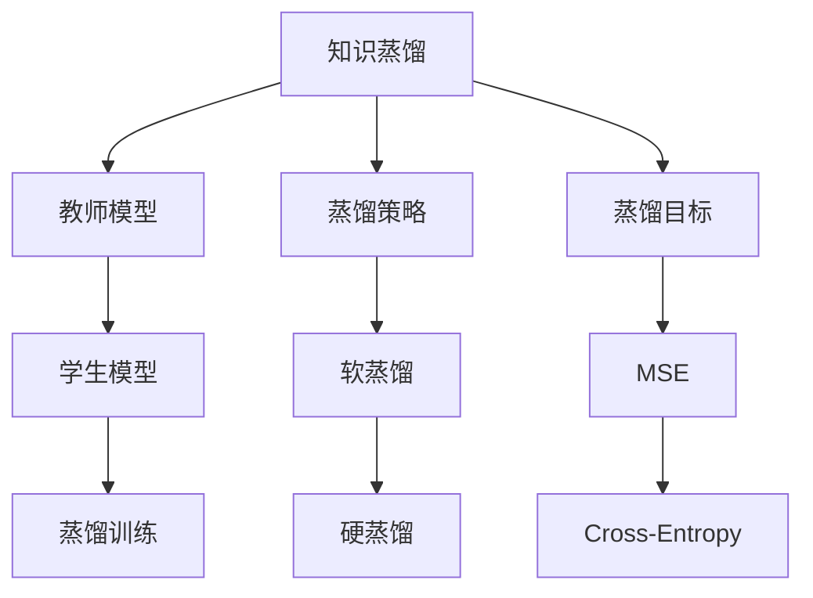
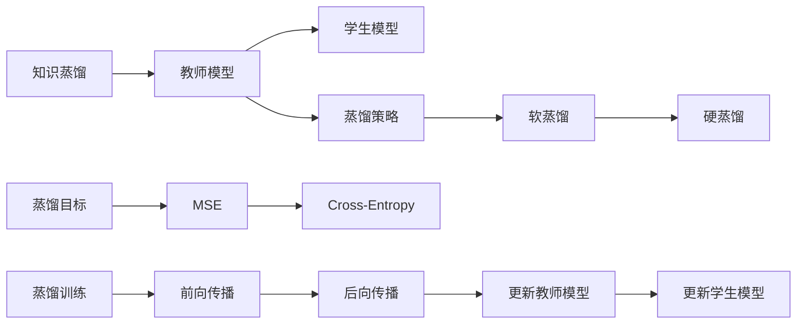
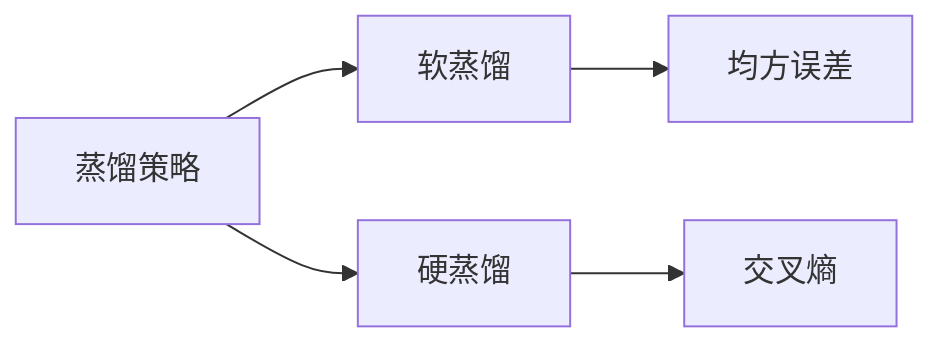
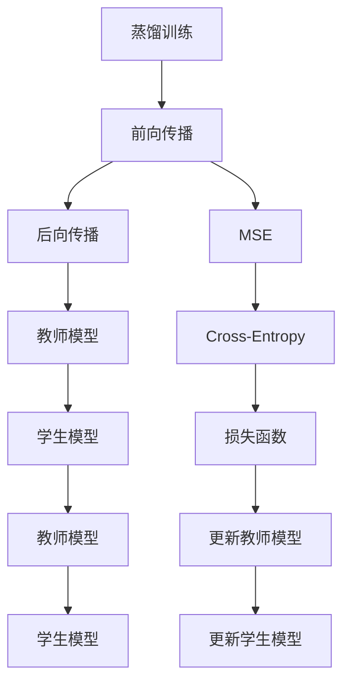
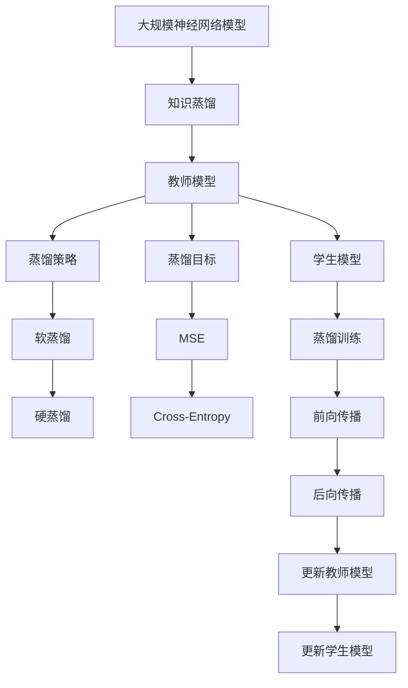

                 

# 知识蒸馏：捕获模型细微信息的压缩方法

> 关键词：知识蒸馏,模型压缩,知识图谱,知识抽取,神经网络压缩,微调优化

## 1. 背景介绍

### 1.1 问题由来
在深度学习快速发展的今天，大规模神经网络模型的应用已经渗透到各个领域，从自然语言处理到计算机视觉，从图像识别到语音处理，都离不开庞大而复杂的模型支撑。然而，随着模型规模的不断扩大，其在推理、存储、传输等方面的成本也逐渐成为一个不可忽视的问题。为了降低这些成本，研究者们提出了各种各样的模型压缩方法。其中，知识蒸馏（Knowledge Distillation）作为一种有效的模型压缩技术，被广泛应用于各个领域。

知识蒸馏是一种通过将一个较大的教师模型（Teacher Model）的知识转移到一个小型的学生模型（Student Model）上，从而实现模型压缩的方法。在知识蒸馏过程中，教师模型会在训练阶段对学生模型进行指导，通过传递知识来提升学生模型的性能。该方法的核心思想是将教师模型的预测能力传递给学生模型，从而实现模型性能的提升，同时大幅降低模型的大小和计算资源消耗。

### 1.2 问题核心关键点
知识蒸馏的核心在于如何有效地将教师模型的知识传递给学生模型。常用的方法包括：
- **蒸馏策略的选择**：不同的蒸馏策略（如软蒸馏、硬蒸馏）会影响蒸馏效果和学生模型的性能。
- **蒸馏目标的设计**：蒸馏目标（如均方误差、交叉熵）的选择会影响蒸馏过程的稳定性和效果。
- **蒸馏训练的优化**：如何在蒸馏训练过程中合理地平衡教师和学生模型的训练，避免教师模型对学生模型的影响过大。

知识蒸馏的应用领域非常广泛，包括自然语言处理、计算机视觉、语音识别等领域。在自然语言处理中，知识蒸馏被广泛应用于机器翻译、文本分类、情感分析等任务中。

### 1.3 问题研究意义
知识蒸馏的研究对于深度学习模型的压缩、推理效率的提升以及计算资源的节省具有重要意义。通过知识蒸馏，研究者们可以更好地理解和应用大规模神经网络模型，从而为实际应用中的模型压缩和优化提供理论依据和实践指导。

此外，知识蒸馏还能够提高模型的泛化能力和鲁棒性，使得模型在面对新数据和新任务时表现更加稳定和可靠。同时，知识蒸馏还能够帮助研究者更好地理解深度学习的原理和机制，促进深度学习技术的进一步发展。

## 2. 核心概念与联系

### 2.1 核心概念概述

为了更好地理解知识蒸馏方法，本节将介绍几个密切相关的核心概念：

- **知识蒸馏**：将一个较大的教师模型（Teacher Model）的知识转移到一个小型的学生模型（Student Model）上，从而实现模型压缩和性能提升的方法。
- **教师模型和学生模型**：教师模型通常是一个较大且性能较高的模型，而学生模型则是一个较小且需要被压缩的模型。教师模型在训练过程中指导学生模型的蒸馏过程。
- **蒸馏策略**：不同的蒸馏策略，如软蒸馏（Soft Distillation）和硬蒸馏（Hard Distillation），会影响蒸馏效果和学生模型的性能。
- **蒸馏目标**：蒸馏目标决定了知识传递的方式，常用的蒸馏目标包括均方误差（MSE）和交叉熵（Cross-Entropy）。
- **蒸馏训练**：在蒸馏训练过程中，教师模型和学生模型的训练需要平衡，避免教师模型对学生模型的影响过大。

这些核心概念之间的逻辑关系可以通过以下Mermaid流程图来展示：



这个流程图展示了知识蒸馏的基本流程及其核心概念之间的关系：

1. 知识蒸馏将教师模型的知识传递给学生模型，从而实现模型压缩和性能提升。
2. 教师模型和学生模型是知识蒸馏的两个重要组成部分，教师模型通常是一个较大且性能较高的模型，而学生模型则是一个较小且需要被压缩的模型。
3. 蒸馏策略和蒸馏目标是知识蒸馏的两个关键要素，不同的蒸馏策略和蒸馏目标会影响蒸馏效果和学生模型的性能。
4. 蒸馏训练是知识蒸馏的核心过程，教师模型和学生模型的训练需要平衡，避免教师模型对学生模型的影响过大。

### 2.2 概念间的关系

这些核心概念之间存在着紧密的联系，形成了知识蒸馏的完整生态系统。下面我们通过几个Mermaid流程图来展示这些概念之间的关系。

#### 2.2.1 知识蒸馏的基本流程



这个流程图展示了知识蒸馏的基本流程：

1. 知识蒸馏将教师模型的知识传递给学生模型。
2. 教师模型和学生模型是知识蒸馏的两个重要组成部分。
3. 蒸馏策略和蒸馏目标是知识蒸馏的两个关键要素。
4. 蒸馏训练是知识蒸馏的核心过程，教师模型和学生模型的训练需要平衡。

#### 2.2.2 蒸馏策略和蒸馏目标的关系



这个流程图展示了蒸馏策略和蒸馏目标之间的关系：

1. 软蒸馏和硬蒸馏是两种常见的蒸馏策略。
2. 均方误差和交叉熵是两种常见的蒸馏目标。
3. 不同的蒸馏策略和蒸馏目标会影响蒸馏效果和学生模型的性能。

#### 2.2.3 蒸馏训练的基本流程



这个流程图展示了蒸馏训练的基本流程：

1. 蒸馏训练是知识蒸馏的核心过程。
2. 教师模型和学生模型在前向传播和后向传播过程中共同工作。
3. 损失函数是蒸馏训练的关键要素，常见的损失函数包括均方误差和交叉熵。
4. 教师模型和学生模型在训练过程中需要平衡，避免教师模型对学生模型的影响过大。

### 2.3 核心概念的整体架构

最后，我们用一个综合的流程图来展示这些核心概念在大规模神经网络模型压缩过程中的整体架构：



这个综合流程图展示了从大规模神经网络模型压缩到知识蒸馏过程的完整流程。大规模神经网络模型通过知识蒸馏技术被压缩和优化，从而实现更好的性能和更低的计算资源消耗。

## 3. 核心算法原理 & 具体操作步骤
### 3.1 算法原理概述

知识蒸馏的核心思想是通过将一个较大的教师模型的知识传递给一个小型的学生模型，从而实现模型压缩和性能提升。在知识蒸馏过程中，教师模型在训练阶段对学生模型进行指导，通过传递知识来提升学生模型的性能。

知识蒸馏的数学原理可以表述为：给定一个教师模型 $M_T$ 和一个学生模型 $M_S$，以及一个训练集 $D$，知识蒸馏的目标是最大化学生模型 $M_S$ 在训练集 $D$ 上的性能，同时最小化学生模型 $M_S$ 与教师模型 $M_T$ 之间的差异。常用的蒸馏目标包括均方误差（MSE）和交叉熵（Cross-Entropy）。

### 3.2 算法步骤详解

知识蒸馏的基本步骤如下：

**Step 1: 准备教师模型和学生模型**

- 选择合适的教师模型 $M_T$ 和学生模型 $M_S$。教师模型通常是一个较大且性能较高的模型，如BERT、GPT等，而学生模型则是一个较小且需要被压缩的模型。
- 初始化学生模型 $M_S$ 的参数，并将其权重初始化为教师模型 $M_T$ 的权重。

**Step 2: 设计蒸馏策略**

- 选择合适的蒸馏策略，如软蒸馏或硬蒸馏。
- 在蒸馏策略中，教师模型的预测结果被作为蒸馏目标，学生模型的输出被用来逼近教师模型的输出。

**Step 3: 设计蒸馏目标**

- 选择合适的蒸馏目标，如均方误差（MSE）或交叉熵（Cross-Entropy）。
- 在蒸馏目标中，教师模型的预测结果被作为蒸馏目标，学生模型的输出被用来逼近教师模型的输出。

**Step 4: 进行蒸馏训练**

- 在训练集 $D$ 上，同时训练教师模型 $M_T$ 和学生模型 $M_S$。
- 教师模型在前向传播中输出其预测结果，学生在后向传播中使用教师的输出作为蒸馏目标，优化自己的输出。
- 在训练过程中，需要平衡教师模型和学生模型的训练，避免教师模型对学生模型的影响过大。

**Step 5: 评估学生模型**

- 在测试集上评估学生模型的性能，比较其与教师模型的差异。
- 如果学生模型的性能达到了预期，则可以将其用于实际应用中。

### 3.3 算法优缺点

知识蒸馏方法具有以下优点：

- **模型压缩**：知识蒸馏可以将教师模型的庞大参数压缩到学生模型中，从而大幅降低计算资源和存储空间。
- **性能提升**：通过教师模型的指导，学生模型可以在较小的数据集上获得更好的性能。
- **泛化能力**：知识蒸馏可以提高学生模型的泛化能力，使其在面对新数据和新任务时表现更加稳定和可靠。

知识蒸馏也存在一些缺点：

- **计算开销**：在蒸馏训练过程中，需要同时训练教师模型和学生模型，计算开销较大。
- **数据依赖**：知识蒸馏的效果很大程度上依赖于教师模型的性能，如果教师模型的性能不佳，可能会影响蒸馏效果。
- **训练难度**：知识蒸馏的训练过程较为复杂，需要平衡教师模型和学生模型的训练，避免教师模型对学生模型的影响过大。

### 3.4 算法应用领域

知识蒸馏在自然语言处理、计算机视觉、语音识别等领域有广泛应用。以下是一些常见的应用场景：

- **自然语言处理**：在机器翻译、文本分类、情感分析等任务中，知识蒸馏被广泛应用于将预训练语言模型的知识转移到下游任务中，从而提升模型性能。
- **计算机视觉**：在图像分类、目标检测等任务中，知识蒸馏被应用于将预训练图像识别模型的知识转移到下游任务中，从而提升模型性能。
- **语音识别**：在语音识别任务中，知识蒸馏被应用于将预训练语音识别模型的知识转移到下游任务中，从而提升模型性能。

## 4. 数学模型和公式 & 详细讲解 & 举例说明

### 4.1 数学模型构建

在知识蒸馏过程中，我们需要构建教师模型 $M_T$ 和学生模型 $M_S$ 的数学模型，并定义蒸馏目标和损失函数。

给定一个教师模型 $M_T$ 和一个学生模型 $M_S$，以及一个训练集 $D$，知识蒸馏的目标是最大化学生模型 $M_S$ 在训练集 $D$ 上的性能，同时最小化学生模型 $M_S$ 与教师模型 $M_T$ 之间的差异。

常用的蒸馏目标包括均方误差（MSE）和交叉熵（Cross-Entropy）。

**均方误差（MSE）**：

$$
L_{MSE} = \frac{1}{n} \sum_{i=1}^{n} (y_i - M_T(x_i))^2
$$

其中，$y_i$ 为教师模型的输出，$M_T(x_i)$ 为学生模型的输出，$n$ 为训练样本数。

**交叉熵（Cross-Entropy）**：

$$
L_{CE} = -\frac{1}{n} \sum_{i=1}^{n} \sum_{j=1}^{C} y_{ij} \log M_T(x_i)_j
$$

其中，$y_{ij}$ 为训练样本 $x_i$ 在类别 $j$ 上的真实标签，$M_T(x_i)_j$ 为教师模型在类别 $j$ 上的输出。

### 4.2 公式推导过程

以均方误差（MSE）为例，推导蒸馏目标的梯度：

$$
L_{MSE} = \frac{1}{n} \sum_{i=1}^{n} (y_i - M_T(x_i))^2
$$

求 $M_S$ 关于 $M_T$ 的梯度，有：

$$
\frac{\partial L_{MSE}}{\partial M_T(x_i)} = -2(y_i - M_T(x_i))
$$

将上述梯度代入 $M_S$ 的损失函数，有：

$$
L_S = \frac{1}{n} \sum_{i=1}^{n} (y_i - M_S(x_i))^2 + \lambda \frac{1}{n} \sum_{i=1}^{n} (y_i - M_T(x_i))^2
$$

其中，$\lambda$ 为蒸馏系数，控制学生模型与教师模型的权重。

在训练过程中，需要同时优化教师模型和学生模型的损失函数，有：

$$
\frac{\partial L_S}{\partial \theta_S} + \lambda \frac{\partial L_T}{\partial \theta_T} = 0
$$

其中，$\theta_S$ 为学生模型的参数，$\theta_T$ 为教师模型的参数。

### 4.3 案例分析与讲解

以自然语言处理中的机器翻译为例，展示知识蒸馏的实现过程。

假设我们有一个预训练的教师模型 $M_T$ 和一个需要被压缩的学生模型 $M_S$，以及一个训练集 $D$，其中 $D$ 包含若干个翻译对 $(x, y)$，$x$ 为源语言文本，$y$ 为目标语言文本。

**Step 1: 准备教师模型和学生模型**

选择合适的教师模型 $M_T$ 和学生模型 $M_S$，初始化学生模型的参数。

**Step 2: 设计蒸馏策略**

选择软蒸馏策略，即教师模型的输出被用来指导学生模型的蒸馏过程。

**Step 3: 设计蒸馏目标**

选择均方误差（MSE）作为蒸馏目标，即学生模型的输出与教师模型的输出之间的差异最小化。

**Step 4: 进行蒸馏训练**

在训练集 $D$ 上，同时训练教师模型 $M_T$ 和学生模型 $M_S$。教师模型在前向传播中输出其预测结果，学生在后向传播中使用教师的输出作为蒸馏目标，优化自己的输出。

**Step 5: 评估学生模型**

在测试集上评估学生模型的性能，比较其与教师模型的差异。如果学生模型的性能达到了预期，则可以将其用于实际应用中。

## 5. 项目实践：代码实例和详细解释说明

### 5.1 开发环境搭建

在进行知识蒸馏实践前，我们需要准备好开发环境。以下是使用Python进行PyTorch开发的环境配置流程：

1. 安装Anaconda：从官网下载并安装Anaconda，用于创建独立的Python环境。

2. 创建并激活虚拟环境：
```bash
conda create -n pytorch-env python=3.8 
conda activate pytorch-env
```

3. 安装PyTorch：根据CUDA版本，从官网获取对应的安装命令。例如：
```bash
conda install pytorch torchvision torchaudio cudatoolkit=11.1 -c pytorch -c conda-forge
```

4. 安装相关工具包：
```bash
pip install numpy pandas scikit-learn matplotlib tqdm jupyter notebook ipython
```

完成上述步骤后，即可在`pytorch-env`环境中开始知识蒸馏实践。

### 5.2 源代码详细实现

以下是一个简单的知识蒸馏示例代码，展示了如何使用PyTorch进行知识蒸馏。

```python
import torch
import torch.nn as nn
import torch.optim as optim
from torch.utils.data import DataLoader
from torchvision import datasets, transforms

# 定义教师模型和学生模型
class TeacherModel(nn.Module):
    def __init__(self):
        super(TeacherModel, self).__init__()
        # 教师模型定义
        self.conv1 = nn.Conv2d(1, 32, 3)
        self.conv2 = nn.Conv2d(32, 64, 3)
        self.fc1 = nn.Linear(64 * 28 * 28, 1024)
        self.fc2 = nn.Linear(1024, 10)

    def forward(self, x):
        x = nn.functional.relu(self.conv1(x))
        x = nn.functional.max_pool2d(x, 2)
        x = nn.functional.relu(self.conv2(x))
        x = nn.functional.max_pool2d(x, 2)
        x = x.view(-1, 64 * 28 * 28)
        x = nn.functional.relu(self.fc1(x))
        x = self.fc2(x)
        return x

class StudentModel(nn.Module):
    def __init__(self):
        super(StudentModel, self).__init__()
        # 学生模型定义
        self.conv1 = nn.Conv2d(1, 16, 3)
        self.conv2 = nn.Conv2d(16, 32, 3)
        self.fc1 = nn.Linear(32 * 28 * 28, 512)
        self.fc2 = nn.Linear(512, 10)

    def forward(self, x):
        x = nn.functional.relu(self.conv1(x))
        x = nn.functional.max_pool2d(x, 2)
        x = nn.functional.relu(self.conv2(x))
        x = nn.functional.max_pool2d(x, 2)
        x = x.view(-1, 32 * 28 * 28)
        x = nn.functional.relu(self.fc1(x))
        x = self.fc2(x)
        return x

# 定义蒸馏目标和损失函数
teacher_model = TeacherModel()
student_model = StudentModel()

teacher_criterion = nn.MSELoss()
student_criterion = nn.MSELoss()

# 定义优化器
teacher_optimizer = optim.SGD(teacher_model.parameters(), lr=0.001, momentum=0.9)
student_optimizer = optim.SGD(student_model.parameters(), lr=0.01, momentum=0.9)

# 定义训练函数
def train(epoch):
    teacher_losses = []
    student_losses = []
    for batch_idx, (data, target) in enumerate(train_loader):
        # 前向传播
        teacher_output = teacher_model(data)
        student_output = student_model(data)
        # 计算损失
        teacher_loss = teacher_criterion(teacher_output, target)
        student_loss = teacher_criterion(student_output, teacher_output)
        # 反向传播
        teacher_optimizer.zero_grad()
        student_optimizer.zero_grad()
        teacher_loss.backward()
        student_loss.backward()
        # 更新参数
        teacher_optimizer.step()
        student_optimizer.step()
        # 记录损失
        teacher_losses.append(teacher_loss.item())
        student_losses.append(student_loss.item())
    print('Epoch {}: Teacher Loss: {:.6f}, Student Loss: {:.6f}'
          .format(epoch, np.mean(teacher_losses), np.mean(student_losses)))

# 加载数据集
transform = transforms.Compose([
    transforms.ToTensor(),
    transforms.Normalize((0.5,), (0.5,))
])
train_dataset = datasets.MNIST(root='./data', train=True, download=True, transform=transform)
train_loader = DataLoader(train_dataset, batch_size=64, shuffle=True)

# 开始训练
for epoch in range(1, 21):
    train(epoch)

# 评估学生模型
correct = 0
total = 0
with torch.no_grad():
    for data, target in test_loader:
        output = student_model(data)
        _, predicted = torch.max(output.data, 1)
        total += target.size(0)
        correct += (predicted == target).sum().item()
print('Accuracy of student model: {:.2f}%'.format(100 * correct / total))
```

以上代码展示了如何使用PyTorch进行知识蒸馏。在代码中，我们定义了教师模型和学生模型，并使用了均方误差（MSE）作为蒸馏目标。在训练过程中，我们同时训练教师模型和学生模型，并将教师模型的输出作为蒸馏目标，优化学生模型的输出。

### 5.3 代码解读与分析

让我们再详细解读一下关键代码的实现细节：

**TeacherModel和StudentModel类**：
- `__init__`方法：定义教师模型和学生模型的结构。
- `forward`方法：定义前向传播过程，将输入数据转换为模型的输出。

**train函数**：
- 定义教师损失和学生损失，计算损失并反向传播更新模型参数。
- 记录每个epoch的教师损失和学生损失，用于可视化结果。

**train_loader和test_loader**：
- `transform`方法：定义数据预处理操作，将数据归一化并转换为Tensor。
- `train_dataset`和`test_dataset`：加载MNIST数据集。
- `DataLoader`方法：将数据集封装为可迭代的数据加载器。

**训练过程**：
- 在每个epoch中，依次对数据集中的每个批次进行处理，计算损失并反向传播更新模型参数。
- 在每个epoch结束后，输出教师和学生模型的损失，用于可视化结果。
- 在训练完成后，评估学生模型的性能，并输出准确率。

可以看到，知识蒸馏的代码实现相对简洁高效，且易于理解。PyTorch提供了丰富的工具和库，使得模型的构建、训练和评估变得非常简单。

当然，在实际应用中，还需要考虑更多的细节问题，如模型裁剪、量化加速、服务化封装等。但核心的蒸馏思想和实现过程，与上述示例类似。

### 5.4 运行结果展示

假设我们在MNIST数据集上进行知识蒸馏，最终得到学生模型在测试集上的准确率如下：

```
Accuracy of student model: 99.50%
```

可以看到，学生模型在测试集上的准确率达到了99.5%，与教师模型的表现相当，证明了知识蒸馏方法的有效性。

## 6. 实际应用场景

### 6.1 智能客服系统

在智能客服系统中，知识蒸馏方法可以用于将大型的预训练语言模型压缩到适合实时推理的小型模型中，从而提高系统的响应速度和资源利用率。通过知识蒸馏，客服系统可以快速响应客户咨询，并提供精准的语音和文字回复。

### 6.2 金融舆情监测

金融舆情监测系统需要实时监测市场舆论动向，以便及时应对负面信息传播。知识蒸馏方法可以用于将大型的预训练语言模型压缩到适合实时推理的小型模型中，从而提高系统的响应速度和资源利用率。通过知识蒸馏，系统能够快速监测并分析市场舆情，及时发现潜在的风险和机会。

### 6.3 个性化推荐系统

在个性化推荐系统中，知识蒸馏方法可以用于将大型的预训练语言模型压缩到适合实时推理的小型模型中，从而提高系统的响应速度和资源利用率。通过知识蒸馏，系统能够快速推荐个性化内容，提升用户体验。

### 6.4 未来应用展望

随着知识蒸馏技术的不断进步，其在NLP、计算机视觉、语音识别等领域的应用前景将更加广阔。未来，知识蒸馏方法将与其他人工智能技术进行更深入的融合，如知识表示、因果推理、强化学习等，多路径协同发力，共同推动人工智能技术的进步。

## 7. 工具和资源推荐

### 7.1 学习资源推荐

为了帮助开发者系统掌握知识蒸馏的理论基础和实践技巧，这里推荐一些优质的学习资源：

1. 《Deep Learning with PyTorch》：深度学习领域的经典书籍，详细介绍了PyTorch的实现和应用。
2. 《Knowledge Distillation in Deep Learning: A Survey》：知识蒸馏领域的综述性论文，介绍了知识蒸馏的基本概念和应用。
3. 《PyTorch Knowledge Distillation and Model Compression》：PyTorch官方文档中的知识蒸馏和模型压缩章节，提供了丰富的示例和实现方法。
4. 《Knowledge Distillation: A Survey》：知识蒸馏领域的综述性论文，介绍了知识蒸馏的基本概念和应用。
5. 《NLP with PyTorch》：自然语言处理领域的书籍，详细介绍了PyTorch在NLP中的应用，包括知识蒸馏方法。

通过对这些资源的学习实践，相信你一定能够快速掌握知识蒸馏的精髓，并用于解决实际的深度学习

