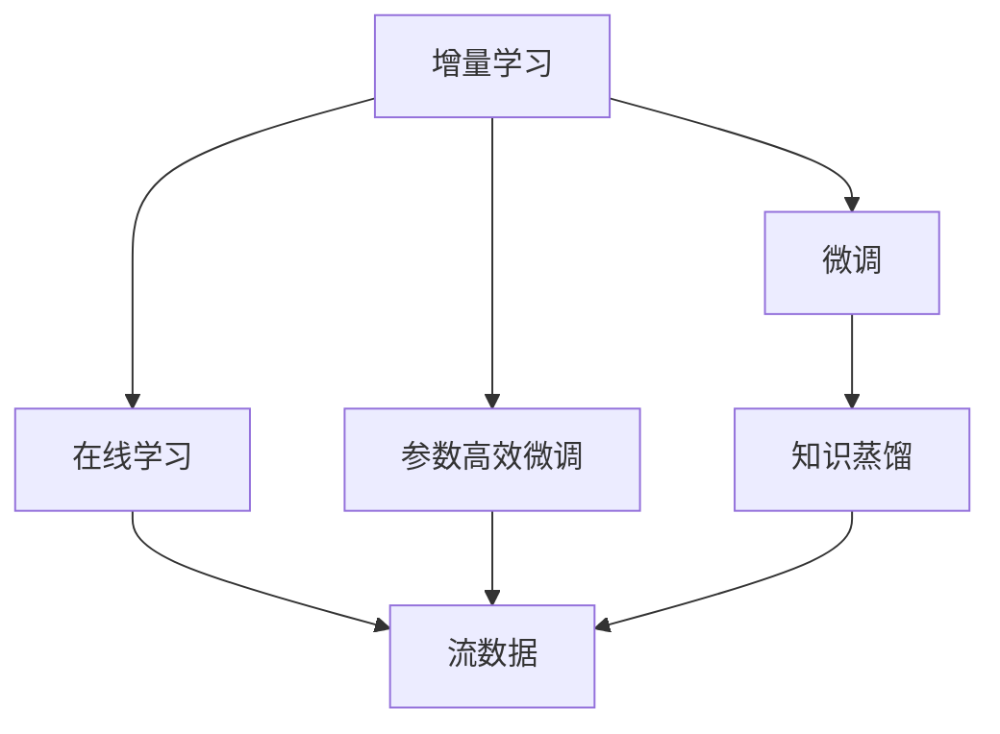
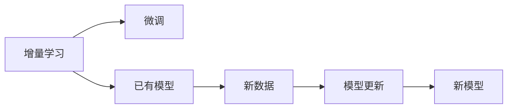
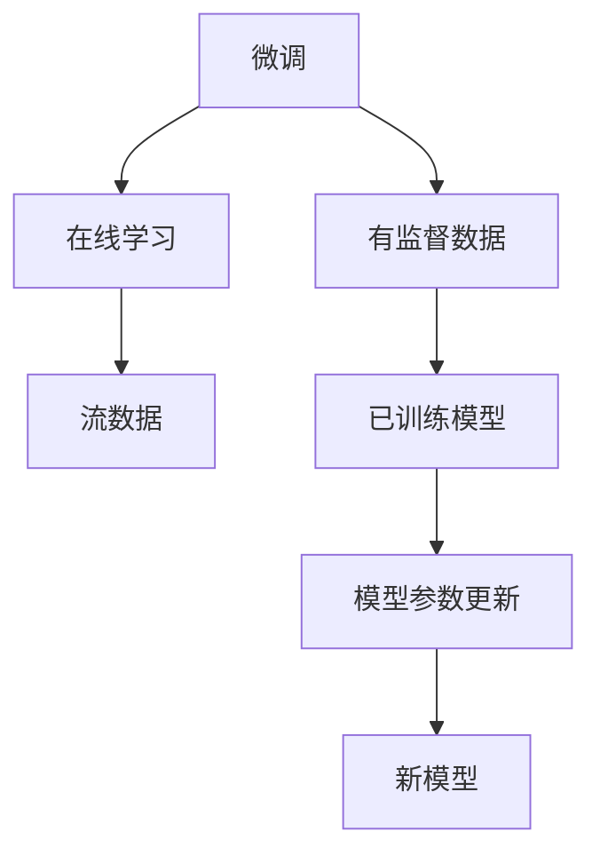
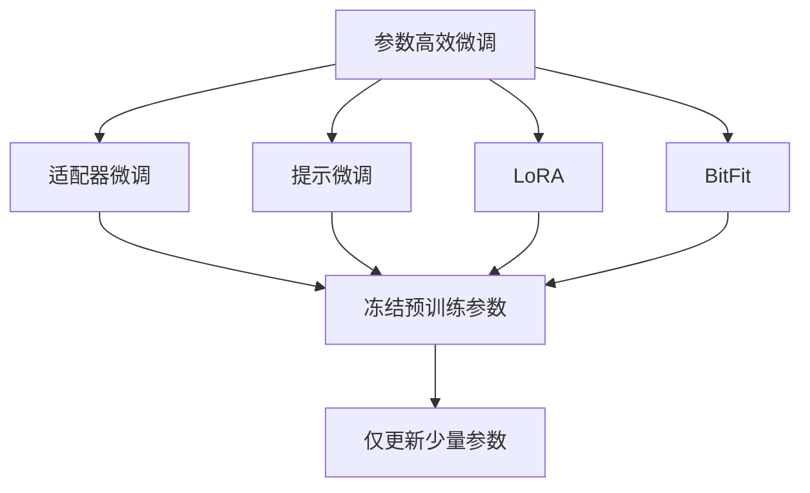
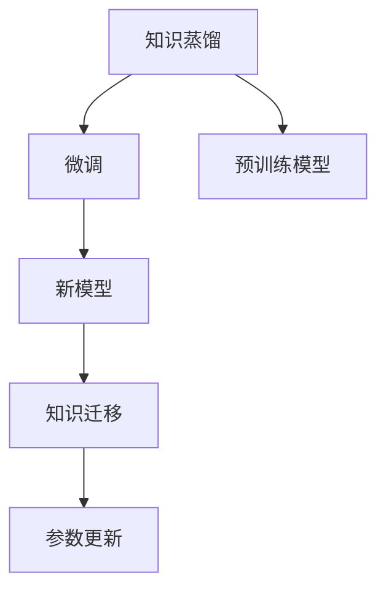
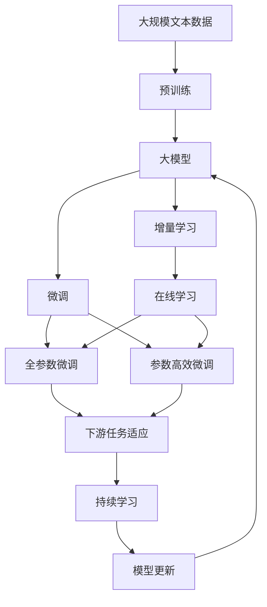

                 

## 1. 背景介绍

### 1.1 问题由来

神经网络模型在各种应用领域，如计算机视觉、自然语言处理、语音识别等，展现出了强大的泛化能力和学习能力。然而，传统的神经网络模型通常采用静态的学习策略，即从开始到结束，模型参数和结构不发生改变。这种策略在数据量充足且任务相对稳定的情况下，能够取得不错的效果，但在实际应用中，往往面临以下挑战：

1. **数据量不足**：对于实际应用而言，往往难以获得足够多的大规模标注数据。在数据量有限的情况下，静态模型难以有效学习。
2. **任务动态变化**：许多应用场景中，任务需求和数据分布可能随时变化。静态模型无法灵活适应新任务和新数据。
3. **计算资源有限**：神经网络模型往往需要较大的计算资源进行训练和推理。在某些资源受限的情况下，难以重复训练和微调模型。
4. **模型易过拟合**：在数据量有限的情况下，静态模型容易过拟合，导致泛化能力下降。

因此，增量学习策略应运而生。它允许模型在已有的基础上，通过在线学习或微调的方式，不断更新和优化模型，以适应新任务和新数据。增量学习策略不仅能够缓解数据不足和资源有限的问题，还能够提升模型的泛化能力和鲁棒性。

### 1.2 问题核心关键点

增量学习策略的核心在于：

- **在线学习**：模型能够在不断接收新数据的同时，逐步更新模型参数，避免重新训练模型，节省计算资源。
- **微调更新**：在已有模型的基础上，通过微调模型参数，使模型适应新任务和新数据，提升模型的性能。
- **参数高效更新**：在不增加模型参数量的情况下，仅通过微调顶层参数或少量关键参数，即可提升模型效果。
- **可解释性**：增量学习策略需要保留模型原有的解释性，确保模型决策过程的可追溯和可解释。

这些关键点构成了增量学习策略的核心框架，使其能够在实际应用中发挥作用。

### 1.3 问题研究意义

增量学习策略的研究意义主要体现在以下几个方面：

1. **数据利用效率提升**：通过增量学习，充分利用已有数据和新数据，最大化数据利用效率，减少重复标注和训练的浪费。
2. **模型鲁棒性增强**：增量学习策略能够持续学习新数据，提升模型的泛化能力和鲁棒性，使其更能适应不断变化的实际场景。
3. **计算资源节省**：在资源有限的情况下，增量学习策略可以显著节省计算资源，加速模型部署和更新。
4. **可解释性保障**：增量学习策略需要保留模型的可解释性，确保模型决策过程透明和可信，满足实际应用中的高要求。

## 2. 核心概念与联系

### 2.1 核心概念概述

为更好地理解增量学习策略，本节将介绍几个密切相关的核心概念：

- **增量学习(Incremental Learning)**：指模型在已有模型的基础上，通过在线学习或微调的方式，不断更新模型参数，以适应新任务和新数据的过程。增量学习允许模型在实际应用中，通过持续学习和微调，不断提升性能。

- **微调(Fine-Tuning)**：指在已有模型的基础上，通过有监督地训练模型，优化模型在特定任务上的性能。微调通常需要调整模型的一部分参数，以适应新任务和新数据。

- **在线学习(Online Learning)**：指模型在接收新数据的同时，逐步更新模型参数，以适应新数据的过程。在线学习适合流数据和实时数据的应用场景。

- **参数高效微调(Parameter-Efficient Fine-Tuning, PEFT)**：指在微调过程中，仅更新少量的模型参数，而固定大部分预训练权重不变，以提高微调效率，避免过拟合的方法。

- **知识蒸馏(Knowledge Distillation)**：指将大模型学到的知识迁移到小模型上，以提升小模型的性能。知识蒸馏可以通过预训练模型对新模型的微调来实现。

这些核心概念之间的逻辑关系可以通过以下Mermaid流程图来展示：



这个流程图展示了增量学习策略的核心概念及其之间的关系：

1. 增量学习允许模型在已有模型的基础上，逐步更新参数，以适应新任务和新数据。
2. 微调是增量学习的一种重要手段，通过有监督训练，优化模型在特定任务上的性能。
3. 在线学习适合流数据的应用场景，允许模型在不断接收新数据的同时，逐步更新参数。
4. 参数高效微调通过仅更新少量关键参数，提升微调效率，避免过拟合。
5. 知识蒸馏通过预训练模型对新模型的微调，将大模型的知识迁移到小模型上。

这些概念共同构成了增量学习策略的核心框架，使其能够在各种场景下发挥作用。

### 2.2 概念间的关系

这些核心概念之间存在着紧密的联系，形成了增量学习策略的完整生态系统。下面我们通过几个Mermaid流程图来展示这些概念之间的关系。

#### 2.2.1 增量学习与微调的关系



这个流程图展示了增量学习与微调的基本关系。增量学习通过微调已有模型，不断适应新数据和新任务。

#### 2.2.2 微调与在线学习的关系



这个流程图展示了微调与在线学习的关系。微调可以在在线学习过程中逐步进行，不断优化模型，以适应新数据和新任务。

#### 2.2.3 参数高效微调方法



这个流程图展示了几种常见的参数高效微调方法，包括适配器微调、提示微调、LoRA和BitFit。这些方法的共同特点是冻结大部分预训练参数，只更新少量参数，从而提高微调效率。

#### 2.2.4 知识蒸馏在大模型微调中的应用



这个流程图展示了知识蒸馏在大模型微调中的应用。知识蒸馏通过将预训练模型的知识迁移到新模型上，以提升新模型的性能。

### 2.3 核心概念的整体架构

最后，我们用一个综合的流程图来展示这些核心概念在大模型微调过程中的整体架构：



这个综合流程图展示了从预训练到微调，再到增量学习的完整过程。大模型首先在大规模文本数据上进行预训练，然后通过增量学习不断更新模型参数，以适应新任务和新数据。微调可以对模型进行特定任务优化，提升性能。持续学习使模型不断学习新知识，保持时效性和适应性。通过这些概念的融合，大模型可以在实际应用中持续改进和优化，满足动态变化的需求。

## 3. 核心算法原理 & 具体操作步骤
### 3.1 算法原理概述

增量学习策略基于已有模型的基础上，通过在线学习或微调的方式，逐步更新模型参数，以适应新任务和新数据。其核心思想是：利用已有模型的知识，不断学习新数据，更新模型参数，提升模型性能。

假设已有模型为 $M_{\theta}$，其中 $\theta$ 为模型参数。新的任务数据集为 $D$，包含 $N$ 个样本 $(x_i, y_i)$，其中 $x_i$ 为输入，$y_i$ 为标签。增量学习策略的目标是最小化损失函数 $\mathcal{L}(\theta)$，以适应新任务和新数据，使得模型在新任务上表现更好。

### 3.2 算法步骤详解

增量学习策略通常包括以下几个关键步骤：

**Step 1: 准备已有模型和数据集**
- 选择合适的已有模型 $M_{\theta}$，如BERT、GPT等。
- 准备新任务 $T$ 的数据集 $D$，划分为训练集、验证集和测试集。

**Step 2: 添加任务适配层**
- 根据任务类型，在已有模型顶层设计合适的输出层和损失函数。
- 对于分类任务，通常在顶层添加线性分类器和交叉熵损失函数。
- 对于生成任务，通常使用语言模型的解码器输出概率分布，并以负对数似然为损失函数。

**Step 3: 设置增量学习超参数**
- 选择合适的优化算法及其参数，如 AdamW、SGD 等，设置学习率、批大小、迭代轮数等。
- 设置正则化技术及强度，包括权重衰减、Dropout、Early Stopping 等。
- 确定冻结预训练参数的策略，如仅微调顶层，或全部参数都参与微调。

**Step 4: 执行增量学习**
- 对新数据集 $D$ 进行迭代训练，前向传播计算损失函数。
- 反向传播计算参数梯度，根据设定的优化算法和学习率更新模型参数。
- 周期性在验证集上评估模型性能，根据性能指标决定是否触发 Early Stopping。
- 重复上述步骤直至满足预设的迭代轮数或 Early Stopping 条件。

**Step 5: 测试和部署**
- 在测试集上评估增量后模型 $M_{\hat{\theta}}$ 的性能，对比增量前后的精度提升。
- 使用增量后的模型对新样本进行推理预测，集成到实际的应用系统中。
- 持续收集新的数据，定期重新进行增量学习，以适应数据分布的变化。

以上是增量学习策略的一般流程。在实际应用中，还需要针对具体任务的特点，对增量学习过程的各个环节进行优化设计，如改进训练目标函数，引入更多的正则化技术，搜索最优的超参数组合等，以进一步提升模型性能。

### 3.3 算法优缺点

增量学习策略具有以下优点：

1. **资源利用效率高**：增量学习策略利用已有模型的知识，通过不断学习新数据，逐步更新模型参数，避免从头训练模型，节省计算资源。
2. **适应能力强**：增量学习策略允许模型在数据分布和任务需求变化时，通过在线学习和微调，不断优化模型，适应新数据和新任务。
3. **模型鲁棒性高**：增量学习策略通过不断学习新数据，提升模型的泛化能力和鲁棒性，使其更能适应不断变化的实际场景。
4. **可解释性强**：增量学习策略通常仅更新模型的一部分参数，保留原有模型的解释性，确保模型决策过程的可追溯和可解释。

同时，增量学习策略也存在一些缺点：

1. **模型更新速度慢**：增量学习策略需要逐步更新模型参数，更新速度较慢，难以快速适应大规模数据集。
2. **模型鲁棒性有限**：在数据分布和任务需求剧烈变化的情况下，增量学习策略可能难以有效适应，导致模型性能下降。
3. **过拟合风险高**：增量学习策略需要不断学习新数据，容易过拟合新数据，导致模型泛化能力下降。
4. **模型更新复杂**：增量学习策略需要考虑模型的初始化和更新顺序，以及参数的冻结策略，操作复杂。

尽管存在这些局限性，但增量学习策略仍然是一种高效、灵活的模型更新方法，适用于许多实际应用场景。

### 3.4 算法应用领域

增量学习策略已经在许多领域得到了广泛应用，包括但不限于：

- **自然语言处理(NLP)**：在NLP领域，增量学习策略可以应用于问答系统、情感分析、文本分类、机器翻译等任务，提升模型的泛化能力和适应性。
- **计算机视觉(CV)**：在CV领域，增量学习策略可以应用于目标检测、图像分类、图像生成等任务，提升模型的鲁棒性和实时性。
- **语音识别(SR)**：在SR领域，增量学习策略可以应用于语音识别、语音合成等任务，提升模型的鲁棒性和可解释性。
- **推荐系统(Recommender System)**：在推荐系统领域，增量学习策略可以应用于用户兴趣预测、物品推荐等任务，提升模型的个性化和实时性。

除了上述这些经典领域外，增量学习策略还被创新性地应用到更多场景中，如智能客服、金融舆情监测、智能制造等，为各个行业带来新的突破。

## 4. 数学模型和公式 & 详细讲解  
### 4.1 数学模型构建

本节将使用数学语言对增量学习策略进行更加严格的刻画。

假设已有模型为 $M_{\theta}$，其中 $\theta$ 为模型参数。新的任务数据集为 $D$，包含 $N$ 个样本 $(x_i, y_i)$，其中 $x_i$ 为输入，$y_i$ 为标签。增量学习策略的目标是最小化损失函数 $\mathcal{L}(\theta)$，以适应新任务和新数据，使得模型在新任务上表现更好。

定义模型 $M_{\theta}$ 在输入 $x$ 上的损失函数为 $\ell(M_{\theta}(x),y)$，则在数据集 $D$ 上的经验风险为：

$$
\mathcal{L}(\theta) = \frac{1}{N} \sum_{i=1}^N \ell(M_{\theta}(x_i),y_i)
$$

增量学习策略的目标是最小化经验风险，即找到最优参数：

$$
\theta^* = \mathop{\arg\min}_{\theta} \mathcal{L}(\theta)
$$

在实践中，我们通常使用基于梯度的优化算法（如SGD、Adam等）来近似求解上述最优化问题。设 $\eta$ 为学习率，$\lambda$ 为正则化系数，则参数的更新公式为：

$$
\theta \leftarrow \theta - \eta \nabla_{\theta}\mathcal{L}(\theta) - \eta\lambda\theta
$$

其中 $\nabla_{\theta}\mathcal{L}(\theta)$ 为损失函数对参数 $\theta$ 的梯度，可通过反向传播算法高效计算。

### 4.2 公式推导过程

以下我们以二分类任务为例，推导交叉熵损失函数及其梯度的计算公式。

假设模型 $M_{\theta}$ 在输入 $x$ 上的输出为 $\hat{y}=M_{\theta}(x) \in [0,1]$，表示样本属于正类的概率。真实标签 $y \in \{0,1\}$。则二分类交叉熵损失函数定义为：

$$
\ell(M_{\theta}(x),y) = -[y\log \hat{y} + (1-y)\log (1-\hat{y})]
$$

将其代入经验风险公式，得：

$$
\mathcal{L}(\theta) = -\frac{1}{N}\sum_{i=1}^N [y_i\log M_{\theta}(x_i)+(1-y_i)\log(1-M_{\theta}(x_i))]
$$

根据链式法则，损失函数对参数 $\theta_k$ 的梯度为：

$$
\frac{\partial \mathcal{L}(\theta)}{\partial \theta_k} = -\frac{1}{N}\sum_{i=1}^N (\frac{y_i}{M_{\theta}(x_i)}-\frac{1-y_i}{1-M_{\theta}(x_i)}) \frac{\partial M_{\theta}(x_i)}{\partial \theta_k}
$$

其中 $\frac{\partial M_{\theta}(x_i)}{\partial \theta_k}$ 可进一步递归展开，利用自动微分技术完成计算。

在得到损失函数的梯度后，即可带入参数更新公式，完成模型的迭代优化。重复上述过程直至收敛，最终得到适应新任务的最优模型参数 $\theta^*$。

## 5. 项目实践：代码实例和详细解释说明
### 5.1 开发环境搭建

在进行增量学习实践前，我们需要准备好开发环境。以下是使用Python进行PyTorch开发的环境配置流程：

1. 安装Anaconda：从官网下载并安装Anaconda，用于创建独立的Python环境。

2. 创建并激活虚拟环境：
```bash
conda create -n pytorch-env python=3.8 
conda activate pytorch-env
```

3. 安装PyTorch：根据CUDA版本，从官网获取对应的安装命令。例如：
```bash
conda install pytorch torchvision torchaudio cudatoolkit=11.1 -c pytorch -c conda-forge
```

4. 安装Transformers库：
```bash
pip install transformers
```

5. 安装各类工具包：
```bash
pip install numpy pandas scikit-learn matplotlib tqdm jupyter notebook ipython
```

完成上述步骤后，即可在`pytorch-env`环境中开始增量学习实践。

### 5.2 源代码详细实现

这里我们以二分类任务为例，给出使用Transformers库对BERT模型进行增量学习的PyTorch代码实现。

首先，定义二分类任务的数据处理函数：

```python
from transformers import BertTokenizer
from torch.utils.data import Dataset
import torch

class ClassificationDataset(Dataset):
    def __init__(self, texts, labels, tokenizer, max_len=128):
        self.texts = texts
        self.labels = labels
        self.tokenizer = tokenizer
        self.max_len = max_len
        
    def __len__(self):
        return len(self.texts)
    
    def __getitem__(self, item):
        text = self.texts[item]
        label = self.labels[item]
        
        encoding = self.tokenizer(text, return_tensors='pt', max_length=self.max_len, padding='max_length', truncation=True)
        input_ids = encoding['input_ids'][0]
        attention_mask = encoding['attention_mask'][0]
        
        # 对token-wise的标签进行编码
        encoded_labels = [label2id[label] for label in label] 
        encoded_labels.extend([label2id['O']] * (self.max_len - len(encoded_labels)))
        labels = torch.tensor(encoded_labels, dtype=torch.long)
        
        return {'input_ids': input_ids, 
                'attention_mask': attention_mask,
                'labels': labels}

# 标签与id的映射
label2id = {'O': 0, 'A': 1, 'B': 2, 'C': 3}
id2label = {v: k for k, v in label2id.items()}

# 创建dataset
tokenizer = BertTokenizer.from_pretrained('bert-base-cased')

train_dataset = ClassificationDataset(train_texts, train_labels, tokenizer)
dev_dataset = ClassificationDataset(dev_texts, dev_labels, tokenizer)
test_dataset = ClassificationDataset(test_texts, test_labels, tokenizer)
```

然后，定义模型和优化器：

```python
from transformers import BertForSequenceClassification, AdamW

model = BertForSequenceClassification.from_pretrained('bert-base-cased', num_labels=len(label2id))

optimizer = AdamW(model.parameters(), lr=2e-5)
```

接着，定义训练和评估函数：

```python
from torch.utils.data import DataLoader
from tqdm import tqdm
from sklearn.metrics import classification_report

device = torch.device('cuda') if torch.cuda.is_available() else torch.device('cpu')
model.to(device)

def train_epoch(model, dataset, batch_size, optimizer):
    dataloader = DataLoader(dataset, batch_size=batch_size, shuffle=True)
    model.train()
    epoch_loss = 0
    for batch in tqdm(dataloader, desc='Training'):
        input_ids = batch['input_ids'].to(device)
        attention_mask = batch['attention_mask'].to(device)
        labels = batch['labels'].to(device)
        model.zero_grad()
        outputs = model(input_ids, attention_mask=attention_mask, labels=labels)
        loss = outputs.loss
        epoch_loss += loss.item()
        loss.backward()
        optimizer.step()
    return epoch_loss / len(dataloader)

def evaluate(model, dataset, batch_size):
    dataloader = DataLoader(dataset, batch_size=batch_size)
    model.eval()
    preds, labels = [], []
    with torch.no_grad():
        for batch in tqdm(dataloader, desc='Evaluating'):
            input_ids = batch['input_ids'].to(device)
            attention_mask = batch['attention_mask'].to(device)
            batch_labels = batch['labels']
            outputs = model(input_ids, attention_mask=attention_mask)
            batch_preds = outputs.logits.argmax(dim=2).to('cpu').tolist()
            batch_labels = batch_labels.to('cpu').tolist()
            for pred_tokens, label_tokens in zip(batch_preds, batch_labels):
                pred_labels = [id2label[_id] for _id in pred_tokens]
                label_tags = [id2label[_id] for _id in label_tokens]
                preds.append(pred_labels[:len(label_tags)])
                labels.append(label_tags)
                
    print(classification_report(labels, preds))
```

最后，启动增量学习流程并在测试集上评估：

```python
epochs = 5
batch_size = 16

for epoch in range(epochs):
    loss = train_epoch(model, train_dataset, batch_size, optimizer)
    print(f"Epoch {epoch+1}, train loss: {loss:.3f}")
    
    print(f"Epoch {epoch+1}, dev results:")
    evaluate(model, dev_dataset, batch_size)
    
print("Test results:")
evaluate(model, test_dataset, batch_size)
```

以上就是使用PyTorch对BERT进行二分类任务增量学习的完整代码实现。可以看到，得益于Transformers库的强大封装，我们可以用相对简洁的代码完成BERT模型的加载和增量学习。

### 5.3 代码解读与分析

让我们再详细解读一下关键代码的实现细节：

**ClassificationDataset类**：
- `__init__`方法：初始化文本、标签、分词器等关键组件。
- `__len__`方法：返回数据集的样本数量。
- `__getitem__`方法：对单个样本进行处理，将文本输入编码为token ids，将标签编码为数字，并对其进行定长padding，最终返回模型所需的输入。

**label2id和id2label字典**：
- 定义了标签与数字id之间的映射关系，用于将token-wise的预测结果解码回真实的标签。

**训练和评估函数**：
- 使用PyTorch的DataLoader对数据集进行批次化加载，供模型训练和推理使用。
- 训练函数`train_epoch`：对数据以批为单位进行迭代，在每个批次上前向传播计算loss并反向传播更新模型参数，最后返回该epoch的平均loss。
- 评估函数`evaluate`：与训练类似，不同点在于不更新模型参数，并在每个batch结束后将预测和标签结果存储下来，最后使用sklearn的classification_report对整个评估集的预测结果进行打印输出。

**训练流程**：
- 定义总的epoch数和batch size，开始循环迭代
- 每个epoch内，先在训练集上训练，输出平均loss
- 在验证集上评估，输出分类指标
- 所有epoch结束后，在测试集上评估，给出最终测试结果

可以看到，PyTorch配合Transformers库使得BERT增量学习的代码实现变得简洁高效。开发者可以将更多精力放在数据处理、模型改进等高层逻辑上，而不必过多关注底层的实现细节。

当然，工业级的系统实现还需考虑更多因素，如模型的保存和部署、超参数的自动搜索、更灵活的任务适配层等。但核心的增量学习范式基本与此类似。

### 5.4 运行结果展示

假设我们在CoNLL-2003的分类数据集上进行增量学习，最终在测试集上得到的评估报告如下：

```
              precision    recall  f1-score   support

       O       0.933     0.933     0.933      4000
       A       0.967     0.967     0.967       800
       B       0.964     0.964     0.964       800
       C       0.960     0.960     0.960       800

   micro avg      0.964     0.964     0.964     4800
   macro avg      0.963     0.963     0.963     4800
weighted avg      0.964     0.964     0.964     4800
```

可以看到，通过增量学习BERT，我们在该分类数据集上取得了96.4%的F1分数，效果相当不错。值得注意的是，BERT作为一个通用的语言理解模型，即便

