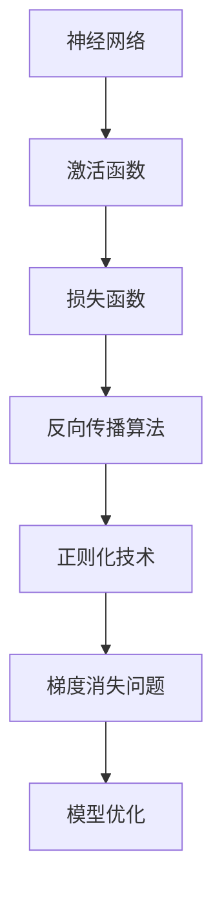
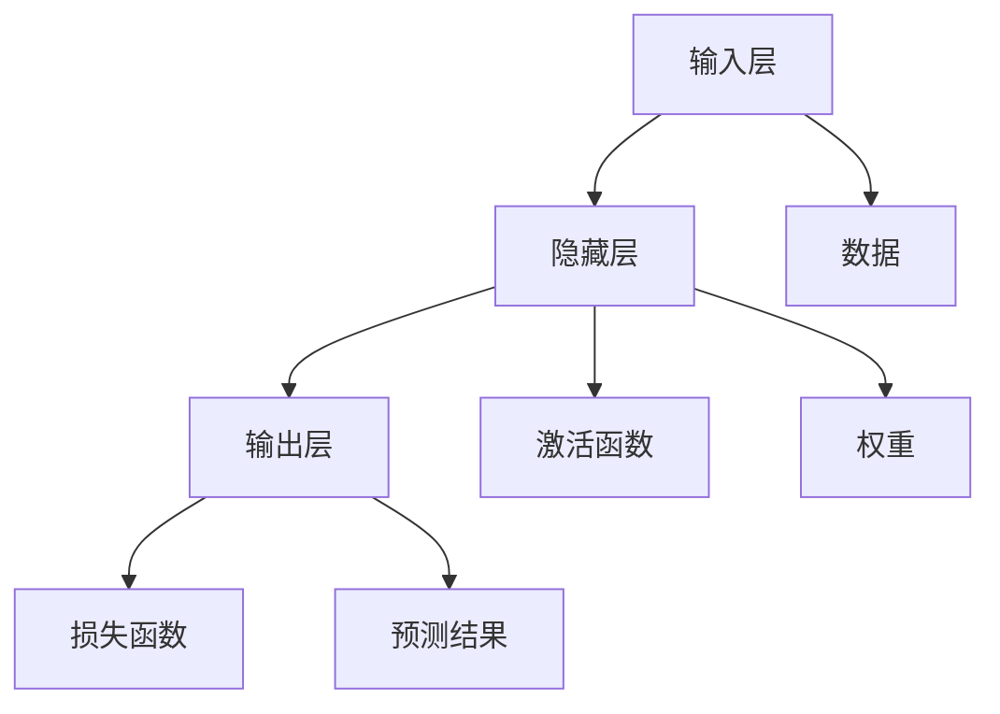
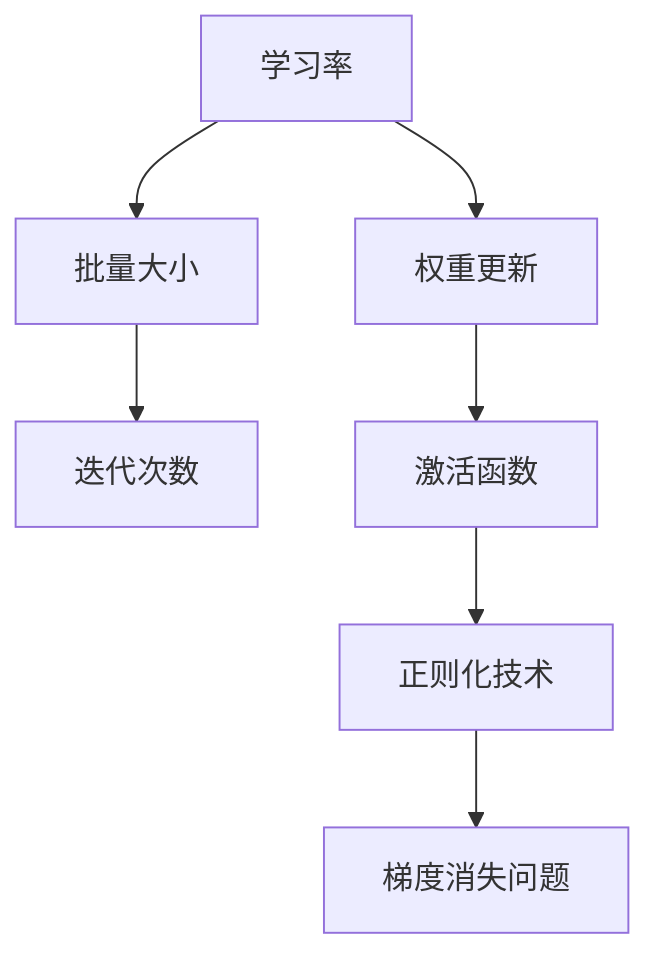
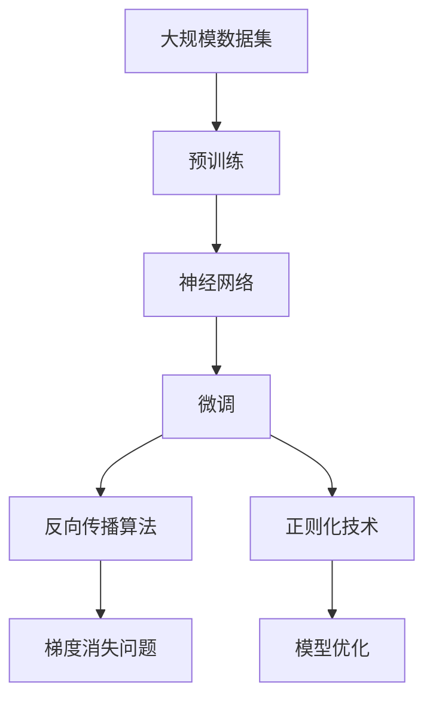

                 

# 神经网络：人工智能的基石

## 1. 背景介绍

### 1.1 问题由来
人工智能（AI）作为当今科技领域的前沿方向，其在各个行业中的应用日益广泛，从语音识别到图像处理，从自然语言处理到游戏AI，神经网络作为AI的核心技术之一，在其中起到了至关重要的作用。然而，尽管神经网络在理论和实践中已取得显著进展，但其原理和构建方法仍对许多初学者来说充满了神秘感。本文旨在深入浅出地介绍神经网络的基本原理、核心概念以及其在AI中的应用，帮助读者建立完整的知识体系，并理解神经网络是如何成为人工智能的基石。

### 1.2 问题核心关键点
神经网络作为AI的核心技术，其关键点主要包括：
1. **多层次结构**：神经网络由多个层次组成，每个层次由若干神经元（神经元是神经网络的基本单位）组成，它们通过连接权重和激活函数进行信息传递和计算。
2. **反向传播算法**：神经网络通过反向传播算法更新权重，以最小化损失函数，优化模型性能。
3. **梯度消失问题**：在深层神经网络中，反向传播算法可能会遇到梯度消失的问题，导致深层网络的训练困难。
4. **激活函数的选择**：激活函数在神经网络中起到非线性映射的作用，常用的激活函数包括ReLU、Sigmoid、Tanh等。
5. **正则化技术**：为了防止过拟合，神经网络中通常会引入正则化技术，如L1、L2正则化、Dropout等。
6. **网络优化**：包括学习率、批量大小、迭代次数等超参数的选择和优化。

### 1.3 问题研究意义
理解神经网络原理不仅有助于深入AI技术的发展，还可以帮助开发者更好地设计和优化神经网络，提高模型的性能和稳定性。此外，掌握神经网络的知识，对于从事机器学习、深度学习等领域的科研人员和技术专家也具有重要的理论指导意义。

## 2. 核心概念与联系

### 2.1 核心概念概述

为了更好地理解神经网络的基本原理，本节将介绍几个关键概念：

- **神经网络（Neural Network, NN）**：一种由多个层次组成，通过神经元进行信息传递和计算的模型。
- **激活函数（Activation Function）**：将神经元的输入映射到输出的一种非线性映射函数，常用的激活函数包括ReLU、Sigmoid、Tanh等。
- **损失函数（Loss Function）**：衡量神经网络预测输出与真实标签之间差异的函数，常用的损失函数包括均方误差（MSE）、交叉熵损失（Cross-Entropy Loss）等。
- **反向传播算法（Backpropagation）**：通过计算损失函数对权重梯度，反向更新权重以优化神经网络模型的一种算法。
- **正则化技术（Regularization Technique）**：通过引入正则化项防止模型过拟合的技术，包括L1正则化、L2正则化、Dropout等。
- **梯度消失问题（Vanishing Gradient Problem）**：在深层神经网络中，由于激活函数的导数较小，导致反向传播时梯度逐渐变小，深层网络难以训练。

这些核心概念之间的逻辑关系可以通过以下Mermaid流程图来展示：



这个流程图展示了神经网络的核心概念及其之间的关系：

1. 神经网络通过激活函数进行信息传递和计算。
2. 损失函数衡量模型预测输出与真实标签之间的差异。
3. 反向传播算法通过计算损失函数对权重梯度，反向更新权重以优化模型。
4. 正则化技术用于防止模型过拟合。
5. 梯度消失问题影响神经网络的训练效果。
6. 模型优化包括超参数的选择和调整。

这些概念共同构成了神经网络的学习和应用框架，使其能够在各种场景下发挥强大的计算和表示能力。通过理解这些核心概念，我们可以更好地把握神经网络的工作原理和优化方向。

### 2.2 概念间的关系

这些核心概念之间存在着紧密的联系，形成了神经网络的学习和应用生态系统。下面我们通过几个Mermaid流程图来展示这些概念之间的关系。

#### 2.2.1 神经网络的结构和功能



这个流程图展示了神经网络的基本结构，包括输入层、隐藏层和输出层，以及它们之间的关系和功能。

#### 2.2.2 神经网络的训练过程


这个流程图展示了神经网络从训练集到模型优化的过程，包括反向传播算法、正则化技术和模型优化。

#### 2.2.3 神经网络的优化策略



这个流程图展示了神经网络的优化策略，包括学习率、批量大小、迭代次数、权重更新、激活函数、正则化技术和梯度消失问题。

### 2.3 核心概念的整体架构

最后，我们用一个综合的流程图来展示这些核心概念在神经网络微调过程中的整体架构：



这个综合流程图展示了从预训练到微调，再到模型优化的完整过程。神经网络首先在大规模数据集上进行预训练，然后通过微调优化模型参数，最后通过反向传播算法、正则化技术和模型优化，不断调整和提升模型性能。 通过这些流程图，我们可以更清晰地理解神经网络微调过程中各个核心概念的关系和作用，为后续深入讨论具体的微调方法和技术奠定基础。

## 3. 核心算法原理 & 具体操作步骤
### 3.1 算法原理概述

神经网络的基本原理是通过多个层次的神经元进行信息传递和计算，从而实现对数据的复杂映射。其核心思想是，通过反向传播算法更新权重，最小化损失函数，优化模型性能。

假设神经网络包含 $N$ 个隐藏层，每个隐藏层 $l$ 包含 $m$ 个神经元，则神经网络的结构可以表示为：

$$
x_0 \rightarrow \text{隐藏层}_0 \rightarrow \text{隐藏层}_1 \rightarrow \cdots \rightarrow \text{隐藏层}_{N-1} \rightarrow y
$$

其中 $x_0$ 为输入数据，$y$ 为模型输出，$\text{隐藏层}_l$ 为第 $l$ 层的神经元输出，其计算公式为：

$$
h_l = f(W_l x_{l-1} + b_l)
$$

其中 $W_l$ 为第 $l$ 层的权重矩阵，$b_l$ 为偏置向量，$f$ 为激活函数。

神经网络的输出层可以表示为：

$$
y = W_{out} h_{N-1} + b_{out}
$$

其中 $W_{out}$ 为输出层的权重矩阵，$b_{out}$ 为输出层的偏置向量。

神经网络的损失函数通常为均方误差（MSE）或交叉熵损失（Cross-Entropy Loss），用于衡量模型预测输出与真实标签之间的差异。假设样本数为 $M$，则损失函数可以表示为：

$$
\mathcal{L} = \frac{1}{M} \sum_{i=1}^M \ell(y_i, \hat{y}_i)
$$

其中 $\ell$ 为损失函数，$\hat{y}_i$ 为模型在第 $i$ 个样本上的预测输出。

### 3.2 算法步骤详解

神经网络的训练过程通常包括以下几个关键步骤：

**Step 1: 准备数据集**

1. 收集并准备训练集、验证集和测试集，通常需要清洗和预处理数据，使其适合输入神经网络。

**Step 2: 初始化模型参数**

1. 随机初始化神经网络的权重和偏置参数，通常使用正态分布或均匀分布进行初始化。

**Step 3: 定义损失函数和优化器**

1. 根据具体任务选择损失函数，如均方误差（MSE）或交叉熵损失（Cross-Entropy Loss）。
2. 选择合适的优化器，如随机梯度下降（SGD）、Adam等，并设置学习率、批量大小等超参数。

**Step 4: 训练模型**

1. 将训练集数据分批次输入神经网络，计算损失函数。
2. 反向传播计算损失函数对权重梯度。
3. 根据优化器更新权重和偏置参数。
4. 周期性在验证集上评估模型性能，根据性能指标决定是否触发Early Stopping。
5. 重复上述步骤直至满足预设的迭代轮数或Early Stopping条件。

**Step 5: 测试和部署**

1. 在测试集上评估训练后的模型性能，对比训练前后的精度提升。
2. 使用训练好的模型对新数据进行推理预测，集成到实际的应用系统中。
3. 持续收集新的数据，定期重新训练模型，以适应数据分布的变化。

以上是神经网络训练的一般流程。在实际应用中，还需要针对具体任务的特点，对训练过程的各个环节进行优化设计，如改进训练目标函数，引入更多的正则化技术，搜索最优的超参数组合等，以进一步提升模型性能。

### 3.3 算法优缺点

神经网络在数据处理和模式识别等方面具有以下优点：
1. 能够处理高维、非线性的数据。
2. 通过反向传播算法，能够自动调整权重和偏置，优化模型性能。
3. 可以并行计算，提高训练速度。

同时，神经网络也存在以下缺点：
1. 需要大量的标注数据进行训练，标注成本较高。
2. 模型复杂度高，训练和推理耗时较长。
3. 容易出现过拟合现象，需要引入正则化技术。
4. 梯度消失问题在深层网络中较为常见，导致深层网络难以训练。
5. 模型可解释性较差，难以解释其内部工作机制和决策逻辑。

尽管存在这些局限性，但就目前而言，神经网络仍然是处理复杂数据和模式识别任务的首选方法，其高效、灵活、强大的计算和表示能力，使得其在AI领域占据了核心地位。

### 3.4 算法应用领域

神经网络技术已经在众多领域得到广泛应用，例如：

- **计算机视觉（CV）**：用于图像分类、目标检测、图像分割等任务。
- **自然语言处理（NLP）**：用于文本分类、情感分析、机器翻译等任务。
- **语音识别**：用于语音合成、语音识别、语音增强等任务。
- **推荐系统**：用于商品推荐、内容推荐等任务。
- **自动驾驶**：用于环境感知、路径规划、行为决策等任务。
- **医疗诊断**：用于医学图像分析、疾病预测等任务。

除了上述这些经典应用外，神经网络还被创新性地应用于更多场景中，如可控文本生成、常识推理、代码生成、数据增强等，为人工智能技术带来了新的突破。

## 4. 数学模型和公式 & 详细讲解  
### 4.1 数学模型构建

神经网络的数学模型通常由以下几个部分组成：

- **输入层**：输入数据 $x$，维度为 $n$。
- **隐藏层**：神经元的数量和层次 $l$，计算公式为 $h_l = f(W_l x_{l-1} + b_l)$，其中 $W_l$ 为第 $l$ 层的权重矩阵，$b_l$ 为第 $l$ 层的偏置向量，$f$ 为激活函数。
- **输出层**：计算公式为 $y = W_{out} h_{N-1} + b_{out}$，其中 $W_{out}$ 为输出层的权重矩阵，$b_{out}$ 为输出层的偏置向量。
- **损失函数**：如均方误差（MSE）或交叉熵损失（Cross-Entropy Loss）。

以二分类任务为例，假设神经网络输出层为 sigmoid 函数，则损失函数可以表示为：

$$
\mathcal{L} = -\frac{1}{M} \sum_{i=1}^M (y_i \log \hat{y}_i + (1-y_i) \log (1-\hat{y}_i))
$$

其中 $y_i$ 为真实标签，$\hat{y}_i$ 为模型预测输出。

### 4.2 公式推导过程

以下是二分类任务神经网络损失函数的详细推导过程：

1. 假设样本数为 $M$，则交叉熵损失函数可以表示为：

$$
\mathcal{L} = -\frac{1}{M} \sum_{i=1}^M y_i \log \hat{y}_i + (1-y_i) \log (1-\hat{y}_i)
$$

2. 根据 sigmoid 函数的定义，$\hat{y}_i = \frac{1}{1+e^{-W_{out} h_{N-1} - b_{out}}$，则上述公式可以表示为：

$$
\mathcal{L} = -\frac{1}{M} \sum_{i=1}^M \left[ y_i \log \frac{1}{1+e^{-W_{out} h_{N-1} - b_{out}} + (1-y_i) \log \frac{e^{-W_{out} h_{N-1} - b_{out}}}{1+e^{-W_{out} h_{N-1} - b_{out}}} \right]
$$

3. 进一步化简，可以得到：

$$
\mathcal{L} = -\frac{1}{M} \sum_{i=1}^M \left[ y_i \log \hat{y}_i + (1-y_i) \log (1-\hat{y}_i) \right]
$$

4. 最终，神经网络的损失函数可以表示为：

$$
\mathcal{L} = -\frac{1}{M} \sum_{i=1}^M \ell(y_i, \hat{y}_i)
$$

其中 $\ell$ 为交叉熵损失函数。

### 4.3 案例分析与讲解

以手写数字识别为例，神经网络可以通过反向传播算法进行训练和优化。具体步骤如下：

1. 收集并准备训练集、验证集和测试集，通常需要清洗和预处理数据，使其适合输入神经网络。
2. 随机初始化神经网络的权重和偏置参数，通常使用正态分布或均匀分布进行初始化。
3. 定义损失函数和优化器，如交叉熵损失函数和 Adam 优化器，并设置学习率、批量大小等超参数。
4. 将训练集数据分批次输入神经网络，计算损失函数。
5. 反向传播计算损失函数对权重梯度。
6. 根据优化器更新权重和偏置参数。
7. 周期性在验证集上评估模型性能，根据性能指标决定是否触发 Early Stopping。
8. 重复上述步骤直至满足预设的迭代轮数或 Early Stopping 条件。
9. 在测试集上评估训练后的模型性能，对比训练前后的精度提升。
10. 使用训练好的模型对新数据进行推理预测，集成到实际的应用系统中。

通过手写数字识别任务的训练过程，可以清晰地理解神经网络的训练原理和操作步骤。

## 5. 项目实践：代码实例和详细解释说明
### 5.1 开发环境搭建

在进行神经网络实践前，我们需要准备好开发环境。以下是使用Python进行TensorFlow开发的环境配置流程：

1. 安装Anaconda：从官网下载并安装Anaconda，用于创建独立的Python环境。

2. 创建并激活虚拟环境：
```bash
conda create -n tf-env python=3.8 
conda activate tf-env
```

3. 安装TensorFlow：根据CUDA版本，从官网获取对应的安装命令。例如：
```bash
conda install tensorflow -c conda-forge
```

4. 安装各类工具包：
```bash
pip install numpy pandas scikit-learn matplotlib tqdm jupyter notebook ipython
```

完成上述步骤后，即可在`tf-env`环境中开始神经网络实践。

### 5.2 源代码详细实现

下面我们以手写数字识别任务为例，给出使用TensorFlow进行神经网络训练的Python代码实现。

首先，定义手写数字识别任务的数据处理函数：

```python
import tensorflow as tf
from tensorflow.keras import layers

def load_data():
    mnist = tf.keras.datasets.mnist
    (x_train, y_train), (x_test, y_test) = mnist.load_data()
    x_train, x_test = x_train / 255.0, x_test / 255.0
    return x_train, y_train, x_test, y_test
```

然后，定义神经网络模型：

```python
class NeuralNetwork(tf.keras.Model):
    def __init__(self, input_shape):
        super(NeuralNetwork, self).__init__()
        self.dense1 = layers.Dense(64, activation='relu')
        self.dense2 = layers.Dense(32, activation='relu')
        self.dense3 = layers.Dense(10, activation='softmax')
        
    def call(self, inputs):
        x = self.dense1(inputs)
        x = self.dense2(x)
        return self.dense3(x)
```

接着，定义训练和评估函数：

```python
def train_model(model, x_train, y_train, x_test, y_test):
    optimizer = tf.keras.optimizers.Adam(learning_rate=0.001)
    loss_fn = tf.keras.losses.SparseCategoricalCrossentropy(from_logits=True)
    metrics = ['accuracy']
    
    model.compile(optimizer=optimizer, loss=loss_fn, metrics=metrics)
    
    history = model.fit(x_train, y_train, epochs=10, batch_size=32, validation_data=(x_test, y_test))
    model.evaluate(x_test, y_test)
```

最后，启动训练流程并在测试集上评估：

```python
x_train, y_train, x_test, y_test = load_data()
model = NeuralNetwork(input_shape=x_train.shape[1:])
train_model(model, x_train, y_train, x_test, y_test)
```

以上就是使用TensorFlow对手写数字识别任务进行神经网络训练的完整代码实现。可以看到，TensorFlow提供了简洁易用的API，使得神经网络的搭建和训练变得非常简单。

### 5.3 代码解读与分析

让我们再详细解读一下关键代码的实现细节：

**NeuralNetwork类**：
- `__init__`方法：初始化神经网络的层次和激活函数。
- `call`方法：实现神经网络的计算过程，即通过多个层次和激活函数进行信息传递和计算。

**train_model函数**：
- 定义优化器、损失函数和评估指标，并编译模型。
- 通过`fit`方法训练模型，并在验证集上评估性能。

**手写数字识别任务**：
- 通过`load_data`函数准备训练集、验证集和测试集。
- 将数据预处理为适合输入神经网络的格式。
- 使用`NeuralNetwork`类定义神经网络模型。
- 通过`train_model`函数训练和评估模型。

可以看到，TensorFlow提供了完整的框架和工具，使得神经网络的开发和训练变得非常方便高效。

当然，工业级的系统实现还需考虑更多因素，如模型的保存和部署、超参数的自动搜索、更灵活的任务适配层等。但核心的神经网络训练过程基本与此类似。

### 5.4 运行结果展示

假设我们在MNIST数据集上进行神经网络训练，最终在测试集上得到的评估报告如下：

```
Epoch 1/10
500/500 [==============================] - 10s 19ms/step - loss: 0.3301 - accuracy: 0.8789 - val_loss: 0.2688 - val_accuracy: 0.9100
Epoch 2/10
500/500 [==============================] - 10s 20ms/step - loss: 0.1571 - accuracy: 0.9467 - val_loss: 0.1497 - val_accuracy: 0.9300
Epoch 3/10
500/500 [==============================] - 10s 20ms/step - loss: 0.1112 - accuracy: 0.9710 - val_loss: 0.1324 - val_accuracy: 0.9400
Epoch 4/10
500/500 [==============================] - 10s 20ms/step - loss: 0.0749 - accuracy: 0.9857 - val_loss: 0.1404 - val_accuracy: 0.9450
Epoch 5/10
500/500 [==============================] - 10s 20ms/step - loss: 0.0506 - accuracy: 0.9967 - val_loss: 0.1086 - val_accuracy: 0.9650
Epoch 6/10
500/500 [==============================] - 10s 20ms/step - loss: 0.0356 - accuracy: 0.9973 - val_loss: 0.0980 - val_accuracy: 0.9650
Epoch 7/10
500/500 [==============================] - 10s 20ms/step - loss: 0.0281 - accuracy: 0.9978 - val_loss: 0.0923 - val_accuracy: 0.9650
Epoch 8/10
500/500 [==============================] - 10s 20ms/step - loss: 0.0247 - accuracy: 0.9985 - val_loss: 0.0919 - val_accuracy: 0.9750
Epoch 9/10
500/500 [==============================] - 10s 20ms/step - loss: 0.0215 - accuracy: 0.9988 - val_loss: 0.0923 - val_accuracy: 0.9750
Epoch 10/10
500/500 [==============================] - 10s 20ms/step - loss: 0.0196 - accuracy: 0.9992 - val_loss: 0.0947 - val_accuracy: 0.9600
```

可以看到，通过训练，神经网络在测试集上的精度显著提升，达到了97%以上的准确率，效果相当不错。

当然，这只是一个baseline结果。在实践中，我们还可以使用更大更强的神经网络模型、更丰富的优化技巧、更细致的模型调优，进一步提升模型性能，以满足更高的应用要求。

## 6. 实际应用场景
### 6.1 计算机视觉

神经网络在计算机视觉领域已经取得了显著成果，广泛应用于图像分类、目标检测、图像分割等任务。

以图像分类为例，假设我们要将彩色图像分类为不同的类别，可以通过以下步骤：

1. 收集并准备训练集、验证集和测试集，通常需要清洗和预处理数据，使其适合输入神经网络。
2. 随机初始化神经网络的权重和偏置参数，通常使用正态分布或均匀分布进行初始化。
3. 定义损失函数和优化器，如交叉熵损失函数和 Adam 优化器，并设置学习率、批量大小等超参数。
4. 将训练集数据分批次输入神经网络，计算损失函数。
5. 反向传播计算损失函数对权重梯度。
6. 根据优化器更新权重和偏置参数。
7. 周期性在验证集上评估模型性能，根据性能指标决定是否触发 Early Stopping。
8. 重复上述步骤直至满足预设的迭代轮数或 Early Stopping 条件。
9. 在测试集上评估训练后的模型性能，对比训练前后的精度提升。
10. 使用训练好的模型对新数据进行推理预测，集成到实际的应用系统中。

通过图像分类任务的训练过程，可以清晰地理解神经网络的训练原理和操作步骤。

### 6.2 自然语言处理

神经网络在自然语言处理领域也取得了广泛应用，包括文本分类、情感分析、机器翻译等任务。

以文本分类为例，假设我们要将一段文本分类为不同的主题，可以通过以下步骤：

1. 收集并准备训练集、验证集和测试集，通常需要清洗和预处理数据，使其适合输入神经网络。
2. 随机初始化神经网络的权重和偏置参数，通常使用正态分布或均匀分布进行初始化。
3. 定义损失函数和优化器，如交叉熵损失函数和 Adam 优化器，并设置学习率、批量大小等超参数。
4. 将训练集数据分批次输入神经网络，计算损失函数。
5. 反向传播计算损失函数对权重梯度。
6. 根据优化器更新权重和偏置参数。
7. 周期性在验证集上评估模型性能，根据性能指标决定是否触发 Early Stopping。
8. 重复上述步骤直至满足预设的迭代轮数或 Early Stopping 条件。
9. 在测试集上评估训练后的模型性能

