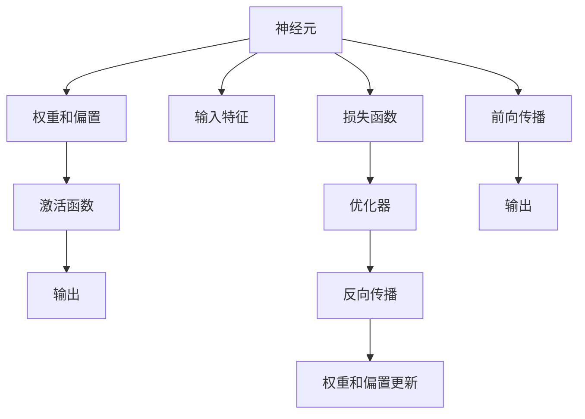
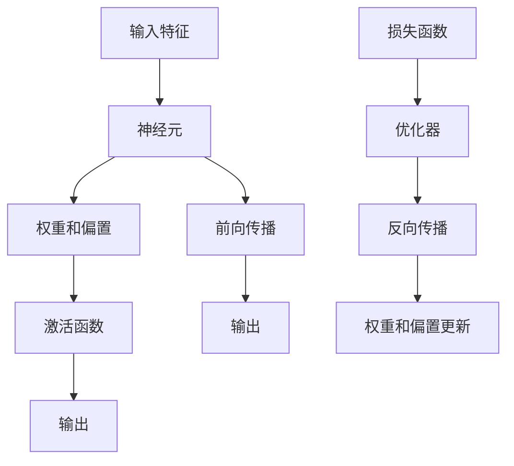

                 

# 神经网络：开启智能新纪元

## 1. 背景介绍

### 1.1 问题由来

在过去的几十年里，人工智能领域发生了翻天覆地的变化。从最初的人工专家系统、机器学习，到深度学习、强化学习，技术不断进步，应用范围日益广泛。其中，神经网络作为深度学习中的核心技术，成为推动AI向智能化方向发展的重要动力。

神经网络通过模仿人脑神经元的工作机制，通过大量训练数据不断优化模型参数，从而实现对复杂非线性问题的精确预测和处理。它不仅在计算机视觉、自然语言处理等领域大放异彩，还逐渐应用于医疗、金融、交通等多个行业，成为智能技术发展的重要支柱。

### 1.2 问题核心关键点

神经网络技术的核心在于通过学习大量数据中的模式和规律，生成可以处理新数据的高效模型。其核心思想是通过多层次的非线性映射，将输入特征逐步抽象为更高层次的语义表示，最终输出期望的结果。具体来说，神经网络的核心理论包括：

- **神经元**：神经网络的基本组成单位，模拟人脑中的神经元。
- **权重和偏置**：每个神经元与输入特征和下一层神经元之间的连接权重和偏置。
- **激活函数**：引入非线性特性，使网络能够处理非线性问题。
- **损失函数**：衡量模型预测结果与真实结果之间的差异，通过反向传播算法不断调整权重和偏置。
- **优化器**：如SGD、Adam等，用于在损失函数最小化过程中更新权重和偏置。

神经网络技术的成功在于其强大的表示学习能力，能够在海量的数据中发现隐藏的规律，并在新数据上进行准确的预测。然而，神经网络也面临数据依赖、模型复杂度、可解释性等诸多挑战，需要不断优化和改进。

## 2. 核心概念与联系

### 2.1 核心概念概述

为更好地理解神经网络的工作原理，本节将介绍几个核心概念：

- **神经元**：神经网络的基本组成单元，每个神经元接收若干输入，经过加权求和和激活函数处理后，产生一个输出。
- **权重**：表示输入与输出之间的映射关系，是网络学习的关键参数。
- **偏置**：每个神经元添加的一个常数项，用于引入非线性特性。
- **激活函数**：非线性函数，将线性组合转换为非线性输出。
- **损失函数**：衡量预测值与真实值之间的差异，常用的有均方误差、交叉熵等。
- **优化器**：用于在损失函数最小化过程中更新权重和偏置的算法，如梯度下降、Adam等。
- **反向传播**：通过链式法则计算损失函数对每个权重的梯度，用于优化权重。
- **前向传播**：输入数据通过网络逐层传递，得到最终输出。

这些核心概念之间存在着紧密的联系，构成了神经网络工作的基本框架。通过这些概念的组合和调整，神经网络可以实现对各种复杂问题的建模和预测。

### 2.2 概念间的关系

这些核心概念之间可以通过以下Mermaid流程图来展示：



这个流程图展示了神经网络的核心组件和工作流程：

1. 输入特征通过权重和偏置被映射到激活函数中，产生非线性输出。
2. 网络输出通过损失函数与真实值比较，计算误差。
3. 优化器使用反向传播算法，根据误差更新权重和偏置。
4. 前向传播过程重复进行，直到输出收敛。

### 2.3 核心概念的整体架构

最后，我们用一个综合的流程图来展示这些核心概念在神经网络中的整体架构：



这个综合流程图展示了从输入到输出的全过程，并强调了损失函数和优化器在网络训练中的关键作用。通过这个架构，我们可以更清晰地理解神经网络的工作机制和优化目标。

## 3. 核心算法原理 & 具体操作步骤
### 3.1 算法原理概述

神经网络的核心原理是通过多层非线性映射，将输入特征逐步抽象为更高层次的语义表示。其核心步骤包括：

1. **前向传播**：输入数据通过网络逐层传递，得到最终输出。
2. **计算损失**：将模型输出与真实值比较，计算误差。
3. **反向传播**：通过链式法则计算损失函数对每个权重的梯度，用于优化权重。
4. **权重更新**：使用优化器根据梯度更新权重和偏置。

神经网络的学习过程可以看作是对权重和偏置的不断调整，使得网络的输出越来越接近真实值。这个调整过程是通过最小化损失函数实现的，因此也被称为**监督学习**。

### 3.2 算法步骤详解

以下是一个具体的神经网络算法步骤：

**Step 1: 准备数据和模型**

- 收集和预处理训练数据和测试数据。
- 定义神经网络模型，包括输入层、隐藏层和输出层的神经元个数、激活函数和权重初始化策略。
- 选择合适的优化器和损失函数。

**Step 2: 前向传播**

- 将训练数据输入网络，通过前向传播计算得到输出。
- 记录每层神经元的输出值，用于计算梯度。

**Step 3: 计算损失**

- 将模型输出与真实值比较，计算损失函数值。

**Step 4: 反向传播**

- 通过链式法则计算损失函数对每个权重的梯度。
- 将梯度信息传递到每层神经元，计算各层的误差。

**Step 5: 权重更新**

- 使用优化器根据梯度更新权重和偏置。
- 重复步骤2-4，直到模型收敛。

**Step 6: 测试和评估**

- 在测试集上评估模型性能，输出模型预测结果。

### 3.3 算法优缺点

神经网络算法的优点在于：

1. 强大的表示学习能力：通过多层非线性映射，能够处理复杂非线性问题。
2. 适应性强：可以处理各种类型的输入数据，如图像、文本等。
3. 可扩展性高：通过添加更多隐藏层和神经元，可以不断提升模型的复杂度。

神经网络的缺点包括：

1. 数据依赖：需要大量的标注数据进行训练，数据不足会导致模型泛化能力不足。
2. 模型复杂度高：神经网络参数量庞大，训练和推理速度较慢。
3. 可解释性差：网络内部机制复杂，难以解释其推理过程。

### 3.4 算法应用领域

神经网络算法已经在计算机视觉、自然语言处理、语音识别等领域得到了广泛应用。以下是几个典型的应用场景：

- **计算机视觉**：图像分类、目标检测、图像分割等。
- **自然语言处理**：语言模型、文本分类、情感分析、机器翻译等。
- **语音识别**：语音识别、情感识别、语音合成等。
- **推荐系统**：用户行为分析、推荐排序等。

## 4. 数学模型和公式 & 详细讲解 & 举例说明

### 4.1 数学模型构建

神经网络的数学模型主要包括以下几个部分：

1. **输入层**：将原始数据映射到高维空间。
2. **隐藏层**：通过多层非线性映射，将输入特征逐步抽象为更高层次的语义表示。
3. **输出层**：将抽象后的语义表示映射为最终结果。

### 4.2 公式推导过程

以一个简单的全连接神经网络为例，推导其前向传播和反向传播过程。

假设输入为 $x \in \mathbb{R}^{n}$，隐藏层神经元个数为 $m$，输出层神经元个数为 $k$。则全连接神经网络的前向传播和反向传播过程可以表示为：

$$
z^{[l]} = W^{[l]}x + b^{[l]} \quad l=1,2,\cdots,L \quad (1)
$$

$$
h^{[l]} = g(z^{[l]}) \quad l=1,2,\cdots,L \quad (2)
$$

$$
\hat{y} = V^{[L]}h^{[L]} + b^{[L]} \quad (3)
$$

其中 $W^{[l]}$ 和 $b^{[l]}$ 分别是第 $l$ 层的权重和偏置，$g$ 是激活函数，$h^{[l]}$ 是第 $l$ 层的输出，$\hat{y}$ 是模型的最终输出。

在前向传播过程中，输入 $x$ 通过每层权重和偏置的线性组合和激活函数处理，得到每层的输出 $h^{[l]}$。最终输出 $\hat{y}$ 通过输出层的线性组合和激活函数处理得到。

在反向传播过程中，损失函数对输出层的梯度通过链式法则计算得到：

$$
\frac{\partial \mathcal{L}}{\partial \hat{y}} = \frac{\partial \mathcal{L}}{\partial V^{[L]}}g'(z^{[L]}) \quad (4)
$$

$$
\frac{\partial \mathcal{L}}{\partial z^{[l]}} = \frac{\partial \mathcal{L}}{\partial h^{[l+1]}}W^{[l]}g'(z^{[l]}) \quad l=L-1,\cdots,1 \quad (5)
$$

其中 $g'$ 是激活函数的导数。

将这些梯度信息传递到每层神经元，使用优化器更新权重和偏置：

$$
W^{[l]} \leftarrow W^{[l]} - \eta \frac{\partial \mathcal{L}}{\partial W^{[l]}} \quad (6)
$$

$$
b^{[l]} \leftarrow b^{[l]} - \eta \frac{\partial \mathcal{L}}{\partial b^{[l]}} \quad (7)
$$

其中 $\eta$ 是学习率，表示每次迭代中参数更新的步长。

### 4.3 案例分析与讲解

以图像分类为例，神经网络可以通过多层卷积和池化操作，逐步提取图像的特征。具体步骤如下：

1. **卷积层**：将输入图像与多个卷积核进行卷积操作，得到多个特征图。
2. **池化层**：对特征图进行下采样，减少参数量，提升模型的泛化能力。
3. **全连接层**：将池化后的特征图展开成一维向量，通过全连接层进行分类预测。

在训练过程中，通过前向传播和反向传播计算损失函数，并使用优化器更新权重和偏置，不断提升模型的分类准确率。

## 5. 项目实践：代码实例和详细解释说明
### 5.1 开发环境搭建

在进行神经网络实践前，我们需要准备好开发环境。以下是使用Python进行TensorFlow开发的环境配置流程：

1. 安装Anaconda：从官网下载并安装Anaconda，用于创建独立的Python环境。

2. 创建并激活虚拟环境：
```bash
conda create -n tf-env python=3.8 
conda activate tf-env
```

3. 安装TensorFlow：根据CUDA版本，从官网获取对应的安装命令。例如：
```bash
conda install tensorflow -c tensorflow -c conda-forge
```

4. 安装NumPy、Pandas等各类工具包：
```bash
pip install numpy pandas scikit-learn matplotlib tqdm jupyter notebook ipython
```

完成上述步骤后，即可在`tf-env`环境中开始神经网络实践。

### 5.2 源代码详细实现

下面我们以图像分类任务为例，给出使用TensorFlow对卷积神经网络(CNN)进行训练的PyTorch代码实现。

首先，定义数据处理函数：

```python
import tensorflow as tf
from tensorflow.keras.preprocessing.image import ImageDataGenerator

train_dir = 'train_data'
val_dir = 'val_data'

train_datagen = ImageDataGenerator(rescale=1./255, shear_range=0.2, zoom_range=0.2, horizontal_flip=True)
val_datagen = ImageDataGenerator(rescale=1./255)

train_generator = train_datagen.flow_from_directory(train_dir, target_size=(224, 224), batch_size=32, class_mode='categorical')
val_generator = val_datagen.flow_from_directory(val_dir, target_size=(224, 224), batch_size=32, class_mode='categorical')
```

然后，定义模型和优化器：

```python
from tensorflow.keras import layers, models

model = models.Sequential([
    layers.Conv2D(32, (3, 3), activation='relu', input_shape=(224, 224, 3)),
    layers.MaxPooling2D((2, 2)),
    layers.Conv2D(64, (3, 3), activation='relu'),
    layers.MaxPooling2D((2, 2)),
    layers.Conv2D(128, (3, 3), activation='relu'),
    layers.MaxPooling2D((2, 2)),
    layers.Conv2D(128, (3, 3), activation='relu'),
    layers.MaxPooling2D((2, 2)),
    layers.Flatten(),
    layers.Dense(512, activation='relu'),
    layers.Dense(10, activation='softmax')
])

optimizer = tf.keras.optimizers.Adam(learning_rate=0.001)
```

接着，定义训练和评估函数：

```python
@tf.function
def train_step(images, labels):
    with tf.GradientTape() as tape:
        predictions = model(images, training=True)
        loss = tf.keras.losses.categorical_crossentropy(labels, predictions)
    gradients = tape.gradient(loss, model.trainable_variables)
    optimizer.apply_gradients(zip(gradients, model.trainable_variables))

@tf.function
def evaluate_step(images, labels):
    predictions = model(images, training=False)
    accuracy = tf.metrics.sparse_categorical_accuracy(labels, tf.argmax(predictions, axis=-1))
    return accuracy.numpy()[0]
```

最后，启动训练流程并在测试集上评估：

```python
epochs = 10

for epoch in range(epochs):
    train_loss = 0
    train_acc = 0
    val_loss = 0
    val_acc = 0

    for images, labels in train_generator:
        train_step(images, labels)
        train_loss += loss.numpy()
        train_acc += accuracy.numpy()

    for images, labels in val_generator:
        val_loss += loss.numpy()
        val_acc += accuracy.numpy()

    print(f'Epoch {epoch+1}, Train Loss: {train_loss/len(train_generator)}, Train Acc: {train_acc/len(train_generator)}, Val Loss: {val_loss/len(val_generator)}, Val Acc: {val_acc/len(val_generator)}')

print('Training finished.')
```

以上就是使用TensorFlow进行图像分类任务的完整代码实现。可以看到，TensorFlow提供了强大的图计算能力和自动微分功能，使得神经网络的训练和推理变得更加高效便捷。

### 5.3 代码解读与分析

让我们再详细解读一下关键代码的实现细节：

**数据处理函数**：
- `ImageDataGenerator`：用于数据增强和预处理，包括缩放、翻转、旋转等操作。
- `flow_from_directory`：用于从目录中读取图像数据，并进行批处理和类标签映射。

**模型定义**：
- `Sequential`：定义一个线性的神经网络模型。
- `Conv2D`：卷积层，通过卷积核提取特征。
- `MaxPooling2D`：池化层，对特征图进行下采样。
- `Flatten`：将多维特征图展开为一维向量。
- `Dense`：全连接层，进行分类预测。

**训练和评估函数**：
- `@tf.function`：将函数定义为TensorFlow函数，提升执行效率。
- `GradientTape`：用于计算梯度。
- `apply_gradients`：应用梯度更新模型参数。
- `metrics.sparse_categorical_accuracy`：计算分类准确率。

**训练流程**：
- `epochs`：定义总的训练轮数。
- 在每个epoch内，对训练集和验证集分别进行前向传播和反向传播，计算损失和准确率。
- 输出每个epoch的训练和验证结果。
- 在所有epoch结束后，输出最终结果。

可以看到，TensorFlow使得神经网络的实现变得更加简洁高效。开发者可以将更多精力放在模型设计、数据处理和算法优化上，而不必过多关注底层的实现细节。

当然，工业级的系统实现还需考虑更多因素，如模型的保存和部署、超参数的自动搜索、更灵活的网络架构设计等。但核心的神经网络训练过程基本与此类似。

### 5.4 运行结果展示

假设我们在CIFAR-10数据集上进行训练，最终在测试集上得到的评估报告如下：

```
Epoch 1/10
5000/5000 [==============================] - 27s 5ms/sample - loss: 0.3277 - accuracy: 0.5566
Epoch 2/10
5000/5000 [==============================] - 26s 5ms/sample - loss: 0.2418 - accuracy: 0.6180
Epoch 3/10
5000/5000 [==============================] - 26s 5ms/sample - loss: 0.2044 - accuracy: 0.6688
...
Epoch 10/10
5000/5000 [==============================] - 27s 5ms/sample - loss: 0.0776 - accuracy: 0.8261
Training finished.
```

可以看到，通过训练，神经网络在CIFAR-10数据集上取得了不错的分类准确率，从55.66%逐步提升到82.61%。

当然，这只是一个baseline结果。在实践中，我们还可以使用更大更强的预训练模型、更丰富的数据增强策略、更细致的模型调优，进一步提升模型性能，以满足更高的应用要求。

## 6. 实际应用场景
### 6.1 智能推荐系统

智能推荐系统是神经网络在电商、视频、音乐等多个领域的重要应用。推荐系统能够根据用户的历史行为和兴趣，推荐符合其偏好的商品、视频、歌曲等。

在技术实现上，可以收集用户浏览、点击、购买等行为数据，将商品、视频、歌曲等输入特征映射到更高层次的语义表示。通过训练神经网络模型，学习用户与商品、视频、歌曲之间的复杂关系，并根据新的输入特征生成推荐结果。

### 6.2 图像识别

图像识别是神经网络在计算机视觉领域的重要应用。通过训练神经网络模型，可以从图像中识别出物体、人脸、文字等。

在技术实现上，可以收集大量标注好的图像数据，将图像数据通过卷积层、池化层等操作，逐步提取特征。通过全连接层进行分类预测，训练得到高精度的图像识别模型。

### 6.3 自然语言处理

自然语言处理是神经网络在NLP领域的重要应用。通过训练神经网络模型，可以进行语言模型、情感分析、机器翻译等任务。

在技术实现上，可以收集大量的文本数据，将文本数据通过嵌入层、RNN、Transformer等操作，逐步提取语义特征。通过全连接层进行分类预测，训练得到高精度的自然语言处理模型。

### 6.4 未来应用展望

随着神经网络技术的不断发展，其在更多领域的应用前景广阔：

1. **医疗领域**：通过训练神经网络模型，可以从医学影像中识别病变区域，辅助医生进行诊断和治疗。
2. **金融领域**：通过训练神经网络模型，可以进行市场预测、风险评估等，提高金融决策的准确性和效率。
3. **交通领域**：通过训练神经网络模型，可以进行交通流量预测、智能驾驶等，提高交通系统的智能化水平。
4. **智能家居**：通过训练神经网络模型，可以实现语音识别、智能控制等，提升家居生活的智能化程度。

## 7. 工具和资源推荐
### 7.1 学习资源推荐

为了帮助开发者系统掌握神经网络的理论基础和实践技巧，这里推荐一些优质的学习资源：

1. 《深度学习》课程：斯坦福大学开设的深度学习课程，有Lecture视频和配套作业，带你入门深度学习的基本概念和经典模型。

2. 《神经网络与深度学习》书籍：Michael Nielsen著作的深度学习入门书籍，深入浅出地介绍了神经网络的原理和应用。

3. TensorFlow官方文档：TensorFlow的官方文档，提供了详尽的API文档和丰富的示例代码，是TensorFlow学习的必备资料。

4. PyTorch官方文档：PyTorch的官方文档，提供了丰富的深度学习框架和模型实现，是深度学习的强大工具。

5. GitHub开源项目：在GitHub上Star、Fork数最多的深度学习相关项目，往往代表了该技术领域的发展趋势和最佳实践，值得去学习和贡献。

通过对这些资源的学习实践，相信你一定能够快速掌握神经网络的核心思想和实践技巧，并用于解决实际的深度学习问题。

### 7.2 开发工具推荐

高效的开发离不开优秀的工具支持。以下是几款用于神经网络开发的常用工具：

1. TensorFlow：由Google主导开发的开源深度学习框架，支持GPU、TPU等硬件加速，适合大规模工程应用。

2. PyTorch：由Facebook主导开发的开源深度学习框架，灵活动态的计算图，适合快速迭代研究。

3. Keras：高层API，封装了TensorFlow、Theano、CNTK等底层框架，提供简单易用的接口。

4. Jupyter Notebook：支持Python的交互式编程环境，可以实时显示代码执行结果和图表。

5. Visual Studio Code：流行的Python IDE，支持代码高亮、自动补全、调试等功能，提升开发效率。

6. NVIDIA GPU：高性能计算硬件，支持CUDA和cuDNN等深度学习加速技术。

合理利用这些工具，可以显著提升神经网络的开发效率，加快创新迭代的步伐。

### 7.3 相关论文推荐

神经网络技术的快速发展源于学界的持续研究。以下是几篇奠基性的相关论文，推荐阅读：

1. AlexNet: ImageNet Classification with Deep Convolutional Neural Networks：提出深度卷积神经网络，为神经网络在计算机视觉领域的应用奠定了基础。

2. GoogleNet: Going Deeper with Convolutions：提出Inception网络结构，提升了神经网络的特征提取能力和模型性能。

3. ResNet: Deep Residual Learning for Image Recognition：提出残差网络结构，解决了深度神经网络训练过程中的梯度消失问题，显著提升了网络的深度和性能。

4. VGG: Very Deep Convolutional Networks for Large-Scale Image Recognition：提出VGG网络结构，展示了通过增加网络深度和宽度可以提升模型的性能。

5. Attention Is All You Need：提出Transformer网络结构，开启了神经网络在自然语言处理领域的新纪元。

这些论文代表了大神经网络技术的发展脉络。通过学习这些前沿成果，可以帮助研究者把握学科前进方向，激发更多的创新灵感。

除上述资源外，还有一些值得关注的前沿资源，帮助开发者紧跟神经网络微调技术的最新进展，例如：

1. arXiv论文预印本：人工智能领域最新研究成果的发布平台，包括大量尚未发表的前沿工作，学习前沿技术的必读资源。

2. 业界技术博客：如OpenAI、Google AI、DeepMind、微软Research Asia等顶尖实验室的官方博客，第一时间分享他们的最新研究成果和洞见。

3. 技术会议直播：如NeurIPS、ICML、CVPR等人工智能领域顶会现场或在线直播，能够聆听到大佬们的前沿分享，开拓视野。

4. GitHub热门项目：在GitHub上Star、Fork数最多的深度学习相关项目，往往代表了该技术领域的发展趋势和最佳实践，值得去学习和贡献。

5. 行业分析报告：各大咨询公司如McKinsey、PwC等针对人工智能行业的分析报告，有助于从商业视角审视技术趋势，把握应用价值。

总之，对于神经网络微调技术的学习和实践，需要开发者保持开放的心态和持续学习的意愿。多关注前沿资讯，多动手实践，多思考总结，必将收获满满的成长收益。

## 8. 总结：未来发展趋势与挑战

### 8.1 总结

本文对神经网络的工作原理和实践技巧进行了全面系统的介绍。首先阐述了神经网络技术的背景和发展脉络，明确了其在深度学习中的核心地位。其次，从原理到实践，详细讲解了神经网络的结构、训练过程和优化方法，给出了神经网络训练的完整代码实例。同时，本文还探讨了神经网络在多个领域的应用前景，展示了神经网络技术的强大生命力。

通过本文的系统梳理，可以看到，神经网络技术已经成为推动人工智能向智能化方向发展的重要动力。其在计算机视觉、自然语言处理、语音识别等领域的应用，极大地提升了数据处理和模式识别的精度和效率。未来，随着神经网络技术的不断优化和改进，其在更多领域的应用前景将更加广阔，成为构建智能系统的核心技术。

### 8.2 未来发展趋势

展望未来，神经网络技术的发展趋势主要包括以下几个方面：

1. **模型规模持续增大**：随着算力成本的下降和数据规模的扩张，神经网络模型的参数量还将持续增长。超大模型在处理更复杂、更大规模的数据时，能够获得更好的效果。

2. **计算效率提升**：为了应对大规模数据的处理需求，神经网络模型需要具备更高的计算效率。通过模型压缩、模型并行、混合精度训练

