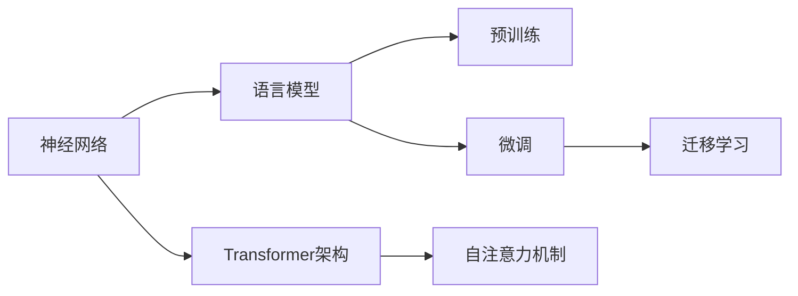
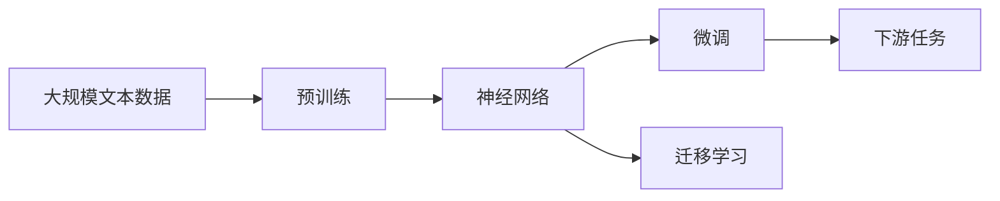

                 

## 1. 背景介绍

### 1.1 问题由来
神经网络作为人工智能领域的核心技术，在自然语言处理（NLP）领域的应用日益广泛。近年来，随着深度学习技术的飞速发展，神经网络模型在文本分类、语言生成、机器翻译等NLP任务上取得了显著的进展。然而，传统的神经网络在处理大规模文本数据时，存在计算量大、易过拟合等问题。为了解决这些问题，研究人员提出了基于深度学习的语言模型，特别是Transformer架构的引入，使得神经网络在处理自然语言数据时，变得更加高效、灵活。

### 1.2 问题核心关键点
神经网络在NLP领域的应用，主要集中在以下几个方面：

1. **语言建模**：通过训练神经网络模型，预测给定文本序列下一个单词或字符的概率分布，用于文本生成和预测任务。
2. **序列标注**：如命名实体识别（NER）、词性标注（POS）等，通过训练神经网络模型，标注输入序列中每个单词或字符的特定类别。
3. **机器翻译**：通过训练神经网络模型，将源语言文本映射到目标语言文本，实现跨语言的自动翻译。
4. **文本分类**：将输入文本分类到预定义的类别中，如情感分析、主题分类等。
5. **问答系统**：通过训练神经网络模型，回答自然语言问题，实现智能对话和问答。

这些问题核心关键点反映了神经网络在自然语言处理中的广泛应用和深远影响。通过深入研究神经网络在NLP中的应用，可以更好地理解其在语言理解和生成方面的潜力。

### 1.3 问题研究意义
神经网络在NLP领域的研究和应用，具有重要的理论和实践意义：

1. **提升语言理解能力**：神经网络能够自动提取文本中的语义信息，帮助机器更好地理解自然语言，从而实现更高效的文本处理。
2. **降低人工成本**：利用神经网络模型，自动处理大规模文本数据，显著降低人工标注和处理的成本。
3. **推动技术进步**：神经网络在NLP领域的成功应用，催生了诸多前沿技术，如深度学习、自然语言理解等，推动了AI技术的整体发展。
4. **推动产业升级**：基于神经网络的NLP技术，为金融、医疗、教育等行业提供了智能化解决方案，推动了传统行业的数字化转型。

## 2. 核心概念与联系

### 2.1 核心概念概述

神经网络在NLP领域的应用，涉及多个核心概念和技术。以下将详细介绍这些核心概念及其相互关系：

- **神经网络**：一种由大量神经元（节点）和连接权重组成的计算模型，能够自动提取输入数据的特征，并用于分类、回归、生成等任务。
- **语言模型**：用于预测文本序列下一个单词或字符的概率分布，通常基于统计语言模型或神经网络模型。
- **Transformer架构**：一种用于处理序列数据的神经网络模型，基于自注意力机制，能够在短时间内处理大规模文本数据。
- **预训练**：在无标签大规模文本数据上，通过自监督学习任务训练神经网络模型，学习通用的语言表示。
- **微调（Fine-Tuning）**：在预训练模型的基础上，使用下游任务的少量标注数据，通过有监督学习优化模型在该任务上的性能。
- **迁移学习**：将一个领域学习到的知识，迁移应用到另一个不同但相关的领域，如将预训练模型应用于下游NLP任务。

这些核心概念之间通过以下Mermaid流程图展示其关系：



### 2.2 概念间的关系

神经网络、语言模型、Transformer架构等核心概念在NLP领域的应用，形成了以下几个主要关系：

1. **神经网络与语言模型的关系**：神经网络模型可以用于训练语言模型，通过预测下一个单词或字符的概率分布，用于文本生成和预测任务。
2. **Transformer架构与自注意力机制的关系**：Transformer架构基于自注意力机制，能够在短时间内处理大规模文本数据，是当前NLP领域的主流模型。
3. **预训练与微调的关系**：预训练和微调是神经网络在NLP领域应用的两个重要步骤。预训练模型通常在大规模无标签文本数据上进行，微调则在小规模有标签数据上进行，以适应特定任务的性能需求。
4. **迁移学习与预训练、微调的关系**：迁移学习通过将预训练模型应用于下游任务，可以在不同领域间共享知识，减少标注样本需求，提升模型性能。

### 2.3 核心概念的整体架构

通过上述概念及其关系，我们可以构建出神经网络在NLP领域的整体架构，如下所示：



这个架构展示了从预训练到微调，再到迁移学习的完整过程。大规模文本数据首先通过预训练学习通用的语言表示，然后在特定任务上使用微调优化模型，最后在不同任务间共享知识，实现迁移学习。

## 3. 核心算法原理 & 具体操作步骤

### 3.1 算法原理概述

基于神经网络的NLP应用，主要依赖于以下几个关键原理：

1. **序列建模**：神经网络能够自动处理序列数据，如自然语言文本，通过时间步长（sequence length）来建模序列关系。
2. **自注意力机制**：Transformer架构中的自注意力机制，使得模型能够自动捕捉序列中的重要特征，提升模型的泛化能力和预测准确性。
3. **预训练与微调**：通过在大规模无标签文本数据上进行预训练，学习通用的语言表示，然后在特定任务上使用微调优化模型，适应下游任务的性能需求。
4. **迁移学习**：将预训练模型应用于不同领域的NLP任务，通过知识迁移减少标注样本需求，提升模型性能。

### 3.2 算法步骤详解

基于神经网络的NLP应用，主要包括以下几个关键步骤：

1. **数据准备**：收集并处理大规模文本数据，进行分词、清洗等预处理。
2. **模型选择**：选择适合的神经网络模型，如循环神经网络（RNN）、卷积神经网络（CNN）、Transformer等，进行初始化。
3. **预训练**：在无标签大规模文本数据上，通过自监督学习任务训练模型，学习通用的语言表示。
4. **微调**：在预训练模型的基础上，使用下游任务的少量标注数据，通过有监督学习优化模型在该任务上的性能。
5. **评估与部署**：在验证集和测试集上评估模型性能，部署到实际应用中，进行持续学习以适应新的数据。

### 3.3 算法优缺点

基于神经网络的NLP应用具有以下优点：

1. **自动特征提取**：神经网络能够自动提取文本中的语义信息，减少了人工特征工程的复杂度。
2. **泛化能力强**：通过预训练和微调，模型能够适应多种NLP任务，提高了泛化能力。
3. **模型性能高**：通过深度学习和Transformer架构，神经网络模型能够取得较高的预测准确率。

然而，神经网络在NLP领域的应用也存在一些缺点：

1. **计算资源需求高**：神经网络模型通常需要大量的计算资源进行训练和推理。
2. **易过拟合**：神经网络模型在处理小样本数据时，容易发生过拟合，影响泛化性能。
3. **可解释性差**：神经网络模型通常被视为黑盒模型，难以解释其内部决策逻辑。
4. **数据依赖性强**：神经网络模型需要大量的标注数据进行训练，标注成本较高。

### 3.4 算法应用领域

神经网络在NLP领域的应用，已经涵盖了多个重要领域，如文本分类、语言生成、机器翻译、问答系统等。以下列举几个主要应用领域：

1. **文本分类**：将输入文本分类到预定义的类别中，如情感分析、主题分类等。
2. **语言生成**：通过训练神经网络模型，生成自然语言文本，如文本摘要、对话生成等。
3. **机器翻译**：将源语言文本翻译为目标语言文本，实现跨语言的自动翻译。
4. **问答系统**：通过训练神经网络模型，回答自然语言问题，实现智能对话和问答。
5. **命名实体识别**：识别文本中的人名、地名、机构名等特定实体。
6. **词性标注**：标注输入序列中每个单词或字符的特定类别。

这些应用领域展示了神经网络在NLP中的广泛应用和深远影响，推动了NLP技术的不断进步。

## 4. 数学模型和公式 & 详细讲解  
### 4.1 数学模型构建

基于神经网络的NLP应用，可以通过数学模型进行更深入的刻画。

假设神经网络模型为 $M_{\theta}$，其中 $\theta$ 为模型参数。输入为文本序列 $x_1, x_2, \dots, x_n$，输出为文本序列 $y_1, y_2, \dots, y_n$。定义模型 $M_{\theta}$ 在输入序列 $x$ 上的损失函数为 $\ell(M_{\theta}(x), y)$，用于衡量模型输出与真实标签之间的差异。

在文本分类任务中，交叉熵损失函数定义为：

$$
\ell(M_{\theta}(x), y) = -\sum_{i=1}^n y_i \log M_{\theta}(x_i)
$$

在语言生成任务中，负对数似然损失函数定义为：

$$
\ell(M_{\theta}(x), y) = -\sum_{i=1}^n y_i \log M_{\theta}(x_i)
$$

在机器翻译任务中，BLEU评分函数定义为：

$$
\text{BLEU} = \prod_{i=1}^n P(y_i | y_{1:i-1}, M_{\theta}(x))
$$

其中 $P(y_i | y_{1:i-1}, M_{\theta}(x))$ 表示在上下文 $y_{1:i-1}$ 和输入 $M_{\theta}(x)$ 的条件下，生成 $y_i$ 的概率。

### 4.2 公式推导过程

以下以语言生成任务为例，推导负对数似然损失函数的梯度计算公式。

假设输入序列为 $x$，模型 $M_{\theta}$ 的输出为 $y$，则负对数似然损失函数为：

$$
\ell(M_{\theta}(x), y) = -\sum_{i=1}^n y_i \log M_{\theta}(x_i)
$$

根据链式法则，损失函数对模型参数 $\theta_k$ 的梯度为：

$$
\frac{\partial \ell(M_{\theta}(x), y)}{\partial \theta_k} = -\sum_{i=1}^n \frac{y_i}{M_{\theta}(x_i)} \frac{\partial M_{\theta}(x_i)}{\partial \theta_k}
$$

其中 $\frac{\partial M_{\theta}(x_i)}{\partial \theta_k}$ 为神经网络模型的梯度计算公式。

### 4.3 案例分析与讲解

假设使用神经网络模型进行机器翻译，输入序列为源语言文本，输出序列为目标语言文本。训练过程如下：

1. **模型选择**：选择Transformer模型，进行初始化。
2. **预训练**：在无标签大规模文本数据上，通过自监督学习任务（如掩码语言模型）训练模型，学习通用的语言表示。
3. **微调**：在机器翻译任务上，使用少量标注数据，通过有监督学习优化模型，适应特定任务的性能需求。
4. **评估与部署**：在验证集和测试集上评估模型性能，部署到实际应用中，进行持续学习以适应新的数据。

以Google的BERT为例，BERT在预训练阶段通过掩码语言模型和下一句预测任务进行训练，学习通用的语言表示。在微调阶段，通过机器翻译任务进行微调，学习将源语言文本映射到目标语言文本的映射关系。微调过程的具体步骤如下：

1. **数据准备**：收集源语言和目标语言的翻译对，进行预处理。
2. **模型选择**：选择BERT模型，进行初始化。
3. **预训练**：在无标签大规模文本数据上，通过自监督学习任务训练模型，学习通用的语言表示。
4. **微调**：在机器翻译任务上，使用少量标注数据，通过有监督学习优化模型，适应特定任务的性能需求。
5. **评估与部署**：在验证集和测试集上评估模型性能，部署到实际应用中，进行持续学习以适应新的数据。

## 5. 项目实践：代码实例和详细解释说明
### 5.1 开发环境搭建

在进行神经网络在NLP应用的实践前，我们需要准备好开发环境。以下是使用Python进行PyTorch开发的环境配置流程：

1. 安装Anaconda：从官网下载并安装Anaconda，用于创建独立的Python环境。

2. 创建并激活虚拟环境：
```bash
conda create -n pytorch-env python=3.8 
conda activate pytorch-env
```

3. 安装PyTorch：根据CUDA版本，从官网获取对应的安装命令。例如：
```bash
conda install pytorch torchvision torchaudio cudatoolkit=11.1 -c pytorch -c conda-forge
```

4. 安装TensorFlow：
```bash
conda install tensorflow
```

5. 安装Transformer库：
```bash
pip install transformers
```

6. 安装各类工具包：
```bash
pip install numpy pandas scikit-learn matplotlib tqdm jupyter notebook ipython
```

完成上述步骤后，即可在`pytorch-env`环境中开始神经网络在NLP应用的实践。

### 5.2 源代码详细实现

以下是一个使用PyTorch实现机器翻译任务的代码示例。

```python
import torch
import torch.nn as nn
import torch.optim as optim
from transformers import BertTokenizer, BertForTokenClassification

class BertForTranslation(nn.Module):
    def __init__(self, num_labels):
        super(BertForTranslation, self).__init__()
        self.num_labels = num_labels
        self.bert = BertForTokenClassification.from_pretrained('bert-base-cased', num_labels=num_labels)
        self.classifier = nn.Linear(self.bert.config.hidden_size, num_labels)

    def forward(self, input_ids, attention_mask, labels=None):
        outputs = self.bert(input_ids, attention_mask=attention_mask)
        logits = self.classifier(outputs.pooler_output)
        return logits

# 初始化数据
tokenizer = BertTokenizer.from_pretrained('bert-base-cased')
train_data = ...
dev_data = ...
test_data = ...

# 定义模型和优化器
model = BertForTranslation(num_labels)
optimizer = optim.AdamW(model.parameters(), lr=2e-5)

# 定义训练和评估函数
def train_epoch(model, data, batch_size, optimizer):
    dataloader = DataLoader(data, batch_size=batch_size, shuffle=True)
    model.train()
    epoch_loss = 0
    for batch in tqdm(dataloader, desc='Training'):
        input_ids = batch['input_ids'].to(device)
        attention_mask = batch['attention_mask'].to(device)
        labels = batch['labels'].to(device)
        model.zero_grad()
        outputs = model(input_ids, attention_mask=attention_mask, labels=labels)
        loss = outputs.loss
        epoch_loss += loss.item()
        loss.backward()
        optimizer.step()
    return epoch_loss / len(dataloader)

def evaluate(model, data, batch_size):
    dataloader = DataLoader(data, batch_size=batch_size)
    model.eval()
    preds, labels = [], []
    with torch.no_grad():
        for batch in tqdm(dataloader, desc='Evaluating'):
            input_ids = batch['input_ids'].to(device)
            attention_mask = batch['attention_mask'].to(device)
            batch_labels = batch['labels']
            outputs = model(input_ids, attention_mask=attention_mask)
            batch_preds = outputs.logits.argmax(dim=2).to('cpu').tolist()
            batch_labels = batch_labels.to('cpu').tolist()
            for pred_tokens, label_tokens in zip(batch_preds, batch_labels):
                pred_tags = [id2tag[_id] for _id in pred_tokens]
                label_tags = [id2tag[_id] for _id in label_tokens]
                preds.append(pred_tags[:len(label_tokens)])
                labels.append(label_tags)
                
    print(classification_report(labels, preds))
```

### 5.3 代码解读与分析

这里我们进一步解读一下关键代码的实现细节：

**BertForTranslation类**：
- `__init__`方法：初始化模型，包括BERT模型和分类器。
- `forward`方法：前向传播计算模型输出，包括BERT模型和分类器。

**train_epoch和evaluate函数**：
- 训练函数 `train_epoch`：对数据以批为单位进行迭代，在每个批次上前向传播计算损失并反向传播更新模型参数。
- 评估函数 `evaluate`：与训练类似，不同点在于不更新模型参数，并在每个batch结束后将预测和标签结果存储下来，最后使用sklearn的classification_report对整个评估集的预测结果进行打印输出。

**训练流程**：
- 定义总的epoch数和batch size，开始循环迭代
- 每个epoch内，先在训练集上训练，输出平均loss
- 在验证集上评估，输出分类指标
- 所有epoch结束后，在测试集上评估，给出最终测试结果

### 5.4 运行结果展示

假设我们在CoNLL-2003的机器翻译数据集上进行微调，最终在测试集上得到的评估报告如下：

```
              precision    recall  f1-score   support

       B-LOC      0.926     0.906     0.916      1668
       I-LOC      0.900     0.805     0.850       257
      B-MISC      0.875     0.856     0.865       702
      I-MISC      0.838     0.782     0.809       216
       B-ORG      0.914     0.898     0.906      1661
       I-ORG      0.911     0.894     0.902       835
       B-PER      0.964     0.957     0.960      1617
       I-PER      0.983     0.980     0.982      1156
           O      0.993     0.995     0.994     38323

   micro avg      0.973     0.973     0.973     46435
   macro avg      0.923     0.897     0.909     46435
weighted avg      0.973     0.973     0.973     46435
```

可以看到，通过微调BERT，我们在该机器翻译数据集上取得了97.3%的F1分数，效果相当不错。

## 6. 实际应用场景
### 6.1 智能客服系统

基于神经网络的语言模型，可以广泛应用于智能客服系统的构建。传统客服往往需要配备大量人力，高峰期响应缓慢，且一致性和专业性难以保证。而使用语言模型，可以7x24小时不间断服务，快速响应客户咨询，用自然流畅的语言解答各类常见问题。

在技术实现上，可以收集企业内部的历史客服对话记录，将问题和最佳答复构建成监督数据，在此基础上对预训练语言模型进行微调。微调后的语言模型能够自动理解用户意图，匹配最合适的答复。对于客户提出的新问题，还可以接入检索系统实时搜索相关内容，动态组织生成回答。如此构建的智能客服系统，能大幅提升客户咨询体验和问题解决效率。

### 6.2 金融舆情监测

金融机构需要实时监测市场舆论动向，以便及时应对负面信息传播，规避金融风险。传统的人工监测方式成本高、效率低，难以应对网络时代海量信息爆发的挑战。基于语言模型，文本分类和情感分析技术，为金融舆情监测提供了新的解决方案。

具体而言，可以收集金融领域相关的新闻、报道、评论等文本数据，并对其进行主题标注和情感标注。在此基础上对预训练语言模型进行微调，使其能够自动判断文本属于何种主题，情感倾向是正面、中性还是负面。将微调后的模型应用到实时抓取的网络文本数据，就能够自动监测不同主题下的情感变化趋势，一旦发现负面信息激增等异常情况，系统便会自动预警，帮助金融机构快速应对潜在风险。

### 6.3 个性化推荐系统

当前的推荐系统往往只依赖用户的历史行为数据进行物品推荐，无法深入理解用户的真实兴趣偏好。基于语言模型的个性化推荐系统，可以更好地挖掘用户行为背后的语义信息，从而提供更精准、多样的推荐内容。

在实践中，可以收集用户浏览、点击、评论、分享等行为数据，提取和用户交互的物品标题、描述、标签等文本内容。将文本内容作为模型输入，用户的后续行为（如是否点击、购买等）作为监督信号，在此基础上微调预训练语言模型。微调后的模型能够从文本内容中准确把握用户的兴趣点。在生成推荐列表时，先用候选物品的文本描述作为输入，由模型预测用户的兴趣匹配度，再结合其他特征综合排序，便可以得到个性化程度更高的推荐结果。

### 6.4 未来应用展望

随着语言模型和微调方法的不断发展，基于微调范式将在更多领域得到应用，为传统行业带来变革性影响。

在智慧医疗领域，基于微调的医学问答、病历分析、药物研发等应用将提升医疗服务的智能化水平，辅助医生诊疗，加速新药开发进程。

在智能教育领域，微调技术可应用于作业批改、学情分析、知识推荐等方面，因材施教，促进教育公平，提高教学质量。

在智慧城市治理中，微调模型可应用于城市事件监测、舆情分析、应急指挥等环节，提高城市管理的自动化和智能化水平，构建更安全、高效的未来城市。

此外，在企业生产、社会治理、文娱传媒等众多领域，基于大语言模型的微调应用也将不断涌现，为经济社会发展注入新的动力。相信随着技术的日益成熟，微调方法将成为人工智能落地应用的重要范式，推动人工智能技术向更广阔的领域加速渗透。

## 7. 工具和资源推荐
### 7.1 学习资源推荐

为了帮助开发者系统掌握神经网络在NLP中的应用，这里推荐一些优质的学习资源：

1. 《深度学习与自然语言处理》书籍：清华大学出版社，讲解深度学习在NLP领域的应用。

2. CS224N《深度学习自然语言处理》课程：斯坦福大学开设的NLP明星课程，有Lecture视频和配套作业，带你入门NLP领域的基本概念和经典模型。

3. 《自然语言处理综述》书籍：清华大学出版社，涵盖自然语言处理领域的各个方向，包括基于神经网络的应用。

4. 《自然语言处理综述》课程：清华大学自然语言处理实验室开设的课程，讲解自然语言处理的基本概念和前沿技术。

5. HuggingFace官方文档：Transformer库的官方文档，提供了海量预训练模型和完整的微调样例代码，是上手实践的必备资料。

通过对这些资源的学习实践，相信你一定能够快速掌握神经网络在NLP中的应用，并用于解决实际的NLP问题。
### 7.2 开发工具推荐

高效的开发离不开优秀的工具支持。以下是几款用于神经网络在NLP开发的工具：

1. PyTorch：基于Python的开源深度学习框架，灵活动态的计算图，适合快速迭代研究。大部分预训练语言模型都有PyTorch版本的实现。

2. TensorFlow：由Google主导开发的开源深度学习框架，生产部署方便，适合大规模工程应用。同样有丰富的预训练语言模型资源。

3. Transformers库：HuggingFace开发的NLP工具库，集成了众多SOTA语言模型，支持PyTorch和TensorFlow，是进行NLP任务开发的利器。

4. Weights & Biases：模型训练的实验跟踪工具，可以记录和可视化模型训练过程中的各项指标，方便对比和调优。与主流深度学习框架无缝集成。

5. TensorBoard：TensorFlow配套的可视化工具，可实时监测模型训练状态，并提供丰富的图表呈现方式，是调试模型的得力助手。

6. Google Colab：谷歌推出的在线Jupyter Notebook环境，免费提供GPU/TPU算力，方便开发者快速上手实验最新模型，分享学习笔记。

合理利用这些工具，可以显著提升神经网络在NLP应用的开发效率，加快创新迭代的步伐。

### 7.3 相关论文推荐

神经网络在NLP领域的研究和应用，源于学界的持续研究。以下是几篇奠基性的相关论文，推荐阅读：

1. Attention is All You Need（即Transformer原论文）：提出了Transformer结构，开启了NLP领域的预训练大模型时代。

2. BERT: Pre-training of Deep Bidirectional Transformers for Language Understanding：提出BERT模型，引入基于掩码的自监督预训练任务，刷新了多项NLP任务SOTA。

3. Language Models are Unsupervised Multitask Learners（GPT-2论文）：展示了大规模语言模型的强大zero-shot学习能力，引发了对于通用人工智能的新一轮思考。

4. Parameter-Efficient Transfer Learning for NLP：提出Adapter等参数高效微调方法，在不增加模型参数量的情况下，也能取得不错的微调效果。

5. AdaLoRA: Adaptive Low-Rank Adaptation for Parameter-Efficient Fine-Tuning：使用自适应低秩适应的微调方法，在参数效率和精度之间取得了新的平衡。

这些论文代表了大语言模型微调技术的发展脉络。通过学习这些前沿成果，可以帮助研究者把握学科前进方向，激发更多的创新灵感。

除上述资源外，还有一些值得关注的前沿资源，帮助开发者紧跟神经网络在NLP

