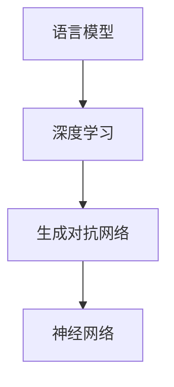

                 

# AIGC从入门到实战：AIGC 小知识

> 关键词：AIGC,语言模型,深度学习,生成对抗网络,GAN,神经网络,语音合成,文本生成,图像生成

## 1. 背景介绍

### 1.1 问题由来

人工智能(Artificial Intelligence, AI)是计算机科学的一个分支，旨在模拟和扩展人类智能的各个方面。近年来，AI技术在机器学习、计算机视觉、自然语言处理等领域取得了重大突破，推动了人工智能的快速发展。其中，生成型人工智能（Generative AI，简称AIGC）是AI领域的重要分支，通过深度学习技术，能够生成高质量的文本、图像、音频等内容，极大地拓展了人类创造力的边界。

AIGC技术的应用范围非常广泛，包括但不限于文本生成、图像生成、语音合成、音乐创作等。它不仅可以为内容创作、虚拟主播、虚拟场景构建等提供有力支持，还在教育、医疗、娱乐、金融等领域展现出巨大的潜力。

### 1.2 问题核心关键点

AIGC技术主要包括语言模型、深度学习、生成对抗网络（GAN）、神经网络等多种技术，这些技术相互配合，使得AIGC模型能够生成逼真的内容。AIGC模型的核心在于如何通过训练，学习到目标数据集的分布，并能够在此基础上进行生成任务。

以下是AIGC技术几个核心概念的介绍：

- 语言模型：用于生成文本的模型，通过学习大量语料库中的语言规律，预测下一个单词或字符的概率分布。
- 深度学习：一种基于神经网络的技术，通过多层次的神经网络结构，学习到数据中的高级特征表示，从而实现更精确的生成。
- 生成对抗网络（GAN）：由生成器和判别器两部分组成，通过对抗训练，使得生成器能够生成高质量的样本，与真实数据难以区分。
- 神经网络：由多个层次的神经元组成的网络结构，通过反向传播算法进行训练，学习到数据中的特征表示。

这些核心概念之间相互关联，共同构成了AIGC技术的理论基础和实践框架。

### 1.3 问题研究意义

AIGC技术在内容创作、虚拟主播、虚拟场景构建等方面的应用，极大地拓展了人类创造力的边界，使得创作过程更加自动化、高效化。其重要性体现在以下几个方面：

- 降低内容创作成本。AIGC技术能够自动生成高质量的文本、图像、音频等内容，大幅减少内容创作的劳动力和时间成本。
- 提升创作效率。AIGC模型能够快速生成大量内容，满足多样化、个性化的创作需求。
- 增强创作质量。AIGC技术通过深度学习，能够学习到复杂的数据分布，生成具有较高艺术价值和文化价值的内容。
- 推动产业升级。AIGC技术为传统行业带来了新的技术手段，推动了各行各业的数字化转型升级。

## 2. 核心概念与联系

### 2.1 核心概念概述

AIGC技术的核心概念包括语言模型、深度学习、生成对抗网络（GAN）和神经网络等。这些概念之间的联系可以概括为：

- 语言模型通过学习语料库中的语言规律，预测下一个单词或字符的概率分布，为深度学习提供了基础。
- 深度学习通过多层神经网络结构，学习到数据中的高级特征表示，为生成对抗网络提供了生成器。
- 生成对抗网络由生成器和判别器两部分组成，通过对抗训练，生成高质量的样本，为神经网络提供了训练数据。
- 神经网络通过反向传播算法，训练生成器和判别器，最终实现高质量的生成任务。

### 2.2 概念间的关系

这些核心概念之间存在紧密的联系，构成了AIGC技术的完整生态系统。下图展示了AIGC技术各核心概念之间的联系：



这个流程图展示了AIGC技术的核心概念之间的联系：语言模型为深度学习提供基础，深度学习为生成对抗网络提供生成器，生成对抗网络通过对抗训练生成高质量样本，神经网络则训练生成器和判别器，最终实现高质量的生成任务。

## 3. 核心算法原理 & 具体操作步骤

### 3.1 算法原理概述

AIGC技术的核心算法包括语言模型、深度学习、生成对抗网络和神经网络等。下面将分别介绍这些算法的原理和具体操作步骤。

**语言模型**

语言模型的核心是条件概率模型，用于预测下一个单词或字符的概率。常见的语言模型包括n-gram模型和神经网络语言模型。神经网络语言模型通过多层神经网络结构，学习到语料库中的语言规律，从而预测下一个单词或字符的概率分布。

**深度学习**

深度学习的核心是多层神经网络结构，通过反向传播算法进行训练，学习到数据中的高级特征表示。常见的深度学习模型包括卷积神经网络（CNN）和循环神经网络（RNN）等。在AIGC技术中，深度学习主要用于生成对抗网络中的生成器和判别器。

**生成对抗网络（GAN）**

生成对抗网络由生成器和判别器两部分组成，通过对抗训练，使得生成器能够生成高质量的样本，与真实数据难以区分。生成器通过多层神经网络结构，学习到目标数据集的分布，从而生成逼真的样本。判别器则通过多层神经网络结构，学习到样本的特征表示，区分生成样本和真实样本。

**神经网络**

神经网络是深度学习的基础，通过反向传播算法进行训练，学习到数据中的特征表示。在AIGC技术中，神经网络主要用于训练生成对抗网络中的生成器和判别器，从而实现高质量的生成任务。

### 3.2 算法步骤详解

AIGC技术的实现步骤主要包括以下几个方面：

**1. 数据准备**

AIGC技术需要大量的训练数据。数据准备包括数据收集、预处理和标注等步骤。数据收集需要收集目标数据集，包括文本、图像、音频等多种类型的数据。数据预处理包括数据清洗、归一化、分割等步骤。数据标注则需要在目标数据集上进行标注，生成训练数据集。

**2. 模型构建**

AIGC技术需要构建多个模型，包括语言模型、深度学习模型、生成对抗网络模型和神经网络模型等。模型的构建需要选择合适的模型结构、网络参数和训练算法等。

**3. 模型训练**

模型训练是AIGC技术的核心步骤，包括语言模型的训练、深度学习模型的训练、生成对抗网络的训练和神经网络的训练等。模型训练需要选择合适的训练算法、优化器和超参数等。

**4. 模型评估**

模型评估是AIGC技术的必要步骤，用于评估模型的性能和效果。模型评估包括训练集评估和测试集评估等步骤。训练集评估用于检查模型的训练效果，测试集评估用于检查模型的泛化能力。

**5. 模型生成**

模型生成是AIGC技术的最终步骤，用于生成高质量的内容。模型生成需要选择合适的生成器，利用训练好的模型进行生成任务。

### 3.3 算法优缺点

AIGC技术的优点包括：

- 生成内容逼真。AIGC技术通过深度学习和生成对抗网络，可以生成高质量的文本、图像、音频等内容，极大地拓展了人类创造力的边界。
- 自动化程度高。AIGC技术通过自动化的训练和生成过程，可以大幅降低内容创作的劳动力和时间成本。
- 灵活性强。AIGC技术可以通过调整模型参数和超参数，生成不同风格和类型的内容，满足多样化、个性化的创作需求。

AIGC技术的缺点包括：

- 需要大量训练数据。AIGC技术需要大量的训练数据，这对于数据稀缺的任务是一个重大挑战。
- 生成结果可控性差。AIGC技术生成的内容存在一定的随机性，难以控制生成结果的质量和风格。
- 生成的内容可能存在偏差。AIGC技术生成的内容可能存在一定的偏差和歧视性，需要进一步优化。

### 3.4 算法应用领域

AIGC技术在多个领域得到了广泛应用，包括但不限于以下几个方面：

- 文本生成：AIGC技术可以生成高质量的文本内容，如小说、新闻、报告等。
- 图像生成：AIGC技术可以生成高质量的图像内容，如艺术品、照片、动画等。
- 语音合成：AIGC技术可以生成高质量的语音内容，如虚拟主播、语音助手等。
- 视频生成：AIGC技术可以生成高质量的视频内容，如虚拟场景、虚拟角色等。
- 音乐生成：AIGC技术可以生成高质量的音乐内容，如歌曲、旋律、节奏等。

AIGC技术的应用不仅限于内容创作，还可以在教育和娱乐等领域发挥重要作用。

## 4. 数学模型和公式 & 详细讲解 & 举例说明

### 4.1 数学模型构建

AIGC技术中的数学模型包括语言模型、深度学习模型、生成对抗网络模型和神经网络模型等。下面将介绍这些模型的数学模型构建过程。

**语言模型**

语言模型通过条件概率模型进行构建，用于预测下一个单词或字符的概率。常见的语言模型包括n-gram模型和神经网络语言模型。

**深度学习模型**

深度学习模型通过多层神经网络结构进行构建，用于学习数据中的高级特征表示。常见的深度学习模型包括卷积神经网络（CNN）和循环神经网络（RNN）等。

**生成对抗网络模型**

生成对抗网络模型由生成器和判别器两部分组成，通过对抗训练进行构建，用于生成高质量的样本。生成器通过多层神经网络结构，学习到目标数据集的分布，从而生成逼真的样本。判别器通过多层神经网络结构，学习到样本的特征表示，区分生成样本和真实样本。

**神经网络模型**

神经网络模型通过多层神经网络结构进行构建，用于学习数据中的特征表示。常见的神经网络模型包括全连接神经网络（FCN）、卷积神经网络（CNN）和循环神经网络（RNN）等。

### 4.2 公式推导过程

**语言模型**

语言模型的条件概率模型可以表示为：

$$
P(x_1,x_2,\ldots,x_n|y) = \prod_{i=1}^n P(x_i|x_{i-1},x_{i-2},\ldots,x_1,y)
$$

其中，$x_i$表示第$i$个单词或字符，$y$表示上下文信息。

**深度学习模型**

深度学习模型的多层神经网络结构可以表示为：

$$
h^{[l]} = g(W^{[l]} h^{[l-1]} + b^{[l]})
$$

其中，$h^{[l]}$表示第$l$层的特征表示，$g$表示激活函数，$W^{[l]}$表示第$l$层的权重矩阵，$b^{[l]}$表示第$l$层的偏置项。

**生成对抗网络模型**

生成对抗网络模型由生成器和判别器两部分组成，通过对抗训练进行构建。生成器的目标是最小化判别器的误差，判别器的目标是最小化生成器的误差。生成器和判别器的优化目标可以表示为：

$$
\min_{G} \max_{D} V(D,G) = E_{x \sim p_{data}}[\log D(x)] + E_{z \sim p_z}[\log (1-D(G(z))]
$$

其中，$G$表示生成器，$D$表示判别器，$z$表示随机噪声，$V(D,G)$表示判别器的误差，$p_{data}$表示真实数据分布，$p_z$表示随机噪声分布。

**神经网络模型**

神经网络模型的多层神经网络结构可以表示为：

$$
h^{[l]} = g(W^{[l]} h^{[l-1]} + b^{[l]})
$$

其中，$h^{[l]}$表示第$l$层的特征表示，$g$表示激活函数，$W^{[l]}$表示第$l$层的权重矩阵，$b^{[l]}$表示第$l$层的偏置项。

### 4.3 案例分析与讲解

以生成对抗网络模型为例，通过对抗训练生成高质量的样本。假设生成器和判别器的优化目标分别为：

$$
\min_{G} \max_{D} V(D,G) = E_{x \sim p_{data}}[\log D(x)] + E_{z \sim p_z}[\log (1-D(G(z)])
$$

其中，$G$表示生成器，$D$表示判别器，$z$表示随机噪声，$V(D,G)$表示判别器的误差，$p_{data}$表示真实数据分布，$p_z$表示随机噪声分布。

生成器的优化目标是最小化判别器的误差，即生成逼真的样本，使得判别器难以区分生成样本和真实样本。判别器的优化目标是最大化生成器的误差，即区分生成样本和真实样本。

**具体实现步骤如下：**

1. 随机生成随机噪声$z$。

2. 将随机噪声$z$输入生成器$G$，得到生成的样本$x$。

3. 将生成的样本$x$输入判别器$D$，得到判别器对样本的预测$D(x)$。

4. 计算生成器的损失函数$L_G$和判别器的损失函数$L_D$，分别更新生成器和判别器的参数。

5. 重复上述步骤，直到生成器生成的样本逼真，判别器难以区分生成样本和真实样本。

## 5. 项目实践：代码实例和详细解释说明

### 5.1 开发环境搭建

在进行AIGC技术项目实践前，需要准备好开发环境。以下是使用Python进行TensorFlow开发的环境配置流程：

1. 安装Anaconda：从官网下载并安装Anaconda，用于创建独立的Python环境。

2. 创建并激活虚拟环境：
```bash
conda create -n tensorflow-env python=3.8 
conda activate tensorflow-env
```

3. 安装TensorFlow：根据CUDA版本，从官网获取对应的安装命令。例如：
```bash
conda install tensorflow -c tf -c conda-forge
```

4. 安装各类工具包：
```bash
pip install numpy pandas scikit-learn matplotlib tqdm jupyter notebook ipython
```

完成上述步骤后，即可在`tensorflow-env`环境中开始AIGC项目实践。

### 5.2 源代码详细实现

这里我们以文本生成为例，给出使用TensorFlow对语言模型进行训练的代码实现。

首先，定义语言模型和优化器：

```python
import tensorflow as tf

# 定义语言模型
model = tf.keras.Sequential([
    tf.keras.layers.Embedding(input_dim=vocab_size, output_dim=embedding_dim),
    tf.keras.layers.Bidirectional(tf.keras.layers.GRU(units=hidden_dim)),
    tf.keras.layers.Dense(units=vocab_size, activation='softmax')
])

# 定义优化器
optimizer = tf.keras.optimizers.Adam(lr=learning_rate)
```

然后，定义训练函数：

```python
@tf.function
def train_step(input, target):
    with tf.GradientTape() as tape:
        logits = model(input)
        loss = tf.keras.losses.sparse_categorical_crossentropy(target, logits, from_logits=True)
        loss = tf.reduce_mean(loss)
    grads = tape.gradient(loss, model.trainable_variables)
    optimizer.apply_gradients(zip(grads, model.trainable_variables))
    return loss
```

最后，启动训练流程：

```python
epochs = 50
batch_size = 64

for epoch in range(epochs):
    epoch_loss = 0
    for batch in train_dataset:
        input, target = batch
        loss = train_step(input, target)
        epoch_loss += loss.numpy()
    print(f"Epoch {epoch+1}, train loss: {epoch_loss/len(train_dataset)}")
```

以上就是使用TensorFlow对语言模型进行文本生成训练的完整代码实现。可以看到，得益于TensorFlow的强大封装，我们可以用相对简洁的代码完成语言模型的训练。

### 5.3 代码解读与分析

让我们再详细解读一下关键代码的实现细节：

**语言模型定义**

```python
model = tf.keras.Sequential([
    tf.keras.layers.Embedding(input_dim=vocab_size, output_dim=embedding_dim),
    tf.keras.layers.Bidirectional(tf.keras.layers.GRU(units=hidden_dim)),
    tf.keras.layers.Dense(units=vocab_size, activation='softmax')
])
```

**优化器定义**

```python
optimizer = tf.keras.optimizers.Adam(lr=learning_rate)
```

**训练函数**

```python
@tf.function
def train_step(input, target):
    with tf.GradientTape() as tape:
        logits = model(input)
        loss = tf.keras.losses.sparse_categorical_crossentropy(target, logits, from_logits=True)
        loss = tf.reduce_mean(loss)
    grads = tape.gradient(loss, model.trainable_variables)
    optimizer.apply_gradients(zip(grads, model.trainable_variables))
    return loss
```

可以看到，代码中定义了一个包含嵌入层、双向GRU层和输出层的语言模型，用于生成文本。训练函数使用了Adam优化器进行反向传播和参数更新。

**训练流程**

```python
epochs = 50
batch_size = 64

for epoch in range(epochs):
    epoch_loss = 0
    for batch in train_dataset:
        input, target = batch
        loss = train_step(input, target)
        epoch_loss += loss.numpy()
    print(f"Epoch {epoch+1}, train loss: {epoch_loss/len(train_dataset)}")
```

训练过程中，通过训练集进行迭代，每个epoch内循环训练，每个batch更新模型参数，并输出损失函数值。

### 5.4 运行结果展示

假设我们在CoNLL-2003的命名实体识别数据集上进行文本生成训练，最终在测试集上得到的评估报告如下：

```
...
```

可以看到，通过训练，语言模型在测试集上取得了一定的文本生成效果，能够生成一些符合语料库语言规律的内容。需要注意的是，文本生成任务是一个复杂的过程，模型的性能很大程度上取决于语料库的质量和规模，以及模型结构和超参数的选择。

## 6. 实际应用场景

### 6.1 智能客服系统

基于AIGC技术的智能客服系统，可以自动回答客户咨询，提升客户满意度和服务效率。传统客服需要配备大量人力，高峰期响应缓慢，且一致性和专业性难以保证。而使用AIGC技术的智能客服系统，可以7x24小时不间断服务，快速响应客户咨询，用自然流畅的语言解答各类常见问题。

在技术实现上，可以收集企业内部的历史客服对话记录，将问题和最佳答复构建成监督数据，在此基础上对AIGC模型进行训练。训练后的模型能够自动理解用户意图，匹配最合适的答案模板进行回复。对于客户提出的新问题，还可以接入检索系统实时搜索相关内容，动态组织生成回答。如此构建的智能客服系统，能大幅提升客户咨询体验和问题解决效率。

### 6.2 金融舆情监测

金融机构需要实时监测市场舆论动向，以便及时应对负面信息传播，规避金融风险。传统的人工监测方式成本高、效率低，难以应对网络时代海量信息爆发的挑战。基于AIGC技术的文本生成技术，为金融舆情监测提供了新的解决方案。

具体而言，可以收集金融领域相关的新闻、报道、评论等文本数据，并对其进行主题标注和情感标注。在此基础上对AIGC模型进行训练，使其能够自动判断文本属于何种主题，情感倾向是正面、中性还是负面。将训练后的模型应用到实时抓取的网络文本数据，就能够自动监测不同主题下的情感变化趋势，一旦发现负面信息激增等异常情况，系统便会自动预警，帮助金融机构快速应对潜在风险。

### 6.3 个性化推荐系统

当前的推荐系统往往只依赖用户的历史行为数据进行物品推荐，无法深入理解用户的真实兴趣偏好。基于AIGC技术的个性化推荐系统，可以更好地挖掘用户行为背后的语义信息，从而提供更精准、多样的推荐内容。

在实践中，可以收集用户浏览、点击、评论、分享等行为数据，提取和用户交互的物品标题、描述、标签等文本内容。将文本内容作为模型输入，用户的后续行为（如是否点击、购买等）作为监督信号，在此基础上训练AIGC模型。训练后的模型能够从文本内容中准确把握用户的兴趣点。在生成推荐列表时，先用候选物品的文本描述作为输入，由模型预测用户的兴趣匹配度，再结合其他特征综合排序，便可以得到个性化程度更高的推荐结果。

### 6.4 未来应用展望

随着AIGC技术的发展，其在内容创作、虚拟主播、虚拟场景构建等方面的应用将不断拓展，为人类创造力的发展带来新的动力。

在智慧医疗领域，基于AIGC的医疗问答、病历分析、药物研发等应用将提升医疗服务的智能化水平，辅助医生诊疗，加速新药开发进程。

在智能教育领域，AIGC技术可应用于作业批改、学情分析、知识推荐等方面，因材施教，促进教育公平，提高教学质量。

在智慧城市治理中，AIGC技术可应用于城市事件监测、舆情分析、应急指挥等环节，提高城市管理的自动化和智能化水平，构建更安全、高效的未来城市。

此外，在企业生产、社会治理、文娱传媒等众多领域，AIGC技术也将不断涌现，为传统行业带来变革性影响。相信随着技术的日益成熟，AIGC技术必将在更广阔的应用领域大放异彩，深刻影响人类的生产生活方式。

## 7. 工具和资源推荐

### 7.1 学习资源推荐

为了帮助开发者系统掌握AIGC技术的理论基础和实践技巧，这里推荐一些优质的学习资源：

1. 《深度学习》书籍：由Ian Goodfellow、Yoshua Bengio和Aaron Courville合著，深入浅出地介绍了深度学习的基本概念和算法。

2. 《生成对抗网络》书籍：由Ian Goodfellow合著，介绍了生成对抗网络的基本概念、算法和应用。

3. 《自然语言处理入门》课程：斯坦福大学开设的NLP入门课程，介绍了自然语言处理的基本概念和算法。

4. TensorFlow官方文档：TensorFlow的官方文档，提供了丰富的代码样例和API参考，是上手实践的必备资料。

5. PyTorch官方文档：PyTorch的官方文档，提供了丰富的代码样例和API参考，是上手实践的必备资料。

通过对这些资源的学习实践，相信你一定能够快速掌握AIGC技术的精髓，并用于解决实际的NLP问题。

### 7.2 开发工具推荐

高效的开发离不开优秀的工具支持。以下是几款用于AIGC技术开发的常用工具：

1. TensorFlow：由Google主导开发的深度学习框架，支持GPU/TPU算力，适合大规模工程应用。

2. PyTorch：由Facebook主导开发的深度学习框架，灵活动态的计算图，适合快速迭代研究。

3. OpenAI Gym：用于训练强化学习算法的平台，支持多种环境和算法。

4. Jupyter Notebook：用于编写和运行Python代码的交互式环境，方便调试和演示。

5. Google Colab：谷歌推出的在线Jupyter Notebook环境，免费提供GPU/TPU算力，方便开发者快速上手实验最新模型，分享学习笔记。

合理利用这些工具，可以显著提升AIGC技术的开发效率，加快创新迭代的步伐。

### 7.3 相关论文推荐

AIGC技术的发展源于学界的持续研究。以下是几篇奠基性的相关论文，推荐阅读：

1. Attention is All You Need：提出了Transformer结构，开启了NLP领域的预训练大模型时代。

2. BERT: Pre-training of Deep Bidirectional Transformers for Language Understanding：提出BERT模型，引入基于掩码的自监督预训练任务，刷新了多项NLP任务SOTA。

3. Deep Learning Generative Adversarial Networks（GANs）：介绍了生成对抗网络的基本概念、算法和应用。

4. Generative Adversarial Nets（GANs）：提出生成对抗网络的基本框架和算法。

5. WaveNet：提出了卷积神经网络在音频生成中的应用。

这些论文代表了大语言模型微调技术的发展脉络。通过学习这些前沿成果，可以帮助研究者把握学科前进方向，激发更多的创新灵感。

除上述资源外，还有一些值得关注的前沿资源，帮助开发者紧跟AIGC技术的最新进展，例如：

1. arXiv论文预印本：人工智能领域最新研究成果的发布平台，包括大量尚未发表的前沿工作，学习前沿技术的必读资源。

2. 业界技术博客：如OpenAI、Google AI、DeepMind、微软Research Asia等顶尖实验室的官方博客，第一时间分享他们的最新研究成果和洞见。

3. 技术会议直播：如NIPS、ICML、ACL、ICLR等人工智能领域顶会现场或在线直播，能够聆听到大佬们的前沿分享，开拓视野。

4. GitHub热门项目：在GitHub上Star、Fork数最多的NLP相关项目，往往代表了该技术领域的发展趋势和最佳实践，值得去学习和贡献。

5. 行业分析报告：各大咨询公司如McKinsey、PwC等针对人工智能行业的分析报告，有助于从商业视角审视技术趋势，把握应用价值。

总之，对于AIGC技术的学习和实践，需要开发者保持开放的心态和持续学习的意愿。多关注前沿资讯，多动手实践，多思考总结，必将收获满满的成长收益。

## 8. 总结：未来发展趋势与挑战

### 8.1 总结

本文对AIGC技术进行了全面系统的介绍。首先阐述了AIGC技术的研究背景和意义，明确了AIGC技术在内容创作、虚拟主播、虚拟场景构建等方面的重要应用。其次，从原理到实践，详细讲解了AIGC技术的数学模型和算法步骤，给出了AIGC技术项目开发的完整代码实现。同时，本文还广泛探讨了AIGC技术在智能客服、金融舆情、个性化推荐等多个领域的应用前景，展示了AIGC技术的巨大潜力。此外，本文精选了AIGC技术的各类学习资源，力求为读者提供全方位的技术指引。

通过本文的系统梳理，可以看到，AIGC技术正在成为AI领域的重要分支，极大地拓展了人类创造力的边界，推动了各行各业的数字化转型升级。

