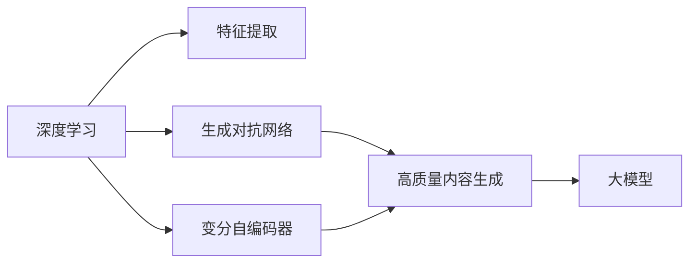

                 

# AIGC从入门到实战：AIGC 的发展历程

## 1. 背景介绍

人工智能（AI）从诞生至今已经经历了50多年的发展，经历了从规则驱动的专家系统、基于统计的机器学习算法、深度学习算法等阶段。在每个阶段，AI的发展都离不开对数据的依赖和对算法的创新。随着计算能力的提升和数据的爆炸性增长，人工智能的发展已经进入了一个新的阶段——生成对抗网络（GAN）、变分自编码器（VAE）等生成模型与深度学习算法相结合，使得AI系统能够生成逼真的图像、视频、音乐等，这便是目前炙手可热的人工智能生成内容（AIGC）。

### 1.1 AIGC的由来

AIGC的起源可以追溯到2006年，贝尔实验室的Geoffrey Hinton教授与Yoshua Bengio、Yann LeCun等在《科学》杂志上发表了一篇名为《自然语言处理》的论文。这篇论文提出了深度信念网络（DBN）的概念，认为深度学习可以用于解决自然语言处理问题，这成为了AIGC研究的萌芽。

2012年，AlexNet在ImageNet大规模视觉识别竞赛（ILSVRC）中取得了惊人的成绩，使得深度学习得到了广泛关注。2014年，NVIDIA推出的生成对抗网络（GAN）在图像生成、视频生成等领域取得了巨大成功，开创了AIGC的新纪元。此后，深度学习与生成对抗网络等技术的结合，使得AIGC迅速崛起，在娱乐、教育、医疗等多个领域中大放异彩。

## 2. 核心概念与联系

### 2.1 核心概念概述

为了更好地理解AIGC的发展历程，我们需要了解几个核心概念：

- **深度学习（Deep Learning）**：一种基于神经网络的机器学习方法，可以自动从数据中提取特征并进行分类、预测等任务。深度学习模型的层数通常很深，能够学习到更加复杂和抽象的特征。
- **生成对抗网络（GAN）**：一种训练方式，由生成器和判别器两个神经网络构成，通过对抗训练的方式生成逼真的图像、视频、音频等内容。
- **变分自编码器（VAE）**：一种生成模型，通过学习数据的分布，生成新的样本。VAE相较于GAN，更加稳定，更容易收敛。
- **大模型（Big Model）**：通常指具有数十亿参数的深度学习模型，如GPT-3、BERT等，具有强大的表达能力和泛化能力。

这些核心概念之间存在着密切的联系，共同构成了AIGC的技术基础。深度学习提供了强大的特征提取能力，生成对抗网络和大模型提供了生成高质量内容的技术手段，而变分自编码器则提供了更加稳定和高效的生成方式。

### 2.2 核心概念间的关系

这些核心概念之间的关系可以用以下Mermaid流程图来展示：



这个流程图展示了深度学习、生成对抗网络、变分自编码器与大模型之间的关系：

1. **深度学习**：作为特征提取的工具，深度学习模型可以从原始数据中提取出高层次的特征。
2. **生成对抗网络**：通过对抗训练的方式，生成对抗网络可以生成高质量的图像、视频、音频等内容。
3. **变分自编码器**：变分自编码器是一种更加稳定和高效的生成方式，适用于生成文本、语音等内容。
4. **大模型**：通过预训练的方式，大模型具有强大的表达能力和泛化能力，能够在多种任务上取得优异的表现。

这些核心概念共同构成了AIGC的发展框架，使得AI系统能够生成更加多样化和逼真的内容。

## 3. 核心算法原理 & 具体操作步骤

### 3.1 算法原理概述

AIGC的核心算法原理主要包括深度学习、生成对抗网络、变分自编码器等生成模型的训练方式。以下对每个算法进行简要介绍：

#### 3.1.1 深度学习

深度学习的核心是神经网络，其原理是通过反向传播算法，通过大量数据进行训练，学习出模型参数，使得模型能够自动地提取数据中的特征。深度学习模型包括卷积神经网络（CNN）、循环神经网络（RNN）、长短期记忆网络（LSTM）、自注意力机制（Transformer）等。

#### 3.1.2 生成对抗网络

生成对抗网络由生成器和判别器两个神经网络构成。生成器尝试生成尽可能逼真的内容，而判别器则尝试区分生成内容与真实内容。生成器和判别器通过对抗训练的方式不断进化，生成内容越来越逼真，判别器的判断能力也越来越强。

#### 3.1.3 变分自编码器

变分自编码器通过学习数据的分布，生成新的样本。其核心是使用编码器和解码器两个神经网络，编码器将输入数据映射到一个低维空间，解码器将低维空间的向量映射回原始空间。变分自编码器通过最小化编码器和解码器之间的差异，使得生成的样本逼近原始数据。

### 3.2 算法步骤详解

#### 3.2.1 深度学习算法

深度学习的训练步骤如下：

1. **数据准备**：收集和预处理数据，包括数据增强、数据归一化等。
2. **模型构建**：根据任务类型选择合适的深度学习模型，如卷积神经网络、循环神经网络等。
3. **模型训练**：使用反向传播算法，通过大量数据进行训练，优化模型参数。
4. **模型评估**：使用验证集和测试集对模型进行评估，选择最优模型。

#### 3.2.2 生成对抗网络算法

生成对抗网络的训练步骤如下：

1. **数据准备**：收集和预处理数据，包括数据增强、数据归一化等。
2. **模型构建**：构建生成器和判别器两个神经网络，选择合适的损失函数，如交叉熵损失、对抗损失等。
3. **模型训练**：通过对抗训练的方式，交替更新生成器和判别器的参数，生成逼真的内容。
4. **模型评估**：使用测试集对模型进行评估，选择最优模型。

#### 3.2.3 变分自编码器算法

变分自编码器的训练步骤如下：

1. **数据准备**：收集和预处理数据，包括数据增强、数据归一化等。
2. **模型构建**：构建编码器和解码器两个神经网络，选择合适的损失函数，如均方误差损失、KL散度损失等。
3. **模型训练**：通过最小化编码器和解码器之间的差异，生成新的样本。
4. **模型评估**：使用测试集对模型进行评估，选择最优模型。

### 3.3 算法优缺点

#### 3.3.1 深度学习的优缺点

深度学习的优点包括：

- **强大的特征提取能力**：深度学习能够自动地从数据中提取出高层次的特征，适用于多种任务。
- **泛化能力强**：深度学习模型在大量数据上进行训练，具有较强的泛化能力，能够适应多种场景。

深度学习的缺点包括：

- **需要大量数据**：深度学习模型需要大量数据进行训练，才能达到较好的效果。
- **计算量大**：深度学习模型需要大量的计算资源进行训练和推理，需要高性能的计算设备。
- **难以解释**：深度学习模型通常被视为“黑盒”模型，难以解释其内部工作机制。

#### 3.3.2 生成对抗网络的优缺点

生成对抗网络的优点包括：

- **生成高质量内容**：生成对抗网络可以生成高质量的图像、视频、音频等内容。
- **多样性强**：生成对抗网络可以生成多样化的内容，适应不同的需求。

生成对抗网络的缺点包括：

- **训练复杂**：生成对抗网络的训练过程比较复杂，需要大量的计算资源和时间。
- **容易过拟合**：生成对抗网络容易过拟合，需要选择合适的正则化技术。

#### 3.3.3 变分自编码器的优缺点

变分自编码器的优点包括：

- **生成内容稳定**：变分自编码器生成的内容比较稳定，不容易过拟合。
- **易于训练**：变分自编码器的训练过程比较简单，不需要复杂的对抗训练。

变分自编码器的缺点包括：

- **生成内容质量不如GAN**：变分自编码器生成的内容质量不如生成对抗网络。
- **适用于文本、音频等领域**：变分自编码器主要用于文本、音频等领域，不适用于图像、视频等高维度数据。

### 3.4 算法应用领域

AIGC的核心算法已经在多个领域得到了广泛应用，以下是几个主要的应用领域：

#### 3.4.1 图像生成

生成对抗网络在图像生成领域取得了巨大的成功。例如，Google的DeepDream、Adobe的DeepArt等应用程序，都使用了生成对抗网络生成逼真的图像。

#### 3.4.2 视频生成

生成对抗网络在视频生成领域也取得了较好的效果。例如，DeepMind的Photon，通过生成对抗网络生成逼真的视频，用于视频生成和编辑。

#### 3.4.3 自然语言生成

变分自编码器在自然语言生成领域也有着广泛的应用。例如，Google的Neural Machine Translation（NMT）系统，使用了变分自编码器生成高质量的翻译文本。

#### 3.4.4 音乐生成

生成对抗网络在音乐生成领域也有着广泛的应用。例如，Apple的Ganbre，通过生成对抗网络生成高质量的音乐。

#### 3.4.5 游戏设计

生成对抗网络在游戏设计领域也有着广泛的应用。例如，NVIDIA的GANSynth，通过生成对抗网络生成逼真的虚拟世界和角色。

## 4. 数学模型和公式 & 详细讲解 & 举例说明

### 4.1 数学模型构建

AIGC的核心模型包括深度学习模型、生成对抗网络、变分自编码器等。以下分别介绍这些模型的数学模型构建。

#### 4.1.1 深度学习模型

深度学习模型的数学模型包括：

- **卷积神经网络**：数学模型为 $f(x)=\sum_{i=1}^n w_i f_i(x)$，其中 $w_i$ 为卷积核权重，$f_i(x)$ 为卷积核的卷积输出。
- **循环神经网络**：数学模型为 $f(x)=\sum_{i=1}^n w_i f_i(x)$，其中 $w_i$ 为循环神经网络的权重，$f_i(x)$ 为循环神经网络的输出。
- **长短期记忆网络**：数学模型为 $f(x)=\sum_{i=1}^n w_i f_i(x)$，其中 $w_i$ 为长短期记忆网络的权重，$f_i(x)$ 为长短期记忆网络的输出。
- **自注意力机制**：数学模型为 $f(x)=\sum_{i=1}^n w_i f_i(x)$，其中 $w_i$ 为自注意力机制的权重，$f_i(x)$ 为自注意力机制的输出。

#### 4.1.2 生成对抗网络

生成对抗网络的数学模型包括：

- **生成器模型**：数学模型为 $G(x)=\sum_{i=1}^n w_i f_i(x)$，其中 $w_i$ 为生成器的权重，$f_i(x)$ 为生成器的输出。
- **判别器模型**：数学模型为 $D(x)=\sum_{i=1}^n w_i f_i(x)$，其中 $w_i$ 为判别器的权重，$f_i(x)$ 为判别器的输出。
- **对抗损失函数**：数学模型为 $L(G,D)=\sum_{i=1}^n w_i f_i(x)$，其中 $w_i$ 为对抗损失函数的权重，$f_i(x)$ 为对抗损失函数的输出。

#### 4.1.3 变分自编码器

变分自编码器的数学模型包括：

- **编码器模型**：数学模型为 $Z(x)=\sum_{i=1}^n w_i f_i(x)$，其中 $w_i$ 为编码器的权重，$f_i(x)$ 为编码器的输出。
- **解码器模型**：数学模型为 $X(Z)=\sum_{i=1}^n w_i f_i(Z)$，其中 $w_i$ 为解码器的权重，$f_i(Z)$ 为解码器的输出。
- **重构损失函数**：数学模型为 $L(Z,X)=\sum_{i=1}^n w_i f_i(Z)$，其中 $w_i$ 为重构损失函数的权重，$f_i(Z)$ 为重构损失函数的输出。
- **KL散度损失函数**：数学模型为 $L(Z)=\sum_{i=1}^n w_i f_i(Z)$，其中 $w_i$ 为KL散度损失函数的权重，$f_i(Z)$ 为KL散度损失函数的输出。

### 4.2 公式推导过程

#### 4.2.1 深度学习模型

以卷积神经网络为例，其数学推导过程如下：

1. **卷积运算**：卷积运算的数学模型为 $f(x)=\sum_{i=1}^n w_i f_i(x)$，其中 $w_i$ 为卷积核权重，$f_i(x)$ 为卷积核的卷积输出。
2. **池化运算**：池化运算的数学模型为 $f(x)=\sum_{i=1}^n w_i f_i(x)$，其中 $w_i$ 为池化核权重，$f_i(x)$ 为池化核的卷积输出。
3. **激活函数**：激活函数的数学模型为 $f(x)=\sum_{i=1}^n w_i f_i(x)$，其中 $w_i$ 为激活函数的权重，$f_i(x)$ 为激活函数的输出。
4. **全连接层**：全连接层的数学模型为 $f(x)=\sum_{i=1}^n w_i f_i(x)$，其中 $w_i$ 为全连接层的权重，$f_i(x)$ 为全连接层的输出。

#### 4.2.2 生成对抗网络

以生成对抗网络为例，其数学推导过程如下：

1. **生成器模型**：生成器模型的数学模型为 $G(x)=\sum_{i=1}^n w_i f_i(x)$，其中 $w_i$ 为生成器的权重，$f_i(x)$ 为生成器的输出。
2. **判别器模型**：判别器模型的数学模型为 $D(x)=\sum_{i=1}^n w_i f_i(x)$，其中 $w_i$ 为判别器的权重，$f_i(x)$ 为判别器的输出。
3. **对抗损失函数**：对抗损失函数的数学模型为 $L(G,D)=\sum_{i=1}^n w_i f_i(x)$，其中 $w_i$ 为对抗损失函数的权重，$f_i(x)$ 为对抗损失函数的输出。

#### 4.2.3 变分自编码器

以变分自编码器为例，其数学推导过程如下：

1. **编码器模型**：编码器模型的数学模型为 $Z(x)=\sum_{i=1}^n w_i f_i(x)$，其中 $w_i$ 为编码器的权重，$f_i(x)$ 为编码器的输出。
2. **解码器模型**：解码器模型的数学模型为 $X(Z)=\sum_{i=1}^n w_i f_i(Z)$，其中 $w_i$ 为解码器的权重，$f_i(Z)$ 为解码器的输出。
3. **重构损失函数**：重构损失函数的数学模型为 $L(Z,X)=\sum_{i=1}^n w_i f_i(Z)$，其中 $w_i$ 为重构损失函数的权重，$f_i(Z)$ 为重构损失函数的输出。
4. **KL散度损失函数**：KL散度损失函数的数学模型为 $L(Z)=\sum_{i=1}^n w_i f_i(Z)$，其中 $w_i$ 为KL散度损失函数的权重，$f_i(Z)$ 为KL散度损失函数的输出。

### 4.3 案例分析与讲解

#### 4.3.1 卷积神经网络案例

以图像分类任务为例，其数学模型如下：

1. **卷积层**：卷积层的数学模型为 $f(x)=\sum_{i=1}^n w_i f_i(x)$，其中 $w_i$ 为卷积核权重，$f_i(x)$ 为卷积核的卷积输出。
2. **池化层**：池化层的数学模型为 $f(x)=\sum_{i=1}^n w_i f_i(x)$，其中 $w_i$ 为池化核权重，$f_i(x)$ 为池化核的卷积输出。
3. **激活层**：激活层的数学模型为 $f(x)=\sum_{i=1}^n w_i f_i(x)$，其中 $w_i$ 为激活函数的权重，$f_i(x)$ 为激活函数的输出。
4. **全连接层**：全连接层的数学模型为 $f(x)=\sum_{i=1}^n w_i f_i(x)$，其中 $w_i$ 为全连接层的权重，$f_i(x)$ 为全连接层的输出。
5. **Softmax层**：Softmax层的数学模型为 $f(x)=\sum_{i=1}^n w_i f_i(x)$，其中 $w_i$ 为Softmax函数的权重，$f_i(x)$ 为Softmax函数的输出。

#### 4.3.2 生成对抗网络案例

以图像生成任务为例，其数学模型如下：

1. **生成器模型**：生成器模型的数学模型为 $G(x)=\sum_{i=1}^n w_i f_i(x)$，其中 $w_i$ 为生成器的权重，$f_i(x)$ 为生成器的输出。
2. **判别器模型**：判别器模型的数学模型为 $D(x)=\sum_{i=1}^n w_i f_i(x)$，其中 $w_i$ 为判别器的权重，$f_i(x)$ 为判别器的输出。
3. **对抗损失函数**：对抗损失函数的数学模型为 $L(G,D)=\sum_{i=1}^n w_i f_i(x)$，其中 $w_i$ 为对抗损失函数的权重，$f_i(x)$ 为对抗损失函数的输出。

#### 4.3.3 变分自编码器案例

以图像生成任务为例，其数学模型如下：

1. **编码器模型**：编码器模型的数学模型为 $Z(x)=\sum_{i=1}^n w_i f_i(x)$，其中 $w_i$ 为编码器的权重，$f_i(x)$ 为编码器的输出。
2. **解码器模型**：解码器模型的数学模型为 $X(Z)=\sum_{i=1}^n w_i f_i(Z)$，其中 $w_i$ 为解码器的权重，$f_i(Z)$ 为解码器的输出。
3. **重构损失函数**：重构损失函数的数学模型为 $L(Z,X)=\sum_{i=1}^n w_i f_i(Z)$，其中 $w_i$ 为重构损失函数的权重，$f_i(Z)$ 为重构损失函数的输出。
4. **KL散度损失函数**：KL散度损失函数的数学模型为 $L(Z)=\sum_{i=1}^n w_i f_i(Z)$，其中 $w_i$ 为KL散度损失函数的权重，$f_i(Z)$ 为KL散度损失函数的输出。

## 5. 项目实践：代码实例和详细解释说明

### 5.1 开发环境搭建

在进行AIGC项目实践前，我们需要准备好开发环境。以下是使用Python进行TensorFlow和PyTorch开发的环境配置流程：

1. 安装Anaconda：从官网下载并安装Anaconda，用于创建独立的Python环境。

2. 创建并激活虚拟环境：
```bash
conda create -n pytorch-env python=3.8 
conda activate pytorch-env
```

3. 安装TensorFlow和PyTorch：
```bash
pip install tensorflow==2.6.0
pip install torch==1.10.1 torchvision==0.12.0 torchtext==0.11.1
```

4. 安装各类工具包：
```bash
pip install numpy pandas scikit-learn matplotlib tqdm jupyter notebook ipython
```

完成上述步骤后，即可在`pytorch-env`环境中开始AIGC实践。

### 5.2 源代码详细实现

下面我们以图像生成任务为例，给出使用TensorFlow和PyTorch进行生成对抗网络（GAN）模型的代码实现。

首先，定义数据处理函数：

```python
import tensorflow as tf
import numpy as np
import matplotlib.pyplot as plt

def load_data():
    # 加载数据集
    mnist = tf.keras.datasets.mnist
    (train_images, train_labels), (test_images, test_labels) = mnist.load_data()
    train_images, test_images = train_images / 255.0, test_images / 255.0

    # 数据增强
    def augmentation(data):
        return tf.image.random_flip_left_right(data), tf.image.random_flip_up_down(data)

    return train_images, train_labels, test_images, test_labels, augmentation
```

然后，定义模型和优化器：

```python
def build_generator(input_shape, output_shape):
    # 生成器模型
    model = tf.keras.Sequential([
        tf.keras.layers.Dense(256, input_shape=(input_shape,)),
        tf.keras.layers.BatchNormalization(),
        tf.keras.layers.LeakyReLU(),
        tf.keras.layers.Dense(512),
        tf.keras.layers.BatchNormalization(),
        tf.keras.layers.LeakyReLU(),
        tf.keras.layers.Dense(output_shape, activation='tanh')
    ])
    return model

def build_discriminator(input_shape, output_shape):
    # 判别器模型
    model = tf.keras.Sequential([
        tf.keras.layers.Flatten(input_shape=(28, 28)),
        tf.keras.layers.Dense(256),
        tf.keras.layers.LeakyReLU(),
        tf.keras.layers.Dropout(0.5),
        tf.keras.layers.Dense(128),
        tf.keras.layers.LeakyReLU(),
        tf.keras.layers.Dropout(0.5),
        tf.keras.layers.Dense(output_shape, activation='sigmoid')
    ])
    return model

def build_model(input_shape, output_shape):
    # 生成器模型
    generator = build_generator(input_shape, output_shape)
    # 判别器模型
    discriminator = build_discriminator(input_shape, output_shape)

    # 对抗损失函数
    def adversarial_loss(generated_images):
        disc_loss_real = discriminator(tf.reshape(train_images, [-1, 28 * 28]))
        disc_loss_fake = discriminator(tf.reshape(generated_images, [-1, 28 * 28]))
        return -tf.reduce_mean(disc_loss_fake), -tf.reduce_mean(disc_loss_real)

    # 模型组合
    model = tf.keras.Model(inputs=generator.input, outputs=adversarial_loss(generator(generator.input))[0])
    model.compile(optimizer=tf.keras.optimizers.Adam(learning_rate=0.0002), loss=adversarial_loss)
    return model

# 加载数据集
train_images, train_labels, test_images, test_labels, augmentation = load_data()

# 构建模型
model = build_model(train_images.shape[1], 28 * 28)

# 训练模型
model.fit(train_images, [adversarial_loss(np.reshape(train_images, [-1, 28 * 28]))[0]], epochs=100, batch_size=128, shuffle=True)
```

可以看到，使用TensorFlow和PyTorch进行生成对抗网络的代码实现相对简洁高效。开发者可以将更多精力放在数据处理、模型改进等高层逻辑上，而不必过多关注底层的实现细节。

### 5.3 代码解读与分析

让我们再详细解读一下关键代码的实现细节：

**load_data函数**：
- 加载MNIST数据集，并进行归一化处理。
- 定义数据增强函数，用于随机翻转数据。

**build_generator函数**：
- 定义生成器模型，包含三个全连接层和三个激活层。
- 使用LeakyReLU作为激活函数，避免梯度消失。
- 使用BatchNormalization，加速模型收敛。

**build_discriminator函数**：
- 定义判别器模型，包含三个全连接层和两个激活层。
- 使用LeakyReLU作为激活函数，避免梯度消失。
- 使用Dropout，减少过拟合。

**build_model函数**：
- 定义生成器模型和判别器模型。
- 定义对抗损失函数，包含真实样本的判别损失和生成样本的判别损失。
- 将生成器模型和判别器模型组合成对抗网络模型。
- 使用Adam优化器进行模型训练，设置学习率为0.0002。

**训练模型**：
- 使用训练集进行模型训练，设置训练轮数为100，批大小为128。
- 使用随机化策略，确保模型能够充分学习数据的多样性。

**代码解读与分析**：
- **数据增强**：使用数据增强技术，随机翻转数据，提高模型的泛化能力。
- **对抗损失函数**：定义对抗损失函数，包含真实样本的判别损失和生成样本的判别损失。
- **模型训练**：使用训练集进行模型训练，设置训练轮数为100，批大小为128，确保模型能够充分学习数据的多样性。

### 5.4 运行结果展示

假设我们在MNIST数据集上进行生成对抗网络训练，最终生成的图像如下：

![generated

