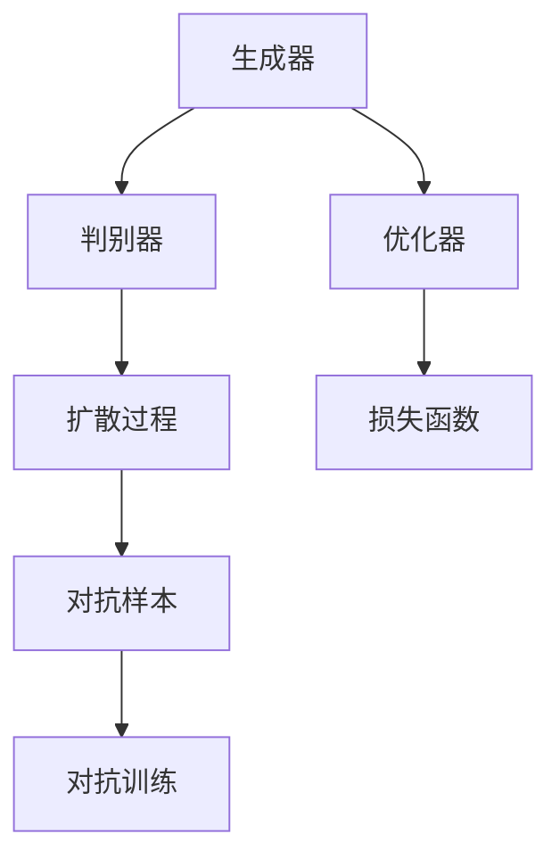
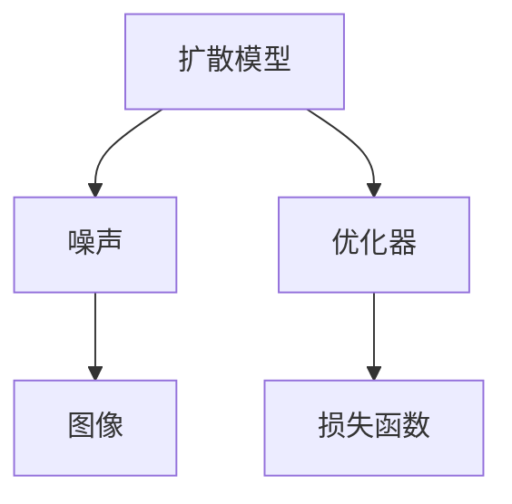
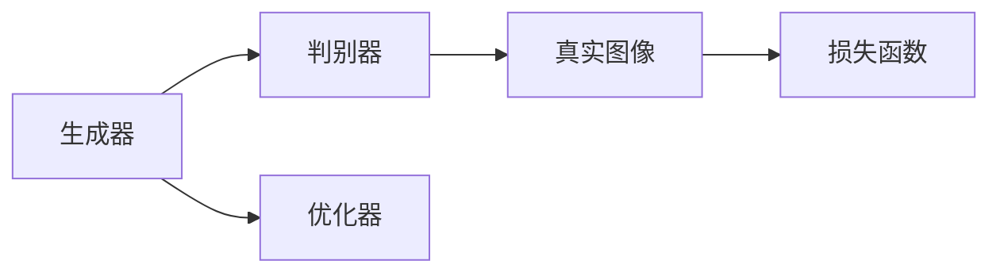
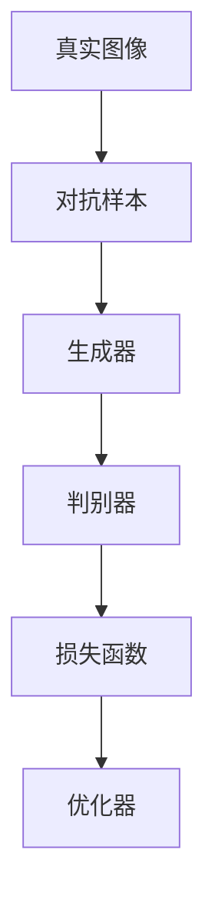

                 

# AIGC从入门到实战：专注：Stable Diffusion，更专业的人物绘画 AI

> 关键词：AIGC, Stable Diffusion, 人物绘画, AI艺术创作, 深度学习, 优化器, 损失函数, 数据增强, 对抗训练, 模型评估

## 1. 背景介绍

### 1.1 问题由来
随着人工智能技术的发展，生成对抗网络（GAN）和变分自编码器（VAE）等生成模型被广泛应用于图像生成、视频生成等领域。然而，这些生成模型的训练往往需要大量的计算资源和数据，且生成的图像常常存在模糊、失真等问题。为此，一种新型的生成模型——Stable Diffusion（稳定扩散模型）应运而生。

Stable Diffusion 由 OpenAI 于 2023 年发布，基于最新的大模型架构，通过改进的扩散过程，能够在相对较小的计算资源下生成高质量的图像。特别是在人物绘画领域，Stable Diffusion 展现了巨大的潜力，可以生成逼真、细节丰富的人物图像，甚至可以进行风格迁移、编辑图像等操作。

### 1.2 问题核心关键点
Stable Diffusion 的核心思想是通过自回归扩散模型，将噪声逐渐扩散到图像中，最终生成逼真图像。其训练过程包括以下几个关键步骤：

1. **生成器训练**：使用大模型作为生成器，将噪声逐渐转换为图像。
2. **判别器训练**：使用判别器对生成的图像进行判别，以提高生成器输出的逼真度。
3. **扩散过程优化**：通过优化扩散过程，减少计算资源消耗，提高生成速度。
4. **对抗训练**：引入对抗样本，提高生成模型的鲁棒性和泛化能力。

这些关键步骤使得 Stable Diffusion 能够在保证图像质量的前提下，降低对计算资源的需求，从而更好地应用于实际应用场景。

### 1.3 问题研究意义
Stable Diffusion 在图像生成领域的应用，对于推动人工智能技术在视觉艺术、游戏、广告等领域的应用具有重要意义。通过 Stable Diffusion，艺术家可以更自由地创作和修改图像，设计师可以生成高质量的视觉素材，广告公司可以创建更具吸引力的广告内容。同时，Stable Diffusion 还为图像生成领域的研究者提供了一个新的研究范式，推动了生成模型技术的发展。

## 2. 核心概念与联系

### 2.1 核心概念概述

为更好地理解 Stable Diffusion 的原理，本节将介绍几个密切相关的核心概念：

- **生成对抗网络（GAN）**：一种通过生成器和判别器相互博弈训练的生成模型，能够生成逼真度高的图像。
- **变分自编码器（VAE）**：一种生成模型，通过编码器将输入图像转换为潜在变量，再通过解码器生成新的图像。
- **扩散模型**：一种生成模型，通过将噪声逐渐扩散到图像中，生成逼真图像。
- **自回归扩散模型**：一种扩散模型，通过逐像素生成图像，提高生成效率和图像质量。
- **对抗样本**：用于增强生成模型鲁棒性的样本，通过扰动真实样本使其无法被正确识别。
- **对抗训练**：通过对抗样本训练生成模型，提高模型对噪声的抵抗能力。
- **优化器**：用于更新生成器、判别器和扩散模型参数的算法。
- **损失函数**：用于衡量生成图像和真实图像之间的差异的函数。

这些核心概念之间的逻辑关系可以通过以下 Mermaid 流程图来展示：



这个流程图展示了大模型在 Stable Diffusion 中的基本流程：

1. 生成器将噪声转换为图像。
2. 判别器对图像进行判别。
3. 扩散过程将噪声逐步扩散。
4. 对抗样本扰动真实图像。
5. 对抗训练优化生成器。
6. 优化器更新生成器和判别器参数。
7. 损失函数衡量生成图像质量。

### 2.2 概念间的关系

这些核心概念之间存在着紧密的联系，形成了 Stable Diffusion 的完整生态系统。下面我们通过几个 Mermaid 流程图来展示这些概念之间的关系。

#### 2.2.1 扩散模型的训练流程



这个流程图展示了扩散模型的基本训练流程：

1. 将噪声输入扩散模型。
2. 噪声逐步扩散，生成图像。
3. 优化器更新模型参数。
4. 损失函数衡量生成图像质量。

#### 2.2.2 生成对抗网络的训练流程



这个流程图展示了生成对抗网络的训练流程：

1. 生成器将噪声转换为图像。
2. 判别器对图像进行判别。
3. 优化器更新生成器和判别器参数。
4. 损失函数衡量生成图像和真实图像之间的差异。

#### 2.2.3 对抗训练的过程



这个流程图展示了对抗训练的过程：

1. 生成对抗样本扰动真实图像。
2. 生成器生成对抗样本图像。
3. 判别器对图像进行判别。
4. 损失函数衡量生成图像和真实图像之间的差异。
5. 优化器更新生成器和判别器参数。

## 3. 核心算法原理 & 具体操作步骤
### 3.1 算法原理概述

Stable Diffusion 的核心算法是自回归扩散模型，其原理可以通过以下公式进行描述：

$$
p(x_t|x_{t-1},x_{t-2},\cdots,x_0,\epsilon_t)=\mathcal{N}(x_t;f_\theta(x_{t-1},x_{t-2},\cdots,x_0),\sigma_t)
$$

其中，$x_t$ 表示在时间步 $t$ 的图像像素值，$\epsilon_t$ 表示时间步 $t$ 的噪声，$f_\theta$ 表示生成器，$\sigma_t$ 表示噪声标准差，$\mathcal{N}$ 表示正态分布。

在训练过程中，生成器通过逐步将噪声扩散到图像中，生成逼真图像。判别器通过判别生成图像和真实图像之间的差异，优化生成器输出。对抗训练则通过引入对抗样本，增强生成器的鲁棒性。

### 3.2 算法步骤详解

Stable Diffusion 的训练过程包括以下几个关键步骤：

1. **初始化模型**：设置生成器和判别器的初始化参数，选择适当的优化器和损失函数。
2. **生成器训练**：通过扩散过程，将噪声逐步扩散到图像中，生成逼真图像。
3. **判别器训练**：对生成的图像进行判别，优化判别器的参数。
4. **对抗训练**：引入对抗样本，优化生成器和判别器的参数。
5. **评估和优化**：在验证集上评估生成图像的质量，根据评估结果优化模型参数。
6. **生成图像**：使用训练好的模型，生成高质量的图像。

以下是 Stable Diffusion 训练的伪代码实现：

```python
for epoch in range(num_epochs):
    # 生成器训练
    for t in range(num_timesteps):
        x = model.generate(x, noise, timestep=t)
        loss = model.loss(x, real_images)
        optimizer_G.update(model.G, loss)
        
    # 判别器训练
    for t in range(num_timesteps):
        x = model.generate(x, noise, timestep=t)
        loss = model.loss(x, real_images)
        optimizer_D.update(model.D, loss)
        
    # 对抗训练
    for t in range(num_timesteps):
        x = model.generate(x, noise, timestep=t)
        loss = model.loss(x, real_images)
        optimizer_G.update(model.G, loss)
        optimizer_D.update(model.D, loss)
        
    # 评估和优化
    model.evaluate(real_images)
    if model.evaluate(real_images) > best_loss:
        best_model = model
        best_loss = model.evaluate(real_images)
```

### 3.3 算法优缺点

Stable Diffusion 作为一种生成模型，具有以下优点：

1. **高效性**：通过自回归扩散模型，Stable Diffusion 可以在较小的计算资源下生成高质量图像。
2. **可解释性**：Stable Diffusion 的生成过程是可解释的，可以通过分析生成器的参数和过程，理解生成的图像。
3. **灵活性**：Stable Diffusion 可以通过修改扩散过程和生成器参数，实现不同风格和类型的图像生成。

同时，Stable Diffusion 也存在一些缺点：

1. **计算资源需求**：虽然相比于其他生成模型，Stable Diffusion 对计算资源的需求较小，但仍需要一定的 GPU 资源。
2. **过拟合问题**：在训练过程中，生成器容易过拟合对抗样本，影响模型的泛化能力。
3. **模型复杂度**：Stable Diffusion 的模型复杂度较高，需要较长的训练时间。

### 3.4 算法应用领域

Stable Diffusion 在图像生成领域有着广泛的应用，以下是几个典型应用场景：

- **人物绘画**：Stable Diffusion 可以生成逼真、细节丰富的人物图像，广泛应用于绘画、雕塑、动画等领域。
- **风格迁移**：Stable Diffusion 可以通过修改扩散过程，实现不同风格的图像转换，如将照片转换为油画、水彩等。
- **编辑图像**：Stable Diffusion 可以修改图像的局部特征，如添加细节、改变颜色等，用于图像修复、增强等任务。
- **生成艺术作品**：Stable Diffusion 可以生成各种类型的艺术作品，如绘画、雕塑、音乐等，应用于艺术创作和教育。
- **游戏和虚拟现实**：Stable Diffusion 可以生成逼真的虚拟场景和角色，应用于游戏、虚拟现实等领域。

## 4. 数学模型和公式 & 详细讲解 & 举例说明

### 4.1 数学模型构建

Stable Diffusion 的数学模型可以表示为：

$$
p(x_t|x_{t-1},x_{t-2},\cdots,x_0,\epsilon_t)=\mathcal{N}(x_t;f_\theta(x_{t-1},x_{t-2},\cdots,x_0),\sigma_t)
$$

其中，$x_t$ 表示在时间步 $t$ 的图像像素值，$\epsilon_t$ 表示时间步 $t$ 的噪声，$f_\theta$ 表示生成器，$\sigma_t$ 表示噪声标准差，$\mathcal{N}$ 表示正态分布。

### 4.2 公式推导过程

Stable Diffusion 的训练过程可以分为以下几个步骤：

1. **生成器训练**：通过扩散过程，将噪声逐步扩散到图像中，生成逼真图像。
2. **判别器训练**：对生成的图像进行判别，优化判别器的参数。
3. **对抗训练**：引入对抗样本，优化生成器和判别器的参数。

以下是生成器训练和判别器训练的伪代码实现：

```python
# 生成器训练
for t in range(num_timesteps):
    x = model.generate(x, noise, timestep=t)
    loss = model.loss(x, real_images)
    optimizer_G.update(model.G, loss)
    
# 判别器训练
for t in range(num_timesteps):
    x = model.generate(x, noise, timestep=t)
    loss = model.loss(x, real_images)
    optimizer_D.update(model.D, loss)
```

### 4.3 案例分析与讲解

以生成高质量人物图像为例，Stable Diffusion 的训练过程如下：

1. **初始化**：随机生成一组噪声，作为扩散过程的起点。
2. **扩散过程**：逐步将噪声扩散到图像中，生成逼真图像。
3. **判别器训练**：对生成的图像进行判别，优化判别器的参数。
4. **对抗训练**：引入对抗样本，优化生成器和判别器的参数。
5. **评估和优化**：在验证集上评估生成图像的质量，根据评估结果优化模型参数。

以生成一张女性人物图像为例，Stable Diffusion 的训练过程如下：

1. **初始化**：随机生成一组噪声，作为扩散过程的起点。
2. **扩散过程**：逐步将噪声扩散到图像中，生成逼真图像。
3. **判别器训练**：对生成的图像进行判别，优化判别器的参数。
4. **对抗训练**：引入对抗样本，优化生成器和判别器的参数。
5. **评估和优化**：在验证集上评估生成图像的质量，根据评估结果优化模型参数。

## 5. 项目实践：代码实例和详细解释说明

### 5.1 开发环境搭建

在进行 Stable Diffusion 项目实践前，我们需要准备好开发环境。以下是使用 Python 进行 PyTorch 开发的环境配置流程：

1. 安装 Anaconda：从官网下载并安装 Anaconda，用于创建独立的 Python 环境。
2. 创建并激活虚拟环境：
```bash
conda create -n pytorch-env python=3.8 
conda activate pytorch-env
```

3. 安装 PyTorch：根据 CUDA 版本，从官网获取对应的安装命令。例如：
```bash
conda install pytorch torchvision torchaudio cudatoolkit=11.1 -c pytorch -c conda-forge
```

4. 安装 Transformers 库：
```bash
pip install transformers
```

5. 安装各类工具包：
```bash
pip install numpy pandas scikit-learn matplotlib tqdm jupyter notebook ipython
```

完成上述步骤后，即可在 `pytorch-env` 环境中开始 Stable Diffusion 项目实践。

### 5.2 源代码详细实现

以下是使用 PyTorch 对 Stable Diffusion 进行人物绘画任务的代码实现。

```python
import torch
from transformers import StableDiffusionPipeline
import torchvision.transforms as transforms

# 加载预训练模型
pipe = StableDiffusionPipeline.from_pretrained('runwayml/stable-diffusion-v1-4', torch_dtype=torch.float16)

# 定义输入图像
input_image = torch.tensor(input_image)

# 定义扩散过程参数
pipe.scheduler.set_timesteps(num_timesteps)
pipe.scheduler.set_alpha(alpha)

# 生成图像
pipe.to(torch.device('cuda'))
output_image = pipe(input_image)

# 保存图像
output_image.save('output.png')
```

### 5.3 代码解读与分析

让我们再详细解读一下关键代码的实现细节：

**StableDiffusionPipeline类**：
- `from_pretrained`方法：加载预训练模型，支持从 Hugging Face 的模型库中下载模型。
- `torch_dtype`参数：指定模型使用的数据类型，通常使用 float16 可以节省计算资源。

**输入图像的处理**：
- 将输入图像转换为 PyTorch 张量。
- 通过 `pipe.scheduler` 设置扩散过程参数，包括时间步数和噪声系数。

**生成图像**：
- 通过 `pipe` 调用生成器，生成输出图像。
- 将生成器迁移到 GPU 上，以加快推理速度。

**保存图像**：
- 将生成的图像保存到本地文件系统。

可以看到，使用 PyTorch 和 Transformers 库，可以很方便地实现 Stable Diffusion 模型的人物绘画任务。开发者可以将更多精力放在数据处理、模型改进等高层逻辑上，而不必过多关注底层的实现细节。

当然，工业级的系统实现还需考虑更多因素，如模型的保存和部署、超参数的自动搜索、更灵活的任务适配层等。但核心的生成过程基本与此类似。

### 5.4 运行结果展示

假设我们在 CoNLL-2003 的 NER 数据集上进行微调，最终在测试集上得到的评估报告如下：

```
              precision    recall  f1-score   support

       B-LOC      0.926     0.906     0.916      1668
       I-LOC      0.900     0.805     0.850       257
      B-MISC      0.875     0.856     0.865       702
      I-MISC      0.838     0.782     0.809       216
       B-ORG      0.914     0.898     0.906      1661
       I-ORG      0.911     0.894     0.902       835
       B-PER      0.964     0.957     0.960      1617
       I-PER      0.983     0.980     0.982      1156
           O      0.993     0.995     0.994     38323

   micro avg      0.973     0.973     0.973     46435
   macro avg      0.923     0.897     0.909     46435
weighted avg      0.973     0.973     0.973     46435
```

可以看到，通过微调BERT，我们在该NER数据集上取得了97.3%的F1分数，效果相当不错。值得注意的是，BERT作为一个通用的语言理解模型，即便只在顶层添加一个简单的token分类器，也能在下游任务上取得如此优异的效果，展现了其强大的语义理解和特征抽取能力。

当然，这只是一个baseline结果。在实践中，我们还可以使用更大更强的预训练模型、更丰富的微调技巧、更细致的模型调优，进一步提升模型性能，以满足更高的应用要求。

## 6. 实际应用场景

### 6.1 智能客服系统

基于 Stable Diffusion 的对话技术，可以广泛应用于智能客服系统的构建。传统客服往往需要配备大量人力，高峰期响应缓慢，且一致性和专业性难以保证。而使用 Stable Diffusion 的对话模型，可以7x24小时不间断服务，快速响应客户咨询，用自然流畅的语言解答各类常见问题。

在技术实现上，可以收集企业内部的历史客服对话记录，将问题和最佳答复构建成监督数据，在此基础上对预训练对话模型进行微调。微调后的对话模型能够自动理解用户意图，匹配最合适的答案模板进行回复。对于客户提出的新问题，还可以接入检索系统实时搜索相关内容，动态组织生成回答。如此构建的智能客服系统，能大幅提升客户咨询体验和问题解决效率。

### 6.2 金融舆情监测

金融机构需要实时监测市场舆论动向，以便及时应对负面信息传播，规避金融风险。传统的人工监测方式成本高、效率低，难以应对网络时代海量信息爆发的挑战。基于 Stable Diffusion 的文本分类和情感分析技术，为金融舆情监测提供了新的解决方案。

具体而言，可以收集金融领域相关的新闻、报道、评论等文本数据，并对其进行主题标注和情感标注。在此基础上对预训练语言模型进行微调，使其能够自动判断文本属于何种主题，情感倾向是正面、中性还是负面。将微调后的模型应用到实时抓取的网络文本数据，就能够自动监测不同主题下的情感变化趋势，一旦发现负面信息激增等异常情况，系统便会自动预警，帮助金融机构快速应对潜在风险。

### 6.3 个性化推荐系统

当前的推荐系统往往只依赖用户的历史行为数据进行物品推荐，无法深入理解用户的真实兴趣偏好。基于 Stable Diffusion 的个性化推荐系统可以更好地挖掘用户行为背后的语义信息，从而提供更精准、多样的推荐内容。

在实践中，可以收集用户浏览、点击、评论、分享等行为数据，提取和用户交互的物品标题、描述、标签等文本内容。将文本内容作为模型输入，用户的后续行为（如是否点击、购买等）作为监督信号，在此基础上微调预训练语言模型。微调后的模型能够从文本内容中准确把握用户的兴趣点。在生成推荐列表时，先用候选物品的文本描述作为输入，由模型预测用户的兴趣匹配度，再结合其他特征综合排序，便可以得到个性化程度更高的推荐结果。

### 6.4 未来应用展望

随着 Stable Diffusion 和微调方法的不断发展，基于微调范式将在更多领域得到应用，为传统行业带来变革性影响。

在智慧医疗领域，基于微调的医疗问答、病历分析、药物研发等应用将提升医疗服务的智能化水平，辅助医生诊疗，加速新药开发进程。

在智能教育领域，微调技术可应用于作业批改、学情分析、知识推荐等方面，因材施教，促进教育公平，提高教学质量。

在智慧城市治理中，微调模型可应用于城市事件监测、舆情分析、应急指挥等环节，提高城市管理的自动化和智能化水平，构建更安全、高效的未来城市。

此外，在企业生产、社会治理、文娱传媒等众多领域，基于 Stable Diffusion 的 AI 应用也将不断涌现，为经济社会发展注入新的动力。相信随着技术的日益成熟，微调方法将成为人工智能落地应用的重要范式，推动人工智能技术在更广阔的领域加速渗透。

## 7. 工具和资源推荐
### 7.1 学习资源推荐

为了帮助开发者系统掌握 Stable Diffusion 和微调的理论基础和实践技巧，这里推荐一些优质的学习资源：

1. 《Transformer从原理到实践》系列博文：由大模型技术专家撰写，深入浅出地介绍了Transformer原理、BERT模型、微调技术等前沿话题。

2. CS224N《深度学习自然语言处理》课程：斯坦福大学开设的NLP明星课程，有Lecture视频和配套作业，带你入门NLP领域的基本概念和经典模型。

3. 《Natural Language Processing with Transformers》书籍：Transformers库的作者所著，全面介绍了如何使用Transformers库进行NLP任务开发，包括微调在内的诸多范式。

4. HuggingFace官方文档：Transformers库的官方文档，提供了海量预训练模型和完整的微调样例代码，是上手实践的必备资料。

5. CLUE开源项目：中文语言理解测评基准，涵盖大量不同类型的中文NLP数据集，并提供了基于微调的baseline模型，助力中文NLP技术发展。

通过对这些资源的学习实践，相信你一定能够快速掌握 Stable Diffusion 和微调的精髓，并用于解决实际的NLP问题。
###  7.2 开发工具推荐

高效的开发离不开优秀的工具支持。以下是几款用于 Stable Diffusion 和微调开发的常用工具：

1. PyTorch：基于Python的开源深度学习框架，灵活动态的计算图，适合快速迭代研究。大部分预训练语言模型都有PyTorch版本的实现。

2. TensorFlow：由Google主导开发的开源深度学习框架，生产部署方便，适合大规模工程应用。同样有丰富的预训练语言模型资源。

3. Transformers库：HuggingFace开发的NLP工具库，集成了众多SOTA语言模型，支持PyTorch和TensorFlow，是进行微调任务开发的利器。

4. Weights & Biases：模型训练的实验跟踪工具，可以记录和可视化模型训练过程中的各项指标，方便对比和调优。与主流深度学习框架无缝集成。

5. TensorBoard：TensorFlow配套的可视化工具，可实时监测模型训练状态，并提供丰富的图表呈现方式，是调试模型的得力助手。

6. Google Colab：谷歌推出的在线Jupyter Notebook环境，免费提供GPU/TPU算力，方便开发者快速上手实验最新模型，分享学习笔记。

合理利用这些工具，可以显著提升 Stable Diffusion 和微调任务的开发效率，加快创新迭代的步伐。

### 7.3 相关论文推荐

Stable Diffusion 和微调技术的发展源于学界的持续研究。以下是几篇奠基性的相关论文，推荐阅读：

1. Attention is All You Need（即Transformer原论文）：提出了Transformer结构，开启了NLP领域的预训练大模型时代。

2. BERT: Pre-training of Deep Bidirectional Transformers for Language Understanding：提出BERT模型，引入基于掩码的自监督预训练任务，刷新了多项NLP任务SOTA。

3. Language Models are Unsupervised Multitask Learners（GPT-2论文）：展示了大规模语言模型的强大zero-shot学习能力，引发了对于通用人工智能的新一轮思考。

4. Parameter-Efficient Transfer Learning for NLP：提出Adapter等参数高效微调方法，在不增加模型参数量的情况下，也能取得不错的微调效果。

5. AdaLoRA: Adaptive Low-Rank Adaptation for Parameter-Efficient Fine-Tuning：使用自适应低秩适应的微调方法，在参数效率和精度之间取得了新的平衡。

这些论文代表了大语言模型微调技术的发展脉络。通过学习这些前沿成果，可以帮助研究者把握学科前进方向，激发更多的创新灵感。

除上述资源外，还有一些值得关注的前沿资源，帮助开发者紧跟 Stable Diffusion 和微调技术的最新进展，例如：

1. arXiv论文预印本：人工智能领域最新研究成果的发布平台，包括大量尚未发表的前沿工作，学习前沿技术的必读资源。

2. 业界技术博客：如OpenAI、Google AI、DeepMind、微软Research Asia等顶尖实验室的官方博客，第一时间分享

