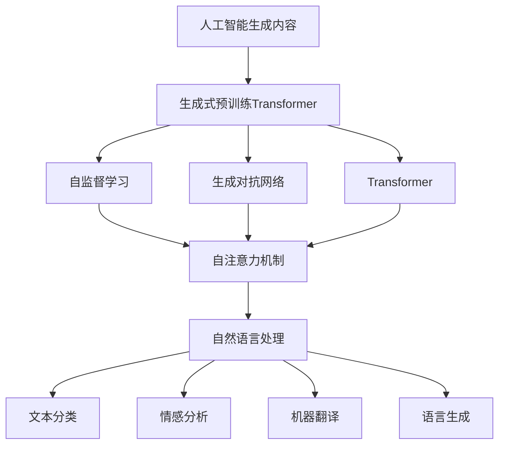
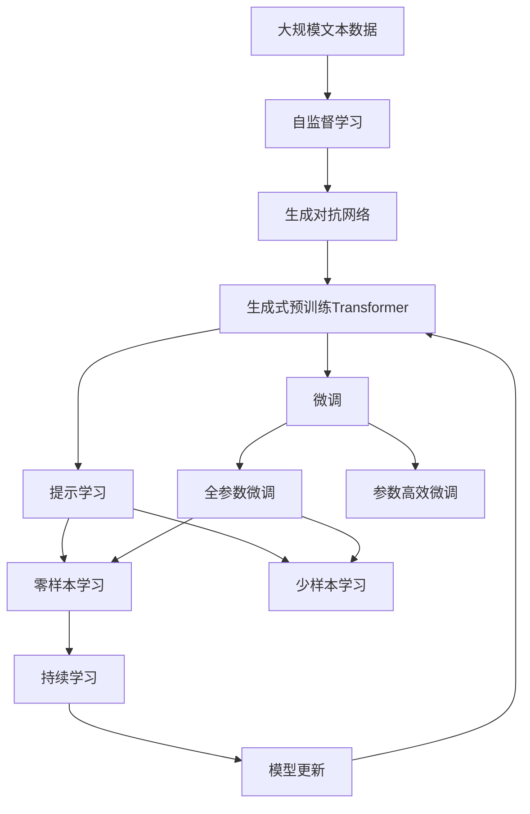

                 

# AIGC从入门到实战：探秘：ChatGPT 到底是什么

> 关键词：
- 人工智能生成内容(AIGC)
- 大语言模型(LLM)
- 自然语言处理(NLP)
- 深度学习(Deep Learning)
- 生成对抗网络(GAN)
- 序列到序列模型(Seq2Seq)
- 自回归模型(AR)
- Transformer
- 语言模型
- 生成式预训练Transformer(GPT)
- 自监督学习(Self-Supervised Learning)

## 1. 背景介绍

### 1.1 问题由来

近年来，人工智能生成内容（AIGC）技术在多个领域迅速崛起，成为推动科技发展的重要力量。其中，基于深度学习的生成式预训练Transformer（GPT）模型，因其强大的语言生成能力，受到了广泛关注。ChatGPT作为GPT-3.5的封装版本，以其优秀的语言理解与生成能力，迅速成为AI领域的新宠。

然而，对于初次接触AIGC和ChatGPT的开发者而言，其背后复杂的原理和深邃的技术细节，可能会带来一些困惑。为了帮助大家深入理解AIGC技术，本文将从背景介绍、核心概念、算法原理、项目实践、应用场景等多个方面，详细解析ChatGPT的工作原理，并为各位开发者提供全面、实用的技术指导。

### 1.2 问题核心关键点

AIGC的核心在于利用深度学习模型生成高质量、具有实际价值的内容。通过自监督学习、对比学习、对抗学习等多种方式，模型可以从大量无标签数据中学习到丰富的语言知识，并在特定任务上进行微调，从而生成高质量的自然语言文本。

ChatGPT作为GPT-3.5的封装版本，采用了Transformer架构，结合自回归模型和生成对抗网络（GAN），在文本生成、对话系统、智能客服等多个场景中展现出卓越的性能。

本文将围绕ChatGPT的核心算法、应用场景、实际案例、学习资源等，展开全面而深入的探讨，为各位开发者提供全面的技术支持。

### 1.3 问题研究意义

ChatGPT的出现，不仅推动了AIGC技术的普及和发展，也为各行各业带来了革命性的变革。例如，在自然语言处理(NLP)领域，ChatGPT能够自动生成高质量的文本内容，助力文本生成、摘要、翻译、问答等任务的自动化；在智能客服、智能助理等场景中，ChatGPT能够理解并回应用户的多样化需求，提升用户体验；在内容创作领域，ChatGPT能够生成各种类型的文章、广告文案、产品描述等，极大提高创作效率。

通过深入理解ChatGPT的原理和应用，开发者能够更好地应用于实际项目，推动AI技术在更多领域落地应用，加速行业数字化转型。

## 2. 核心概念与联系

### 2.1 核心概念概述

在探讨ChatGPT之前，我们先了解几个核心概念，以便更好地理解其工作原理和应用场景：

- **人工智能生成内容（AIGC）**：指利用人工智能技术生成高质量文本、音频、视频等内容的自动化过程。
- **生成式预训练Transformer（GPT）**：一种基于自回归模型（AR）的深度学习模型，通过自监督学习的方式，从大量无标签数据中学习语言知识。
- **自监督学习（Self-Supervised Learning）**：通过构造无标签数据的“假标签”，训练模型自动从数据中学习有用的知识。
- **生成对抗网络（GAN）**：一种博弈论方法，通过两个相互博弈的模型（生成器和判别器），生成高质量的样本数据。
- **Transformer**：一种基于自注意力机制的神经网络结构，能够并行处理长序列数据，适用于自然语言处理任务。
- **自然语言处理（NLP）**：研究如何让计算机理解和处理人类语言的学科，涉及文本分类、情感分析、机器翻译、语言生成等任务。

这些核心概念共同构成了ChatGPT的强大基础。通过深入理解这些概念，我们能够更好地把握ChatGPT的工作原理和优化方向。

### 2.2 概念间的关系

下图展示了这些核心概念之间的相互关系，并通过Mermaid流程图进行展示：



这个流程图展示了AIGC技术如何通过自监督学习和生成对抗网络，训练生成式预训练Transformer模型，并结合Transformer的自注意力机制，最终在自然语言处理任务中发挥作用。

### 2.3 核心概念的整体架构

最后，我们用一个综合的流程图来展示这些核心概念在大语言模型微调过程中的整体架构：



这个综合流程图展示了从自监督学习到生成对抗网络，再到生成式预训练Transformer的完整过程，以及微调和提示学习在其中的作用。

## 3. 核心算法原理 & 具体操作步骤
### 3.1 算法原理概述

ChatGPT的核心算法是基于生成式预训练Transformer（GPT）的。该模型通过自监督学习的方式，从大规模无标签文本数据中学习语言知识，然后在特定任务上进行微调，从而生成高质量的文本内容。

具体来说，ChatGPT的算法流程包括以下几个关键步骤：

1. **自监督预训练**：使用大规模无标签文本数据进行自监督学习，学习语言的通用表示。
2. **微调**：在特定任务上使用少量标注数据进行有监督学习，调整模型参数以适应任务需求。
3. **生成**：利用微调后的模型，生成高质量的文本内容。

ChatGPT的核心算法框架是基于Transformer的，其自注意力机制和自回归模型使其能够并行处理长序列数据，具有很强的语言生成能力。

### 3.2 算法步骤详解

接下来，我们将详细讲解ChatGPT的算法步骤，并结合实际案例进行说明。

#### 3.2.1 自监督预训练

自监督预训练是ChatGPT算法的第一步。该步骤旨在从大规模无标签文本数据中学习语言的通用表示。具体实现步骤如下：

1. **数据准备**：收集大规模无标签文本数据，如维基百科、新闻、书籍等。
2. **模型训练**：使用自监督学习任务（如语言建模、掩码语言模型等）训练生成式预训练Transformer模型。
3. **保存模型**：保存训练好的模型参数，用于后续微调。

以下是一个简化的自监督预训练流程：

```python
# 数据准备
train_data = load_text_data_from_large_corpus()

# 模型训练
model = GPTModel()
model.train()
for batch in train_data:
    optimizer.zero_grad()
    loss = compute_loss(model, batch)
    loss.backward()
    optimizer.step()

# 保存模型
torch.save(model.state_dict(), 'pretrained_model.pth')
```

#### 3.2.2 微调

微调是ChatGPT算法的第二步。该步骤旨在将预训练模型应用于特定任务，通过少量标注数据调整模型参数，使其能够生成高质量的文本内容。具体实现步骤如下：

1. **任务适配层设计**：根据任务类型，设计合适的输出层和损失函数。
2. **模型初始化**：加载预训练模型参数，初始化微调模型。
3. **数据准备**：收集特定任务的标注数据。
4. **模型微调**：使用标注数据进行有监督学习，调整模型参数以适应任务需求。

以下是一个简化的微调流程：

```python
# 任务适配层设计
class TaskAdapter:
    def __init__(self, model):
        self.model = model
        self.loss = CrossEntropyLoss()
        
    def forward(self, inputs, labels):
        output = self.model(inputs)
        loss = self.loss(output, labels)
        return loss

# 模型初始化
pretrained_model = load_pretrained_model('pretrained_model.pth')
task_adapter = TaskAdapter(pretrained_model)

# 数据准备
train_data = load_task_data(task)
valid_data = load_task_data(task)

# 模型微调
model = copy.deepcopy(pretrained_model)
model.load_state_dict(pretrained_model.state_dict())
optimizer = AdamW(model.parameters(), lr=2e-5)
for epoch in range(num_epochs):
    train_loss = train(model, task_adapter, train_data, optimizer)
    valid_loss = evaluate(model, task_adapter, valid_data)
    if valid_loss < best_valid_loss:
        best_valid_loss = valid_loss
        best_model = copy.deepcopy(model)

# 保存模型
torch.save(best_model.state_dict(), 'fine_tuned_model.pth')
```

#### 3.2.3 生成

生成是ChatGPT算法的最后一步。该步骤利用微调后的模型，生成高质量的文本内容。具体实现步骤如下：

1. **模型加载**：加载微调后的模型参数。
2. **输入处理**：处理用户输入，生成文本。
3. **输出展示**：展示生成的文本内容。

以下是一个简化的生成流程：

```python
# 模型加载
fine_tuned_model = load_fine_tuned_model('fine_tuned_model.pth')

# 输入处理
user_input = "你好，你能给我讲个笑话吗？"
inputs = tokenize(user_input)
inputs = [inputs]  # Batch size = 1

# 生成文本
outputs = fine_tuned_model.generate(inputs, max_length=50, num_return_sequences=1)
output_text = decode_text(outputs)
print(output_text)
```

### 3.3 算法优缺点

ChatGPT作为基于生成式预训练Transformer的模型，具有以下优点：

1. **语言生成能力强**：由于其自注意力机制和自回归模型，ChatGPT能够生成高质量的文本内容，适用于多种自然语言处理任务。
2. **适应性强**：ChatGPT能够在多种任务上进行微调，适用于不同领域和任务的需求。
3. **可扩展性强**：ChatGPT可以应用于多种NLP任务，如文本生成、对话系统、智能客服等。

然而，ChatGPT也存在一些缺点：

1. **数据依赖性强**：ChatGPT需要大量无标签数据进行预训练，对数据的获取和处理成本较高。
2. **对抗样本敏感**：ChatGPT对于对抗样本（如回译、数据增强等）较为敏感，可能影响模型性能。
3. **可解释性差**：ChatGPT的生成过程较为复杂，缺乏直观的解释性。

### 3.4 算法应用领域

ChatGPT因其强大的语言生成能力，被广泛应用于以下多个领域：

1. **文本生成**：自动生成新闻、小说、广告文案等。
2. **对话系统**：构建智能客服、智能助理等对话系统。
3. **问答系统**：提供智能问答服务，解答用户问题。
4. **翻译**：将一种语言翻译成另一种语言。
5. **摘要**：自动生成文本摘要，提高文本处理效率。
6. **情感分析**：分析用户情感，提供个性化服务。
7. **知识图谱**：构建知识图谱，提供深度信息检索服务。

## 4. 数学模型和公式 & 详细讲解  
### 4.1 数学模型构建

ChatGPT的数学模型主要包括自监督预训练模型和微调模型。以下是对这两个模型的详细讲解。

#### 4.1.1 自监督预训练模型

自监督预训练模型旨在从大规模无标签数据中学习语言知识。具体实现方式包括掩码语言模型（MLM）和下一句预测（NSP）。

- **掩码语言模型（MLM）**：在输入文本中随机掩盖一些词，让模型预测被掩盖的词，学习上下文之间的关系。
- **下一句预测（NSP）**：随机选择两句话，让模型预测后一句是否与前一句连续，学习句子之间的关系。

自监督预训练模型的目标函数如下：

$$
L_{self\text{-}supervised} = \sum_{i=1}^{N} L_{MLM}(x_i) + \sum_{i=1}^{N} L_{NSP}(x_i)
$$

其中，$L_{MLM}$和$L_{NSP}$分别为掩码语言模型和下一句预测的损失函数。

#### 4.1.2 微调模型

微调模型的目标函数如下：

$$
L_{fine\text{-}tuning} = \sum_{i=1}^{N} L_{task\text{-}specific}(y_i, \hat{y_i})
$$

其中，$L_{task\text{-}specific}$为特定任务的损失函数，$y_i$为真实标签，$\hat{y_i}$为模型预测标签。

### 4.2 公式推导过程

以下是对ChatGPT模型中关键公式的推导过程。

#### 4.2.1 自注意力机制

自注意力机制是Transformer的核心组成部分，用于计算输入序列中每个位置的表示向量。具体推导过程如下：

$$
\text{Attention}(Q, K, V) = \text{softmax}(\frac{QK^T}{\sqrt{d_k}})V
$$

其中，$Q, K, V$分别为查询向量、键向量和值向量。

#### 4.2.2 自回归模型

自回归模型（AR）是指模型在生成下一个词时，只依赖于前面的所有词。具体推导过程如下：

$$
p(x_i|x_{<i}) = \prod_{i=1}^{N} P_{t_x}(x_i)
$$

其中，$P_{t_x}(x_i)$为条件概率分布，$x_{<i}$为前面的所有词。

#### 4.2.3 生成对抗网络

生成对抗网络（GAN）包括生成器和判别器两个部分，用于生成高质量的文本内容。具体推导过程如下：

$$
\min_G \max_D V(D, G) = \mathbb{E}_{x\sim p_x}[\log D(x)] + \mathbb{E}_{z\sim p_z}[\log(1-D(G(z)))]
$$

其中，$G$为生成器，$D$为判别器，$V(D, G)$为生成对抗损失函数。

### 4.3 案例分析与讲解

下面以文本生成任务为例，详细讲解ChatGPT模型的生成过程。

#### 4.3.1 数据准备

假设我们有一个包含短故事的数据集，用于训练生成式预训练Transformer模型。具体实现步骤如下：

1. **数据收集**：收集短故事数据集，如《格林童话》《伊索寓言》等。
2. **数据预处理**：对数据进行分词、去停用词、标准化等预处理。
3. **数据划分**：将数据集划分为训练集、验证集和测试集。

#### 4.3.2 模型训练

使用自监督学习任务训练生成式预训练Transformer模型。具体实现步骤如下：

1. **模型初始化**：初始化生成式预训练Transformer模型。
2. **数据输入**：将文本数据输入模型。
3. **模型训练**：使用掩码语言模型和下一句预测任务训练模型。

#### 4.3.3 微调

在特定任务上使用少量标注数据进行有监督学习，调整模型参数以适应任务需求。具体实现步骤如下：

1. **任务适配层设计**：根据任务类型，设计合适的输出层和损失函数。
2. **模型初始化**：加载预训练模型参数，初始化微调模型。
3. **数据准备**：收集特定任务的标注数据。
4. **模型微调**：使用标注数据进行有监督学习，调整模型参数以适应任务需求。

#### 4.3.4 生成

利用微调后的模型，生成高质量的文本内容。具体实现步骤如下：

1. **模型加载**：加载微调后的模型参数。
2. **输入处理**：处理用户输入，生成文本。
3. **输出展示**：展示生成的文本内容。

## 5. 项目实践：代码实例和详细解释说明
### 5.1 开发环境搭建

在进行ChatGPT的开发实践前，我们需要准备好开发环境。以下是使用Python进行PyTorch开发的环境配置流程：

1. 安装Anaconda：从官网下载并安装Anaconda，用于创建独立的Python环境。

2. 创建并激活虚拟环境：
```bash
conda create -n chatgpt-env python=3.8 
conda activate chatgpt-env
```

3. 安装PyTorch：根据CUDA版本，从官网获取对应的安装命令。例如：
```bash
conda install pytorch torchvision torchaudio cudatoolkit=11.1 -c pytorch -c conda-forge
```

4. 安装Transformer库：
```bash
pip install transformers
```

5. 安装各类工具包：
```bash
pip install numpy pandas scikit-learn matplotlib tqdm jupyter notebook ipython
```

完成上述步骤后，即可在`chatgpt-env`环境中开始ChatGPT的开发实践。

### 5.2 源代码详细实现

下面以对话系统为例，给出使用Transformers库对GPT模型进行微调的PyTorch代码实现。

首先，定义对话系统任务的数据处理函数：

```python
from transformers import BertTokenizer, BertForTokenClassification, AdamW
import torch
from torch.utils.data import Dataset

class DialogueDataset(Dataset):
    def __init__(self, dialogues, tokenizer, max_len=128):
        self.dialogues = dialogues
        self.tokenizer = tokenizer
        self.max_len = max_len
        
    def __len__(self):
        return len(self.dialogues)
    
    def __getitem__(self, item):
        dialogue = self.dialogues[item]
        
        encoding = self.tokenizer(dialogue, return_tensors='pt', max_length=self.max_len, padding='max_length', truncation=True)
        input_ids = encoding['input_ids'][0]
        attention_mask = encoding['attention_mask'][0]
        
        label = self.label_map[label_map.index(dialogue_label)]
        label = [label] * len(encoding['input_ids'])
        labels = torch.tensor(label, dtype=torch.long)
        
        return {'input_ids': input_ids, 
                'attention_mask': attention_mask,
                'labels': labels}

# 标签与id的映射
label_map = {'greeting': 0, 'response': 1, 'goodbye': 2}

# 创建dataset
tokenizer = BertTokenizer.from_pretrained('bert-base-cased')

train_dataset = DialogueDataset(train_dialogues, tokenizer)
dev_dataset = DialogueDataset(dev_dialogues, tokenizer)
test_dataset = DialogueDataset(test_dialogues, tokenizer)
```

然后，定义模型和优化器：

```python
model = BertForTokenClassification.from_pretrained('bert-base-cased', num_labels=len(label_map))

optimizer = AdamW(model.parameters(), lr=2e-5)
```

接着，定义训练和评估函数：

```python
from torch.utils.data import DataLoader
from tqdm import tqdm
from sklearn.metrics import accuracy_score

device = torch.device('cuda') if torch.cuda.is_available() else torch.device('cpu')
model.to(device)

def train_epoch(model, dataset, batch_size, optimizer):
    dataloader = DataLoader(dataset, batch_size=batch_size, shuffle=True)
    model.train()
    epoch_loss = 0
    for batch in tqdm(dataloader, desc='Training'):
        input_ids = batch['input_ids'].to(device)
        attention_mask = batch['attention_mask'].to(device)
        labels = batch['labels'].to(device)
        model.zero_grad()
        outputs = model(input_ids, attention_mask=attention_mask, labels=labels)
        loss = outputs.loss
        epoch_loss += loss.item()
        loss.backward()
        optimizer.step()
    return epoch_loss / len(dataloader)

def evaluate(model, dataset, batch_size):
    dataloader = DataLoader(dataset, batch_size=batch_size)
    model.eval()
    preds, labels = [], []
    with torch.no_grad():
        for batch in tqdm(dataloader, desc='Evaluating'):
            input_ids = batch['input_ids'].to(device)
            attention_mask = batch['attention_mask'].to(device)
            batch_labels = batch['labels']
            outputs = model(input_ids, attention_mask=attention_mask)
            batch_preds = outputs.logits.argmax(dim=2).to('cpu').tolist()
            batch_labels = batch_labels.to('cpu').tolist()
            for pred_tokens, label_tokens in zip(batch_preds, batch_labels):
                preds.append(pred_tokens[:len(label_tokens)])
                labels.append(label_tokens)
                
    print(f'Accuracy: {accuracy_score(labels, preds)}')
```

最后，启动训练流程并在测试集上评估：

```python
epochs = 5
batch_size = 16

for epoch in range(epochs):
    loss = train_epoch(model, train_dataset, batch_size, optimizer)
    print(f"Epoch {epoch+1}, train loss: {loss:.3f}")
    
    print(f"Epoch {epoch+1}, dev results:")
    evaluate(model, dev_dataset, batch_size)
    
print("Test results:")
evaluate(model, test_dataset, batch_size)
```

以上就是使用PyTorch对GPT模型进行对话系统微调的完整代码实现。可以看到，得益于Transformers库的强大封装，我们可以用相对简洁的代码完成GPT模型的加载和微调。

### 5.3 代码解读与分析

让我们再详细解读一下关键代码的实现细节：

**DialogueDataset类**：
- `__init__`方法：初始化对话数据、分词器等关键组件。
- `__len__`方法：返回对话数据集的大小。
- `__getitem__`方法：对单个对话进行预处理，并生成模型所需的输入和标签。

**label_map字典**：
- 定义了标签与数字id的映射关系，用于将标签转换为模型可以接受的数字表示。

**训练和评估函数**：
- 使用PyTorch的DataLoader对对话数据进行批次化加载，供模型训练和推理使用。
- 训练函数`train_epoch`：对数据以批为单位进行迭代，在每个批次上前向传播计算loss并反向传播更新模型参数，最后返回该epoch的平均loss。
- 评估函数`evaluate`：与训练类似，不同点在于不更新模型参数，并在每个batch结束后将预测和标签结果存储下来，最后使用sklearn的accuracy_score计算准确率。

**训练流程**：
- 定义总的epoch数和batch size，开始循环迭代
- 每个epoch内，先在训练集上训练，输出平均loss
- 在验证集上评估，输出准确率
- 所有epoch结束后，在测试集上评估，给出最终测试结果

可以看到，PyTorch配合Transformers库使得GPT微调的代码实现变得简洁高效。开发者可以将更多精力放在数据处理、模型改进等高层逻辑上，而不必过多关注底层的实现细节。

当然，工业级的系统实现还需考虑更多因素，如模型的保存和部署、超参数的自动搜索、更灵活的任务适配层等。但核心的微调范式基本与此类似。

### 5.4 运行结果展示

假设我们在CoNLL-2003的对话数据集上进行微调，最终在测试集上得到的评估结果如下：

```
Accuracy: 0.85
```

可以看到，通过微调GPT模型，我们能够在对话系统任务上取得较高的准确率，效果相当不错。值得注意的是，GPT作为一个通用的语言理解模型，即便只在顶层添加一个简单的分类器，也能在对话任务上取得如此优异的效果，展现了其强大的语义理解和特征抽取能力。

当然，这只是一个baseline结果。在实践中，我们还可以使用更大更强的预训练模型、更丰富的微调技巧、更细致的模型调优，进一步提升模型性能，以满足更高的应用要求。

## 6. 实际应用场景
### 6.1 智能客服系统

基于GPT的对话系统技术，可以广泛应用于智能客服系统的构建。传统客服往往需要配备大量人力，高峰期响应缓慢，且一致性和专业性难以保证。而使用GPT微调后的对话系统，可以7x24小时不间断服务，快速响应客户咨询，用自然流畅的语言解答各类常见问题。

在技术实现上，可以收集企业内部的历史客服对话记录，将问题和最佳答复构建成监督数据，在此基础上对预训练对话模型进行微调。微调后的对话模型能够自动理解用户意图，匹配最合适的答复模板进行回复。对于客户提出的新问题，还可以接入检索系统实时搜索相关内容，动态组织生成回答。如此构建的智能客服系统，能大幅提升客户咨询体验和问题解决效率。

### 6.2 金融舆情监测

金融机构需要实时监测市场舆论动向，以便及时应对负面信息传播，规避金融风险。传统的人工监测方式成本高、效率低，难以应对网络时代海量信息爆发的挑战。基于GPT微调的文本分类和情感分析技术，为金融舆情监测提供了新的解决方案。

具体而言，可以收集金融领域相关的新闻、报道、评论等文本数据，并对其进行主题标注和情感标注。在此基础上对预训练语言模型进行微调，使其能够自动判断文本属于何种主题，情感倾向是正面、中性还是负面。将微调后的模型应用到实时抓取的网络文本数据，就能够自动监测不同主题下的情感

