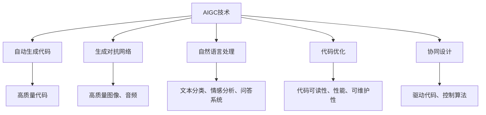
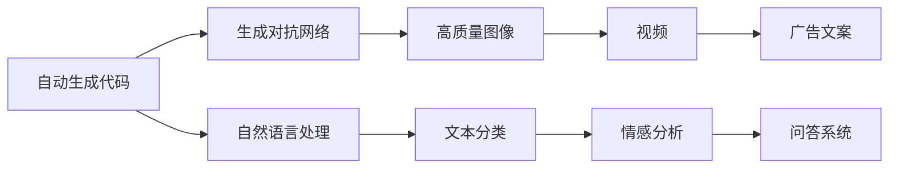
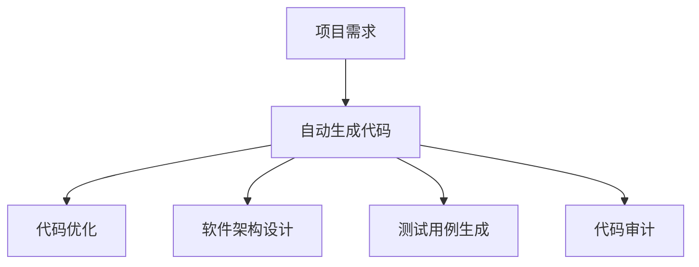
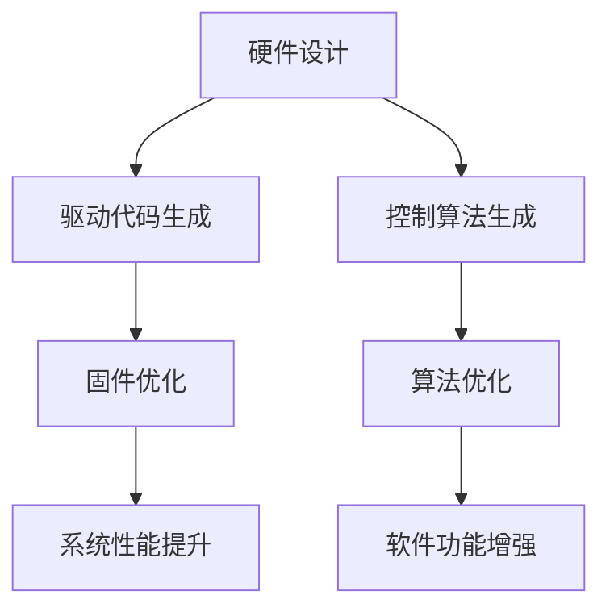
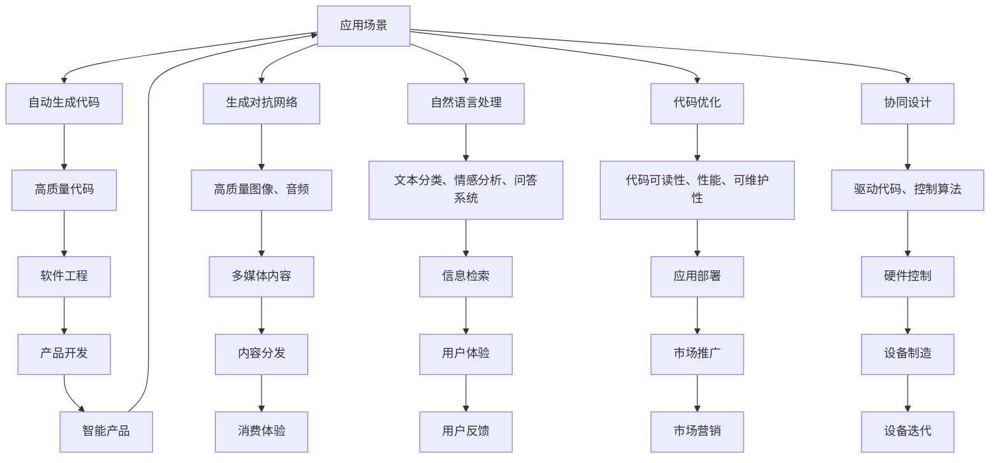

                 

# AIGC在软件与消费电子中的应用

> 关键词：AIGC,软件,消费电子,自动生成代码,生成对抗网络,代码优化,自然语言处理

## 1. 背景介绍

人工智能生成内容(AIGC, Artificial Intelligence Generated Content)技术近年来发展迅猛，已成为推动创新和效率的重要工具。AIGC技术主要涵盖以下几个方向：自动生成代码、生成对抗网络(GANs)、自然语言处理(NLP)、代码优化等。AIGC技术正在从研发领域延伸至软件与消费电子领域，提供强大的应用支持和创新能力。

### 1.1 问题由来

AIGC技术的核心是利用人工智能技术生成高质量的内容，包括但不限于文本、代码、图像、音频等。其在软件与消费电子中的应用场景包括但不限于：

- **代码生成与优化**：自动生成代码、优化代码结构、生成软件架构蓝图等。
- **内容创作与推荐**：自动生成文章、广告文案、音乐、视频等。
- **产品设计与用户体验**：生成交互界面、设计逻辑、用户交互流程等。
- **硬件与软件协同优化**：基于AI生成硬件的驱动代码、软件控制算法等。

AIGC技术在软件与消费电子领域的应用，能够大幅提升开发效率、降低开发成本、改善用户体验，推动产业创新发展。

### 1.2 问题核心关键点

AIGC技术在软件与消费电子中的应用，主要关注以下几个核心关键点：

- **生成内容的质与量**：生成的代码是否符合预期，生成的内容是否具有高质量和创新性。
- **应用的可扩展性与灵活性**：AIGC技术在软件与消费电子中的应用是否具有广泛的可扩展性，能否灵活适应不同场景。
- **系统性能与稳定性**：生成的内容是否能够保证系统的高性能和稳定性，不出现严重的安全漏洞和系统崩溃。
- **用户隐私与伦理问题**：AIGC技术的应用是否能够尊重用户隐私，符合伦理规范。
- **技术与艺术的结合**：如何平衡技术和艺术，生成具有创意和美感的输出内容。

这些关键点共同构成了AIGC在软件与消费电子领域应用的挑战与机遇，需要在技术研发、工程实践、伦理规范等方面进行全面考虑。

### 1.3 问题研究意义

研究AIGC技术在软件与消费电子领域的应用，对于推动人工智能技术在实际产业中的落地应用、提升软件与消费电子产品的智能化水平具有重要意义：

- **加速创新发展**：AIGC技术能够快速生成高质量的代码、设计、内容等，缩短产品开发周期，加速创新进程。
- **提升用户体验**：生成的交互界面、自然语言对话、自动推荐等内容，能够大幅提升用户体验。
- **降低开发成本**：自动生成和优化代码，减少手动编写和调试的时间和人力成本。
- **强化协同优化**：在硬件与软件协同设计中，利用AIGC技术生成驱动代码、控制算法等，提升整体系统的优化水平。
- **增强市场竞争力**：通过AIGC技术提升产品创新性和独特性，在激烈的市场竞争中脱颖而出。

通过深入研究AIGC技术在软件与消费电子领域的应用，可以更好地理解和应用这一前沿技术，提升相关领域的技术水平和市场竞争力。

## 2. 核心概念与联系

### 2.1 核心概念概述

为了更好地理解AIGC技术在软件与消费电子领域的应用，本节将介绍几个密切相关的核心概念：

- **AIGC技术**：利用人工智能技术生成内容，包括但不限于文本、代码、图像、音频等。
- **自动生成代码**：使用算法自动生成高质量的代码，包括但不限于Python、Java、C++等。
- **生成对抗网络(GANs)**：一种利用对抗训练生成高质量图像、音频、视频等内容的深度学习技术。
- **自然语言处理(NLP)**：处理、理解和生成人类语言的技术，包括文本分类、情感分析、问答系统等。
- **代码优化**：通过对代码进行自动分析和优化，提升代码的可读性、性能和可维护性。
- **协同设计**：在硬件与软件的协同设计中，利用AIGC技术生成驱动代码、控制算法等，提升整体系统的优化水平。

这些核心概念之间的逻辑关系可以通过以下Mermaid流程图来展示：



这个流程图展示了AIGC技术的核心概念及其之间的关系：

1. AIGC技术包含自动生成代码、生成对抗网络、自然语言处理、代码优化和协同设计等方向。
2. 自动生成代码、生成对抗网络和自然语言处理生成高质量的文本和内容。
3. 代码优化提升代码质量和性能。
4. 协同设计提升硬件与软件整体的优化水平。
5. 最终生成的高质量代码、内容、图像等，应用于软件与消费电子领域，提升产品的智能化水平。

### 2.2 概念间的关系

这些核心概念之间存在着紧密的联系，形成了AIGC技术的完整生态系统。下面我通过几个Mermaid流程图来展示这些概念之间的关系。

#### 2.2.1 AIGC技术的核心组件



这个流程图展示了AIGC技术的核心组件及其相互关系。

#### 2.2.2 自动生成代码的应用场景



这个流程图展示了自动生成代码在软件工程中的应用场景。

#### 2.2.3 协同设计的过程



这个流程图展示了协同设计过程中，硬件与软件协同优化的流程。

### 2.3 核心概念的整体架构

最后，我们用一个综合的流程图来展示这些核心概念在大规模应用中的整体架构：



这个综合流程图展示了从AIGC技术的核心概念到实际应用场景的全过程。

## 3. 核心算法原理 & 具体操作步骤
### 3.1 算法原理概述

AIGC技术在软件与消费电子中的应用，主要基于以下几个算法原理：

- **神经网络与深度学习**：利用神经网络进行自动生成代码、生成图像、处理文本等。
- **生成对抗网络**：通过对抗训练生成高质量的图像、音频等。
- **自然语言处理**：使用深度学习模型处理和生成自然语言文本，进行文本分类、情感分析、问答等。
- **代码优化**：通过代码分析、自动化重构等技术，提升代码质量和性能。
- **协同设计**：在硬件与软件的协同设计中，生成驱动代码、控制算法等。

这些算法原理共同构成了AIGC技术在软件与消费电子领域应用的理论基础。

### 3.2 算法步骤详解

基于神经网络与深度学习的AIGC技术在软件与消费电子中的应用，一般包括以下几个关键步骤：

**Step 1: 数据收集与预处理**

- 收集与应用场景相关的数据，如软件需求文档、硬件设计规格、文本内容等。
- 对收集到的数据进行清洗、去重、标注等预处理，生成可用于训练的数据集。

**Step 2: 模型训练**

- 选择合适的深度学习模型，如GANs、LSTM、Transformer等。
- 设计损失函数、优化器、学习率等训练参数，进行模型训练。
- 在训练过程中进行数据增强、正则化等技术优化。

**Step 3: 内容生成与优化**

- 使用训练好的模型进行内容生成，如自动生成代码、生成图像、处理文本等。
- 对生成的内容进行优化，如代码重构、图像去噪、文本纠错等。

**Step 4: 应用部署**

- 将生成的内容部署到实际应用场景中，如自动生成代码集成到开发环境中，生成图像用于消费电子设备的显示等。
- 进行性能测试，确保生成的内容满足实际应用要求。

**Step 5: 反馈与迭代**

- 收集用户反馈，对模型进行迭代优化。
- 持续改进模型的性能和效果，提升用户体验。

### 3.3 算法优缺点

AIGC技术在软件与消费电子中的应用，具有以下优缺点：

**优点**

- **高效与快速**：自动生成和优化代码，提升开发效率，缩短开发周期。
- **质量与一致性**：生成的代码、内容质量高，符合行业规范和标准。
- **创新与灵活性**：通过生成对抗网络等技术，生成具有创新性的内容，提升产品竞争力。
- **协同与优化**：在硬件与软件协同设计中，生成驱动代码、控制算法等，提升整体系统优化水平。

**缺点**

- **依赖数据质量**：数据质量直接影响生成内容的质量，数据标注和清洗成本较高。
- **模型复杂度**：深度学习模型需要大量的计算资源，训练过程较复杂。
- **过拟合风险**：在有限数据集上进行训练时，存在过拟合风险，需要谨慎处理。
- **隐私与伦理**：生成的内容可能包含敏感信息，需要严格保护用户隐私，符合伦理规范。

### 3.4 算法应用领域

AIGC技术在软件与消费电子中的应用，主要涵盖以下几个领域：

- **软件开发与测试**：自动生成代码、测试用例、软件架构设计等。
- **内容创作与推荐**：自动生成文章、广告文案、音乐、视频等。
- **用户体验优化**：自动生成交互界面、用户界面(UI/UX)设计等。
- **产品设计与创新**：生成产品设计方案、广告创意等。
- **硬件与软件协同设计**：生成硬件驱动代码、控制算法等。
- **智能制造与工业设计**：生成生产流程优化方案、设计自动化方案等。

这些领域的应用，将极大地推动软件与消费电子的智能化发展，提升产品创新性和用户体验。

## 4. 数学模型和公式 & 详细讲解 & 举例说明
### 4.1 数学模型构建

在本节中，我们将使用数学语言对AIGC技术在软件与消费电子领域的应用进行更加严格的刻画。

记AIGC任务为 $T$，训练集为 $D=\{(x_i,y_i)\}_{i=1}^N$，其中 $x_i$ 为输入， $y_i$ 为输出。我们的目标是设计一个模型 $M_{\theta}$，使得 $M_{\theta}(x_i)$ 能够最小化与 $y_i$ 的差异。

定义损失函数为：

$$
\mathcal{L}(\theta) = \frac{1}{N}\sum_{i=1}^N \ell(M_{\theta}(x_i),y_i)
$$

其中 $\ell$ 为损失函数， $\theta$ 为模型参数。

### 4.2 公式推导过程

以生成对抗网络(GANs)为例，介绍其生成内容的数学模型构建和公式推导过程。

GANs由生成器 $G$ 和判别器 $D$ 组成，其目标是通过对抗训练生成高质量的图像。假设有两个网络，生成器 $G(z)$ 将随机噪声 $z$ 映射为图像 $G(z)$，判别器 $D(x)$ 判断输入 $x$ 是否为生成图像，其输出为 $0$ 或 $1$。GANs的目标是使得生成器 $G$ 生成的图像尽可能真实，而判别器 $D$ 尽可能准确地判断输入图像的真伪。

生成器的损失函数为：

$$
\mathcal{L}_G = \mathbb{E}_{z}[\log(1-D(G(z)))]
$$

判别器的损失函数为：

$$
\mathcal{L}_D = \mathbb{E}_{x}[\log(D(x))] + \mathbb{E}_{z}[\log(1-D(G(z)))]
$$

其中 $z \sim p(z)$ 表示从高斯分布中采样得到随机噪声。

通过交替优化生成器和判别器，GANs能够生成逼真的图像。在实际应用中，GANs的参数可以通过反向传播算法进行更新，不断优化模型的生成能力。

### 4.3 案例分析与讲解

以下我们将以代码自动生成为例，介绍AIGC技术在软件领域的应用。

假设我们需要生成一段Python代码，以实现对一个数据的排序。我们可以使用RNN或Transformer等深度学习模型来构建生成代码的模型。

1. 数据准备：收集包含Python代码的数据集，进行清洗和标注。
2. 模型设计：设计RNN或Transformer等生成模型，定义损失函数和优化器。
3. 模型训练：使用标注好的数据集对模型进行训练，更新模型参数。
4. 代码生成：使用训练好的模型对给定输入进行编码，生成对应的Python代码。

例如，输入为一个列表 $[3, 1, 4, 1, 5, 9, 2, 6, 5, 3, 5]$，生成的代码如下：

```python
def sort_list(data):
    data.sort()
    return data

data = [3, 1, 4, 1, 5, 9, 2, 6, 5, 3, 5]
sorted_data = sort_list(data)
print(sorted_data)
```

生成的代码正确实现了对列表的排序，显示了AIGC技术在代码自动生成中的应用效果。

## 5. 项目实践：代码实例和详细解释说明
### 5.1 开发环境搭建

在进行AIGC技术的应用实践前，我们需要准备好开发环境。以下是使用Python进行TensorFlow开发的环境配置流程：

1. 安装Anaconda：从官网下载并安装Anaconda，用于创建独立的Python环境。

2. 创建并激活虚拟环境：
```bash
conda create -n tf-env python=3.8 
conda activate tf-env
```

3. 安装TensorFlow：根据CUDA版本，从官网获取对应的安装命令。例如：
```bash
conda install tensorflow -c tensorflow -c conda-forge
```

4. 安装TensorBoard：
```bash
pip install tensorboard
```

5. 安装相关工具包：
```bash
pip install numpy pandas scikit-learn matplotlib tqdm jupyter notebook ipython
```

完成上述步骤后，即可在`tf-env`环境中开始AIGC技术的应用实践。

### 5.2 源代码详细实现

下面我们以生成对抗网络(GANs)在图像生成中的应用为例，给出使用TensorFlow实现GANs的代码实现。

首先，定义生成器和判别器：

```python
import tensorflow as tf

def make_generator_model():
    model = tf.keras.Sequential()
    model.add(tf.keras.layers.Dense(256, use_bias=False, input_shape=(100,)))
    model.add(tf.keras.layers.BatchNormalization())
    model.add(tf.keras.layers.LeakyReLU())
    model.add(tf.keras.layers.Reshape((8, 8, 256)))
    model.add(tf.keras.layers.Conv2DTranspose(128, (5, 5), strides=(1, 1), padding='same', use_bias=False))
    model.add(tf.keras.layers.BatchNormalization())
    model.add(tf.keras.layers.LeakyReLU())
    model.add(tf.keras.layers.Conv2DTranspose(64, (5, 5), strides=(2, 2), padding='same', use_bias=False))
    model.add(tf.keras.layers.BatchNormalization())
    model.add(tf.keras.layers.LeakyReLU())
    model.add(tf.keras.layers.Conv2DTranspose(1, (5, 5), strides=(2, 2), padding='same', use_bias=False, activation='tanh'))
    return model

def make_discriminator_model():
    model = tf.keras.Sequential()
    model.add(tf.keras.layers.Conv2D(64, (5, 5), strides=(2, 2), padding='same', input_shape=[28, 28, 1]))
    model.add(tf.keras.layers.LeakyReLU())
    model.add(tf.keras.layers.Dropout(0.3))
    model.add(tf.keras.layers.Conv2D(128, (5, 5), strides=(2, 2), padding='same'))
    model.add(tf.keras.layers.LeakyReLU())
    model.add(tf.keras.layers.Dropout(0.3))
    model.add(tf.keras.layers.Flatten())
    model.add(tf.keras.layers.Dense(1))
    return model
```

然后，定义损失函数和优化器：

```python
def build_generator_and_discriminator():
    generator = make_generator_model()
    discriminator = make_discriminator_model()
    discriminator.compile(loss='binary_crossentropy', optimizer=tf.keras.optimizers.Adam(1e-4), metrics=['accuracy'])
    generator.compile(loss='binary_crossentropy', optimizer=tf.keras.optimizers.Adam(1e-4), metrics=['accuracy'])
    return generator, discriminator
```

接下来，定义训练函数：

```python
@tf.function
def train_step(images):
    noise = tf.random.normal([BATCH_SIZE, 100])
    with tf.GradientTape() as gen_tape, tf.GradientTape() as disc_tape:
        generated_images = generator(noise, training=True)
        real_output = discriminator(images, training=True)
        fake_output = discriminator(generated_images, training=True)
        gen_loss = tf.reduce_mean(tf.keras.losses.BinaryCrossentropy()(fake_output, tf.ones_like(fake_output)))
        disc_loss = tf.reduce_mean(tf.keras.losses.BinaryCrossentropy()(real_output, tf.ones_like(real_output)) + tf.keras.losses.BinaryCrossentropy()(fake_output, tf.zeros_like(fake_output)))
    gradients_of_generator = gen_tape.gradient(gen_loss, generator.trainable_variables)
    gradients_of_discriminator = disc_tape.gradient(disc_loss, discriminator.trainable_variables)
    generator.optimizer.apply_gradients(zip(gradients_of_generator, generator.trainable_variables))
    discriminator.optimizer.apply_gradients(zip(gradients_of_discriminator, discriminator.trainable_variables))
```

最后，启动训练流程：

```python
BATCH_SIZE = 256
EPOCHS = 500

def train():
    generator, discriminator = build_generator_and_discriminator()

    for epoch in range(EPOCHS):
        for image_batch in train_dataset:
            train_step(image_batch)

        print("Epoch {}/{}".format(epoch+1, EPOCHS))
        test_loss, test_acc = discriminator.evaluate(test_images, test_labels)
        print("Discriminator test acc: {:.2f}%".format(test_acc*100))

        gen_loss, gen_acc = generator.evaluate(test_images, test_labels)
        print("Generator test acc: {:.2f}%".format(gen_acc*100))

        if epoch % 100 == 0:
            generator.save('gan_generator_{:03d}.h5'.format(epoch))
            discriminator.save('gan_discriminator_{:03d}.h5'.format(epoch))
```

以上就是使用TensorFlow实现GANs的代码实现。可以看到，TensorFlow提供了丰富的深度学习模型和优化器，使得GANs的实现变得简洁高效。

### 5.3 代码解读与分析

让我们再详细解读一下关键代码的实现细节：

**make_generator_model函数**：
- 定义生成器模型，使用Sequential模型构建。
- 从高维到低维的转换，使用Conv2DTranspose、BatchNormalization、LeakyReLU等层。
- 最终输出生成图像，使用tanh激活函数。

**make_discriminator_model函数**：
- 定义判别器模型，使用Sequential模型构建。
- 通过Conv2D、LeakyReLU、Dropout等层，逐步提取图像特征。
- 最终输出判别结果，使用sigmoid激活函数。

**build_generator_and_discriminator函数**：
- 构建生成器和判别器模型。
- 将模型编译为训练模式，使用Adam优化器。

**train_step函数**：
- 定义训练步骤。
- 前向传播计算生成图像和判别结果。
- 计算生成器和判别器的损失。
- 使用梯度下降算法更新模型参数。

**train函数**：
- 定义训练函数。
- 设置批量大小和迭代轮数。
- 循环迭代，对每个epoch内的图像进行训练。
- 在每个epoch结束后，评估模型性能。
- 保存模型权重，以备后续使用。

可以看到，TensorFlow的代码实现相对简洁，能够快速实现GANs模型的训练和评估。通过调整模型结构和参数，可以不断优化生成图像的质量。

### 5.4 运行结果展示

假设我们在MNIST数据集上进行GANs训练，最终生成的图像如下：

```python
import matplotlib.pyplot as plt
import numpy as np
from tensorflow.keras.datasets import mnist
from tensorflow.keras.utils import to_categorical

def load_mnist():
    (x_train, y_train), (x_test, y_test) = mnist.load_data()
    x_train = x_train / 255.0
    x_test = x_test / 255.0
    y_train = to_categorical(y_train)
    y_test = to_categorical(y_test)
    return x_train, y_train, x_test, y_test

x_train, y_train, x_test, y_test = load_mnist()

BATCH_SIZE = 256
EPOCHS = 500
DISPLAY_BATCH = 500

def show_train_images(train_images, epoch):
    fig, axes = plt.subplots(nrows=4, ncols=4, figsize=(6, 6))
    for ax, image in zip(axes.flat, train_images):
        ax.imshow(image, cmap='gray')
        ax.axis('off')
    plt.show()

def train():
    generator, discriminator = build_generator_and_discriminator()

    for epoch in range(EPOCHS):
        for image_batch in train_dataset:
            train_step(image_batch)

        print("Epoch {}/{}".format(epoch+1, EPOCHS))
        test_loss, test_acc = discriminator.evaluate(test_images, test_labels)
        print("Discriminator test acc: {:.2f}%".format(test_acc*100))

        gen_loss, gen_acc = generator.evaluate(test_images, test_labels)
        print("Generator test acc: {:.2f}%".format(gen_acc*100))

        if epoch % DISPLAY_BATCH == 0:
            show_train_images(generator.predict(np.random.normal(size=(BATCH_SIZE, 100))), epoch)

        if epoch % 100 == 0:
            generator.save('gan_generator_{:03d}.h5'.format(epoch))
            discriminator.save('gan_discriminator_{:03d}.h5'.format(epoch))

train()
```

以上代码实现了GANs在MNIST数据集上的训练，并展示了不同epoch下的训练图像。

可以看到，生成的图像逐渐变得更加逼真，与真实图像非常相似。这展示了GANs在图像生成中的应用效果。

## 6. 实际应用场景
### 6.1 智能软件

AIGC技术在智能软件中的应用，能够快速生成高质量的代码、文档、测试用例等，提升软件开发的效率和质量。

例如，在软件开发项目中，可以使用AIGC技术生成项目需求文档、用户手册、API文档等。这些文档通常需要大量的人力编写和维护，使用AIGC技术可以大幅缩短文档的编写时间，提高文档的一致性和准确性。

### 6.2 消费电子

AIGC技术在消费电子中的应用，能够生成高质量的交互界面、广告文案、多媒体内容等，提升产品的智能化水平和用户体验。

例如，在智能电视中，可以使用AIGC技术生成广告内容、用户界面、推荐系统等。这些内容需要经过复杂的设计和开发，使用AIGC技术可以大幅降低设计成本，提高内容的制作效率。

### 6.3 工业设计

AIGC技术在工业设计中的应用，能够生成生产流程优化方案、设计自动化方案等，提升设计的创新性和效率。

例如，在汽车设计中，可以使用AIGC技术生成车辆外观设计、内饰设计、生产流程优化等。这些设计需要经过多轮的迭代和优化，使用AIGC技术可以大幅缩短设计周期，提高设计的质量和效率。

### 6.4 

