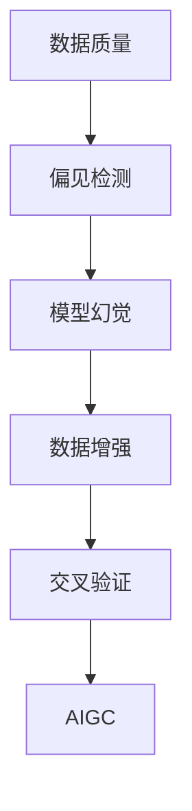

                 

# AIGC的幻觉问题与数据质量

> 关键词：AI Generative Content, 数据质量, 模型幻觉, 偏见检测, 数据增强, 交叉验证

## 1. 背景介绍

随着人工智能生成内容（AI Generative Content, AIGC）技术的快速发展，其在文本生成、图像生成、音频生成等多个领域的应用正变得愈发广泛。从小说和歌曲到新闻和广告，再到医学影像和法律文件，AIGC已经成为许多行业的重要工具。然而，随着AIGC应用的不断深入，其数据质量和模型幻觉问题也逐渐显现，对人们的生活和工作带来了不可忽视的影响。本文将从背景介绍入手，探讨AIGC数据质量和模型幻觉问题，并提出相应的解决方案，以期为相关应用提供参考。

## 2. 核心概念与联系

### 2.1 核心概念概述

为了更好地理解AIGC的数据质量和模型幻觉问题，我们需要首先了解几个核心概念：

- **AIGC**：人工智能生成内容，指通过人工智能技术自动生成的文本、图像、音频等内容。
- **数据质量**：指用于训练和测试AIGC模型的数据集的质量，包括数据的完整性、准确性、一致性、及时性和可用性等。
- **模型幻觉**：指AI模型在面对特定输入时，由于训练数据的偏差或模型自身的局限，生成的输出可能存在错误或不符合实际情况的情况。
- **偏见检测**：指检测和纠正AIGC模型中存在的偏见，以确保其输出的公平性和准确性。
- **数据增强**：指通过扩充或合成数据，提高AIGC模型泛化能力的技术。
- **交叉验证**：指将数据集分成多个子集，轮流使用其中一个子集作为验证集，以确保模型泛化能力的评估更为客观。

这些概念之间存在密切联系，共同构成了AIGC的生态系统。数据质量是AIGC的基础，而模型幻觉和偏见检测则是对AIGC效果的进一步优化，数据增强和交叉验证则是提高AIGC模型泛化能力的有效手段。

### 2.2 概念间的关系

以下是一个简单的Mermaid流程图，展示了这些概念之间的逻辑关系：



这个流程图展示了大规模数据集的质量如何影响模型的训练，以及如何通过偏见检测和数据增强等手段来优化模型，最终通过交叉验证来验证模型的泛化能力。

## 3. 核心算法原理 & 具体操作步骤

### 3.1 算法原理概述

AIGC的生成过程通常包括以下几个步骤：

1. **数据预处理**：对原始数据进行清洗、格式化和标准化，以适应模型的输入要求。
2. **模型训练**：使用预处理后的数据集对AIGC模型进行训练，通常采用监督学习或无监督学习的方式。
3. **模型验证**：使用验证集对训练好的模型进行评估，以确保其泛化能力。
4. **模型优化**：根据验证集的表现，对模型参数进行调整，以提高模型性能。
5. **生成内容**：使用优化后的模型对新输入进行生成。

这些步骤共同构成了AIGC的生成流程，每个步骤都与数据质量和模型幻觉问题密切相关。数据质量的高低直接影响模型的训练效果，而模型幻觉则可能由于训练数据的质量问题而产生。

### 3.2 算法步骤详解

以下是AIGC生成流程中每个步骤的详细解释：

**Step 1: 数据预处理**

数据预处理是AIGC生成的第一步，其目的是确保数据的完整性、准确性和一致性。数据预处理通常包括以下几个步骤：

- **清洗**：去除重复、无关、错误的数据。
- **格式化**：将数据转换为模型所需的格式，如文本转换为数字、图像转换为张量等。
- **标准化**：将数据按照统一的标准进行转换，如将文本转换为小写字母、将日期转换为标准格式等。

**Step 2: 模型训练**

模型训练是将预处理后的数据输入模型，通过监督学习或无监督学习的方式，对模型进行训练。常见的监督学习任务包括分类、回归、序列预测等，而无监督学习任务则包括聚类、降维等。

在模型训练过程中，数据质量和模型幻觉问题会逐渐显现。数据质量差可能导致模型训练效果不佳，甚至无法收敛。而模型幻觉则可能由于训练数据的偏差或模型自身的局限，生成的输出可能存在错误或不符合实际情况。

**Step 3: 模型验证**

模型验证是评估模型泛化能力的重要步骤。验证集通常分为训练集和测试集，分别用于模型训练和测试。在模型验证过程中，数据质量对模型的评估结果有直接影响。如果数据集存在偏见或偏差，验证集的表现可能会被扭曲，导致模型评估结果不准确。

**Step 4: 模型优化**

模型优化是通过调整模型参数，提高模型的性能。常见的模型优化方法包括梯度下降、学习率调整、正则化等。在模型优化过程中，数据质量和模型幻觉问题同样需要特别注意。如果数据集存在偏见或偏差，模型的优化过程可能会被误导，导致模型性能不佳。

**Step 5: 生成内容**

生成内容是将优化后的模型应用到新输入，自动生成内容。在生成内容过程中，数据质量和模型幻觉问题可能会产生更直接的影响。如果数据集存在偏见或偏差，模型生成的内容可能会产生误导性信息。

### 3.3 算法优缺点

AIGC生成流程中的每个步骤都有其优缺点，以下是详细的分析：

**优点**：

- **高效性**：AIGC生成流程可以通过自动化工具快速完成，节省了大量的人工工作。
- **灵活性**：AIGC可以根据不同需求生成多种形式的内容，适用于各种应用场景。
- **可扩展性**：AIGC可以通过添加新的数据和模型来扩展其应用范围。

**缺点**：

- **数据依赖性**：AIGC的生成效果高度依赖于数据质量，数据质量差可能导致生成效果不佳。
- **模型幻觉**：AIGC模型可能由于训练数据的偏差或模型自身的局限，生成输出存在错误或不符合实际情况的情况。
- **可解释性差**：AIGC模型通常被视为"黑盒"，难以解释其内部工作机制和决策逻辑。

### 3.4 算法应用领域

AIGC技术广泛应用于多个领域，以下是几个主要应用领域：

- **文本生成**：自动生成新闻、文章、评论等文本内容。
- **图像生成**：自动生成图片、动画、视频等视觉内容。
- **音频生成**：自动生成音乐、语音、播客等内容。
- **交互式内容**：自动生成问答、推荐、对话等交互式内容。

## 4. 数学模型和公式 & 详细讲解 & 举例说明

### 4.1 数学模型构建

在AIGC生成过程中，数学模型起着关键作用。以下是一个简单的数学模型构建流程：

1. **输入表示**：将输入数据表示为向量或张量。
2. **网络结构**：设计神经网络结构，如卷积神经网络、循环神经网络等。
3. **损失函数**：定义损失函数，用于衡量模型输出与真实标签之间的差异。
4. **优化算法**：选择优化算法，如随机梯度下降、Adam等。
5. **输出表示**：将模型输出表示为目标内容的格式，如文本、图片、音频等。

### 4.2 公式推导过程

以下是一个简单的数学模型构建公式推导过程：

假设模型输入为 $x$，输出为 $y$，损失函数为 $L(y, t)$，优化算法为 $W$，则模型训练过程的数学公式为：

$$
y = W(x)
$$

$$
L(y, t) = \frac{1}{n}\sum_{i=1}^n L(y_i, t_i)
$$

$$
\frac{\partial L(y, t)}{\partial W} = \nabla_{W}L(y, t)
$$

$$
W \leftarrow W - \eta\nabla_{W}L(y, t)
$$

其中，$n$ 表示样本数，$t$ 表示目标标签，$\eta$ 表示学习率。

### 4.3 案例分析与讲解

以文本生成为例，以下是模型构建和公式推导的具体过程：

假设输入为一段文本 $x$，输出为另一段文本 $y$，模型的神经网络结构为LSTM，损失函数为交叉熵损失函数，优化算法为Adam。则模型的训练过程如下：

1. **输入表示**：将输入文本 $x$ 转换为数值表示 $x_v$。
2. **网络结构**：设计LSTM神经网络结构，将 $x_v$ 作为输入，输出文本序列 $y_v$。
3. **损失函数**：定义交叉熵损失函数 $L(y_v, t)$，其中 $t$ 为目标文本序列。
4. **优化算法**：选择Adam优化算法，学习率为 $0.001$，进行反向传播，更新模型参数。
5. **输出表示**：将模型输出 $y_v$ 转换为文本格式。

以下是Python代码实现：

```python
import torch
import torch.nn as nn
import torch.optim as optim

# 定义神经网络结构
class LSTM(nn.Module):
    def __init__(self, input_size, hidden_size, output_size):
        super(LSTM, self).__init__()
        self.hidden_size = hidden_size
        self.rnn = nn.LSTM(input_size, hidden_size)
        self.fc = nn.Linear(hidden_size, output_size)

    def forward(self, x):
        h0 = torch.zeros(1, x.size(0), self.hidden_size).to(device)
        c0 = torch.zeros(1, x.size(0), self.hidden_size).to(device)
        out, _ = self.rnn(x, (h0, c0))
        out = self.fc(out[:, -1, :])
        return out

# 定义损失函数和优化算法
def train(model, train_data, epochs, batch_size, device):
    model.to(device)
    criterion = nn.CrossEntropyLoss().to(device)
    optimizer = optim.Adam(model.parameters(), lr=0.001)
    
    for epoch in range(epochs):
        total_loss = 0
        for i in range(0, len(train_data), batch_size):
            inputs, labels = train_data[i:i+batch_size]
            inputs, labels = inputs.to(device), labels.to(device)
            optimizer.zero_grad()
            outputs = model(inputs)
            loss = criterion(outputs, labels)
            loss.backward()
            optimizer.step()
            total_loss += loss.item()
        print(f"Epoch {epoch+1}, Loss: {total_loss/len(train_data)}")
```

## 5. 项目实践：代码实例和详细解释说明

### 5.1 开发环境搭建

在进行AIGC项目实践前，需要准备好开发环境。以下是使用Python进行PyTorch开发的环境配置流程：

1. 安装Anaconda：从官网下载并安装Anaconda，用于创建独立的Python环境。

2. 创建并激活虚拟环境：
```bash
conda create -n pytorch-env python=3.8 
conda activate pytorch-env
```

3. 安装PyTorch：根据CUDA版本，从官网获取对应的安装命令。例如：
```bash
conda install pytorch torchvision torchaudio cudatoolkit=11.1 -c pytorch -c conda-forge
```

4. 安装各类工具包：
```bash
pip install numpy pandas scikit-learn matplotlib tqdm jupyter notebook ipython
```

完成上述步骤后，即可在`pytorch-env`环境中开始AIGC实践。

### 5.2 源代码详细实现

以下是使用PyTorch进行文本生成的完整代码实现。

```python
import torch
import torch.nn as nn
import torch.optim as optim

# 定义神经网络结构
class LSTM(nn.Module):
    def __init__(self, input_size, hidden_size, output_size):
        super(LSTM, self).__init__()
        self.hidden_size = hidden_size
        self.rnn = nn.LSTM(input_size, hidden_size)
        self.fc = nn.Linear(hidden_size, output_size)

    def forward(self, x):
        h0 = torch.zeros(1, x.size(0), self.hidden_size).to(device)
        c0 = torch.zeros(1, x.size(0), self.hidden_size).to(device)
        out, _ = self.rnn(x, (h0, c0))
        out = self.fc(out[:, -1, :])
        return out

# 定义损失函数和优化算法
def train(model, train_data, epochs, batch_size, device):
    model.to(device)
    criterion = nn.CrossEntropyLoss().to(device)
    optimizer = optim.Adam(model.parameters(), lr=0.001)
    
    for epoch in range(epochs):
        total_loss = 0
        for i in range(0, len(train_data), batch_size):
            inputs, labels = train_data[i:i+batch_size]
            inputs, labels = inputs.to(device), labels.to(device)
            optimizer.zero_grad()
            outputs = model(inputs)
            loss = criterion(outputs, labels)
            loss.backward()
            optimizer.step()
            total_loss += loss.item()
        print(f"Epoch {epoch+1}, Loss: {total_loss/len(train_data)}")
```

## 6. 实际应用场景

### 6.1 智能客服系统

在智能客服系统中，AIGC可以用于自动回复客户咨询，提升客服响应速度和质量。例如，某电商平台可以通过AIGC生成常见问题及其答案，在客户咨询时自动回复，减少人工客服的负担。

### 6.2 金融舆情监测

在金融舆情监测中，AIGC可以用于自动分析和预测市场情绪，帮助金融机构及时发现风险。例如，某证券公司可以通过AIGC生成实时新闻摘要，自动分析其情绪倾向，在出现负面舆情时及时预警。

### 6.3 个性化推荐系统

在个性化推荐系统中，AIGC可以用于生成用户兴趣描述，提高推荐系统的准确性。例如，某视频平台可以通过AIGC生成用户兴趣标签，自动推荐相关视频，提升用户体验。

### 6.4 未来应用展望

随着AIGC技术的不断进步，其应用场景将不断扩展，涵盖更多行业和领域。未来，AIGC有望在医疗、法律、教育等多个领域发挥重要作用，推动相关行业数字化转型。

## 7. 工具和资源推荐

### 7.1 学习资源推荐

为了帮助开发者掌握AIGC技术的原理和应用，以下是一些优质的学习资源：

1. 《深度学习》系列书籍：由多位机器学习专家合著，系统介绍了深度学习的理论基础和实践方法。
2. CS231n《深度学习在计算机视觉中的应用》课程：斯坦福大学开设的计算机视觉课程，介绍了深度学习在图像生成中的应用。
3. 《自然语言处理》系列课程：由多位自然语言处理专家合著，系统介绍了自然语言处理的基本理论和实践方法。
4. HuggingFace官方文档：Transformer库的官方文档，提供了丰富的预训练模型和微调示例，是入门AIGC的重要资源。
5. Google AI博客：谷歌AI团队发布的最新研究和技术分享，涵盖了深度学习、机器学习、自然语言处理等多个领域。

通过这些学习资源，相信你能够全面掌握AIGC技术的原理和应用，为实际开发和研究提供有力支持。

### 7.2 开发工具推荐

高效的工具是AIGC开发不可或缺的。以下是几款常用的开发工具：

1. PyTorch：基于Python的开源深度学习框架，灵活性高，适合快速迭代研究。
2. TensorFlow：由Google主导的深度学习框架，生产部署方便，适合大规模工程应用。
3. Weights & Biases：模型训练的实验跟踪工具，可以记录和可视化模型训练过程，方便调试和优化。
4. TensorBoard：TensorFlow配套的可视化工具，实时监测模型训练状态，提供丰富的图表。
5. Google Colab：谷歌提供的在线Jupyter Notebook环境，免费提供GPU/TPU算力，方便快速实验和分享。

合理利用这些工具，可以显著提升AIGC开发的效率和效果。

### 7.3 相关论文推荐

AIGC技术的发展离不开学界的研究支持。以下是几篇重要的相关论文，推荐阅读：

1. Attention is All You Need（即Transformer原论文）：提出了Transformer结构，开启了AI生成内容的时代。
2. Generative Adversarial Networks（GANs）：提出了生成对抗网络，用于生成高质量的图像和视频内容。
3. Sequence to Sequence Learning with Neural Networks：提出了序列到序列学习，用于生成文本和音频内容。
4. Transformer-XL：提出了Transformer-XL模型，解决了长序列生成问题。
5. GPT-3：发布了迄今为止最大的语言生成模型，展示了AI生成内容的高水平。

这些论文代表了AIGC技术的最新进展，值得深入学习和理解。

## 8. 总结：未来发展趋势与挑战

### 8.1 总结

本文对AIGC的数据质量和模型幻觉问题进行了详细探讨，并提出了相应的解决方案。通过理解AIGC的生成流程和数学模型，可以更好地识别和解决其数据质量和模型幻觉问题，提高AIGC系统的性能和可靠性。

### 8.2 未来发展趋势

展望未来，AIGC技术将呈现以下几个发展趋势：

1. **技术进步**：随着深度学习、生成对抗网络等技术的不断进步，AIGC生成效果将更加逼真，应用场景将更加广泛。
2. **应用深化**：AIGC将深入应用于更多行业和领域，如医疗、法律、教育等，带来新的业务价值。
3. **人机协同**：AIGC将与人类协同工作，提升决策效率和准确性，推动人机协作的进一步发展。
4. **伦理规范**：随着AIGC应用的不断扩展，对其伦理规范的关注将逐渐增加，确保AI生成内容的安全和公正。

### 8.3 面临的挑战

尽管AIGC技术已经取得了一定的进展，但仍面临诸多挑战：

1. **数据质量**：高质量的数据集是AIGC生成效果的关键，但获取和处理高质量数据集的成本和难度较高。
2. **模型幻觉**：AIGC模型可能由于训练数据的偏差或模型自身的局限，生成输出存在错误或不符合实际情况的情况。
3. **可解释性差**：AIGC模型通常被视为"黑盒"，难以解释其内部工作机制和决策逻辑。
4. **伦理规范**：AIGC生成内容可能存在偏见、有害信息，对社会造成负面影响。

### 8.4 研究展望

为了应对上述挑战，未来的研究需要集中在以下几个方面：

1. **数据质量提升**：开发更好的数据收集和处理技术，提高数据集的质量。
2. **模型幻觉检测**：研究模型幻觉的检测和纠正方法，确保AIGC输出准确性。
3. **可解释性提升**：提升AIGC模型的可解释性，增强其透明性。
4. **伦理规范制定**：制定AIGC伦理规范，确保AI生成内容的安全和公正。

## 9. 附录：常见问题与解答

**Q1：什么是AIGC？**

A: AI Generative Content（AIGC）是指通过人工智能技术自动生成的文本、图像、音频等内容。其生成过程通常包括数据预处理、模型训练、模型验证、模型优化和内容生成等步骤。

**Q2：数据质量对AIGC有哪些影响？**

A: 数据质量直接影响AIGC的生成效果。数据质量差可能导致模型训练效果不佳，甚至无法收敛，生成的内容可能存在错误或不符合实际情况的情况。

**Q3：什么是模型幻觉？**

A: 模型幻觉是指AI模型在面对特定输入时，由于训练数据的偏差或模型自身的局限，生成的输出可能存在错误或不符合实际情况的情况。

**Q4：如何进行偏见检测？**

A: 偏见检测是指检测和纠正AIGC模型中存在的偏见，以确保其输出的公平性和准确性。可以通过分析训练数据的分布、使用公平性指标、引入多样性数据等方法进行偏见检测。

**Q5：什么是数据增强？**

A: 数据增强是指通过扩充或合成数据，提高AIGC模型泛化能力的技术。常见的数据增强方法包括回译、近义替换、随机噪声等。

**Q6：什么是交叉验证？**

A: 交叉验证是指将数据集分成多个子集，轮流使用其中一个子集作为验证集，以确保模型泛化能力的评估更为客观。常见的交叉验证方法包括K折交叉验证、留一交叉验证等。

**Q7：如何进行模型优化？**

A: 模型优化是通过调整模型参数，提高模型的性能。常见的模型优化方法包括梯度下降、学习率调整、正则化等。

**Q8：什么是生成对抗网络（GANs）？**

A: 生成对抗网络（GANs）是一种深度学习模型，用于生成高质量的图像和视频内容。GANs包含两个神经网络：生成器和判别器，通过对抗训练生成逼真的图像和视频。

**Q9：什么是Transformer-XL？**

A: Transformer-XL是一种长序列生成模型，解决了传统Transformer模型在长序列生成中存在的问题。Transformer-XL通过引入相对位置编码，增强了对长序列的建模能力。

**Q10：什么是GPT-3？**

A: GPT-3是目前最大的语言生成模型，具有超过1750亿个参数。通过大规模数据预训练和微调，GPT-3在自然语言生成、对话系统、文本摘要等方面表现优异。

通过以上问答，相信你对AIGC技术有了更全面的了解，并能够更好地应对其实践中遇到的问题。

