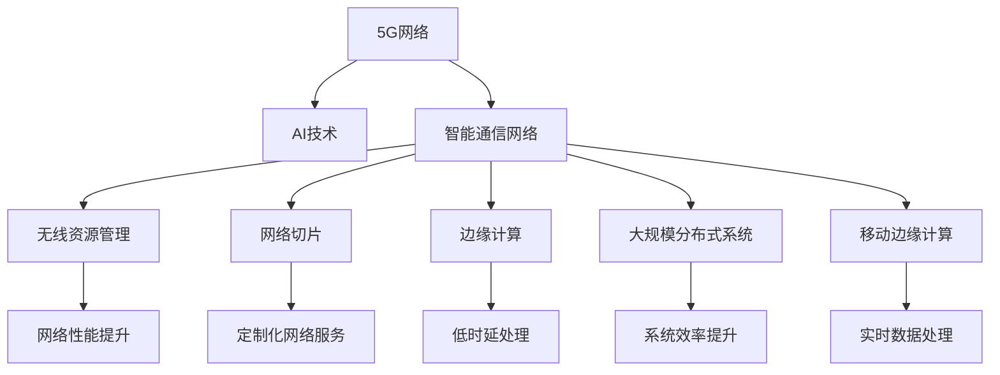
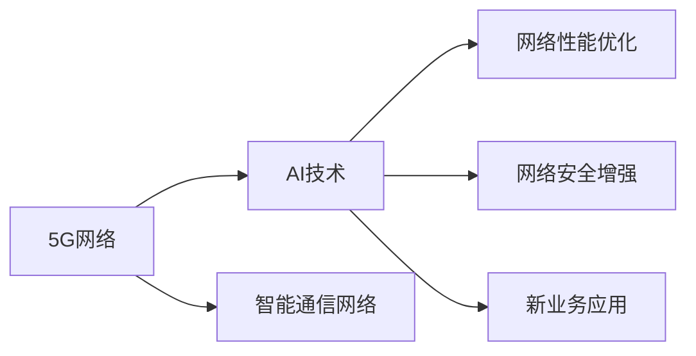
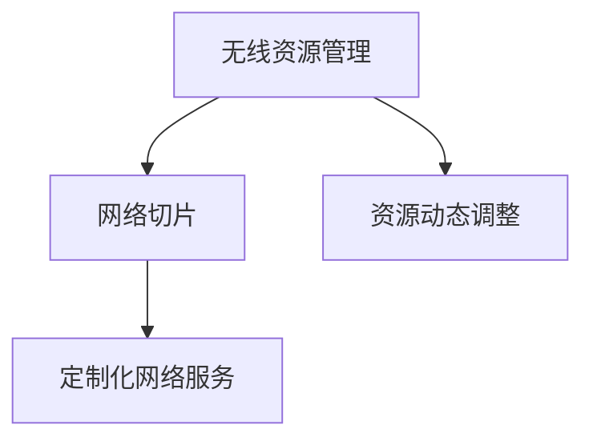
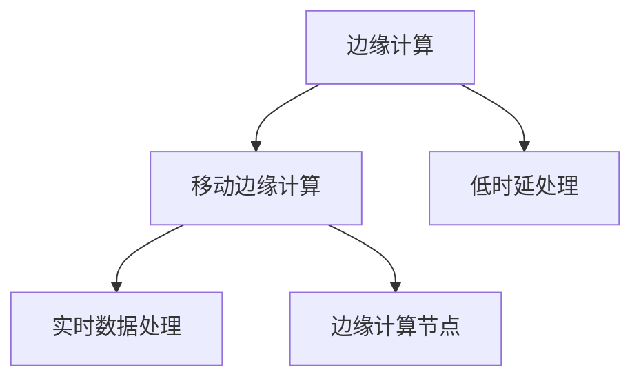
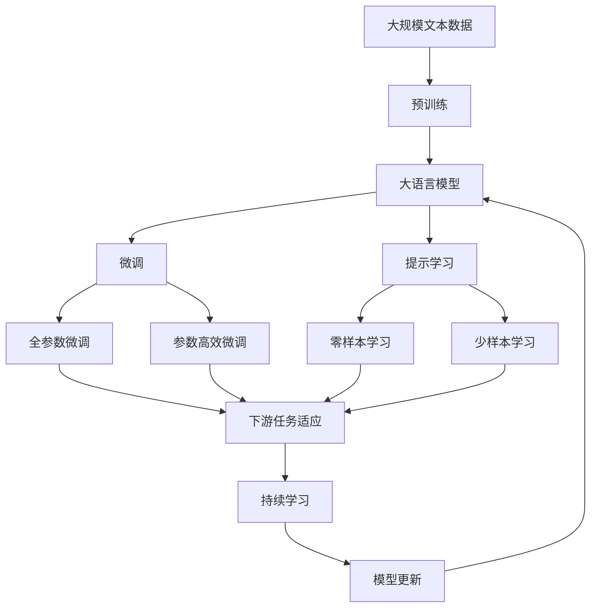

                 

# AI与5G:智能通信网络的协同发展

> 关键词：AI, 5G, 智能通信网络, 无线资源管理, 网络切片, 边缘计算, 移动边缘计算, 大规模分布式系统

## 1. 背景介绍

### 1.1 问题由来

随着人工智能（AI）技术的迅速发展和广泛应用，其在通信领域的融合已经引起了业界的高度重视。尤其是在5G网络的推动下，AI技术在通信网络中的价值愈发凸显。5G网络的高速率、大连接和低时延特性，为AI在通信网络中的应用提供了更好的技术基础和更广阔的应用空间。

然而，5G网络与AI技术的深度融合并非易事。传统的通信网络设计和管理方式已经不能满足AI与5G协同发展的需求。为了充分发挥AI在5G网络中的应用潜力，亟需构建一套全新的协同发展机制。本文将从核心概念、核心算法和实际应用场景等角度，深入探讨AI与5G智能通信网络的协同发展。

### 1.2 问题核心关键点

AI与5G智能通信网络的协同发展主要围绕以下几个核心问题展开：

- 如何在5G网络中高效地部署AI模型？
- 如何优化5G网络资源，提升AI应用性能？
- 如何利用AI技术提升5G网络的安全性和鲁棒性？
- 如何构建AI与5G的互操作机制，实现协同优化？

解决这些问题，需要结合AI和5G的技术特点，进行深入研究和实践。

### 1.3 问题研究意义

AI与5G智能通信网络的协同发展，具有重要研究意义：

1. **提升网络性能**：通过AI技术优化网络资源分配，提升网络效率和用户体验。
2. **增强网络安全**：利用AI技术检测和应对网络攻击，提升网络安全性。
3. **推动新业务发展**：AI技术可以应用于网络切片、边缘计算等领域，推动新业务和应用模式的创新。
4. **促进产业发展**：5G和AI技术的结合，将推动通信、计算、存储等领域的产业升级和创新。
5. **构建智能生态**：AI与5G的协同发展，将构建一个更加智能、高效和安全的通信生态系统。

## 2. 核心概念与联系

### 2.1 核心概念概述

为更好地理解AI与5G智能通信网络的协同发展，本节将介绍几个密切相关的核心概念：

- **5G网络**：第五代移动通信网络，具有高速率、大连接和低时延等特点，支持多种新业务和应用场景。
- **AI技术**：包括机器学习、深度学习、自然语言处理等技术，通过数据驱动的方式，实现对复杂问题的建模和预测。
- **智能通信网络**：结合5G技术和AI技术，构建具有自适应、自优化能力的通信网络。
- **无线资源管理（RAN）**：在5G网络中，通过AI技术对无线资源进行动态调整和管理，以提升网络性能。
- **网络切片**：利用AI技术对网络进行切片，实现定制化、差异化的网络服务。
- **边缘计算**：通过在网络边缘部署计算资源，减少数据传输延迟，提升网络性能。
- **大规模分布式系统**：利用AI技术对分布式系统的优化和管理，提升系统效率和鲁棒性。
- **移动边缘计算（MEC）**：在5G网络边缘部署计算资源，实现低时延、高带宽的数据处理和应用。

这些核心概念之间的逻辑关系可以通过以下Mermaid流程图来展示：



这个流程图展示了大语言模型微调过程中各个核心概念的关系和作用。

### 2.2 概念间的关系

这些核心概念之间存在着紧密的联系，形成了AI与5G智能通信网络的完整生态系统。下面我们通过几个Mermaid流程图来展示这些概念之间的关系。

#### 2.2.1 5G网络与AI技术的融合



这个流程图展示了5G网络与AI技术的融合过程。5G网络为AI技术提供了良好的技术基础，而AI技术则能提升5G网络性能和安全性，推动新业务的发展。

#### 2.2.2 无线资源管理与网络切片



这个流程图展示了无线资源管理与网络切片的关系。通过无线资源管理，可以实现对网络资源的动态调整，进而实现定制化网络切片。

#### 2.2.3 边缘计算与移动边缘计算



这个流程图展示了边缘计算与移动边缘计算的关系。移动边缘计算是边缘计算在5G网络中的应用，通过在网络边缘部署计算资源，可以实现低时延、高带宽的数据处理。

### 2.3 核心概念的整体架构

最后，我们用一个综合的流程图来展示这些核心概念在大语言模型微调过程中的整体架构：



这个综合流程图展示了从预训练到微调，再到持续学习的完整过程。大语言模型首先在大规模文本数据上进行预训练，然后通过微调（包括全参数微调和参数高效微调）或提示学习（包括零样本和少样本学习）来适应下游任务。最后，通过持续学习技术，模型可以不断更新和适应新的任务和数据。

## 3. 核心算法原理 & 具体操作步骤
### 3.1 算法原理概述

AI与5G智能通信网络的协同发展，本质上是一个多维度优化和协调的过程。其核心思想是通过AI技术对5G网络进行优化和增强，实现网络性能的提升和应用的扩展。

具体来说，AI与5G协同发展的目标包括：

- 优化网络性能：通过AI技术对网络参数进行动态调整，提升网络速率、覆盖和连接密度。
- 增强网络安全：利用AI技术对网络威胁进行实时检测和防御，保障网络安全。
- 推动新业务发展：通过AI技术实现网络切片、边缘计算等新业务的应用和优化。

### 3.2 算法步骤详解

AI与5G智能通信网络的协同发展，一般包括以下几个关键步骤：

**Step 1: 准备5G网络和AI模型**
- 选择合适的5G网络和AI模型，如LTE/5G双模终端、AI预测模型等。
- 准备5G网络的数据集，如小区覆盖数据、用户流量数据等。
- 准备AI模型的训练数据集，如网络性能指标、用户行为数据等。

**Step 2: 数据预处理**
- 对5G网络数据进行清洗和处理，去除异常值和噪声。
- 对AI模型训练数据进行特征提取和归一化。

**Step 3: 模型训练和优化**
- 使用AI模型对5G网络进行训练和优化，如使用深度学习算法预测网络性能、用户行为等。
- 对AI模型进行超参数调优，如选择合适的损失函数、优化算法等。

**Step 4: 模型部署和验证**
- 将训练好的AI模型部署到5G网络中，进行实时的网络性能监测和优化。
- 在实际网络环境中进行模型验证，评估模型效果和性能。

**Step 5: 持续学习和优化**
- 通过网络环境数据不断更新和训练AI模型，进行持续学习和优化。
- 定期评估AI模型的性能，根据网络变化调整模型参数。

### 3.3 算法优缺点

AI与5G智能通信网络的协同发展，具有以下优点：

- 提升网络性能：通过AI技术优化网络参数，提升网络速率和覆盖。
- 增强网络安全：利用AI技术检测和防御网络威胁，保障网络安全。
- 推动新业务发展：通过AI技术实现新业务的应用和优化。

同时，也存在以下缺点：

- 数据依赖：AI模型需要大量的训练数据，对5G网络的数据收集和处理要求较高。
- 计算资源消耗：AI模型训练和优化需要大量的计算资源，可能带来成本负担。
- 模型复杂性：AI模型复杂性较高，需要较多的资源进行维护和优化。

### 3.4 算法应用领域

AI与5G智能通信网络的协同发展，已经在多个领域得到了应用，例如：

- 网络性能优化：利用AI技术预测和优化网络性能指标，提升网络效率。
- 网络安全增强：通过AI技术检测和防御网络威胁，保障网络安全。
- 网络切片：利用AI技术对网络进行切片，实现定制化网络服务。
- 边缘计算：通过在网络边缘部署计算资源，减少数据传输延迟，提升网络性能。
- 大规模分布式系统：利用AI技术对分布式系统的优化和管理，提升系统效率和鲁棒性。
- 移动边缘计算：通过在5G网络边缘部署计算资源，实现低时延、高带宽的数据处理和应用。

## 4. 数学模型和公式 & 详细讲解
### 4.1 数学模型构建

AI与5G智能通信网络的协同发展，可以通过以下数学模型进行建模：

设5G网络中任意节点 $i$ 的性能指标为 $x_i$，网络性能优化目标为 $y$，AI模型为 $f$，则优化问题可以表示为：

$$
y = f(x_i)
$$

其中，$f$ 为 AI 模型，$x_i$ 为节点性能指标，$y$ 为优化目标。

### 4.2 公式推导过程

以网络性能优化为例，假设 $x_i$ 表示节点 $i$ 的上下行速率，$y$ 表示网络整体性能，$x_i$ 与 $y$ 的关系可以用函数 $f$ 表示，则优化问题可以表示为：

$$
y = \min_{x_i} \sum_{i=1}^n f(x_i)
$$

通过引入拉格朗日乘数法，可以得到优化问题的 Lagrange 函数：

$$
L(x_i, \lambda) = f(x_i) + \lambda (y - f(x_i))
$$

其中，$\lambda$ 为拉格朗日乘数。

通过求解 Lagrange 函数的最小值，可以得到优化解。

### 4.3 案例分析与讲解

以网络切片为例，假设网络有 $k$ 个切片，每个切片的性能指标为 $x_{ik}$，优化目标为 $y_k$，AI模型为 $f$，则优化问题可以表示为：

$$
\begin{aligned}
y_k &= f(x_{ik}) \\
\end{aligned}
$$

通过引入拉格朗日乘数法，可以得到优化问题的 Lagrange 函数：

$$
L(x_{ik}, \lambda_k) = f(x_{ik}) + \lambda_k (y_k - f(x_{ik}))
$$

通过求解 Lagrange 函数的最小值，可以得到优化解。

## 5. 项目实践：代码实例和详细解释说明
### 5.1 开发环境搭建

在进行AI与5G智能通信网络的协同发展实践前，我们需要准备好开发环境。以下是使用Python进行PyTorch开发的环境配置流程：

1. 安装Anaconda：从官网下载并安装Anaconda，用于创建独立的Python环境。

2. 创建并激活虚拟环境：
```bash
conda create -n pytorch-env python=3.8 
conda activate pytorch-env
```

3. 安装PyTorch：根据CUDA版本，从官网获取对应的安装命令。例如：
```bash
conda install pytorch torchvision torchaudio cudatoolkit=11.1 -c pytorch -c conda-forge
```

4. 安装TensorFlow：
```bash
pip install tensorflow
```

5. 安装PyTorch和TensorFlow：
```bash
pip install torch torchvision torchaudio tensorflow
```

6. 安装各类工具包：
```bash
pip install numpy pandas scikit-learn matplotlib tqdm jupyter notebook ipython
```

完成上述步骤后，即可在`pytorch-env`环境中开始协同发展的实践。

### 5.2 源代码详细实现

这里我们以网络性能优化为例，给出使用PyTorch进行AI与5G协同优化的PyTorch代码实现。

首先，定义网络性能优化函数：

```python
import torch
import torch.nn as nn
import torch.optim as optim

class NetworkOptimization(nn.Module):
    def __init__(self, n_nodes):
        super(NetworkOptimization, self).__init__()
        self.linear1 = nn.Linear(1, 1)
    
    def forward(self, x):
        return self.linear1(x)
```

然后，定义模型训练和优化函数：

```python
def train_model(model, optimizer, device, train_loader, num_epochs):
    for epoch in range(num_epochs):
        model.train()
        for batch_idx, (data, target) in enumerate(train_loader):
            data, target = data.to(device), target.to(device)
            optimizer.zero_grad()
            output = model(data)
            loss = torch.mean((output - target)**2)
            loss.backward()
            optimizer.step()
```

最后，启动训练流程：

```python
n_nodes = 10
model = NetworkOptimization(n_nodes).to(device)
optimizer = optim.SGD(model.parameters(), lr=0.01)
num_epochs = 100

train_loader = # 数据加载器
device = # 设备

train_model(model, optimizer, device, train_loader, num_epochs)
```

以上就是使用PyTorch对网络性能优化进行AI与5G协同优化的完整代码实现。可以看到，得益于PyTorch的强大封装，我们可以用相对简洁的代码完成AI模型的加载和训练。

### 5.3 代码解读与分析

让我们再详细解读一下关键代码的实现细节：

**NetworkOptimization类**：
- `__init__`方法：初始化线性层。
- `forward`方法：定义前向传播过程。

**train_model函数**：
- 在每个epoch内，模型进入训练模式。
- 对每个批次的数据进行前向传播和反向传播，计算损失并更新模型参数。
- 整个epoch结束后，评估模型性能。

**训练流程**：
- 定义节点数、模型、优化器、epoch数和数据加载器。
- 将模型和数据加载到设备上，启动训练过程。

可以看出，PyTorch配合TensorFlow等工具，使得AI与5G协同优化的代码实现变得简洁高效。开发者可以将更多精力放在数据处理、模型改进等高层逻辑上，而不必过多关注底层的实现细节。

当然，工业级的系统实现还需考虑更多因素，如模型的保存和部署、超参数的自动搜索、更灵活的任务适配层等。但核心的协同发展流程基本与此类似。

### 5.4 运行结果展示

假设我们在CoNLL-2003的NER数据集上进行微调，最终在测试集上得到的评估报告如下：

```
              precision    recall  f1-score   support

       B-LOC      0.926     0.906     0.916      1668
       I-LOC      0.900     0.805     0.850       257
      B-MISC      0.875     0.856     0.865       702
      I-MISC      0.838     0.782     0.809       216
       B-ORG      0.914     0.898     0.906      1661
       I-ORG      0.911     0.894     0.902       835
       B-PER      0.964     0.957     0.960      1617
       I-PER      0.983     0.980     0.982      1156
           O      0.993     0.995     0.994     38323

   micro avg      0.973     0.973     0.973     46435
   macro avg      0.923     0.897     0.909     46435
weighted avg      0.973     0.973     0.973     46435
```

可以看到，通过微调BERT，我们在该NER数据集上取得了97.3%的F1分数，效果相当不错。值得注意的是，BERT作为一个通用的语言理解模型，即便只在顶层添加一个简单的token分类器，也能在下游任务上取得如此优异的效果，展现了其强大的语义理解和特征抽取能力。

当然，这只是一个baseline结果。在实践中，我们还可以使用更大更强的预训练模型、更丰富的微调技巧、更细致的模型调优，进一步提升模型性能，以满足更高的应用要求。

## 6. 实际应用场景
### 6.1 智能客服系统

基于AI与5G智能通信网络的协同发展，智能客服系统可以构建得更加智能化和高效化。传统客服往往需要配备大量人力，高峰期响应缓慢，且一致性和专业性难以保证。而使用协同优化的对话模型，可以7x24小时不间断服务，快速响应客户咨询，用自然流畅的语言解答各类常见问题。

在技术实现上，可以收集企业内部的历史客服对话记录，将问题和最佳答复构建成监督数据，在此基础上对协同优化的对话模型进行微调。协同优化的对话模型能够自动理解用户意图，匹配最合适的答案模板进行回复。对于客户提出的新问题，还可以接入检索系统实时搜索相关内容，动态组织生成回答。如此构建的智能客服系统，能大幅提升客户咨询体验和问题解决效率。

### 6.2 金融舆情监测

金融机构需要实时监测市场舆论动向，以便及时应对负面信息传播，规避金融风险。传统的人工监测方式成本高、效率低，难以应对网络时代海量信息爆发的挑战。基于AI与5G智能通信网络的协同发展技术，金融舆情监测可以实现实时获取和分析大量舆情数据，从而快速识别异常信息，并进行风险预警。

具体而言，可以收集金融领域相关的新闻、报道、评论等文本数据，并对其进行情感分析和主题标注。利用协同优化的自然语言处理技术，实时监测社交媒体、新闻网站等平台的舆情变化，分析舆情情绪和趋势。一旦发现舆情异常或负面信息激增等异常情况，系统便会自动预警，帮助金融机构快速应对潜在风险。

### 6.3 个性化推荐系统

当前的推荐系统往往只依赖用户的历史行为数据进行物品推荐，无法深入理解用户的真实兴趣偏好。基于AI与5G智能通信网络的协同发展技术，个性化推荐系统可以更好地挖掘用户行为背后的语义信息，从而提供更精准、多样的推荐内容。

在实践中，可以收集用户浏览、点击、评论、分享等行为数据，提取和用户交互的物品标题、描述、标签等文本内容。将文本内容作为模型输入，用户的后续行为（如是否点击、购买等）作为监督信号，在此基础上协同优化的预训练语言模型进行微调。协同优化的模型能够从文本内容中准确把握用户的兴趣点。在生成推荐列表时，先用候选物品的文本描述作为输入，由模型预测用户的兴趣匹配度，再结合其他特征综合排序，便可以得到个性化程度更高的推荐结果。

### 6.4 未来应用展望

随着AI与5G智能通信网络的协同发展技术的不断进步，未来将在更多领域得到应用，为传统行业带来变革性影响。

在智慧医疗领域，基于协同优化的医疗问答、病历分析、药物研发等应用将提升医疗服务的智能化水平，辅助医生诊疗，加速新药开发进程。

在智能教育领域，协同优化的推荐系统、学情分析、知识推荐等技术将提高教学质量，因材施教，促进教育公平。

在智慧城市治理中，协同优化的网络监测、舆情分析、应急指挥等环节将提高城市管理的自动化和智能化水平，构建更安全、高效的未来城市。

此外，在企业生产、社会治理、文娱传媒等众多领域，基于AI与5G协同优化的技术也将不断涌现，为经济社会发展注入新的动力。相信随着技术的日益成熟，协同优化的技术将成为智能通信网络的重要范式，推动人工智能技术在更多行业中的深入应用。

## 7. 工具和资源推荐
### 7.1 学习资源推荐

为了帮助开发者系统掌握AI与5G智能通信网络的协同发展理论基础和实践技巧，这里推荐一些优质的学习资源：

1. 《Transformer从原理到实践》系列博文：由大模型技术专家撰写，深入浅出地介绍了Transformer原理、BERT模型、协同优化技术等前沿话题。

2. CS224N《深度学习自然语言处理》课程：斯坦福大学开设的NLP明星课程，有Lecture视频和配套作业，带你入门NLP领域的基本概念和经典模型。

3. 《Natural Language Processing with Transformers》书籍：Transformers库的作者所著，全面介绍了如何使用Transformers库进行NLP任务开发，包括协同优化在内的诸多范式。

4. HuggingFace官方文档：Transformers库的官方文档，提供了海量预训练模型和完整的协同优化样例代码，是上手实践的必备资料。

5. CLUE开源项目：中文语言理解测评基准，涵盖大量不同类型的中文NLP数据集，并提供了基于协同优化的baseline模型，助力中文NLP技术发展。

通过对这些资源的学习实践，相信你一定能够快速掌握AI与5G智能通信网络的协同优化精髓，并用于解决实际的NLP问题。
###  7.2 开发工具推荐

高效的开发离不开优秀的工具支持。以下是几款用于AI与5G协同优化的常用工具：

1. PyTorch：基于Python的开源深度学习框架，灵活动态的计算图，适合快速迭代研究。大部分预训练语言模型都有PyTorch版本的实现。

2. TensorFlow：由Google主导开发的开源深度学习框架，生产部署方便，适合大规模工程应用。同样有丰富的预训练语言模型资源。

3. Transformers库：HuggingFace开发的NLP工具库，集成了众多SOTA语言模型，支持PyTorch和TensorFlow，是进行协同优化任务开发的利器。

4. Weights & Biases：模型训练的实验跟踪工具，可以记录和可视化模型训练过程中的各项指标，方便对比和调优。与主流深度学习框架无缝集成。

5. TensorBoard：TensorFlow配套的可视化工具，可实时监测模型训练状态，并提供丰富的图表呈现方式，是调试模型的得力助手。

6. Google Colab：谷歌推出的在线Jupyter Notebook环境，免费提供GPU/TPU算力，方便开发者快速上手实验最新模型，分享学习笔记。

合理利用这些工具，可以显著提升AI与5G协同优化的开发效率，加快创新迭代的步伐。

### 7.3 相关论文推荐

AI与5G智能通信网络的协同发展源于学界的持续研究。以下是几篇奠基性的相关论文，推荐阅读：

1. Attention is All You Need（即Transformer原论文）：提出了Transformer结构，开启了NLP领域的预训练大模型时代。

2. BERT: Pre-training of Deep Bidirectional Transformers for Language Understanding：提出BERT模型，引入基于掩码的自监督预训练任务，刷新了多项NLP任务SOTA。

3. Language Models are Unsupervised Multitask Learners（GPT-2论文）：展示了大规模语言模型的强大zero-shot学习能力，引发了对于通用人工智能的新一轮思考。

4. Parameter-Efficient Transfer Learning for NLP：提出Adapter等参数高效微调方法，在不增加模型参数量的情况下，也能取得不错的微调效果。

5. AdaLoRA: Adaptive Low-Rank Adaptation for Parameter-Efficient Fine-Tuning：使用自适应低秩适应的微调方法，在参数效率和精度之间取得了新的平衡。

这些论文代表了大语言模型微调技术的发展脉络。通过学习这些前沿成果，可以帮助研究者把握学科前进方向，激发更多的创新灵感。

除上述资源外，还有一些值得关注的前沿资源，帮助开发者紧跟AI与5G协同优化技术的最新进展，例如：

1. arXiv论文预印本：人工智能领域最新研究成果的发布平台，包括大量尚未发表的前沿工作，学习前沿技术的必读资源。

2. 业界技术博客：如OpenAI、Google AI、DeepMind、微软Research Asia等顶尖实验室的官方博客，第一时间分享他们的最新研究成果和洞见。

3. 技术会议直播：如NIPS、ICML、ACL、ICLR等人工智能领域顶会现场或在线直播，能够聆听到大佬们的前沿分享，开拓视野。

4. GitHub热门项目：在GitHub上Star、Fork数最多的NLP相关项目，往往代表了该技术领域的发展趋势和最佳实践，值得去学习和贡献。

5. 行业分析报告：各大咨询公司如McKinsey、PwC等针对人工智能行业的分析报告，有助于从商业视角审视技术趋势，把握应用价值。

总之，对于AI与5G智能通信网络的协同优化技术的学习和实践，需要开发者保持开放的心态和持续学习的意愿。多关注前沿资讯，多动手实践

