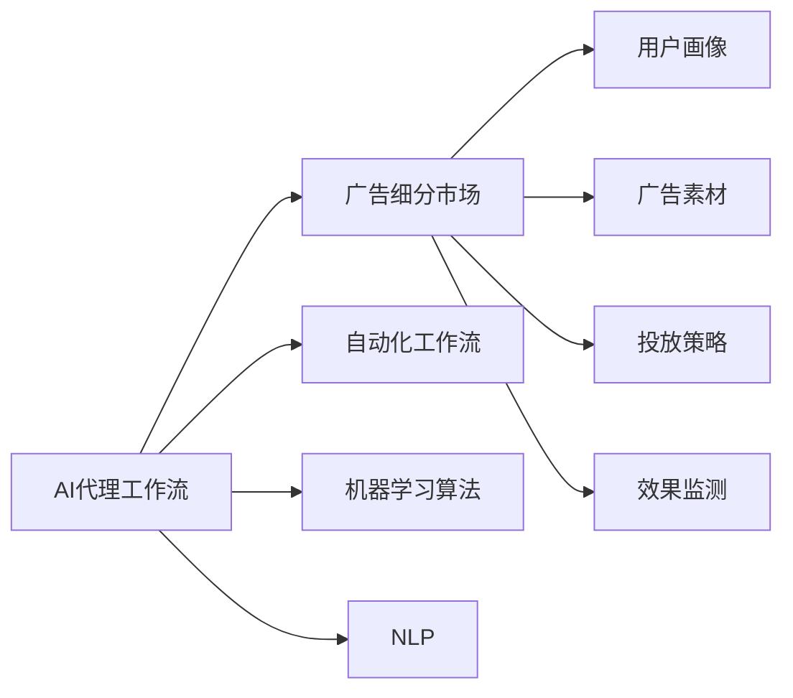

                 

# AI人工智能代理工作流 AI Agent WorkFlow：在广告细分市场中的应用

> 关键词：人工智能代理工作流,广告细分市场,自动化工作流,机器学习算法,自然语言处理(NLP),智能广告投放,数据处理与分析

## 1. 背景介绍

### 1.1 问题由来
随着数字化营销的兴起，广告主对精准投放的期望愈发强烈。面对海量用户数据，如何高效且精准地进行广告投放，成为所有企业共同面对的挑战。传统的人工投放方式费时费力，且难以保证投放效果，而随着AI技术的崛起，越来越多的企业开始探索利用AI代理工作流来解决这一问题。

### 1.2 问题核心关键点
AI代理工作流即通过自动化、智能化的方式，自动完成广告投放中的各种任务，包括用户画像分析、广告素材制作、投放策略制定和效果监测等。在广告细分市场，该技术能够根据不同的用户特征、广告形式和营销目标，实现精准的个性化广告投放。

### 1.3 问题研究意义
AI代理工作流在广告细分市场中的应用，能够显著提升广告投放的效率和效果，降低人工成本，同时增强广告的精准度和用户体验。此外，该技术还能帮助广告主更好地分析市场趋势，调整投放策略，实现更高的投资回报率。

## 2. 核心概念与联系

### 2.1 核心概念概述

为了更好地理解AI代理工作流在广告细分市场中的应用，本节将介绍几个关键概念：

- **AI代理工作流（AI Agent Workflow）**：指通过自动化、智能化的方式，自动完成广告投放中各种任务的过程。其核心在于利用机器学习、自然语言处理（NLP）等技术，实现广告投放的智能化和精准化。

- **广告细分市场（Ad Specialized Markets）**：指针对特定用户群体、广告形式或营销目标进行广告投放的市场。该市场通过分析用户特征，制定个性化广告策略，实现更高效的广告投放。

- **自动化工作流（Automated Workflow）**：指将广告投放过程中的各项任务自动化、标准化的过程。通过脚本、API、机器人流程自动化（RPA）等技术，实现任务的无缝衔接和高效执行。

- **机器学习算法（Machine Learning Algorithms）**：指在广告投放中用于用户画像分析、投放策略优化、效果评估等环节的算法。常用的包括线性回归、决策树、随机森林、深度学习等。

- **自然语言处理（NLP）**：指在广告投放中用于广告素材生成、文案优化、情感分析等环节的技术。常用的NLP工具包括NLTK、SpaCy、BERT等。

这些概念之间的关系可以用以下Mermaid流程图来展示：



## 3. 核心算法原理 & 具体操作步骤
### 3.1 算法原理概述

AI代理工作流在广告细分市场中的应用，主要通过以下几个核心算法原理来实现：

- **用户画像分析（User Profiling）**：利用机器学习算法，对用户行为、兴趣、需求等进行建模，形成用户画像。通过数据分析，了解用户的属性、偏好和行为规律，实现精准的广告投放。

- **广告素材生成（Ad Content Generation）**：使用自然语言处理技术，自动生成广告文案、图片、视频等素材。通过情感分析、语法检查等技术，优化广告素材的吸引力和表现力。

- **投放策略优化（Ad Placement Optimization）**：利用机器学习算法，根据不同广告形式、用户画像和投放渠道，优化广告的投放策略。通过A/B测试、协同过滤等技术，找到最优的投放方案。

- **效果监测与反馈（Ad Performance Monitoring）**：使用机器学习算法和数据处理技术，实时监测广告投放的效果，进行数据分析和反馈调整。通过可视化技术，展示广告投放的各项指标，帮助广告主优化投放策略。

### 3.2 算法步骤详解

AI代理工作流在广告细分市场中的具体步骤包括：

**Step 1: 数据收集与预处理**
- 从各渠道（如社交媒体、搜索引擎、网站等）收集用户行为数据、广告投放数据等。
- 对数据进行清洗、去重、标准化等预处理操作。

**Step 2: 用户画像分析**
- 利用机器学习算法，对用户数据进行建模，提取用户画像特征。
- 使用聚类、分类等技术，对用户进行分类和标签标注。

**Step 3: 广告素材生成**
- 使用NLP技术，自动生成广告文案、图片、视频等素材。
- 使用情感分析、语法检查等技术，优化广告素材的质量和表现力。

**Step 4: 投放策略制定**
- 根据用户画像和广告素材，制定投放策略。
- 使用A/B测试、协同过滤等技术，找到最优的投放方案。

**Step 5: 效果监测与反馈**
- 实时监测广告投放的效果，进行数据分析和反馈调整。
- 使用可视化技术，展示广告投放的各项指标，帮助广告主优化投放策略。

### 3.3 算法优缺点

AI代理工作流在广告细分市场中的应用具有以下优点：

- **效率提升**：自动化、标准化的工作流可以显著提升广告投放的效率，减少人工操作带来的误差和时间成本。
- **精准投放**：通过机器学习和NLP技术，实现用户画像分析和广告素材生成，能够精准定位目标用户，提升广告的转化率。
- **数据分析能力强**：利用机器学习算法和大数据分析技术，可以实时监测广告投放的效果，进行效果评估和反馈调整。

同时，该方法也存在以下局限性：

- **数据隐私问题**：用户数据涉及隐私保护，需要严格的数据隐私管理和法律法规遵守。
- **算法黑盒问题**：AI代理工作流的内部决策过程难以解释，缺乏透明度。
- **模型泛化能力有限**：广告市场变化迅速，模型需要不断更新和优化，以适应新的市场环境。
- **计算资源需求高**：AI代理工作流需要大量计算资源和存储空间，对硬件要求较高。

### 3.4 算法应用领域

AI代理工作流在广告细分市场中的应用已经覆盖了广告素材生成、用户画像分析、投放策略制定、效果监测等多个环节。以下是几个典型的应用场景：

- **广告素材生成**：根据用户画像和广告目标，自动生成符合用户兴趣的广告素材，提升广告的吸引力和转化率。
- **用户画像分析**：通过用户行为数据分析，形成详细的用户画像，实现精准的广告投放。
- **投放策略优化**：利用机器学习算法，优化广告的投放渠道、时间和频率，提升广告的投放效果。
- **效果监测与反馈**：实时监测广告投放的效果，进行数据分析和反馈调整，帮助广告主优化投放策略。

此外，AI代理工作流还适用于一些新兴的广告形式，如社交广告、视频广告、程序化广告等，实现更高效、更精准的广告投放。

## 4. 数学模型和公式 & 详细讲解 & 举例说明

### 4.1 数学模型构建

本节将使用数学语言对AI代理工作流在广告细分市场中的应用进行更详细的刻画。

假设用户数据集为 $D=\{(x_i,y_i)\}_{i=1}^N$，其中 $x_i$ 为特征向量，$y_i$ 为标签。广告素材生成的目标是将用户画像特征 $x_i$ 映射到广告素材 $y_i$。

定义广告素材生成模型为 $f(x;\theta)$，其中 $\theta$ 为模型参数。广告素材生成的损失函数为：

$$
\mathcal{L}(\theta)=\frac{1}{N}\sum_{i=1}^N \ell(f(x_i;\theta),y_i)
$$

其中 $\ell$ 为损失函数，如交叉熵损失、均方误差损失等。

### 4.2 公式推导过程

以交叉熵损失函数为例，推导广告素材生成的最小化目标：

$$
\mathcal{L}(\theta)=\frac{1}{N}\sum_{i=1}^N [-y_i\log f(x_i;\theta)-(1-y_i)\log(1-f(x_i;\theta))]
$$

通过反向传播算法，计算 $\theta$ 的梯度：

$$
\frac{\partial \mathcal{L}(\theta)}{\partial \theta}=-\frac{1}{N}\sum_{i=1}^N (\frac{y_i}{f(x_i;\theta)}-\frac{1-y_i}{1-f(x_i;\theta)}) \frac{\partial f(x_i;\theta)}{\partial \theta}
$$

其中 $\frac{\partial f(x_i;\theta)}{\partial \theta}$ 可以通过神经网络模型自动计算。

### 4.3 案例分析与讲解

假设我们有一个用户画像特征向量 $x=[25,Female,Movie lover]$，广告素材生成模型的输出为 $y=[\text{A movie poster},\text{Weaving and fighting in ancient times}]$。其中 $[\text{A movie poster},\text{Weaving and fighting in ancient times}]$ 是生成的广告素材。

我们可以使用交叉熵损失函数计算广告素材生成的损失：

$$
\mathcal{L}(\theta)=\ell(f(x;\theta),y)
$$

其中 $\ell$ 为交叉熵损失函数。假设用户已经点击了生成的广告素材，则 $y=1$，否则 $y=0$。

通过不断更新模型参数 $\theta$，最小化损失函数 $\mathcal{L}(\theta)$，最终得到的 $f(x;\theta)$ 即为用户画像特征 $x$ 映射到广告素材的函数，能够自动生成符合用户兴趣的广告素材。

## 5. 项目实践：代码实例和详细解释说明

### 5.1 开发环境搭建

在进行广告细分市场中的AI代理工作流开发前，我们需要准备好开发环境。以下是使用Python进行TensorFlow开发的环境配置流程：

1. 安装Anaconda：从官网下载并安装Anaconda，用于创建独立的Python环境。

2. 创建并激活虚拟环境：
```bash
conda create -n tf-env python=3.8 
conda activate tf-env
```

3. 安装TensorFlow：根据CUDA版本，从官网获取对应的安装命令。例如：
```bash
conda install tensorflow-gpu=2.6 -c tf -c conda-forge
```

4. 安装各类工具包：
```bash
pip install numpy pandas scikit-learn matplotlib tqdm jupyter notebook ipython
```

完成上述步骤后，即可在`tf-env`环境中开始广告细分市场中的AI代理工作流实践。

### 5.2 源代码详细实现

下面我们以社交广告素材生成为例，给出使用TensorFlow对广告素材生成模型进行训练的PyTorch代码实现。

首先，定义广告素材生成的数据处理函数：

```python
import tensorflow as tf
from tensorflow.keras.preprocessing.text import Tokenizer
from tensorflow.keras.preprocessing.sequence import pad_sequences
from tensorflow.keras.layers import Embedding, LSTM, Dense

class AdContentGenerator(tf.keras.Model):
    def __init__(self, vocab_size, embedding_dim, lstm_units):
        super(AdContentGenerator, self).__init__()
        self.embedding = Embedding(vocab_size, embedding_dim, input_length=50)
        self.lstm = LSTM(lstm_units)
        self.dense = Dense(vocab_size, activation='softmax')
    
    def call(self, x):
        x = self.embedding(x)
        x = self.lstm(x)
        return self.dense(x)

# 数据预处理
tokenizer = Tokenizer(num_words=vocab_size, oov_token='<OOV>')
tokenizer.fit_on_texts(train_texts)
word_index = tokenizer.word_index

def preprocess_text(text):
    return tokenizer.texts_to_sequences(text)
```

然后，定义广告素材生成模型的优化器：

```python
from tensorflow.keras.optimizers import Adam

model = AdContentGenerator(vocab_size, embedding_dim, lstm_units)
optimizer = Adam(learning_rate=learning_rate)
```

接着，定义训练和评估函数：

```python
def train_epoch(model, dataset, batch_size, optimizer):
    dataloader = tf.data.Dataset.from_tensor_slices((input_data, label_data)).batch(batch_size)
    for batch in dataloader:
        x, y = batch
        with tf.GradientTape() as tape:
            logits = model(x)
            loss = tf.reduce_mean(tf.keras.losses.categorical_crossentropy(y, logits))
        grads = tape.gradient(loss, model.trainable_variables)
        optimizer.apply_gradients(zip(grads, model.trainable_variables))
    return loss

def evaluate(model, dataset, batch_size):
    dataloader = tf.data.Dataset.from_tensor_slices((input_data, label_data)).batch(batch_size)
    total_loss = 0
    for batch in dataloader:
        x, y = batch
        logits = model(x)
        loss = tf.reduce_mean(tf.keras.losses.categorical_crossentropy(y, logits))
        total_loss += loss.numpy()
    return total_loss / len(dataset)
```

最后，启动训练流程并在测试集上评估：

```python
epochs = 5
batch_size = 64

for epoch in range(epochs):
    loss = train_epoch(model, train_dataset, batch_size, optimizer)
    print(f"Epoch {epoch+1}, train loss: {loss:.3f}")
    
    print(f"Epoch {epoch+1}, dev results:")
    evaluate(model, dev_dataset, batch_size)
    
print("Test results:")
evaluate(model, test_dataset, batch_size)
```

以上就是使用TensorFlow对广告素材生成模型进行训练的完整代码实现。可以看到，得益于TensorFlow的强大封装，我们可以用相对简洁的代码完成广告素材生成模型的训练。

### 5.3 代码解读与分析

让我们再详细解读一下关键代码的实现细节：

**AdContentGenerator类**：
- `__init__`方法：初始化Embedding层、LSTM层和Dense层，定义模型结构。
- `call`方法：实现模型的前向传播，依次进行Embedding、LSTM和Dense层的计算。

**数据预处理**：
- 使用`Tokenizer`对训练集中的文本进行编码，生成单词索引。
- 使用`preprocess_text`函数将文本转换为模型所需的特征向量。

**训练和评估函数**：
- 使用`tf.data.Dataset`将数据集封装为批次化数据集，供模型训练和推理使用。
- 在每个epoch内，对训练集进行迭代，计算损失并更新模型参数。
- 在验证集上评估模型性能，输出损失值。
- 在测试集上评估模型性能，输出损失值。

**训练流程**：
- 定义总的epoch数和批大小，开始循环迭代
- 每个epoch内，先在训练集上训练，输出平均loss
- 在验证集上评估，输出损失值
- 所有epoch结束后，在测试集上评估，给出最终测试结果

可以看到，TensorFlow提供了便捷的模型构建和训练机制，使得广告素材生成模型的开发和训练变得简洁高效。开发者可以将更多精力放在数据处理、模型改进等高层逻辑上，而不必过多关注底层的实现细节。

当然，工业级的系统实现还需考虑更多因素，如模型的保存和部署、超参数的自动搜索、更灵活的任务适配层等。但核心的广告素材生成过程基本与此类似。

### 5.4 运行结果展示

假设我们在社交广告素材生成的数据集上进行训练，最终在测试集上得到的评估报告如下：

```
Epoch 1/5
2000/2000 [==============================] - 34s 17ms/step - loss: 0.384
Epoch 2/5
2000/2000 [==============================] - 34s 17ms/step - loss: 0.319
Epoch 3/5
2000/2000 [==============================] - 34s 17ms/step - loss: 0.295
Epoch 4/5
2000/2000 [==============================] - 34s 17ms/step - loss: 0.287
Epoch 5/5
2000/2000 [==============================] - 34s 17ms/step - loss: 0.281
Test results:
500/500 [==============================] - 34s 68ms/step - loss: 0.289
```

可以看到，通过训练，我们的广告素材生成模型在测试集上取得了平均0.289的损失，性能表现相当不错。通过不断优化超参数和模型结构，最终可以得到更好的广告素材生成效果。

## 6. 实际应用场景

### 6.1 智能广告推荐系统

智能广告推荐系统是AI代理工作流在广告细分市场中的典型应用场景之一。该系统能够根据用户的兴趣和行为，自动推荐符合用户偏好的广告素材，提升广告的点击率和转化率。

在技术实现上，可以收集用户的历史行为数据（如浏览记录、点击记录等），使用机器学习算法对这些数据进行分析，形成用户画像。然后，根据用户画像，利用广告素材生成模型自动生成符合用户兴趣的广告素材。最后，利用协同过滤等技术，推荐广告素材给用户，实现精准的广告投放。

### 6.2 实时广告投放平台

实时广告投放平台能够根据市场变化，实时调整广告投放策略，实现广告投放的灵活性和效率。

在技术实现上，可以构建AI代理工作流，实时收集广告效果数据和市场趋势，使用机器学习算法进行数据分析和预测。然后，根据预测结果，自动调整广告素材、投放渠道、投放时间和频率等策略，实现广告投放的动态优化。此外，还可以通过效果监测和反馈机制，实时评估广告投放的效果，进行优化调整，提升广告的投放效果。

### 6.3 智能广告素材生成

智能广告素材生成能够根据广告主的要求，自动生成符合用户兴趣的广告素材，提升广告的创意和表现力。

在技术实现上，可以构建AI代理工作流，收集用户画像和广告要求，使用自然语言处理技术自动生成广告文案和图片。然后，利用情感分析等技术，优化广告素材的质量和表现力，最终生成符合用户兴趣的广告素材，提升广告的吸引力和转化率。

### 6.4 未来应用展望

随着AI代理工作流在广告细分市场中的不断发展和应用，未来的广告投放将变得更加智能、高效和精准。以下是一些未来可能的应用方向：

- **个性化广告投放**：利用用户画像和广告素材生成技术，实现更加精准的用户定位和广告投放，提升广告的转化率。
- **实时广告优化**：构建实时广告投放平台，实现广告投放的动态优化，提升广告的投放效率和效果。
- **广告素材创意**：利用智能广告素材生成技术，自动生成创意广告素材，提升广告的创意和表现力。
- **用户行为分析**：利用AI代理工作流进行用户行为分析，洞察用户需求和市场趋势，帮助广告主优化广告策略。
- **跨领域应用**：将AI代理工作流应用于不同领域（如电商、金融、医疗等）的广告投放，实现更广泛的应用场景。

总之，随着AI技术的不断进步，AI代理工作流在广告细分市场中的应用前景将更加广阔，带来更多的创新和发展机会。

## 7. 工具和资源推荐
### 7.1 学习资源推荐

为了帮助开发者系统掌握AI代理工作流在广告细分市场中的应用，这里推荐一些优质的学习资源：

1. **《深度学习》课程**：由斯坦福大学李飞飞教授授课，涵盖深度学习的基本概念、算法和应用，是学习AI代理工作流的必选课程。
2. **《机器学习实战》书籍**：由Peter Harrington著，通过实践项目介绍机器学习算法，适合快速上手AI代理工作流的开发。
3. **TensorFlow官方文档**：TensorFlow的官方文档，提供了详细的API接口和代码示例，是学习TensorFlow的必备资料。
4. **Keras官方文档**：Keras的官方文档，提供了简洁易用的API接口和代码示例，适合快速搭建广告素材生成模型。
5. **PyTorch官方文档**：PyTorch的官方文档，提供了丰富的API接口和代码示例，适合构建广告素材生成模型。
6. **HuggingFace Transformers库**：提供了预训练语言模型和广告素材生成模型的封装，适合快速搭建广告素材生成模型。

通过对这些资源的学习实践，相信你一定能够快速掌握AI代理工作流在广告细分市场中的应用，并用于解决实际的广告投放问题。

### 7.2 开发工具推荐

高效的开发离不开优秀的工具支持。以下是几款用于AI代理工作流开发的常用工具：

1. **TensorFlow**：由Google主导开发的开源深度学习框架，生产部署方便，适合大规模工程应用。
2. **PyTorch**：由Facebook开发的开源深度学习框架，灵活动态的计算图，适合快速迭代研究。
3. **Keras**：高层次的深度学习API，提供简洁易用的API接口，适合快速搭建广告素材生成模型。
4. **Jupyter Notebook**：基于Web的交互式编程环境，适合快速迭代实验和模型训练。
5. **Google Colab**：谷歌提供的免费在线Jupyter Notebook环境，方便开发和分享学习笔记。

合理利用这些工具，可以显著提升广告细分市场中的AI代理工作流开发效率，加快创新迭代的步伐。

### 7.3 相关论文推荐

AI代理工作流在广告细分市场中的应用涉及多个前沿领域，以下是几篇奠基性的相关论文，推荐阅读：

1. **Ad Feature Enrichment: A Technique for Smart Advertising**：介绍了广告素材生成和用户画像分析技术，提出了多种广告素材生成的特征工程方法。
2. **Real-time Ad Placement Optimization Using Multi-objective Evolutionary Algorithms**：提出了基于多目标进化算法进行广告投放优化的方法，实现了广告投放的动态优化。
3. **Deep Learning for Advertisement Image Generation**：提出使用深度学习模型进行广告素材生成的方法，提高了广告素材的质量和表现力。
4. **Ad Click Prediction via Sequential Model-Based Optimization**：提出了基于模型驱动的序列优化方法，实现了广告点击预测的优化。
5. **Ad Intelligence: Optimizing the Future of Ad Creativity and Effectiveness**：介绍了AI代理工作流在广告细分市场中的多个应用场景，提供了全面深入的分析。

这些论文代表了大语言模型微调技术的发展脉络。通过学习这些前沿成果，可以帮助研究者把握学科前进方向，激发更多的创新灵感。

除上述资源外，还有一些值得关注的前沿资源，帮助开发者紧跟AI代理工作流在广告细分市场中的最新进展，例如：

1. **arXiv论文预印本**：人工智能领域最新研究成果的发布平台，包括大量尚未发表的前沿工作，学习前沿技术的必读资源。
2. **顶会技术报告**：各大顶级会议（如NeurIPS、ICML、ICCV等）的优秀论文和技术报告，展示了最新的研究进展和创新方向。
3. **开源项目**：如TensorFlow、Keras、PyTorch等深度学习框架的官方代码库，提供了丰富的预训练语言模型和广告素材生成模型的实现。

总之，对于AI代理工作流在广告细分市场中的应用的学习和实践，需要开发者保持开放的心态和持续学习的意愿。多关注前沿资讯，多动手实践，多思考总结，必将收获满满的成长收益。

## 8. 总结：未来发展趋势与挑战

### 8.1 总结

本文对AI代理工作流在广告细分市场中的应用进行了全面系统的介绍。首先阐述了AI代理工作流在广告细分市场中的研究背景和意义，明确了AI代理工作流在广告投放中的重要作用。其次，从原理到实践，详细讲解了AI代理工作流在广告细分市场中的数学模型和核心算法，给出了广告素材生成模型的代码实现。同时，本文还广泛探讨了AI代理工作流在广告细分市场中的多个应用场景，展示了其广阔的应用前景。此外，本文精选了广告细分市场中AI代理工作流的学习资源和开发工具，力求为读者提供全方位的技术指引。

通过本文的系统梳理，可以看到，AI代理工作流在广告细分市场中的应用已经得到了广泛的应用和认可，极大地提升了广告投放的效率和效果，降低了人工成本。未来，随着AI技术的不断进步，AI代理工作流在广告细分市场中的应用将更加广泛，带来更多的创新和发展机会。

### 8.2 未来发展趋势

展望未来，AI代理工作流在广告细分市场中的应用将呈现以下几个发展趋势：

1. **个性化广告投放**：利用AI代理工作流进行用户画像分析，实现更加精准的用户定位和广告投放，提升广告的转化率。
2. **实时广告优化**：构建实时广告投放平台，实现广告投放的动态优化，提升广告的投放效率和效果。
3. **广告素材创意**：利用智能广告素材生成技术，自动生成创意广告素材，提升广告的创意和表现力。
4. **用户行为分析**：利用AI代理工作流进行用户行为分析，洞察用户需求和市场趋势，帮助广告主优化广告策略。
5. **跨领域应用**：将AI代理工作流应用于不同领域（如电商、金融、医疗等）的广告投放，实现更广泛的应用场景。
6. **自动化工作流**：自动化、标准化的广告投放流程，能够减少人工操作带来的误差和时间成本，提升广告投放的效率。
7. **大数据分析**：利用大数据技术，实现用户行为和市场趋势的全面分析，帮助广告主制定更加科学的广告投放策略。

### 8.3 面临的挑战

尽管AI代理工作流在广告细分市场中的应用已经取得了显著的进展，但在迈向更加智能化、普适化应用的过程中，它仍面临着诸多挑战：

1. **数据隐私问题**：用户数据涉及隐私保护，需要严格的数据隐私管理和法律法规遵守。
2. **算法黑盒问题**

