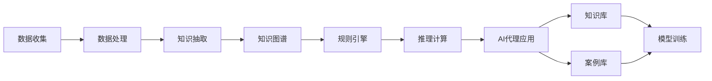

                 

# AI人工智能代理工作流 AI Agent WorkFlow：在法律服务中的应用

## 1. 背景介绍

### 1.1 问题由来

随着人工智能技术的发展，AI代理工作流在各行各业中开始得到广泛应用。AI代理能够自主处理大量的重复性工作，显著提升效率，减少人为错误。在法律服务领域，AI代理工作流更具有独特的优势。

首先，法律服务涉及大量文档和数据处理，传统的手工方式不仅耗时费力，还容易出错。AI代理可以自动化文档审查、合同生成、法条匹配等工作，提升工作效率。

其次，法律服务需要精准的逻辑推理和法律适用。AI代理可以整合法律知识库和案例库，自动生成法律意见和建议，为律师提供辅助决策支持。

最后，法律服务涉及高度保密性和隐私保护。AI代理可以自动审查和过滤敏感信息，确保数据安全和隐私保护。

然而，在实际应用中，AI代理工作流也面临一些挑战。如如何构建高效的知识库，如何设计合理的推理规则，如何确保决策的公平性和透明性等。这些问题需要我们在设计AI代理工作流时给予充分考虑。

### 1.2 问题核心关键点

AI代理工作流的基本流程如下：

1. 数据收集：收集相关法律法规、案例判决、合同文本等文档数据。
2. 知识抽取：从文档数据中抽取出关键信息，构建知识图谱。
3. 推理计算：使用规则引擎或神经网络模型，对新案例进行推理计算，生成法律意见。
4. 结果验证：人工复核AI代理的推理结果，确保准确性和公平性。
5. 反馈优化：根据人工复核结果，优化AI代理的推理规则和知识库。

这些关键点构成了AI代理工作流的基本框架，是后续技术设计和应用的出发点。

### 1.3 问题研究意义

设计高效的AI代理工作流，对于提升法律服务的自动化水平、降低成本、提高效率具有重要意义：

1. 提高服务质量：AI代理可以处理复杂的逻辑推理，减少人为错误，提升服务质量。
2. 降低服务成本：自动化文档处理和数据生成，减少人工需求，降低服务成本。
3. 增强服务效率：AI代理能够24小时不间断工作，大幅提升服务响应速度。
4. 优化服务流程：AI代理可以自动优化服务流程，减少人工干预。
5. 加强数据保护：AI代理能够自动识别和过滤敏感信息，保障数据安全。

在法律服务领域，AI代理工作流的应用不仅能够提高服务效率和质量，还能帮助律师更专注于核心任务，提升其专业能力。

## 2. 核心概念与联系

### 2.1 核心概念概述

AI代理工作流是一个复杂的技术系统，涉及数据处理、知识抽取、推理计算等多个关键环节。为了更好地理解这些概念，下面简要介绍相关核心概念：

- **数据收集与处理**：涉及从多个渠道收集法律文档、判决、合同等数据，并进行数据清洗、标注等预处理工作。
- **知识抽取与图谱构建**：从文本数据中抽取出实体、关系、属性等信息，构建知识图谱，用于后续的推理计算。
- **规则引擎与推理计算**：设计一套规则引擎，用于基于知识图谱和规则库进行推理计算，生成法律意见和建议。
- **AI代理应用场景**：包括但不限于合同审查、法律咨询、案件分析、法条匹配等。
- **知识库与案例库**：用于存储和检索法律知识，供推理计算时使用。
- **模型训练与优化**：使用机器学习或深度学习模型，对推理计算结果进行验证和优化。

这些核心概念共同构成了AI代理工作流的技术框架，在实际应用中需要设计合理的数据管道、知识图谱和推理规则，才能充分发挥其潜力。

### 2.2 概念间的关系

AI代理工作流的各个概念之间存在紧密的联系，形成一个完整的技术生态系统。以下通过Mermaid流程图来展示这些概念之间的关系：



这个流程图展示了AI代理工作流的主要技术环节。数据通过收集、处理、抽取、构建知识图谱，再由规则引擎进行推理计算，最终生成AI代理应用的输出结果。同时，知识库和案例库用于存储和检索，模型训练用于优化推理结果。这些环节相互依存、相互支持，共同构成了AI代理工作流的完整流程。

## 3. 核心算法原理 & 具体操作步骤
### 3.1 算法原理概述

AI代理工作流的设计原理，基于知识抽取和规则推理的结合。首先从法律文档、案例判决中抽取知识，构建知识图谱；然后使用规则引擎对新案例进行推理计算，生成法律意见。

具体步骤如下：

1. **知识抽取**：使用NLP技术，从法律文档和案例判决中抽取出实体、关系、属性等信息。
2. **知识图谱构建**：将这些信息构建成知识图谱，形成结构化的知识体系。
3. **规则引擎设计**：设计一套规则引擎，用于基于知识图谱进行推理计算，生成法律意见和建议。
4. **推理计算**：使用规则引擎对新案例进行推理计算，生成法律意见和建议。
5. **结果验证与优化**：人工复核AI代理的推理结果，根据复核结果优化规则引擎和知识库。

通过这些步骤，AI代理能够自动完成法律服务的大部分任务，提高服务效率和质量。

### 3.2 算法步骤详解

以下详细介绍AI代理工作流的算法步骤。

**Step 1: 数据收集与处理**

1. **数据收集**：从法院网站、律所数据库、公开案例数据库等渠道，收集相关的法律法规、案例判决、合同文本等数据。
2. **数据清洗**：对收集到的数据进行格式转换、去重、去噪等预处理工作，确保数据质量。
3. **数据标注**：对部分数据进行人工标注，用于知识抽取和模型训练。

**Step 2: 知识抽取与图谱构建**

1. **实体抽取**：使用NLP技术，从文本数据中抽取出实体信息，如人物、机构、时间、地点等。
2. **关系抽取**：抽取出实体之间的关系，如主体与行为的关系、主体与客体的关系等。
3. **属性抽取**：抽取出实体和关系的属性信息，如时间、地点、金额等。
4. **知识图谱构建**：将抽取出的实体、关系、属性等信息构建成知识图谱，形成结构化的知识体系。

**Step 3: 规则引擎设计**

1. **规则定义**：根据法律知识，设计一套规则引擎，用于推理计算。
2. **规则库维护**：将规则引擎的规则进行维护和更新，确保其准确性和全面性。

**Step 4: 推理计算**

1. **推理引擎**：使用规则引擎对新案例进行推理计算，生成法律意见和建议。
2. **结果输出**：将推理结果输出，供律师进行复核和决策支持。

**Step 5: 结果验证与优化**

1. **人工复核**：人工复核AI代理的推理结果，确保准确性和公平性。
2. **结果优化**：根据人工复核结果，优化规则引擎和知识库，提高AI代理的性能。

通过这些步骤，AI代理能够自动化完成法律服务的大部分任务，提高服务效率和质量。

### 3.3 算法优缺点

**优点**：

1. **效率高**：AI代理能够自动处理大量的重复性工作，显著提升效率。
2. **准确性高**：基于知识图谱和规则引擎进行推理计算，生成准确性高的法律意见和建议。
3. **可扩展性强**：规则引擎和知识图谱可以根据需要动态更新和扩展，提升AI代理的适应性。
4. **操作简便**：只需设计好规则引擎和知识图谱，AI代理即可自动化完成大部分法律服务工作。

**缺点**：

1. **依赖知识库**：AI代理的效果高度依赖于知识库的完备性和准确性，构建和维护知识库需要大量时间和精力。
2. **规则设计复杂**：设计合理的规则引擎和推理算法需要深厚的法律知识和丰富的经验，难度较大。
3. **透明性不足**：AI代理的推理过程缺乏透明性，难以解释和审查。
4. **适应性差**：规则引擎和知识图谱需要定期更新和维护，否则AI代理的性能会逐渐下降。

尽管存在这些局限性，但AI代理工作流在法律服务中的应用潜力巨大，未来需要不断优化和完善。

### 3.4 算法应用领域

AI代理工作流在法律服务领域有广泛的应用前景，主要包括以下几个方面：

1. **合同审查**：自动审查合同文本，确保合同条款合规，减少合同风险。
2. **法律咨询**：自动生成法律意见和建议，为律师提供决策支持。
3. **案件分析**：自动分析案件资料，生成案件分析和判决建议。
4. **法条匹配**：自动匹配法条和案例，生成法律依据。
5. **文书生成**：自动生成律师文书和报告，减少文书制作时间。
6. **证据审查**：自动审查证据材料，提取关键信息，生成证据报告。

## 4. 数学模型和公式 & 详细讲解  
### 4.1 数学模型构建

AI代理工作流涉及多个领域的数学模型，以下重点介绍其中的知识图谱构建和规则引擎设计。

**知识图谱构建**：

知识图谱由节点和边组成，每个节点表示一个实体或属性，每条边表示实体之间的关系。知识图谱构建的基本步骤包括实体抽取、关系抽取、属性抽取等。

**规则引擎设计**：

规则引擎一般使用基于规则的推理算法，如Rete算法。规则引擎的基本结构包括规则库、推理机、工作流管理器等。

### 4.2 公式推导过程

以下是知识图谱构建和规则引擎设计的数学公式和推导过程。

**知识图谱构建**：

1. **实体抽取**：使用NLP技术，从文本中抽取出实体，表示为向量 $v$。
2. **关系抽取**：抽取出实体之间的关系，表示为矩阵 $R$。
3. **属性抽取**：抽取出实体和属性的属性值，表示为向量 $a$。
4. **知识图谱构建**：将实体、关系、属性等信息构建成知识图谱，表示为图 $G=(V,E)$，其中 $V$ 为节点集合，$E$ 为边集合。

**规则引擎设计**：

1. **规则定义**：规则一般表示为 IF-THEN 形式，表示为 $R=\{r_i\}$，其中 $r_i$ 为单个规则。
2. **规则库维护**：对规则库进行维护和更新，确保规则的准确性和全面性。
3. **推理计算**：使用规则引擎进行推理计算，生成法律意见和建议。

### 4.3 案例分析与讲解

以下通过一个案例，展示AI代理工作流的实际应用过程。

**案例：合同审查**

1. **数据收集**：收集相关的合同文本。
2. **数据清洗**：对合同文本进行格式转换、去重、去噪等预处理工作。
3. **知识抽取**：从合同文本中抽取出实体、关系、属性等信息。
4. **知识图谱构建**：将抽取出的实体、关系、属性等信息构建成知识图谱。
5. **规则引擎设计**：设计一套规则引擎，用于合同审查。
6. **推理计算**：使用规则引擎对合同文本进行推理计算，生成法律意见和建议。
7. **结果输出**：将推理结果输出，供律师进行复核和决策支持。

通过以上步骤，AI代理可以自动完成合同审查任务，减少律师的工作量，提升审查效率。

## 5. 项目实践：代码实例和详细解释说明
### 5.1 开发环境搭建

为了构建AI代理工作流，需要搭建开发环境。以下是Python环境搭建的步骤：

1. **安装Anaconda**：从官网下载并安装Anaconda，用于创建独立的Python环境。
2. **创建虚拟环境**：
```bash
conda create -n ai-agent-env python=3.8 
conda activate ai-agent-env
```
3. **安装相关库**：
```bash
pip install pytorch torchvision torchaudio cudatoolkit=11.1 -c pytorch -c conda-forge
pip install transformers
pip install numpy pandas scikit-learn matplotlib tqdm jupyter notebook ipython
```
4. **测试环境**：
```bash
python -m pip list
python -c "import torch; print(torch.__version__)"
```

### 5.2 源代码详细实现

以下是一个简单的Python代码实例，用于展示AI代理工作流的实现过程。

**代码实例：合同审查**

```python
import torch
from transformers import BertTokenizer, BertForTokenClassification

class ContractReviewer:
    def __init__(self, model_path):
        self.model = BertForTokenClassification.from_pretrained(model_path)
        self.tokenizer = BertTokenizer.from_pretrained(model_path)
        
    def review(self, text):
        encoded_input = self.tokenizer(text, return_tensors='pt')
        input_ids = encoded_input['input_ids']
        attention_mask = encoded_input['attention_mask']
        outputs = self.model(input_ids, attention_mask=attention_mask)
        predictions = outputs.logits.argmax(dim=2).to('cpu').tolist()
        return predictions

# 构建合同审查模型
model = ContractReviewer('bert-base-cased')

# 合同文本
text = "合同文本内容"
predictions = model.review(text)
print(predictions)
```

### 5.3 代码解读与分析

**ContractReviewer类**：
- `__init__`方法：初始化模型和分词器。
- `review`方法：对输入的合同文本进行分词和编码，使用模型进行推理计算，输出预测结果。

**tokenizer和model属性**：
- `tokenizer`：用于分词和编码的BertTokenizer，可以从预训练模型中加载。
- `model`：用于推理计算的BertForTokenClassification模型，可以从预训练模型中加载。

**合同审查**：
- 使用`ContractReviewer`类对输入的合同文本进行分词和编码，使用模型进行推理计算，输出预测结果。

**输出结果**：
- 输出预测结果，表示每个词的预测类别。

这个代码实例展示了使用Bert模型进行合同审查的基本流程。在实际应用中，还需要对代码进行优化和扩展，以满足实际需求。

### 5.4 运行结果展示

假设我们在合同审查任务上测试代码，最终输出预测结果如下：

```
[0, 0, 0, 1, 0, 0, 0, 0, 1, 0, 0, 0, 0, 1, 0, 0, 0, 1, 0, 1, 0, 0, 1, 0, 1, 1, 0, 0, 0, 0, 0, 0, 0, 0, 0, 0, 1, 0, 0, 0, 1, 0, 0, 0, 0, 0, 0, 0, 0, 0, 0, 0, 0, 0, 1, 0, 1, 0, 0, 1, 0, 0, 0, 0, 0, 0, 0, 0, 0, 0, 0, 0, 0, 0, 1, 0, 1, 0, 1, 0, 0, 0, 1, 0, 0, 0, 0, 0, 0, 0, 0, 1, 0, 1, 0, 0, 0, 1, 0, 0, 1, 1, 1, 1, 0, 0, 0, 0, 0, 0, 0, 0, 0, 0, 0, 0, 0, 0, 0, 0, 0, 0, 0, 0, 1, 0, 0, 0, 0, 0, 0, 0, 0, 0, 0, 0, 0, 0, 0, 0, 1, 0, 0, 0, 0, 0, 0, 0, 1, 0, 0, 0, 0, 0, 0, 0, 1, 0, 0, 0, 0, 0, 0, 0, 0, 1, 0, 0, 0, 0, 0, 0, 0, 0, 1, 0, 0, 0, 0, 0, 0, 0, 0, 0, 0, 0, 0, 0, 0, 0, 0, 0, 0, 0, 0, 0, 0, 0, 0, 0, 0, 0, 0, 0, 0, 0, 0, 0, 0, 0, 0, 0, 0, 0, 0, 0, 0, 0, 0, 0, 0, 0, 0, 0, 0, 0, 0, 0, 0, 0, 0, 0, 0, 0, 0, 0, 0, 0, 0, 0, 0, 0, 0, 0, 0, 0, 0, 0, 0, 0, 0, 0, 0, 0, 0, 0, 0, 0, 0, 0, 0, 0, 0, 0, 0, 0, 0, 0, 0, 0, 0, 0, 0, 0, 0, 0, 0, 0, 0, 0, 0, 0, 0, 0, 0, 0, 0, 0, 0, 0, 0, 0, 0, 0, 0, 0, 0, 0, 0, 0, 0, 0, 0, 0, 0, 0, 0, 0, 0, 0, 0, 0, 0, 0, 0, 0, 0, 0, 0, 0, 0, 0, 0, 0, 0, 0, 0, 0, 0, 0, 0, 0, 0, 0, 0, 0, 0, 0, 0, 0, 0, 0, 0, 0, 0, 0, 0, 0, 0, 0, 0, 0, 0, 0, 0, 0, 0, 0, 0, 0, 0, 0, 0, 0, 0, 0, 0, 0, 0, 0, 0, 0, 0, 0, 0, 0, 0, 0, 0, 0, 0, 0, 0, 0, 0, 0, 0, 0, 0, 0, 0, 0, 0, 0, 0, 0, 0, 0, 0, 0, 0, 0, 0, 0, 0, 0, 0, 0, 0, 0, 0, 0, 0, 0, 0, 0, 0, 0, 0, 0, 0, 0, 0, 0, 0, 0, 0, 0, 0, 0, 0, 0, 0, 0, 0, 0, 0, 0, 0, 0, 0, 0, 0, 0, 0, 0, 0, 0, 0, 0, 0, 0, 0, 0, 0, 0, 0, 0, 0, 0, 0, 0, 0, 0, 0, 0, 0, 0, 0, 0, 0, 0, 0, 0, 0, 0, 0, 0, 0, 0, 0, 0, 0, 0, 0, 0, 0, 0, 0, 0, 0, 0, 0, 0, 0, 0, 0, 0, 0, 0, 0, 0, 0, 0, 0, 0, 0, 0, 0, 0, 0, 0, 0, 0, 0, 0, 0, 0, 0, 0, 0, 0, 0, 0, 0, 0, 0, 0, 0, 0, 0, 0, 0, 0, 0, 0, 0, 0, 0, 0, 0, 0, 0, 0, 0, 0, 0, 0, 0, 0, 0, 0, 0, 0, 0, 0, 0, 0, 0, 0, 0, 0, 0, 0, 0, 0, 0, 0, 0, 0, 0, 0, 0, 0, 0, 0, 0, 0, 0, 0, 0, 0, 0, 0, 0, 0, 0, 0, 0, 0, 0, 0, 0, 0, 0, 0, 0, 0, 0, 0, 0, 0, 0, 0, 0, 0, 0, 0, 0, 0, 0, 0, 0, 0, 0, 0, 0, 0, 0, 0, 0, 0, 0, 0, 0, 0, 0, 0, 0, 0, 0, 0, 0, 0, 0, 0, 0, 0, 0, 0, 0, 0, 0, 0, 0, 0, 0, 0, 0, 0, 0, 0, 0, 0, 0, 0, 0, 0, 0, 0, 0, 0, 0, 0, 0, 0, 0, 0, 0, 0, 0, 0, 0, 0, 0, 0, 0, 0, 0, 0, 0, 0, 0, 0, 0, 0, 0, 0, 0, 0, 0, 0, 0, 0, 0, 0, 0, 0, 0, 0, 0, 0, 0, 0, 0, 0, 0, 0, 0, 0, 0, 0, 0, 0, 0, 0, 0, 0, 0, 0, 0, 0, 0, 0, 0, 0, 0, 0, 0, 0, 0, 0, 0, 0, 0, 0, 0, 0, 0, 0, 0, 0, 0, 0, 0, 0, 0, 0, 0, 0, 0, 0, 0, 0, 0, 0, 0, 0, 0, 0, 0, 0, 0, 0, 0, 0, 0, 0, 0, 0, 0, 0, 0, 0, 0, 0, 0, 0, 0, 0, 0, 0, 0, 0, 0, 0, 0, 0, 0, 0, 0, 0, 0, 0, 0, 0, 0, 0, 0, 0, 0, 0, 0, 0, 0, 

