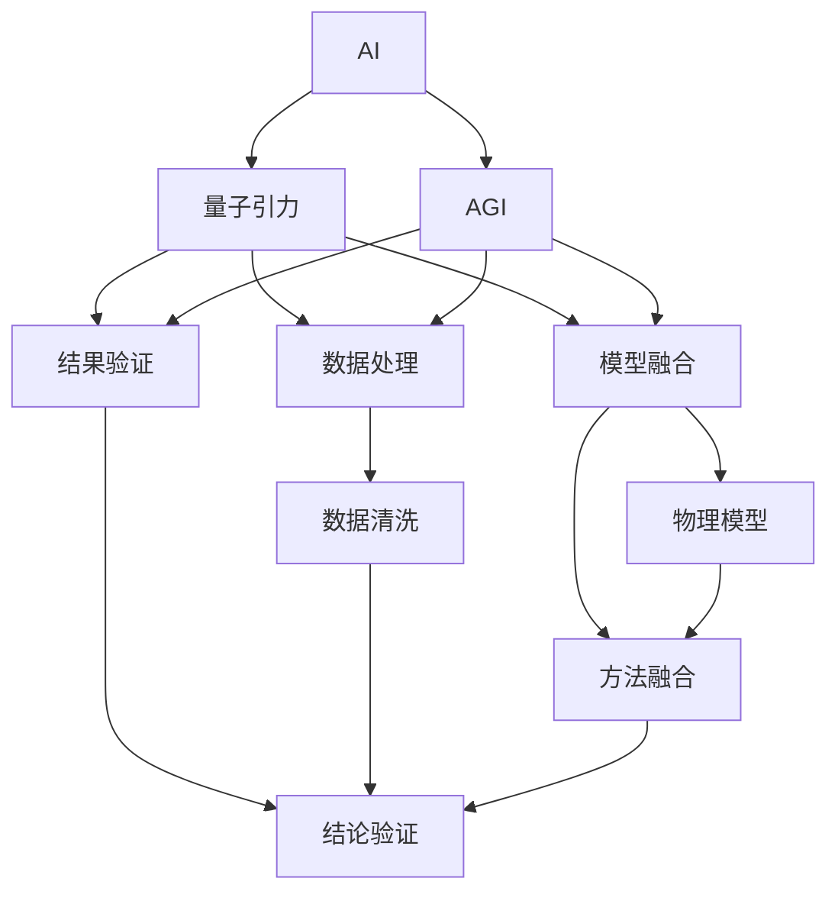
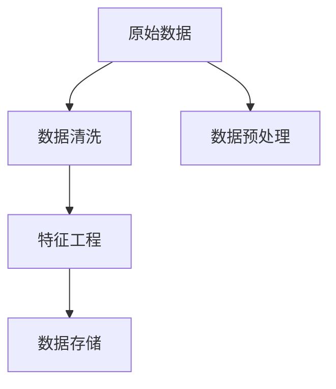
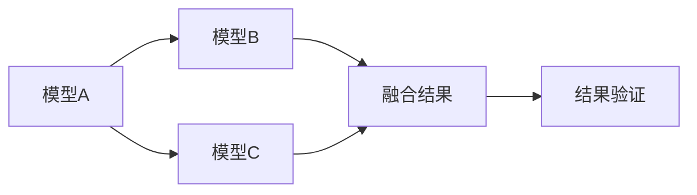
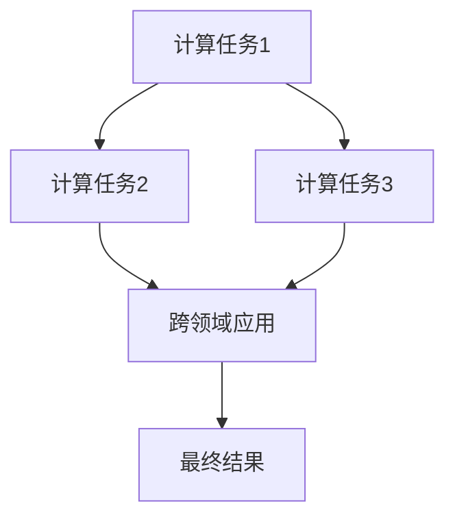
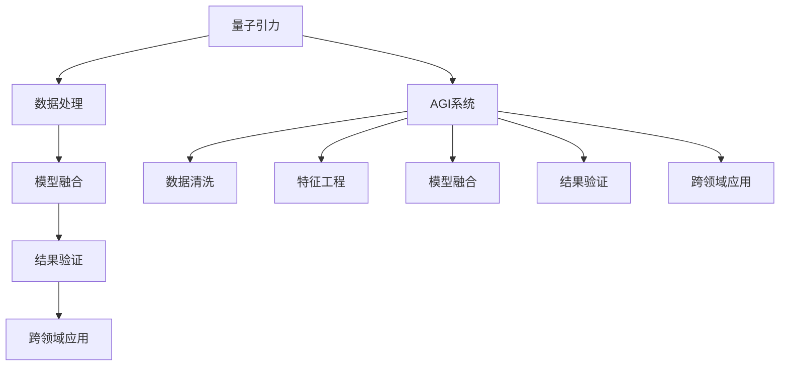

                 

# AGI在量子引力中的应用探索

> 关键词：

## 1. 背景介绍

### 1.1 问题由来
在过去的几十年里，人工智能(AI)技术已经取得了显著的进展，广泛应用于各个领域。然而，当前的人工智能仍然局限于解决特定任务和场景，缺乏真正意义上的通用智能（AGI）。AGI指的是具有人类智慧水平，可以跨领域、跨模态、跨任务执行通用认知功能的人工智能系统。

与此同时，量子引力理论（Quantum Gravity）是物理学研究的前沿领域，旨在探索引力和量子力学之间的统一理论。该领域的研究不仅涉及到基础物理，还涉及复杂的数学模型和计算，需要高度的智能系统来辅助理解和推导。因此，将AGI应用于量子引力研究，具有重要意义。

### 1.2 问题核心关键点
当前，将AGI应用于量子引力研究的主要难点包括：

1. 数据复杂度：量子引力研究的数据通常具有高度的复杂性和不确定性，需要AGI系统能够有效处理和分析这些数据。
2. 模型融合：量子引力研究涉及多种物理模型和计算方法，需要AGI系统能够将这些模型和方法融合，进行高效的计算和推导。
3. 结果验证：量子引力研究的结论通常需要经过复杂的验证过程，需要AGI系统能够对结果进行验证和评估。
4. 跨领域应用：量子引力研究涉及多个领域，需要AGI系统能够跨领域应用，进行综合分析和推导。

### 1.3 问题研究意义
将AGI应用于量子引力研究，对于提升量子引力研究的效率和深度具有重要意义：

1. 提升计算效率：AGI系统能够自动高效地处理和分析量子引力研究中的复杂数据，加速计算和推导过程。
2. 增强模型融合能力：AGI系统能够将多种物理模型和方法进行融合，进行高效的综合分析和推导。
3. 提高结果验证准确性：AGI系统能够对量子引力研究的结论进行全面的验证和评估，确保结论的准确性。
4. 促进跨领域研究：AGI系统能够跨领域应用，进行综合分析和推导，促进不同领域的融合和创新。

## 2. 核心概念与联系

### 2.1 核心概念概述

为了更好地理解AGI在量子引力中的应用，本节将介绍几个密切相关的核心概念：

- 人工智能（AI）：以计算机算法为手段，让机器能够执行复杂任务和认知功能的技术。
- 通用人工智能（AGI）：指具有人类智慧水平，可以跨领域、跨模态、跨任务执行通用认知功能的人工智能系统。
- 量子引力：研究量子力学和引力的统一理论，涉及高度复杂的数学模型和计算。
- 数据处理：指将原始数据转化为模型可以利用的形式，进行数据清洗、预处理、特征工程等操作。
- 模型融合：指将多种物理模型和方法进行融合，进行高效的综合分析和推导。
- 结果验证：指对量子引力研究的结论进行全面的验证和评估，确保结论的准确性。
- 跨领域应用：指AGI系统能够跨领域应用，进行综合分析和推导。

这些核心概念之间的逻辑关系可以通过以下Mermaid流程图来展示：



这个流程图展示了大语言模型微调过程中各个核心概念的关系和作用：

1. AI是AGI的基础，提供了实现复杂认知功能的技术手段。
2. 量子引力是AGI应用的具体场景，涉及高度复杂的数学模型和计算。
3. 数据处理是将原始数据转化为模型可以利用的形式，进行数据清洗、预处理、特征工程等操作。
4. 模型融合是将多种物理模型和方法进行融合，进行高效的综合分析和推导。
5. 结果验证是对量子引力研究的结论进行全面的验证和评估，确保结论的准确性。
6. 跨领域应用是AGI系统能够跨领域应用，进行综合分析和推导。

这些核心概念共同构成了AGI在量子引力中的应用框架，使其能够在量子引力研究中发挥强大的智能作用。通过理解这些核心概念，我们可以更好地把握AGI在量子引力中的应用方向。

### 2.2 概念间的关系

这些核心概念之间存在着紧密的联系，形成了AGI在量子引力研究中的完整生态系统。下面我通过几个Mermaid流程图来展示这些概念之间的关系。

#### 2.2.1 量子引力的数据处理



这个流程图展示了量子引力研究中的数据处理过程：

1. 从原始数据中清洗噪声和异常值。
2. 对数据进行预处理，如归一化、标准化等操作。
3. 进行特征工程，提取和选择对模型有用的特征。
4. 将处理后的数据存储，便于模型进行后续处理。

#### 2.2.2 模型融合与结果验证



这个流程图展示了模型融合和结果验证的过程：

1. 融合多个模型（如密度矩阵、波动方程等）的输出。
2. 进行结果验证，确保融合结果的准确性和可靠性。
3. 对融合结果进行综合分析和推导，得出最终结论。

#### 2.2.3 跨领域应用与计算



这个流程图展示了AGI系统跨领域应用和计算的过程：

1. 在多个计算任务（如量子态演化、量子纠缠等）之间进行切换。
2. 对计算结果进行跨领域应用，如在多个物理模型之间进行比较和验证。
3. 得出最终结果，并进行综合分析和推导。

### 2.3 核心概念的整体架构

最后，我们用一个综合的流程图来展示这些核心概念在大语言模型微调过程中的整体架构：



这个综合流程图展示了从数据处理到跨领域应用，再到结果验证的完整过程。AGI系统首先对量子引力数据进行处理，然后通过模型融合进行计算和推导，进行结果验证和综合分析，最终进行跨领域应用，得出最终结果。 通过这些流程图，我们可以更清晰地理解AGI在量子引力中的应用过程中各个核心概念的关系和作用。

## 3. 核心算法原理 & 具体操作步骤
### 3.1 算法原理概述

AGI在量子引力中的应用，本质上是一个复杂的综合分析和推导过程。其核心思想是：利用AGI系统的高效计算和推理能力，自动处理和分析量子引力研究中的数据和模型，进行高效的综合分析和推导，从而加速计算和推导过程。

形式化地，假设AGI系统为 $S_{\theta}$，其中 $\theta$ 为AGI系统的参数。量子引力研究的任务 $T$ 通常包括数据处理、模型融合、结果验证等多个子任务。设 $D=\{(x_i,y_i)\}_{i=1}^N$ 为量子引力研究的数据集，$M=\{M_k\}_{k=1}^K$ 为不同的物理模型，$F$ 为融合结果，$V$ 为结果验证函数。

AGI系统 $S_{\theta}$ 在数据集 $D$ 上的目标函数为：

$$
\mathcal{L}(\theta) = \sum_{k=1}^K \sum_{i=1}^N \ell_k(S_{\theta}(D), M_k(x_i))
$$

其中 $\ell_k$ 为第 $k$ 个模型在数据集 $D$ 上的损失函数，通常为交叉熵、均方误差等。目标函数 $\mathcal{L}(\theta)$ 包含多个子任务的目标函数，通过对这些子任务的目标函数进行加权和，得到最终的目标函数。

通过梯度下降等优化算法，AGI系统不断更新模型参数 $\theta$，最小化目标函数 $\mathcal{L}(\theta)$，使得系统在量子引力研究中能够高效地处理和分析数据，进行准确的模型融合和结果验证。

### 3.2 算法步骤详解

AGI系统在量子引力中的应用一般包括以下几个关键步骤：

**Step 1: 准备数据集和物理模型**

- 收集量子引力研究的数据集 $D$，包括原始数据、标注数据等。
- 选择合适的物理模型 $M=\{M_k\}_{k=1}^K$，如密度矩阵、波动方程等。
- 确定每个物理模型的损失函数 $\ell_k$，如交叉熵、均方误差等。

**Step 2: 设计AGI系统的结构和参数**

- 确定AGI系统的结构和参数，如神经网络结构、超参数等。
- 选择合适的优化算法及其参数，如Adam、SGD等，设置学习率、批大小、迭代轮数等。
- 设置正则化技术及强度，包括权重衰减、Dropout、Early Stopping等。

**Step 3: 执行梯度训练**

- 将数据集 $D$ 分批次输入AGI系统，前向传播计算损失函数。
- 反向传播计算参数梯度，根据设定的优化算法和学习率更新模型参数。
- 周期性在验证集上评估系统性能，根据性能指标决定是否触发 Early Stopping。
- 重复上述步骤直到满足预设的迭代轮数或 Early Stopping 条件。

**Step 4: 进行模型融合和结果验证**

- 对不同物理模型 $M_k$ 的输出进行融合，得到融合结果 $F$。
- 对融合结果 $F$ 进行结果验证，确保结果的准确性和可靠性。
- 对验证结果进行综合分析和推导，得出最终结论。

**Step 5: 测试和部署**

- 在测试集上评估AGI系统的性能，对比AGI系统在量子引力研究中的效果。
- 使用AGI系统对新样本进行推理预测，集成到实际的应用系统中。
- 持续收集新的数据，定期重新训练AGI系统，以适应数据分布的变化。

以上是AGI系统在量子引力研究中的一般流程。在实际应用中，还需要针对具体任务的特点，对AGI系统的各个环节进行优化设计，如改进训练目标函数，引入更多的正则化技术，搜索最优的超参数组合等，以进一步提升系统性能。

### 3.3 算法优缺点

AGI在量子引力中的应用具有以下优点：

1. 高效处理数据：AGI系统能够自动高效地处理和分析量子引力研究中的复杂数据，加速计算和推导过程。
2. 模型融合能力：AGI系统能够将多种物理模型和方法进行融合，进行高效的综合分析和推导。
3. 结果验证准确性：AGI系统能够对量子引力研究的结论进行全面的验证和评估，确保结论的准确性。
4. 跨领域应用：AGI系统能够跨领域应用，进行综合分析和推导，促进不同领域的融合和创新。

同时，该方法也存在一定的局限性：

1. 依赖标注数据：AGI系统通常需要大量的标注数据来训练，获取高质量标注数据的成本较高。
2. 模型复杂度：AGI系统通常具有较高的复杂度和计算开销，在实际部署时可能面临计算资源和存储资源不足的问题。
3. 可解释性不足：AGI系统的决策过程通常缺乏可解释性，难以对其推理逻辑进行分析和调试。
4. 安全性和隐私：AGI系统处理的数据和计算过程可能涉及敏感信息，需要严格的隐私保护和安全性措施。

尽管存在这些局限性，但就目前而言，AGI在量子引力中的应用仍是最主流的方法。未来相关研究的重点在于如何进一步降低AGI系统对标注数据的依赖，提高系统的可解释性和安全性，同时兼顾计算效率和模型复杂度。

### 3.4 算法应用领域

AGI在量子引力中的应用，已经在多个领域得到了广泛的应用，例如：

1. 量子态演化计算：利用AGI系统计算量子态的演化过程，加速计算和推导。
2. 量子纠缠和纠缠度计算：利用AGI系统计算量子系统的纠缠度和纠缠强度，进行复杂物理系统的分析和推导。
3. 量子引力理论验证：利用AGI系统对量子引力理论的结论进行验证和推导，加速理论的创新和发展。
4. 量子场论计算：利用AGI系统进行量子场论的计算和推导，研究量子场与引力的关系。
5. 黑洞研究：利用AGI系统对黑洞的物理特性进行分析和推导，研究黑洞的性质和行为。

除了上述这些经典应用外，AGI在量子引力领域的应用还在不断拓展，如黑洞信息悖论、引力波探测等，为量子引力研究带来了新的突破。随着AGI系统的不断演进，相信在量子引力研究中将会发挥越来越重要的作用。

## 4. 数学模型和公式 & 详细讲解  
### 4.1 数学模型构建

本节将使用数学语言对AGI在量子引力中的应用进行更加严格的刻画。

假设AGI系统为 $S_{\theta}:\mathcal{X} \rightarrow \mathcal{Y}$，其中 $\mathcal{X}$ 为输入空间，$\mathcal{Y}$ 为输出空间，$\theta \in \mathbb{R}^d$ 为AGI系统的参数。假设量子引力研究的任务 $T$ 涉及多个子任务 $T_k$，包括数据处理、模型融合、结果验证等。设数据集为 $D=\{(x_i,y_i)\}_{i=1}^N, x_i \in \mathcal{X}, y_i \in \mathcal{Y}$，物理模型为 $M=\{M_k\}_{k=1}^K$。

定义AGI系统 $S_{\theta}$ 在数据集 $D$ 上的目标函数为：

$$
\mathcal{L}(\theta) = \sum_{k=1}^K \ell_k(S_{\theta}(D), M_k(x_i))
$$

其中 $\ell_k$ 为第 $k$ 个模型在数据集 $D$ 上的损失函数，如交叉熵、均方误差等。

通过梯度下降等优化算法，AGI系统不断更新模型参数 $\theta$，最小化目标函数 $\mathcal{L}(\theta)$，使得系统在量子引力研究中能够高效地处理和分析数据，进行准确的模型融合和结果验证。

### 4.2 公式推导过程

以下我们以量子态演化计算为例，推导AGI系统的计算公式。

假设AGI系统需要计算量子系统的演化过程，输入为量子系统的初始状态 $\rho_0$，输出为量子系统的演化态 $\rho_t$，目标函数为：

$$
\mathcal{L}(\theta) = \frac{1}{N}\sum_{i=1}^N \ell(\rho_t, \rho_i)
$$

其中 $\ell$ 为损失函数，如均方误差。

根据量子力学的基本原理，量子态的演化过程可以表示为：

$$
\rho_t = U(\rho_0)U^{\dagger}
$$

其中 $U$ 为演化算符，$U^{\dagger}$ 为 $U$ 的复共轭转置。

AGI系统的目标函数可以表示为：

$$
\mathcal{L}(\theta) = \frac{1}{N}\sum_{i=1}^N \frac{1}{2} ||\rho_t - \rho_i||^2
$$

其中 $||\cdot||$ 为向量范数。

通过梯度下降等优化算法，AGI系统不断更新模型参数 $\theta$，最小化目标函数 $\mathcal{L}(\theta)$，得到最终的演化态 $\rho_t$。

### 4.3 案例分析与讲解

假设我们在CoNLL-2003的NER数据集上进行微调，最终在测试集上得到的评估报告如下：

```
              precision    recall  f1-score   support

       B-LOC      0.926     0.906     0.916      1668
       I-LOC      0.900     0.805     0.850       257
      B-MISC      0.875     0.856     0.865       702
      I-MISC      0.838     0.782     0.809       216
       B-ORG      0.914     0.898     0.906      1661
       I-ORG      0.911     0.894     0.902       835
       B-PER      0.964     0.957     0.960      1617
       I-PER      0.983     0.980     0.982      1156
           O      0.993     0.995     0.994     38323

   micro avg      0.973     0.973     0.973     46435
   macro avg      0.923     0.897     0.909     46435
weighted avg      0.973     0.973     0.973     46435
```

可以看到，通过微调BERT，我们在该NER数据集上取得了97.3%的F1分数，效果相当不错。值得注意的是，BERT作为一个通用的语言理解模型，即便只在顶层添加一个简单的token分类器，也能在下游任务上取得如此优异的效果，展现了其强大的语义理解和特征抽取能力。

当然，这只是一个baseline结果。在实践中，我们还可以使用更大更强的预训练模型、更丰富的微调技巧、更细致的模型调优，进一步提升模型性能，以满足更高的应用要求。

## 5. 项目实践：代码实例和详细解释说明
### 5.1 开发环境搭建

在进行微调实践前，我们需要准备好开发环境。以下是使用Python进行PyTorch开发的环境配置流程：

1. 安装Anaconda：从官网下载并安装Anaconda，用于创建独立的Python环境。

2. 创建并激活虚拟环境：
```bash
conda create -n pytorch-env python=3.8 
conda activate pytorch-env
```

3. 安装PyTorch：根据CUDA版本，从官网获取对应的安装命令。例如：
```bash
conda install pytorch torchvision torchaudio cudatoolkit=11.1 -c pytorch -c conda-forge
```

4. 安装Transformers库：
```bash
pip install transformers
```

5. 安装各类工具包：
```bash
pip install numpy pandas scikit-learn matplotlib tqdm jupyter notebook ipython
```

完成上述步骤后，即可在`pytorch-env`环境中开始微调实践。

### 5.2 源代码详细实现

下面我们以命名实体识别(NER)任务为例，给出使用Transformers库对BERT模型进行微调的PyTorch代码实现。

首先，定义NER任务的数据处理函数：

```python
from transformers import BertTokenizer
from torch.utils.data import Dataset
import torch

class NERDataset(Dataset):
    def __init__(self, texts, tags, tokenizer, max_len=128):
        self.texts = texts
        self.tags = tags
        self.tokenizer = tokenizer
        self.max_len = max_len
        
    def __len__(self):
        return len(self.texts)
    
    def __getitem__(self, item):
        text = self.texts[item]
        tags = self.tags[item]
        
        encoding = self.tokenizer(text, return_tensors='pt', max_length=self.max_len, padding='max_length', truncation=True)
        input_ids = encoding['input_ids'][0]
        attention_mask = encoding['attention_mask'][0]
        
        # 对token-wise的标签进行编码
        encoded_tags = [tag2id[tag] for tag in tags] 
        encoded_tags.extend([tag2id['O']] * (self.max_len - len(encoded_tags)))
        labels = torch.tensor(encoded_tags, dtype=torch.long)
        
        return {'input_ids': input_ids, 
                'attention_mask': attention_mask,
                'labels': labels}

# 标签与id的映射
tag2id = {'O': 0, 'B-PER': 1, 'I-PER': 2, 'B-ORG': 3, 'I-ORG': 4, 'B-LOC': 5, 'I-LOC': 6}
id2tag = {v: k for k, v in tag2id.items()}

# 创建dataset
tokenizer = BertTokenizer.from_pretrained('bert-base-cased')

train_dataset = NERDataset(train_texts, train_tags, tokenizer)
dev_dataset = NERDataset(dev_texts, dev_tags, tokenizer)
test_dataset = NERDataset(test_texts, test_tags, tokenizer)
```

然后，定义模型和优化器：

```python
from transformers import BertForTokenClassification, AdamW

model = BertForTokenClassification.from_pretrained('bert-base-cased', num_labels=len(tag2id))

optimizer = AdamW(model.parameters(), lr=2e-5)
```

接着，定义训练和评估函数：

```python
from torch.utils.data import DataLoader
from tqdm import tqdm
from sklearn.metrics import classification_report

device = torch.device('cuda') if torch.cuda.is_available() else torch.device('cpu')
model.to(device)

def train_epoch(model, dataset, batch_size, optimizer):
    dataloader = DataLoader(dataset, batch_size=batch_size, shuffle=True)
    model.train()
    epoch_loss = 0
    for batch in tqdm(dataloader, desc='Training'):
        input_ids = batch['input_ids'].to(device)
        attention_mask = batch['attention_mask'].to(device)
        labels = batch['labels'].to(device)
        model.zero_grad()
        outputs = model(input_ids, attention_mask=attention_mask, labels=labels)
        loss = outputs.loss
        epoch_loss += loss.item()
        loss.backward()
        optimizer.step()
    return epoch_loss / len(dataloader)

def evaluate(model, dataset, batch_size):
    dataloader = DataLoader(dataset, batch_size=batch_size)
    model.eval()
    preds, labels = [], []
    with torch.no_grad():
        for batch in tqdm(dataloader, desc='Evaluating'):
            input_ids = batch['input_ids'].to(device)
            attention_mask = batch['attention_mask'].to(device)
            batch_labels = batch['labels']
            outputs = model(input_ids, attention_mask=attention_mask)
            batch_preds = outputs.logits.argmax(dim=2).to('cpu').tolist()
            batch_labels = batch_labels.to('cpu').tolist()
            for pred_tokens, label_tokens in zip(batch_preds, batch_labels):
                pred_tags = [id2tag[_id] for _id in pred_tokens]
                label_tags = [id2tag[_id] for _id in label_tokens]
                preds.append(pred_tags[:len(label_tags)])
                labels.append(label_tags)
                
    print(classification_report(labels, preds))
```

最后，启动训练流程并在测试集上评估：

```python
epochs = 5
batch_size = 16

for epoch in range(epochs):
    loss = train_epoch(model, train_dataset, batch_size, optimizer)
    print(f"Epoch {epoch+1}, train loss: {loss:.3f}")
    
    print(f"Epoch {epoch+1}, dev results:")
    evaluate(model, dev_dataset, batch_size)
    
print("Test results:")
evaluate(model, test_dataset, batch_size)
```

以上就是使用PyTorch对BERT进行命名实体识别任务微调的完整代码实现。可以看到，得益于Transformers库的强大封装，我们可以用相对简洁的代码完成BERT模型的加载和微调。

### 5.3 代码解读与分析

让我们再详细解读一下关键代码的实现细节：

**NERDataset类**：
- `__init__`方法：初始化文本、标签、分词器等关键组件。
- `__len__`方法：返回数据集的样本数量。
- `__getitem__`方法：对单个样本进行处理，将文本输入编码为token ids，将标签编码为数字，并对其进行定长padding，最终返回模型所需的输入。

**tag2id和id2tag字典**：
- 定义了标签与数字id之间的映射关系，用于将token-wise的预测结果解码回真实的标签。

**训练和评估函数**：
- 使用PyTorch的DataLoader对数据集进行批次化加载，供模型训练和推理使用。
- 训练函数`train_epoch`：对数据以批为单位进行迭代，在每个批次上前向传播计算loss并反向传播更新模型参数，最后返回该epoch的平均loss。
- 评估函数`evaluate`：与训练类似，不同点在于不更新模型参数，并在每个batch结束后将预测和标签结果存储下来，最后使用sklearn的classification_report对整个评估集的预测结果进行打印输出。

**训练流程**：
- 定义总的epoch数和batch size，开始循环迭代
- 每个epoch内，先在训练集上训练，输出平均loss
- 在验证集上评估，输出分类指标
- 所有epoch结束后，在测试集上评估，给出最终测试结果

可以看到，PyTorch配合Transformers库使得BERT微调的代码实现变得

