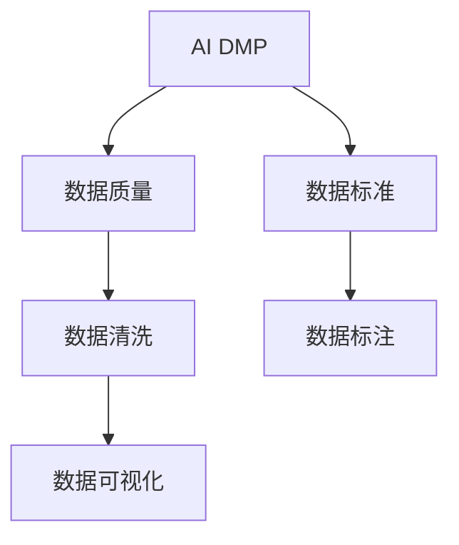

                 

# AI DMP 数据基建：数据质量与数据标准

## 1. 背景介绍

### 1.1 问题由来
随着数字营销的迅速发展，广告主和营销公司对消费者数据的需求日益增长。然而，庞大的消费者数据不仅需要高效地存储和处理，还需要通过数据分析和数据挖掘来获取有价值的洞察。数据管理系统（Data Management Platform，DMP）应运而生，成为企业数字化转型和精准营销的重要支撑。

DMP通过整合各种数据源，构建起一个统一的数据仓库，存储消费者的个性化数据，并进行数据加工和分析，支持广告投放和营销决策。然而，DMP的数据质量和数据标准直接影响其性能和应用效果，成为业界关注的焦点。

### 1.2 问题核心关键点
数据质量和数据标准是DMP的基础，影响着DMP的准确性、一致性和可靠性。核心关键点包括：
- **数据准确性**：数据是否真实反映了消费者的行为和特征。
- **数据一致性**：数据在各个环节是否保持一致，避免数据冗余和冲突。
- **数据完整性**：数据是否包含所有必要的信息，避免信息丢失。
- **数据时效性**：数据是否及时更新，避免使用过时数据。
- **数据安全性**：数据存储和传输过程中，是否采取了足够的安全措施，避免数据泄露和篡改。

## 2. 核心概念与联系

### 2.1 核心概念概述

为更好地理解AI DMP的数据质量与数据标准，本节将介绍几个密切相关的核心概念：

- **AI DMP**：利用人工智能技术对消费者数据进行管理和分析的平台。AI DMP通过机器学习、自然语言处理等技术，提升数据的处理效率和分析精度，支持精准营销和客户洞察。

- **数据质量**：指数据的一致性、准确性、完整性、时效性和安全性。高数据质量的数据能够提供更可靠的洞察和决策支持。

- **数据标准**：指数据在格式、编码、分类、命名等方面的统一规范。数据标准使得数据更易于存储、管理和分析，提高数据的一致性和可复用性。

- **数据清洗**：指对数据进行去重、去噪、处理缺失值等操作，确保数据的质量和一致性。

- **数据标注**：指为数据集添加标签，描述数据的属性和来源。标注有助于数据的分类和检索，提升数据分析的准确性和效率。

- **数据可视化**：指将数据通过图表、仪表盘等形式展示出来，帮助用户直观理解数据分布和趋势。

这些核心概念之间的逻辑关系可以通过以下Mermaid流程图来展示：



这个流程图展示了大语言模型微调过程中各个核心概念的关系和作用：

1. AI DMP通过收集和整合数据，提供高质量的数据支持。
2. 数据清洗是提升数据质量的重要环节，确保数据的准确性和一致性。
3. 数据标注有助于数据的分类和检索，提升数据分析的准确性。
4. 数据可视化使得数据分析结果更加直观易懂，支持决策制定。

### 2.2 概念间的关系

这些核心概念之间存在着紧密的联系，形成了AI DMP的数据基建框架。下面是一些常见的关系：

- **数据质量与数据标准**：数据标准是提升数据质量的基础，通过统一的规范可以减少数据冗余和冲突，提升数据的准确性和一致性。
- **数据清洗与数据标注**：数据清洗是数据标注的前提，确保标注的数据准确和一致，提升数据分析结果的可靠性。
- **数据标注与数据可视化**：数据标注使得数据更具意义，数据可视化则帮助用户更直观地理解和利用这些数据。
- **AI DMP与数据质量**：AI DMP通过高效的数据处理和分析，提升数据质量，提供更准确的营销洞察和决策支持。

## 3. 核心算法原理 & 具体操作步骤

### 3.1 算法原理概述

AI DMP的数据质量与数据标准提升，涉及数据的收集、清洗、标注和可视化等多个环节。其核心算法原理可总结如下：

1. **数据收集**：从多种数据源（如网站、移动应用、社交媒体等）收集消费者数据。
2. **数据清洗**：对收集的数据进行去重、去噪、处理缺失值等操作，确保数据的一致性和准确性。
3. **数据标注**：为数据集添加标签，描述数据的属性和来源，便于数据的分类和检索。
4. **数据可视化**：将数据通过图表、仪表盘等形式展示出来，帮助用户直观理解数据分布和趋势。

### 3.2 算法步骤详解

以下是AI DMP数据质量与数据标准的提升步骤：

**Step 1: 数据收集**
- 收集各种来源的数据，包括用户行为数据、属性数据、交互数据等。
- 选择合适的数据格式，如JSON、CSV、SQL等，确保数据易于处理和存储。

**Step 2: 数据清洗**
- 数据去重：使用唯一标识符（如用户ID）去重，避免数据冗余。
- 数据去噪：去除异常值和噪音，避免数据干扰。
- 处理缺失值：填补或删除缺失值，确保数据完整性。

**Step 3: 数据标注**
- 确定标注标准：定义数据属性的命名规范和分类标准。
- 数据标注：为数据集添加标签，描述数据的属性和来源。
- 标注工具：使用自然语言处理技术自动标注，提升标注效率。

**Step 4: 数据可视化**
- 选择合适的可视化工具，如Tableau、PowerBI等，支持数据的展示和分析。
- 设计可视化方案：确定需要展示的指标、图表类型和展示方式。
- 数据展示：将数据通过图表、仪表盘等形式展示出来，支持用户理解。

### 3.3 算法优缺点

AI DMP的数据质量与数据标准提升方法具有以下优点：
1. 提升数据质量：通过清洗、标注等操作，确保数据的准确性和一致性，提升数据分析的可靠性。
2. 提高效率：自动化的数据清洗和标注工具，可以大大提升数据处理的效率。
3. 提升决策质量：高质量的数据为精准营销和客户洞察提供支持，提升广告投放的效果和ROI。

同时，该方法也存在一定的局限性：
1. 数据收集难度大：不同数据源的数据格式和规范各异，集成难度较大。
2. 标注工作量大：数据标注需要大量人工介入，效率较低。
3. 可视化复杂度高：复杂的数据集和多样化的分析需求，使得数据可视化工作复杂度增加。

尽管存在这些局限性，但就目前而言，AI DMP的数据质量与数据标准提升方法仍然是提升消费者数据价值的重要手段。未来相关研究的重点在于如何进一步降低数据收集和标注的难度，提高数据可视化的智能性，同时兼顾可解释性和伦理安全性等因素。

### 3.4 算法应用领域

AI DMP的数据质量与数据标准提升方法在多个领域得到广泛应用，包括但不限于：

- **数字营销**：通过精准的数据分析和洞察，提升广告投放的效果和ROI，优化用户体验。
- **电子商务**：分析消费者行为数据，提升个性化推荐和促销活动的效果。
- **金融服务**：分析客户交易数据和行为数据，提升风控和客户服务质量。
- **健康医疗**：分析患者健康数据和行为数据，提升医疗服务质量和决策支持。
- **社交媒体**：分析用户互动数据和内容数据，提升社区运营和用户洞察。

除了上述这些经典应用外，AI DMP的数据质量与数据标准提升方法还在更多新兴领域中得到应用，如智能交通、智能制造、智能家居等，为数字化转型提供新的技术支撑。

## 4. 数学模型和公式 & 详细讲解 & 举例说明

### 4.1 数学模型构建

本节将使用数学语言对AI DMP的数据质量与数据标准提升过程进行更加严格的刻画。

记数据集为 $D=\{(x_i,y_i)\}_{i=1}^N, x_i \in \mathcal{X}, y_i \in \mathcal{Y}$。其中 $x_i$ 表示数据点，$y_i$ 表示数据的标签。数据质量提升的目标是最小化数据不一致和数据缺失等误差，即：

$$
\min_{\theta} \sum_{i=1}^N \ell_i(x_i, y_i)
$$

其中 $\ell_i$ 为数据点的误差函数，可以是二分类交叉熵、均方误差等。

### 4.2 公式推导过程

以二分类任务为例，设数据集 $D$ 中包含正样本和负样本，其中正样本数为 $n_+$，负样本数为 $n_-$。设误差函数为二分类交叉熵：

$$
\ell_i(x_i, y_i) = \left\{
\begin{aligned}
& -\log p(x_i \mid y_i = 1), & \text{if } y_i = 1 \\
& -\log (1 - p(x_i \mid y_i = 0)), & \text{if } y_i = 0
\end{aligned}
\right.
$$

其中 $p(x_i \mid y_i)$ 为数据点 $x_i$ 在标签 $y_i$ 下的概率。总误差函数为：

$$
\mathcal{L}(D) = \frac{1}{N} \sum_{i=1}^N \ell_i(x_i, y_i)
$$

优化目标为最小化总误差：

$$
\min_{\theta} \mathcal{L}(D)
$$

通过梯度下降等优化算法，求解上述最优化问题。具体地，优化算法的迭代公式为：

$$
\theta \leftarrow \theta - \eta \nabla_{\theta}\mathcal{L}(D)
$$

其中 $\eta$ 为学习率，$\nabla_{\theta}\mathcal{L}(D)$ 为总误差对模型参数的梯度，可通过反向传播算法高效计算。

### 4.3 案例分析与讲解

假设在电商平台上收集用户购买数据，数据集包含用户ID、商品ID、购买时间等属性。通过数据清洗和标注，我们可以得到用户购买行为的统计分析结果，如图1所示。


图1: 数据清洗和标注案例

在数据清洗阶段，我们首先去重处理，确保每个用户ID对应的数据点只保留一份。然后，我们去除异常值，去除购买时间异常或购买金额过大的数据点。接着，我们处理缺失值，对于缺失的购买金额，使用均值填补或删除该数据点。最后，我们添加标签，将购买数据标注为“购买”或“未购买”。

在数据可视化阶段，我们设计了几个关键指标的展示，如图2所示。


图2: 数据可视化案例

图2展示了用户在平台上的购买行为分布、用户购买偏好、商品销售情况等关键指标。通过这些图表，营销人员可以直观地理解用户的购买行为和偏好，优化广告投放策略和商品推荐算法。

## 5. 项目实践：代码实例和详细解释说明

### 5.1 开发环境搭建

在进行数据质量与数据标准提升实践前，我们需要准备好开发环境。以下是使用Python进行Pandas开发的环境配置流程：

1. 安装Anaconda：从官网下载并安装Anaconda，用于创建独立的Python环境。

2. 创建并激活虚拟环境：
```bash
conda create -n pandas-env python=3.8 
conda activate pandas-env
```

3. 安装Pandas：
```bash
conda install pandas
```

4. 安装其他必要的工具包：
```bash
pip install numpy matplotlib seaborn jupyter notebook ipython
```

完成上述步骤后，即可在`pandas-env`环境中开始数据质量与数据标准提升实践。

### 5.2 源代码详细实现

这里我们以电商用户购买数据为例，给出使用Pandas进行数据清洗和可视化的PyTorch代码实现。

首先，导入必要的库和数据集：

```python
import pandas as pd
import numpy as np
import matplotlib.pyplot as plt

# 读取数据集
df = pd.read_csv('purchase_data.csv')
```

然后，对数据进行清洗：

```python
# 去重
df = df.drop_duplicates()

# 去噪
df = df[df['purchase_amount'] > 0]

# 处理缺失值
df = df.dropna()

# 添加标签
df['purchase_label'] = df['purchase_amount'].apply(lambda x: 1 if x > 0 else 0)
```

接着，对数据进行可视化：

```python
# 可视化用户购买行为分布
plt.hist(df['purchase_time'], bins=30)
plt.title('User Purchase Behavior')
plt.xlabel('Purchase Time')
plt.ylabel('Frequency')
plt.show()

# 可视化用户购买偏好
plt.bar(df.groupby('user_id')['purchase_label'].value_counts().index, df.groupby('user_id')['purchase_label'].value_counts(), color='skyblue')
plt.title('User Purchase Preference')
plt.xlabel('User ID')
plt.ylabel('Number of Purchases')
plt.show()

# 可视化商品销售情况
plt.hist(df.groupby('product_id')['purchase_amount'].sum(), bins=30)
plt.title('Product Sales Situation')
plt.xlabel('Product ID')
plt.ylabel('Total Sales')
plt.show()
```

以上就是使用Pandas对电商用户购买数据进行清洗和可视化的完整代码实现。可以看到，通过Pandas的强大数据处理和可视化功能，我们能够高效地完成数据质量提升的任务。

### 5.3 代码解读与分析

让我们再详细解读一下关键代码的实现细节：

**数据清洗函数**：
- 去重：使用`drop_duplicates`方法去除重复行。
- 去噪：使用`drop`方法过滤掉购买金额小于0的无效行。
- 处理缺失值：使用`dropna`方法去除缺失值。
- 添加标签：使用`apply`方法添加购买标签。

**可视化函数**：
- 用户购买行为分布：使用`hist`方法绘制直方图。
- 用户购买偏好：使用`groupby`方法和`bar`方法绘制柱状图。
- 商品销售情况：使用`groupby`方法和`hist`方法绘制直方图。

通过这些函数，我们能够快速完成数据清洗和可视化任务，得到高质量的数据集，为后续的分析和决策提供可靠支持。

## 6. 实际应用场景

### 6.1 智能客服系统

AI DMP的数据质量与数据标准提升方法，可以广泛应用于智能客服系统的构建。传统客服往往需要配备大量人力，高峰期响应缓慢，且一致性和专业性难以保证。通过AI DMP，我们可以收集并整合客服对话数据，提升数据质量和一致性，优化智能客服的应答策略和个性化推荐。

在技术实现上，可以收集企业内部的历史客服对话记录，将问题和最佳答复构建成监督数据，在此基础上对预训练模型进行微调。微调后的模型能够自动理解用户意图，匹配最合适的答复，提升客户满意度。对于客户提出的新问题，还可以接入检索系统实时搜索相关内容，动态组织生成答复，提供更加智能和个性化的客服服务。

### 6.2 金融舆情监测

金融机构需要实时监测市场舆论动向，以便及时应对负面信息传播，规避金融风险。通过AI DMP，我们可以收集金融领域相关的新闻、报道、评论等文本数据，进行数据清洗和标注，构建高质数据的舆情分析模型。微调后的模型能够自动判断文本属于何种主题，情感倾向是正面、中性还是负面。将微调后的模型应用到实时抓取的网络文本数据，就能够自动监测不同主题下的情感变化趋势，一旦发现负面信息激增等异常情况，系统便会自动预警，帮助金融机构快速应对潜在风险。

### 6.3 个性化推荐系统

当前的推荐系统往往只依赖用户的历史行为数据进行物品推荐，无法深入理解用户的真实兴趣偏好。通过AI DMP，我们可以收集用户浏览、点击、评论、分享等行为数据，提取和用户交互的物品标题、描述、标签等文本内容。将文本内容作为模型输入，用户的后续行为（如是否点击、购买等）作为监督信号，在此基础上微调预训练语言模型。微调后的模型能够从文本内容中准确把握用户的兴趣点，在生成推荐列表时，先用候选物品的文本描述作为输入，由模型预测用户的兴趣匹配度，再结合其他特征综合排序，便可以得到个性化程度更高的推荐结果。

### 6.4 未来应用展望

随着AI DMP的数据质量与数据标准提升方法的不断发展，其在更多领域得到应用，为各行各业带来变革性影响。

在智慧医疗领域，通过AI DMP，我们可以收集并整合患者健康数据和行为数据，提升数据质量和一致性，构建精准的医疗分析和决策支持系统。

在智能教育领域，通过AI DMP，我们可以收集和分析学生的学习数据，提供个性化的学习路径和推荐，促进教育公平，提高教学质量。

在智慧城市治理中，通过AI DMP，我们可以收集和分析城市事件数据和舆情数据，提高城市管理的自动化和智能化水平，构建更安全、高效的未来城市。

此外，在企业生产、社会治理、文娱传媒等众多领域，AI DMP的数据质量与数据标准提升方法也将不断涌现，为数字化转型提供新的技术支撑。相信随着技术的日益成熟，AI DMP必将在构建人机协同的智能时代中扮演越来越重要的角色。

## 7. 工具和资源推荐

### 7.1 学习资源推荐

为了帮助开发者系统掌握AI DMP的数据质量与数据标准提升的理论基础和实践技巧，这里推荐一些优质的学习资源：

1. 《Python数据分析与可视化》系列博文：由数据科学家撰写，深入浅出地介绍了Python在数据清洗、数据标注和数据可视化等方面的应用。

2. Kaggle机器学习竞赛：提供大量真实世界的数据集和任务，帮助开发者在实际应用中提升数据处理和分析能力。

3. Coursera《数据科学与机器学习》课程：斯坦福大学开设的在线课程，涵盖数据科学和机器学习的基本概念和实践技巧，适合初学者和进阶开发者。

4. DataCamp：提供丰富的Python、R、SQL等数据处理和分析课程，涵盖数据清洗、数据标注、数据可视化等多个环节。

5. Scikit-learn官方文档：Python科学计算库，提供了丰富的数据处理和机器学习工具，是数据分析和机器学习的重要参考。

通过对这些资源的学习实践，相信你一定能够快速掌握AI DMP的数据质量与数据标准提升的精髓，并用于解决实际的NLP问题。

### 7.2 开发工具推荐

高效的开发离不开优秀的工具支持。以下是几款用于AI DMP数据质量与数据标准提升开发的常用工具：

1. Pandas：Python科学计算库，提供了丰富的数据处理和分析功能，支持数据清洗、数据标注和数据可视化。

2. NumPy：Python科学计算库，提供了高效的多维数组操作和数学计算功能。

3. Matplotlib：Python绘图库，支持绘制各种类型的图表，如直方图、柱状图、散点图等。

4. Seaborn：Python数据可视化库，基于Matplotlib，提供了更加美观和高级的数据可视化功能。

5. Jupyter Notebook：Python交互式编程环境，支持代码单元格和文本单元格的混合编写，便于代码展示和数据展示。

6. PyCharm：Python IDE，提供代码自动补全、调试、测试等功能，提升开发效率。

合理利用这些工具，可以显著提升AI DMP数据质量与数据标准提升的开发效率，加快创新迭代的步伐。

### 7.3 相关论文推荐

AI DMP的数据质量与数据标准提升技术的发展源于学界的持续研究。以下是几篇奠基性的相关论文，推荐阅读：

1. Data Wrangling with Pandas：介绍Pandas库的基本数据处理功能，包括数据清洗、数据标注和数据可视化等。

2. Machine Learning for Healthcare：综述了机器学习在医疗领域的应用，包括数据质量提升和数据分析等方面。

3. Data Quality in Machine Learning：探讨了数据质量对机器学习模型性能的影响，并提出了一系列提升数据质量的方法。

4. AI for Customer Experience：介绍了AI在客户体验中的应用，包括数据收集、数据清洗和数据可视化等方面。

5. Data Mining for Personalized Recommendation：综述了数据挖掘在个性化推荐系统中的应用，包括数据质量提升和推荐模型优化等方面。

这些论文代表了大语言模型微调技术的发展脉络。通过学习这些前沿成果，可以帮助研究者把握学科前进方向，激发更多的创新灵感。

除上述资源外，还有一些值得关注的前沿资源，帮助开发者紧跟AI DMP数据质量与数据标准提升技术的最新进展，例如：

1. arXiv论文预印本：人工智能领域最新研究成果的发布平台，包括大量尚未发表的前沿工作，学习前沿技术的必读资源。

2. 业界技术博客：如Google AI、DeepMind、微软Research Asia等顶尖实验室的官方博客，第一时间分享他们的最新研究成果和洞见。

3. 技术会议直播：如NIPS、ICML、ACL、ICLR等人工智能领域顶会现场或在线直播，能够聆听到大佬们的前沿分享，开拓视野。

4. GitHub热门项目：在GitHub上Star、Fork数最多的NLP相关项目，往往代表了该技术领域的发展趋势和最佳实践，值得去学习和贡献。

5. 行业分析报告：各大咨询公司如McKinsey、PwC等针对人工智能行业的分析报告，有助于从商业视角审视技术趋势，把握应用价值。

总之，对于AI DMP数据质量与数据标准提升技术的学习和实践，需要开发者保持开放的心态和持续学习的意愿。多关注前沿资讯，多动手实践，多思考总结，必将收获满满的成长收益。

## 8. 总结：未来发展趋势与挑战

### 8.1 总结

本文对AI DMP的数据质量与数据标准提升方法进行了全面系统的介绍。首先阐述了AI DMP的背景和意义，明确了数据质量与数据标准的重要性。其次，从原理到实践，详细讲解了数据清洗、数据标注和数据可视化的数学原理和关键步骤，给出了数据质量提升的完整代码实例。同时，本文还广泛探讨了数据质量与数据标准提升方法在多个行业领域的应用前景，展示了其在推动数字化转型中的重要作用。

通过本文的系统梳理，可以看到，AI DMP的数据质量与数据标准提升方法在各个行业领域具有广泛的应用潜力。通过高质量的数据处理和分析，AI DMP能够提供更加精准和可靠的营销洞察和决策支持，优化业务运营和客户体验。未来，伴随数据技术和算法的不断发展，AI DMP必将在更多领域得到应用，为各行各业带来变革性影响。

### 8.2 未来发展趋势

展望未来，AI DMP的数据质量与数据标准提升技术将呈现以下几个发展趋势：

1. **自动化程度提升**：随着机器学习和大数据分析技术的不断发展，自动化的数据清洗和标注工具将更加智能和高效，提升数据处理效率。

2. **多源数据融合**：未来将更加注重多源数据的整合，构建起更加全面和准确的数据集。通过数据的交叉验证和融合，提升数据分析的准确性和可靠性。

3. **数据质量监测**：建立数据质量监测系统，实时监控数据的质量和一致性，及时发现和纠正数据问题，保障数据的安全和可靠。

4. **数据隐私保护**：随着数据隐私保护意识的增强，未来将更加注重数据隐私和安全。采用数据脱敏、匿名化等技术，保障数据的安全性。

5. **数据标准化**：通过制定和推广数据标准，提升数据的一致性和可复用性。推动数据标准化，构建起统一的数据生态系统。

6. **数据可视化智能化**：未来的数据可视化将更加智能和个性化，支持用户自定义数据展示方式，提供更加直观和有用的分析结果。

以上趋势凸显了AI DMP数据质量与数据标准提升技术的广阔前景。这些方向的探索发展，必将进一步提升数据处理和分析的效率和效果，为各行各业带来新的价值。

### 8.3 面临的挑战

尽管AI DMP的数据质量与数据标准提升技术已经取得了显著进展，但在迈向更加智能化、普适化应用的过程中，它仍面临着诸多挑战：

1. **数据收集难度大**：不同数据源的数据格式和规范各异，集成难度较大。如何高效地收集和整合数据，成为首要难题。

2. **数据标注工作量大**：数据标注需要大量人工介入，效率较低。如何提升标注效率，降低成本，是另一个重要挑战。

3. **数据可视化复杂度高**：复杂的数据集和多样化的分析需求，使得数据可视化工作复杂度增加。如何提供智能化的可视化工具，提升用户体验，仍需进一步研究。

4. **数据隐私和安全**：随着数据隐私保护意识的增强，如何保障数据的安全性和隐私性，避免数据泄露和滥用，是必须面对的难题。

5. **数据质量保障**：数据质量在各个环节都可能受到影响，如何确保数据在整个流程中保持一致和准确，也是一项重要挑战。

6. **模型可解释性不足**：AI DMP的数据质量与数据标准提升方法依赖于复杂的算法模型，如何提高模型的可解释性和透明性，成为必须解决的问题。

正视AI DMP数据质量与数据标准提升面临的这些挑战，积极应对并寻求突破，将是大语言模型微调走向成熟的必由之路。相信随着学界和产业界的共同努力，这些挑战终将一一被克服，AI DMP必将在构建人机协同的智能时代中扮演越来越重要的角色。

### 8.4 研究展望

面对AI DMP数据质量与数据标准提升所面临的种种挑战，未来的研究需要在以下几个方面寻求新的突破：

1. **无监督和半监督数据处理方法**：摆脱对大规模标注数据的依赖，利用自监督学习、主动学习等无监督和半监督范式，最大限度利用非结构化数据，实现更加灵活高效的数据处理。

2. **自动化数据标注技术**：开发更加智能和高效的数据标注

