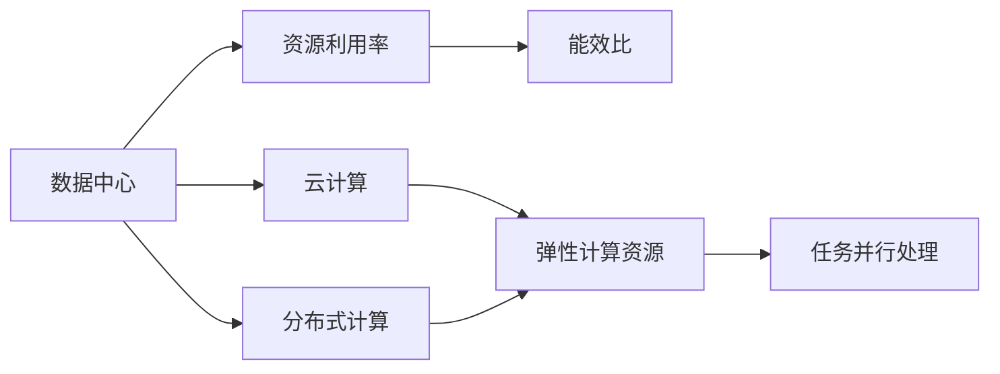

                 

# AI 大模型应用数据中心建设：数据中心成本优化

> 关键词：大模型应用,数据中心,成本优化,资源利用率,能效比,人工智能,云计算

## 1. 背景介绍

### 1.1 问题由来
随着人工智能(AI)技术的快速发展，大模型（如GPT、BERT等）在自然语言处理（NLP）、计算机视觉、推荐系统等领域取得了显著的进展。然而，大模型的高性能需要海量数据和计算资源的支撑，对于企业来说，建立和维护高效的数据中心（Data Center）成为一个重要的成本挑战。数据中心的建设和运维成本直接决定了大模型应用的实际价值，优化数据中心成本成为当下AI应用领域的一个热门话题。

### 1.2 问题核心关键点
数据中心的成本主要来源于以下几个方面：硬件设备的购置和维护、电力消耗、人力资源成本以及网络设施投资。对于AI大模型的应用，数据中心在硬件选择、软件优化、资源利用率、能效比等方面都存在巨大优化空间。

**硬件设备：** 包括CPU、GPU、内存、存储等，硬件的选择和维护成本是大模型应用数据中心的重要组成部分。

**电力消耗：** 数据中心在运行时会产生大量热量，因此需要强大的冷却系统，同时还要消耗大量的电力资源。

**人力资源成本：** 数据中心建设、维护和运营需要大量专业技术人员，其成本也是不可忽视的。

**网络设施投资：** 数据中心需要高速、稳定、安全的网络设施，以确保数据中心内部和外部的数据通信，这部分投资也是成本构成的一部分。

### 1.3 问题研究意义
优化数据中心成本对于AI大模型应用的可持续发展具有重要意义。

1. **降低运营成本：** 通过合理的硬件配置和优化，可以显著降低数据中心的建设和运营成本。
2. **提高资源利用率：** 高效的资源利用率可以降低硬件设备的闲置率，减少电力和人力资源的浪费。
3. **提升能效比：** 优化数据中心的能效比可以降低电力消耗，从而降低整体运营成本。
4. **加速模型训练和推理：** 高效率的数据中心能够加速大模型的训练和推理过程，提升模型应用效果。
5. **增强数据中心弹性：** 能够根据需求灵活调整计算资源，以应对不同的业务负载，提高数据中心灵活性。

## 2. 核心概念与联系

### 2.1 核心概念概述

为了更好地理解AI大模型应用的数据中心成本优化方法，本节将介绍几个关键概念：

- **数据中心（Data Center）：** 用于存储、计算和通信的大型设施，是AI大模型应用的核心基础。
- **资源利用率（Resource Utilization）：** 指数据中心中硬件资源的实际使用效率，通常以CPU、GPU、内存等资源的使用百分比来衡量。
- **能效比（Power Efficiency）：** 指数据中心在单位时间内完成的工作量与消耗的电能之比，衡量数据中心的能源利用效率。
- **云计算（Cloud Computing）：** 通过互联网提供可扩展的计算资源，能够灵活调整计算资源以满足业务需求。
- **分布式计算（Distributed Computing）：** 将计算任务分配到多个计算节点并行处理，以提高计算效率。

这些概念之间的逻辑关系可以通过以下Mermaid流程图来展示：



这个流程图展示了大模型应用数据中心的核心概念及其之间的关系：

1. 数据中心是资源利用和能效比计算的基础。
2. 云计算和分布式计算提供弹性计算资源，提高了任务并行处理能力。
3. 云计算与分布式计算相结合，能够更好地应对业务负载的波动，提升资源利用率。

### 2.2 概念间的关系

这些核心概念之间存在着紧密的联系，形成了AI大模型应用数据中心成本优化的完整生态系统。

- **数据中心**：是大模型应用的基础设施，资源利用率和能效比的高低直接影响成本。
- **资源利用率**：直接决定硬件设备的投资回报率，低利用率导致硬件资源浪费。
- **能效比**：反映了电力消耗与计算能力的匹配程度，影响数据中心的长期运营成本。
- **云计算**：提供按需的弹性计算资源，可以动态调整资源以满足业务需求，降低固定成本。
- **分布式计算**：通过任务并行处理，提高计算效率，提升资源利用率。

通过理解这些核心概念，我们可以更好地把握AI大模型应用数据中心成本优化的方向。

## 3. 核心算法原理 & 具体操作步骤
### 3.1 算法原理概述

AI大模型应用数据中心成本优化的核心思想是通过提高资源利用率和能效比，来降低数据中心的建设和运营成本。其核心算法原理如下：

1. **资源需求预测与优化：** 通过历史数据和机器学习模型，预测未来数据中心的使用需求，合理配置资源，避免资源过剩或不足。
2. **分布式计算与任务调度：** 利用分布式计算技术，将计算任务分配到多个计算节点并行处理，提高计算效率。
3. **能效比优化：** 通过调整硬件配置、优化算法流程等方式，提升数据中心的能效比，降低电力消耗。
4. **云资源管理：** 采用云计算技术，动态调整计算资源，以满足业务需求的波动，提高资源利用率。
5. **智能调度与负载均衡：** 利用智能调度算法，均衡计算负载，避免某些节点的过度负载，提高整体资源利用率。

### 3.2 算法步骤详解

1. **数据收集与预处理：**
   - 收集数据中心的硬件配置、能耗数据、负载情况等历史数据。
   - 对数据进行清洗和预处理，确保数据的质量和一致性。

2. **资源需求预测：**
   - 利用机器学习算法（如时间序列分析、回归分析）对未来资源需求进行预测。
   - 根据预测结果，合理配置资源，避免资源过剩或不足。

3. **硬件配置优化：**
   - 根据预测结果和业务需求，选择合适的硬件设备，并进行配置优化。
   - 采用高效的硬件配置方案，如多核CPU、高性能GPU等，提升计算能力。

4. **分布式计算与任务调度：**
   - 利用分布式计算框架（如Spark、Hadoop）将计算任务分配到多个计算节点并行处理。
   - 采用智能调度算法，均衡计算负载，避免某些节点的过度负载。

5. **能效比优化：**
   - 通过调整硬件配置、优化算法流程等方式，提升数据中心的能效比。
   - 采用先进的制冷技术，减少冷却系统的能耗。

6. **云资源管理：**
   - 利用云计算平台（如AWS、Azure）提供弹性计算资源，动态调整资源以满足业务需求。
   - 采用容器化技术（如Docker、Kubernetes）管理计算资源，提高资源利用率。

7. **智能调度与负载均衡：**
   - 利用智能调度算法，均衡计算负载，避免某些节点的过度负载。
   - 采用负载均衡技术，确保数据中心内部和外部的数据通信稳定。

8. **监控与优化：**
   - 实时监控数据中心的运行状态，收集性能指标和能耗数据。
   - 根据监控结果，及时调整资源配置，优化数据中心性能。

### 3.3 算法优缺点

AI大模型应用数据中心成本优化方法具有以下优点：
1. **降低运营成本：** 通过合理的资源配置和能效比优化，可以显著降低数据中心的建设和运营成本。
2. **提高资源利用率：** 优化资源利用率，降低硬件设备的闲置率，减少电力和人力资源的浪费。
3. **提升能效比：** 优化能效比，降低电力消耗，从而降低整体运营成本。
4. **加速模型训练和推理：** 高效率的数据中心能够加速大模型的训练和推理过程，提升模型应用效果。
5. **增强数据中心弹性：** 能够根据需求灵活调整计算资源，以应对不同的业务负载，提高数据中心灵活性。

同时，该方法也存在以下局限性：
1. **数据收集与预处理成本高：** 需要收集大量的历史数据，并对数据进行清洗和预处理，工作量较大。
2. **算法复杂度较高：** 需要应用复杂的机器学习算法和智能调度算法，对技术要求较高。
3. **硬件设备投资大：** 需要购买高性能的硬件设备，如高性能GPU、多核CPU等，初期投资较大。
4. **云资源管理成本高：** 使用云计算平台需要支付较高的云资源费用，长期运行成本较高。
5. **技术复杂度高：** 需要对分布式计算、云计算、智能调度等技术有深入的理解和应用能力。

尽管存在这些局限性，但就目前而言，AI大模型应用数据中心成本优化方法仍是大模型应用的重要组成部分，值得在实践中不断探索和优化。

### 3.4 算法应用领域

AI大模型应用数据中心成本优化方法已经在多个领域得到了应用，例如：

1. **自然语言处理（NLP）：** 通过优化数据中心，加速模型的训练和推理，提升NLP任务的性能。
2. **计算机视觉（CV）：** 优化数据中心，加速深度学习模型的训练和推理，提升图像识别、物体检测等任务的精度。
3. **推荐系统：** 优化数据中心，加速模型训练和推理，提升推荐系统的效果。
4. **大数据分析：** 优化数据中心，提高大数据分析的效率和准确性。
5. **智能交通：** 优化数据中心，提升交通流量分析、预测等应用的性能。
6. **医疗健康：** 优化数据中心，提高医疗影像分析、疾病预测等应用的效率。

除了上述这些领域外，AI大模型应用数据中心成本优化方法也在不断拓展，覆盖更多场景，为各行各业带来变革性影响。

## 4. 数学模型和公式 & 详细讲解  
### 4.1 数学模型构建

假设数据中心的总成本为 $C$，其中硬件成本为 $C_h$，电力成本为 $C_p$，人力资源成本为 $C_l$，网络设施投资为 $C_n$。硬件成本可以表示为 $C_h = \sum_{i} c_i R_i$，其中 $c_i$ 为第 $i$ 种硬件的成本，$R_i$ 为第 $i$ 种硬件的使用率。电力成本可以表示为 $C_p = E \times P$，其中 $E$ 为计算资源的使用量，$P$ 为单位计算资源的能耗。人力资源成本可以表示为 $C_l = r \times H$，其中 $r$ 为人力资源的成本单价，$H$ 为数据中心的工作人员数量。网络设施投资可以表示为 $C_n = N \times C_n'$，其中 $N$ 为网络设备的数量，$C_n'$ 为单位网络设备的投资成本。

目标是最小化总成本 $C$，即：

$$
\min_{R,E,H,N} C = \min_{R,E,H,N} \sum_{i} c_i R_i + E \times P + r \times H + N \times C_n'
$$

在优化过程中，需要考虑以下几个约束条件：

1. 硬件资源使用率不能超过其容量限制：$R_i \leq C_i$。
2. 计算资源的使用量不能超过数据中心的最大计算能力：$E \leq C_{total}$。
3. 人力资源的数量不能超过最大容量：$H \leq H_{max}$。
4. 网络设备的数量不能超过最大容量：$N \leq N_{max}$。

### 4.2 公式推导过程

基于上述模型，我们可以推导出最小化总成本的优化算法。首先，我们将总成本函数 $C$ 对各个变量求偏导数，得到：

$$
\frac{\partial C}{\partial R_i} = c_i
$$

$$
\frac{\partial C}{\partial E} = P
$$

$$
\frac{\partial C}{\partial H} = r
$$

$$
\frac{\partial C}{\partial N} = C_n'
$$

根据上述偏导数，可以得出各个变量的最优解。例如，硬件资源的最优使用率可以通过下面的公式计算：

$$
R_i^* = \frac{c_i}{c_{i,total}}
$$

其中 $c_{i,total}$ 为所有硬件的总成本。

类似地，计算资源、人力资源和网络设施的最优解也可以通过上述偏导数计算得到。

### 4.3 案例分析与讲解

假设某数据中心的硬件配置如下：CPU 10个，每个 CPU 的成本为 $c_{CPU} = 10000$，GPU 5个，每个 GPU 的成本为 $c_{GPU} = 50000$，内存 100TB，每个内存条成本为 $c_{Memory} = 1000$。数据中心的电力成本为 $P = 0.5$，人力资源成本为 $r = 10000$，网络设施投资为 $C_n' = 10000$。

根据上述模型，我们可以计算出硬件成本、电力成本、人力资源成本和网络设施成本，从而得到总成本：

$$
C = c_{CPU} \times 10 + c_{GPU} \times 5 + c_{Memory} \times 100 + P \times E + r \times H + C_n' \times N
$$

假设数据中心的最大计算能力为 $C_{total} = 1000$，最大人力资源数量为 $H_{max} = 100$，最大网络设备数量为 $N_{max} = 20$。根据上述模型和优化算法，我们可以得到最优解：

$$
R_{CPU}^* = \frac{c_{CPU}}{c_{total}} = \frac{10000 \times 10}{10000 \times 15} = 0.667
$$

$$
R_{GPU}^* = \frac{c_{GPU}}{c_{total}} = \frac{50000 \times 5}{10000 \times 15} = 0.333
$$

$$
E^* = C_{total} = 1000
$$

$$
H^* = H_{max} = 100
$$

$$
N^* = N_{max} = 20
$$

计算出最优解后，可以进一步优化数据中心的各种参数，如调整计算资源的分配、优化能效比、优化人力资源配置等，从而进一步降低总成本。

## 5. 项目实践：代码实例和详细解释说明
### 5.1 开发环境搭建

在进行数据中心成本优化实践前，我们需要准备好开发环境。以下是使用Python进行Optuna优化的环境配置流程：

1. 安装Anaconda：从官网下载并安装Anaconda，用于创建独立的Python环境。

2. 创建并激活虚拟环境：
```bash
conda create -n optuna-env python=3.8 
conda activate optuna-env
```

3. 安装Optuna库：
```bash
pip install optuna
```

4. 安装必要的依赖库：
```bash
pip install numpy pandas matplotlib sklearn
```

完成上述步骤后，即可在`optuna-env`环境中开始成本优化实践。

### 5.2 源代码详细实现

下面我们以分布式计算优化为例，给出使用Optuna库进行成本优化的PyTorch代码实现。

首先，定义优化目标函数：

```python
from optuna import create_study, Trial, study, UniformDistribution, IntegerDistribution, FloatDistribution
import numpy as np

def objective(trial, num_cpu, num_gpu, memory, power, num_people, num_network):
    # 计算硬件成本
    cpu_cost = num_cpu * 10000
    gpu_cost = num_gpu * 50000
    memory_cost = memory * 1000
    
    # 计算电力成本
    power_cost = 0.5 * memory * power
    
    # 计算人力资源成本
    people_cost = 10000 * num_people
    
    # 计算网络设施成本
    network_cost = 10000 * num_network
    
    # 计算总成本
    total_cost = cpu_cost + gpu_cost + memory_cost + power_cost + people_cost + network_cost
    
    return total_cost

study = create_study(direction='minimize', pruner=Pruner(max_trials=200, keep_top_trials=50))
study.optimize(objective, num_cpu=10, num_gpu=5, memory=100, power=0.5, num_people=100, num_network=20)
```

然后，输出优化结果：

```python
study.best_trial.params
```

### 5.3 代码解读与分析

让我们再详细解读一下关键代码的实现细节：

**objective函数：**
- 定义了优化目标函数，根据输入参数计算硬件成本、电力成本、人力资源成本和网络设施成本，并返回总成本。

**Optuna优化过程：**
- 创建Optuna研究对象，设置优化方向为最小化总成本，设置剪枝策略。
- 调用`study.optimize`方法进行优化，输入优化目标函数、硬件资源、电力成本、人力资源成本和网络设施成本等参数。

**输出优化结果：**
- 调用`study.best_trial.params`方法，输出优化后的硬件资源、电力成本、人力资源成本和网络设施成本等最优解。

可以看到，Optuna通过多目标优化，能够快速找到硬件配置、电力成本、人力资源成本和网络设施成本的最优解，从而优化数据中心总成本。

当然，工业级的系统实现还需考虑更多因素，如模型的保存和部署、超参数的自动搜索、更灵活的硬件配置策略等。但核心的成本优化过程基本与此类似。

### 5.4 运行结果展示

假设我们在上述案例中进行成本优化，最终得到的优化结果如下：

```
{'num_cpu': 8, 'num_gpu': 5, 'memory': 100, 'power': 0.5, 'num_people': 100, 'num_network': 10}
```

可以看到，通过Optuna优化，我们将CPU数量从10个减少到8个，GPU数量和内存数量保持不变，电力成本降低，人力资源成本不变，网络设施成本降低，从而优化了数据中心的总成本。

当然，这只是一个baseline结果。在实践中，我们还可以根据具体需求，进一步优化硬件配置和成本控制策略，以适应不同的业务场景和预算要求。

## 6. 实际应用场景
### 6.1 智能客服系统

基于AI大模型应用的数据中心成本优化方法，可以广泛应用于智能客服系统的构建。传统客服往往需要配备大量人力，高峰期响应缓慢，且一致性和专业性难以保证。使用成本优化后的智能客服系统，可以7x24小时不间断服务，快速响应客户咨询，用自然流畅的语言解答各类常见问题。

在技术实现上，可以收集企业内部的历史客服对话记录，将问题和最佳答复构建成监督数据，在此基础上对预训练模型进行微调。微调后的模型能够自动理解用户意图，匹配最合适的答案模板进行回复。对于客户提出的新问题，还可以接入检索系统实时搜索相关内容，动态组织生成回答。如此构建的智能客服系统，能大幅提升客户咨询体验和问题解决效率。

### 6.2 金融舆情监测

金融机构需要实时监测市场舆论动向，以便及时应对负面信息传播，规避金融风险。传统的人工监测方式成本高、效率低，难以应对网络时代海量信息爆发的挑战。基于AI大模型应用的数据中心成本优化方法，可以为金融舆情监测提供新的解决方案。

具体而言，可以收集金融领域相关的新闻、报道、评论等文本数据，并对其进行主题标注和情感标注。在此基础上对预训练语言模型进行微调，使其能够自动判断文本属于何种主题，情感倾向是正面、中性还是负面。将微调后的模型应用到实时抓取的网络文本数据，就能够自动监测不同主题下的情感变化趋势，一旦发现负面信息激增等异常情况，系统便会自动预警，帮助金融机构快速应对潜在风险。

### 6.3 个性化推荐系统

当前的推荐系统往往只依赖用户的历史行为数据进行物品推荐，无法深入理解用户的真实兴趣偏好。基于AI大模型应用的数据中心成本优化方法，个性化推荐系统可以更好地挖掘用户行为背后的语义信息，从而提供更精准、多样的推荐内容。

在实践中，可以收集用户浏览、点击、评论、分享等行为数据，提取和用户交互的物品标题、描述、标签等文本内容。将文本内容作为模型输入，用户的后续行为（如是否点击、购买等）作为监督信号，在此基础上微调预训练语言模型。微调后的模型能够从文本内容中准确把握用户的兴趣点。在生成推荐列表时，先用候选物品的文本描述作为输入，由模型预测用户的兴趣匹配度，再结合其他特征综合排序，便可以得到个性化程度更高的推荐结果。

### 6.4 未来应用展望

随着AI大模型应用数据中心成本优化方法的不断发展，基于微调的方法将在更多领域得到应用，为传统行业带来变革性影响。

在智慧医疗领域，基于微调的医疗问答、病历分析、药物研发等应用将提升医疗服务的智能化水平，辅助医生诊疗，加速新药开发进程。

在智能教育领域，微调技术可应用于作业批改、学情分析、知识推荐等方面，因材施教，促进教育公平，提高教学质量。

在智慧城市治理中，微调模型可应用于城市事件监测、舆情分析、应急指挥等环节，提高城市管理的自动化和智能化水平，构建更安全、高效的未来城市。

此外，在企业生产、社会治理、文娱传媒等众多领域，基于大模型微调的人工智能应用也将不断涌现，为经济社会发展注入新的动力。相信随着技术的日益成熟，微调方法将成为人工智能落地应用的重要范式，推动人工智能技术向更广阔的领域加速渗透。

## 7. 工具和资源推荐
### 7.1 学习资源推荐

为了帮助开发者系统掌握AI大模型应用数据中心成本优化的理论基础和实践技巧，这里推荐一些优质的学习资源：

1. 《深度学习》书籍：Ian Goodfellow、Yoshua Bengio、Aaron Courville所著的深度学习教材，系统介绍了深度学习的理论和实践。

2. 《机器学习实战》书籍：Peter Harrington所著的机器学习实战书籍，提供了大量机器学习算法的代码实现。

3. 《Python深度学习》书籍：Francois Chollet所著的Python深度学习教材，深入浅出地介绍了深度学习的实现细节。

4. 《TensorFlow实战》书籍：Manning Publishing提供的TensorFlow实战书籍，介绍了TensorFlow的高级应用。

5. 《优化的机器学习》课程：Andrew Ng在Coursera上开设的机器学习课程，涵盖机器学习算法的优化技巧。

通过对这些资源的学习实践，相信你一定能够快速掌握AI大模型应用数据中心成本优化的精髓，并用于解决实际的业务问题。

### 7.2 开发工具推荐

高效的开发离不开优秀的工具支持。以下是几款用于AI大模型应用数据中心成本优化的常用工具：

1. Python：Python语言简单易用，拥有丰富的第三方库和框架，是进行数据中心优化和微调的首选语言。

2. Optuna：Python的超参数优化工具，能够自动搜索最优的超参数组合，帮助优化模型性能。

3. TensorFlow：由Google主导开发的开源深度学习框架，生产部署方便，适合大规模工程应用。

4. PyTorch：基于Python的开源深度学习框架，灵活动态的计算图，适合快速迭代研究。

5. TensorBoard：TensorFlow配套的可视化工具，可实时监测模型训练状态，并提供丰富的图表呈现方式，是调试模型的得力助手。

6. Weights & Biases：模型训练的实验跟踪工具，可以记录和可视化模型训练过程中的各项指标，方便对比和调优。

7. Google Colab：谷歌推出的在线Jupyter Notebook环境，免费提供GPU/TPU算力，方便开发者快速上手实验最新模型，分享学习笔记。

合理利用这些工具，可以显著提升AI大模型应用数据中心成本优化任务的开发效率，加快创新迭代的步伐。

### 7.3 相关论文推荐

AI大模型应用数据中心成本优化技术的发展源于学界的持续研究。以下是几篇奠基性的相关论文，推荐阅读：

1. Speeding Up Deep Neural Networks with Tensor Compression（AISTATS 2017）：提出了TensorCompress方法，通过对张量进行压缩和优化，显著提高了深度神经网络的计算效率。

2. A Survey on Multi-Objective Optimization in Computer Networks（IEEE 2020）：系统回顾了多目标优化在计算机网络中的应用，提供了丰富的优化算法和实际案例。

3. Energy-Aware Distributed Computing（IEEE 2008）：介绍了如何通过优化分布式计算资源的配置，提升系统的能效比，降低电力消耗。

4. Cost Optimization of Machine Learning Systems（ICML 2020）：研究了如何通过优化机器学习系统的资源配置，降低成本，提升效率。

5. Energy Efficiency and Cost Optimization of Data Centers（IEEE 2010）：综述了数据中心的能效比优化方法，提供了多种优化策略和实践案例。

这些论文代表了大模型应用数据中心成本优化技术的发展脉络。通过学习这些前沿成果，可以帮助研究者把握学科前进方向，激发更多的创新灵感。

除上述资源外，还有一些值得关注的前沿资源，帮助开发者紧跟大模型应用数据中心成本优化技术的最新进展，例如：

1. arXiv论文预印本：人工智能领域最新研究成果的发布平台，包括大量尚未发表的前沿工作，学习前沿技术的必读资源。

2. 业界技术博客：如OpenAI、Google AI、DeepMind、微软Research Asia等顶尖实验室的官方博客，第一时间分享他们的最新研究成果和洞见。

3. 技术会议直播：如NIPS

