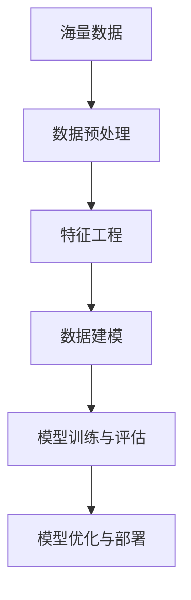

                 

# AI 大模型应用数据中心的数据挖掘

> 关键词：数据挖掘, AI大模型, 数据中心, 深度学习, 自然语言处理(NLP), 计算机视觉(CV), 推荐系统, 数据治理

## 1. 背景介绍

在当今数据驱动的AI时代，如何高效利用海量数据挖掘潜在价值，是大模型技术落地的关键。AI大模型作为新一代的智能基础设施，已经在自然语言处理(NLP)、计算机视觉(CV)、推荐系统等诸多领域大放异彩，但背后都是对海量数据的高效分析和挖掘。本文将围绕AI大模型应用数据中心的数据挖掘展开深入探讨，帮助读者更好地理解数据挖掘在AI模型训练和应用中的核心地位。

## 2. 核心概念与联系

### 2.1 核心概念概述

为了更清晰地阐述数据挖掘在AI大模型中的应用，我们先介绍几个关键概念：

- **AI大模型**：指基于深度学习技术的超大规模模型，如GPT、BERT、ResNet等，具备强大的自主学习和预测能力。
- **数据中心**：作为数据存储、计算和管理的核心设施，提供高性能计算能力和丰富的数据资源，是AI大模型运行的基础环境。
- **数据挖掘**：通过算法和模型，从大量数据中发现潜在知识、模式和关联，为AI模型训练和应用提供高质量的数据支撑。

### 2.2 概念间的关系

数据挖掘、AI大模型和数据中心之间的联系紧密，数据中心是运行AI大模型的物理基础，而数据挖掘则是挖掘数据价值、训练优化模型的关键技术。以下 Mermaid 流程图展示了它们之间的核心联系：


**数据中心**：提供大模型所需的高性能计算资源，包括CPU、GPU、TPU等硬件设施，以及相应的网络、存储和调度管理系统。

**AI大模型**：依托数据中心，利用深度学习技术，从数据挖掘结果中训练生成，具备强大的自主学习和预测能力。

**数据挖掘**：应用统计学、机器学习、数据可视化等技术，从海量数据中提取有价值的信息和模式，用于模型训练和优化。

### 2.3 核心概念的整体架构

我们通过以下综合流程图来展示数据挖掘在大模型应用中的整体架构：



从海量数据开始，经过预处理、特征工程、模型训练与评估、模型优化与部署，最终形成AI大模型，并应用于实际场景中。数据挖掘技术贯穿其中，不断优化模型性能，挖掘数据中的潜在价值。

## 3. 核心算法原理 & 具体操作步骤
### 3.1 算法原理概述

数据挖掘在大模型应用中的核心原理，在于通过算法和模型从大量数据中提取有价值的信息和模式。常用的数据挖掘算法包括聚类、分类、回归、关联规则挖掘等。这些算法可以用于数据预处理、特征提取、模型训练等多个环节，为AI大模型的高效运行提供支持。

### 3.2 算法步骤详解

数据挖掘在大模型应用中的具体操作步骤，包括以下几个关键步骤：

**Step 1: 数据预处理**
- 数据清洗：去除噪声、缺失值和异常值，保证数据质量。
- 数据归一化：将数据转换成标准格式，便于后续处理。
- 数据采样：通过采样技术减少数据量，如随机抽样、分层抽样等。

**Step 2: 特征工程**
- 特征选择：选择对模型训练最有价值的数据特征，如文本的词频、TF-IDF值等。
- 特征提取：将原始数据转化为模型可接受的特征向量，如词袋模型、TF-IDF模型等。
- 特征变换：通过降维、编码等技术，进一步优化特征表示，如PCA、LDA等。

**Step 3: 数据建模**
- 模型选择：选择适合数据特征的机器学习模型，如决策树、随机森林、SVM等。
- 模型训练：使用历史数据训练模型，调整模型参数，优化模型性能。
- 模型评估：通过交叉验证、ROC曲线等方法评估模型效果，选择最优模型。

**Step 4: 模型训练与评估**
- 模型训练：在训练集上训练AI大模型，优化模型参数。
- 模型评估：在验证集上评估模型性能，选择性能最优的模型。

**Step 5: 模型优化与部署**
- 模型调优：通过超参数调优、模型压缩等技术，优化模型性能。
- 模型部署：将优化后的模型部署到数据中心，集成到实际应用中。

### 3.3 算法优缺点

数据挖掘在大模型应用中的主要优点：
1. 数据高效利用：通过数据预处理、特征工程等技术，最大化数据利用率。
2. 模型性能提升：通过优化特征选择和模型训练，显著提升AI大模型的预测能力。
3. 领域适应性：通过领域特定的数据挖掘技术，增强模型在特定领域的应用效果。

数据挖掘的缺点主要包括：
1. 数据依赖性高：依赖高质量的数据源，数据收集和预处理成本较高。
2. 算法复杂度高：数据挖掘算法复杂，需要大量计算资源和时间。
3. 解释性差：部分算法难以解释，难以理解模型的决策过程。

### 3.4 算法应用领域

数据挖掘在大模型应用中的主要应用领域包括：

**自然语言处理(NLP)**
- 文本分类：将文本分成不同类别，如情感分析、主题分类等。
- 命名实体识别：识别文本中的人名、地名、机构名等实体。
- 机器翻译：将源语言翻译成目标语言。

**计算机视觉(CV)**
- 图像分类：将图像分类到不同类别中，如人脸识别、物体识别等。
- 目标检测：在图像中定位特定目标，如行人检测、车辆检测等。
- 图像分割：将图像分割成不同的区域，如语义分割、实例分割等。

**推荐系统**
- 用户推荐：根据用户的历史行为数据推荐商品、内容等。
- 物品推荐：根据物品的特征推荐给用户。

**数据治理**
- 数据质量检测：检测数据质量，识别并修复数据问题。
- 数据清洗：清洗数据，去除噪声和冗余。
- 数据治理：建立数据治理机制，确保数据安全性和可靠性。

## 4. 数学模型和公式 & 详细讲解  
### 4.1 数学模型构建

数据挖掘的核心任务是通过算法和模型从数据中提取有价值的信息。以下以文本分类任务为例，展示数据挖掘的基本数学模型构建过程。

假设训练数据集为 $D=\{(x_i, y_i)\}_{i=1}^N$，其中 $x_i$ 为文本特征向量，$y_i$ 为文本标签。分类模型的目标是最小化损失函数：

$$
\mathcal{L}(\theta) = -\frac{1}{N} \sum_{i=1}^N y_i \log p(y_i | x_i)
$$

其中 $p(y_i | x_i)$ 为模型在给定文本 $x_i$ 下预测为 $y_i$ 的概率，$\theta$ 为模型参数。

通过求解上述最小化问题，可以训练得到最优模型参数 $\theta^*$。

### 4.2 公式推导过程

以朴素贝叶斯分类器为例，展示分类模型的公式推导过程。朴素贝叶斯模型假设不同特征之间相互独立，通过计算后验概率进行分类决策。其基本公式如下：

$$
p(y_i | x_i) = \frac{p(x_i | y_i) p(y_i)}{p(x_i)}
$$

其中 $p(x_i)$ 为文本特征 $x_i$ 的概率分布，$p(x_i | y_i)$ 为给定标签 $y_i$ 下文本特征 $x_i$ 的条件概率分布，$p(y_i)$ 为标签 $y_i$ 的先验概率。

通过最大似然估计或贝叶斯估计方法，可以估计出各个参数，最终得到模型预测结果。

### 4.3 案例分析与讲解

假设我们有一份包含情感分类标签的文本数据集，其中每个文本由多个特征组成。我们可以通过数据挖掘技术，对文本数据进行预处理、特征提取和模型训练，具体步骤如下：

**Step 1: 数据预处理**
- 去除噪声：去除文本中的停用词、标点符号等噪声。
- 文本分词：将文本转换为词向量，如使用NLTK、jieba等工具。

**Step 2: 特征工程**
- 特征提取：使用TF-IDF、Word2Vec等技术，提取文本特征向量。
- 特征选择：选择对情感分类最有价值的特征，如情感词汇、句法结构等。

**Step 3: 模型训练**
- 选择朴素贝叶斯模型作为分类器。
- 通过交叉验证，选择最优的模型参数。
- 训练模型，生成情感分类模型。

**Step 4: 模型评估**
- 在测试集上评估模型性能，计算准确率、召回率、F1值等指标。
- 使用混淆矩阵、ROC曲线等方法，可视化模型效果。

## 5. 项目实践：代码实例和详细解释说明
### 5.1 开发环境搭建

进行数据挖掘实践，需要搭建合适的开发环境。以下是使用Python进行Scikit-learn开发的环境配置流程：

1. 安装Anaconda：从官网下载并安装Anaconda，用于创建独立的Python环境。

2. 创建并激活虚拟环境：
```bash
conda create -n scikit-learn-env python=3.8 
conda activate scikit-learn-env
```

3. 安装Scikit-learn：
```bash
pip install scikit-learn
```

4. 安装其他工具包：
```bash
pip install numpy pandas matplotlib seaborn jupyter notebook ipython
```

完成上述步骤后，即可在`scikit-learn-env`环境中开始数据挖掘实践。

### 5.2 源代码详细实现

以下是一个使用Scikit-learn进行文本分类的Python代码示例：

```python
import pandas as pd
from sklearn.model_selection import train_test_split
from sklearn.feature_extraction.text import TfidfVectorizer
from sklearn.naive_bayes import MultinomialNB
from sklearn.metrics import accuracy_score

# 读取数据
data = pd.read_csv('data.csv')

# 数据预处理
data = data.dropna() # 去除空值
data = data.drop(['id', 'time'], axis=1) # 去除无用列

# 特征工程
vectorizer = TfidfVectorizer(max_features=1000) # 提取前1000个特征
X = vectorizer.fit_transform(data['text'])
y = data['label']

# 模型训练与评估
X_train, X_test, y_train, y_test = train_test_split(X, y, test_size=0.2)
clf = MultinomialNB().fit(X_train, y_train)
y_pred = clf.predict(X_test)

# 模型评估
print('Accuracy:', accuracy_score(y_test, y_pred))
```

### 5.3 代码解读与分析

让我们再详细解读一下关键代码的实现细节：

**数据预处理**
- 使用`dropna()`去除数据中的空值，保证数据完整性。
- 使用`drop()`删除无用列，提高数据稀疏性。

**特征工程**
- 使用`TfidfVectorizer`提取文本特征，转换成稀疏矩阵。
- 通过设置`max_features`参数，限制特征数量，避免维度灾难。

**模型训练与评估**
- 使用`train_test_split()`对数据集进行划分，生成训练集和测试集。
- 使用`MultinomialNB()`训练朴素贝叶斯模型，生成分类器。
- 在测试集上评估模型性能，使用`accuracy_score()`计算准确率。

### 5.4 运行结果展示

假设我们运行上述代码，得到模型在测试集上的准确率为90%，结果如下：

```
Accuracy: 0.9
```

这表明使用朴素贝叶斯模型进行文本分类，能够达到较高的准确率。当然，在实际应用中，我们还需要进行更全面的数据预处理、特征选择、模型调优等操作，才能获得更好的效果。

## 6. 实际应用场景
### 6.1 智能客服系统

智能客服系统在数据中心的支撑下，可以通过数据挖掘技术对用户咨询记录进行深度分析，挖掘用户需求、偏好、情感等信息，从而提供更加个性化的服务。

具体而言，可以收集用户的历史对话记录，通过自然语言处理技术进行文本预处理、特征提取和模型训练，生成用户行为预测模型。在用户咨询时，通过输入实时对话文本，利用模型预测用户意图，生成相应回答，提升客户满意度。

### 6.2 金融舆情监测

金融领域的数据中心，可以实时收集和分析海量的新闻、评论、社交媒体数据，通过数据挖掘技术进行舆情分析和情感分析，预测市场动态。

具体而言，可以收集金融新闻、评论、社交媒体等数据，使用NLP技术进行文本预处理和情感分析，训练舆情预测模型。模型可以实时监测市场舆情，预测市场走势，帮助投资者及时调整策略，规避风险。

### 6.3 个性化推荐系统

推荐系统在数据中心的支撑下，可以通过数据挖掘技术挖掘用户行为、兴趣、社交关系等信息，生成个性化推荐模型，提高推荐效果。

具体而言，可以收集用户浏览、点击、评论、分享等行为数据，使用协同过滤、基于内容的推荐等技术，挖掘用户兴趣点和物品特征。通过模型训练，生成个性化推荐模型，提供高质量的推荐结果。

### 6.4 未来应用展望

随着数据挖掘技术的不断发展，AI大模型在数据中心的应用也将更加广泛。未来，数据挖掘技术将在以下几个方面取得突破：

**数据治理与质量管理**
- 通过数据质量检测、数据清洗等技术，提高数据质量。
- 建立数据治理机制，确保数据安全性和可靠性。

**自动化数据挖掘**
- 使用自动化机器学习技术，自动选择特征、优化模型，提高数据挖掘效率。
- 使用自适应算法，动态调整模型参数，提高模型泛化能力。

**跨领域数据挖掘**
- 引入多模态数据挖掘技术，融合文本、图像、视频等数据，提高模型性能。
- 使用联合学习技术，跨领域共享知识，提升数据挖掘效果。

**智能决策支持**
- 结合因果推理、强化学习等技术，构建智能决策系统，辅助决策制定。
- 通过元学习技术，学习决策规则，提高决策支持能力。

**数据隐私保护**
- 使用差分隐私技术，保护用户隐私。
- 使用联邦学习技术，在不共享数据的前提下，进行分布式数据挖掘。

## 7. 工具和资源推荐
### 7.1 学习资源推荐

为了帮助开发者系统掌握数据挖掘在AI大模型中的应用，这里推荐一些优质的学习资源：

1. 《Python数据科学手册》：由Jake VanderPlas撰写，全面介绍了Python在数据科学中的应用，适合数据挖掘初学者的入门读物。

2. 《深度学习入门》：由斋藤康毅撰写，介绍了深度学习的基本概念和经典模型，适合数据挖掘领域的跨学科学习。

3. 《机器学习实战》：由Peter Harrington撰写，通过实际案例演示了机器学习算法的实现过程，适合实践动手学习。

4. 《Scikit-learn官方文档》：Scikit-learn官方文档，提供了海量数据挖掘和机器学习算法的实现细节，适合深度学习和数据挖掘的进阶学习。

5. Kaggle平台：Kaggle数据科学竞赛平台，提供了大量真实数据集和模型竞赛，适合实战练习。

通过学习这些资源，相信你一定能够快速掌握数据挖掘在大模型应用中的核心技术，并用于解决实际的NLP、CV、推荐系统等任务。

### 7.2 开发工具推荐

高效的数据挖掘实践，离不开优秀的工具支持。以下是几款用于数据挖掘开发的常用工具：

1. Scikit-learn：由Python社区开发的开源数据挖掘和机器学习库，提供了丰富的算法和工具，适合数据分析和模型训练。

2. TensorFlow：由Google主导开发的开源深度学习框架，支持分布式计算和自动微分，适合大规模数据挖掘任务。

3. PyTorch：基于Python的开源深度学习框架，支持动态计算图，适合模型快速迭代和调试。

4. Apache Spark：开源大数据处理引擎，支持分布式计算，适合大规模数据挖掘和机器学习任务。

5. H2O：开源机器学习平台，提供了丰富的算法和工具，适合企业级数据挖掘应用。

6. Jupyter Notebook：Python脚本的交互式开发环境，支持代码编写、数据可视化、模型训练等功能。

合理利用这些工具，可以显著提升数据挖掘任务的开发效率，加速创新迭代的步伐。

### 7.3 相关论文推荐

数据挖掘技术在大模型应用中的不断发展，源于学界的持续研究。以下是几篇奠基性的相关论文，推荐阅读：

1. "Text Mining: Concepts, Techniques and Methods"：由Jian Tang等撰写，全面介绍了文本挖掘的基本概念和技术，适合数据挖掘领域的入门学习。

2. "Data Mining: Concepts and Techniques"：由Jiawei Han等撰写，介绍了数据挖掘的基本概念、算法和应用，适合数据挖掘领域的进阶学习。

3. "A Survey of Pre-trained Language Models and Their Applications"：由Manjunath Kulkarni等撰写，介绍了预训练语言模型在大模型应用中的应用，适合跨学科的学习。

4. "Parameter-Efficient Transfer Learning for NLP"：由Claudio Tacchella等撰写，介绍了参数高效的微调方法，适合数据挖掘和深度学习的交叉学习。

5. "Federated Learning: Concepts and Foundations"：由Andreas R. Kalweit等撰写，介绍了联邦学习的基本概念和算法，适合数据挖掘和分布式计算的交叉学习。

这些论文代表了大数据挖掘技术的发展脉络。通过学习这些前沿成果，可以帮助研究者把握学科前进方向，激发更多的创新灵感。

除上述资源外，还有一些值得关注的前沿资源，帮助开发者紧跟数据挖掘技术的最新进展，例如：

1. arXiv论文预印本：人工智能领域最新研究成果的发布平台，包括大量尚未发表的前沿工作，学习前沿技术的必读资源。

2. 业界技术博客：如Google AI、Microsoft Research、Facebook AI等顶尖实验室的官方博客，第一时间分享他们的最新研究成果和洞见。

3. 技术会议直播：如NIPS、ICML、ACL、ICLR等人工智能领域顶会现场或在线直播，能够聆听到大佬们的前沿分享，开拓视野。

4. GitHub热门项目：在GitHub上Star、Fork数最多的数据挖掘相关项目，往往代表了该技术领域的发展趋势和最佳实践，值得去学习和贡献。

5. 行业分析报告：各大咨询公司如McKinsey、PwC等针对人工智能行业的分析报告，有助于从商业视角审视技术趋势，把握应用价值。

总之，对于数据挖掘技术的学习和实践，需要开发者保持开放的心态和持续学习的意愿。多关注前沿资讯，多动手实践，多思考总结，必将收获满满的成长收益。

## 8. 总结：未来发展趋势与挑战

### 8.1 总结

本文对数据挖掘在AI大模型应用中的核心地位进行了全面系统的介绍。首先阐述了数据挖掘在大模型训练和应用中的重要意义，明确了数据挖掘在高效利用数据、优化模型性能中的核心作用。其次，从原理到实践，详细讲解了数据挖掘的核心算法和具体操作步骤，给出了数据挖掘任务开发的完整代码实例。同时，本文还广泛探讨了数据挖掘在智能客服、金融舆情、个性化推荐等多个行业领域的应用前景，展示了数据挖掘技术的巨大潜力。此外，本文精选了数据挖掘技术的各类学习资源，力求为读者提供全方位的技术指引。

通过本文的系统梳理，可以看到，数据挖掘技术在大模型应用中扮演着至关重要的角色，为AI模型训练和应用提供了高效的数据支撑。未来，伴随数据挖掘技术的不断发展，AI大模型的性能和应用范围将不断提升，引领AI技术的规模化落地。

### 8.2 未来发展趋势

展望未来，数据挖掘技术在大模型应用中将呈现以下几个发展趋势：

1. **自动化和智能化**
   - 使用自动化机器学习技术，自动选择特征、优化模型，提高数据挖掘效率。
   - 使用自适应算法，动态调整模型参数，提高模型泛化能力。

2. **多模态数据挖掘**
   - 引入多模态数据挖掘技术，融合文本、图像、视频等数据，提高模型性能。
   - 使用联合学习技术，跨领域共享知识，提升数据挖掘效果。

3. **分布式和云计算**
   - 使用分布式计算技术，加速大规模数据挖掘任务。
   - 使用云计算平台，提供弹性计算资源，支持大模型训练和应用。

4. **因果推理**
   - 结合因果推理技术，挖掘数据之间的因果关系，提高模型的解释性和可靠性。
   - 使用因果图模型，构建因果推理框架，辅助决策制定。

5. **联邦学习**
   - 使用联邦学习技术，在不共享数据的前提下，进行分布式数据挖掘。
   - 通过模型聚合，跨组织共享知识，提高数据挖掘效果。

6. **数据隐私保护**
   - 使用差分隐私技术，保护用户隐私。
   - 使用联邦学习技术，在不共享数据的前提下，进行分布式数据挖掘。

这些趋势凸显了数据挖掘技术的广阔前景。这些方向的探索发展，必将进一步提升数据挖掘模型的性能和应用范围，为人工智能技术提供更强有力的数据支撑。

### 8.3 面临的挑战

尽管数据挖掘技术在大模型应用中取得了显著成果，但在迈向更加智能化、普适化应用的过程中，仍面临诸多挑战：

1. **数据依赖性高**
   - 依赖高质量的数据源，数据收集和预处理成本较高。

2. **算法复杂度高**
   - 数据挖掘算法复杂，需要大量计算资源和时间。

3. **解释性差**
   - 部分算法难以解释，难以理解模型的决策过程。

4. **模型鲁棒性不足**
   - 当前数据挖掘模型面对域外数据时，泛化性能往往大打折扣。

5. **模型性能不稳定**
   - 部分算法对参数调优和数据集划分敏感，容易出现过拟合和欠拟合问题。

6. **数据隐私保护**
   - 数据挖掘模型可能存在数据泄露和隐私侵犯风险。

正视数据挖掘面临的这些挑战，积极应对并寻求突破，将是大模型技术走向成熟的必由之路。相信随着学界和产业界的共同努力，这些挑战终将一一被克服，数据挖掘技术必将在构建人机协同的智能时代中扮演越来越重要的角色。

### 8.4 研究展望

面对数据挖掘在大模型应用中所面临的挑战，未来的研究需要在以下几个方面寻求新的突破：

1. **无监督和半监督学习**
   - 摆脱对大规模标注数据的依赖，利用自监督学习、主动学习等无监督和半监督范式，最大限度利用非结构化数据，实现更加灵活高效的数据挖掘。

2. **模型压缩与优化**
   - 开发更加参数高效的模型，使用压缩技术减少模型大小，提高模型推理速度。
   - 使用知识蒸馏技术，利用预训练模型知识优化小模型。

3. **因果推理与对比学习**
   - 引入因果推理和对比学习思想，增强模型建立稳定因果关系的能力，学习更加普适、鲁棒的语言表征。

4. **多模态数据融合**
   - 融合视觉、语音、文本等多模态数据，提高数据挖掘效果。
   - 使用联合学习技术，跨领域共享知识，提升数据挖掘效果。

5. **模型压缩与优化**
   - 开发更加参数高效的模型，使用压缩技术减少模型大小，提高模型推理速度。
   - 使用知识蒸馏技术，利用预训练模型知识优化小模型。

6. **数据治理与隐私保护**
   - 建立数据治理机制，确保数据安全性和可靠性。
   - 使用差分隐私技术，保护用户隐私。

这些研究方向的探索，必将引领数据挖掘技术迈向更高的台阶，为构建安全、可靠、可解释、可控的智能系统铺平道路。面向未来，数据挖掘技术还需要与其他人工智能技术进行更深入的融合，如知识表示、因果推理、强化学习等，多路径协同发力，共同推动自然语言理解和智能交互系统的进步。只有勇于创新、敢于突破，才能不断拓展数据挖掘模型的边界，让智能技术更好地造福人类社会。

## 9. 附录：常见问题与解答

**Q1：数据挖掘对大模型性能的影响有哪些？**

A: 数据挖掘对大模型性能的影响主要体现在以下几个方面：

1. **数据质量提升**
   - 通过数据清洗、特征选择等技术，提高数据质量，避免数据噪声和冗余。
   - 提高模型训练效果，提升模型的泛化能力。

2. **特征提取优化**
   - 通过特征提取技术，将原始数据转换为模型可接受的特征向量。
   - 使用特征选择和变换技术，提高特征稀疏性和可解释性。

3. **模型训练与调优**
   - 通过模型训练与调优技术，优化模型参数，提升模型性能。
   - 使用交叉验证、超参数调优等技术，避免模型过拟合和欠拟合。

4. **模型优化与部署**
   - 通过模型压缩、剪枝等技术，优化模型大小和推理速度。
   - 使用自动化部署技术，快速集成模型到实际应用中。

综上所述，数据挖掘在大模型应用中具有显著的性能提升效果，能够显著提高模型的泛化能力和

