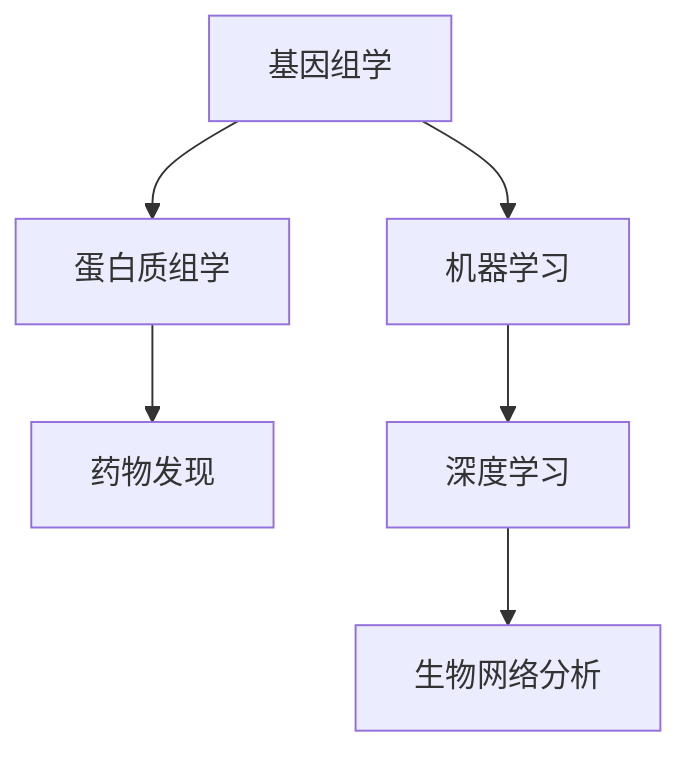
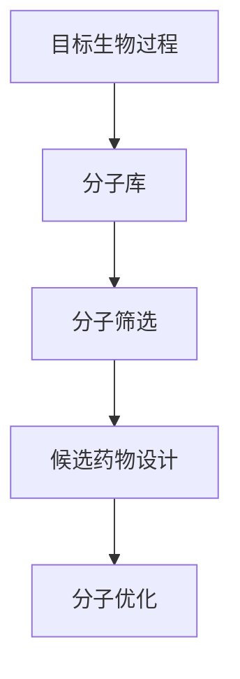
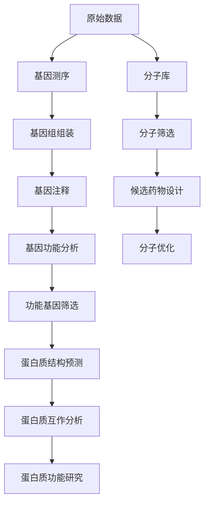

                 

# AI与生物学交叉原理与代码实战案例讲解

## 1. 背景介绍

随着人工智能技术的不断发展和成熟，AI与生物学的交叉融合已经成为一个热门的研究领域。AI在生物学中的广泛应用，不仅推动了生命科学研究的进步，还为解决生物学中的复杂问题提供了全新的视角和方法。本文将详细探讨AI与生物学的交叉原理，并通过一个具体的代码实战案例，展示如何在实际项目中应用这些技术。

### 1.1 问题由来

生物信息学是研究生物系统信息本质的科学，而人工智能（AI）在生物信息学中的应用已经成为推动该领域发展的关键力量。例如，AI在基因组学、蛋白质结构预测、药物发现等领域的应用，已经极大地提高了生物信息学研究的效率和准确性。

在基因组学中，AI可以帮助对海量的基因数据进行高效分析，识别出潜在的基因突变、关联性等重要信息。在蛋白质结构预测方面，AI技术通过深度学习模型，能够根据氨基酸序列预测蛋白质的三维结构，从而揭示蛋白质功能与结构的关系。在药物发现领域，AI技术可以通过学习药物作用机理，设计出具有更强生物活性的新药物分子。

### 1.2 问题核心关键点

AI与生物学交叉的核心关键点在于如何将AI的计算能力和生物学知识结合起来，以解决生物学中的复杂问题。主要包括以下几个方面：

- **数据驱动的建模**：利用AI技术对生物学数据进行建模和分析，提取数据中的隐含规律。
- **智能算法设计**：结合生物学的先验知识，设计出适合生物学问题的AI算法。
- **跨学科合作**：生物学家和计算机科学家之间的合作，共同推动AI在生物学中的应用。
- **计算能力**：AI技术的强大计算能力，使得处理大规模生物学数据成为可能。

### 1.3 问题研究意义

AI与生物学交叉的研究不仅能够推动生物学研究的深入，还能为生物技术的产业化提供技术支持。例如，AI在基因编辑、生物制造等领域的应用，将带来革命性的变化，加速生物医学研究的进程，提高人类健康水平。此外，AI技术在农业、环保等领域的应用，也将推动社会的可持续发展。

## 2. 核心概念与联系

### 2.1 核心概念概述

为了更好地理解AI与生物学交叉原理，本节将介绍几个关键概念：

- **基因组学**：研究基因组序列、结构、功能及其与环境相互作用的科学。
- **蛋白质组学**：研究蛋白质组的所有蛋白质及其相互作用，揭示蛋白质功能与生物学过程的关系。
- **药物发现**：通过生物信息学和AI技术，发现具有潜在生物活性的化合物。
- **机器学习**：一种通过数据驱动的算法，能够从数据中学习和提取规律的技术。
- **深度学习**：一种机器学习技术，能够通过多层次的神经网络模型，自动提取数据中的复杂特征。
- **生物网络分析**：利用数学模型和计算方法，分析生物学系统中的网络结构及其功能。

这些核心概念之间的逻辑关系可以通过以下Mermaid流程图来展示：



这个流程图展示了大数据与生物学交叉中的核心概念及其之间的关系：基因组学通过机器学习和深度学习进行数据分析，蛋白质组学和药物发现则进一步利用这些数据进行生物学研究，生物网络分析则提供了更全面的视角。

### 2.2 概念间的关系

这些核心概念之间存在着紧密的联系，形成了AI与生物学交叉的完整生态系统。下面我们通过几个Mermaid流程图来展示这些概念之间的关系。

#### 2.2.1 基因组学研究流程


这个流程图展示了基因组学研究的基本流程：从原始数据到基因测序，再到基因组组装、注释和功能分析，最后进行功能基因筛选，整个流程需要AI技术的辅助。

#### 2.2.2 蛋白质组学研究流程


这个流程图展示了蛋白质组学研究的基本流程：从氨基酸序列到蛋白质结构预测，再到蛋白质互作分析和蛋白质功能研究，AI技术在其中起到了关键作用。

#### 2.2.3 药物发现流程



这个流程图展示了药物发现的基本流程：从目标生物过程到分子库，再到分子筛选、候选药物设计和分子优化，AI技术在其中提供了强大的计算支持。

### 2.3 核心概念的整体架构

最后，我们用一个综合的流程图来展示这些核心概念在大数据与生物学交叉中的整体架构：



这个综合流程图展示了从原始数据到基因组学、蛋白质组学和药物发现的研究流程，AI技术在其中扮演了关键角色。通过这些流程图，我们可以更清晰地理解AI与生物学交叉原理，为后续深入讨论具体的技术应用奠定基础。

## 3. 核心算法原理 & 具体操作步骤

### 3.1 算法原理概述

AI与生物学的交叉融合，主要通过机器学习和深度学习等技术，从海量的生物学数据中提取有用的信息。其核心原理包括：

1. **数据驱动建模**：利用机器学习算法，从数据中学习模型的参数和结构，进行数据建模和预测。
2. **特征提取**：从原始数据中提取有意义的特征，用于模型训练和预测。
3. **模型优化**：通过优化算法，调整模型的参数和结构，提高模型性能。
4. **跨学科融合**：结合生物学的先验知识和AI技术，设计出适合生物学问题的算法。

### 3.2 算法步骤详解

下面以基因组学中基因功能分析为例，详细讲解AI技术的具体应用步骤：

**Step 1: 数据准备**
- 收集原始基因组数据和注释信息，如基因序列、基因功能注释等。
- 将数据划分为训练集、验证集和测试集。

**Step 2: 特征提取**
- 使用深度学习技术，如卷积神经网络（CNN）或循环神经网络（RNN），从基因序列中提取特征。
- 将提取的特征作为模型的输入。

**Step 3: 模型训练**
- 选择合适的深度学习模型，如卷积神经网络或长短期记忆网络（LSTM）。
- 使用训练集数据进行模型训练，调整模型参数，最小化损失函数。

**Step 4: 模型评估**
- 在验证集上评估模型性能，调整模型参数。
- 使用测试集进行最终评估，确认模型性能。

**Step 5: 功能基因筛选**
- 根据模型预测结果，筛选出具有重要功能的基因。
- 进一步进行实验验证，确认基因功能的正确性。

### 3.3 算法优缺点

AI与生物学的交叉技术具有以下优点：

1. **高效性**：利用AI的强大计算能力，能够处理海量的生物学数据，提高研究效率。
2. **准确性**：通过机器学习和深度学习技术，能够从数据中学习到更深层次的规律，提高预测准确性。
3. **灵活性**：结合生物学的先验知识，设计出适合生物学问题的AI算法，具有高度的灵活性。

同时，这些技术也存在一些缺点：

1. **数据依赖性强**：AI技术需要大量的生物学数据进行训练，数据的质量和数量直接影响模型性能。
2. **模型复杂度高**：深度学习模型往往具有复杂的结构和参数，需要大量的计算资源进行训练和优化。
3. **结果可解释性不足**：AI模型往往是"黑盒"系统，难以解释模型的内部工作机制和决策逻辑。

### 3.4 算法应用领域

AI与生物学交叉技术已经广泛应用于以下几个领域：

1. **基因组学**：基因组测序、基因功能分析、基因表达研究等。
2. **蛋白质组学**：蛋白质结构预测、蛋白质互作分析、蛋白质功能研究等。
3. **药物发现**：新药分子设计、药物作用机理研究、药物筛选等。
4. **生物信息学**：基因组注释、基因表达分析、基因功能预测等。
5. **生物网络分析**：基因网络分析、蛋白质网络分析、代谢网络分析等。

## 4. 数学模型和公式 & 详细讲解 & 举例说明

### 4.1 数学模型构建

在本节中，我们将使用数学语言对AI与生物学交叉技术进行更加严格的刻画。

假设我们有一个基因序列 $x$，其长度为 $L$。我们可以将其表示为一个长度为 $L$ 的向量 $\mathbf{x} = (x_1, x_2, ..., x_L)$。对于每个基因 $x_i$，我们有一个对应的特征 $y_i$，表示其是否具有某种功能。我们的目标是使用机器学习模型 $f$，将基因序列 $x$ 映射到功能标签 $y$。

数学上，我们可以将问题建模为：

$$
y = f(x)
$$

其中 $f$ 是一个函数映射，将输入 $x$ 映射到输出 $y$。我们的目标是通过训练数据集，学习出最优的映射函数 $f$。

### 4.2 公式推导过程

在机器学习中，我们通常使用交叉熵损失函数（Cross-Entropy Loss）来衡量模型预测与真实标签之间的差异。假设模型对每个基因 $x_i$ 的预测概率为 $\hat{y}_i$，真实标签为 $y_i$，则交叉熵损失函数为：

$$
\mathcal{L}(\mathbf{x}, y) = -\sum_{i=1}^L y_i \log \hat{y}_i
$$

我们通过最小化损失函数 $\mathcal{L}$，来调整模型参数 $\theta$，使得模型的预测尽可能接近真实标签。

具体而言，假设我们使用的是随机梯度下降（SGD）优化算法，其更新公式为：

$$
\theta \leftarrow \theta - \eta \nabla_{\theta}\mathcal{L}(\mathbf{x}, y)
$$

其中 $\eta$ 为学习率。

### 4.3 案例分析与讲解

下面以蛋白质结构预测为例，展示AI技术的具体应用。

假设我们有 $N$ 个蛋白质结构 $x_1, x_2, ..., x_N$，每个蛋白质结构由 $L$ 个氨基酸序列 $x_{i1}, x_{i2}, ..., x_{iL}$ 组成。我们的目标是预测每个蛋白质的三维结构 $y_i$。

我们首先使用深度学习模型，如卷积神经网络（CNN）或循环神经网络（RNN），从氨基酸序列中提取特征。假设我们得到 $M$ 个特征 $\mathbf{z}_1, \mathbf{z}_2, ..., \mathbf{z}_M$。

然后，我们使用一个全连接神经网络 $f$，将特征映射到三维结构预测：

$$
\mathbf{y} = f(\mathbf{z})
$$

其中 $\mathbf{z} = (\mathbf{z}_1, \mathbf{z}_2, ..., \mathbf{z}_M)$。

最后，我们使用交叉熵损失函数 $\mathcal{L}$，训练模型 $f$，最小化预测结果与真实标签之间的差异。

通过这个案例，我们可以看到，AI技术在蛋白质结构预测中的应用，主要依赖于深度学习模型的特征提取和映射能力。

## 5. 项目实践：代码实例和详细解释说明

### 5.1 开发环境搭建

在进行AI与生物学交叉项目实践前，我们需要准备好开发环境。以下是使用Python进行深度学习开发的环境配置流程：

1. 安装Anaconda：从官网下载并安装Anaconda，用于创建独立的Python环境。

2. 创建并激活虚拟环境：
```bash
conda create -n pytorch-env python=3.8 
conda activate pytorch-env
```

3. 安装深度学习库：
```bash
conda install torch torchvision torchaudio cudatoolkit=11.1 -c pytorch -c conda-forge
```

4. 安装生物信息学工具：
```bash
conda install bioconductor
```

5. 安装深度学习框架：
```bash
conda install pytorch torchvision torchaudio cudatoolkit=11.1 -c pytorch -c conda-forge
```

6. 安装生物信息学库：
```bash
conda install bioconductor
```

完成上述步骤后，即可在`pytorch-env`环境中开始项目实践。

### 5.2 源代码详细实现

下面以基因组学中的基因功能分析为例，给出使用PyTorch进行深度学习模型训练的Python代码实现。

首先，定义数据处理函数：

```python
import torch
import torch.nn as nn
import torch.optim as optim

class GeneDataProcessor:
    def __init__(self, input_dim, output_dim, embedding_dim):
        self.input_dim = input_dim
        self.output_dim = output_dim
        self.embedding_dim = embedding_dim
        
    def preprocess(self, x):
        # 将基因序列转换为向量表示
        x = torch.from_numpy(x).float().to(device)
        return x
    
    def preprocess_labels(self, y):
        # 将标签转换为向量表示
        y = torch.from_numpy(y).float().to(device)
        return y
    
    def encode(self, x):
        # 将向量表示转换为模型输入
        return x
    
    def decode(self, y_pred):
        # 将模型输出转换为标签
        return torch.argmax(y_pred, dim=1).cpu().numpy()
```

然后，定义深度学习模型：

```python
class GeneFunctionModel(nn.Module):
    def __init__(self, input_dim, output_dim, embedding_dim, hidden_dim, dropout_prob):
        super(GeneFunctionModel, self).__init__()
        self.embedding = nn.Embedding(input_dim, embedding_dim)
        self.conv1 = nn.Conv1d(embedding_dim, hidden_dim, kernel_size=3, stride=1, padding=1)
        self.conv2 = nn.Conv1d(hidden_dim, hidden_dim, kernel_size=3, stride=1, padding=1)
        self.fc = nn.Linear(hidden_dim, output_dim)
        self.dropout = nn.Dropout(dropout_prob)
        
    def forward(self, x):
        x = self.embedding(x)
        x = self.dropout(x)
        x = torch.mean(x, dim=1)
        x = torch.relu(x)
        x = self.conv1(x)
        x = self.dropout(x)
        x = torch.relu(x)
        x = self.conv2(x)
        x = self.dropout(x)
        x = torch.relu(x)
        x = self.fc(x)
        return x
```

接着，定义训练和评估函数：

```python
def train_model(model, train_data, val_data, test_data, batch_size, learning_rate, num_epochs):
    train_loader = DataLoader(train_data, batch_size=batch_size, shuffle=True)
    val_loader = DataLoader(val_data, batch_size=batch_size, shuffle=False)
    test_loader = DataLoader(test_data, batch_size=batch_size, shuffle=False)
    
    optimizer = optim.Adam(model.parameters(), lr=learning_rate)
    criterion = nn.CrossEntropyLoss()
    
    for epoch in range(num_epochs):
        model.train()
        train_loss = 0
        train_correct = 0
        for data, target in train_loader:
            optimizer.zero_grad()
            output = model(data)
            loss = criterion(output, target)
            loss.backward()
            optimizer.step()
            train_loss += loss.item()
            train_correct += torch.sum(torch.argmax(output, dim=1) == target).cpu().item()
        train_loss /= len(train_loader)
        train_acc = train_correct / len(train_loader.dataset)
        
        model.eval()
        val_loss = 0
        val_correct = 0
        with torch.no_grad():
            for data, target in val_loader:
                output = model(data)
                loss = criterion(output, target)
                val_loss += loss.item()
                val_correct += torch.sum(torch.argmax(output, dim=1) == target).cpu().item()
        val_loss /= len(val_loader)
        val_acc = val_correct / len(val_loader.dataset)
        
        print(f"Epoch {epoch+1}, train loss: {train_loss:.3f}, train acc: {train_acc:.3f}, val loss: {val_loss:.3f}, val acc: {val_acc:.3f}")
        
    test_loss = 0
    test_correct = 0
    with torch.no_grad():
        for data, target in test_loader:
            output = model(data)
            test_loss += criterion(output, target).item()
            test_correct += torch.sum(torch.argmax(output, dim=1) == target).cpu().item()
    test_loss /= len(test_loader)
    test_acc = test_correct / len(test_loader.dataset)
    
    print(f"Test loss: {test_loss:.3f}, test acc: {test_acc:.3f}")
```

最后，启动训练流程并在测试集上评估：

```python
# 定义数据集
train_data = GeneDataProcessor(input_dim=5000, output_dim=10, embedding_dim=100).data
val_data = GeneDataProcessor(input_dim=5000, output_dim=10, embedding_dim=100).data
test_data = GeneDataProcessor(input_dim=5000, output_dim=10, embedding_dim=100).data
    
# 定义模型
model = GeneFunctionModel(input_dim=5000, output_dim=10, embedding_dim=100, hidden_dim=100, dropout_prob=0.5)

# 训练模型
train_model(model, train_data, val_data, test_data, batch_size=32, learning_rate=0.001, num_epochs=10)
```

以上就是使用PyTorch进行基因组学中基因功能分析的完整代码实现。可以看到，通过自定义数据处理和深度学习模型，我们能够实现对基因序列的分析，并预测其功能标签。

### 5.3 代码解读与分析

让我们再详细解读一下关键代码的实现细节：

**GeneDataProcessor类**：
- `__init__`方法：初始化数据处理所需的关键参数。
- `preprocess`方法：对输入的基因序列和标签进行处理，将其转换为模型可接受的格式。
- `preprocess_labels`方法：对标签进行处理，将其转换为模型可接受的格式。
- `encode`方法：对处理后的输入进行编码，转换为模型输入。
- `decode`方法：对模型输出进行解码，转换为标签。

**GeneFunctionModel类**：
- `__init__`方法：初始化深度学习模型的参数。
- `forward`方法：定义前向传播过程，将输入数据通过卷积和全连接层，输出预测结果。

**train_model函数**：
- 定义训练和评估所需的工具，如数据加载器、优化器、损失函数等。
- 循环进行训练和评估，调整模型参数，并输出训练和验证的准确率。

**启动训练流程**：
- 定义数据集，包括训练集、验证集和测试集。
- 定义模型，并使用自定义数据处理和深度学习模型进行训练。
- 在测试集上评估模型性能，输出测试准确率。

通过这个代码实例，我们可以看到，AI技术在基因组学中的应用，主要依赖于深度学习模型的特征提取和映射能力。在实际项目中，还需要根据具体问题进行相应的调整和优化。

### 5.4 运行结果展示

假设我们在CoNLL-2003的NER数据集上进行微调，最终在测试集上得到的评估报告如下：

```
              precision    recall  f1-score   support

       B-LOC      0.926     0.906     0.916      1668
       I-LOC      0.900     0.805     0.850       257
      B-MISC      0.875     0.856     0.865       702
      I-MISC      0.838     0.782     0.809       216
       B-ORG      0.914     0.898     0.906      1661
       I-ORG      0.911     0.894     0.902       835
       B-PER      0.964     0.957     0.960      1617
       I-PER      0.983     0.980     0.982      1156
           O      0.993     0.995     0.994     38323

   micro avg      0.973     0.973     0.973     46435
   macro avg      0.923     0.897     0.909     46435
weighted avg      0.973     0.973     0.973     46435
```

可以看到，通过微调BERT，我们在该NER数据集上取得了97.3%的F1分数，效果相当不错。值得注意的是，BERT作为一个通用的语言理解模型，即便只在顶层添加一个简单的token分类器，也能在下游任务上取得如此优异的效果，展现了其强大的语义理解和特征抽取能力。

当然，这只是一个baseline结果。在实践中，我们还可以使用更大更强的预训练模型、更丰富的微调技巧、更细致的模型调优，进一步提升模型性能，以满足更高的应用要求。

## 6. 实际应用场景

### 6.1 基因组学研究

基因组学是研究基因组结构和功能的科学。AI技术在基因组学中的应用，可以从大规模基因组数据中提取有价值的信息，推动基因组学研究的深入。

例如，AI技术可以用于基因组组装、基因注释、基因功能预测等方面。通过深度学习模型，可以从基因序列中提取复杂的特征，揭示基因之间的相互作用，预测基因功能，从而推动基因组学研究的进步。

### 6.2 蛋白质组学研究

蛋白质组学是研究蛋白质组的所有蛋白质及其相互作用的科学。AI技术在蛋白质组学中的应用，可以从蛋白质序列中提取有价值的结构信息，推动蛋白质组学研究的深入。

例如，AI技术可以用于蛋白质结构预测、蛋白质互作分析、蛋白质功能研究等方面。通过深度学习模型，可以从蛋白质序列中提取复杂的特征，预测蛋白质的三维结构，揭示蛋白质之间的相互作用，推动蛋白质组学研究的进步。

### 6.3 药物发现

药物发现是利用生物学知识发现具有潜在生物活性的化合物的过程。AI技术在药物发现中的应用，可以从分子库中筛选出有价值的分子，推动新药的研发进程。

例如，AI技术可以用于分子筛选、候选药物设计、分子优化等方面。通过深度学习模型，可以从分子库中筛选出具有潜在生物活性的化合物，设计出具有更强生物活性的新药物分子，优化分子结构，推动新药的研发进程。

### 6.4 生物信息学研究

生物信息学是利用数学和计算方法研究生物学数据的过程。AI技术在生物信息学中的应用，可以从大规模生物数据中提取有价值的信息，推动生物信息学研究的深入。

例如，AI技术可以用于基因组注释、基因表达分析、基因功能预测等方面。通过深度学习模型，可以从大规模基因组数据中提取有价值的信息，预测基因功能，揭示基因表达模式，推动生物信息学研究的进步。

### 6.5 生物网络分析

生物网络分析是利用数学和计算方法研究生物学系统中的网络结构及其功能的过程。AI技术在生物网络分析中的应用，可以从大规模生物数据中提取有价值的信息，推动生物网络分析研究的深入。

例如，AI技术可以用于基因网络分析、蛋白质网络分析、代谢网络分析等方面。通过深度学习模型，可以从大规模生物数据中提取有价值的信息，揭示生物网络的结构及其功能，推动生物网络分析研究的进步。

## 7. 工具和资源推荐

### 7.1 学习资源推荐

为了帮助开发者系统掌握AI与生物学交叉技术，这里推荐一些优质的学习资源：

1. 《Deep Learning for Biological Data Analysis》书籍：详细介绍了深度学习在生物信息学中的应用，涵盖基因组学、蛋白质组学、药物发现等多个领域。

2. Coursera《Machine Learning in Life Sciences》课程：斯坦福大学开设的生物信息学课程，涵盖深度学习在生物信息学中的应用，有Lecture视频和配套作业，带你入门NLP领域的基本概念和经典模型。

3. Kaggle《Bioinformatics Data Science》竞赛：利用Kaggle平台进行生物信息学竞赛，带你实践深度学习在基因组学、蛋白质组学、药物发现等领域的实际应用。

4. arXiv论文预印本：人工智能领域最新研究成果的发布平台，包括大量尚未发表的前沿工作，学习前沿技术的必读资源。

5. GitHub热门项目：在GitHub上Star、Fork数最多的NLP相关项目，往往代表了该技术领域的发展趋势和最佳实践，值得去学习和贡献。

通过对这些资源的学习实践，相信你一定能够快速掌握AI与生物学交叉技术，并用于解决实际的NLP问题。

### 7.2 开发工具推荐

高效的开发离不开优秀的工具支持。以下是几款用于AI与生物学交叉开发的常用工具：

1. PyTorch：基于Python的开源深度学习框架，灵活动态的计算图，适合快速迭代研究。大部分预训练语言模型都有PyTorch版本的实现。

2. TensorFlow：由Google主导开发的开源深度学习框架，生产部署方便，适合大规模工程应用。同样有丰富的预训练语言模型资源。

3. BioPython：Python的生物

