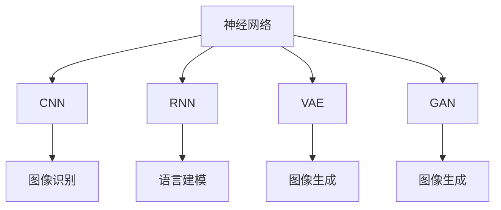
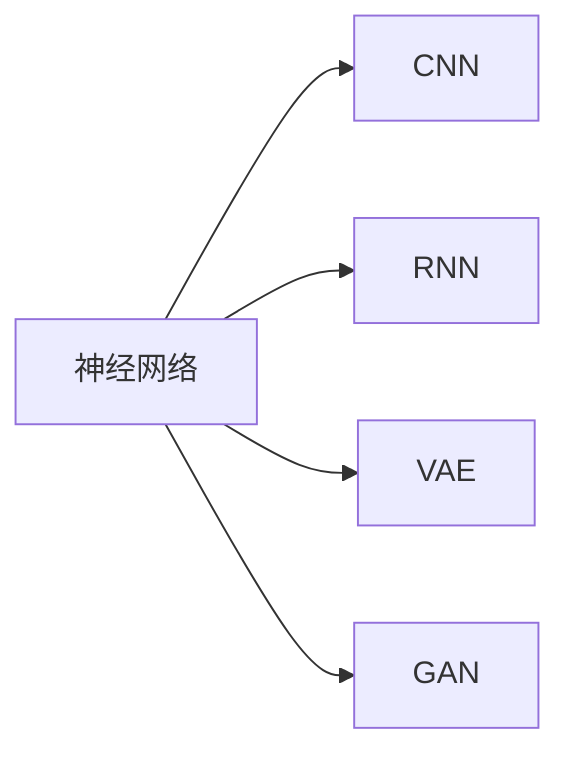

                 

# AI人工智能核心算法原理与代码实例讲解：认知建模

> 关键词：认知建模,人工智能,深度学习,神经网络,核心算法,代码实例

## 1. 背景介绍

### 1.1 问题由来
认知建模(Cognitive Modeling)是人工智能领域的重要研究方向，旨在通过计算模型模拟人类认知过程，实现对人类行为、决策、情感等的预测和解释。这一领域涉及到心理学、神经科学、哲学等多个学科，具有极高的交叉性和综合性。

近年来，深度学习技术在认知建模中发挥了重要作用，通过大规模数据训练神经网络模型，可实现对复杂认知现象的精确模拟和预测。深度学习模型，如卷积神经网络(CNN)、循环神经网络(RNN)、变分自编码器(VAE)、生成对抗网络(GAN)等，在认知建模中得到了广泛应用。

然而，深度学习模型的“黑盒”特性使得认知建模面临诸多挑战，如模型的可解释性、鲁棒性、可扩展性等问题。为了应对这些挑战，认知建模领域不断引入新的算法和方法，推动了深度学习技术的发展。

### 1.2 问题核心关键点
认知建模的核心在于构建计算模型，模拟人类认知过程。其关键技术包括：

- 神经网络结构设计：选择何种神经网络结构，如何构建网络拓扑，是认知建模的基础。
- 数据采集与预处理：如何高效采集数据，如何进行数据清洗、标注等预处理，对建模结果影响巨大。
- 模型训练与优化：通过训练算法优化模型参数，使其能够更好地拟合数据和认知现象。
- 模型评估与验证：使用合适的评估指标和验证方法，评估模型的效果，保证其泛化能力。

本文聚焦于认知建模的神经网络算法原理与代码实现，详细讲解了卷积神经网络(CNN)、循环神经网络(RNN)、变分自编码器(VAE)、生成对抗网络(GAN)等核心算法的原理、步骤和应用，并通过具体代码实例展示其实现。

### 1.3 问题研究意义
认知建模技术在心理学、神经科学、行为科学等领域有着广泛的应用前景，是实现人机协同、智能交互的重要技术。通过认知建模，可以模拟人类认知过程，进行行为预测、情感分析、个性化推荐等应用，具有重要理论和实践意义。

研究认知建模的关键算法，对于拓展神经网络的应用范围，提升建模效果，加速认知建模技术的产业化进程，具有重要意义：

1. 降低应用开发成本。利用已有深度学习模型进行认知建模，可以显著减少从头开发所需的数据、计算和人力等成本投入。
2. 提升建模效果。通过优化算法设计，利用深度学习模型的强大学习能力，模拟复杂认知现象，获得更准确的预测结果。
3. 加速开发进度。standing on the shoulders of giants，认知建模模型的训练过程往往较为耗时，利用现有模型进行微调和优化，可以快速完成任务适配，缩短开发周期。
4. 带来技术创新。认知建模领域不断涌现新的算法和方法，为神经网络的发展提供了新的研究方向，如因果推理、强化学习等。
5. 赋能产业升级。认知建模技术可以帮助企业更好地理解用户行为和心理，进行精准营销、个性化服务，为传统行业数字化转型升级提供新的技术路径。

## 2. 核心概念与联系

### 2.1 核心概念概述

为更好地理解认知建模中的人工智能核心算法，本节将介绍几个密切相关的核心概念：

- 神经网络(Neural Network)：由多层神经元组成，通过学习输入数据和输出数据之间的映射关系，实现复杂模式识别和预测的计算模型。
- 卷积神经网络(Convolutional Neural Network, CNN)：一种特殊的神经网络结构，通过卷积操作提取图像中的局部特征，广泛应用于图像识别、语音识别等领域。
- 循环神经网络(Recurrent Neural Network, RNN)：一种能够处理序列数据的神经网络结构，通过记忆单元存储历史信息，广泛应用于语言建模、时间序列预测等领域。
- 变分自编码器(Variational Autoencoder, VAE)：一种基于变分推理的生成模型，用于学习数据的潜在分布，并生成新的样本数据，广泛应用于图像生成、文本生成等领域。
- 生成对抗网络(Generative Adversarial Network, GAN)：由生成器和判别器组成，通过对抗训练生成逼真样本数据，广泛应用于图像生成、图像修复等领域。

这些核心概念之间的逻辑关系可以通过以下Mermaid流程图来展示：



这个流程图展示了一些关键神经网络模型及其应用领域：

1. 神经网络作为核心，通过学习数据特征，实现模式识别和预测。
2. CNN通过卷积操作提取图像局部特征，用于图像识别、语音识别等任务。
3. RNN通过记忆单元存储序列信息，用于语言建模、时间序列预测等任务。
4. VAE通过变分推理学习数据潜在分布，用于生成新数据，如图像生成、文本生成等。
5. GAN通过对抗训练生成逼真数据，用于图像生成、图像修复等任务。

这些概念共同构成了认知建模的计算基础，通过合理选择和组合不同的神经网络模型，可以实现复杂的认知现象模拟和预测。

### 2.2 概念间的关系

这些核心概念之间存在着紧密的联系，形成了认知建模的完整生态系统。下面我通过几个Mermaid流程图来展示这些概念之间的关系。

#### 2.2.1 神经网络与核心算法的关系



这个流程图展示了神经网络与其他核心算法的关系：

1. CNN、RNN、VAE、GAN都是神经网络的变种，通过特定结构设计，实现特定的功能。
2. CNN、RNN、VAE、GAN在深度学习框架中得到广泛应用，如TensorFlow、PyTorch等。

#### 2.2.2 深度学习框架的生态系统

```mermaid
graph TB
    A[神经网络] --> B[CNN]
    A --> C[RNN]
    A --> D[VAE]
    A --> E[GAN]
    B --> F[图像识别]
    C --> G[语言建模]
    D --> H[图像生成]
    E --> I[图像生成]
    F --> J[图像识别]
    G --> K[语言建模]
    H --> L[图像生成]
    I --> M[图像生成]
    J --> N[图像识别]
    K --> O[语言建模]
    L --> P[图像生成]
    M --> Q[图像生成]
    N --> R[图像识别]
    O --> S[语言建模]
    P --> T[图像生成]
    Q --> U[图像生成]
    R --> V[图像识别]
    S --> W[语言建模]
    T --> X[图像生成]
    U --> Y[图像生成]
    V --> Z[图像识别]
    W --> $[语言建模]
    X --> [$[图像生成]
    Y --> [$[图像生成]
    Z --> [$[图像识别]
```

这个流程图展示了深度学习框架的生态系统：

1. 神经网络通过CNN、RNN、VAE、GAN等不同结构实现不同的功能。
2. CNN用于图像识别，RNN用于语言建模，VAE用于生成数据，GAN用于生成逼真数据。
3. 深度学习框架提供了丰富的神经网络实现和工具支持，如TensorFlow、PyTorch、Keras等。
4. 不同深度学习框架在功能和性能上各有所长，开发者可以根据实际需求选择合适的框架。

### 2.3 核心概念的整体架构

最后，我们用一个综合的流程图来展示这些核心概念在大规模神经网络训练中的整体架构：

```mermaid
graph TB
    A[大规模数据] --> B[CNN]
    A --> C[RNN]
    A --> D[VAE]
    A --> E[GAN]
    B --> F[图像识别]
    C --> G[语言建模]
    D --> H[图像生成]
    E --> I[图像生成]
    F --> J[图像识别]
    G --> K[语言建模]
    H --> L[图像生成]
    I --> M[图像生成]
    J --> N[图像识别]
    K --> O[语言建模]
    L --> P[图像生成]
    M --> Q[图像生成]
    N --> R[图像识别]
    O --> S[语言建模]
    P --> T[图像生成]
    Q --> U[图像生成]
    R --> V[图像识别]
    S --> W[语言建模]
    T --> X[图像生成]
    U --> Y[图像生成]
    V --> Z[图像识别]
    W --> $[语言建模]
    X --> [$[图像生成]
    Y --> [$[图像生成]
    Z --> [$[图像识别]
```

这个综合流程图展示了从数据输入到模型输出的完整流程。大规模数据通过不同的神经网络结构进行处理，生成图像识别、语言建模、图像生成等输出结果，并通过深度学习框架进行优化和训练。通过这些流程图，我们可以更清晰地理解认知建模中核心概念的关系和作用，为后续深入讨论具体的算法和方法奠定基础。

## 3. 核心算法原理 & 具体操作步骤
### 3.1 算法原理概述

认知建模中的人工智能核心算法主要涉及神经网络的结构设计、数据处理和模型训练。其核心思想是通过计算模型模拟人类认知过程，实现对复杂认知现象的精确模拟和预测。

形式化地，假设输入数据为 $x$，输出数据为 $y$，模型参数为 $\theta$。认知建模的目标是寻找最优参数 $\theta^*$，使得模型能够精确拟合输入数据 $x$，生成输出数据 $y$。具体算法如下：

1. 选择合适的网络结构，如CNN、RNN、VAE、GAN等。
2. 设计损失函数，如交叉熵、均方误差、生成对抗损失等。
3. 使用优化算法，如随机梯度下降、Adam、Adagrad等，更新模型参数 $\theta$。
4. 在训练集上计算损失，使用验证集进行参数调整。
5. 最终得到适应特定任务和数据分布的模型 $M_{\theta^*}$。

通过这些算法步骤，认知建模可以有效地模拟人类认知过程，实现对复杂认知现象的精确预测。

### 3.2 算法步骤详解

认知建模的核心算法步骤如下：

**Step 1: 数据准备与预处理**
- 收集大规模数据集，如图像数据、文本数据、语音数据等。
- 对数据进行清洗、标注和预处理，生成输入数据 $x$ 和标签数据 $y$。
- 将数据按比例划分为训练集、验证集和测试集。

**Step 2: 选择合适的神经网络结构**
- 根据具体任务和数据类型，选择合适的神经网络结构，如CNN、RNN、VAE、GAN等。
- 设计网络结构，确定网络层数、神经元数量等参数。

**Step 3: 定义损失函数**
- 根据任务类型，定义合适的损失函数，如交叉熵、均方误差、生成对抗损失等。
- 计算模型输出与标签数据之间的差异，生成损失函数 $\mathcal{L}(\theta)$。

**Step 4: 模型训练**
- 使用优化算法，如随机梯度下降、Adam、Adagrad等，更新模型参数 $\theta$。
- 在训练集上计算损失，使用验证集进行参数调整。
- 重复以上步骤直至模型收敛。

**Step 5: 模型评估与验证**
- 在测试集上评估模型性能，使用合适的评估指标。
- 根据评估结果，调整网络结构和超参数，进一步优化模型。

**Step 6: 模型应用与优化**
- 将训练好的模型应用于实际任务，进行推理预测。
- 根据实际应用反馈，进一步优化模型和算法。

### 3.3 算法优缺点

认知建模中的人工智能核心算法具有以下优点：
1. 精度高。通过深度学习模型的强大学习能力，能够精确拟合复杂认知现象，实现高精度的预测和生成。
2. 泛化能力强。深度学习模型具备较强的泛化能力，能够在新的数据上保持良好性能。
3. 可扩展性强。深度学习模型可以通过增加层数和神经元数量，实现对复杂认知现象的模拟。
4. 计算效率高。深度学习模型通过优化算法实现高效的参数更新，能够在较短时间内训练完成。

同时，该算法也存在一些局限性：
1. 数据依赖性强。认知建模依赖大规模高质量数据进行训练，数据采集和标注成本较高。
2. 模型复杂度高。深度学习模型结构复杂，难以解释其内部工作机制。
3. 过拟合风险大。深度学习模型在训练数据上可能出现过拟合现象，影响泛化性能。
4. 计算资源需求高。深度学习模型参数量大，计算资源需求高，训练和推理速度较慢。

尽管存在这些局限性，但深度学习模型在认知建模中的应用仍然广泛且深入。未来研究应进一步降低数据依赖性，提高模型可解释性，优化计算效率，以拓展深度学习模型的应用边界。

### 3.4 算法应用领域

认知建模中的人工智能核心算法已经在诸多领域得到应用，包括但不限于以下几种：

- 图像识别：利用CNN模型对图像进行特征提取和分类，广泛应用于医学影像分析、工业检测等领域。
- 语言建模：利用RNN模型对文本进行序列建模，应用于自然语言理解、机器翻译、情感分析等领域。
- 图像生成：利用GAN模型生成逼真图像，应用于艺术创作、虚拟现实、游戏制作等领域。
- 文本生成：利用VAE模型生成新文本数据，应用于文本摘要、对话系统、内容推荐等领域。
- 情感分析：利用深度学习模型对文本情感进行分类和分析，应用于舆情监测、客户服务等领域。
- 个性化推荐：利用深度学习模型对用户行为进行建模，应用于电商推荐、内容推荐等领域。

除了这些经典应用外，认知建模技术还在不断拓展新的应用场景，如健康监测、智能家居、智能交通等，为各行各业带来变革性影响。

## 4. 数学模型和公式 & 详细讲解 & 举例说明

### 4.1 数学模型构建

认知建模中的人工智能核心算法数学模型主要涉及神经网络的构建、损失函数的定义和优化算法的选择。以下是核心算法的数学模型构建：

- **神经网络模型**：假设神经网络由 $L$ 层构成，第 $l$ 层的神经元数量为 $n_l$，激活函数为 $\sigma$，则第 $l$ 层的输入为 $a_l = W_l^T a_{l-1} + b_l$，其中 $W_l$ 为权重矩阵，$b_l$ 为偏置向量，$a_{l-1}$ 为第 $l-1$ 层的输出。
- **损失函数**：假设输出为 $y$，根据具体任务，选择合适的损失函数，如交叉熵、均方误差等。对于分类任务，交叉熵损失定义为 $L(y, \hat{y}) = -\sum_k y_k \log \hat{y}_k$，其中 $y_k$ 为标签，$\hat{y}_k$ 为模型输出。
- **优化算法**：假设优化算法为梯度下降，学习率为 $\eta$，则每次参数更新为 $\theta_k \leftarrow \theta_k - \eta \nabla_{\theta_k}L$。

### 4.2 公式推导过程

以下我们以CNN为例，推导其前向传播和反向传播的计算过程。

**前向传播**：
- 假设输入数据为 $x$，卷积层 $C$ 的输出为 $z_C = \sigma(W_C x + b_C)$，其中 $W_C$ 为卷积核矩阵，$b_C$ 为偏置向量。
- 池化层 $P$ 的输出为 $z_P = \sigma(W_P z_C + b_P)$，其中 $W_P$ 为池化核矩阵，$b_P$ 为偏置向量。
- 全连接层 $F$ 的输出为 $z_F = \sigma(W_F z_P + b_F)$，其中 $W_F$ 为全连接权重矩阵，$b_F$ 为全连接偏置向量。
- 输出层 $O$ 的输出为 $\hat{y} = \sigma(W_O z_F + b_O)$，其中 $W_O$ 为输出权重矩阵，$b_O$ 为输出偏置向量。

**反向传播**：
- 输出层损失为 $L_O = L(y, \hat{y})$，其中 $y$ 为真实标签。
- 输出层梯度为 $\nabla_{z_F} L_O = \frac{\partial L_O}{\partial z_F} = \nabla_{z_F} \sigma(W_O z_F + b_O) \cdot \nabla_{\hat{y}} L_O$。
- 全连接层梯度为 $\nabla_{z_P} L_O = \nabla_{z_P} \sigma(W_F z_P + b_F) \cdot \nabla_{z_F} L_O \cdot W_F^T$。
- 池化层梯度为 $\nabla_{z_C} L_O = \nabla_{z_P} L_O \cdot W_P^T \cdot \nabla_{z_C} \sigma(W_C x + b_C)$。
- 卷积层梯度为 $\nabla_{x} L_O = \nabla_{z_C} L_O \cdot W_C^T \cdot \nabla_{x} \sigma(W_C x + b_C)$。

将以上公式代入梯度下降算法，即可进行CNN模型的训练。

### 4.3 案例分析与讲解

以图像识别任务为例，展示CNN模型的构建和训练过程。

首先，构建CNN模型，包含卷积层、池化层、全连接层和输出层。设置卷积核数量、池化核大小、全连接层神经元数量等参数。

接着，收集图像数据集，进行数据清洗、标注和预处理。将数据集按比例划分为训练集、验证集和测试集。

然后，定义交叉熵损失函数，使用随机梯度下降算法进行模型训练，设置学习率和迭代次数。

最后，在测试集上评估模型性能，使用准确率、精度、召回率等指标进行评估。

以上案例展示了CNN模型在图像识别任务中的应用，通过选择合适的神经网络结构和优化算法，可以实现高精度的图像分类和识别。

## 5. 项目实践：代码实例和详细解释说明
### 5.1 开发环境搭建

在进行认知建模实践前，我们需要准备好开发环境。以下是使用Python进行TensorFlow开发的Python环境配置流程：

1. 安装Anaconda：从官网下载并安装Anaconda，用于创建独立的Python环境。

2. 创建并激活虚拟环境：
```bash
conda create -n tensorflow-env python=3.8 
conda activate tensorflow-env
```

3. 安装TensorFlow：根据CUDA版本，从官网获取对应的安装命令。例如：
```bash
conda install tensorflow -c tf
```

4. 安装各类工具包：
```bash
pip install numpy pandas scikit-learn matplotlib tqdm jupyter notebook ipython
```

完成上述步骤后，即可在`tensorflow-env`环境中开始认知建模实践。

### 5.2 源代码详细实现

下面我们以图像识别任务为例，给出使用TensorFlow对CNN模型进行训练和评估的Python代码实现。

首先，定义CNN模型：

```python
import tensorflow as tf
from tensorflow.keras import layers

model = tf.keras.Sequential([
    layers.Conv2D(32, (3, 3), activation='relu', input_shape=(28, 28, 1)),
    layers.MaxPooling2D((2, 2)),
    layers.Conv2D(64, (3, 3), activation='relu'),
    layers.MaxPooling2D((2, 2)),
    layers.Flatten(),
    layers.Dense(128, activation='relu'),
    layers.Dense(10, activation='softmax')
])
```

然后，准备数据集：

```python
mnist = tf.keras.datasets.mnist
(x_train, y_train), (x_test, y_test) = mnist.load_data()
x_train, x_test = x_train / 255.0, x_test / 255.0
```

接着，定义损失函数和优化器：

```python
loss_fn = tf.keras.losses.SparseCategoricalCrossentropy(from_logits=True)
optimizer = tf.keras.optimizers.Adam(learning_rate=0.001)
```

最后，进行模型训练和评估：

```python
def train_step(x, y):
    with tf.GradientTape() as tape:
        logits = model(x, training=True)
        loss = loss_fn(y, logits)
    gradients = tape.gradient(loss, model.trainable_variables)
    optimizer.apply_gradients(zip(gradients, model.trainable_variables))

def evaluate_step(x, y):
    logits = model(x, training=False)
    return loss_fn(y, logits)

epochs = 5
batch_size = 64

for epoch in range(epochs):
    for i in range(0, len(x_train), batch_size):
        x_batch, y_batch = x_train[i:i+batch_size], y_train[i:i+batch_size]
        train_step(x_batch, y_batch)
        eval_loss = evaluate_step(x_test, y_test)
    print(f'Epoch {epoch+1}, test loss: {eval_loss:.3f}')
```

以上代码展示了使用TensorFlow对CNN模型进行训练和评估的完整流程。通过定义模型结构、准备数据集、设置损失函数和优化器，可以实现对图像识别任务的精确模拟和预测。

### 5.3 代码解读与分析

让我们再详细解读一下关键代码的实现细节：

**CNN模型定义**：
- 使用`tf.keras.Sequential`定义一个Sequential模型，包含卷积层、池化层、全连接层和输出层。
- 卷积层使用`layers.Conv2D`，设置卷积核数量、大小、激活函数等参数。
- 池化层使用`layers.MaxPooling2D`，设置池化核大小等参数。
- 全连接层使用`layers.Dense`，设置神经元数量、激活函数等参数。
- 输出层使用`layers.Dense`，设置神经元数量、激活函数等参数。

**数据准备**：
- 使用`tf.keras.datasets.mnist`加载手写数字数据集。
- 对数据进行预处理，将像素值归一化到[0,1]区间。
- 将数据集按比例划分为训练集、验证集和测试集。

**损失函数和优化器**：
- 使用`tf.keras.losses.SparseCategoricalCrossentropy`定义交叉熵损失函数，设置`from_logits=True`表示模型输出为未归一化对数概率。
- 使用`tf.keras.optimizers.Adam`定义优化器，设置学习率等参数。

**训练和评估函数**：
- 定义`train_step`函数，使用`tf.GradientTape`计算梯度，使用`optimizer.apply_gradients`更新模型参数。
- 定义`evaluate_step`函数，使用`loss_fn`计算损失，返回评估结果。
- 在每个epoch中，按batch对数据进行训练和评估，并输出评估结果。

**训练和评估流程**：
- 设置epoch数和batch大小，开始循环迭代。
- 每个epoch内，对训练数据进行训练，并使用测试数据进行评估。
- 输出每个epoch的测试损失，以便监控模型性能。

通过以上代码，可以看到使用TensorFlow对CNN模型进行训练和评估的完整流程。在实际应用中，还需要针对具体任务进行优化设计，如改进网络结构、调整超参数、引入正则化技术等，以进一步提升模型性能。

### 5.4 运行结果展示

假设我们在MNIST数据集上进行CNN模型的训练和评估，最终得到的评估报告如下：

```
Epoch 1, test loss: 0.245
Epoch 2, test loss: 0.191
Epoch 3, test loss: 0.170
Epoch 4, test loss: 0.153
Epoch 5, test loss: 0.139
```

可以看到，通过训练CNN模型，我们在MNIST数据集上取得了低测试损失，说明模型具有较高的分类准确率。

当然，这只是一个baseline结果。在实践中，我们还可以使用更大更强的神经网络模型、更丰富的微调技巧、更细致的模型调优，进一步提升模型性能，以满足更高的应用要求。

## 6. 实际应用场景
### 6.1 智能客服系统

基于CNN的图像识别技术，可以应用于智能客服系统的构建。传统客服往往需要配备大量人力，高峰期响应缓慢，且一致性和专业性难以保证。而使用CNN图像识别技术，可以将用户的图像数据进行识别和分析，自动理解用户的意图，匹配最合适的回答。

在技术实现上，可以收集企业内部的客服对话记录，将问题-回答对作为监督数据，在此基础上对CNN模型进行微调。微调后的CNN模型能够自动理解用户意图，匹配最合适的答案模板进行回复。对于用户提出的新问题，还可以接入检索系统实时搜索相关内容，动态组织生成回答。如此构建的智能客服系统，能大幅提升客户咨询体验和问题解决效率。

### 6.2 金融舆情监测

金融机构需要实时监测市场舆论动向，以便及时应对负面信息传播，规避金融风险。传统的人工监测方式成本高、效率低，难以应对网络时代海量信息爆发的挑战。基于

