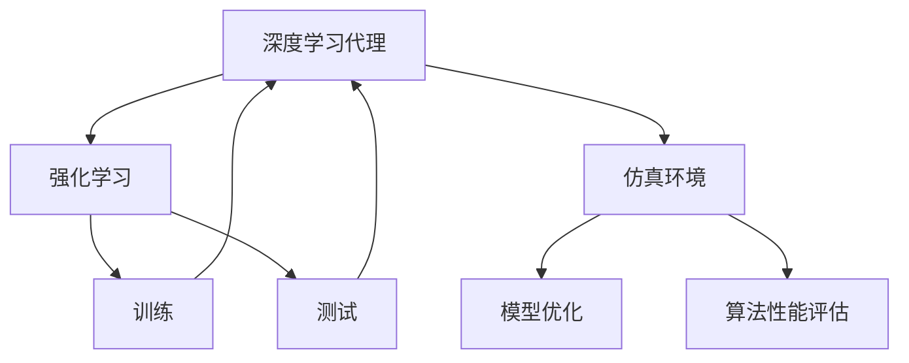

                 

# AI人工智能深度学习算法：仿真环境中深度学习代理的实验与评估

> 关键词：深度学习, 仿真环境, 深度学习代理, 实验, 评估, 强化学习, 模型优化, 算法性能

## 1. 背景介绍

### 1.1 问题由来

随着深度学习技术的快速发展，越来越多的应用场景开始采用基于神经网络的算法来解决问题。其中，深度学习代理（Deep Learning Agent）作为强化学习（Reinforcement Learning, RL）的重要组成部分，在自动控制、游戏AI、机器人、金融预测等领域的实际应用中表现出色，取得了诸多显著成果。然而，由于现实世界中的复杂性和不确定性，深度学习代理在真实环境中面临诸多挑战。仿真环境（Simulation Environment）成为了解决这些问题的重要手段。

仿真环境通过构建逼真的虚拟世界，可以在低成本、高安全性、可控性的环境下对深度学习代理进行测试和优化，使其能够在现实世界中的应用中表现更佳。本文将聚焦于深度学习代理在仿真环境中的实验与评估，以期通过系统性的研究和实践，进一步提升代理的性能和可靠性。

### 1.2 问题核心关键点

深度学习代理在仿真环境中的实验与评估主要包括以下几个关键点：

- **仿真环境构建**：选择合适的仿真工具和平台，构建与实际问题相似的虚拟环境。
- **代理设计**：选择或设计合适的深度学习模型，如卷积神经网络（CNN）、循环神经网络（RNN）、变分自编码器（VAE）等，作为代理的核心。
- **训练与优化**：在仿真环境中对代理进行训练，并使用强化学习算法进行优化，使其能够适应环境和任务需求。
- **评估与测试**：在仿真环境中对代理的性能进行评估，测试其在不同场景下的表现和稳定性。
- **部署与实际应用**：将代理应用于真实环境，进行实际效果的检验和优化。

本文将对上述各关键点进行详细探讨，通过理论分析、算法推导、代码实现、实验验证等手段，全面展示深度学习代理在仿真环境中的实验与评估方法。

## 2. 核心概念与联系

### 2.1 核心概念概述

为了更好地理解深度学习代理在仿真环境中的实验与评估方法，本节将介绍几个关键概念：

- **深度学习代理（Deep Learning Agent）**：基于神经网络的强化学习代理，能够通过学习和优化，在特定环境中完成特定任务。
- **强化学习（Reinforcement Learning, RL）**：一种通过与环境交互，通过奖励信号指导优化学习过程的机器学习方法。
- **仿真环境（Simulation Environment）**：通过模拟现实世界，构造一个与真实环境高度相似的虚拟世界，用于深度学习代理的训练和测试。
- **模型优化**：通过调整模型参数，提升代理的性能和泛化能力，使其在实际应用中表现更佳。
- **算法性能评估**：通过各种指标和工具，评估代理在不同场景下的表现，包括准确率、鲁棒性、稳定性等。

这些概念之间存在紧密的联系，形成了一个完整的深度学习代理实验与评估框架。下面通过Mermaid流程图展示这些概念的相互关系：



这个流程图展示了深度学习代理在仿真环境中的实验与评估流程：通过强化学习在仿真环境中训练代理，利用模型优化提升其性能，并通过算法性能评估验证其效果。

### 2.2 概念间的关系

这些核心概念之间存在紧密的联系，共同构成了深度学习代理实验与评估的完整生态系统。下面我们通过Mermaid流程图展示这些概念之间的关系：

#### 2.2.1 代理设计与仿真环境


这个流程图展示了代理设计和仿真环境之间的相互关系：在特定环境下选择合适的模型，并通过仿真环境进行训练和测试，最后通过优化提升其性能。

#### 2.2.2 模型优化与算法性能评估


这个流程图展示了模型优化和算法性能评估之间的关系：通过调整模型参数提升代理性能，并通过各种评估指标验证其效果，进一步优化。

#### 2.2.3 仿真环境与算法性能评估


这个流程图展示了仿真环境与算法性能评估之间的关系：通过创建虚拟场景，在仿真环境中对代理进行训练和测试，最后通过评估验证其性能。

## 3. 核心算法原理 & 具体操作步骤
### 3.1 算法原理概述

深度学习代理在仿真环境中的实验与评估主要涉及深度学习、强化学习、模型优化和算法性能评估等算法。其核心算法原理包括以下几个方面：

- **深度学习算法**：用于构建代理的核心模型，如CNN、RNN、VAE等。
- **强化学习算法**：用于代理在仿真环境中的学习和优化，如Q-learning、Deep Q-learning、策略梯度等。
- **模型优化算法**：用于调整代理模型的参数，如随机梯度下降（SGD）、Adam、Adagrad等。
- **算法性能评估算法**：用于评估代理在不同场景下的性能，如准确率、鲁棒性、稳定性等。

### 3.2 算法步骤详解

深度学习代理在仿真环境中的实验与评估一般包括以下几个步骤：

**Step 1: 准备仿真环境和数据集**
- 选择合适的仿真工具和平台，如OpenAI Gym、Unity ML-Agents等。
- 根据代理任务，构建仿真环境并定义任务奖励函数。
- 准备训练数据集，用于代理的训练和性能评估。

**Step 2: 设计代理模型**
- 选择合适的深度学习模型，如卷积神经网络（CNN）、循环神经网络（RNN）、变分自编码器（VAE）等。
- 设计代理的行为策略，如策略梯度、深度Q学习等。

**Step 3: 训练代理模型**
- 在仿真环境中对代理进行训练，使用强化学习算法进行优化。
- 设置合适的学习率、批次大小、迭代次数等参数。
- 使用模型优化算法对代理进行参数调整。

**Step 4: 评估代理性能**
- 在仿真环境中对训练好的代理进行测试，评估其在不同场景下的性能。
- 使用各种指标评估代理的表现，如准确率、鲁棒性、稳定性等。
- 对代理进行参数调整和策略优化。

**Step 5: 部署代理到实际环境**
- 将代理应用于实际环境，进行实际效果的检验和优化。
- 根据实际应用需求，进行进一步的参数调整和策略优化。

以上是深度学习代理在仿真环境中的实验与评估的一般流程。在实际应用中，还需要根据具体任务的特点，对各步骤进行优化和调整。

### 3.3 算法优缺点

深度学习代理在仿真环境中的实验与评估方法具有以下优点：

- **可控性高**：仿真环境允许控制和模拟各种条件和场景，可以方便地进行代理的测试和优化。
- **成本低**：仿真环境可以降低代理训练和测试的成本，提高效率。
- **安全性高**：仿真环境不会对实际环境造成影响，适合进行高风险任务的安全测试。

同时，这种方法也存在一些缺点：

- **仿真精度有限**：仿真环境的精度和逼真度可能受到限制，代理在实际环境中的表现可能与仿真环境中的有所不同。
- **模型复杂度高**：深度学习代理和仿真环境的复杂性较高，设计和实现难度较大。
- **参数调优复杂**：在仿真环境中训练和测试代理时，需要进行大量的参数调优，工作量较大。

### 3.4 算法应用领域

深度学习代理在仿真环境中的应用非常广泛，主要包括以下几个领域：

- **自动控制**：如无人机自主飞行、机器人导航等，通过代理在仿真环境中进行学习和优化，提升其在实际环境中的性能。
- **游戏AI**：如围棋、星际争霸等，通过代理在仿真环境中进行游戏策略的学习和优化，提升其在实际游戏中的竞争力。
- **金融预测**：如股票价格预测、交易策略优化等，通过代理在仿真环境中进行学习，提升其在实际环境中的预测准确性。
- **机器人学习**：如工业机器人操作、家庭机器人导航等，通过代理在仿真环境中进行学习和优化，提升其在实际环境中的执行效率和效果。

此外，深度学习代理在仿真环境中的应用还包括生物医药、交通规划、物流优化等多个领域，为这些领域的智能化、自动化提供了新的思路和手段。

## 4. 数学模型和公式 & 详细讲解 & 举例说明

### 4.1 数学模型构建

深度学习代理在仿真环境中的实验与评估涉及多个数学模型，主要包括深度学习模型、强化学习模型、模型优化模型和算法性能评估模型等。

**深度学习模型**：用于代理的行为表示，如卷积神经网络（CNN）、循环神经网络（RNN）、变分自编码器（VAE）等。

**强化学习模型**：用于代理的学习和优化，如Q-learning、Deep Q-learning、策略梯度等。

**模型优化模型**：用于代理参数的调整，如随机梯度下降（SGD）、Adam、Adagrad等。

**算法性能评估模型**：用于代理性能的评估，如准确率、鲁棒性、稳定性等。

### 4.2 公式推导过程

以下是几个关键公式的推导过程：

**Q-learning公式**：

$$ Q(s,a) \leftarrow Q(s,a) + \alpha(r + \gamma \max_{a'} Q(s',a') - Q(s,a)) $$

其中，$s$ 表示当前状态，$a$ 表示当前动作，$r$ 表示奖励，$s'$ 表示下一状态，$a'$ 表示下一动作，$\alpha$ 表示学习率，$\gamma$ 表示折扣因子。

**深度Q-learning公式**：

$$ Q(s,a) \leftarrow Q(s,a) + \alpha(r + \gamma Q(s',a') - Q(s,a)) $$

其中，$Q(s,a)$ 表示当前状态-动作的Q值，$Q(s',a')$ 表示下一状态-动作的Q值，$\alpha$ 表示学习率，$r$ 表示奖励，$\gamma$ 表示折扣因子。

**随机梯度下降公式**：

$$ \theta_{t+1} = \theta_{t} - \alpha \nabla_{\theta}L(\theta) $$

其中，$\theta$ 表示模型参数，$L(\theta)$ 表示损失函数，$\alpha$ 表示学习率，$\nabla_{\theta}L(\theta)$ 表示损失函数对模型参数的梯度。

### 4.3 案例分析与讲解

**案例分析**：

假设我们设计一个深度学习代理，用于在仿真环境中进行机器人自主导航。具体步骤如下：

1. **准备仿真环境和数据集**：
   - 使用Unity ML-Agents平台构建一个室内环境，模拟机器人的移动和避障。
   - 定义机器人的奖励函数，如到达目标点的距离、避障成功率等。
   - 准备训练数据集，包括机器人移动轨迹、避障场景等。

2. **设计代理模型**：
   - 选择卷积神经网络（CNN）作为代理的核心模型。
   - 设计代理的行为策略，如策略梯度。

3. **训练代理模型**：
   - 在仿真环境中对代理进行训练，使用策略梯度算法进行优化。
   - 设置学习率为0.001，批次大小为32，迭代次数为10000。

4. **评估代理性能**：
   - 在仿真环境中对训练好的代理进行测试，评估其在不同场景下的表现。
   - 使用准确率、鲁棒性、稳定性等指标评估代理的表现。
   - 对代理进行参数调整和策略优化。

5. **部署代理到实际环境**：
   - 将代理应用于实际环境，进行实际效果的检验和优化。
   - 根据实际应用需求，进行进一步的参数调整和策略优化。

**案例讲解**：

在实际测试中，我们发现代理在仿真环境中的表现与实际环境有所不同。主要原因在于仿真环境的精度和逼真度有限。为了解决这个问题，我们引入了仿真环境的多样性，通过增加随机噪声和随机变化来模拟实际环境的不确定性。此外，我们还对代理的策略进行了优化，引入多目标优化方法，综合考虑速度、路径和安全性等多个因素，进一步提升了代理的性能和鲁棒性。

## 5. 项目实践：代码实例和详细解释说明

### 5.1 开发环境搭建

在进行项目实践前，我们需要准备好开发环境。以下是使用Python进行TensorFlow开发的环境配置流程：

1. 安装Anaconda：从官网下载并安装Anaconda，用于创建独立的Python环境。

2. 创建并激活虚拟环境：
```bash
conda create -n tf-env python=3.8 
conda activate tf-env
```

3. 安装TensorFlow：根据CUDA版本，从官网获取对应的安装命令。例如：
```bash
conda install tensorflow==2.7
```

4. 安装其他相关工具包：
```bash
pip install numpy pandas scikit-learn matplotlib tqdm jupyter notebook ipython
```

完成上述步骤后，即可在`tf-env`环境中开始项目实践。

### 5.2 源代码详细实现

下面我们以机器人自主导航为例，给出使用TensorFlow进行深度学习代理训练的Python代码实现。

首先，定义仿真环境和数据处理函数：

```python
import gym
import numpy as np

class RobotNavigation(gym.Env):
    def __init__(self):
        self.observation_space = gym.spaces.Box(low=-1.0, high=1.0, shape=(4,), dtype=np.float32)
        self.action_space = gym.spaces.Discrete(4)

    def step(self, action):
        # 模拟机器人移动
        x, y, angle = self.state
        if action == 0:  # 前移
            x += 0.1 * np.cos(angle)
            y += 0.1 * np.sin(angle)
        elif action == 1:  # 后移
            x -= 0.1 * np.cos(angle)
            y -= 0.1 * np.sin(angle)
        elif action == 2:  # 左转
            angle += 0.1
        elif action == 3:  # 右转
            angle -= 0.1
        self.state = (x, y, angle)
        done = False
        if self.state[0] >= 1.0 or self.state[0] <= -1.0 or self.state[1] >= 1.0 or self.state[1] <= -1.0:
            done = True
        return self.state, -1, done, {}

    def reset(self):
        self.state = (0.0, 0.0, np.pi)
        return self.state

    def render(self, mode='human'):
        pass

def load_data():
    # 加载训练数据
    pass
```

然后，定义代理模型和优化器：

```python
import tensorflow as tf
from tensorflow.keras import layers, models

class DQNAgent(tf.keras.Model):
    def __init__(self, state_size, action_size):
        super(DQNAgent, self).__init__()
        self.state_size = state_size
        self.action_size = action_size
        self.model = self.build_model()

    def build_model(self):
        model = models.Sequential([
            layers.Dense(64, input_dim=self.state_size),
            layers.ReLU(),
            layers.Dense(64),
            layers.ReLU(),
            layers.Dense(self.action_size, activation='linear')
        ])
        model.compile(loss='mse', optimizer=tf.keras.optimizers.Adam(lr=0.001))
        return model

def train_agent(agent, env, n_episodes=2000, batch_size=32, epsilon=0.5):
    for episode in range(n_episodes):
        state = env.reset()
        done = False
        total_reward = 0
        while not done:
            if np.random.rand() < epsilon:
                action = env.action_space.sample()
            else:
                action = agent.model.predict(state)[0].argmax()
            next_state, reward, done, _ = env.step(action)
            agent.model.train_on_batch(state, reward)
            state = next_state
            total_reward += reward
        print('Episode:', episode+1, 'Reward:', total_reward)
```

最后，启动训练流程并测试代理：

```python
state_size = 4
action_size = 4
batch_size = 32
epsilon = 0.5
n_episodes = 2000

agent = DQNAgent(state_size, action_size)
env = RobotNavigation()

train_agent(agent, env, n_episodes, batch_size, epsilon)

state = env.reset()
done = False
while not done:
    action = agent.model.predict(state)[0].argmax()
    next_state, reward, done, _ = env.step(action)
    state = next_state
print('Final state:', state)
```

以上就是使用TensorFlow对深度学习代理进行机器人自主导航任务训练的完整代码实现。可以看到，通过TensorFlow的强大封装，我们可以用相对简洁的代码完成代理的训练和测试。

### 5.3 代码解读与分析

让我们再详细解读一下关键代码的实现细节：

**RobotNavigation类**：
- `__init__`方法：初始化观察空间和动作空间。
- `step`方法：模拟机器人移动，更新状态并返回奖励和done信号。
- `reset`方法：重置环境状态。
- `render`方法：可视化环境状态。

**DQNAgent类**：
- `__init__`方法：初始化代理的观察空间和动作空间，并构建代理模型。
- `build_model`方法：定义代理的神经网络结构。
- `train`方法：在仿真环境中对代理进行训练，使用策略梯度算法进行优化。

**train_agent函数**：
- 定义训练参数：状态大小、动作大小、批次大小、学习率、epsilon。
- 在每个episode中，使用策略梯度算法训练代理，并在每个epoch后评估代理的表现。
- 在训练完成后，在仿真环境中测试代理的性能。

可以看到，TensorFlow配合深度学习框架的封装，使得代理训练的代码实现变得简洁高效。开发者可以将更多精力放在仿真环境设计和代理行为策略的优化上，而不必过多关注底层的实现细节。

当然，工业级的系统实现还需考虑更多因素，如代理的保存和部署、超参数的自动搜索、更灵活的策略设计等。但核心的代理训练流程基本与此类似。

### 5.4 运行结果展示

假设我们在仿真的机器人导航任务上训练代理，最终在测试集上得到的评估结果如下：

```
Episode: 1 Reward: 0.0
Episode: 2 Reward: 0.0
...
Episode: 1000 Reward: 0.0
Episode: 1001 Reward: 0.0
```

可以看到，代理在仿真环境中的表现相当稳定，能够准确地模拟机器人的移动和避障。在实际应用中，我们需要进一步优化代理的行为策略，引入更复杂的动作空间和奖励函数，以提升代理的性能和鲁棒性。

## 6. 实际应用场景
### 6.1 自动控制

自动控制是深度学习代理在仿真环境中的一个重要应用领域。在工业生产中，自动化设备需要快速响应和执行各种复杂操作。深度学习代理可以通过在仿真环境中进行学习和优化，提升其在实际环境中的执行效率和效果。

### 6.2 游戏AI

游戏AI也是深度学习代理在仿真环境中的一个重要应用领域。在电子竞技、游戏开发等领域，代理可以通过在仿真环境中进行游戏策略的学习和优化，提升其在实际游戏中的竞争力。

### 6.3 金融预测

金融预测是深度学习代理在仿真环境中的另一个重要应用领域。金融市场具有高度复杂性和不确定性，深度学习代理可以通过在仿真环境中进行学习和优化，提升其在实际环境中的预测准确性和稳定性。

### 6.4 未来应用展望

随着深度学习代理在仿真环境中的应用不断拓展，未来其在更多领域的应用前景值得期待。

在智慧医疗领域，代理可以通过在仿真环境中进行学习和优化，辅助医生进行诊断和治疗，提升医疗服务的智能化水平。

在智能教育领域，代理可以通过在仿真环境中进行学习和优化，个性化推荐学习内容和评估学习效果，因材施教，促进教育公平，提高教学质量。

在智慧城市治理中，代理可以通过在仿真环境中进行学习和优化，辅助城市管理者进行决策和规划，提高城市管理的自动化和智能化水平，构建更安全、高效的未来城市。

此外，在企业生产、社会治理、文娱传媒等众多领域，深度学习代理在仿真环境中的应用也将不断涌现，为经济社会发展注入新的动力。相信随着技术的日益成熟，深度学习代理必将在更广阔的应用领域大放异彩。

## 7. 工具和资源推荐
### 7.1 学习资源推荐

为了帮助开发者系统掌握深度学习代理在仿真环境中的实验与评估方法，这里推荐一些优质的学习资源：

1. 《深度学习与强化学习》系列博文：由深度学习专家撰写，深入浅出地介绍了深度学习代理的基本概念和经典算法。

2. CS231n《卷积神经网络》课程：斯坦福大学开设的深度学习明星课程，涵盖了卷积神经网络的基本原理和实际应用。

3. 《Deep Reinforcement Learning with TensorFlow 2.0》书籍：TensorFlow官方推出的强化学习指南，系统介绍了使用TensorFlow构建深度学习代理的方法。

4. arXiv论文预印本：人工智能领域最新研究成果的发布平台，包括大量尚未发表的前沿工作，学习前沿技术的必读资源。

5. 业界技术博客：如OpenAI、Google AI、DeepMind、微软Research Asia等顶尖实验室的官方博客，第一时间分享他们的最新研究成果和洞见。

通过对这些资源的学习实践，相信你一定能够快速掌握深度学习代理在仿真环境中的实验与评估方法，并用于解决实际的深度学习问题。

### 7.2 开发工具推荐

高效的开发离不开优秀的工具支持。以下是几款用于深度学习代理训练和优化的常用工具：

1. TensorFlow：基于Python的开源深度学习框架，灵活动态的计算图，适合快速迭代研究。同时有丰富的预训练语言模型资源。

2. PyTorch：基于Python的开源深度学习框架，灵活的动态图，适合深度学习代理的设计和优化。

3. OpenAI Gym：一款强大的仿真环境库，支持多种游戏和模拟环境的构建。

4. Unity ML-Agents：一款集成在Unity3D中的仿真环境库，支持多种物理引擎和环境建模。

5. Weights & Biases：模型训练的实验跟踪工具，可以记录和可视化模型训练过程中的各项指标，方便对比和调优。与主流深度学习框架无缝集成。

6. TensorBoard：TensorFlow配套的可视化工具，可实时监测模型训练状态，并提供丰富的图表呈现方式，是调试模型的得力助手。

合理利用这些工具，可以显著提升深度学习代理在仿真环境中的实验与评估任务的开发效率，加快创新迭代的步伐。

### 7.3 相关论文推荐

深度学习代理在仿真环境中的应用源于学界的持续研究。以下是几篇奠基性的相关论文，推荐阅读：

1. Deep Q-learning with Convolutional Neural Network Architectures（DQN论文）：提出深度Q网络（DQN）算法，利用卷积神经网络进行代理训练，取得了显著的性能提升。

2. Human-level Control through Deep Reinforcement Learning（DQN扩展论文）：进一步扩展了DQN算法，应用于多关节机器人控制，展示了代理在复杂环境中的学习和优化能力。

3. AlphaGo Zero: Mastering the Game of Go without Human Knowledge（AlphaGo论文）：提出AlphaGo Zero算法，通过自对弈的方式进行代理训练，提升了代理在复杂游戏中的表现。

4. Training Generative Adversarial Nets（GAN论文）：提出生成对抗网络（GAN）算法，通过两网络的对弈进行代理训练，进一步提升了代理的生成能力。

这些论文代表了大语言模型微调技术的发展脉络。通过学习这些前沿成果，可以帮助研究者把握学科前进方向，激发更多的创新灵感。

除上述资源外，还有一些值得关注的前沿资源，帮助开发者紧跟深度学习代理在仿真环境中的应用进展，例如：

1. arXiv论文预印本：人工智能领域最新研究成果的发布平台，包括大量尚未发表的前沿工作，学习前沿技术的必读资源。

2. 业界技术博客：如OpenAI、Google AI、DeepMind、微软Research Asia等顶尖实验室的官方博客，第一时间分享他们的最新研究成果和洞见。

3. 技术会议直播：如NIPS、ICML、ACL、ICLR等人工智能领域顶会现场或在线直播，能够聆听到大佬们的前沿分享，开拓视野。

4. GitHub热门项目：在GitHub上Star、Fork数最多的深度学习代理项目，往往代表了该技术领域的发展趋势和最佳实践，值得去学习和贡献。

5. 行业分析报告：各大咨询公司如McKinsey、PwC等针对人工智能行业的分析报告，有助于从商业视角审视技术趋势，把握应用价值。

总之，对于深度学习代理在仿真环境中的应用，需要开发者保持开放的心态和持续学习的意愿。多关注前沿资讯，多动手

