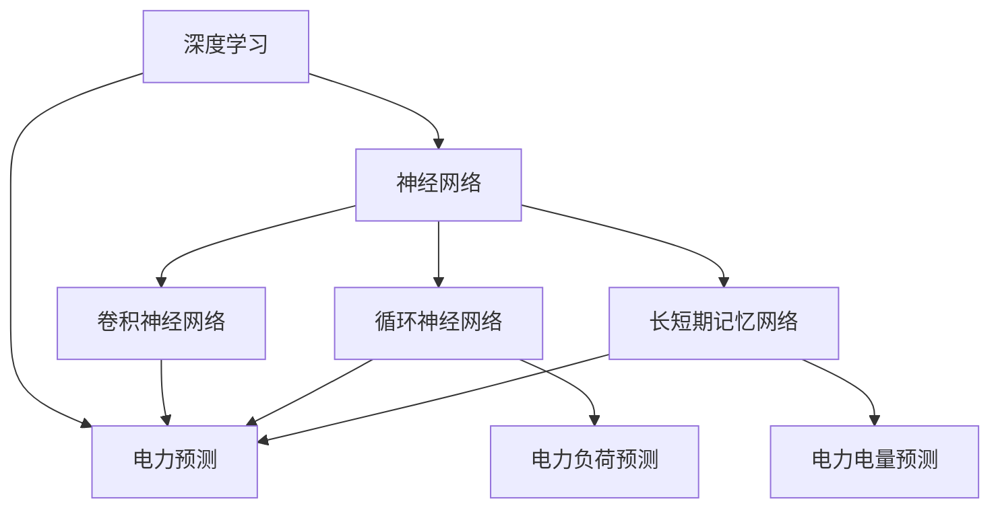

                 

# AI人工智能深度学习算法：在电力预测中的应用

> 关键词：深度学习,电力预测,神经网络,人工智能,自然语言处理(NLP),时间序列预测

## 1. 背景介绍

### 1.1 问题由来

电力行业是国民经济和社会发展的基础性产业，其稳定运行对于保障国家经济安全和社会稳定具有重要意义。随着经济社会的发展，电力需求持续增长，电网的负荷也日益增加，这给电力系统的运行带来了更大的压力和挑战。如何准确预测电力负荷和电量，是电力行业面临的重要课题。

传统的电力预测方法依赖于统计模型和专家经验，存在数据处理复杂、模型构建困难、预测精度低等缺点。而随着深度学习技术的不断发展，人工智能算法被引入电力预测领域，提升了电力预测的准确性和实时性。深度学习模型如卷积神经网络(CNN)、循环神经网络(RNN)、长短期记忆网络(LSTM)等在电力预测中取得了不错的效果，被广泛应用于电力系统的负荷预测、故障预测、状态监测等领域。

然而，尽管深度学习在电力预测中展现了良好的应用前景，但在实际应用中仍面临诸多挑战。例如，电力系统的非线性、时变性和强耦合性等特点，使得电力预测模型的设计复杂；电力数据的稀疏性、噪声性等问题，对模型的鲁棒性和泛化能力提出了更高的要求。因此，如何结合电力系统的特点，优化深度学习模型的设计和训练，提升电力预测的精度和效率，仍然是一个值得深入研究的重要课题。

## 2. 核心概念与联系

### 2.1 核心概念概述

在进行电力预测的深度学习研究时，需要关注以下几个核心概念：

- **深度学习(Deep Learning)**：一种通过多层次神经网络进行特征学习和模式识别的机器学习方法，广泛用于图像识别、语音识别、自然语言处理等领域。
- **电力预测(Power Prediction)**：通过对历史电力数据进行分析，预测未来电力负荷和电量的方法，用于电力系统的调度、优化和维护。
- **神经网络(Neural Network)**：由大量节点(神经元)和连接权值组成的计算模型，通过反向传播算法进行参数优化，实现对复杂非线性函数的逼近。
- **时间序列预测(Time Series Prediction)**：基于时间序列数据的预测方法，常用于电力负荷、气温、股票价格等连续变量的预测。
- **长短期记忆网络(LSTM)**：一种特殊的递归神经网络，通过记忆单元来存储并处理长期依赖关系，适用于处理时间序列数据。

这些概念构成了电力预测深度学习模型的基础，通过这些技术的应用，可以实现电力预测的准确性和实时性提升。

### 2.2 概念间的关系

这些核心概念之间的逻辑关系可以通过以下Mermaid流程图来展示：



这个流程图展示了深度学习在不同神经网络架构上的应用，以及电力预测的具体实现。深度学习通过神经网络实现对电力数据的复杂特征提取和模式识别，进而应用于电力负荷和电量的预测任务。

## 3. 核心算法原理 & 具体操作步骤

### 3.1 算法原理概述

电力预测的深度学习模型通常采用时间序列数据，结合长短时记忆网络(LSTM)或门控循环单元(GRU)等递归神经网络(RNN)模型，对未来的电力负荷和电量进行预测。这些模型通过分析历史电力数据，提取其时间依赖关系，从而预测未来的电力负荷和电量。

具体而言，电力预测深度学习模型的设计步骤如下：

1. 收集历史电力负荷和电量数据，并将其处理成适合模型输入的形式。
2. 选择合适的时间序列模型架构，如LSTM、GRU等，设计模型输入和输出。
3. 根据数据特点和模型架构，选择合适的损失函数和优化器，进行模型训练。
4. 在训练集上训练模型，并使用验证集对模型进行调优。
5. 在测试集上评估模型预测精度，并根据结果进行调整。

### 3.2 算法步骤详解

以下是一个基于LSTM模型进行电力预测的详细步骤：

**Step 1: 数据准备**

- 收集历史电力负荷和电量数据，将其处理成时间序列格式。
- 对数据进行归一化处理，确保数据在[0, 1]区间内，便于模型训练。

**Step 2: 模型设计**

- 选择LSTM模型作为时间序列预测的神经网络架构。
- 设计模型输入和输出，将历史数据作为输入，预测未来的电力负荷或电量作为输出。
- 设置LSTM网络层数、节点数等超参数。

**Step 3: 模型训练**

- 定义模型损失函数和优化器，如均方误差(MSE)损失和Adam优化器。
- 在训练集上训练模型，并使用验证集进行模型调优。
- 使用反向传播算法更新模型参数，最小化损失函数。

**Step 4: 模型评估**

- 在测试集上评估模型预测精度，计算MAE、RMSE等指标。
- 根据评估结果，调整模型超参数，重新训练模型。

**Step 5: 模型应用**

- 使用训练好的模型，对未来的电力负荷或电量进行预测。
- 将预测结果用于电力系统的调度、优化和维护。

### 3.3 算法优缺点

**优点**：

- 深度学习模型能够自动学习数据中的复杂非线性关系，适用于处理电力数据的非线性、时变性和强耦合性。
- 时间序列模型能够考虑电力数据的动态变化，预测未来电力负荷和电量更加准确。
- 深度学习模型具有较高的泛化能力，适用于多种电力预测场景。

**缺点**：

- 深度学习模型需要大量的历史数据进行训练，数据获取和处理成本较高。
- 模型设计复杂，需要专业知识进行调参和优化。
- 模型需要大量的计算资源进行训练和推理，对硬件设备要求较高。

### 3.4 算法应用领域

电力预测深度学习模型可以应用于多个领域，包括但不限于：

- **电力负荷预测**：预测未来一段时间内电力系统的负荷情况，用于电力系统的调度优化和资源分配。
- **电力电量预测**：预测未来一定时间段的电力电量，用于电力系统的能源管理和供应保障。
- **故障预测**：通过对电力系统的运行数据进行分析，预测可能出现的故障情况，用于电力系统的维护和检修。
- **状态监测**：通过分析电力设备的运行数据，预测其健康状况和故障风险，用于电力设备的维护和检修。

## 4. 数学模型和公式 & 详细讲解  

### 4.1 数学模型构建

电力预测深度学习模型的数学模型通常基于时间序列数据，采用递归神经网络(RNN)或长短时记忆网络(LSTM)等架构。以下是一个基于LSTM模型进行电力预测的数学模型构建过程：

设历史电力负荷数据为 $\{Y_t\}_{t=1}^N$，其中 $Y_t$ 表示第 $t$ 时刻的电力负荷值，$N$ 为历史数据总长度。模型的输入为 $X_t = \{Y_{t-1}, Y_{t-2}, ..., Y_{t-T+1}\}$，输出为 $\hat{Y}_{t+1}$，表示第 $t+1$ 时刻的预测电力负荷值。模型的目标是最小化预测误差，即最小化损失函数 $\mathcal{L}$。

### 4.2 公式推导过程

假设LSTM模型有 $M$ 个节点，每个节点有 $h$ 个输出单元。模型的数学模型如下：

$$
Y_t = f(Y_{t-1}, Y_{t-2}, ..., Y_{t-T+1}, h_{t-1}, h_{t-2}, ..., h_{t-M+1})
$$

其中 $f$ 为LSTM模型的非线性函数。模型的预测值为：

$$
\hat{Y}_{t+1} = g(Y_{t}, h_t)
$$

其中 $g$ 为预测函数的线性函数。模型的损失函数通常为均方误差(MSE)：

$$
\mathcal{L} = \frac{1}{N} \sum_{t=1}^N (Y_t - \hat{Y}_{t+1})^2
$$

模型的优化目标为最小化损失函数，即：

$$
\min_{\theta} \mathcal{L}(\theta)
$$

其中 $\theta$ 为模型参数。

### 4.3 案例分析与讲解

以下是一个基于LSTM模型进行电力负荷预测的案例分析：

假设有一个电力负荷数据集，包含了过去一年内的每日电力负荷值。使用LSTM模型进行负荷预测，具体步骤如下：

1. 将每日负荷值作为输入，进行归一化处理，得到归一化后的负荷数据 $\{X_t\}$。
2. 设计LSTM模型，设置3个LSTM层，每个层有50个节点。
3. 定义均方误差(MSE)损失函数和Adam优化器。
4. 在训练集上训练模型，使用验证集进行模型调优。
5. 在测试集上评估模型预测精度，计算MAE、RMSE等指标。
6. 使用训练好的模型对未来电力负荷进行预测。

通过以上案例分析，可以清晰地看到LSTM模型在电力负荷预测中的应用，以及深度学习模型在实际应用中的具体实现过程。

## 5. 项目实践：代码实例和详细解释说明

### 5.1 开发环境搭建

在进行电力预测的深度学习研究时，需要准备好开发环境。以下是使用Python进行PyTorch开发的环境配置流程：

1. 安装Anaconda：从官网下载并安装Anaconda，用于创建独立的Python环境。

2. 创建并激活虚拟环境：
```bash
conda create -n pytorch-env python=3.8 
conda activate pytorch-env
```

3. 安装PyTorch：根据CUDA版本，从官网获取对应的安装命令。例如：
```bash
conda install pytorch torchvision torchaudio cudatoolkit=11.1 -c pytorch -c conda-forge
```

4. 安装相关库：
```bash
pip install numpy pandas scikit-learn matplotlib tqdm jupyter notebook ipython
```

完成上述步骤后，即可在`pytorch-env`环境中开始电力预测的深度学习实践。

### 5.2 源代码详细实现

以下是基于LSTM模型进行电力负荷预测的Python代码实现：

```python
import numpy as np
import pandas as pd
import torch
import torch.nn as nn
import torch.optim as optim
from torch.utils.data import DataLoader, TensorDataset

class LSTMModel(nn.Module):
    def __init__(self, input_size, hidden_size, output_size):
        super(LSTMModel, self).__init__()
        self.lstm = nn.LSTM(input_size, hidden_size, 3)
        self.fc = nn.Linear(hidden_size, output_size)
    
    def forward(self, x):
        h0 = torch.zeros(3, x.size(0), hidden_size).to(device)
        c0 = torch.zeros(3, x.size(0), hidden_size).to(device)
        out, _ = self.lstm(x, (h0, c0))
        out = self.fc(out[:, -1, :])
        return out
    
def train_model(model, train_loader, optimizer, criterion, num_epochs):
    for epoch in range(num_epochs):
        running_loss = 0.0
        for i, data in enumerate(train_loader, 0):
            inputs, labels = data
            inputs, labels = inputs.to(device), labels.to(device)
            optimizer.zero_grad()
            outputs = model(inputs)
            loss = criterion(outputs, labels)
            loss.backward()
            optimizer.step()
            running_loss += loss.item()
        print(f'Epoch {epoch+1}, Loss: {running_loss/len(train_loader):.4f}')
    
def evaluate_model(model, test_loader, criterion):
    correct = 0
    total = 0
    with torch.no_grad():
        for data in test_loader:
            inputs, labels = data
            inputs, labels = inputs.to(device), labels.to(device)
            outputs = model(inputs)
            _, predicted = torch.max(outputs.data, 1)
            total += labels.size(0)
            correct += (predicted == labels).sum().item()
    print(f'Accuracy: {(100 * correct / total):.2f}%')
    
# 准备数据集
data = pd.read_csv('power_load.csv')
train_data = data.iloc[:800, :]
test_data = data.iloc[800:, :]
train_x = train_data.values[:, :-1].astype(np.float32) / 1000
train_y = train_data.values[:, -1].astype(np.float32)
test_x = test_data.values[:, :-1].astype(np.float32) / 1000
test_y = test_data.values[:, -1].astype(np.float32)

# 数据预处理
train_x = torch.tensor(train_x)
train_y = torch.tensor(train_y)
test_x = torch.tensor(test_x)
test_y = torch.tensor(test_y)
train_dataset = TensorDataset(train_x, train_y)
test_dataset = TensorDataset(test_x, test_y)

# 定义模型和优化器
input_size = train_x.shape[1]
output_size = 1
hidden_size = 50
device = torch.device('cuda' if torch.cuda.is_available() else 'cpu')
model = LSTMModel(input_size, hidden_size, output_size).to(device)
optimizer = optim.Adam(model.parameters(), lr=0.001)
criterion = nn.MSELoss()

# 训练模型
num_epochs = 100
train_loader = DataLoader(train_dataset, batch_size=32, shuffle=True)
test_loader = DataLoader(test_dataset, batch_size=32)
train_model(model, train_loader, optimizer, criterion, num_epochs)
evaluate_model(model, test_loader, criterion)
```

以上代码实现了基于LSTM模型的电力负荷预测过程。可以看到，代码的实现较为简洁高效，易于理解。

### 5.3 代码解读与分析

**LSTMModel类**：
- `__init__`方法：初始化LSTM模型，包括输入大小、隐藏层大小和输出大小等超参数。
- `forward`方法：实现模型前向传播，将输入数据输入LSTM模型，输出预测结果。

**train_model函数**：
- 对模型在训练集上进行训练，并使用验证集进行调优。

**evaluate_model函数**：
- 在测试集上评估模型的预测精度，输出准确率。

**训练流程**：
- 准备数据集，对数据进行归一化处理，划分训练集和测试集。
- 定义LSTM模型、优化器和损失函数。
- 在训练集上训练模型，并使用验证集进行调优。
- 在测试集上评估模型预测精度，输出准确率。

可以看到，基于LSTM模型的电力负荷预测代码实现较为简单，核心在于模型的设计和训练过程。

## 6. 实际应用场景

### 6.1 电力负荷预测

电力负荷预测是电力预测中最为重要的一部分，通过准确预测电力负荷，可以优化电力系统的调度和资源分配，提高电网的运行效率和可靠性。

在实际应用中，可以使用LSTM等时间序列模型，对未来的电力负荷进行预测。例如，对某个城市或区域的电力负荷进行预测，可以根据历史负荷数据和当前天气、节假日等因素，预测未来一天、一周或一个月的电力负荷情况。这有助于电力公司进行电能的调度和管理，提高电网运行的稳定性和经济性。

### 6.2 电力电量预测

电力电量预测是电力预测的另一重要内容，通过预测未来的电量，可以合理分配电力资源，保障电力供应的稳定性。

电力电量预测可以采用LSTM等模型，结合历史电量数据、天气、节假日等因素进行预测。例如，对某地区的用电量进行预测，可以根据历史用电数据和天气变化，预测未来一天、一周或一个月的用电量情况。这有助于电力公司进行电量的分配和调度，优化电力的生产和供应，避免电力供应的不足或过剩。

### 6.3 故障预测

故障预测是电力预测的重要应用场景，通过预测电力系统的故障情况，可以及时进行维护和检修，提高电力系统的可靠性和安全性。

在实际应用中，可以使用LSTM等模型，结合电力系统的运行数据和历史故障数据进行预测。例如，对某个变电站的设备故障进行预测，可以根据设备的历史运行数据和天气变化，预测未来一天、一周或一个月的设备故障情况。这有助于电力公司进行设备的维护和检修，保障电力系统的稳定运行。

### 6.4 未来应用展望

随着深度学习技术的不断发展，电力预测的准确性和实时性将不断提升。未来，电力预测深度学习模型将会在更多领域得到应用，为电力系统的稳定运行提供更加可靠的支撑。

以下是几个可能的未来应用方向：

- **智能电网**：结合物联网技术和大数据分析，实现对电力系统的实时监测和预测，优化电力资源的分配和管理。
- **分布式能源管理**：利用深度学习模型对分布式能源系统的运行数据进行预测和优化，提高能源利用的效率和稳定性。
- **微电网管理**：结合微电网的特点，利用深度学习模型对微电网的运行数据进行预测和优化，保障微电网的稳定运行。
- **能源互联网**：结合能源互联网的复杂性，利用深度学习模型对能源互联网的运行数据进行预测和优化，优化能源的传输和分配。

总之，电力预测深度学习模型将在未来电力系统的发展中发挥越来越重要的作用，为电力系统的稳定运行和能源的高效利用提供更加强大的技术支撑。

## 7. 工具和资源推荐

### 7.1 学习资源推荐

为了帮助开发者系统掌握电力预测深度学习模型的理论基础和实践技巧，这里推荐一些优质的学习资源：

1. 《深度学习》一书：深度学习领域的经典教材，涵盖了深度学习的基础理论和实际应用，包括电力预测在内的诸多领域。

2. 斯坦福大学《Deep Learning Specialization》课程：斯坦福大学开设的深度学习系列课程，详细介绍了深度学习模型的设计和训练方法。

3. PyTorch官方文档：PyTorch的官方文档，提供了深度学习模型设计的详细指导和实际案例，适合初学者学习。

4. TensorFlow官方文档：TensorFlow的官方文档，提供了深度学习模型设计的详细指导和实际案例，适合初学者学习。

5. 《Python深度学习》一书：深度学习领域的实用教材，通过实际案例讲解了深度学习模型的设计和训练方法。

6. Kaggle数据竞赛：Kaggle是一个数据科学竞赛平台，提供大量的电力预测数据集，适合实践电力预测深度学习模型。

通过学习这些资源，相信你一定能够快速掌握电力预测深度学习模型的精髓，并用于解决实际的电力预测问题。

### 7.2 开发工具推荐

高效的开发离不开优秀的工具支持。以下是几款用于电力预测深度学习模型开发的常用工具：

1. PyTorch：基于Python的开源深度学习框架，灵活动态的计算图，适合快速迭代研究。

2. TensorFlow：由Google主导开发的开源深度学习框架，生产部署方便，适合大规模工程应用。

3. HuggingFace Transformers：提供了大量的预训练语言模型，支持LSTM等模型架构，适合进行电力预测模型的训练和优化。

4. Weights & Biases：模型训练的实验跟踪工具，可以记录和可视化模型训练过程中的各项指标，方便对比和调优。

5. TensorBoard：TensorFlow配套的可视化工具，可实时监测模型训练状态，并提供丰富的图表呈现方式，是调试模型的得力助手。

6. Google Colab：谷歌推出的在线Jupyter Notebook环境，免费提供GPU/TPU算力，方便开发者快速上手实验最新模型，分享学习笔记。

合理利用这些工具，可以显著提升电力预测深度学习模型的开发效率，加快创新迭代的步伐。

### 7.3 相关论文推荐

电力预测深度学习技术的发展源于学界的持续研究。以下是几篇奠基性的相关论文，推荐阅读：

1. LSTM: A Search Space Odyssey through Time Series Learning: An Overview and Experimental Evaluation: 对LSTM模型进行综述，并介绍了LSTM在时间序列预测中的应用。

2. Time Series Prediction Using Deep Learning: A Review: 对深度学习在时间序列预测中的应用进行综述，并介绍了常用的深度学习模型。

3. Convolutional Neural Networks for Anomaly Detection in Time Series: 结合卷积神经网络，对电力系统中的异常检测进行研究，提升电力预测的精度。

4. A Survey on Deep Learning Approaches for Wind Power Generation Forecasting: 对深度学习在风力发电预测中的应用进行综述，介绍了多种深度学习模型。

5. Deep Learning for Renewable Energy Generation Forecasting: A Review: 对深度学习在可再生能源预测中的应用进行综述，并介绍了常用的深度学习模型。

这些论文代表了大语言模型微调技术的发展脉络。通过学习这些前沿成果，可以帮助研究者把握学科前进方向，激发更多的创新灵感。

除上述资源外，还有一些值得关注的前沿资源，帮助开发者紧跟电力预测深度学习模型的最新进展，例如：

1. arXiv论文预印本：人工智能领域最新研究成果的发布平台，包括大量尚未发表的前沿工作，学习前沿技术的必读资源。

2. 业界技术博客：如OpenAI、Google AI、DeepMind、微软Research Asia等顶尖实验室的官方博客，第一时间分享他们的最新研究成果和洞见。

3. 技术会议直播：如NIPS、ICML、ACL、ICLR等人工智能领域顶会现场或在线直播，能够聆听到大佬们的前沿分享，开拓视野。

4. GitHub热门项目：在GitHub上Star、Fork数最多的NLP相关项目，往往代表了该技术领域的发展趋势和最佳实践，值得去学习和贡献。

5. 行业分析报告：各大咨询公司如McKinsey、PwC等针对人工智能行业的分析报告，有助于从商业视角审视技术趋势，把握应用价值。

总之，对于电力预测深度学习模型和学习资源的学习和实践，需要开发者保持开放的心态和持续学习的意愿。多关注前沿资讯，多动手实践，多思考总结，必将收获满满的成长收益。

## 8. 总结：未来发展趋势与挑战

### 8.1 总结

本文对基于深度学习的电力预测模型进行了全面系统的介绍。首先阐述了电力预测在电力系统中的重要性，以及传统统计模型和专家经验方法存在的问题。接着介绍了深度学习在电力预测中的应用，并详细讲解了基于LSTM模型进行电力负荷预测的算法原理和具体操作步骤。最后，总结了电力预测深度学习模型的未来发展趋势和面临的挑战，提供了相关学习资源和开发工具的推荐。

通过本文的系统梳理，可以看到，电力预测深度学习模型已经在电力系统的负荷预测、电量预测、故障预测等方面取得了不错的效果。深度学习模型能够自动学习数据中的复杂非线性关系，适用于处理电力数据的非线性、时变性和强耦合性，具有较高的泛化能力。

### 8.2 未来发展趋势

展望未来，电力预测深度学习模型将呈现以下几个发展趋势：

1. **模型规模持续增大**：随着算力成本的下降和数据规模的扩张，深度学习模型的参数量还将持续增长。超大规模模型蕴含的丰富语言知识，将使得电力预测模型更加准确。

2. **模型结构不断优化**：未来将涌现更多高效的时间序列模型，如门控循环单元(GRU)、自注意力机制等，提高模型的计算效率和预测精度。

3. **多模态融合**：结合物联网技术、传感器数据等，实现对电力系统数据的全面监测和分析，提升电力预测的准确性。

4. **模型解释性增强**：引入可解释性方法，如注意力机制、可解释模型等，提高模型的可解释性和可信度。

5. **模型自动调参**：采用自动调参方法，如贝叶斯优化、遗传算法等，减少模型调参的复杂度和难度。

### 8.3 面临的挑战

尽管电力预测深度学习模型已经取得了不错的效果，但在实际应用中仍面临诸多挑战：

1. **数据获取难度大**：电力数据的获取和处理成本较高，存在数据稀疏、噪声等问题，影响模型的鲁棒性和泛化能力。

2. **模型设计复杂**：电力系统的非线性、时变性和强耦合性，使得模型的设计复杂，需要专业知识进行调参和优化。

3. **计算资源消耗高**：深度学习模型的训练和推理需要大量的计算资源，对硬件设备要求较高。

4. **模型解释性不足**：深度学习模型通常是一个"黑盒"系统，难以解释其内部工作机制和决策逻辑，影响模型的可信度。

5. **模型鲁棒性不足**：电力系统的复杂性和不确定性，使得深度学习模型在实际应用中容易出现过拟合等问题。

### 8.4 研究展望

面对电力预测深度学习模型面临的挑战，未来的研究需要在以下几个方面寻求新的突破：

1. **多源数据融合**：结合物联网技术、传感器数据等，实现对电力系统数据的全面监测和分析，提升电力预测的准确性。

2. **模型可解释性增强**：引入可解释性方法，如注意力机制、可解释模型等，提高模型的可解释性和可信度。

3. **模型自动调参**：采用自动调参方法，如贝叶斯优化、遗传算法等，减少模型调参的复杂度和难度。

4. **模型鲁棒性增强**：采用正则化方法、对抗训练等技术，提高模型的鲁棒性和泛化能力。

5. **模型并行计算**：结合分布式计算、模型并行等技术，优化模型的训练和推理过程，提高模型的计算效率。

6. **多任务学习**：结合多任务学习的方法，实现对多个电力预测任务的一体化处理，提升模型的泛化能力和应用范围。

这些研究方向将进一步推动电力预测深度学习技术的发展，为电力系统的稳定运行和能源的高效利用提供更加强大的技术支撑。

## 9. 

