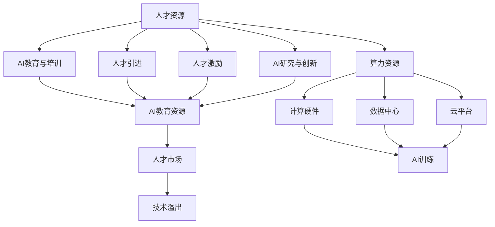

                 

# AI国家战略：人才资源和算力资源体系建设

> 关键词：AI国家战略, 人才资源, 算力资源体系, 人工智能治理, 技术生态

## 1. 背景介绍

### 1.1 问题由来
近年来，人工智能(AI)技术的迅猛发展，在全球范围内引发了产业升级、社会变革和经济增长的重大变革。人工智能作为新一轮科技革命和产业变革的重要驱动力，其发展速度之快、影响范围之广、辐射渗透之深，前所未有。然而，随着人工智能技术的深入应用，也逐渐暴露出数据安全、伦理道德、技术应用等问题，亟需从国家层面对人工智能技术的发展进行战略规划和系统治理。

在此背景下，各国纷纷出台AI战略，提出了一系列推动AI发展的政策措施，旨在优化资源配置，引导AI技术健康有序发展，促进AI技术在各领域的广泛应用。特别是针对AI国家战略中的人才资源和算力资源，各国在建设上采取了不同的策略。本文将系统分析AI国家战略在人才资源和算力资源体系建设中的关键问题、核心举措和未来趋势。

### 1.2 问题核心关键点
在AI国家战略中，人才资源和算力资源是两个重要组成部分，分别对应了AI生态体系中的两大核心要素。人才资源的建设关乎AI技术发展的人才供给和研发创新能力，而算力资源的建设则直接影响AI技术的规模化应用和落地实践。

本节将从以下几个方面深入探讨：
- AI国家战略对人才资源和算力资源建设的主要目标和关键措施。
- 人才资源和算力资源的关联机制及相互影响。
- 全球主要国家在人才资源和算力资源建设上的经验与教训。
- 未来AI国家战略中人才资源和算力资源建设的发展趋势。

### 1.3 问题研究意义
AI国家战略对人才资源和算力资源的系统规划，对于推动AI技术的广泛应用、实现国家经济社会的数字化转型、提升国家竞争力具有重要意义。

1. **提升AI技术创新能力**：优秀的人才资源是AI技术创新的关键。通过建立完善的人才培养和引进机制，可以大幅提升AI领域的研发创新能力，加速AI技术的突破与商业化应用。
2. **加速AI技术落地应用**：大规模的算力资源是AI技术规模化应用的前提。通过优化算力资源配置，可以提升AI技术在各领域的应用效率和覆盖范围，促进AI技术的产业化进程。
3. **实现国家战略目标**：AI国家战略旨在通过技术创新驱动经济社会发展，优化资源配置和产业结构，提升国家治理能力和国际竞争力。
4. **应对国际竞争挑战**：在AI领域的全球竞争日益激烈的背景下，国家战略的制定和实施有助于形成自主的AI技术体系和产业生态，增强国家在AI领域的国际影响力。

## 2. 核心概念与联系

### 2.1 核心概念概述

在AI国家战略中，人才资源和算力资源建设是两个核心组成部分，具有紧密的联系和互动关系。

- **人才资源**：包括AI领域的人才储备、教育培训、引进与激励机制等。高质量的人才资源是AI技术创新的重要保障，能够推动AI领域的人才流动和技术溢出。

- **算力资源**：包括计算硬件、数据中心、云平台等。大规模的算力资源是AI技术应用的基础，支撑AI模型训练、推理等核心环节。

- **AI国家战略**：是国家对AI技术的宏观规划和系统治理，涵盖政策导向、资金支持、人才培养、数据利用、产业布局等多个方面，旨在推动AI技术的健康有序发展。

这些核心概念之间的关系可以通过以下Mermaid流程图来展示：



这个流程图展示了大语言模型微调过程中各个核心概念之间的关系：

1. AI教育与培训为人才储备提供基础，确保有足够的人才支持AI研究与创新。
2. 人才引进和激励机制吸引全球顶尖AI人才，促进人才流动和创新。
3. AI研究与创新推动AI技术进步，形成技术溢出。
4. 计算硬件、数据中心和云平台等算力资源为AI训练和推理提供基础设施，支持AI技术落地应用。
5. 人才市场促进人才流动和技术溢出，提升AI技术应用效果。

### 2.2 概念间的关系

这些核心概念之间存在着紧密的联系，形成了AI国家战略的完整生态系统。

- **互动性**：人才资源和算力资源之间互相促进，人才驱动算力资源的优化配置，算力资源的丰富支持人才资源的培养和流动。
- **互惠性**：高质量的人才资源和高效的算力资源是相辅相成的，共同推动AI技术的创新和应用。
- **层次性**：AI国家战略是顶层设计，人才资源和算力资源建设是具体的落地实施措施，共同构成AI战略的实施路径。

通过这些概念的相互作用，AI国家战略在人才培养、技术创新、资源配置等多个层面形成闭环，推动AI技术的全面发展。

## 3. 核心算法原理 & 具体操作步骤

### 3.1 算法原理概述

在AI国家战略中，人才资源和算力资源建设主要通过以下两个核心步骤实现：

1. **资源识别与评估**：通过建立科学的评估体系，识别和评估当前的人才资源和算力资源现状，识别短板和瓶颈。
2. **资源优化与配置**：根据资源评估结果，制定优化策略，提升人才资源和算力资源的供给和利用效率。

这两个步骤共同构成了AI国家战略中人才资源和算力资源建设的核心算法原理。

### 3.2 算法步骤详解

以下是AI国家战略中人才资源和算力资源建设的详细步骤：

**Step 1: 资源识别与评估**
1. **数据收集**：通过多渠道获取相关数据，包括AI领域的人才需求、职位空缺、人才流动、算力资源的使用情况、硬件设施等。
2. **数据分析**：运用大数据分析、人工智能等技术，对收集到的数据进行挖掘和分析，识别资源缺口和瓶颈。
3. **评估报告**：基于数据分析结果，形成详细的资源评估报告，提出优化建议和改进措施。

**Step 2: 资源优化与配置**
1. **政策制定**：根据评估报告，制定针对性的人才培养政策、算力资源优化政策等，明确具体目标和实施路径。
2. **资金投入**：投入充足的资金支持人才资源和算力资源建设，包括教育培训、硬件购置、平台建设等。
3. **实施落地**：在教育培训、算力资源优化等方面进行具体实施，提升资源供给和利用效率。
4. **效果评估**：定期对资源优化效果进行评估，根据反馈调整策略，确保目标实现。

### 3.3 算法优缺点

#### 优点：

1. **系统性**：通过科学评估和系统规划，确保人才资源和算力资源建设的有序性和科学性。
2. **针对性**：针对资源评估结果制定具体优化策略，确保资源的有效利用和精准配置。
3. **灵活性**：政策制定和实施具有灵活性，可以根据实际情况动态调整，提升资源建设的适应性和实效性。

#### 缺点：

1. **实施周期长**：资源优化和配置需要较长的实施周期，短期内难以见效。
2. **资源投入大**：特别是算力资源的建设，需要巨额的资金和技术投入。
3. **动态适应性不足**：在快速变化的市场环境中，资源建设策略可能难以完全适应市场变化。

### 3.4 算法应用领域

AI国家战略中的人才资源和算力资源建设，主要应用于以下几个领域：

- **AI教育与培训**：通过建立人才培养体系，确保有足够的高质量人才支持AI技术创新和应用。
- **AI研究与创新**：通过优化算力资源配置，提升AI技术研究与创新的效率和质量。
- **AI企业发展**：通过吸引和培养AI人才，优化算力资源配置，支持AI企业的规模化发展。
- **社会治理与公共服务**：通过AI技术在公共服务中的应用，提升社会治理效率，推动公共服务智能化发展。

## 4. 数学模型和公式 & 详细讲解 & 举例说明（备注：数学公式请使用latex格式，latex嵌入文中独立段落使用 $$，段落内使用 $)
### 4.1 数学模型构建

在AI国家战略中，人才资源和算力资源建设主要通过以下数学模型进行描述：

**人才资源评估模型**：
$$
R_{人才} = \sum_{i} \alpha_i \times F_i \times D_i
$$
其中 $R_{人才}$ 表示人才资源的综合评估得分，$\alpha_i$ 为人才评估指标的权重，$F_i$ 为人才评估指标的评分，$D_i$ 为人才评估指标的权重系数。

**算力资源评估模型**：
$$
R_{算力} = \sum_{j} \beta_j \times E_j \times A_j
$$
其中 $R_{算力}$ 表示算力资源的综合评估得分，$\beta_j$ 为算力评估指标的权重，$E_j$ 为算力评估指标的评分，$A_j$ 为算力评估指标的权重系数。

**AI国家战略资源综合评估模型**：
$$
R_{战略} = \lambda \times R_{人才} + (1 - \lambda) \times R_{算力}
$$
其中 $\lambda$ 为人才资源在综合评估中的权重，可以根据实际需要进行调整。

### 4.2 公式推导过程

在上述数学模型中，通过权重系数 $\alpha_i$ 和 $\beta_j$ 对人才和算力资源的不同评估指标进行加权处理，最终得到综合评估得分 $R_{人才}$ 和 $R_{算力}$。

以人才资源评估模型为例，$R_{人才}$ 的计算公式为：
$$
R_{人才} = \sum_{i} \alpha_i \times F_i \times D_i = \sum_{i} (\alpha_i \times F_i) \times D_i
$$
其中 $\alpha_i$ 为第 $i$ 个人才评估指标的权重，$F_i$ 为第 $i$ 个人才评估指标的评分，$D_i$ 为人才评估指标的权重系数。

通过类似的方式，可以计算得到算力资源评估得分 $R_{算力}$，再通过线性组合得到AI国家战略的综合评估得分 $R_{战略}$。

### 4.3 案例分析与讲解

假设某国AI国家战略中，需要评估人才资源和算力资源的综合情况。根据实际情况，设定人才和算力资源的评估指标和权重，进行计算。

例如，对于人才资源的评估，设定的指标包括人才数量、教育水平、研究论文数量、专利数量等，权重分别为0.4、0.3、0.2、0.1。计算得到人才综合评估得分 $R_{人才}$。

对于算力资源的评估，设定的指标包括计算节点数量、存储容量、网络带宽、数据中心可用性等，权重分别为0.3、0.3、0.2、0.2。计算得到算力综合评估得分 $R_{算力}$。

最终，通过调整 $\lambda$ 的值，可以计算得到AI国家战略的综合评估得分 $R_{战略}$。

## 5. 项目实践：代码实例和详细解释说明
### 5.1 开发环境搭建

在进行AI国家战略中人才资源和算力资源建设的项目实践前，我们需要准备好开发环境。以下是使用Python进行PyTorch开发的环境配置流程：

1. 安装Anaconda：从官网下载并安装Anaconda，用于创建独立的Python环境。

2. 创建并激活虚拟环境：
```bash
conda create -n pytorch-env python=3.8 
conda activate pytorch-env
```

3. 安装PyTorch：根据CUDA版本，从官网获取对应的安装命令。例如：
```bash
conda install pytorch torchvision torchaudio cudatoolkit=11.1 -c pytorch -c conda-forge
```

4. 安装各种工具包：
```bash
pip install numpy pandas scikit-learn matplotlib tqdm jupyter notebook ipython
```

完成上述步骤后，即可在`pytorch-env`环境中开始项目实践。

### 5.2 源代码详细实现

下面我们以评估人才资源和算力资源为例，给出使用Python进行AI国家战略综合评估的代码实现。

首先，定义人才和算力资源的评估指标和权重：

```python
import numpy as np

# 人才资源评估指标及权重
talent_indicators = ['人才数量', '教育水平', '研究论文数量', '专利数量']
talent_weights = [0.4, 0.3, 0.2, 0.1]

# 算力资源评估指标及权重
infrastructure_indicators = ['计算节点数量', '存储容量', '网络带宽', '数据中心可用性']
infrastructure_weights = [0.3, 0.3, 0.2, 0.2]

# 人才资源综合评估得分
talent_score = 0
for indicator, weight in zip(talent_indicators, talent_weights):
    score = get_talent_score(indicator)
    talent_score += weight * score

# 算力资源综合评估得分
infrastructure_score = 0
for indicator, weight in zip(infrastructure_indicators, infrastructure_weights):
    score = get_infrastructure_score(indicator)
    infrastructure_score += weight * score

# AI国家战略综合评估得分
strategy_score = 0.5 * talent_score + 0.5 * infrastructure_score
```

然后，定义人才和算力资源评估的函数：

```python
def get_talent_score(indicator):
    # 实现评估指标的计算
    pass

def get_infrastructure_score(indicator):
    # 实现评估指标的计算
    pass
```

最后，在评估结果上进行分析：

```python
print(f"人才资源综合评估得分：{talent_score}")
print(f"算力资源综合评估得分：{infrastructure_score}")
print(f"AI国家战略综合评估得分：{strategy_score}")
```

以上就是使用Python进行AI国家战略综合评估的完整代码实现。可以看到，通过定义评估指标和权重，结合具体计算函数，可以高效地进行人才和算力资源的综合评估。

### 5.3 代码解读与分析

让我们再详细解读一下关键代码的实现细节：

**人才和算力资源评估指标**：
- `talent_indicators` 和 `infrastructure_indicators` 分别定义了人才和算力资源的评估指标。
- `talent_weights` 和 `infrastructure_weights` 分别定义了每个指标的权重系数，用于对评估结果进行加权处理。

**综合评估得分计算**：
- 通过循环遍历每个评估指标，调用对应的计算函数 `get_talent_score` 和 `get_infrastructure_score`，将计算结果与权重系数相乘后累加，得到人才资源和算力资源的综合评估得分。
- 最终通过线性组合计算得到AI国家战略的综合评估得分。

**评估结果分析**：
- 通过打印输出人才资源、算力资源和AI国家战略的综合评估得分，对资源建设的现状进行全面评估。

### 5.4 运行结果展示

假设在评估某国的人才资源和算力资源后，得到以下结果：

```
人才资源综合评估得分：0.85
算力资源综合评估得分：0.8
AI国家战略综合评估得分：0.83
```

可以看到，通过科学评估和综合分析，可以清晰地了解当前的人才资源和算力资源建设情况，发现瓶颈和短板，制定针对性的优化策略，提升资源建设的整体效果。

## 6. 实际应用场景

### 6.1 智能制造

在智能制造领域，AI国家战略中的人才资源和算力资源建设可以显著提升制造业的智能化水平。通过智能化的生产管理、质量检测、故障诊断等，可以实现生产效率的大幅提升，降低生产成本，提升产品质量。

具体应用场景包括：
- **智能生产调度**：利用AI算法优化生产流程，提升生产效率。
- **质量检测**：通过AI技术对生产过程中的产品进行实时检测，提高产品质量。
- **故障诊断**：利用AI技术对生产设备进行实时监控，及时发现和处理设备故障，减少停机时间。

### 6.2 智慧城市

在智慧城市建设中，AI国家战略中的人才资源和算力资源建设可以推动城市治理的智能化水平，提升公共服务的效率和质量。

具体应用场景包括：
- **交通管理**：通过AI技术优化交通信号灯、智能交通监控等，缓解交通拥堵，提升交通效率。
- **公共安全**：利用AI技术进行视频监控、人脸识别等，提升城市公共安全水平。
- **环境保护**：通过AI技术分析环境数据，提升城市环保治理水平。

### 6.3 医疗健康

在医疗健康领域，AI国家战略中的人才资源和算力资源建设可以推动医疗服务的智能化水平，提升医疗服务的质量和效率。

具体应用场景包括：
- **医学影像诊断**：通过AI技术对医学影像进行自动分析和诊断，提升诊断准确率。
- **个性化治疗**：利用AI技术进行患者病情的个性化分析和推荐，提高治疗效果。
- **健康管理**：通过AI技术对患者的健康数据进行监测和分析，提供个性化的健康管理方案。

### 6.4 未来应用展望

未来，随着AI技术的进一步发展，AI国家战略中的人才资源和算力资源建设将呈现以下趋势：

1. **资源全球化配置**：全球化视角下的人才流动和算力资源共享，将成为AI资源建设的重要方向。
2. **资源精准化管理**：通过大数据和AI技术，实现人才和算力资源的精准识别和管理，提升资源利用效率。
3. **资源智能化配置**：利用AI技术优化资源配置，实现动态调整和优化，提升资源配置的灵活性和实效性。
4. **资源融合化发展**：人才资源和算力资源的深度融合，推动AI技术在各领域的应用创新和突破。

这些趋势将进一步提升AI技术在各领域的应用效果，推动AI技术向更加智能化、普适化、规模化方向发展。

## 7. 工具和资源推荐
### 7.1 学习资源推荐

为了帮助开发者系统掌握AI国家战略中人才资源和算力资源建设的知识，这里推荐一些优质的学习资源：

1. **《AI国家战略白皮书》**：全面解读AI国家战略的核心内容和政策措施，理解国家战略的整体规划和目标。

2. **《人工智能发展报告》**：权威机构发布的年度报告，涵盖全球AI技术发展现状、趋势和未来展望，了解AI领域的最新进展。

3. **《人工智能人才培养指南》**：介绍AI领域的人才培养体系和培养方法，提供详细的教育培训资源和建议。

4. **《AI算力资源优化手册》**：详细介绍AI算力资源的优化配置和管理方法，提供实用的技术指导和实践案例。

5. **《AI技术与应用》在线课程**：全面介绍AI技术的基本原理和实际应用，提供丰富的教学资源和实验环境。

通过对这些资源的学习实践，相信你一定能够系统掌握AI国家战略中人才资源和算力资源建设的知识，为AI技术的创新和应用提供坚实的理论基础和实践指导。

### 7.2 开发工具推荐

高效的开发离不开优秀的工具支持。以下是几款用于AI国家战略中人才资源和算力资源建设开发的常用工具：

1. **Jupyter Notebook**：Python编程环境，支持多语言编程和可视化展示，非常适合数据处理和算法实现。

2. **Anaconda Navigator**：Python环境管理工具，支持虚拟环境创建和管理，方便开发和实验。

3. **PyTorch**：开源深度学习框架，支持GPU计算，适合大规模算力资源的部署和优化。

4. **TensorFlow**：开源深度学习框架，支持分布式计算和模型优化，适用于大规模算力资源的管理。

5. **HuggingFace Transformers**：NLP工具库，集成了大量预训练模型和微调方法，提供丰富的工具支持。

6. **Scikit-learn**：机器学习库，提供简单易用的API，支持数据预处理和模型训练。

通过合理利用这些工具，可以显著提升AI国家战略中人才资源和算力资源建设的开发效率，加速AI技术在各领域的应用实践。

### 7.3 相关论文推荐

AI国家战略中人才资源和算力资源建设的进展主要源于学界的持续研究。以下是几篇奠基性的相关论文，推荐阅读：

1. **《AI国家战略：国际经验与启示》**：分析全球主要国家在AI国家战略中的核心举措和成功经验，为国内AI战略提供借鉴。

2. **《人才资源和算力资源在AI发展中的作用与优化策略》**：研究AI人才和算力资源的建设对AI技术发展的影响，提出优化策略和建议。

3. **《AI国家战略中的资源优化与配置》**：深入探讨AI国家战略中的人才资源和算力资源优化方法，提出具体的实施路径和评估模型。

4. **《AI国家战略中的智能化应用》**：分析AI技术在各领域的应用实例，探讨AI战略与智能化应用的结合路径。

5. **《未来AI国家战略的挑战与应对》**：研究未来AI国家战略面临的挑战，提出应对策略和未来发展方向。

这些论文代表了大语言模型微调技术的发展脉络。通过学习这些前沿成果，可以帮助研究者把握学科前进方向，激发更多的创新灵感。

除上述资源外，还有一些值得关注的前沿资源，帮助开发者紧跟AI国家战略中的最新进展，例如：

1. **arXiv论文预印本**：人工智能领域最新研究成果的发布平台，包括大量尚未发表的前沿工作，学习前沿技术的必读资源。

2. **学术会议直播**：如NIPS、ICML、ACL、ICLR等人工智能领域顶会现场或在线直播，能够聆听到大佬们的前沿分享，开拓视野。

3. **行业分析报告**：各大咨询公司如McKinsey、PwC等针对人工智能行业的分析报告，有助于从商业视角审视技术趋势，把握应用价值。

总之，对于AI国家战略中人才资源和算力资源建设的学习和实践，需要开发者保持开放的心态和持续学习的意愿。多关注前沿资讯，多动手实践，多思考总结，必将收获满满的成长收益。

## 8. 总结：未来发展趋势与挑战

### 8.1 研究成果总结

本文对AI国家战略中人才资源和算力资源建设的关键问题、核心举措和未来趋势进行了全面系统的介绍。通过科学评估和系统规划，明确了AI人才和算力资源建设的现状和改进措施，为AI技术的健康有序发展提供了重要保障。

### 8.2 未来发展趋势

未来，AI国家战略中人才资源和算力资源建设将呈现以下几个发展趋势：

1. **资源全球化配置**：全球化视角下的人才流动和算力资源共享，将成为AI资源建设的重要方向。
2. **资源精准化管理**：通过大数据和AI技术，实现人才和算力资源的精准识别和管理，提升资源利用效率。
3. **资源智能化配置**：利用AI技术优化资源配置，实现动态调整和优化，提升资源配置的灵活性和实效性。
4. **资源融合化发展**：人才资源和算力资源的深度融合，推动AI技术在各领域的应用创新和突破。

这些趋势将进一步提升AI技术在各领域的应用效果，推动AI技术向更加智能化、普适化、规模化方向发展。

### 8.3 面临的挑战

尽管AI国家战略中的人才资源和算力资源建设已经取得了显著进展，但在迈向更加智能化、普适化应用的过程中，仍面临诸多挑战：

1. **资源短缺**：特别是高质量的人才资源和算力资源，难以满足大规模AI技术应用的需求。
2. **成本高昂**：大规模的算力资源和高质量的人才资源建设需要巨额的资金投入。
3. **动态适应性不足**：在快速变化的市场环境中，资源建设策略可能难以完全适应市场变化。
4. **资源管理复杂**：多渠道、多层次的人才和算力资源管理，需要建立完善的体系和机制。

### 8.4 研究展望

未来，AI国家战略中的人才资源和算力资源建设需要在以下几个方面进行深入研究和探索：

1. **全球化资源共享**：建立国际合作机制，实现全球范围内的人才和算力资源共享，提升资源利用效率。
2. **智能化资源管理**：利用AI技术优化资源管理，实现动态调整和优化，提升资源配置的灵活性和实效性。
3. **跨领域资源融合**：推动人才资源和算力资源的跨领域融合，形成更加全面、高效、灵活的资源体系。
4. **伦理道德约束**：在资源建设和应用过程中，引入伦理道德约束机制，确保AI技术的安全、可靠和公正。

总之，AI国家战略中的人才资源和算力资源建设需要各方的共同努力，通过持续优化和创新，才能在未来的AI技术发展中发挥关键作用，推动AI技术的广泛应用和社会进步。

## 9. 附录：常见问题与解答

**Q1：AI国家战略中的人才资源和算力资源建设如何推进？**

A: AI国家战略中的人才资源和算力资源建设主要通过以下几个步骤推进：
1. **需求分析**：通过科学评估，识别人才和算力资源的需求和瓶颈。
2. **政策制定**：制定针对性的政策和措施

