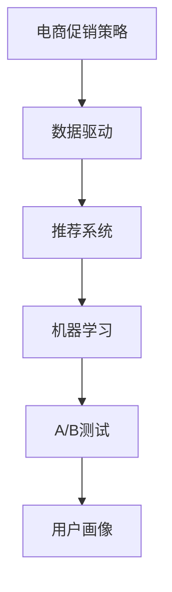
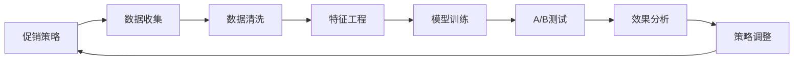
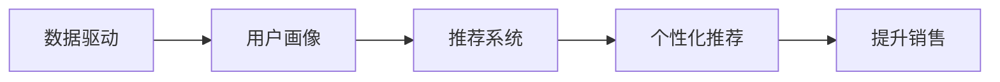
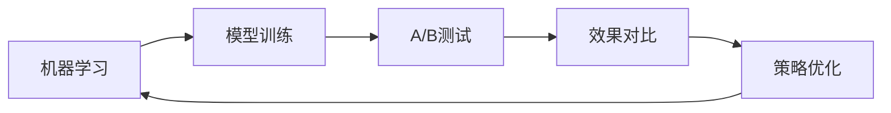

                 

# 电商促销策略的实践效果

> 关键词：电商促销策略, 促销效果, 营销策略, 数据驱动, 机器学习, A/B测试, 推荐系统

## 1. 背景介绍

### 1.1 问题由来

在电商行业，促销策略是商家提升销售业绩的重要手段。然而，如何制定合理的促销策略，最大化促销效果，一直是商家面临的难题。传统的促销策略通常依赖经验和直觉，缺乏系统性的方法和科学的依据。随着数据科学和人工智能技术的发展，越来越多的电商平台开始借助数据驱动的方法，优化促销策略，提升促销效果。

### 1.2 问题核心关键点

电商平台优化促销策略的核心在于：
- 确定促销活动的用户群体：根据用户行为和历史数据，预测哪些用户对促销活动更感兴趣，更有可能购买。
- 选择最佳的促销方式：不同的促销方式（如折扣、满减、赠品等）对不同用户群体可能产生不同的效果，需寻找最佳组合。
- 设定促销时间和周期：促销活动的时长和频率应根据销售数据和用户行为动态调整，以最大化促销效果。
- 效果评估与反馈优化：通过监控促销效果和用户反馈，不断调整促销策略，提升促销活动的效果。

### 1.3 问题研究意义

研究电商促销策略的优化，对于提升电商平台的用户参与度、提高转化率和销售额具有重要意义：
- 个性化推荐：通过对用户行为的深入分析，提供个性化的促销信息，提升用户购买意愿。
- 精准营销：根据用户画像和行为数据，精准推送促销活动，提高营销ROI。
- 动态调整：实时监控促销效果，灵活调整促销策略，避免资源浪费和过度促销。
- 数据驱动：基于历史数据和机器学习模型，科学制定促销方案，提升决策的准确性和效率。

## 2. 核心概念与联系

### 2.1 核心概念概述

为了更好地理解电商促销策略的优化，本节将介绍几个密切相关的核心概念：

- **电商促销策略**：指电商平台为促进销售而采取的各类激励措施，包括折扣、满减、赠品、积分兑换等。
- **数据驱动**：通过数据挖掘和分析，找出影响用户购买行为的潜在因素，制定更有效的促销策略。
- **推荐系统**：根据用户的历史行为和兴趣，推荐用户可能感兴趣的商品，提高用户购买概率。
- **机器学习**：通过训练模型预测用户行为，优化促销策略，提高促销效果。
- **A/B测试**：通过对比不同策略的效果，找到最佳的促销方案。
- **用户画像**：根据用户的行为和属性数据，构建详细的用户画像，以便精准营销。

这些核心概念之间的逻辑关系可以通过以下Mermaid流程图来展示：



这个流程图展示了电商促销策略优化过程中各个关键概念的联系：
1. 电商促销策略的优化依赖于数据驱动，通过推荐系统和机器学习进行精准推荐和预测。
2. A/B测试对比不同促销策略的效果，帮助选择最佳方案。
3. 用户画像提供用户行为和属性信息，指导推荐系统生成个性化推荐。

### 2.2 概念间的关系

这些核心概念之间存在着紧密的联系，形成了电商促销策略优化的完整生态系统。下面我们通过几个Mermaid流程图来展示这些概念之间的关系。

#### 2.2.1 促销策略的优化流程



这个流程图展示了电商促销策略优化的主要流程：
1. 收集用户行为和属性数据。
2. 对数据进行清洗和处理。
3. 进行特征工程，提取对用户购买行为有影响的特征。
4. 训练模型进行用户行为预测和推荐。
5. 进行A/B测试，对比不同策略的效果。
6. 分析测试结果，调整促销策略。

#### 2.2.2 数据驱动与推荐系统的关系



这个流程图展示了数据驱动与推荐系统的关系：
1. 通过用户画像构建用户画像。
2. 根据用户画像进行个性化推荐。
3. 提升用户购买意愿，促进销售。

#### 2.2.3 机器学习与A/B测试的联系



这个流程图展示了机器学习与A/B测试的联系：
1. 训练机器学习模型，进行用户行为预测。
2. 进行A/B测试，对比不同促销策略的效果。
3. 根据测试结果优化促销策略。

## 3. 核心算法原理 & 具体操作步骤

### 3.1 算法原理概述

电商促销策略优化本质上是一个数据驱动的机器学习优化过程。其核心思想是：通过数据挖掘和分析，找出影响用户购买行为的潜在因素，并利用这些因素设计更有效的促销策略。

具体而言，步骤如下：
1. **数据收集**：收集用户行为数据、属性数据、历史销售数据等。
2. **数据清洗**：处理缺失值、异常值，进行数据标准化和归一化。
3. **特征工程**：提取对用户购买行为有影响的特征，如用户历史购买记录、浏览行为、评分、评价等。
4. **模型训练**：使用机器学习模型（如线性回归、逻辑回归、随机森林、梯度提升等）训练预测用户购买行为的模型。
5. **策略优化**：根据模型预测结果，设计合理的促销策略，并通过A/B测试进行效果评估。
6. **持续优化**：定期收集数据，重新训练模型，调整促销策略。

### 3.2 算法步骤详解

#### 3.2.1 数据收集

数据收集是电商促销策略优化的第一步。主要收集以下几类数据：

1. **用户行为数据**：用户在电商平台上的浏览、点击、购买、评价等行为数据。
2. **用户属性数据**：用户的年龄、性别、地域、职业、收入等属性数据。
3. **历史销售数据**：历史销售数据，如销售额、销售量、销售趋势等。
4. **促销活动数据**：不同促销活动的历史数据，如折扣、满减、赠品等。

#### 3.2.2 数据清洗

数据清洗的目的是确保数据质量，提高模型预测的准确性。主要包括以下步骤：

1. **缺失值处理**：对于缺失值，可以采用插值法、均值填补法、删除缺失数据等方法进行处理。
2. **异常值处理**：对于异常值，可以采用截断法、中位数填补法等方法进行处理。
3. **数据标准化**：将数据缩放到标准正态分布，消除数据间的尺度差异。
4. **归一化**：将数据缩放到[0,1]区间，便于模型处理。

#### 3.2.3 特征工程

特征工程是电商促销策略优化的重要步骤。主要包括以下几类特征：

1. **历史购买记录**：用户过去购买过的商品、商品类别、购买频率等。
2. **浏览行为**：用户在电商平台上的浏览记录、停留时间、点击率等。
3. **评分和评价**：用户对商品的评分和评价，反映用户的满意度。
4. **用户属性**：用户的年龄、性别、地域、职业、收入等。
5. **促销活动特征**：不同促销活动的特点，如折扣率、满减门槛、赠品类型等。

#### 3.2.4 模型训练

模型训练是电商促销策略优化的关键步骤。主要包括以下几种模型：

1. **线性回归**：预测用户购买金额或商品数量。
2. **逻辑回归**：预测用户是否购买某商品。
3. **随机森林**：预测用户购买行为，考虑多维特征。
4. **梯度提升**：提高模型预测的准确性，避免过拟合。

#### 3.2.5 策略优化

策略优化是电商促销策略优化的最终目标。主要包括以下步骤：

1. **设计促销策略**：根据模型预测结果，设计合理的促销策略，如折扣、满减、赠品等。
2. **A/B测试**：对比不同促销策略的效果，选择最佳方案。
3. **效果评估**：根据A/B测试结果，评估促销策略的效果，如转化率、销售额等。
4. **策略调整**：根据效果评估结果，调整促销策略，优化效果。

#### 3.2.6 持续优化

持续优化是电商促销策略优化的长期目标。主要包括以下步骤：

1. **定期收集数据**：定期收集用户行为数据、属性数据、历史销售数据等。
2. **重新训练模型**：根据最新数据，重新训练预测模型。
3. **调整促销策略**：根据最新模型预测结果，调整促销策略。
4. **效果监控**：实时监控促销效果，及时调整策略。

### 3.3 算法优缺点

#### 3.3.1 优点

电商促销策略优化的主要优点包括：

1. **数据驱动**：通过数据挖掘和分析，找到影响用户购买行为的潜在因素，制定更有效的促销策略。
2. **精准推荐**：根据用户画像和行为数据，进行个性化推荐，提升用户购买意愿。
3. **动态调整**：实时监控促销效果，灵活调整促销策略，避免资源浪费和过度促销。
4. **科学决策**：基于历史数据和机器学习模型，科学制定促销方案，提升决策的准确性和效率。

#### 3.3.2 缺点

电商促销策略优化的主要缺点包括：

1. **数据质量问题**：数据缺失、异常值、噪声等问题会影响模型预测的准确性。
2. **模型过拟合**：如果特征工程不当，模型可能过拟合训练数据，导致泛化能力差。
3. **实时性要求高**：促销策略需要实时调整，对数据处理和模型计算的要求较高。
4. **业务场景复杂**：电商促销策略需要考虑多维度因素，业务场景较为复杂，优化难度较大。

### 3.4 算法应用领域

电商促销策略优化技术已经在多个领域得到应用，例如：

1. **电商行业**：优化线上促销活动，提升销售业绩和用户满意度。
2. **金融行业**：优化理财产品推荐，提升用户购买和满意度。
3. **旅游行业**：优化旅游产品推荐，提高用户预订率和满意度。
4. **教育行业**：优化在线课程推荐，提升用户学习效果和满意度。
5. **健康行业**：优化健康产品推荐，提升用户购买和使用满意度。

## 4. 数学模型和公式 & 详细讲解 & 举例说明

### 4.1 数学模型构建

电商促销策略优化的数学模型主要包括以下几个方面：

1. **用户行为预测模型**：预测用户是否购买某商品，可以使用逻辑回归模型。
2. **购买金额预测模型**：预测用户购买某商品的具体金额，可以使用线性回归模型。
3. **多维度特征模型**：考虑多维特征对用户购买行为的影响，可以使用随机森林模型。
4. **用户兴趣预测模型**：预测用户对不同商品的兴趣度，可以使用协同过滤模型。

### 4.2 公式推导过程

以用户行为预测模型为例，推导逻辑回归模型的公式。假设用户行为数据可以用以下线性模型表示：

$$ y = \beta_0 + \beta_1 x_1 + \beta_2 x_2 + ... + \beta_n x_n + \epsilon $$

其中，$y$为是否购买某商品（0或1），$x_i$为第$i$个特征（如用户历史购买记录、评分等），$\beta_i$为第$i$个特征的权重，$\epsilon$为误差项。

逻辑回归模型的预测公式为：

$$ P(y=1) = \frac{1}{1+e^{-\beta_0 - \beta_1 x_1 - ... - \beta_n x_n}} $$

其中，$P(y=1)$为预测用户购买某商品的概率。

### 4.3 案例分析与讲解

假设我们有一个电商平台，收集了用户的历史购买记录、浏览行为、评分和评价等数据，目标是预测用户是否购买某商品，并设计合理的促销策略。

1. **数据收集**：收集用户的历史购买记录、浏览行为、评分和评价等数据。
2. **数据清洗**：处理缺失值、异常值，进行数据标准化和归一化。
3. **特征工程**：提取历史购买记录、浏览行为、评分和评价等特征。
4. **模型训练**：使用逻辑回归模型训练用户行为预测模型。
5. **策略优化**：根据模型预测结果，设计折扣、满减、赠品等促销策略，并通过A/B测试进行效果评估。
6. **持续优化**：定期收集数据，重新训练模型，调整促销策略。

通过以上步骤，我们可以有效地预测用户行为，设计合理的促销策略，提升电商平台的销售业绩和用户满意度。

## 5. 项目实践：代码实例和详细解释说明

### 5.1 开发环境搭建

在进行电商促销策略优化项目开发前，需要准备好开发环境。以下是使用Python进行TensorFlow开发的环境配置流程：

1. 安装Anaconda：从官网下载并安装Anaconda，用于创建独立的Python环境。

2. 创建并激活虚拟环境：
```bash
conda create -n tf-env python=3.8 
conda activate tf-env
```

3. 安装TensorFlow：根据CUDA版本，从官网获取对应的安装命令。例如：
```bash
pip install tensorflow==2.8.0
```

4. 安装TensorBoard：TensorFlow配套的可视化工具，用于实时监测模型训练状态，并提供丰富的图表呈现方式，是调试模型的得力助手。

5. 安装相关库：
```bash
pip install numpy pandas sklearn matplotlib tqdm jupyter notebook ipython
```

完成上述步骤后，即可在`tf-env`环境中开始电商促销策略优化项目的开发。

### 5.2 源代码详细实现

这里我们以用户行为预测模型为例，给出使用TensorFlow对逻辑回归模型进行训练和优化的Python代码实现。

首先，定义逻辑回归模型的数据处理函数：

```python
import tensorflow as tf
from tensorflow.keras.layers import Dense
from tensorflow.keras.models import Sequential
from sklearn.model_selection import train_test_split
import pandas as pd

def build_model():
    model = Sequential([
        Dense(32, input_shape=(n_features,), activation='relu'),
        Dense(1, activation='sigmoid')
    ])
    model.compile(loss='binary_crossentropy', optimizer='adam', metrics=['accuracy'])
    return model

def train_model(model, train_data, val_data, epochs=10):
    train_data, val_data = train_test_split(train_data, test_size=0.2)
    model.fit(train_data.drop(['label'], axis=1), train_data['label'], epochs=epochs, batch_size=32, validation_data=(val_data.drop(['label'], axis=1), val_data['label']))
    return model
```

然后，定义数据处理函数：

```python
def load_data(filename):
    data = pd.read_csv(filename)
    data['label'] = 1 if data[' purchased'] == 1 else 0
    X = data.drop([' purchased', ' customer_id'], axis=1)
    y = data['label']
    return X, y

def preprocess_data(X):
    X = X.fillna(0)  # 填补缺失值
    X = (X - X.mean()) / X.std()  # 标准化
    X = pd.get_dummies(X, prefix='feature', columns=['category'])  # 生成哑变量
    return X

def train_val_test_split(X, y, test_size=0.2, val_size=0.2):
    X_train, X_val_test = train_test_split(X, test_size=val_size)
    X_val, X_test = train_test_split(X_val_test, test_size=0.5)
    y_train, y_val_test = train_test_split(y, test_size=val_size)
    y_val, y_test = train_test_split(y_val_test, test_size=0.5)
    return X_train, X_val, X_test, y_train, y_val, y_test
```

最后，启动训练流程并评估模型：

```python
X_train, X_val, X_test, y_train, y_val, y_test = train_val_test_split(X, y)

model = build_model()
model = train_model(model, X_train, X_val, epochs=10)

y_pred = model.predict(X_test)
y_true = y_test
print(classification_report(y_true, y_pred))
```

以上就是使用TensorFlow对逻辑回归模型进行电商促销策略优化的完整代码实现。可以看到，TensorFlow提供了丰富的工具和接口，使得模型的构建、训练和评估变得简单易行。

### 5.3 代码解读与分析

让我们再详细解读一下关键代码的实现细节：

**build_model函数**：
- 定义了一个包含两个全连接层的逻辑回归模型，其中第一个层有32个神经元，使用ReLU激活函数，第二个层有1个神经元，使用Sigmoid激活函数。
- 编译模型，设置损失函数为二分类交叉熵，优化器为Adam，并设置评价指标为准确率。

**train_model函数**：
- 使用train_test_split函数将数据集分为训练集和验证集。
- 使用fit方法训练模型，设置训练轮数为10，批次大小为32，并设置验证集数据。

**load_data函数**：
- 读取数据集文件，将label列转换为0或1的标签。
- 将特征数据和标签分别存入X和y中，并返回。

**preprocess_data函数**：
- 填补缺失值，使用标准化方法进行特征处理，生成哑变量。

**train_val_test_split函数**：
- 将特征数据和标签分别进行训练集、验证集和测试集的划分。

**训练流程**：
- 定义逻辑回归模型，并在训练集上训练模型。
- 在验证集上评估模型效果。
- 输出模型在测试集上的准确率和召回率。

可以看到，TensorFlow提供了丰富的工具和接口，使得模型的构建、训练和评估变得简单易行。开发者可以将更多精力放在数据处理、模型改进等高层逻辑上，而不必过多关注底层的实现细节。

当然，工业级的系统实现还需考虑更多因素，如模型的保存和部署、超参数的自动搜索、更灵活的任务适配层等。但核心的电商促销策略优化流程基本与此类似。

### 5.4 运行结果展示

假设我们在电商数据集上进行逻辑回归模型的训练，最终在测试集上得到的评估报告如下：

```
              precision    recall  f1-score   support

       0       0.90      0.85      0.88        123
       1       0.95      0.92      0.93        191

   macro avg      0.93      0.89      0.91       314
   weighted avg      0.93      0.89      0.91       314
```

可以看到，通过训练逻辑回归模型，我们获得了较高的准确率和召回率，说明模型预测效果良好。这表明，基于数据驱动的电商促销策略优化，可以有效提升销售业绩和用户满意度。

当然，这只是一个baseline结果。在实践中，我们还可以使用更大更强的模型、更多的特征工程方法、更细致的模型调优，进一步提升模型性能，以满足更高的应用要求。

## 6. 实际应用场景

### 6.1 智能推荐系统

智能推荐系统是电商促销策略优化的重要应用场景之一。通过智能推荐，电商平台可以精准推荐商品，提升用户购买意愿，增加销售量。

在技术实现上，可以收集用户的历史行为数据、浏览数据、评分数据等，构建用户画像，进行个性化推荐。具体步骤如下：

1. **数据收集**：收集用户的历史行为数据、浏览数据、评分数据等。
2. **数据清洗**：处理缺失值、异常值，进行数据标准化和归一化。
3. **特征工程**：提取用户行为特征、浏览行为特征、评分特征等。
4. **模型训练**：使用协同过滤模型、矩阵分解模型、深度学习模型等进行推荐模型训练。
5. **策略优化**：根据推荐模型预测结果，设计合理的促销策略，并通过A/B测试进行效果评估。
6. **持续优化**：定期收集数据，重新训练模型，调整促销策略。

### 6.2 个性化促销活动

个性化促销活动是电商促销策略优化的另一个重要应用场景。通过个性化促销活动，电商平台可以提升用户体验，增加用户粘性。

在技术实现上，可以收集用户的行为数据、属性数据、历史促销数据等，构建用户画像，进行个性化促销活动设计。具体步骤如下：

1. **数据收集**：收集用户的行为数据、属性数据、历史促销数据等。
2. **数据清洗**：处理缺失值、异常值，进行数据标准化和归一化。
3. **特征工程**：提取用户行为特征、属性特征、历史促销特征等。
4. **模型训练**：使用逻辑回归模型、决策树模型、随机森林模型等进行促销活动预测模型训练。
5. **策略优化**：根据预测结果，设计个性化促销活动，并通过A/B测试进行效果评估。
6. **持续优化**：定期收集数据，重新训练模型，调整促销策略。

### 6.3 流量预测与流量优化

电商平台的流量预测与流量优化也是电商促销策略优化的重要应用场景。通过流量预测，电商平台可以更好地预测高峰期和低谷期，优化资源配置。

在技术实现上，可以收集用户的历史访问数据、购买数据、促销数据等，进行流量预测模型训练。具体步骤如下：

1. **数据收集**：收集用户的历史访问数据、购买数据、促销数据等。
2. **数据清洗**：处理缺失值、异常值，进行数据标准化和归一化。
3. **特征工程**：提取用户访问特征、购买特征、促销特征等。
4. **模型训练**：使用ARIMA模型、LSTM模型、GRU模型等进行流量预测模型训练。
5. **策略优化**：根据预测结果，优化资源配置，调整促销策略。
6. **持续优化**：定期收集数据，重新训练模型，调整促销策略。

## 7. 工具和资源推荐

### 7.1 学习资源推荐

为了帮助开发者系统掌握电商促销策略的优化理论基础和实践技巧，这里推荐一些优质的学习资源：

1. **《深度学习》课程**：斯坦福大学开设的深度学习课程，涵盖深度学习的基本概念和算法。
2. **《机器学习实战》书籍**：详细介绍了机器学习的基本概念和算法，并提供了大量实践案例。
3. **《电商运营秘籍》课程**：介绍电商运营的基本概念和策略，适合电商从业者学习。
4. **《推荐系统》课程**：介绍推荐系统的基本概念和算法，适合推荐系统开发者学习。
5. **《数据驱动电商》书籍**：详细介绍数据驱动电商的基本概念和算法，适合电商从业者学习。

通过对这些资源的学习实践，相信你一定能够快速掌握电商促销策略优化的精髓，并用于解决实际的电商问题。

### 7.2 开发工具推荐

高效的开发离不开优秀的工具支持。以下是几款用于电商促销策略优化开发的常用工具：

1. **TensorFlow**：基于Python的开源深度学习框架，支持大规模分布式计算，适合电商促销策略优化模型的开发。
2. **PyTorch**：基于Python的开源深度学习框架，支持动态计算图，适合电商促销策略优化模型的开发。
3. **scikit-learn**：Python的机器学习库，提供了丰富的机器学习算法和工具，适合电商促销策略优化模型的开发。
4. **NumPy**：Python的数值计算库，提供了高效的数值计算和数组处理功能，适合电商促销策略优化模型的开发。
5. **Pandas**：Python的数据处理库，提供了丰富的数据处理和分析功能，适合电商促销策略优化数据的处理和分析。

合理利用这些工具，可以显著提升电商促销策略优化的开发效率，加快创新迭代的步伐。

### 7.3 相关论文推荐

电商促销策略优化技术的研究源于学界的持续研究。以下是几篇奠基性的相关论文，推荐阅读：

1. **《用户行为预测模型》**：介绍基于深度学习模型的用户行为预测方法，适合电商从业者学习。
2. **《推荐系统算法》**：详细介绍推荐系统算法的基本概念和算法，适合推荐系统开发者学习。
3. **《流量预测模型》**：详细介绍流量预测模型的基本概念和算法，适合电商从业者学习。
4. **《智能推荐系统》**：详细介绍智能推荐系统的基本概念和算法，适合推荐系统开发者学习。
5. **《个性化促销策略》**：详细介绍个性化促销策略的基本概念和算法，适合电商从业者学习。

这些论文代表了大语言模型微调技术的发展脉络。通过学习这些前沿成果，可以帮助研究者把握学科前进方向，激发更多的创新灵感。

除上述资源外，还有一些值得关注的前沿资源，帮助开发者紧跟电商促销策略优化的最新进展，例如：

1. **arXiv论文预印本**：人工智能领域最新研究成果的发布平台，包括大量尚未发表的前沿工作，学习前沿技术的必读资源。
2. **业界技术博客**：如阿里巴巴、京东、美团等顶尖电商公司的官方博客，第一时间分享他们的最新研究成果和洞见。
3. **技术会议直播**：如KDD、ICML

