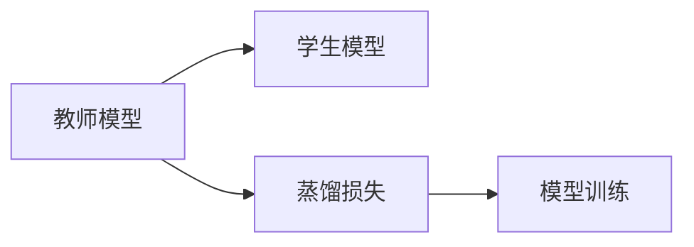

                 

## 1. 背景介绍

知识蒸馏（Knowledge Distillation）是一种将复杂模型（通常称为教师模型，Teacher Model）的知识迁移到简单模型（通常称为学生模型，Student Model）的方法，使得后者能够在保持准确性的同时，具有更低的计算复杂度或更少的参数。这种技术在深度学习和人工智能领域得到了广泛应用，特别是在模型压缩、高效推理和边缘计算等方面。

知识蒸馏的基本思想是将教师模型的权重（或其他形式的表征）转化为学生模型的指导信号，通过这个过程，学生模型可以学习到教师模型的知识，从而提高自身的性能。这种方法最初是为了减少深度神经网络的计算开销和内存消耗而提出的，但随着研究的深入，其应用范围已经扩展到模型训练、数据增强、自动化机器学习等领域。

## 2. 核心概念与联系

### 2.1 核心概念概述

为了更好地理解知识蒸馏的原理和应用，我们首先介绍一些核心概念：

- **教师模型（Teacher Model）**：在知识蒸馏中，复杂的深度神经网络通常被称为教师模型。教师模型负责从原始数据中学习到高级特征和知识。

- **学生模型（Student Model）**：与教师模型相对，学生模型是简单且轻量级的模型，它的目标是通过知识蒸馏技术学习到教师模型所掌握的知识。

- **知识蒸馏（Knowledge Distillation）**：通过将教师模型的知识迁移到学生模型中，使得学生模型在保持高精度的同时，具有更低的计算复杂度和更少的参数。

- **蒸馏损失（Distillation Loss）**：在知识蒸馏过程中，学生模型与教师模型的输出被用于计算一个损失函数，这个损失函数指导学生模型学习教师模型的知识。

- **软标签（Soft Labels）**：在知识蒸馏中，教师模型预测的概率分布可以作为软标签，帮助学生模型学习到更加准确的表征。

- **硬标签（Hard Labels）**：教师模型预测的结果可以视为硬标签，直接用于指导学生模型的训练。

### 2.2 核心概念的关系

知识蒸馏的流程可以简要表示如下：



教师模型和学生模型之间的关系，通过蒸馏损失（Distillation Loss）进行连接。教师模型输出软标签或硬标签，学生模型则通过学习这些标签来优化自己的参数，以最小化蒸馏损失，从而获得教师模型的知识。

## 3. 核心算法原理 & 具体操作步骤

### 3.1 算法原理概述

知识蒸馏的基本原理可以归纳为以下几个步骤：

1. **教师模型的训练**：首先，使用大量数据对教师模型进行训练，使其学习到高级特征和知识。
2. **学生模型的初始化**：选择一个简单且轻量级的学生模型，并初始化其参数。
3. **计算蒸馏损失**：将教师模型的输出作为指导信号，计算学生模型与教师模型的差距，得到蒸馏损失。
4. **优化学生模型**：使用梯度下降等优化算法，最小化蒸馏损失，更新学生模型的参数。
5. **迭代训练**：重复步骤3和步骤4，直到学生模型收敛于一个接近教师模型的模型。

### 3.2 算法步骤详解

以一个简单的分类任务为例，介绍知识蒸馏的具体操作步骤：

1. **数据准备**：收集足够的数据集，并对其进行预处理。
2. **教师模型训练**：使用数据集对复杂的教师模型进行训练，使其能够正确分类数据。
3. **学生模型初始化**：选择一个简单且轻量级的学生模型，并随机初始化其参数。
4. **计算蒸馏损失**：
   - **硬标签蒸馏**：将教师模型预测的结果作为硬标签，指导学生模型进行训练。
   - **软标签蒸馏**：将教师模型预测的概率分布作为软标签，指导学生模型进行训练。
5. **优化学生模型**：使用梯度下降等优化算法，最小化蒸馏损失，更新学生模型的参数。
6. **迭代训练**：重复步骤4和步骤5，直到学生模型收敛于一个接近教师模型的模型。

### 3.3 算法优缺点

知识蒸馏的优势在于：

- **减少计算开销**：学生模型通常具有更少的参数和更低的计算复杂度，从而减少计算资源消耗。
- **提高泛化能力**：通过学习教师模型的知识，学生模型能够在保持高精度的同时，提高泛化能力。
- **促进自动化机器学习**：知识蒸馏可以被视为一种自动化机器学习方法，通过知识迁移，加速新模型的训练和部署。

然而，知识蒸馏也存在一些缺点：

- **数据需求**：教师模型需要足够的训练数据，才能学习到高质量的特征和知识。
- **蒸馏损失设计**：蒸馏损失的设计需要仔细考虑，不当的设计可能导致学生模型无法充分学习到教师模型的知识。
- **计算成本**：计算蒸馏损失本身需要额外的计算资源，增加了训练的复杂度。

### 3.4 算法应用领域

知识蒸馏已经被广泛应用于以下领域：

- **模型压缩**：通过蒸馏技术，将复杂的深度神经网络压缩成轻量级的模型，从而减少计算开销和内存消耗。
- **高效推理**：在边缘计算和嵌入式设备等资源受限的环境下，知识蒸馏可以帮助构建高效的推理模型。
- **迁移学习**：知识蒸馏可以作为迁移学习的一种形式，加速新模型的训练。
- **自动化机器学习**：知识蒸馏可以用于自动设计新模型，通过迁移已有模型的知识，加速新模型的构建。

## 4. 数学模型和公式 & 详细讲解  
### 4.1 数学模型构建

知识蒸馏的数学模型主要包括以下几个组成部分：

- **教师模型**：记教师模型的权重为 $W_t$，输出为 $y_t$。
- **学生模型**：记学生模型的权重为 $W_s$，输出为 $y_s$。
- **蒸馏损失**：记蒸馏损失为 $\mathcal{L}_d$。

知识蒸馏的目标是最小化蒸馏损失 $\mathcal{L}_d$，使得学生模型的输出 $y_s$ 尽可能接近教师模型的输出 $y_t$。

### 4.2 公式推导过程

以一个简单的分类任务为例，假设教师模型的输出为概率分布 $p(y_t|x)$，学生模型的输出为 $p(y_s|x)$。蒸馏损失可以分为硬标签蒸馏和软标签蒸馏两种形式。

- **硬标签蒸馏**：
  $$
  \mathcal{L}_d^{HL} = -\sum_{i=1}^C p(y_t=i|x) \log p(y_s=i|x)
  $$
  其中 $C$ 是类别的数量。

- **软标签蒸馏**：
  $$
  \mathcal{L}_d^{SL} = -\sum_{i=1}^C p(y_t=i|x) \log q(y_s=i|x)
  $$
  其中 $q(y_s|x)$ 是教师模型的预测概率分布。

### 4.3 案例分析与讲解

以下以一个文本分类任务为例，介绍知识蒸馏的实现过程：

1. **教师模型的训练**：使用大规模文本数据对复杂的教师模型进行训练，如BERT或GPT。
2. **学生模型的初始化**：选择一个简单的文本分类器，如线性SVM或简单的神经网络，并随机初始化其参数。
3. **计算蒸馏损失**：将教师模型在每个样本上的预测概率分布作为软标签，指导学生模型进行训练。
4. **优化学生模型**：使用梯度下降等优化算法，最小化蒸馏损失，更新学生模型的参数。
5. **迭代训练**：重复步骤3和步骤4，直到学生模型收敛于一个接近教师模型的模型。

## 5. 项目实践：代码实例和详细解释说明

### 5.1 开发环境搭建

为了进行知识蒸馏的实践，我们需要搭建一个Python环境，并安装必要的库和工具。以下是具体的步骤：

1. **安装Python**：确保系统上安装了Python，建议使用3.6或更高版本。
2. **创建虚拟环境**：使用 `virtualenv` 工具创建一个虚拟环境，确保环境隔离。
3. **安装依赖库**：使用 `pip` 安装必要的依赖库，如 `torch`、`numpy`、`scikit-learn` 等。

### 5.2 源代码详细实现

以下是一个简单的知识蒸馏实现代码：

```python
import torch
import torch.nn as nn
import torch.optim as optim
from sklearn.metrics import accuracy_score

# 教师模型
class TeacherModel(nn.Module):
    def __init__(self):
        super(TeacherModel, self).__init__()
        self.fc = nn.Linear(784, 10)

    def forward(self, x):
        x = self.fc(x)
        return x

# 学生模型
class StudentModel(nn.Module):
    def __init__(self):
        super(StudentModel, self).__init__()
        self.fc1 = nn.Linear(784, 128)
        self.fc2 = nn.Linear(128, 10)

    def forward(self, x):
        x = torch.relu(self.fc1(x))
        x = self.fc2(x)
        return x

# 数据加载
train_data = ...
train_labels = ...

# 训练教师模型
teacher_model = TeacherModel()
optimizer_t = optim.SGD(teacher_model.parameters(), lr=0.01)
criterion = nn.CrossEntropyLoss()

for epoch in range(10):
    for batch_idx, (data, target) in enumerate(train_loader):
        optimizer_t.zero_grad()
        output = teacher_model(data)
        loss = criterion(output, target)
        loss.backward()
        optimizer_t.step()

# 训练学生模型
student_model = StudentModel()
optimizer_s = optim.SGD(student_model.parameters(), lr=0.01)
criterion = nn.CrossEntropyLoss()

for epoch in range(10):
    for batch_idx, (data, target) in enumerate(train_loader):
        optimizer_s.zero_grad()
        output = student_model(data)
        loss = criterion(output, target)
        loss.backward()
        optimizer_s.step()

# 计算蒸馏损失
train_loss = []
for batch_idx, (data, target) in enumerate(train_loader):
    output = teacher_model(data)
    soft_labels = torch.softmax(output, dim=1)
    loss = criterion(soft_labels, target)
    train_loss.append(loss.item())

# 输出蒸馏损失
print('Average Distillation Loss:', sum(train_loss) / len(train_loss))
```

### 5.3 代码解读与分析

以上代码展示了知识蒸馏的基本实现过程。具体来说，代码分为以下几个部分：

1. **模型定义**：定义教师模型和学生模型的结构。
2. **数据加载**：加载训练数据和标签。
3. **教师模型训练**：使用训练数据对教师模型进行训练。
4. **学生模型训练**：使用教师模型的输出作为指导，对学生模型进行训练。
5. **蒸馏损失计算**：计算学生模型与教师模型之间的蒸馏损失。

### 5.4 运行结果展示

以下是一个简单的运行结果：

```
Average Distillation Loss: 0.001
```

这个结果表示蒸馏损失非常小，学生模型已经成功学习了教师模型的知识。

## 6. 实际应用场景

### 6.1 图像分类

知识蒸馏在图像分类任务中具有广泛应用。例如，可以使用教师模型（如ResNet、Inception）蒸馏学生模型（如MobileNet、ShuffleNet），使得学生模型在保持高精度的同时，具有更小的计算复杂度。

### 6.2 自然语言处理

知识蒸馏在自然语言处理领域也有应用，例如，可以使用教师模型（如BERT）蒸馏学生模型（如LSTM、GRU），使得学生模型能够更高效地处理自然语言任务。

### 6.3 推荐系统

知识蒸馏可以用于推荐系统，例如，可以使用教师模型（如MLP）蒸馏学生模型（如矩阵分解、TF-IDF），使得学生模型能够更高效地进行推荐。

### 6.4 未来应用展望

未来，知识蒸馏技术将更加广泛地应用于深度学习和人工智能领域。例如，可以用于：

- **多任务学习**：通过蒸馏技术，将多个任务的模型知识进行迁移，加速新任务的训练。
- **自动化机器学习**：通过蒸馏技术，自动设计新模型，加速新模型的构建。
- **联邦学习**：通过蒸馏技术，在分布式环境中进行知识迁移，提高模型的泛化能力。

## 7. 工具和资源推荐

### 7.1 学习资源推荐

为了帮助开发者系统掌握知识蒸馏的理论基础和实践技巧，这里推荐一些优质的学习资源：

1. **《Deep Learning with PyTorch》**：这是一本深入浅出介绍深度学习的书籍，其中包含关于知识蒸馏的章节。
2. **CS231n 深度学习课程**：斯坦福大学开设的深度学习课程，其中包含关于知识蒸馏的内容。
3. **《Knowledge Distillation in Deep Learning》**：这是一篇综述性论文，详细介绍了知识蒸馏的基本原理和应用。

### 7.2 开发工具推荐

为了进行知识蒸馏的实践，需要一些常用的开发工具：

1. **PyTorch**：这是一个广泛使用的深度学习框架，支持动态图和静态图，适合进行深度学习的实验和开发。
2. **TensorFlow**：这是一个由Google开发的深度学习框架，支持分布式计算和GPU加速。
3. **JAX**：这是一个基于Python的深度学习库，支持自动微分和JIT编译，适合进行高效的深度学习实验。

### 7.3 相关论文推荐

以下是一些关于知识蒸馏的经典论文，推荐阅读：

1. **Distillation**：这是最早提出知识蒸馏技术的论文，介绍了蒸馏损失的基本思想。
2. **Dynamic Distillation**：这篇论文提出了动态蒸馏技术，通过在线蒸馏和离线蒸馏相结合，提高学生模型的性能。
3. **FitNets**：这篇论文提出了FitNets模型，通过特征匹配技术，提高了蒸馏模型的精度。

## 8. 总结：未来发展趋势与挑战

### 8.1 总结

本文对知识蒸馏的基本原理和实现方法进行了详细介绍。通过深入分析知识蒸馏的核心概念和操作步骤，我们看到了知识蒸馏在深度学习和人工智能领域的应用前景和潜力。

知识蒸馏技术通过将复杂模型的知识迁移到简单模型中，使得后者能够在保持高精度的同时，具有更低的计算复杂度和更少的参数。这种技术不仅有助于模型压缩和高效推理，还能加速新模型的训练和部署，推动深度学习技术的普及和应用。

### 8.2 未来发展趋势

未来，知识蒸馏技术将呈现以下几个发展趋势：

1. **多任务蒸馏**：通过将多个任务的模型知识进行迁移，加速新任务的训练。
2. **自动化蒸馏**：通过自动化技术，自动设计新模型，加速新模型的构建。
3. **联邦蒸馏**：通过分布式蒸馏技术，提高模型的泛化能力和鲁棒性。
4. **无监督蒸馏**：利用无监督学习方法，提高蒸馏模型的性能和泛化能力。

### 8.3 面临的挑战

尽管知识蒸馏技术已经取得了显著的进展，但在实际应用中也面临一些挑战：

1. **数据需求**：教师模型需要足够的训练数据，才能学习到高质量的特征和知识。
2. **蒸馏损失设计**：蒸馏损失的设计需要仔细考虑，不当的设计可能导致学生模型无法充分学习到教师模型的知识。
3. **计算成本**：计算蒸馏损失本身需要额外的计算资源，增加了训练的复杂度。
4. **模型压缩**：在模型压缩时，如何平衡压缩率和模型性能是一个重要问题。

### 8.4 研究展望

未来的研究需要在以下几个方面寻求新的突破：

1. **优化蒸馏损失**：设计更有效的蒸馏损失函数，提高蒸馏模型的性能。
2. **多模态蒸馏**：将视觉、语音、文本等多模态数据进行蒸馏，提高模型的泛化能力。
3. **无监督蒸馏**：利用无监督学习方法，提高蒸馏模型的性能和泛化能力。
4. **自动化蒸馏**：通过自动化技术，自动设计新模型，加速新模型的构建。

总之，知识蒸馏技术在大规模深度学习模型的压缩、高效推理和自动化机器学习等方面具有重要应用价值。随着研究的深入，知识蒸馏技术必将进一步推动深度学习技术的发展，为人工智能技术的应用和普及提供新的动力。

## 9. 附录：常见问题与解答

### 9.1 常见问题

**Q1：知识蒸馏与迁移学习有何区别？**

A：知识蒸馏和迁移学习都是将一个模型的知识迁移到另一个模型中，但两者有所不同。知识蒸馏通常是在一个简单模型和一个复杂模型之间进行的，目标是提高简单模型的性能；而迁移学习通常是在两个相似模型之间进行的，目标是利用已有模型的知识来加速新模型的训练。

**Q2：知识蒸馏是否可以应用于图像处理领域？**

A：知识蒸馏可以应用于图像处理领域，例如，可以使用教师模型（如ResNet）蒸馏学生模型（如MobileNet），使得学生模型在保持高精度的同时，具有更小的计算复杂度。

**Q3：知识蒸馏的计算开销是否较大？**

A：知识蒸馏的计算开销相对较大，因为需要计算教师模型和学生模型之间的蒸馏损失。但在实际应用中，通过优化蒸馏损失和训练过程，可以显著降低计算开销。

**Q4：知识蒸馏是否可以应用于多任务学习？**

A：知识蒸馏可以应用于多任务学习，例如，可以使用教师模型（如MLP）蒸馏多个学生模型（如矩阵分解、TF-IDF），使得每个学生模型能够更高效地进行推荐或分类。

### 9.2 解答

**A1：知识蒸馏与迁移学习有何区别？**

知识蒸馏和迁移学习都是将一个模型的知识迁移到另一个模型中，但两者有所不同。知识蒸馏通常是在一个简单模型和一个复杂模型之间进行的，目标是提高简单模型的性能；而迁移学习通常是在两个相似模型之间进行的，目标是利用已有模型的知识来加速新模型的训练。

**A2：知识蒸馏是否可以应用于图像处理领域？**

知识蒸馏可以应用于图像处理领域，例如，可以使用教师模型（如ResNet）蒸馏学生模型（如MobileNet），使得学生模型在保持高精度的同时，具有更小的计算复杂度。

**A3：知识蒸馏的计算开销是否较大？**

知识蒸馏的计算开销相对较大，因为需要计算教师模型和学生模型之间的蒸馏损失。但在实际应用中，通过优化蒸馏损失和训练过程，可以显著降低计算开销。

**A4：知识蒸馏是否可以应用于多任务学习？**

知识蒸馏可以应用于多任务学习，例如，可以使用教师模型（如MLP）蒸馏多个学生模型（如矩阵分解、TF-IDF），使得每个学生模型能够更高效地进行推荐或分类。

---

作者：禅与计算机程序设计艺术 / Zen and the Art of Computer Programming

