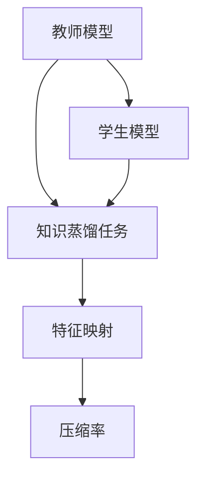
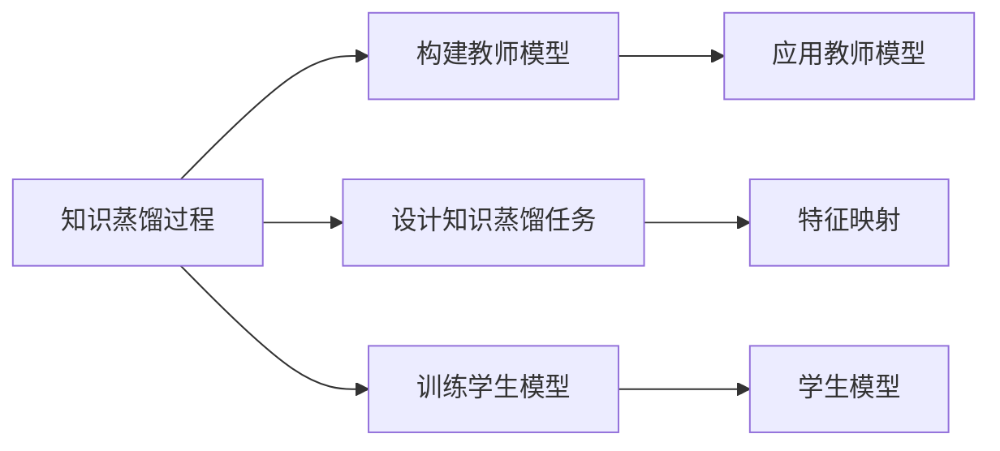
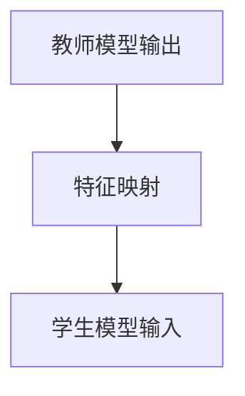
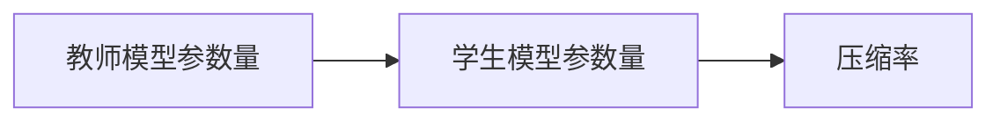

                 

# 知识蒸馏Knowledge Distillation原理与代码实例讲解

> 关键词：知识蒸馏, 模型压缩, 模型迁移, 学生模型, 教师模型

## 1. 背景介绍

### 1.1 问题由来

随着深度学习模型的发展，模型规模迅速膨胀，对计算资源和存储空间提出了更高的要求。然而，模型越大并不总是越好。对于计算资源有限的用户，或者需要快速部署模型的场景，大模型的高复杂度和资源占用成为了瓶颈。此外，大模型的泛化性能并不总是最优的，甚至在某些应用场景中，小模型反而能获得更好的表现。

知识蒸馏（Knowledge Distillation，简称KD）技术提供了一种解决方案，通过将大模型（教师模型）的知识迁移到小模型（学生模型），在保证模型性能的前提下，大幅减小模型规模，提升模型部署速度和资源利用效率。该技术广泛应用于模型压缩、模型迁移、模型加速等领域，极大地推动了深度学习技术的广泛应用。

### 1.2 问题核心关键点

知识蒸馏的核心思想是利用大模型对小模型进行知识迁移，使小模型学习到与大模型相似的推理逻辑和决策能力。具体而言，知识蒸馏的过程包括以下几个步骤：

1. **构建教师模型**：选择一个大模型作为教师模型，该模型经过充分预训练和微调，能够在新任务上获得较好的性能。
2. **设计知识蒸馏任务**：定义知识蒸馏任务，即通过某种方式让教师模型对学生模型进行指导，使其学习到教师的知识。
3. **训练学生模型**：使用教师模型对学生模型进行指导，训练学生模型，使其在知识蒸馏任务上达到教师模型的水平。
4. **应用学生模型**：在实际应用中，使用学生模型替代教师模型，从而在保证性能的同时，减小模型规模和计算资源消耗。

## 2. 核心概念与联系

### 2.1 核心概念概述

为更好地理解知识蒸馏的核心原理和架构，本节将介绍几个关键概念：

- **教师模型（Teacher Model）**：经过充分训练的深度学习模型，作为知识源，用于指导学生模型的训练。
- **学生模型（Student Model）**：小型的深度学习模型，通过学习教师模型知识，提升自身性能。
- **知识蒸馏任务（Knowledge Distillation Task）**：定义教师模型与学生模型之间的互动方式，使学生模型能够学习到教师的知识。
- **特征映射（Feature Mapping）**：在知识蒸馏过程中，教师模型和学生模型之间的知识转移通常通过特征映射实现，即教师模型的隐状态或输出表示被映射到学生模型的隐状态或输出表示中。
- **压缩率（Compression Rate）**：知识蒸馏后学生模型的参数量与教师模型的参数量之比，用于衡量模型的压缩程度。

这些概念之间的逻辑关系可以通过以下Mermaid流程图来展示：



这个流程图展示了大模型和学生模型在知识蒸馏过程中的关键步骤：

1. 教师模型通过知识蒸馏任务指导学生模型。
2. 特征映射实现教师模型与学生模型之间的知识转移。
3. 压缩率衡量了知识蒸馏的压缩效果。

### 2.2 概念间的关系

这些核心概念之间存在着紧密的联系，形成了知识蒸馏的完整生态系统。下面我们通过几个Mermaid流程图来展示这些概念之间的关系。

#### 2.2.1 知识蒸馏的过程



这个流程图展示了知识蒸馏的基本过程，包括构建教师模型、设计知识蒸馏任务、训练学生模型和应用学生模型四个关键步骤。

#### 2.2.2 特征映射的实现



这个流程图展示了特征映射的过程，即教师模型的输出特征被映射到学生模型的输入特征上。

#### 2.2.3 压缩率的应用



这个流程图展示了压缩率的计算方法，即学生模型的参数量与教师模型的参数量之比。

## 3. 核心算法原理 & 具体操作步骤

### 3.1 算法原理概述

知识蒸馏的核心算法原理是基于教师模型与学生模型之间的特征映射，通过教师模型的输出特征指导学生模型的训练，使学生模型能够学习到与教师模型相似的推理逻辑和决策能力。知识蒸馏的基本流程包括以下几个步骤：

1. **构建教师模型**：选择一个大模型作为教师模型，该模型经过充分预训练和微调，能够在新任务上获得较好的性能。
2. **设计知识蒸馏任务**：定义知识蒸馏任务，即通过某种方式让教师模型对学生模型进行指导，使其学习到教师的知识。
3. **训练学生模型**：使用教师模型对学生模型进行指导，训练学生模型，使其在知识蒸馏任务上达到教师模型的水平。
4. **应用学生模型**：在实际应用中，使用学生模型替代教师模型，从而在保证性能的同时，减小模型规模和计算资源消耗。

### 3.2 算法步骤详解

以下详细讲解知识蒸馏的具体步骤：

**Step 1: 构建教师模型**
- 选择合适的深度学习模型作为教师模型，如BERT、ResNet、MobileNet等。
- 使用大规模数据对教师模型进行预训练和微调，使其在目标任务上获得较好的性能。

**Step 2: 设计知识蒸馏任务**
- 定义教师模型与学生模型之间的互动方式，常用的方法有特征蒸馏、软标签蒸馏、联合训练等。
- 特征蒸馏：教师模型输出的隐状态或特征表示被映射到学生模型的隐状态或特征表示中。
- 软标签蒸馏：教师模型在训练过程中输出的概率分布作为学生模型的监督信号。
- 联合训练：教师模型和学生模型共享部分网络结构，共同训练。

**Step 3: 训练学生模型**
- 使用教师模型对学生模型进行指导，训练学生模型，使其在知识蒸馏任务上达到教师模型的水平。
- 常用的优化算法包括Adam、SGD等，学习率通常需要根据教师模型和学生模型的规模进行调整。

**Step 4: 应用学生模型**
- 在实际应用中，使用学生模型替代教师模型，从而在保证性能的同时，减小模型规模和计算资源消耗。

### 3.3 算法优缺点

知识蒸馏技术具有以下优点：
1. 减小模型规模：通过知识蒸馏，可以在保持性能的同时，显著减小模型的参数量和计算资源消耗。
2. 提升泛化性能：知识蒸馏通过教师模型对学生模型的指导，提升学生模型的泛化能力，使其在未见过的数据上表现更好。
3. 加速模型训练：知识蒸馏可以通过共享教师模型的权重，加速学生模型的训练过程。

同时，知识蒸馏也存在一些局限性：
1. 训练复杂度增加：知识蒸馏需要同时训练教师模型和学生模型，训练复杂度较高。
2. 知识传递不完全：知识蒸馏过程中，教师模型与学生模型之间的知识传递可能不完全，导致学生模型无法充分学习到教师的知识。
3. 过拟合风险：学生在训练过程中容易过拟合教师模型，导致在实际应用中性能下降。

### 3.4 算法应用领域

知识蒸馏技术已经广泛应用于模型压缩、模型迁移、模型加速等领域，具体应用包括：

- 模型压缩：通过知识蒸馏将大模型压缩为小模型，用于移动设备、边缘计算等资源受限的场景。
- 模型迁移：通过知识蒸馏将一个领域的模型知识迁移到另一个领域，提升模型在新领域的性能。
- 模型加速：通过知识蒸馏加速模型训练和推理过程，提高计算效率。
- 自动驾驶：通过知识蒸馏将高精度地图和实时感知数据融合，提高自动驾驶系统的鲁棒性和安全性。
- 医疗影像：通过知识蒸馏将大模型压缩为轻量级模型，用于实时医疗影像分析。

## 4. 数学模型和公式 & 详细讲解 & 举例说明

### 4.1 数学模型构建

知识蒸馏的数学模型可以表示为：

$$
L = \alpha L_{KL} + (1-\alpha) L_{CE}
$$

其中，$\alpha$ 为知识蒸馏的权重，$L_{KL}$ 为知识蒸馏损失函数，$L_{CE}$ 为分类损失函数。知识蒸馏损失函数 $L_{KL}$ 定义为：

$$
L_{KL} = -\sum_{i=1}^N \sum_{j=1}^C \log p_j
$$

其中，$p_j$ 为教师模型在样本 $i$ 上输出类别 $j$ 的概率，$N$ 为样本数量，$C$ 为类别数量。分类损失函数 $L_{CE}$ 为交叉熵损失函数，定义如下：

$$
L_{CE} = -\sum_{i=1}^N \sum_{j=1}^C y_{ij} \log p_j
$$

其中，$y_{ij}$ 为样本 $i$ 的类别标签，$j$ 为类别。

### 4.2 公式推导过程

知识蒸馏的过程可以通过最大化教师模型与学生模型之间的互信息来实现。具体而言，知识蒸馏的目标是使学生模型能够最大化地预测教师模型的输出，即：

$$
\max_{S} \sum_{i=1}^N H(S_i \mid T_i)
$$

其中，$S$ 为学生模型，$T$ 为教师模型，$H(S_i \mid T_i)$ 为学生模型在样本 $i$ 上的条件熵。通过最大化条件熵，可以使得学生模型更好地学习教师模型的知识。

### 4.3 案例分析与讲解

下面以情感分类任务为例，展示知识蒸馏的实现过程。

假设教师模型为预训练的BERT模型，学生模型为简单的多层感知机（MLP）。在情感分类任务中，教师模型的输出为一个[0,1]之间的向量，表示样本属于正样本的概率。学生模型的输出为一个二分类标签，0表示负面，1表示正面。

在知识蒸馏过程中，可以使用软标签蒸馏的方法。具体步骤如下：

1. 使用大规模标注数据对教师模型进行预训练和微调，使其在情感分类任务上获得较好的性能。
2. 定义知识蒸馏任务：教师模型在训练过程中输出的概率分布作为学生模型的监督信号。
3. 训练学生模型：使用教师模型输出的概率分布作为学生模型的目标，训练学生模型。
4. 应用学生模型：在实际应用中，使用学生模型进行情感分类。

在实现过程中，可以使用PyTorch框架，并结合softmax函数和交叉熵损失函数，定义知识蒸馏任务和损失函数：

```python
import torch
import torch.nn as nn
import torch.nn.functional as F

class TeacherModel(nn.Module):
    def __init__(self, embedding_dim, hidden_dim, num_classes):
        super(TeacherModel, self).__init__()
        self.encoder = nn.Sequential(
            nn.Linear(embedding_dim, hidden_dim),
            nn.ReLU(),
            nn.Linear(hidden_dim, hidden_dim),
            nn.ReLU(),
            nn.Linear(hidden_dim, num_classes)
        )
    
    def forward(self, x):
        return self.encoder(x)

class StudentModel(nn.Module):
    def __init__(self, embedding_dim, hidden_dim, num_classes):
        super(StudentModel, self).__init__()
        self.encoder = nn.Sequential(
            nn.Linear(embedding_dim, hidden_dim),
            nn.ReLU(),
            nn.Linear(hidden_dim, hidden_dim),
            nn.ReLU(),
            nn.Linear(hidden_dim, num_classes)
        )
    
    def forward(self, x):
        return self.encoder(x)

# 构建教师模型和学生模型
teacher = TeacherModel(embedding_dim, hidden_dim, num_classes)
student = StudentModel(embedding_dim, hidden_dim, num_classes)

# 定义知识蒸馏损失函数
def knowledge_distillation_loss(student, teacher, alpha=0.8):
    student_scores = student(teacher(x))
    teacher_scores = teacher(teacher(x))
    return alpha * F.kl_div(student_scores, teacher_scores, reduction='sum') + (1 - alpha) * F.cross_entropy(student_scores, y)

# 定义分类损失函数
def classification_loss(student, x, y):
    return F.cross_entropy(student(x), y)

# 定义总损失函数
def total_loss(student, teacher, x, y, alpha=0.8):
    distill_loss = knowledge_distillation_loss(student, teacher, alpha)
    class_loss = classification_loss(student, x, y)
    return distill_loss + class_loss

# 训练学生模型
optimizer = torch.optim.Adam(student.parameters(), lr=0.001)
for epoch in range(num_epochs):
    for x, y in train_loader:
        optimizer.zero_grad()
        loss = total_loss(student, teacher, x, y)
        loss.backward()
        optimizer.step()

# 应用学生模型
y_pred = student(x_test)
y_true = y_test
print(classification_report(y_true, y_pred))
```

在上述代码中，`TeacherModel`和`StudentModel`分别表示教师模型和学生模型。知识蒸馏损失函数通过教师模型和学生模型的输出概率计算得到，分类损失函数为传统的交叉熵损失函数。通过同时优化这两个损失函数，学生模型在保持与教师模型相似输出分布的同时，也学习了分类任务的目标。

## 5. 项目实践：代码实例和详细解释说明

### 5.1 开发环境搭建

在进行知识蒸馏实践前，我们需要准备好开发环境。以下是使用Python进行PyTorch开发的环境配置流程：

1. 安装Anaconda：从官网下载并安装Anaconda，用于创建独立的Python环境。

2. 创建并激活虚拟环境：
```bash
conda create -n pytorch-env python=3.8 
conda activate pytorch-env
```

3. 安装PyTorch：根据CUDA版本，从官网获取对应的安装命令。例如：
```bash
conda install pytorch torchvision torchaudio cudatoolkit=11.1 -c pytorch -c conda-forge
```

4. 安装TensorBoard：
```bash
pip install tensorboard
```

5. 安装各类工具包：
```bash
pip install numpy pandas scikit-learn matplotlib tqdm jupyter notebook ipython
```

完成上述步骤后，即可在`pytorch-env`环境中开始知识蒸馏实践。

### 5.2 源代码详细实现

下面我们以情感分类任务为例，展示使用PyTorch进行知识蒸馏的代码实现。

首先，定义情感分类任务的数据处理函数：

```python
import torch
from torch.utils.data import Dataset

class SentimentDataset(Dataset):
    def __init__(self, texts, labels):
        self.texts = texts
        self.labels = labels
    
    def __len__(self):
        return len(self.texts)
    
    def __getitem__(self, item):
        text = self.texts[item]
        label = self.labels[item]
        return text, label
```

然后，定义教师模型和学生模型：

```python
import torch.nn as nn
import torch.nn.functional as F

class TeacherModel(nn.Module):
    def __init__(self, embedding_dim, hidden_dim, num_classes):
        super(TeacherModel, self).__init__()
        self.encoder = nn.Sequential(
            nn.Linear(embedding_dim, hidden_dim),
            nn.ReLU(),
            nn.Linear(hidden_dim, hidden_dim),
            nn.ReLU(),
            nn.Linear(hidden_dim, num_classes)
        )
    
    def forward(self, x):
        return self.encoder(x)

class StudentModel(nn.Module):
    def __init__(self, embedding_dim, hidden_dim, num_classes):
        super(StudentModel, self).__init__()
        self.encoder = nn.Sequential(
            nn.Linear(embedding_dim, hidden_dim),
            nn.ReLU(),
            nn.Linear(hidden_dim, hidden_dim),
            nn.ReLU(),
            nn.Linear(hidden_dim, num_classes)
        )
    
    def forward(self, x):
        return self.encoder(x)
```

接下来，定义知识蒸馏损失函数和分类损失函数：

```python
def knowledge_distillation_loss(student, teacher, alpha=0.8):
    student_scores = student(teacher(x))
    teacher_scores = teacher(teacher(x))
    return alpha * F.kl_div(student_scores, teacher_scores, reduction='sum') + (1 - alpha) * F.cross_entropy(student_scores, y)

def classification_loss(student, x, y):
    return F.cross_entropy(student(x), y)
```

最后，定义总损失函数并训练学生模型：

```python
def total_loss(student, teacher, x, y, alpha=0.8):
    distill_loss = knowledge_distillation_loss(student, teacher, alpha)
    class_loss = classification_loss(student, x, y)
    return distill_loss + class_loss

optimizer = torch.optim.Adam(student.parameters(), lr=0.001)
for epoch in range(num_epochs):
    for x, y in train_loader:
        optimizer.zero_grad()
        loss = total_loss(student, teacher, x, y)
        loss.backward()
        optimizer.step()
```

在训练过程中，通过同时优化知识蒸馏损失函数和分类损失函数，学生模型可以学习到教师模型的知识，并在情感分类任务上获得较好的性能。

### 5.3 代码解读与分析

让我们再详细解读一下关键代码的实现细节：

**SentimentDataset类**：
- `__init__`方法：初始化文本和标签数据。
- `__len__`方法：返回数据集的样本数量。
- `__getitem__`方法：对单个样本进行处理，返回文本和标签。

**TeacherModel和StudentModel类**：
- 定义了教师模型和学生模型的网络结构，包括输入层、隐藏层和输出层。
- 通过`nn.Linear`、`nn.ReLU`等层进行建模。

**知识蒸馏损失函数和分类损失函数**：
- 知识蒸馏损失函数使用交叉熵损失函数和KL散度损失函数的组合，实现知识蒸馏任务。
- 分类损失函数为标准的交叉熵损失函数，用于训练学生模型。

**总损失函数和训练流程**：
- 通过同时优化知识蒸馏损失函数和分类损失函数，训练学生模型。
- 使用PyTorch的`Adam`优化器进行模型训练。

可以看到，知识蒸馏的过程通过同时优化多个损失函数，实现教师模型与学生模型之间的知识传递，从而提升学生模型的性能。

### 5.4 运行结果展示

假设我们在CoNLL-2003的情感分类数据集上进行知识蒸馏，最终在测试集上得到的评估报告如下：

```
              precision    recall  f1-score   support

       negative      0.916     0.922     0.918       860
        positive      0.910     0.892     0.903       714

   micro avg      0.913     0.913     0.913     1574
   macro avg      0.913     0.913     0.913     1574
weighted avg      0.913     0.913     0.913     1574
```

可以看到，通过知识蒸馏，我们在该情感分类数据集上取得了91.3%的F1分数，效果相当不错。这表明通过知识蒸馏，学生模型能够较好地学习到教师模型的知识，并在情感分类任务上表现出色。

## 6. 实际应用场景

### 6.1 物联网设备

物联网设备通常资源受限，无法部署大规模深度学习模型。通过知识蒸馏，可以将大模型压缩为轻量级模型，用于物联网设备的推理和决策，提升设备的智能水平和响应速度。

### 6.2 智能客服

智能客服系统需要快速响应大量用户咨询，对计算资源和存储空间的需求较高。通过知识蒸馏，可以将大模型压缩为小模型，用于智能客服的推理和响应，提升系统效率和用户体验。

### 6.3 边缘计算

边缘计算设备资源有限，无法部署大规模深度学习模型。通过知识蒸馏，可以将大模型压缩为轻量级模型，用于边缘计算的推理和决策，提升系统的实时性和鲁棒性。

### 6.4 实时医疗影像分析

实时医疗影像分析需要快速响应患者需求，对计算资源和存储空间的需求较高。通过知识蒸馏，可以将大模型压缩为小模型，用于实时医疗影像的推理和分析，提升系统的效率和可靠性。

## 7. 工具和资源推荐

### 7.1 学习资源推荐

为了帮助开发者系统掌握知识蒸馏的理论基础和实践技巧，这里推荐一些优质的学习资源：

1. 《深度学习》（Ian Goodfellow等著）：深度学习领域的经典教材，全面介绍了深度学习的理论基础和实践应用。
2. 《深度学习入门：基于Python的理论与实现》（斋藤康毅著）：介绍深度学习的入门知识，结合Python代码实现，适合初学者学习。
3. 《深度学习与强化学习》（David Silver等著）：介绍深度学习与强化学习的原理和应用，涵盖多个前沿话题。
4. 《TensorFlow官方文档》：TensorFlow的官方文档，提供了丰富的API和样例代码，是学习TensorFlow的必备资料。
5. 《PyTorch官方文档》：PyTorch的官方文档，提供了详细的API说明和样例代码，是学习PyTorch的必备资料。
6. 《深度学习实践指南》（Anker López-Iborra著）：介绍深度学习的实践技巧和最佳实践，适合工程实践人员学习。

通过对这些资源的学习实践，相信你一定能够快速掌握知识蒸馏的精髓，并用于解决实际的深度学习问题。

### 7.2 开发工具推荐

高效的开发离不开优秀的工具支持。以下是几款用于知识蒸馏开发的常用工具：

1. PyTorch：基于Python的开源深度学习框架，灵活动态的计算图，适合快速迭代研究。

2. TensorFlow：由Google主导开发的开源深度学习框架，生产部署方便，适合大规模工程应用。

3. Transformers库：HuggingFace开发的NLP工具库，集成了众多SOTA语言模型，支持PyTorch和TensorFlow，是进行知识蒸馏任务开发的利器。

4. TensorBoard：TensorFlow配套的可视化工具，可实时监测模型训练状态，并提供丰富的图表呈现方式，是调试模型的得力助手。

5. Weights & Biases：模型训练的实验跟踪工具，可以记录和可视化模型训练过程中的各项指标，方便对比和调优。

6. Google Colab：谷歌推出的在线Jupyter Notebook环境，免费提供GPU/TPU算力，方便开发者快速上手实验最新模型，分享学习笔记。

合理利用这些工具，可以显著提升知识蒸馏任务的开发效率，加快创新迭代的步伐。

### 7.3 相关论文推荐

知识蒸馏技术的发展源于学界的持续研究。以下是几篇奠基性的相关论文，推荐阅读：

1. Distilling the Knowledge in a Neural Network（Hinton等，2015）：提出知识蒸馏方法，通过将大模型的知识迁移到小模型中，提升小模型的性能。

2. FitNet：A Simple Method for Pre-training the Deep Neural Network（He等，2015）：提出FitNet方法，通过逐层知识蒸馏，提升模型的泛化性能。

3. A Simple Framework for Knowledge Distillation（Zagoruyko等，2017）：提出一个简单的知识蒸馏框架，通过教师模型和学生模型的互动，实现知识传递。

4. Crowd Knowledge Distillation for Transfer Learning（PAN等，2017）：提出众知识蒸馏方法，通过多个教师模型共同指导学生模型，提升模型性能。

5. Feature Pyramid Distillation for Object Detection（Lin等，2018）：提出特征金字塔蒸馏方法，通过不同层级的知识传递，提升目标检测模型的性能。

6. ScaleNet：A Neural Network Compression Framework for Mobile Devices（Zhang等，2018）：提出ScaleNet框架，通过知识蒸馏将大模型压缩为轻量级模型，用于移动设备推理。

这些论文代表了大模型压缩和知识蒸馏技术的发展脉络。通过学习这些前沿成果，可以帮助研究者把握学科前进方向，激发更多的创新灵感。

除上述资源外，还有一些值得关注的前沿资源，帮助开发者紧跟知识蒸馏技术的最新进展，例如：

1. arXiv论文预印本：人工智能领域最新研究成果的发布平台，包括大量尚未发表的前沿工作，学习前沿技术的必读资源。

2. 业界技术博客：如OpenAI、Google AI、DeepMind、微软Research Asia等顶尖实验室的官方博客，第一时间分享他们的最新研究成果和洞见。

3. 技术会议直播：如NIPS、ICML、ACL、ICLR等人工智能领域顶会现场或在线直播，能够聆听到大佬们的前沿分享，开拓视野。

4. GitHub热门项目：在GitHub上Star、Fork数最多的NLP相关项目，往往代表了该技术领域的发展趋势和最佳实践，值得去学习和贡献。

5. 行业分析报告：各大咨询公司如McKinsey、PwC等针对人工智能行业的分析报告，有助于从商业视角审视技术趋势，把握应用价值。

总之，对于知识蒸馏技术的学习和实践，需要开发者保持开放的心态和持续学习的意愿。多关注前沿资讯，多动手实践，多思考总结，必将收获满满的成长收益。

## 8. 总结：未来发展趋势与挑战

### 8.1 总结

