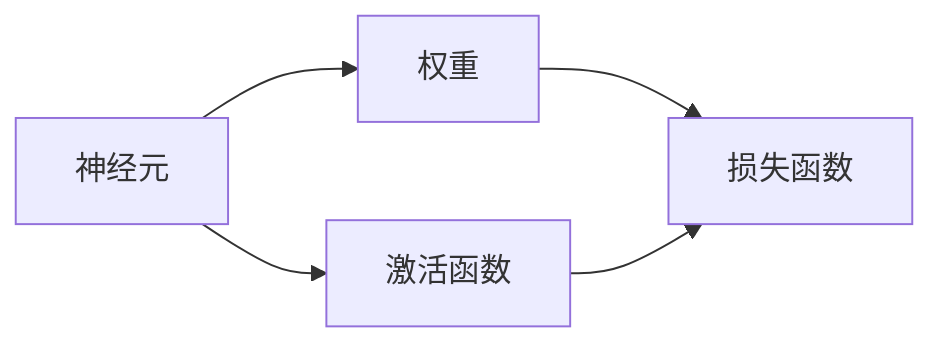

                 

# 神经网络 原理与代码实例讲解

## 1. 背景介绍

神经网络（Neural Networks）是一种模仿人类神经系统的计算模型，通过模拟神经元之间信息的传递与交互，实现复杂模式识别与预测任务。近年来，随着深度学习技术的不断成熟，神经网络在图像识别、语音识别、自然语言处理、推荐系统等领域取得了巨大成功。本文将深入讲解神经网络的基本原理，并通过代码实例展示其实现过程。

## 2. 核心概念与联系

### 2.1 核心概念概述

神经网络由大量的神经元（或称节点）和连接这些神经元的边（权重）组成。每个神经元接收若干输入，并根据一定的规则（激活函数）生成一个输出。通过多层堆叠，神经网络可以对输入数据进行逐级抽象，最终生成对目标任务的预测。

### 2.2 概念间的关系

神经网络的基本组成单元包括神经元、权重、激活函数、损失函数等。它们之间的关系可以通过以下Mermaid流程图来展示：



神经元通过连接权重接收输入，并经过激活函数进行处理。损失函数用于衡量模型输出与实际标签之间的差异，并指导模型的优化过程。这些核心概念共同构成了神经网络的基本工作机制。

## 3. 核心算法原理 & 具体操作步骤

### 3.1 算法原理概述

神经网络的训练过程分为前向传播和反向传播两个步骤。前向传播是从输入层开始，逐层计算神经元的输出，直到输出层生成预测结果的过程。反向传播则是根据预测结果与实际标签的差异，通过链式法则计算各层参数的梯度，并更新参数以优化模型性能。

### 3.2 算法步骤详解

#### 3.2.1 前向传播

前向传播的数学表达式为：

$$
\text{output} = \sigma(\text{weights} \times \text{input} + \text{bias})
$$

其中 $\sigma$ 表示激活函数，$\text{weights}$ 为权重矩阵，$\text{input}$ 为输入数据，$\text{bias}$ 为偏置项。激活函数通常选择 sigmoid、ReLU 等非线性函数，以引入非线性特性，增强模型的表达能力。

#### 3.2.2 反向传播

反向传播的核心思想是通过链式法则计算梯度，并逐层更新参数。具体步骤如下：

1. 计算预测输出与实际标签之间的损失函数。
2. 计算损失函数对输出层权重和偏置的梯度。
3. 通过链式法则计算每一层的参数梯度。
4. 使用梯度下降等优化算法更新参数，最小化损失函数。

### 3.3 算法优缺点

#### 3.3.1 优点

1. 强大的表达能力：神经网络通过多层堆叠，可以捕获数据的复杂结构，适用于各种非线性模式识别任务。
2. 可扩展性强：神经网络的结构可以灵活调整，适用于不同的数据类型和任务。
3. 通用性高：神经网络在图像、语音、自然语言处理等领域都有广泛应用，取得了优秀的性能。

#### 3.3.2 缺点

1. 计算复杂度高：神经网络需要大量的参数和计算资源，训练速度较慢。
2. 过拟合风险高：神经网络结构复杂，容易过拟合训练数据，泛化性能较差。
3. 可解释性差：神经网络被视为"黑盒"模型，难以解释其内部工作机制。

### 3.4 算法应用领域

神经网络在图像识别、语音识别、自然语言处理、推荐系统等领域都有广泛应用。以下是几个典型的应用案例：

1. **图像分类**：将输入图像转换为数值向量，通过神经网络进行分类预测。
2. **语音识别**：将输入语音转换为文本，通过神经网络进行识别。
3. **自然语言处理**：将输入文本转换为数值向量，通过神经网络进行情感分析、机器翻译等任务。
4. **推荐系统**：将用户行为数据和商品特征数据转换为数值向量，通过神经网络进行协同过滤和商品推荐。

## 4. 数学模型和公式 & 详细讲解 & 举例说明

### 4.1 数学模型构建

神经网络通常由输入层、隐藏层和输出层组成。设输入数据为 $x$，隐藏层神经元数为 $h$，输出层神经元数为 $o$，权重矩阵分别为 $W_h$ 和 $W_o$，偏置项分别为 $b_h$ 和 $b_o$，激活函数为 $\sigma$。则神经网络的数学模型可以表示为：

$$
\text{hidden\_representation} = \sigma(W_h \times x + b_h)
$$

$$
\text{output\_prediction} = \sigma(W_o \times \text{hidden\_representation} + b_o)
$$

### 4.2 公式推导过程

以单层神经网络为例，其前向传播和反向传播过程的数学推导如下：

#### 4.2.1 前向传播

设输入数据为 $x$，隐藏层权重矩阵为 $W_h$，偏置项为 $b_h$，激活函数为 $\sigma$，则前向传播过程为：

$$
z_h = W_h \times x + b_h
$$

$$
a_h = \sigma(z_h)
$$

其中 $z_h$ 为隐藏层的加权输入，$a_h$ 为隐藏层的激活值。输出层的计算过程类似，以单层神经网络为例：

$$
z_o = W_o \times a_h + b_o
$$

$$
a_o = \sigma(z_o)
$$

#### 4.2.2 反向传播

假设输出层与实际标签之间存在误差 $e$，则损失函数 $L$ 可以表示为：

$$
L = \frac{1}{2} \Vert y - a_o \Vert^2
$$

其中 $y$ 为实际标签，$a_o$ 为神经网络的输出预测值。反向传播过程中，首先需要计算预测输出与实际标签之间的误差 $e$，然后计算误差对输出层权重和偏置的梯度，再通过链式法则计算隐藏层的参数梯度，并使用梯度下降等优化算法更新参数。

### 4.3 案例分析与讲解

以手写数字识别为例，我们可以使用 MNIST 数据集进行神经网络的训练和测试。通过向神经网络输入手写数字的灰度图像，输出预测的数字，并使用交叉熵损失函数进行优化。以下是一个简单的单层神经网络的代码实现：

```python
import torch
import torch.nn as nn
import torch.optim as optim
from torch.utils.data import DataLoader, Dataset

class MNISTDataset(Dataset):
    def __init__(self, data_path, transform=None):
        self.data = torch.load(data_path)
        self.transform = transform
    
    def __len__(self):
        return len(self.data)
    
    def __getitem__(self, idx):
        x, y = self.data[idx]
        x = x.reshape(1, 784)
        if self.transform is not None:
            x = self.transform(x)
        return x, y

class MNISTNet(nn.Module):
    def __init__(self, num_classes):
        super(MNISTNet, self).__init__()
        self.fc1 = nn.Linear(784, 256)
        self.fc2 = nn.Linear(256, num_classes)
        self.relu = nn.ReLU()
    
    def forward(self, x):
        x = x.reshape(-1, 784)
        x = self.relu(self.fc1(x))
        x = self.fc2(x)
        return x

def train(model, device, train_loader, optimizer, epoch):
    model.train()
    for batch_idx, (data, target) in enumerate(train_loader):
        data, target = data.to(device), target.to(device)
        optimizer.zero_grad()
        output = model(data)
        loss = nn.CrossEntropyLoss()(output, target)
        loss.backward()
        optimizer.step()
        if batch_idx % 100 == 0:
            print(f'Epoch: {epoch}, Batch: {batch_idx}, Loss: {loss.item()}')

def test(model, device, test_loader):
    model.eval()
    correct = 0
    total = 0
    with torch.no_grad():
        for data, target in test_loader:
            data, target = data.to(device), target.to(device)
            output = model(data)
            _, predicted = torch.max(output, 1)
            total += target.size(0)
            correct += (predicted == target).sum().item()
    print(f'Test Accuracy: {100 * correct / total}%')

# 加载数据集
train_path = 'mnist_train.pkl'
test_path = 'mnist_test.pkl'
train_dataset = MNISTDataset(train_path)
test_dataset = MNISTDataset(test_path)
train_loader = DataLoader(train_dataset, batch_size=64, shuffle=True)
test_loader = DataLoader(test_dataset, batch_size=64, shuffle=False)

# 初始化模型和优化器
model = MNISTNet(num_classes=10).to(device)
optimizer = optim.Adam(model.parameters(), lr=0.001)
loss_fn = nn.CrossEntropyLoss()

# 训练模型
device = torch.device('cuda' if torch.cuda.is_available() else 'cpu')
train(model, device, train_loader, optimizer, epoch=10)

# 测试模型
test(model, device, test_loader)
```

### 4.3.1 代码解读与分析

以上代码实现了单层神经网络对手写数字的识别任务。具体步骤如下：

1. 定义 MNISTDataset 类，加载 MNIST 数据集，并进行数据预处理。
2. 定义 MNISTNet 类，定义神经网络的结构和前向传播过程。
3. 定义训练函数 train，在训练数据集上进行前向传播和反向传播，使用交叉熵损失函数和 Adam 优化器进行参数更新。
4. 定义测试函数 test，在测试数据集上进行前向传播，计算预测准确率。
5. 加载数据集，初始化模型和优化器，并在 GPU 上进行训练和测试。

## 5. 项目实践：代码实例和详细解释说明

### 5.1 开发环境搭建

在进行神经网络项目实践前，需要准备好开发环境。以下是使用 Python 进行 PyTorch 开发的环境配置流程：

1. 安装 Anacoda：从官网下载并安装 Anacoda，用于创建独立的 Python 环境。
2. 创建并激活虚拟环境：
   ```bash
   conda create -n pytorch-env python=3.8 
   conda activate pytorch-env
   ```
3. 安装 PyTorch：根据 CUDA 版本，从官网获取对应的安装命令。例如：
   ```bash
   conda install pytorch torchvision torchaudio cudatoolkit=11.1 -c pytorch -c conda-forge
   ```
4. 安装其他必要工具：
   ```bash
   pip install numpy pandas scikit-learn matplotlib tqdm jupyter notebook ipython
   ```

完成上述步骤后，即可在 `pytorch-env` 环境中开始项目实践。

### 5.2 源代码详细实现

以下是一个简单的卷积神经网络（CNN）代码实现，用于图像分类任务：

```python
import torch
import torch.nn as nn
import torch.optim as optim
from torch.utils.data import DataLoader, Dataset

class CIFAR10Dataset(Dataset):
    def __init__(self, data_path, transform=None):
        self.data = torch.load(data_path)
        self.transform = transform
    
    def __len__(self):
        return len(self.data)
    
    def __getitem__(self, idx):
        x, y = self.data[idx]
        x = x.reshape(1, 3, 32, 32)
        if self.transform is not None:
            x = self.transform(x)
        return x, y

class CIFARNet(nn.Module):
    def __init__(self):
        super(CIFARNet, self).__init__()
        self.conv1 = nn.Conv2d(3, 6, 5)
        self.pool = nn.MaxPool2d(2, 2)
        self.conv2 = nn.Conv2d(6, 16, 5)
        self.fc1 = nn.Linear(16 * 5 * 5, 120)
        self.fc2 = nn.Linear(120, 84)
        self.fc3 = nn.Linear(84, 10)
        self.relu = nn.ReLU()
    
    def forward(self, x):
        x = self.relu(self.conv1(x))
        x = self.pool(x)
        x = self.relu(self.conv2(x))
        x = self.pool(x)
        x = x.reshape(-1, 16 * 5 * 5)
        x = self.relu(self.fc1(x))
        x = self.fc2(x)
        x = self.fc3(x)
        return x

def train(model, device, train_loader, optimizer, epoch):
    model.train()
    for batch_idx, (data, target) in enumerate(train_loader):
        data, target = data.to(device), target.to(device)
        optimizer.zero_grad()
        output = model(data)
        loss = nn.CrossEntropyLoss()(output, target)
        loss.backward()
        optimizer.step()
        if batch_idx % 100 == 0:
            print(f'Epoch: {epoch}, Batch: {batch_idx}, Loss: {loss.item()}')

def test(model, device, test_loader):
    model.eval()
    correct = 0
    total = 0
    with torch.no_grad():
        for data, target in test_loader:
            data, target = data.to(device), target.to(device)
            output = model(data)
            _, predicted = torch.max(output, 1)
            total += target.size(0)
            correct += (predicted == target).sum().item()
    print(f'Test Accuracy: {100 * correct / total}%')

# 加载数据集
train_path = 'cifar10_train.pkl'
test_path = 'cifar10_test.pkl'
train_dataset = CIFAR10Dataset(train_path)
test_dataset = CIFAR10Dataset(test_path)
train_loader = DataLoader(train_dataset, batch_size=64, shuffle=True)
test_loader = DataLoader(test_dataset, batch_size=64, shuffle=False)

# 初始化模型和优化器
model = CIFARNet().to(device)
optimizer = optim.Adam(model.parameters(), lr=0.001)
loss_fn = nn.CrossEntropyLoss()

# 训练模型
device = torch.device('cuda' if torch.cuda.is_available() else 'cpu')
train(model, device, train_loader, optimizer, epoch=10)

# 测试模型
test(model, device, test_loader)
```

### 5.3 代码解读与分析

以上代码实现了卷积神经网络（CNN）在 CIFAR-10 数据集上的图像分类任务。具体步骤如下：

1. 定义 CIFAR10Dataset 类，加载 CIFAR-10 数据集，并进行数据预处理。
2. 定义 CIFARNet 类，定义神经网络的结构和前向传播过程。
3. 定义训练函数 train，在训练数据集上进行前向传播和反向传播，使用交叉熵损失函数和 Adam 优化器进行参数更新。
4. 定义测试函数 test，在测试数据集上进行前向传播，计算预测准确率。
5. 加载数据集，初始化模型和优化器，并在 GPU 上进行训练和测试。

## 6. 实际应用场景

### 6.1 图像分类

图像分类是神经网络最基本的应用之一。通过训练神经网络，可以实现对大规模图像数据集的高效分类，广泛应用于医学影像分析、安防监控、自动驾驶等领域。例如，医院可以使用卷积神经网络对手部 X 光片进行自动分类，帮助医生诊断手部疾病。

### 6.2 语音识别

语音识别是神经网络的另一个重要应用领域。通过训练神经网络，可以实现对语音信号的自动转写，广泛应用于智能家居、虚拟助手、语音搜索等领域。例如，智能音箱可以使用卷积神经网络对用户语音进行识别，实现自然对话。

### 6.3 自然语言处理

自然语言处理（NLP）是神经网络的重要应用场景。通过训练神经网络，可以实现对文本数据的自动处理，广泛应用于机器翻译、情感分析、文本生成等领域。例如，机器翻译系统可以使用序列到序列模型，自动将一种语言翻译成另一种语言。

## 7. 工具和资源推荐

### 7.1 学习资源推荐

为了帮助开发者系统掌握神经网络的理论基础和实践技巧，这里推荐一些优质的学习资源：

1. 《深度学习》课程（Andrew Ng）：斯坦福大学开设的深度学习入门课程，详细讲解了神经网络的基本概念和算法原理。
2. 《深度学习与神经网络》书籍：Ian Goodfellow 所著，全面介绍了神经网络的理论基础和实际应用。
3. PyTorch 官方文档：PyTorch 框架的官方文档，提供了丰富的代码示例和详细解释。
4. TensorFlow 官方文档：TensorFlow 框架的官方文档，提供了丰富的代码示例和详细解释。
5. Kaggle 比赛：Kaggle 平台上提供的大量机器学习比赛，可以实践和检验神经网络的性能。

通过对这些资源的学习实践，相信你一定能够快速掌握神经网络的基本原理和实现方法，并应用于实际项目中。

### 7.2 开发工具推荐

高效的开发离不开优秀的工具支持。以下是几款用于神经网络开发的常用工具：

1. PyTorch：基于 Python 的开源深度学习框架，灵活动态的计算图，适合快速迭代研究。
2. TensorFlow：由 Google 主导开发的开源深度学习框架，生产部署方便，适合大规模工程应用。
3. Keras：基于 TensorFlow 和 Theano 的高级深度学习框架，易于上手。
4. Jupyter Notebook：支持多语言和多种框架的交互式编程环境，方便代码调试和实验记录。

合理利用这些工具，可以显著提升神经网络开发的效率，加速项目的迭代和优化。

### 7.3 相关论文推荐

神经网络研究历史悠久，涉及众多经典和前沿成果。以下是几篇奠基性的相关论文，推荐阅读：

1. 《神经网络与深度学习》：Ian Goodfellow 所著，全面介绍了神经网络的理论基础和实际应用。
2. 《深度学习》（杨强）：讲解了神经网络的基本概念、算法原理和实际应用。
3. 《ImageNet Classification with Deep Convolutional Neural Networks》：AlexNet 的论文，展示了深度卷积神经网络在图像分类任务上的强大表现。
4. 《Recurrent Neural Network for Image Captioning》：LSTM 的论文，展示了递归神经网络在图像描述生成任务上的成功应用。
5. 《Attention is All You Need》：Transformer 的论文，展示了注意力机制在自然语言处理任务上的强大效果。

这些论文代表了大神经网络的发展脉络，有助于理解其基本原理和实际应用。

除上述资源外，还有一些值得关注的前沿资源，帮助开发者紧跟神经网络技术的最新进展，例如：

1. arXiv 论文预印本：人工智能领域最新研究成果的发布平台，包括大量尚未发表的前沿工作，学习前沿技术的必读资源。
2. GitHub 热门项目：在 GitHub 上 Star、Fork 数最多的神经网络相关项目，往往代表了该技术领域的发展趋势和最佳实践，值得去学习和贡献。
3. 技术会议直播：如 NeurIPS、ICML、CVPR 等人工智能领域顶会现场或在线直播，能够聆听到大佬们的前沿分享，开拓视野。

总之，对于神经网络的学习和实践，需要开发者保持开放的心态和持续学习的意愿。多关注前沿资讯，多动手实践，多思考总结，必将收获满满的成长收益。

## 8. 总结：未来发展趋势与挑战

### 8.1 总结

本文对神经网络的基本原理和代码实例进行了全面讲解。通过详细阐述神经网络的核心概念、实现方法和应用场景，帮助读者理解神经网络的工作机制，并通过代码实例展示其实现过程。通过本文的系统梳理，可以看到，神经网络作为深度学习的重要组成部分，已经广泛应用于图像识别、语音识别、自然语言处理等领域，取得了显著的成果。未来，随着神经网络的不断发展，其应用范围将更加广泛，技术水平将不断提升。

### 8.2 未来发展趋势

展望未来，神经网络将呈现以下几个发展趋势：

1. 更深的结构：随着模型训练技术的不断进步，神经网络的结构将更深更复杂，以实现更强大的表达能力和更精细的特征学习。
2. 更强的可解释性：神经网络的可解释性将不断增强，帮助人们理解模型的决策过程，避免“黑盒”问题。
3. 更高效的计算：神经网络的计算将更加高效，通过模型压缩、模型蒸馏等技术，降低计算资源消耗。
4. 更广泛的应用：神经网络将广泛应用于更多领域，如医疗、金融、教育等，带来新的价值。

### 8.3 面临的挑战

尽管神经网络在许多领域取得了成功，但在走向实际应用的过程中，仍然面临诸多挑战：

1. 计算资源需求高：神经网络的结构复杂，需要大量的计算资源和存储空间，限制了其在大规模任务中的应用。
2. 过拟合风险高：神经网络容易过拟合训练数据，泛化性能较差，特别是在数据量较少的情况下。
3. 可解释性差：神经网络被视为“黑盒”模型，难以解释其内部工作机制和决策逻辑。
4. 安全性有待提高：神经网络在实际应用中可能产生有害输出，如假新闻、有害信息等，需要加强数据筛选和模型监督。
5. 技术门槛高：神经网络的研究和开发需要较高的技术门槛，对开发者和用户的要求较高。

### 8.4 未来突破

面对神经网络面临的挑战，未来的研究需要在以下几个方面寻求新的突破：

1. 更高效的结构设计：通过更深入的网络结构研究，设计更高效、更合理的神经网络结构。
2. 更先进的优化算法：研究更高效的优化算法，如自适应优化算法、联邦学习等，提高模型的训练效率和泛化能力。
3. 更强大的可解释性：通过引入符号化规则、可解释性模块等技术，提高神经网络的解释能力。
4. 更安全的模型训练：通过数据筛选、规则约束等手段，确保神经网络的输出符合伦理和道德要求。
5. 更广泛的实践应用：推动神经网络在更多领域的应用，为传统行业带来智能化变革。

这些研究方向的探索发展，必将引领神经网络技术迈向更高的台阶，为构建智能系统提供更加强大的技术支持。面向未来，神经网络研究将持续深入，为实现更高效、更智能、更安全的智能化系统贡献力量。

## 9. 附录：常见问题与解答

**Q1：神经网络的计算复杂度高，如何解决这一问题？**

A: 神经网络的计算复杂度高，可以通过以下几种方法进行优化：
1. 模型压缩：通过剪枝、量化、蒸馏等技术，减小模型大小，降低计算复杂度。
2. 分布式训练：利用分布式计算资源，加速模型训练。
3. 硬件优化：使用 GPU、TPU 等高性能计算设备，提高训练速度。

**Q2：神经网络容易出现过拟合，如何解决这一问题？**

A: 神经网络容易出现过拟合，可以通过以下几种方法进行优化：
1. 数据增强：通过旋转、平移、缩放等手段扩充训练集，增强数据多样性。
2. 正则化：通过 L2 正则、Dropout 等手段限制模型复杂度。
3. 早停法：在验证集性能不再提升时停止训练，避免过拟合。
4. 模型集成：通过多个模型的集成，减小单个模型的过拟合风险。

**Q3：神经网络的可解释性差，如何解决这一问题？**

A: 神经网络的可解释性差，可以通过以下几种方法进行优化：
1. 可视化技术：使用可视化工具，如梯度图、热力图等，帮助理解模型内部工作机制。
2. 符号化规则：引入符号化规则，增强模型的解释能力。
3. 知识蒸馏：通过知识蒸馏技术，将复杂模型的知识传递给简单模型，提高模型的可解释性。

**Q4：神经网络在实际应用中可能产生有害输出，如何解决这一问题？**

A: 神经网络在实际应用中可能产生有害输出，可以通过以下几种方法进行优化：
1. 数据筛选：在数据输入阶段进行严格筛选，避免有害数据的进入。
2. 模型约束：在模型设计阶段引入约束，确保模型输出符合伦理道德要求。
3. 模型监控：在模型部署后进行实时监控，及时发现和纠正有害输出。

总之，神经网络技术的未来发展潜力巨大，但面临的挑战也不容忽视。只有通过不断的技术创新和实践优化，才能克服这些挑战，使神经网络技术更好地服务于人类的生产和生活。

---

作者：禅与计算机程序设计艺术 / Zen and the Art of Computer Programming

