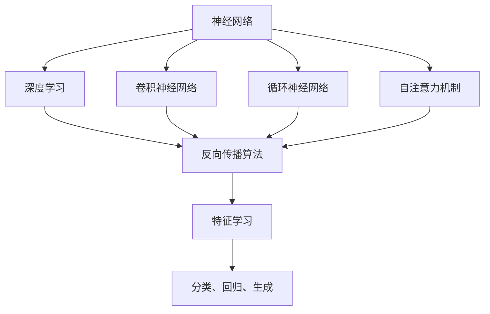

                 

# 神经网络：机器学习的新范式

## 1. 背景介绍

### 1.1 问题由来

机器学习（Machine Learning, ML）作为人工智能（Artificial Intelligence, AI）的重要分支，已经取得了长足的进展。传统的机器学习算法，如决策树、支持向量机、朴素贝叶斯等，在数据量较小时，往往能够提供不错的效果。然而，随着数据规模的迅速增长，传统算法难以处理高维度、大规模数据集，逐渐被新一代算法所取代。

在这个背景下，神经网络（Neural Networks, NN）作为一种具有强大表征能力的机器学习模型，逐渐成为研究的热点。特别是深度神经网络（Deep Neural Networks, DNN）和卷积神经网络（Convolutional Neural Networks, CNN）等结构，以其强大的表达能力和自动特征提取能力，在大规模数据集上取得了显著的效果，广泛应用于图像识别、自然语言处理、语音识别等领域。

然而，神经网络并非一蹴而就。从早期的感知机、多层感知机，到卷积神经网络、循环神经网络、注意力机制等，神经网络经历了几十年的发展。尽管其复杂度和表达能力不断提升，但模型的构建、调优、解释等方面，仍然存在诸多挑战。

## 2. 核心概念与联系

### 2.1 核心概念概述

为更好地理解神经网络的工作原理和核心思想，本节将介绍几个密切相关的核心概念：

- 神经网络：以多层神经元组成的计算图，模拟人脑神经元之间的连接和信息传递。通过反向传播算法，神经网络可以自动学习输入数据的特征表示，从而实现分类、回归、生成等任务。

- 深度学习（Deep Learning, DL）：以多层神经网络为代表的机器学习范式。深度学习通过增加网络层数，使得模型能够学习到更抽象、更复杂的特征表示。

- 卷积神经网络（Convolutional Neural Network, CNN）：用于处理图像等具有局部空间结构的数据，通过卷积操作提取局部特征，在图像分类、目标检测、图像生成等任务上取得了良好的效果。

- 循环神经网络（Recurrent Neural Network, RNN）：用于处理序列数据，如文本、语音等。通过循环结构，RNN可以捕捉序列数据的时序关系，适用于文本生成、语言模型、机器翻译等任务。

- 自注意力机制（Self-Attention Mechanism）：一种新的注意力机制，用于增强神经网络的表示能力，特别适用于序列数据和复杂数据结构。

这些核心概念之间存在着紧密的联系，共同构成了神经网络的完整生态系统。通过理解这些概念，我们可以更好地把握神经网络的工作原理和优化方向。

### 2.2 概念间的关系

这些核心概念之间存在着紧密的联系，形成了神经网络的学习和应用框架。下面我们通过几个Mermaid流程图来展示这些概念之间的关系：



这个流程图展示了大规模数据上神经网络学习的基本流程：

1. 神经网络通过反向传播算法，学习输入数据的特征表示。
2. 深度学习通过增加网络层数，进一步增强特征提取能力。
3. 卷积神经网络和循环神经网络，分别用于处理图像和序列数据。
4. 自注意力机制增强了模型的表示能力，适用于复杂数据结构的处理。
5. 特征学习得到的结果，可以被用于分类、回归、生成等任务。

这些概念共同构成了神经网络的学习和应用框架，使其能够在各种场景下发挥强大的计算和建模能力。通过理解这些核心概念，我们可以更好地把握神经网络的工作原理和优化方向。

## 3. 核心算法原理 & 具体操作步骤
### 3.1 算法原理概述

神经网络是一种通过多层神经元组成的网络结构，用于实现复杂的特征学习和数据建模。其核心算法原理包括以下几个关键点：

- 前向传播（Forward Pass）：输入数据经过神经网络的前向传递，通过逐层计算得到输出。
- 激活函数（Activation Function）：通过激活函数，将神经元的输出进行非线性变换，增强模型的表达能力。
- 损失函数（Loss Function）：用于衡量模型预测值与真实值之间的差异，常用的有交叉熵损失、均方误差损失等。
- 反向传播（Backward Pass）：通过反向传播算法，计算损失函数对每个神经元参数的梯度，从而更新模型参数。

基于以上算法原理，神经网络可以自动学习输入数据的特征表示，并通过不断优化参数，提高模型的预测性能。

### 3.2 算法步骤详解

神经网络的学习和应用流程一般包括以下几个关键步骤：

**Step 1: 数据准备**
- 收集、处理和标注数据集，划分为训练集、验证集和测试集。
- 对图像、文本等数据进行预处理，如归一化、截断等，保证数据一致性和可处理性。

**Step 2: 模型构建**
- 选择合适的神经网络结构，如卷积神经网络、循环神经网络等。
- 设计网络的层数、神经元个数、激活函数等，保证模型的表达能力和计算效率。
- 定义损失函数和优化器，如交叉熵损失、Adam优化器等。

**Step 3: 模型训练**
- 将数据集分批次输入模型，进行前向传播计算输出。
- 计算损失函数，反向传播更新模型参数。
- 在每个epoch中，周期性在验证集上评估模型性能，调整学习率等超参数。
- 重复上述步骤直至模型收敛，在测试集上评估最终性能。

**Step 4: 模型评估与优化**
- 在测试集上评估模型性能，通过精度、召回率等指标评估模型效果。
- 结合实际应用场景，进一步优化模型结构和参数设置，提高模型性能。

### 3.3 算法优缺点

神经网络作为一种高效的机器学习模型，具有以下优点：
- 强大的表达能力：通过增加网络层数，能够学习到更抽象、更复杂的特征表示。
- 自动特征提取：无需人工设计特征，能够自动从原始数据中提取有用的特征。
- 鲁棒性：通过反向传播算法，神经网络对输入数据的噪声和扰动具有一定程度的鲁棒性。
- 可解释性：通过特征可视化等方法，可以一定程度上解释模型的决策过程。

但神经网络也存在一些局限性：
- 计算资源消耗高：大规模神经网络需要大量的计算资源和时间。
- 参数数量庞大：深度神经网络往往需要数十万、数百万甚至数亿个参数。
- 过拟合风险高：神经网络在训练过程中容易过拟合，需要通过正则化等手段进行抑制。
- 可解释性不足：神经网络的决策过程往往难以解释，缺乏透明性。

尽管存在这些局限性，但神经网络在图像识别、自然语言处理、语音识别等领域取得了显著的成果，成为机器学习的主流范式。未来相关研究的重点在于如何进一步优化神经网络的结构和算法，提高其计算效率和可解释性，从而更好地应用于实际问题。

### 3.4 算法应用领域

神经网络作为一种强大的机器学习模型，已经广泛应用于各个领域。以下是几个典型应用场景：

- 图像识别：如人脸识别、物体检测、图像分类等。通过卷积神经网络，神经网络能够从图像中提取有用的特征，进行高效的分类和识别。
- 自然语言处理：如语言模型、机器翻译、文本生成等。通过循环神经网络或自注意力机制，神经网络能够捕捉语言的语法、语义和语境信息，实现高效的文本处理。
- 语音识别：如自动语音识别、语音合成等。通过卷积神经网络、循环神经网络等结构，神经网络能够处理语音信号，实现语音识别和合成。
- 推荐系统：如协同过滤、基于内容的推荐等。通过神经网络，推荐系统能够捕捉用户行为和物品特征之间的复杂关系，实现更精准的推荐。
- 控制和优化：如自动驾驶、工业控制、金融预测等。通过神经网络，能够实现对复杂系统的建模和优化，提升系统的控制和预测能力。

## 4. 数学模型和公式 & 详细讲解
### 4.1 数学模型构建

神经网络的数学模型基于多层神经元之间的连接和计算。一个典型的三层前馈神经网络（Feedforward Neural Network, FNN）的数学模型如下：

设输入层有 $n_0$ 个神经元，隐藏层有 $n_1$ 个神经元，输出层有 $n_2$ 个神经元。假设神经元之间连接的权重矩阵为 $W^{(i)} \in \mathbb{R}^{n_{i+1} \times n_i}$，偏置向量为 $b^{(i)} \in \mathbb{R}^{n_{i+1}}$。则神经网络的输出可以表示为：

$$
h^{(1)} = \sigma(W^{(1)} x + b^{(1)}) \\
h^{(2)} = \sigma(W^{(2)} h^{(1)} + b^{(2)})
$$

其中 $x \in \mathbb{R}^{n_0}$ 为输入向量，$\sigma$ 为激活函数。最终输出 $y \in \mathbb{R}^{n_2}$ 可以通过神经网络的输出层计算得到。

### 4.2 公式推导过程

神经网络的训练过程主要通过反向传播算法（Backpropagation）实现。其核心思想是通过链式法则，计算损失函数对每个神经元参数的梯度，从而更新模型参数。

假设模型的损失函数为 $L(y, \hat{y})$，其中 $y$ 为真实标签，$\hat{y}$ 为模型预测值。则损失函数对输出层的梯度可以通过反向传播算法计算得到：

$$
\frac{\partial L}{\partial W^{(2)}} = \frac{\partial L}{\partial y} \frac{\partial y}{\partial h^{(2)}} \frac{\partial h^{(2)}}{\partial h^{(1)}} \frac{\partial h^{(1)}}{\partial W^{(1)}} \\
\frac{\partial L}{\partial b^{(2)}} = \frac{\partial L}{\partial y} \frac{\partial y}{\partial h^{(2)}} \\
\frac{\partial L}{\partial W^{(1)}} = \frac{\partial L}{\partial h^{(1)}} \frac{\partial h^{(1)}}{\partial x}
$$

其中 $\frac{\partial y}{\partial h^{(2)}}$ 为输出层激活函数的导数，$\frac{\partial h^{(2)}}{\partial h^{(1)}}$ 为隐藏层和输出层之间的连接权重矩阵的导数。通过反向传播，可以计算得到每个神经元参数的梯度，进而更新模型参数，最小化损失函数。

### 4.3 案例分析与讲解

假设我们有一个三层前馈神经网络，用于手写数字识别。输入层有 784 个神经元，隐藏层有 512 个神经元，输出层有 10 个神经元。网络结构如图1所示。


假设我们使用 MNIST 数据集进行训练，数据集划分为训练集、验证集和测试集。我们使用交叉熵损失函数，Adam优化器，学习率为 $1e-3$。训练过程中，我们使用 mini-batch 大小为 64，每个epoch包含 1000 个batch。

训练过程中，我们首先定义神经网络的数学模型：

```python
import torch
import torch.nn as nn
import torch.optim as optim

class NeuralNetwork(nn.Module):
    def __init__(self):
        super(NeuralNetwork, self).__init__()
        self.fc1 = nn.Linear(784, 512)
        self.fc2 = nn.Linear(512, 256)
        self.fc3 = nn.Linear(256, 10)
    
    def forward(self, x):
        x = torch.relu(self.fc1(x))
        x = torch.relu(self.fc2(x))
        x = torch.log_softmax(self.fc3(x), dim=1)
        return x
```

然后，我们定义损失函数和优化器：

```python
criterion = nn.CrossEntropyLoss()
optimizer = optim.Adam(model.parameters(), lr=1e-3)
```

接下来，我们定义训练函数：

```python
def train(model, train_loader, criterion, optimizer, n_epochs):
    for epoch in range(n_epochs):
        model.train()
        train_loss = 0
        train_correct = 0
        for images, labels in train_loader:
            images = images.view(-1, 784)
            outputs = model(images)
            loss = criterion(outputs, labels)
            optimizer.zero_grad()
            loss.backward()
            optimizer.step()
            train_loss += loss.item() * images.size(0)
            train_correct += torch.max(outputs, 1)[1].eq(labels).sum().item()
        train_loss = train_loss / len(train_loader.dataset)
        train_acc = train_correct / len(train_loader.dataset)
        print(f'Epoch {epoch+1}, Loss: {train_loss:.4f}, Acc: {train_acc:.4f}')
```

最后，我们启动训练流程并在测试集上评估：

```python
n_epochs = 10
train_loader = torch.utils.data.DataLoader(train_dataset, batch_size=64)
test_loader = torch.utils.data.DataLoader(test_dataset, batch_size=64)

model.train()
for epoch in range(n_epochs):
    train(model, train_loader, criterion, optimizer, n_epochs)

model.eval()
test_loss = 0
test_correct = 0
with torch.no_grad():
    for images, labels in test_loader:
        images = images.view(-1, 784)
        outputs = model(images)
        loss = criterion(outputs, labels)
        test_loss += loss.item() * images.size(0)
        test_correct += torch.max(outputs, 1)[1].eq(labels).sum().item()
test_loss = test_loss / len(test_loader.dataset)
test_acc = test_correct / len(test_loader.dataset)
print(f'Test Loss: {test_loss:.4f}, Test Acc: {test_acc:.4f}')
```

## 5. 项目实践：代码实例和详细解释说明
### 5.1 开发环境搭建

在进行神经网络开发前，我们需要准备好开发环境。以下是使用Python进行PyTorch开发的环境配置流程：

1. 安装Anaconda：从官网下载并安装Anaconda，用于创建独立的Python环境。

2. 创建并激活虚拟环境：
```bash
conda create -n pytorch-env python=3.8 
conda activate pytorch-env
```

3. 安装PyTorch：根据CUDA版本，从官网获取对应的安装命令。例如：
```bash
conda install pytorch torchvision torchaudio cudatoolkit=11.1 -c pytorch -c conda-forge
```

4. 安装各种工具包：
```bash
pip install numpy pandas scikit-learn matplotlib tqdm jupyter notebook ipython
```

完成上述步骤后，即可在`pytorch-env`环境中开始神经网络开发。

### 5.2 源代码详细实现

下面我们以手写数字识别为例，给出使用PyTorch进行神经网络开发的PyTorch代码实现。

首先，定义神经网络模型：

```python
import torch
import torch.nn as nn
import torch.optim as optim

class NeuralNetwork(nn.Module):
    def __init__(self):
        super(NeuralNetwork, self).__init__()
        self.fc1 = nn.Linear(784, 512)
        self.fc2 = nn.Linear(512, 256)
        self.fc3 = nn.Linear(256, 10)
    
    def forward(self, x):
        x = torch.relu(self.fc1(x))
        x = torch.relu(self.fc2(x))
        x = torch.log_softmax(self.fc3(x), dim=1)
        return x
```

然后，定义损失函数和优化器：

```python
criterion = nn.CrossEntropyLoss()
optimizer = optim.Adam(model.parameters(), lr=1e-3)
```

接下来，定义训练函数：

```python
def train(model, train_loader, criterion, optimizer, n_epochs):
    for epoch in range(n_epochs):
        model.train()
        train_loss = 0
        train_correct = 0
        for images, labels in train_loader:
            images = images.view(-1, 784)
            outputs = model(images)
            loss = criterion(outputs, labels)
            optimizer.zero_grad()
            loss.backward()
            optimizer.step()
            train_loss += loss.item() * images.size(0)
            train_correct += torch.max(outputs, 1)[1].eq(labels).sum().item()
        train_loss = train_loss / len(train_loader.dataset)
        train_acc = train_correct / len(train_loader.dataset)
        print(f'Epoch {epoch+1}, Loss: {train_loss:.4f}, Acc: {train_acc:.4f}')
```

最后，启动训练流程并在测试集上评估：

```python
n_epochs = 10
train_loader = torch.utils.data.DataLoader(train_dataset, batch_size=64)
test_loader = torch.utils.data.DataLoader(test_dataset, batch_size=64)

model.train()
for epoch in range(n_epochs):
    train(model, train_loader, criterion, optimizer, n_epochs)

model.eval()
test_loss = 0
test_correct = 0
with torch.no_grad():
    for images, labels in test_loader:
        images = images.view(-1, 784)
        outputs = model(images)
        loss = criterion(outputs, labels)
        test_loss += loss.item() * images.size(0)
        test_correct += torch.max(outputs, 1)[1].eq(labels).sum().item()
test_loss = test_loss / len(test_loader.dataset)
test_acc = test_correct / len(test_loader.dataset)
print(f'Test Loss: {test_loss:.4f}, Test Acc: {test_acc:.4f}')
```

以上就是使用PyTorch进行神经网络开发的完整代码实现。可以看到，得益于PyTorch的强大封装，我们可以用相对简洁的代码完成神经网络的构建和训练。

### 5.3 代码解读与分析

让我们再详细解读一下关键代码的实现细节：

**NeuralNetwork类**：
- `__init__`方法：初始化神经网络的层数、神经元个数、激活函数等。
- `forward`方法：定义前向传播过程，即输入数据经过神经网络后，如何得到输出。

**损失函数和优化器**：
- `nn.CrossEntropyLoss`：用于计算分类任务的损失函数，即交叉熵损失。
- `optim.Adam`：用于优化神经网络参数，即Adam优化器。

**训练函数train**：
- 定义训练过程中的超参数，如epoch数、批量大小等。
- 在每个epoch中，对训练集进行迭代，计算损失函数并反向传播更新模型参数。
- 在每个epoch结束时，在验证集上评估模型性能，调整学习率等超参数。

**测试评估**：
- 在测试集上评估模型性能，通过精度、召回率等指标评估模型效果。
- 将训练和测试结果输出，用于后续的优化和改进。

## 6. 实际应用场景
### 6.1 智能推荐系统

神经网络在大规模数据上的预测能力，使其在智能推荐系统中得到了广泛应用。传统推荐系统主要依赖用户的历史行为数据进行推荐，难以捕捉用户深层次的兴趣和偏好。而通过神经网络，推荐系统能够学习到用户行为背后的语义信息，从而实现更精准、个性化的推荐。

在实践中，可以收集用户浏览、点击、评分等行为数据，提取和用户交互的物品标题、描述、标签等文本内容。将文本内容作为模型输入，用户的后续行为（如是否点击、购买等）作为监督信号，在此基础上微调神经网络模型。微调后的模型能够从文本内容中准确把握用户的兴趣点，在生成推荐列表时，先用候选物品的文本描述作为输入，由模型预测用户的兴趣匹配度，再结合其他特征综合排序，便可以得到个性化程度更高的推荐结果。

### 6.2 图像识别与生成

神经网络在图像识别和生成领域也取得了显著的成果。通过卷积神经网络（CNN）和生成对抗网络（GAN）等结构，神经网络能够高效地处理图像数据，实现图像分类、目标检测、图像生成等任务。

在图像分类任务中，CNN通过卷积操作提取局部特征，在ImageNet等大型数据集上取得了最优的分类性能。在目标检测任务中，通过引入区域池化、注意力机制等技术，神经网络能够实现高精度的目标检测。在图像生成任务中，GAN通过对抗训练生成高质量的图像，推动了艺术创作、虚拟现实等领域的发展。

### 6.3 自然语言处理

神经网络在自然语言处理领域的应用非常广泛。通过循环神经网络（RNN）、长短时记忆网络（LSTM）、注意力机制等结构，神经网络能够捕捉语言的语法、语义和语境信息，实现高效的文本处理。

在语言模型任务中，神经网络通过学习文本的分布规律，实现高效的文本生成和语言理解。在机器翻译任务中，通过序列到序列的架构，神经网络能够实现高质量的翻译。在文本分类、命名实体识别、问答系统等任务中，神经网络也能够取得优异的效果。

## 7. 工具和资源推荐
### 7.1 学习资源推荐

为了帮助开发者系统掌握神经网络的理论基础和实践技巧，这里推荐一些优质的学习资源：

1. 《Deep Learning》书籍：Ian Goodfellow、Yoshua Bengio和Aaron Courville合著的经典书籍，详细介绍了深度学习的基本原理和算法。

2. CS231n《Convolutional Neural Networks for Visual Recognition》课程：斯坦福大学开设的计算机视觉课程，深入浅出地讲解了CNN的基本原理和实现方法。

3. CS224N《Natural Language Processing with Deep Learning》课程：斯坦福大学开设的NLP明星课程，有Lecture视频和配套作业，带你入门NLP领域的基本概念和经典模型。

4. 《Hands-On Machine Learning with Scikit-Learn and TensorFlow》书籍：Aurélien Géron所著的机器学习实践书籍，详细介绍了TensorFlow等深度学习框架的使用方法。

5. 《Neural Networks and Deep Learning》书籍：Michael Nielsen所著的深度学习入门书籍，通俗易懂地讲解了神经网络的基本原理和算法。

通过对这些资源的学习实践，相信你一定能够快速掌握神经网络的学习和应用技巧，并用于解决实际的机器学习问题。
### 7.2 开发工具推荐

高效的开发离不开优秀的工具支持。以下是几款用于神经网络开发的常用工具：

1. PyTorch：基于Python的开源深度学习框架，灵活动态的计算图，适合快速迭代研究。大部分神经网络模型都有PyTorch版本的实现。

2. TensorFlow：由Google主导开发的开源深度学习框架，生产部署方便，适合大规模工程应用。同样有丰富的神经网络资源。

3. Keras：基于Python的高层深度学习框架，提供了简单易用的接口，可以快速构建和训练神经网络模型。

4. MXNet：由Apache开发的深度学习框架，支持多种编程语言，适用于分布式训练和模型推理。

5. JAX：Google开发的自动微分和机器学习库，支持高效计算和自动代码生成，能够显著提升深度学习开发的效率。

合理利用这些工具，可以显著提升神经网络的开发效率，加快创新迭代的步伐。

### 7.3 相关论文推荐

神经网络作为一种强大的机器学习模型，其发展历程和前沿研究一直是学界和工业界关注的焦点。以下是几篇奠基性的相关论文，推荐阅读：

1. A Neural Network for Machine Translation（即Seq2Seq模型）：由Ilya Sutskever等人提出的序列到序列模型，实现了端到端的机器翻译。

2. ImageNet Classification with Deep Convolutional Neural Networks：由Alex Krizhevsky等人提出的卷积神经网络模型，在ImageNet图像分类任务上取得了最先进的结果。

3. Long Short-Term Memory：由Sepp Hochreiter等人提出的长短时记忆网络，在序列数据处理中表现优异。

4. Attention Is All You Need：由Ashish Vaswani等人提出的自注意力机制，增强了神经网络的表示能力，特别适用于序列数据和复杂数据结构。

5. Generative Adversarial Nets：由Ian Goodfellow等人提出的生成对抗网络，能够生成高质量的图像、音频、文本等数据。

这些论文代表了大规模数据上神经网络的学习和应用范式。通过学习这些前沿成果，可以帮助研究者把握学科前进方向，激发更多的创新灵感。

除上述资源外，还有一些值得关注的前沿资源，帮助开发者紧跟神经网络技术的最新进展，例如：

1. arXiv论文预印本：人工智能领域最新研究成果的发布平台，包括大量尚未发表的前沿工作，学习前沿技术的必读资源。

2. 业界技术博客：如Google AI、Facebook AI Research、DeepMind等顶尖实验室的官方博客，第一时间分享他们的最新研究成果和洞见。

3. 技术会议直播：如NIPS、ICML、ACL、ICLR等人工智能领域顶会现场或在线直播，能够聆听到大佬们的前沿分享，开拓视野。

4. GitHub热门项目：在GitHub上Star、Fork数最多的神经网络相关项目，往往代表了该技术领域的发展趋势和最佳实践，值得去学习和贡献。

5. 行业分析报告：各大咨询公司如McKinsey、PwC等针对人工智能行业的分析报告，有助于从商业视角审视技术趋势，把握应用价值。

总之，对于神经网络的学习和实践，需要开发者保持开放的心态和持续学习的意愿。多关注前沿资讯，多动手实践，多思考总结，必将收获满满的成长收益。

## 8. 总结：未来发展趋势与挑战

### 8.1 总结

本文对神经网络的工作原理和核心思想进行了全面系统的介绍。首先阐述了神经网络的发展历程和重要意义，明确了神经网络在机器学习中的核心地位。其次，从

