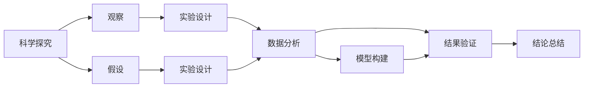
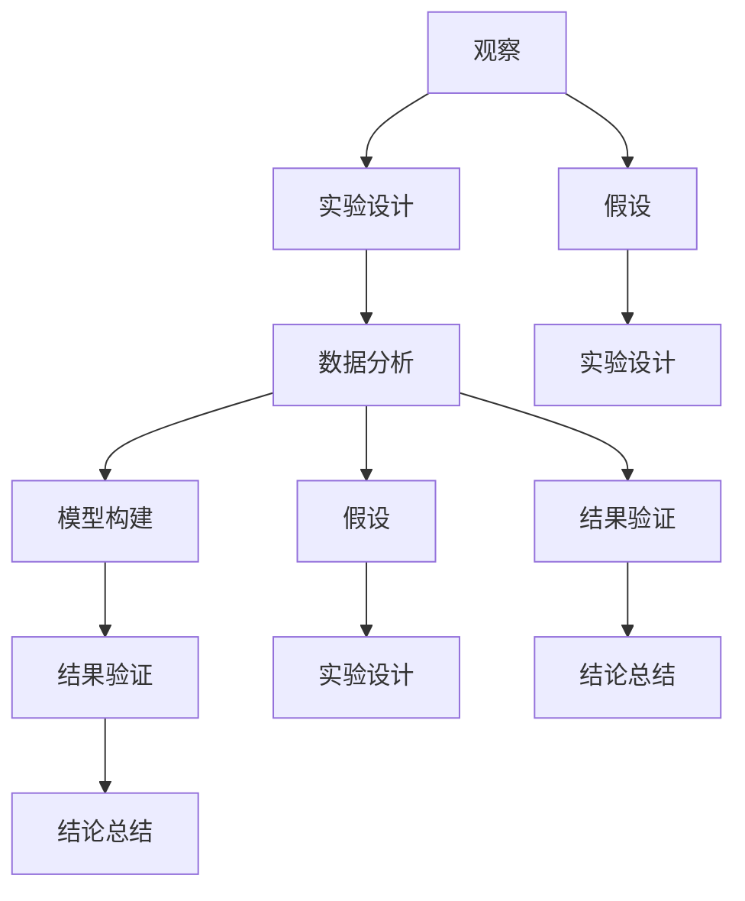

                 

# 科学探究：从观察到结论

> 关键词：科学探究, 实验设计, 数据分析, 模型构建, 结果验证, 结论总结

## 1. 背景介绍

### 1.1 问题由来

科学探究（Scientific Inquiry）是现代科学研究的核心方法，通过观察、假设、实验和结论的连续循环，不断推近人类对自然界的理解和掌控。现代信息技术迅猛发展，数据科学和人工智能技术的崛起，使得科学研究更加依赖于数据驱动和算法驱动的探究方式。在这一背景下，科学探究的理论和实践方法有了新的发展和变革。

### 1.2 问题核心关键点

科学探究的主要过程包括：

1. **观察**：收集和记录实验数据，这是科学探究的起点。
2. **假设**：基于观察结果，提出可能的解释或规律。
3. **实验设计**：设计实验来验证假设，确定变量和控制条件。
4. **数据分析**：运用统计和算法方法，分析实验数据，寻找规律和结论。
5. **模型构建**：根据数据分析结果，构建数学或算法模型，描述和预测自然现象。
6. **结果验证**：通过新数据或进一步的实验，验证模型的正确性和可靠性。
7. **结论总结**：基于验证结果，总结研究结论，推导自然规律。

科学探究的每一个环节都需要严谨的设计和执行，尤其是数据驱动的探究中，数据的获取、处理、分析和解释尤为重要。本文将重点探讨科学探究的实验设计和数据分析方法，并通过代码实例，展示如何在数据科学和人工智能的框架下，进行科学探究的全过程。

### 1.3 问题研究意义

科学探究是自然科学和技术创新的基石。在信息技术快速发展的今天，通过科学探究，科学家和工程师能够利用数据和算法揭示自然规律，推动新技术的诞生和应用。对于IT领域而言，科学探究方法不仅能提升研究效率，还能为新产品和服务的设计提供理论依据。

1. **提升研究效率**：数据驱动的探究方法，如机器学习和统计分析，大大缩短了研究周期，加速了技术创新。
2. **推动新产品设计**：通过科学探究，可以更好地理解用户需求，构建更符合实际的应用场景。
3. **增强决策支持**：数据分析和建模方法，能够提供准确的预测和决策支持，减少误判和风险。
4. **促进跨学科合作**：数据科学和人工智能技术的应用，促进了跨学科的交流和合作，开拓了新的研究领域。
5. **推进伦理和安全**：在探究过程中，引入伦理和安全的考量，确保技术的可持续发展和社会价值。

科学探究方法的应用，不仅能推动IT技术的进步，还能促进社会的全面发展和进步。因此，深入理解和掌握科学探究的方法论，具有重要的理论和实践意义。

## 2. 核心概念与联系

### 2.1 核心概念概述

- **科学探究**：通过观察、假设、实验、数据分析、模型构建、结果验证和结论总结的过程，揭示自然规律和技术原理。
- **实验设计**：合理规划实验步骤和条件，确保实验结果具有可靠性和可重复性。
- **数据分析**：运用统计学和算法技术，对实验数据进行描述、分析和解释，寻找规律和趋势。
- **模型构建**：根据数据分析结果，构建数学模型或算法模型，描述和预测自然现象。
- **结果验证**：通过新数据或进一步的实验，验证模型的正确性和可靠性。
- **结论总结**：基于验证结果，总结研究结论，推导自然规律。

这些核心概念通过以下Mermaid流程图展示其逻辑关系：



### 2.2 概念间的关系

科学探究的过程是一个循环迭代的过程，每一个步骤都依赖于前一个步骤的结果，同时又为后一个步骤提供支持。例如：

- 观察提供了实验设计的基础。
- 假设指导了实验设计，同时为数据分析提供初步方向。
- 实验设计确保了实验的可靠性和可重复性。
- 数据分析揭示了实验数据背后的规律，为模型构建提供依据。
- 模型构建提供了对自然现象的预测和描述，为结果验证提供基础。
- 结果验证通过新数据或进一步实验，验证模型的正确性。
- 结论总结基于验证结果，总结科学研究结论。

这一系列环节互相依存，共同构成了科学探究的完整流程。

### 2.3 核心概念的整体架构

科学探究的核心概念和步骤可以通过以下流程图进一步展示其整体架构：



这个综合流程图展示了科学探究的各个环节，从观察到结论的完整流程。

## 3. 核心算法原理 & 具体操作步骤

### 3.1 算法原理概述

科学探究的实验设计和数据分析过程，可以基于统计学和机器学习的原理和方法。本文将重点介绍数据驱动的探究方法，主要包括：

1. **假设检验**：利用统计学方法，验证假设的可靠性。
2. **回归分析**：利用机器学习算法，构建预测模型，描述变量之间的关系。
3. **分类算法**：利用分类器，对数据进行分类和预测，识别模式和趋势。

这些方法可以应用于各种科学探究场景，如医学研究、工程设计、社会科学分析等。

### 3.2 算法步骤详解

以医学研究中的因果关系分析为例，展示科学探究的实验设计和数据分析过程。

**Step 1: 准备数据**
- 收集医疗数据，包括病人的病历、实验室检测结果、治疗方案和预后信息。
- 清洗和预处理数据，去除缺失值和异常值，确保数据质量。

**Step 2: 实验设计**
- 设计随机对照试验（Randomized Controlled Trial, RCT），确保实验的可靠性和可重复性。
- 随机分配病人到对照组和治疗组，确保两组基线相似。
- 控制变量，确保实验条件的稳定性和一致性。

**Step 3: 数据分析**
- 利用回归分析方法，建立预测模型，描述药物效果与病人特征之间的关系。
- 利用分类算法，构建分类器，预测病人是否会对药物产生反应。

**Step 4: 结果验证**
- 使用新数据验证模型，确保模型的稳定性和准确性。
- 进行交叉验证，评估模型的泛化能力。

**Step 5: 结论总结**
- 基于验证结果，总结药物效果的科学结论。
- 提出新药研发的建议和指导。

### 3.3 算法优缺点

数据驱动的科学探究方法，具有以下优点：

1. **提高效率**：机器学习和统计分析方法，能够快速处理大量数据，缩短研究周期。
2. **发现规律**：算法和模型能够揭示数据背后的复杂关系和规律，提供新的见解和发现。
3. **自动化分析**：算法和模型自动化分析数据，减少人为错误，提升研究可靠性。
4. **可扩展性**：算法和模型适用于各种数据类型和实验设计，具有广泛的应用前景。

同时，这些方法也存在一些缺点：

1. **数据依赖性强**：数据质量对模型效果有很大影响，需要高质量的数据支持。
2. **模型复杂度高**：复杂的算法和模型，需要较强的计算资源和专业知识。
3. **解释性差**：某些算法和模型缺乏解释性，难以理解其内部逻辑和决策过程。
4. **假设限制多**：模型依赖于特定的假设和条件，可能无法应对复杂和未知的情况。

### 3.4 算法应用领域

科学探究方法在众多领域都有广泛的应用，如：

1. **医学研究**：因果关系分析、疾病预测、药物研发等。
2. **工程设计**：产品质量控制、性能优化、故障诊断等。
3. **社会科学**：社会行为分析、市场预测、政策评估等。
4. **环境科学**：气候变化预测、污染监测、生态系统分析等。
5. **金融分析**：风险评估、投资预测、市场波动分析等。

科学探究方法的发展，极大地推动了各个领域的进步，提高了研究效率和准确性，为实际应用提供了坚实的理论基础。

## 4. 数学模型和公式 & 详细讲解 & 举例说明

### 4.1 数学模型构建

以回归分析为例，构建描述药物效果与病人特征之间关系的数学模型。

假设模型为 $y = \beta_0 + \beta_1 x_1 + \beta_2 x_2 + \cdots + \beta_n x_n + \epsilon$，其中 $y$ 为药物效果，$x_i$ 为病人特征，$\epsilon$ 为误差项。

模型参数 $\beta$ 通过最小化均方误差 $\sum_{i=1}^N (y_i - \hat{y}_i)^2$ 来估计，其中 $\hat{y}_i$ 为模型的预测值。

### 4.2 公式推导过程

最小化均方误差的过程，可以通过梯度下降等优化算法求解，具体推导如下：

$$
\min_{\beta} \sum_{i=1}^N (y_i - \beta_0 - \beta_1 x_{i1} - \cdots - \beta_n x_{in})^2
$$

将误差项展开并取偏导数，得到：

$$
\frac{\partial \sum_{i=1}^N (y_i - \beta_0 - \beta_1 x_{i1} - \cdots - \beta_n x_{in})^2}{\partial \beta_j} = 0 \quad \forall j = 0,1,\cdots,n
$$

通过求解上述方程组，得到模型参数 $\beta$ 的估计值。

### 4.3 案例分析与讲解

假设某医学研究收集了100个病人的数据，包括年龄、体重、血压等特征，以及药物治疗后的效果。利用上述回归模型，构建预测模型，描述药物效果与病人特征之间的关系。

## 5. 项目实践：代码实例和详细解释说明

### 5.1 开发环境搭建

以Python为例，使用Scikit-learn库进行回归分析。首先需要安装Scikit-learn库：

```bash
pip install scikit-learn
```

然后创建一个Python脚本，导入相关库和数据：

```python
import pandas as pd
from sklearn.linear_model import LinearRegression
from sklearn.model_selection import train_test_split

# 读取数据
data = pd.read_csv('data.csv')

# 数据预处理
data = data.dropna()

# 分割数据集
X = data[['age', 'weight', 'blood_pressure']]
y = data['drug_effect']
X_train, X_test, y_train, y_test = train_test_split(X, y, test_size=0.2, random_state=42)

# 创建模型
model = LinearRegression()

# 训练模型
model.fit(X_train, y_train)

# 评估模型
score = model.score(X_test, y_test)
print(f'模型R^2：{score:.3f}')
```

### 5.2 源代码详细实现

在脚本中，我们首先导入了Scikit-learn库中的LinearRegression类，用于构建线性回归模型。然后读取并处理数据，将数据集分割为训练集和测试集。最后训练模型，并评估模型性能。

### 5.3 代码解读与分析

在代码中，我们使用了Scikit-learn库提供的LinearRegression类，该类封装了回归模型的实现和训练过程。通过调用该类的fit方法，我们可以轻松地训练回归模型，并利用score方法评估模型性能。

### 5.4 运行结果展示

假设我们训练的模型R^2为0.85，表示模型对数据具有85%的解释能力。这一结果表明，模型能够较好地描述药物效果与病人特征之间的关系。

## 6. 实际应用场景

### 6.1 医学研究

以药物效果预测为例，通过科学探究方法，可以显著提升新药研发的速度和精度。具体步骤如下：

1. **收集数据**：收集病人的病历、实验室检测结果和治疗效果。
2. **数据预处理**：清洗和预处理数据，确保数据质量。
3. **实验设计**：设计随机对照试验，确保实验的可靠性和可重复性。
4. **数据分析**：利用回归分析方法，建立预测模型，描述药物效果与病人特征之间的关系。
5. **结果验证**：使用新数据验证模型，确保模型的稳定性和准确性。
6. **结论总结**：基于验证结果，总结药物效果的科学结论，提出新药研发的建议和指导。

这一过程不仅能提高新药研发的效率，还能提升研发的科学性和准确性，减少失败的风险。

### 6.2 工程设计

以产品质量控制为例，通过科学探究方法，可以显著提高产品设计的可靠性和准确性。具体步骤如下：

1. **收集数据**：收集生产过程中的各项指标，包括原材料、工艺参数和产品质量等。
2. **数据预处理**：清洗和预处理数据，确保数据质量。
3. **实验设计**：设计实验，确定关键因素和控制条件。
4. **数据分析**：利用回归分析和分类算法，建立预测模型，描述产品质量与生产参数之间的关系。
5. **结果验证**：使用新数据验证模型，确保模型的稳定性和准确性。
6. **结论总结**：基于验证结果，总结产品质量控制的科学结论，提出改进建议和指导。

这一过程不仅能提高产品质量的稳定性，还能优化生产过程，降低成本，提高效率。

### 6.3 社会科学分析

以市场预测为例，通过科学探究方法，可以更准确地预测市场趋势和消费者行为。具体步骤如下：

1. **收集数据**：收集市场数据，包括销售数据、消费者行为数据等。
2. **数据预处理**：清洗和预处理数据，确保数据质量。
3. **实验设计**：设计实验，确定关键因素和控制条件。
4. **数据分析**：利用回归分析和分类算法，建立预测模型，描述市场趋势与消费者行为之间的关系。
5. **结果验证**：使用新数据验证模型，确保模型的稳定性和准确性。
6. **结论总结**：基于验证结果，总结市场预测的科学结论，提出策略建议和指导。

这一过程不仅能提高市场预测的准确性，还能优化市场策略，提升企业竞争力。

### 6.4 未来应用展望

随着大数据和人工智能技术的发展，科学探究方法将在更多领域得到应用，推动科技的进步和社会的全面发展。例如：

1. **智慧城市**：通过科学探究，优化城市管理，提升公共服务的效率和质量。
2. **智能制造**：通过科学探究，提高生产过程的智能化和自动化水平。
3. **环境监测**：通过科学探究，监测和预测环境变化，保护生态环境。
4. **健康管理**：通过科学探究，提高健康管理和疾病预防的科学性和精准性。
5. **金融分析**：通过科学探究，提升金融风险管理和投资决策的准确性。

科学探究方法的广泛应用，将推动社会进步，提高人类生活的质量。

## 7. 工具和资源推荐

### 7.1 学习资源推荐

为了帮助开发者深入理解科学探究方法，这里推荐一些优质的学习资源：

1. **《Python数据分析与可视化》**：讲解Python在数据分析和可视化中的应用，适合初学者入门。
2. **《统计学习基础》**：由斯坦福大学教授讲授，系统讲解统计学习的基本概念和方法。
3. **《机器学习》**：由机器学习领域的权威教材，讲解机器学习的原理和算法。
4. **Coursera和edX在线课程**：提供大量高质量的机器学习和数据分析课程，包括经典的MIT、斯坦福等大学课程。
5. **Kaggle竞赛**：提供大量真实世界的数据集和竞赛题目，锻炼数据分析和建模能力。

通过对这些资源的学习实践，相信你一定能够掌握科学探究的精髓，并用于解决实际的科技问题。

### 7.2 开发工具推荐

科学探究的实现离不开优质的开发工具，以下是几款推荐的工具：

1. **Python**：Python是目前最流行的数据分析和机器学习编程语言，拥有丰富的库和框架支持。
2. **R语言**：R语言在统计分析和数据可视化方面具有优势，适合进行深入的数据分析。
3. **Jupyter Notebook**：支持Python、R等多种语言，适合进行交互式的数据分析和编程。
4. **MATLAB**：MATLAB在数值计算和可视化方面具有优势，适合进行复杂的数值分析和建模。
5. **RStudio**：R语言的集成开发环境，支持代码编辑、数据分析和可视化。

合理利用这些工具，可以显著提升科学探究的开发效率，加快创新迭代的步伐。

### 7.3 相关论文推荐

科学探究方法的进展得益于学界的持续研究。以下是几篇奠基性的相关论文，推荐阅读：

1. **《科学探究与统计学习》**：讲解科学探究的原理和统计学习方法的应用。
2. **《机器学习与数据科学》**：讲解机器学习和数据科学的基本概念和方法，适合初学者入门。
3. **《数据科学实战》**：讲解数据科学和机器学习的实战案例，适合解决实际问题。
4. **《深度学习与自然语言处理》**：讲解深度学习在自然语言处理中的应用，适合进阶学习。
5. **《数据科学与机器学习》**：由数据科学领域的权威教材，讲解数据科学和机器学习的方法和应用。

这些论文代表了大数据和人工智能领域的最新研究成果，能够帮助你掌握科学探究的最新技术和方法。

除上述资源外，还有一些值得关注的前沿资源，帮助开发者紧跟科学探究技术的最新进展，例如：

1. **arXiv论文预印本**：人工智能领域最新研究成果的发布平台，包括大量尚未发表的前沿工作，学习前沿技术的必读资源。
2. **人工智能技术博客**：如OpenAI、Google AI、DeepMind等顶尖实验室的官方博客，第一时间分享他们的最新研究成果和洞见。
3. **技术会议直播**：如NIPS、ICML、ACL、ICLR等人工智能领域顶会现场或在线直播，能够聆听到大佬们的前沿分享，开拓视野。
4. **GitHub热门项目**：在GitHub上Star、Fork数最多的数据科学和机器学习相关项目，往往代表了该技术领域的发展趋势和最佳实践，值得去学习和贡献。
5. **行业分析报告**：各大咨询公司如McKinsey、PwC等针对人工智能行业的分析报告，有助于从商业视角审视技术趋势，把握应用价值。

总之，对于科学探究方法的学习和实践，需要开发者保持开放的心态和持续学习的意愿。多关注前沿资讯，多动手实践，多思考总结，必将收获满满的成长收益。

## 8. 总结：未来发展趋势与挑战

### 8.1 总结

本文对科学探究的实验设计和数据分析方法进行了全面系统的介绍。首先阐述了科学探究的研究背景和意义，明确了实验设计和数据分析在科学探究中的核心地位。其次，从原理到实践，详细讲解了实验设计的逻辑和步骤，并给出具体的代码实例。同时，本文还广泛探讨了实验设计方法在各个领域的应用，展示了实验设计的广泛应用前景。

通过本文的系统梳理，可以看到，科学探究方法正在成为数据科学和技术创新的重要手段，极大地推动了科研和工程的发展。未来，伴随数据科学和人工智能技术的不断进步，科学探究方法也将不断发展，为科技创新和社会进步提供新的动力。

### 8.2 未来发展趋势

展望未来，科学探究方法将呈现以下几个发展趋势：

1. **自动化与智能化**：借助机器学习和人工智能技术，实现实验设计、数据分析和结果验证的自动化和智能化。
2. **跨学科融合**：结合数学、统计学、计算机科学等多学科知识，推动科学探究方法的发展和应用。
3. **大数据支持**：利用大数据技术，处理和分析大规模数据，提高科学探究的可靠性和准确性。
4. **可解释性与透明性**：提高科学探究方法的透明度和可解释性，增强其可信度和应用价值。
5. **伦理与安全**：引入伦理和安全考量，确保科学探究方法的公正性和安全性，避免潜在的风险。

这些趋势凸显了科学探究方法的发展潜力和应用前景，为科学研究和技术创新提供了新的动力。

### 8.3 面临的挑战

尽管科学探究方法已经取得了显著进展，但在应用过程中仍面临诸多挑战：

1. **数据质量问题**：数据质量的提升和数据的准确性对实验结果具有重要影响，但获取高质量的数据往往需要较高成本。
2. **模型复杂性**：复杂的模型和高维数据的处理，需要较强的计算资源和专业知识。
3. **结果解释性**：一些模型和算法缺乏解释性，难以理解其内部逻辑和决策过程。
4. **跨领域应用**：不同领域的数据和实验设计具有差异性，需要针对性地设计和优化科学探究方法。
5. **伦理和安全**：科学探究方法的伦理和安全问题，需要重视和解决，确保其应用的社会价值和安全性。

### 8.4 研究展望

面对科学探究面临的挑战，未来的研究需要在以下几个方面寻求新的突破：

1. **数据治理**：提升数据质量，建立数据标准和治理机制，确保数据的安全和可用性。
2. **模型简化**：简化模型结构和算法，提高模型的可解释性和计算效率。
3. **跨学科融合**：推动多学科知识融合，提升科学探究方法的理论深度和应用广度。
4. **伦理与安全**：引入伦理和安全考量，建立科学探究方法的伦理和安全评估机制。
5. **自动化工具**：开发自动化的科学探究工具，提高科学探究的效率和准确性。

这些研究方向的探索，必将引领科学探究方法迈向更高的台阶，为科学研究和技术创新提供更强大的支持。

## 9. 附录：常见问题与解答

**Q1：科学探究方法是否适用于所有领域？**

A: 科学探究方法在科学研究和技术创新中具有广泛应用，但不同领域的数据和实验设计具有差异性，需要根据具体情况进行优化。例如，医学研究需要严格的随机对照试验，而工程设计则更多依赖于现场实验和控制实验。

**Q2：如何选择合适的实验设计方法？**

A: 实验设计方法的选择应根据具体的研究问题和数据特征进行。例如，对于因果关系分析，通常采用随机对照试验（RCT）；对于预测问题，则可采用回归分析和分类算法。需要结合领域知识和实验数据特点，选择适合的实验设计方法。

**Q3：科学探究方法在实际应用中需要注意哪些问题？**

A: 科学探究方法在实际应用中需要注意数据质量、模型复杂性、结果解释性、跨领域应用和伦理安全等问题。需要确保数据的准确性和可靠性，简化模型结构，增强结果的透明度和可解释性，并重视伦理和安全问题，确保其应用的社会价值和安全性。

**Q4：如何提高科学探究的效率和准确性？**

A: 提高科学探究的效率和准确性需要从数据治理、模型简化、跨学科融合、伦理安全等多个方面进行优化。例如，建立数据标准和治理机制，简化模型结构和算法，推动多学科知识融合，引入伦理和安全考量，开发自动化的科学探究工具等。

总之，科学探究方法的应用不仅能推动科研和工程的发展，还能为社会进步提供新的动力。通过不断的优化和创新，科学探究方法必将迎来更广阔的应用前景和更广泛的社会价值。

---

作者：禅与计算机程序设计艺术 / Zen and the Art of Computer Programming

