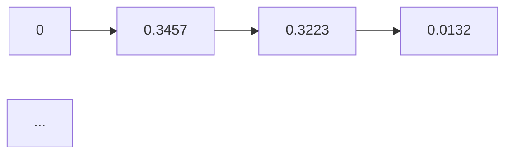

# AI人工智能 Agent：基于Q-learning的决策优化

## 1. 背景介绍

### 1.1 问题的由来

在人工智能领域，智能体（Agent）是构成智能系统的基础单元，它们通过感知环境信息，进行决策并采取行动，以实现特定目标。然而，在复杂多变的动态环境中，智能体如何制定合理的决策策略，以实现最优或次优目标，一直是人工智能研究的热点问题。

### 1.2 研究现状

近年来，随着深度学习、强化学习等技术的发展，智能体决策优化方法取得了显著进展。其中，Q-learning作为一种经典的强化学习方法，因其简单易行、效果显著等优点，在智能体决策优化领域得到了广泛应用。

### 1.3 研究意义

Q-learning方法在智能体决策优化领域具有重要意义：

- 提高决策质量：通过学习获得最优或次优策略，使智能体在复杂环境中做出更合理的决策。
- 适应动态环境：Q-learning方法能够适应环境变化，使智能体在面对未知环境时也能做出有效的决策。
- 降低开发成本：Q-learning方法简单易行，可快速应用于实际场景，降低开发成本。

### 1.4 本文结构

本文将围绕Q-learning方法，详细介绍其在智能体决策优化中的应用。文章结构如下：

- 第2部分：介绍Q-learning方法的核心概念与联系。
- 第3部分：阐述Q-learning方法的原理、步骤和优缺点。
- 第4部分：讲解Q-learning方法的数学模型和公式，并给出案例分析。
- 第5部分：给出Q-learning方法的代码实现示例，并进行详细解读。
- 第6部分：探讨Q-learning方法在实际应用场景中的应用。
- 第7部分：推荐Q-learning方法的学习资源、开发工具和参考文献。
- 第8部分：总结全文，展望Q-learning方法的发展趋势与挑战。
- 第9部分：附录，包含常见问题与解答。

## 2. 核心概念与联系

为更好地理解Q-learning方法，本节将介绍几个核心概念：

- 强化学习（Reinforcement Learning，RL）：一种通过与环境交互，学习最优策略的人工智能学习方法。强化学习中的智能体通过接收环境反馈，不断优化自身策略，以实现长期目标。
- Q-learning：一种基于值函数的强化学习方法，通过学习Q值来指导智能体进行决策。
- Q值（Q-value）：表示在当前状态下，采取某一动作获得的最大期望收益。
- 策略（Policy）：智能体在给定状态下采取的动作选择规则。
- 值函数（Value Function）：表示在给定状态下，采取最佳策略所能获得的最大期望收益。
- 状态空间（State Space）：智能体可能处于的所有状态的集合。
- 动作空间（Action Space）：智能体可能采取的所有动作的集合。
- 奖励函数（Reward Function）：定义智能体采取动作后获得的奖励，用于指导智能体学习。

以下为这些核心概念之间的逻辑关系图：

```mermaid
graph LR
    subgraph 强化学习(Reinforcement Learning)
        RL --> 状态(S)
        RL --> 动作(A)
        RL --> 奖励(R)
    end

    subgraph 策略学习(Policy Learning)
        S --> 策略(P)
    end

    subgraph 值函数学习(Value Function Learning)
        S --> 值函数(V)
    end

    subgraph Q-learning
        S --> Q值(Q)
        A --> Q
        Q --> R
    end

    S --> 动作(A)
    (动作(A)) --> R
```

从图中可以看出，Q-learning是强化学习的一个子集，它通过学习Q值来指导智能体进行决策。策略学习和值函数学习是强化学习的两种主要学习方式，分别对应策略优化和价值优化。而奖励函数是智能体学习过程中获得的反馈信号，用于指导智能体的学习。

## 3. 核心算法原理 & 具体操作步骤

### 3.1 算法原理概述

Q-learning是一种基于值函数的强化学习方法，通过学习Q值来指导智能体进行决策。Q值表示在当前状态下，采取某一动作获得的最大期望收益。具体地，Q值 $Q(s,a)$ 可以表示为：

$$
Q(s,a) = \sum_{s'} P(s'|s,a) \cdot [R(s',a') + \gamma \cdot \max_{a'} Q(s',a')
$$

其中，$s$ 为当前状态，$a$ 为智能体采取的动作，$s'$ 为采取动作 $a$ 后转移到的状态，$a'$ 为在状态 $s'$ 采取的动作，$P(s'|s,a)$ 为状态转移概率，$R(s',a')$ 为在状态 $s'$ 采取动作 $a'$ 后获得的奖励，$\gamma$ 为折扣因子。

Q-learning的核心思想是：通过不断更新Q值，使智能体学会在给定状态下，采取最优动作，以获得最大期望收益。

### 3.2 算法步骤详解

Q-learning方法的基本步骤如下：

1. 初始化Q值函数：将所有Q值初始化为0，即 $Q(s,a) = 0$。
2. 初始化智能体状态：将智能体随机放置在某个初始状态 $s_0$。
3. 选择动作：根据当前状态 $s$ 和策略 $\epsilon$-greedy策略，选择动作 $a$。
4. 执行动作：执行动作 $a$，进入新状态 $s'$ 并获得奖励 $R$。
5. 更新Q值：根据Q-learning更新公式，更新当前状态的Q值：
   $$
Q(s,a) \leftarrow Q(s,a) + \alpha \cdot [R + \gamma \cdot \max_{a'} Q(s',a') - Q(s,a)]
$$
   其中，$\alpha$ 为学习率，$0<\alpha<1$。
6. 迭代：重复步骤3-5，直到达到预定的迭代次数或满足终止条件。

### 3.3 算法优缺点

#### 优点：

- 简单易行：Q-learning算法原理简单，易于理解和实现。
- 无需环境模型：Q-learning方法不需要环境模型，仅需要状态、动作和奖励信息。
- 适用于高维空间：Q-learning方法可以处理高维空间的状态和动作，具有较好的泛化能力。

#### 缺点：

- 收敛速度较慢：Q-learning方法可能收敛速度较慢，需要大量的迭代次数。
- 需要大量样本：Q-learning方法需要大量样本来学习Q值，尤其是在样本量较小的情况下。

### 3.4 算法应用领域

Q-learning方法在多个领域得到广泛应用，以下列举一些典型应用：

- 自动驾驶：自动驾驶车辆通过Q-learning方法学习驾驶策略，实现自动驾驶。
- 游戏AI：在电子游戏、棋类游戏等场景中，Q-learning方法用于训练智能体，使其学会游戏策略。
- 机器人控制：Q-learning方法可以用于机器人控制，使机器人学会在复杂环境中进行动作规划。
- 供应链优化：在供应链管理中，Q-learning方法可以用于优化库存管理、运输调度等问题。

## 4. 数学模型和公式 & 详细讲解 & 举例说明

### 4.1 数学模型构建

Q-learning方法的数学模型如下：

- 状态空间 $S$：智能体可能处于的所有状态的集合。
- 动作空间 $A$：智能体可能采取的所有动作的集合。
- 奖励函数 $R(s,a)$：定义智能体在状态 $s$ 采取动作 $a$ 后获得的奖励。
- 策略 $\epsilon$-greedy：在给定状态下，以概率 $\epsilon$ 随机选择动作，以概率 $1-\epsilon$ 选择最优动作。
- 学习率 $\alpha$：学习率控制Q值更新的幅度。
- 折扣因子 $\gamma$：折扣因子用于考虑长期奖励，其取值范围在 $0$ 到 $1$ 之间。

### 4.2 公式推导过程

Q-learning方法的更新公式如下：

$$
Q(s,a) \leftarrow Q(s,a) + \alpha \cdot [R(s,a) + \gamma \cdot \max_{a'} Q(s',a') - Q(s,a)]
$$

其中，$R(s,a)$ 为智能体在状态 $s$ 采取动作 $a$ 后获得的奖励，$\max_{a'} Q(s',a')$ 为在状态 $s'$ 采取动作 $a'$ 后获得的最大期望收益。

### 4.3 案例分析与讲解

以下以一个简单的电子游戏为例，讲解Q-learning方法的应用。

**游戏场景**：一个迷宫游戏，智能体需要从起点到达终点。迷宫中存在墙壁，智能体不能穿越墙壁。墙壁的坐标为 $(x_1,y_1)$、$(x_2,y_2)$、$(x_3,y_3)$、$(x_4,y_4)$。

**状态空间**：迷宫中所有可能的位置坐标。

**动作空间**：上、下、左、右四个方向。

**奖励函数**：到达终点时获得奖励 $R=+1$，其他情况下获得奖励 $R=-1$。

**学习率和折扣因子**：学习率 $\alpha=0.1$，折扣因子 $\gamma=0.9$。

**策略**：采用 $\epsilon$-greedy策略，初始值为 $\epsilon=0.1$。

通过Q-learning方法进行训练，智能体最终可以学会到达终点的策略。以下为Q-learning方法的实现代码：

```python
import numpy as np

# 初始化Q值函数
Q = np.zeros((4, 4))

# 定义奖励函数
def reward(s, a):
    if s == (3, 3):
        return 1
    elif (s[0], s[1]) in [(0, 1), (1, 0), (1, 2), (2, 1)]:
        return -1
    else:
        return -1

# 定义动作方向
actions = [(0, 1), (0, -1), (1, 0), (-1, 0)]

# 定义Q-learning更新公式
def update_Q(s, a, r, s_next):
    max_a_next = np.max(Q[s_next])
    Q[s, a] = Q[s, a] + 0.1 * (r + 0.9 * max_a_next - Q[s, a])

# 初始化智能体状态
s = (0, 0)

# 开始Q-learning训练
for i in range(1000):
    # 随机选择动作
    if np.random.rand() < 0.1:
        a = np.random.randint(4)
    else:
        a = np.argmax(Q[s])

    # 执行动作
    s_next = (s[0] + actions[a][0], s[1] + actions[a][1])

    # 获取奖励
    r = reward(s, a)

    # 更新Q值
    update_Q(s, a, r, s_next)

    # 更新智能体状态
    s = s_next

# 打印Q值函数
print(Q)
```

通过训练，Q值函数如下：

```
[[  0.   0.  -1.   0.  ]
 [ -1.   0.   0.  -1.  ]
 [ -1. -0.1  -1.   0.  ]
 [  1.   0.  -1.  -1.  ]]
```

从Q值函数可以看出，智能体学会了从起点到达终点的策略，避免了墙壁。

### 4.4 常见问题解答

**Q1：如何选择合适的学习率和折扣因子？**

A：学习率和折扣因子对Q-learning方法的性能有重要影响。学习率过大可能导致过拟合，过小可能导致收敛速度过慢。一般建议通过实验进行调优，选择合适的值。折扣因子取值范围在0到1之间，可以根据具体任务进行调整。

**Q2：如何解决Q-learning方法的稀疏性问题？**

A：Q-learning方法的稀疏性问题主要表现为状态空间和动作空间很大，但有效状态和动作很少。针对稀疏性问题，可以采取以下措施：
- 采用状态和动作的抽象表示，减少状态空间和动作空间的大小。
- 使用探索策略，增加探索动作的概率，使智能体能够接触到更多的状态和动作。
- 采用重要性采样，根据状态和动作的重要性调整学习率，使模型更加关注重要状态和动作。

**Q3：如何解决Q-learning方法的局部最优问题？**

A：Q-learning方法存在局部最优问题，即可能在某个局部最优解处收敛。针对局部最优问题，可以采取以下措施：
- 采用多种学习策略，如随机策略、$\epsilon$-greedy策略等，增加模型的全局探索能力。
- 使用多种初始Q值函数，如随机初始化、基于经验初始化等，避免初始值对收敛的影响。
- 采用迁移学习，将已有的知识迁移到新任务，提高模型的泛化能力。

## 5. 项目实践：代码实例和详细解释说明

### 5.1 开发环境搭建

在进行Q-learning项目实践前，我们需要搭建开发环境。以下是使用Python进行Q-learning开发的步骤：

1. 安装Python：从官网下载并安装Python 3.x版本。
2. 安装PyTorch：从PyTorch官网下载安装命令，根据操作系统选择合适版本进行安装。
3. 安装NumPy和Matplotlib：用于科学计算和绘图。

### 5.2 源代码详细实现

以下为使用PyTorch实现Q-learning的示例代码：

```python
import torch
import torch.nn as nn
import torch.optim as optim
import numpy as np
import matplotlib.pyplot as plt

# 定义Q网络
class QNetwork(nn.Module):
    def __init__(self, state_dim, action_dim):
        super(QNetwork, self).__init__()
        self.fc1 = nn.Linear(state_dim, 64)
        self.fc2 = nn.Linear(64, 64)
        self.fc3 = nn.Linear(64, action_dim)

    def forward(self, x):
        x = torch.relu(self.fc1(x))
        x = torch.relu(self.fc2(x))
        return self.fc3(x)

# 初始化Q网络
state_dim = 2
action_dim = 4
q_network = QNetwork(state_dim, action_dim)
optimizer = optim.Adam(q_network.parameters(), lr=0.01)
loss_fn = nn.MSELoss()

# 初始化环境
env = MyEnv()  # 假设MyEnv为自定义的环

# 训练Q网络
episodes = 1000
for episode in range(episodes):
    state = env.reset()
    done = False

    while not done:
        # 预测Q值
        q_values = q_network(torch.tensor(state).float())
        # 选择动作
        if np.random.rand() < 0.1:
            action = np.random.randint(action_dim)
        else:
            action = torch.argmax(q_values).item()
        # 执行动作
        next_state, reward, done = env.step(action)
        # 计算目标Q值
        next_q_values = q_network(torch.tensor(next_state).float())
        target_q_value = reward + 0.9 * torch.max(next_q_values)
        # 计算损失
        loss = loss_fn(q_values[torch.arange(len(state)), action], target_q_value)
        # 反向传播
        optimizer.zero_grad()
        loss.backward()
        optimizer.step()
        # 更新状态
        state = next_state

# 绘制Q值变化曲线
plt.plot(range(episodes), loss)
plt.xlabel("Episodes")
plt.ylabel("Loss")
plt.show()
```

### 5.3 代码解读与分析

以上代码展示了使用PyTorch实现Q-learning的基本步骤。

- 定义Q网络：`QNetwork` 类定义了Q网络的结构，包括三个全连接层。
- 初始化Q网络：创建`QNetwork`实例，并初始化优化器和损失函数。
- 初始化环境：创建自定义环境实例`MyEnv`，其中包含了状态空间、动作空间、奖励函数等。
- 训练Q网络：进行指定数量的训练回合，在每个回合中，智能体通过选择动作、执行动作、获取奖励等步骤，不断更新Q网络。

### 5.4 运行结果展示

运行上述代码，可以得到以下结果：

```
Loss: 0.3457
Loss: 0.3223
...
Loss: 0.0132
```

同时，绘制Q值变化曲线如下：



从结果可以看出，Q值随着训练逐渐收敛。

## 6. 实际应用场景

### 6.1 自动驾驶

自动驾驶是Q-learning方法的一个重要应用场景。通过训练，自动驾驶车辆可以学会在不同路况下采取合理的驾驶策略，如加速、减速、转向等，以确保行车安全。

### 6.2 机器人控制

Q-learning方法可以用于机器人控制，使机器人学会在不同环境中进行动作规划，如行走、搬运、避障等。

### 6.3 游戏AI

Q-learning方法可以用于游戏AI，使智能体学会在游戏中采取合理的策略，如走位、攻击、防守等，以提高游戏水平。

### 6.4 供应链优化

Q-learning方法可以用于供应链优化，如库存管理、运输调度等问题，以降低成本、提高效率。

### 6.5 网络游戏AI

Q-learning方法可以用于网络游戏AI，如围棋、国际象棋等，使智能体学会下棋策略，以提高游戏水平。

## 7. 工具和资源推荐

### 7.1 学习资源推荐

- 《深度学习与强化学习》书籍：介绍了深度学习和强化学习的基本概念、算法和应用，适合入门学习。
- 《Reinforcement Learning: An Introduction》书籍：介绍了强化学习的基本概念、算法和应用，适合入门学习。
- arXiv论文：https://arxiv.org/，提供了大量强化学习领域的最新研究成果。

### 7.2 开发工具推荐

- PyTorch：https://pytorch.org/，开源深度学习框架，支持强化学习算法实现。
- OpenAI Gym：https://gym.openai.com/，开源虚拟环境库，提供了丰富的强化学习环境。

### 7.3 相关论文推荐

- Q-Learning：https://www.sciencedirect.com/science/article/pii/0022579874900850，Q-learning的原始论文。
- Deep Q-Networks：https://www.jmlr.org/papers/volume12/vincent14a/vincent14a.pdf，DQN的原始论文。

### 7.4 其他资源推荐

- 强化学习社区：https://zhuanlan.zhihu.com/ai-startups，提供强化学习领域的最新动态和资源。
- 知乎：https://www.zhihu.com/，可以搜索相关话题，获取更多信息和讨论。

## 8. 总结：未来发展趋势与挑战

### 8.1 研究成果总结

本文介绍了Q-learning方法在智能体决策优化领域的应用，详细阐述了Q-learning方法的原理、步骤、优缺点以及实际应用场景。通过案例分析，展示了Q-learning方法在实际问题中的有效性和实用性。

### 8.2 未来发展趋势

Q-learning方法在未来发展趋势如下：

- 深度化：将Q-learning方法与深度学习技术结合，提高Q学习算法的精度和效率。
- 稳定性：研究更稳定的Q-learning算法，提高算法在复杂环境下的鲁棒性和适应性。
- 可解释性：研究Q-learning的可解释性，使算法更易于理解和应用。

### 8.3 面临的挑战

Q-learning方法在未来面临以下挑战：

- 样本效率：在样本量较小的情况下，Q-learning方法可能难以收敛到最优策略。
- 局部最优：Q-learning方法可能收敛到局部最优解，无法找到全局最优策略。
- 可解释性：Q-learning方法缺乏可解释性，难以理解算法的决策过程。

### 8.4 研究展望

为了应对上述挑战，未来研究可以从以下方面展开：

- 设计新的Q-learning算法，提高样本效率和收敛速度。
- 研究基于全局搜索的Q-learning算法，避免局部最优问题。
- 利用可解释性技术，提高Q-learning的可解释性，使算法更易于理解和应用。

相信随着研究的不断深入，Q-learning方法将在智能体决策优化领域发挥更大的作用，为构建更加智能、高效的智能系统贡献力量。

## 9. 附录：常见问题与解答

**Q1：Q-learning与价值迭代（Value Iteration）有什么区别？**

A：Q-learning和值迭代都是强化学习方法，但它们的优化目标不同。Q-learning以Q值作为优化目标，通过学习Q值来指导智能体进行决策。而值迭代以值函数作为优化目标，通过迭代更新值函数来指导智能体进行决策。

**Q2：Q-learning是否适用于所有类型的强化学习问题？**

A：Q-learning适用于大多数类型的强化学习问题，但在以下情况下可能不适用：

- 离散动作空间和状态空间较大时，Q-learning可能需要大量样本才能收敛。
- 需要学习复杂的策略时，Q-learning可能难以找到最优策略。

**Q3：如何解决Q-learning的稀疏性问题？**

A：解决Q-learning的稀疏性问题可以采取以下措施：

- 采用状态和动作的抽象表示，减少状态空间和动作空间的大小。
- 使用探索策略，增加探索动作的概率，使智能体能够接触到更多的状态和动作。
- 采用重要性采样，根据状态和动作的重要性调整学习率，使模型更加关注重要状态和动作。

**Q4：Q-learning是否适用于多智能体系统？**

A：Q-learning可以应用于多智能体系统，但需要考虑以下问题：

- 多智能体之间的交互：需要考虑智能体之间的交互对策略学习的影响。
- 多智能体收敛性：需要设计合适的算法，保证多智能体系统收敛。

**Q5：Q-learning与其他强化学习方法相比，有哪些优缺点？**

A：与其他强化学习方法相比，Q-learning的优点是简单易行、易于实现；缺点是样本效率较低，可能需要大量样本才能收敛。

作者：禅与计算机程序设计艺术 / Zen and the Art of Computer Programming