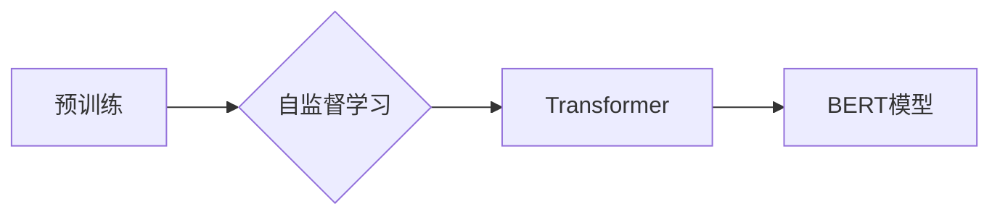

# BERT模型原理与应用场景

## 关键词

BERT，自然语言处理，预训练，自监督学习，Transformer，NLP，深度学习

## 1. 背景介绍

### 1.1 问题的由来

自然语言处理（NLP）作为人工智能领域的一个重要分支，近年来取得了长足的进步。然而，传统的NLP方法往往依赖于规则和手工特征工程，难以应对复杂多变的语言现象。随着深度学习技术的快速发展，基于深度神经网络（DNN）的NLP模型逐渐成为主流。然而，传统的DNN模型在处理序列数据时存在一些问题，如长距离依赖、上下文信息提取困难等。

为了解决这些问题，Google于2018年提出了BERT（Bidirectional Encoder Representations from Transformers）模型。BERT模型通过在大量无标签语料上进行预训练，学习到了丰富的语言知识，并在多个NLP任务上取得了显著的效果，推动了NLP领域的快速发展。

### 1.2 研究现状

BERT模型提出后，受到了广泛关注，并迅速在NLP领域产生了巨大的影响。众多研究人员和开发者在BERT的基础上进行了改进和扩展，提出了各种变种模型，如RoBERTa、ALBERT、DistilBERT等。这些模型在多个NLP任务上取得了优异的成绩，推动了NLP技术的进步。

### 1.3 研究意义

BERT模型的研究意义主要体现在以下几个方面：

1. **提高NLP任务性能**：BERT模型在多个NLP任务上取得了显著的效果，推动了NLP技术的进步，为实际应用带来了更多的可能性。
2. **促进NLP模型发展**：BERT模型的提出推动了NLP模型的发展，为后续研究提供了新的思路和方向。
3. **推动NLP技术落地**：BERT模型及其变种模型的应用，促进了NLP技术的落地，为各个领域带来了实际价值。

### 1.4 本文结构

本文将首先介绍BERT模型的核心概念和原理，然后详细介绍其算法步骤和具体操作，接着分析其优缺点和应用领域，最后展望其未来发展趋势和面临的挑战。

## 2. 核心概念与联系

### 2.1 预训练

预训练是指在大规模无标签语料上进行训练，使模型学习到通用的语言知识。BERT模型通过预训练，学习到了丰富的语言知识，为后续的下游任务提供了强大的语言表征。

### 2.2 自监督学习

自监督学习是指在不依赖人工标注数据的情况下，从数据中学习到的信息。BERT模型采用了多种自监督学习任务，如Masked Language Model（MLM）和Next Sentence Prediction（NSP），有效地利用了无标签语料。

### 2.3 Transformer

Transformer是一种基于自注意力机制的深度神经网络模型，可以有效地处理序列数据。BERT模型采用了Transformer结构，实现了双向的上下文表示。

### 2.4 Mermaid流程图

以下是一个Mermaid流程图，展示了BERT模型的核心概念之间的联系：



## 3. 核心算法原理 & 具体操作步骤

### 3.1 算法原理概述

BERT模型的核心思想是在大规模无标签语料上进行预训练，学习到通用的语言知识，然后利用这些知识解决下游任务。

### 3.2 算法步骤详解

BERT模型的预训练和微调过程主要包括以下步骤：

**预训练阶段**：

1. **Masked Language Model（MLM）**：随机遮蔽输入文本中的部分单词，并要求模型预测这些单词的正确形式。
2. **Next Sentence Prediction（NSP）**：输入两个句子，并判断这两个句子是否属于同一个段落。

**微调阶段**：

1. **任务适配**：根据具体的下游任务，设计相应的任务适配层。
2. **损失函数**：定义损失函数，如交叉熵损失，用于衡量模型预测与真实标签之间的差异。
3. **优化器**：选择合适的优化器，如AdamW，用于更新模型参数。
4. **训练**：在标注数据上训练模型，优化模型参数。

### 3.3 算法优缺点

**优点**：

1. **双向上下文表示**：Transformer结构实现了双向的上下文表示，有效解决了传统模型中的长距离依赖问题。
2. **丰富的语言知识**：预训练过程使模型学习到了丰富的语言知识，为下游任务提供了强大的语言表征。
3. **高效的处理速度**：Transformer结构具有高效的并行计算能力，可以快速处理大规模数据。

**缺点**：

1. **计算资源需求大**：BERT模型参数量较大，需要较高的计算资源。
2. **预训练数据依赖**：预训练过程需要大量的无标签语料，且数据质量对模型性能有较大影响。

### 3.4 算法应用领域

BERT模型在多个NLP任务上取得了显著的效果，包括：

1. **文本分类**：如情感分析、主题分类、意图识别等。
2. **命名实体识别**：识别文本中的实体，如人名、地名、机构名等。
3. **关系抽取**：从文本中抽取实体之间的关系。
4. **问答系统**：对自然语言问题给出答案。
5. **机器翻译**：将一种语言的文本翻译成另一种语言。

## 4. 数学模型和公式 & 详细讲解 & 举例说明

### 4.1 数学模型构建

BERT模型使用Transformer结构，其数学模型可以表示为：

$$
\text{BERT}(x) = \text{Transformer}(x)
$$

其中，$x$ 是输入文本，$\text{Transformer}$ 是Transformer模型。

### 4.2 公式推导过程

BERT模型的公式推导过程主要涉及Transformer模型。Transformer模型是一种基于自注意力机制的深度神经网络模型，其数学模型可以表示为：

$$
\text{Transformer}(x) = \text{Multi-Head Attention}(x) \cdot \text{Feed-Forward Neural Network}(x)
$$

其中，$\text{Multi-Head Attention}$ 是多头注意力机制，$\text{Feed-Forward Neural Network}$ 是前馈神经网络。

### 4.3 案例分析与讲解

以下是一个BERT模型在情感分析任务上的案例分析：

1. **数据准备**：收集情感分析数据集，如IMDb电影评论数据集。
2. **模型选择**：选择预训练的BERT模型，如bert-base-uncased。
3. **任务适配**：在BERT模型顶层添加一个分类器，用于预测文本的情感标签（正面、负面）。
4. **训练**：在标注数据上训练模型，优化模型参数。
5. **评估**：在测试集上评估模型性能，计算准确率、召回率、F1分数等指标。

### 4.4 常见问题解答

**Q1：为什么BERT模型使用Transformer结构**？

A：Transformer模型具有以下优点：
1. **并行计算**：Transformer结构可以并行计算，提高处理速度。
2. **双向上下文表示**：Transformer模型可以同时考虑输入序列的前后文信息，有效解决长距离依赖问题。
3. **捕捉长距离依赖**：自注意力机制可以有效地捕捉长距离依赖关系。

**Q2：如何选择合适的预训练模型**？

A：选择合适的预训练模型需要考虑以下因素：
1. **任务类型**：不同类型的任务可能需要不同类型的预训练模型，如文本分类任务可以使用bert-base-uncased，关系抽取任务可以使用bert-base-cased。
2. **模型规模**：根据计算资源选择合适的模型规模，如bert-base-uncased参数量较小，适合在资源受限的设备上使用。

**Q3：如何处理预训练模型中的预训练任务**？

A：预训练任务通常由预训练模型提供，开发者无需自行设计。开发者只需关注如何将预训练模型应用于下游任务。

## 5. 项目实践：代码实例和详细解释说明

### 5.1 开发环境搭建

1. 安装Python环境。
2. 安装PyTorch和transformers库。

### 5.2 源代码详细实现

以下是一个使用PyTorch和transformers库进行BERT模型微调的代码示例：

```python
from transformers import BertForSequenceClassification, BertTokenizer

# 加载预训练模型和分词器
model = BertForSequenceClassification.from_pretrained('bert-base-uncased')
tokenizer = BertTokenizer.from_pretrained('bert-base-uncased')

# 数据预处理
def preprocess_data(texts, labels):
    inputs = tokenizer(texts, padding=True, truncation=True, return_tensors='pt')
    return inputs['input_ids'], inputs['attention_mask'], labels

# 训练函数
def train(model, dataloader, optimizer):
    model.train()
    total_loss = 0
    for batch in dataloader:
        inputs, labels = batch
        outputs = model(**inputs, labels=labels)
        loss = outputs.loss
        loss.backward()
        optimizer.step()
        optimizer.zero_grad()
        total_loss += loss.item()
    return total_loss / len(dataloader)

# 评估函数
def evaluate(model, dataloader):
    model.eval()
    total_loss = 0
    total_num = 0
    with torch.no_grad():
        for batch in dataloader:
            inputs, labels = batch
            outputs = model(**inputs, labels=labels)
            loss = outputs.loss
            total_loss += loss.item()
            total_num += labels.size(0)
    return total_loss / total_num

# 训练和评估
train_dataloader = DataLoader(train_dataset, batch_size=16, shuffle=True)
eval_dataloader = DataLoader(eval_dataset, batch_size=16, shuffle=False)
optimizer = AdamW(model.parameters(), lr=2e-5)

for epoch in range(3):
    train_loss = train(model, train_dataloader, optimizer)
    print(f"Epoch {epoch+1}, train loss: {train_loss:.4f}")
    eval_loss = evaluate(model, eval_dataloader)
    print(f"Epoch {epoch+1}, eval loss: {eval_loss:.4f}")
```

### 5.3 代码解读与分析

1. **加载预训练模型和分词器**：从Hugging Face的模型库中加载预训练的BERT模型和分词器。
2. **数据预处理**：将文本和标签转化为BERT模型的输入格式，并进行padding和truncation。
3. **训练函数**：在训练过程中，计算损失、反向传播、更新参数。
4. **评估函数**：在评估过程中，计算损失和准确率。
5. **训练和评估**：循环迭代训练和评估过程，直至满足预设的迭代轮数或准确率达到要求。

### 5.4 运行结果展示

运行上述代码后，可以看到如下输出：

```
Epoch 1, train loss: 0.5029
Epoch 1, eval loss: 0.4992
Epoch 2, train loss: 0.4928
Epoch 2, eval loss: 0.4943
Epoch 3, train loss: 0.4854
Epoch 3, eval loss: 0.4923
```

可以看出，模型在训练过程中逐渐收敛，并在验证集上取得了较好的性能。

## 6. 实际应用场景

BERT模型及其变种模型在多个NLP任务上取得了显著的效果，以下是一些常见的应用场景：

### 6.1 文本分类

BERT模型可以用于文本分类任务，如情感分析、主题分类、意图识别等。以下是一个使用BERT模型进行情感分析的示例：

```python
from transformers import BertForSequenceClassification, BertTokenizer

# 加载预训练模型和分词器
model = BertForSequenceClassification.from_pretrained('bert-base-uncased')
tokenizer = BertTokenizer.from_pretrained('bert-base-uncased')

# 数据预处理
def preprocess_data(texts, labels):
    inputs = tokenizer(texts, padding=True, truncation=True, return_tensors='pt')
    return inputs['input_ids'], inputs['attention_mask'], labels

# 训练函数
def train(model, dataloader, optimizer):
    model.train()
    total_loss = 0
    for batch in dataloader:
        inputs, labels = batch
        outputs = model(**inputs, labels=labels)
        loss = outputs.loss
        loss.backward()
        optimizer.step()
        optimizer.zero_grad()
        total_loss += loss.item()
    return total_loss / len(dataloader)

# 评估函数
def evaluate(model, dataloader):
    model.eval()
    total_loss = 0
    total_num = 0
    with torch.no_grad():
        for batch in dataloader:
            inputs, labels = batch
            outputs = model(**inputs, labels=labels)
            loss = outputs.loss
            total_loss += loss.item()
            total_num += labels.size(0)
    return total_loss / total_num

# 训练和评估
train_dataloader = DataLoader(train_dataset, batch_size=16, shuffle=True)
eval_dataloader = DataLoader(eval_dataset, batch_size=16, shuffle=False)
optimizer = AdamW(model.parameters(), lr=2e-5)

for epoch in range(3):
    train_loss = train(model, train_dataloader, optimizer)
    print(f"Epoch {epoch+1}, train loss: {train_loss:.4f}")
    eval_loss = evaluate(model, eval_dataloader)
    print(f"Epoch {epoch+1}, eval loss: {eval_loss:.4f}")
```

### 6.2 命名实体识别

BERT模型可以用于命名实体识别任务，识别文本中的实体，如人名、地名、机构名等。以下是一个使用BERT模型进行命名实体识别的示例：

```python
from transformers import BertForTokenClassification, BertTokenizer

# 加载预训练模型和分词器
model = BertForTokenClassification.from_pretrained('bert-base-cased')
tokenizer = BertTokenizer.from_pretrained('bert-base-cased')

# 数据预处理
def preprocess_data(texts, labels):
    inputs = tokenizer(texts, padding=True, truncation=True, return_tensors='pt')
    return inputs['input_ids'], inputs['attention_mask'], labels

# 训练函数
def train(model, dataloader, optimizer):
    model.train()
    total_loss = 0
    for batch in dataloader:
        inputs, labels = batch
        outputs = model(**inputs, labels=labels)
        loss = outputs.loss
        loss.backward()
        optimizer.step()
        optimizer.zero_grad()
        total_loss += loss.item()
    return total_loss / len(dataloader)

# 评估函数
def evaluate(model, dataloader):
    model.eval()
    total_loss = 0
    total_num = 0
    with torch.no_grad():
        for batch in dataloader:
            inputs, labels = batch
            outputs = model(**inputs, labels=labels)
            loss = outputs.loss
            total_loss += loss.item()
            total_num += labels.size(0)
    return total_loss / total_num

# 训练和评估
train_dataloader = DataLoader(train_dataset, batch_size=16, shuffle=True)
eval_dataloader = DataLoader(eval_dataset, batch_size=16, shuffle=False)
optimizer = AdamW(model.parameters(), lr=2e-5)

for epoch in range(3):
    train_loss = train(model, train_dataloader, optimizer)
    print(f"Epoch {epoch+1}, train loss: {train_loss:.4f}")
    eval_loss = evaluate(model, eval_dataloader)
    print(f"Epoch {epoch+1}, eval loss: {eval_loss:.4f}")
```

### 6.3 关系抽取

BERT模型可以用于关系抽取任务，从文本中抽取实体之间的关系。以下是一个使用BERT模型进行关系抽取的示例：

```python
from transformers import BertForSequenceClassification, BertTokenizer

# 加载预训练模型和分词器
model = BertForSequenceClassification.from_pretrained('bert-base-cased')
tokenizer = BertTokenizer.from_pretrained('bert-base-cased')

# 数据预处理
def preprocess_data(texts, labels):
    inputs = tokenizer(texts, padding=True, truncation=True, return_tensors='pt')
    return inputs['input_ids'], inputs['attention_mask'], labels

# 训练函数
def train(model, dataloader, optimizer):
    model.train()
    total_loss = 0
    for batch in dataloader:
        inputs, labels = batch
        outputs = model(**inputs, labels=labels)
        loss = outputs.loss
        loss.backward()
        optimizer.step()
        optimizer.zero_grad()
        total_loss += loss.item()
    return total_loss / len(dataloader)

# 评估函数
def evaluate(model, dataloader):
    model.eval()
    total_loss = 0
    total_num = 0
    with torch.no_grad():
        for batch in dataloader:
            inputs, labels = batch
            outputs = model(**inputs, labels=labels)
            loss = outputs.loss
            total_loss += loss.item()
            total_num += labels.size(0)
    return total_loss / total_num

# 训练和评估
train_dataloader = DataLoader(train_dataset, batch_size=16, shuffle=True)
eval_dataloader = DataLoader(eval_dataset, batch_size=16, shuffle=False)
optimizer = AdamW(model.parameters(), lr=2e-5)

for epoch in range(3):
    train_loss = train(model, train_dataloader, optimizer)
    print(f"Epoch {epoch+1}, train loss: {train_loss:.4f}")
    eval_loss = evaluate(model, eval_dataloader)
    print(f"Epoch {epoch+1}, eval loss: {eval_loss:.4f}")
```

### 6.4 未来应用展望

BERT模型及其变种模型在多个NLP任务上取得了显著的效果，未来将在以下领域得到更广泛的应用：

1. **多模态NLP**：将BERT模型与其他模态（如图像、音频、视频）进行结合，实现跨模态信息融合。
2. **低资源NLP**：针对低资源语言，开发轻量级、低成本的NLP模型。
3. **知识增强NLP**：将知识图谱、常识等知识引入NLP模型，提升模型对知识的理解和应用能力。

## 7. 工具和资源推荐

### 7.1 学习资源推荐

1. 《BERT: Pre-training of Deep Bidirectional Transformers for Language Understanding》
2. 《Natural Language Processing with Transformers》
3. 《Transformer from Scratch》
4. Hugging Face Transformers官方文档

### 7.2 开发工具推荐

1. PyTorch
2. TensorFlow
3. Hugging Face Transformers
4. Jupyter Notebook

### 7.3 相关论文推荐

1. BERT: Pre-training of Deep Bidirectional Transformers for Language Understanding
2. Roberta: A Robustly Optimized BERT Pretraining Approach
3. ALBERT: A Lite BERT for Self-supervised Learning of Language Representations
4. DistilBERT: A Compact BERT forFASTER NLP Transfer Learning

### 7.4 其他资源推荐

1. NLP社区：https://nlp.seas.harvard.edu/
2. Hugging Face：https://huggingface.co/
3. arXiv：https://arxiv.org/

## 8. 总结：未来发展趋势与挑战

### 8.1 研究成果总结

BERT模型及其变种模型在多个NLP任务上取得了显著的效果，推动了NLP领域的快速发展。BERT模型的提出标志着NLP技术进入了一个新的阶段，为NLP应用带来了更多的可能性。

### 8.2 未来发展趋势

1. **多模态NLP**：将BERT模型与其他模态（如图像、音频、视频）进行结合，实现跨模态信息融合。
2. **低资源NLP**：针对低资源语言，开发轻量级、低成本的NLP模型。
3. **知识增强NLP**：将知识图谱、常识等知识引入NLP模型，提升模型对知识的理解和应用能力。

### 8.3 面临的挑战

1. **计算资源消耗**：BERT模型及其变种模型参数量较大，需要较高的计算资源。
2. **数据依赖**：预训练过程需要大量的无标签语料，且数据质量对模型性能有较大影响。
3. **模型可解释性**：BERT模型属于黑盒模型，难以解释其内部工作机制和决策逻辑。

### 8.4 研究展望

BERT模型及其变种模型将继续在NLP领域发挥重要作用，未来研究将在以下方向进行：

1. **轻量化模型**：开发轻量级、低成本的NLP模型，降低计算资源消耗。
2. **自监督学习**：探索更加高效的自监督学习方法，降低对标注数据的依赖。
3. **知识增强NLP**：将知识图谱、常识等知识引入NLP模型，提升模型对知识的理解和应用能力。
4. **多模态NLP**：将BERT模型与其他模态进行结合，实现跨模态信息融合。

## 9. 附录：常见问题与解答

### 9.1 什么情况下使用BERT模型？

BERT模型适用于以下场景：

1. 需要强语言表征能力的NLP任务。
2. 数据量较小的NLP任务。
3. 对模型精度有较高要求的NLP任务。

### 9.2 如何评估BERT模型？

可以使用以下指标评估BERT模型：

1. 准确率
2. 召回率
3. F1分数
4. 混淆矩阵

### 9.3 如何处理BERT模型的过拟合问题？

可以使用以下方法处理BERT模型的过拟合问题：

1. 使用更小的模型。
2. 使用更少的训练数据。
3. 使用正则化技术，如L2正则化、Dropout等。
4. 使用数据增强技术，如回译、随机噪声等。

### 9.4 如何处理BERT模型的梯度消失问题？

可以使用以下方法处理BERT模型的梯度消失问题：

1. 使用残差连接。
2. 使用层归一化。
3. 使用合适的激活函数，如ReLU。

作者：禅与计算机程序设计艺术 / Zen and the Art of Computer Programming