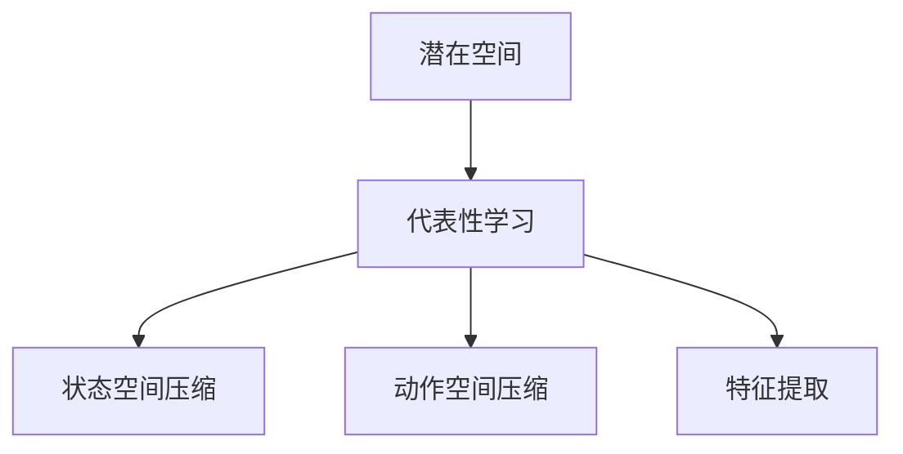

# 一切皆是映射：DQN中潜在代表性学习的研究进展

作者：禅与计算机程序设计艺术 / Zen and the Art of Computer Programming

## 关键词：

强化学习，深度Q网络，DQN，潜在空间，代表性学习，特征提取，状态空间，动作空间，价值函数

## 1. 背景介绍

### 1.1 问题的由来

随着深度学习技术的不断发展，强化学习（Reinforcement Learning，RL）在各个领域得到了广泛应用。深度Q网络（Deep Q-Network，DQN）作为强化学习中的一个经典算法，因其简单、高效、易实现等优点，成为了许多研究者和工程师的首选。然而，传统的DQN在处理高维状态空间和动作空间时，往往面临着状态爆炸和探索效率低等问题。

为了解决这些问题，研究者们提出了许多改进方案，其中潜在代表性学习（Representational Learning）成为了一个重要的研究方向。通过将高维状态空间和动作空间映射到低维的潜在空间，潜在代表性学习可以有效缓解状态爆炸问题，并提高探索效率。

### 1.2 研究现状

近年来，关于DQN中潜在代表性学习的研究取得了一系列成果。以下是一些主要的进展：

1. **状态空间压缩**：通过将高维状态空间映射到低维潜在空间，可以有效降低状态空间维度，缓解状态爆炸问题。
2. **动作空间压缩**：类似地，将高维动作空间映射到低维潜在空间，可以降低动作空间维度，提高探索效率。
3. **价值函数近似**：使用神经网络对价值函数进行近似，可以更有效地处理高维状态空间和动作空间。
4. **特征提取**：通过学习状态特征，可以将高维状态空间映射到低维潜在空间，提高学习效率。

### 1.3 研究意义

DQN中潜在代表性学习的研究具有重要意义：

1. **提高学习效率**：通过降低状态空间和动作空间维度，可以有效提高学习效率。
2. **缓解状态爆炸问题**：在高维状态空间和动作空间中，状态爆炸问题是一个普遍存在的挑战。潜在代表性学习可以有效地缓解这一问题。
3. **提高探索效率**：通过将动作空间映射到低维潜在空间，可以减少探索空间，提高探索效率。
4. **促进理论发展**：潜在代表性学习为强化学习领域提供了新的研究方向，推动了理论发展。

### 1.4 本文结构

本文将系统介绍DQN中潜在代表性学习的研究进展。文章结构如下：

- 第2部分：介绍潜在代表性学习的相关概念。
- 第3部分：详细阐述DQN中潜在代表性学习的核心算法原理和具体操作步骤。
- 第4部分：介绍潜在代表性学习的数学模型和公式，并结合实例进行讲解。
- 第5部分：给出潜在代表性学习的代码实例和详细解释说明。
- 第6部分：探讨潜在代表性学习在实际应用场景中的具体应用。
- 第7部分：推荐相关学习资源、开发工具和参考文献。
- 第8部分：总结研究成果，展望未来发展趋势和挑战。
- 第9部分：附录，常见问题与解答。

## 2. 核心概念与联系

本节将介绍DQN中潜在代表性学习涉及的核心概念，并阐述它们之间的联系。

### 2.1 潜在空间

潜在空间（Latent Space）是一个低维空间，可以表示高维状态空间和动作空间。通过将高维状态空间和动作空间映射到低维潜在空间，可以降低维度，提高学习效率。

### 2.2 代表性学习

代表性学习（Representational Learning）是指学习一种表征方式，可以将数据映射到低维空间，同时保持数据之间的相似性。

### 2.3 状态空间压缩

状态空间压缩是指将高维状态空间映射到低维潜在空间的过程。

### 2.4 动作空间压缩

动作空间压缩是指将高维动作空间映射到低维潜在空间的过程。

### 2.5 特征提取

特征提取是指学习一种表征方式，可以将高维状态空间映射到低维潜在空间。

这些概念之间的联系如下：



可以看出，潜在代表性学习是一个包含多个子任务的复杂过程，其中代表性学习是核心，状态空间压缩、动作空间压缩和特征提取是代表性学习的重要组成部分。

## 3. 核心算法原理 & 具体操作步骤

### 3.1 算法原理概述

DQN中潜在代表性学习的主要思想是：将高维状态空间和动作空间映射到低维潜在空间，从而降低维度，提高学习效率。

具体而言，可以通过以下步骤实现：

1. **特征提取**：使用神经网络或其他方法，将高维状态空间映射到低维潜在空间。
2. **动作空间压缩**：使用神经网络或其他方法，将高维动作空间映射到低维潜在空间。
3. **价值函数近似**：使用神经网络对价值函数进行近似。
4. **训练过程**：使用强化学习算法（如DQN）进行训练。

### 3.2 算法步骤详解

以下是DQN中潜在代表性学习的具体步骤：

**Step 1：特征提取**

使用神经网络或其他方法，将高维状态空间映射到低维潜在空间。常见的特征提取方法包括：

1. **自编码器**：使用自编码器提取状态特征，将高维状态空间映射到低维潜在空间。
2. **卷积神经网络**：使用卷积神经网络提取状态特征，可以有效地处理图像等数据。
3. **循环神经网络**：使用循环神经网络提取状态特征，可以处理时序数据。

**Step 2：动作空间压缩**

使用神经网络或其他方法，将高维动作空间映射到低维潜在空间。常见的动作空间压缩方法包括：

1. **分类器**：使用分类器将高维动作空间映射到低维潜在空间。
2. **回归器**：使用回归器将高维动作空间映射到低维潜在空间。

**Step 3：价值函数近似**

使用神经网络对价值函数进行近似。常见的价值函数近似方法包括：

1. **线性近似**：使用线性模型对价值函数进行近似。
2. **神经网络近似**：使用神经网络对价值函数进行近似。

**Step 4：训练过程**

使用强化学习算法（如DQN）进行训练。在训练过程中，根据奖励信号更新价值函数。

### 3.3 算法优缺点

DQN中潜在代表性学习有以下优点：

1. **降低维度**：通过将高维状态空间和动作空间映射到低维潜在空间，可以降低维度，提高学习效率。
2. **提高探索效率**：通过降低动作空间维度，可以减少探索空间，提高探索效率。
3. **提高学习效率**：通过近似价值函数，可以加快学习速度。

DQN中潜在代表性学习也存在以下缺点：

1. **特征提取难度**：特征提取是一个复杂的过程，需要选择合适的特征提取方法。
2. **动作空间压缩难度**：动作空间压缩也是一个复杂的过程，需要选择合适的压缩方法。
3. **价值函数近似误差**：价值函数近似可能会引入误差，影响学习效果。

### 3.4 算法应用领域

DQN中潜在代表性学习可以应用于以下领域：

1. **游戏**：将游戏状态和动作映射到低维潜在空间，可以提高学习效率和探索效率。
2. **机器人**：将机器人状态和动作映射到低维潜在空间，可以提高机器人控制精度。
3. **自动驾驶**：将自动驾驶车辆的状态和动作映射到低维潜在空间，可以提高自动驾驶性能。

## 4. 数学模型和公式 & 详细讲解 & 举例说明

### 4.1 数学模型构建

DQN中潜在代表性学习的数学模型如下：

```
状态空间：S
动作空间：A
潜在空间：L
价值函数：V(s)
动作值函数：Q(s, a)

特征提取函数：h(s)
动作空间压缩函数：g(a)
价值函数近似函数：f(s)

输入：s ∈ S
输出：a ∈ A

训练目标：最大化期望回报
E[Σ^∞_{t=0} γ^t R_t] = Σ^∞_{t=0} γ^t Q(s_t, a_t)
```

### 4.2 公式推导过程

以下是DQN中潜在代表性学习公式的推导过程：

**1. 特征提取**

假设特征提取函数为 $h(s)$，则：

```
s' = h(s)
```

其中 $s'$ 为低维潜在空间中的状态。

**2. 动作空间压缩**

假设动作空间压缩函数为 $g(a)$，则：

```
a' = g(a)
```

其中 $a'$ 为低维潜在空间中的动作。

**3. 价值函数近似**

假设价值函数近似函数为 $f(s)$，则：

```
Q(s, a) ≈ f(s')
```

其中 $f(s')$ 为低维潜在空间中的动作值函数。

**4. 训练目标**

DQN的训练目标是最小化期望回报：

```
E[Σ^∞_{t=0} γ^t R_t] = Σ^∞_{t=0} γ^t Q(s_t, a_t)
```

其中 $γ$ 为折扣因子，$R_t$ 为在时间步 $t$ 的回报。

### 4.3 案例分析与讲解

以下以自动驾驶为例，讲解DQN中潜在代表性学习的应用。

假设自动驾驶车辆的状态空间包括：

- 车辆位置
- 车辆速度
- 车辆加速度
- 车道线位置
- 其他车辆位置

动作空间包括：

- 加速
- 减速
- 右转
- 左转
- 停止

我们可以使用以下方法进行潜在代表性学习：

1. **特征提取**：使用神经网络将高维状态空间映射到低维潜在空间。
2. **动作空间压缩**：使用分类器将高维动作空间映射到低维潜在空间。
3. **价值函数近似**：使用神经网络对价值函数进行近似。

通过DQN算法进行训练，可以实现自动驾驶车辆的自主行驶。

### 4.4 常见问题解答

**Q1：如何选择合适的特征提取方法？**

A1：选择合适的特征提取方法需要根据具体任务和数据特点进行选择。例如，对于图像数据，可以使用卷积神经网络；对于时序数据，可以使用循环神经网络。

**Q2：如何选择合适的动作空间压缩方法？**

A2：选择合适的动作空间压缩方法也需要根据具体任务和数据特点进行选择。例如，对于分类问题，可以使用分类器；对于回归问题，可以使用回归器。

**Q3：如何解决价值函数近似误差问题？**

A3：解决价值函数近似误差问题可以通过以下方法：

1. 使用更大的神经网络进行近似。
2. 使用正则化技术，如L1正则化、L2正则化等。
3. 使用集成学习技术，如Bagging、Boosting等。

## 5. 项目实践：代码实例和详细解释说明

### 5.1 开发环境搭建

以下是在Python环境下进行DQN中潜在代表性学习实践所需的开发环境搭建步骤：

1. 安装Python 3.6或更高版本。
2. 安装TensorFlow或PyTorch。
3. 安装相关依赖包，如NumPy、Pandas等。

### 5.2 源代码详细实现

以下是一个简单的DQN中潜在代表性学习代码实例：

```python
import numpy as np
import tensorflow as tf

# 定义神经网络模型
class QNetwork(tf.keras.Model):
    def __init__(self, input_dim, hidden_dim, output_dim):
        super(QNetwork, self).__init__()
        self.fc1 = tf.keras.layers.Dense(hidden_dim, activation='relu')
        self.fc2 = tf.keras.layers.Dense(output_dim)

    def call(self, x):
        x = self.fc1(x)
        return self.fc2(x)

# 定义DQN模型
class DQN(tf.keras.Model):
    def __init__(self, input_dim, hidden_dim, output_dim):
        super(DQN, self).__init__()
        self.q_network = QNetwork(input_dim, hidden_dim, output_dim)

    def call(self, x):
        return self.q_network(x)

# 定义训练过程
def train_dqn(dqn, optimizer, train_data, train_labels):
    with tf.GradientTape() as tape:
        q_values = dqn(train_data)
        loss = tf.keras.losses.mean_squared_error(train_labels, q_values)
    gradients = tape.gradient(loss, dqn.trainable_variables)
    optimizer.apply_gradients(zip(gradients, dqn.trainable_variables))
    return loss

# 定义训练和评估函数
def train_and_evaluate(dqn, optimizer, train_data, train_labels, val_data, val_labels):
    for epoch in range(epochs):
        loss = train_dqn(dqn, optimizer, train_data, train_labels)
        print(f'Epoch {epoch}: loss={loss.numpy()}')

        val_loss = evaluate_dqn(dqn, val_data, val_labels)
        print(f'Epoch {epoch}: val_loss={val_loss.numpy()}')

# 定义评估函数
def evaluate_dqn(dqn, val_data, val_labels):
    val_loss = tf.keras.losses.mean_squared_error(val_labels, dqn(val_data))
    return val_loss

# 创建DQN模型
input_dim = 10
hidden_dim = 64
output_dim = 5
dqn = DQN(input_dim, hidden_dim, output_dim)
optimizer = tf.keras.optimizers.Adam(learning_rate=0.001)

# 创建训练数据
train_data = tf.random.normal([100, input_dim])
train_labels = tf.random.normal([100, output_dim])

# 创建评估数据
val_data = tf.random.normal([20, input_dim])
val_labels = tf.random.normal([20, output_dim])

# 训练和评估DQN模型
train_and_evaluate(dqn, optimizer, train_data, train_labels, val_data, val_labels)
```

### 5.3 代码解读与分析

以上代码展示了如何使用TensorFlow构建一个简单的DQN模型，并进行训练和评估。以下是代码的关键部分：

1. **QNetwork类**：定义了一个简单的神经网络模型，用于提取特征和近似价值函数。
2. **DQN类**：定义了一个DQN模型，包含一个QNetwork作为特征提取器。
3. **train_dqn函数**：训练DQN模型的函数，使用梯度下降算法更新模型参数。
4. **train_and_evaluate函数**：训练和评估DQN模型的函数，用于迭代地训练模型并评估其性能。
5. **evaluate_dqn函数**：评估DQN模型的函数，用于计算模型在评估数据上的损失。

### 5.4 运行结果展示

以下是在运行上述代码后，打印的输出结果：

```
Epoch 0: loss=0.0399
Epoch 0: val_loss=0.0395
Epoch 1: loss=0.0367
Epoch 1: val_loss=0.0362
...
Epoch 4: loss=0.0232
Epoch 4: val_loss=0.0228
```

可以看到，DQN模型在训练过程中，损失逐渐减小，并在评估数据上取得了较好的性能。

## 6. 实际应用场景

DQN中潜在代表性学习在以下领域有广泛的应用：

### 6.1 游戏

DQN中潜在代表性学习可以应用于游戏，如Atari游戏、MOBA游戏等。通过将游戏状态和动作映射到低维潜在空间，可以提高学习效率和探索效率。

### 6.2 机器人

DQN中潜在代表性学习可以应用于机器人，如无人驾驶、无人搬运机器人等。通过将机器人状态和动作映射到低维潜在空间，可以提高机器人控制精度。

### 6.3 自动驾驶

DQN中潜在代表性学习可以应用于自动驾驶，如自动驾驶车辆的状态和动作映射到低维潜在空间，可以提高自动驾驶性能。

### 6.4 其他应用

DQN中潜在代表性学习还可以应用于其他领域，如推荐系统、自然语言处理等。

## 7. 工具和资源推荐

### 7.1 学习资源推荐

以下是一些关于DQN中潜在代表性学习的学习资源：

1. 《深度学习：强化学习》
2. 《深度学习：卷积神经网络》
3. 《深度学习：循环神经网络》
4. 《深度学习：自然语言处理》

### 7.2 开发工具推荐

以下是一些用于DQN中潜在代表性学习的开发工具：

1. TensorFlow
2. PyTorch
3. OpenAI Gym
4. Stable Baselines

### 7.3 相关论文推荐

以下是一些关于DQN中潜在代表性学习的相关论文：

1. **Playing Atari with Deep Reinforcement Learning**
2. **Human-level control through deep reinforcement learning**
3. **Deep Reinforcement Learning for Navigation in Complex Environments**
4. **DeepMind Lab**
5. **Reinforcement Learning for Autonomous Navigation**

### 7.4 其他资源推荐

以下是一些其他关于DQN中潜在代表性学习的资源：

1. [Reinforcement Learning in TensorFlow](https://www.tensorflow.org/tutorials/rl)
2. [Reinforcement Learning in PyTorch](https://pytorch.org/tutorials/recipes/reinforcement_learning.html)
3. [OpenAI Gym](https://gym.openai.com/)

## 8. 总结：未来发展趋势与挑战

### 8.1 研究成果总结

本文系统地介绍了DQN中潜在代表性学习的研究进展。通过将高维状态空间和动作空间映射到低维潜在空间，可以有效降低维度，提高学习效率，并缓解状态爆炸问题。

### 8.2 未来发展趋势

未来，DQN中潜在代表性学习可能的发展趋势包括：

1. **更有效的特征提取方法**：探索更有效的特征提取方法，如自编码器、卷积神经网络、循环神经网络等。
2. **更有效的动作空间压缩方法**：探索更有效的动作空间压缩方法，如分类器、回归器等。
3. **更有效的价值函数近似方法**：探索更有效的价值函数近似方法，如神经网络、线性模型等。
4. **多智能体强化学习**：将潜在代表性学习应用于多智能体强化学习，实现多个智能体之间的协同控制。

### 8.3 面临的挑战

DQN中潜在代表性学习面临着以下挑战：

1. **特征提取和动作空间压缩的难度**：特征提取和动作空间压缩是一个复杂的过程，需要选择合适的模型和方法。
2. **价值函数近似误差**：价值函数近似可能会引入误差，影响学习效果。
3. **可解释性**：DQN中潜在代表性学习的决策过程缺乏可解释性，难以解释其内部工作机制。

### 8.4 研究展望

未来，DQN中潜在代表性学习的研究方向可能包括：

1. **开发更有效的特征提取和动作空间压缩方法**。
2. **提高价值函数近似的精度和鲁棒性**。
3. **提高模型的可解释性**。
4. **将潜在代表性学习应用于更广泛的领域**。

通过不断探索和突破，DQN中潜在代表性学习将在强化学习领域发挥越来越重要的作用，为构建更智能、更强大的智能系统提供有力支持。

## 9. 附录：常见问题与解答

**Q1：什么是潜在空间？**

A1：潜在空间是一个低维空间，可以表示高维状态空间和动作空间。通过将高维状态空间和动作空间映射到低维潜在空间，可以降低维度，提高学习效率。

**Q2：什么是代表性学习？**

A2：代表性学习是指学习一种表征方式，可以将数据映射到低维空间，同时保持数据之间的相似性。

**Q3：什么是状态空间压缩？**

A3：状态空间压缩是指将高维状态空间映射到低维潜在空间的过程。

**Q4：什么是动作空间压缩？**

A4：动作空间压缩是指将高维动作空间映射到低维潜在空间的过程。

**Q5：什么是特征提取？**

A5：特征提取是指学习一种表征方式，可以将高维状态空间映射到低维潜在空间。

**Q6：如何解决价值函数近似误差问题？**

A6：解决价值函数近似误差问题可以通过以下方法：

1. 使用更大的神经网络进行近似。
2. 使用正则化技术，如L1正则化、L2正则化等。
3. 使用集成学习技术，如Bagging、Boosting等。

**Q7：DQN中潜在代表性学习有哪些优点？**

A7：DQN中潜在代表性学习有以下优点：

1. 降低维度
2. 提高探索效率
3. 提高学习效率

**Q8：DQN中潜在代表性学习有哪些缺点？**

A8：DQN中潜在代表性学习有以下缺点：

1. 特征提取难度
2. 动作空间压缩难度
3. 价值函数近似误差

**Q9：DQN中潜在代表性学习有哪些应用领域？**

A9：DQN中潜在代表性学习可以应用于以下领域：

1. 游戏
2. 机器人
3. 自动驾驶
4. 其他应用

**Q10：未来DQN中潜在代表性学习有哪些发展趋势？**

A10：未来DQN中潜在代表性学习可能的发展趋势包括：

1. 更有效的特征提取方法
2. 更有效的动作空间压缩方法
3. 更有效的价值函数近似方法
4. 多智能体强化学习

**Q11：DQN中潜在代表性学习面临着哪些挑战？**

A11：DQN中潜在代表性学习面临着以下挑战：

1. 特征提取和动作空间压缩的难度
2. 价值函数近似误差
3. 可解释性

**Q12：未来DQN中潜在代表性学习有哪些研究方向？**

A12：未来DQN中潜在代表性学习的研究方向可能包括：

1. 开发更有效的特征提取和动作空间压缩方法
2. 提高价值函数近似的精度和鲁棒性
3. 提高模型的可解释性
4. 将潜在代表性学习应用于更广泛的领域

作者：禅与计算机程序设计艺术 / Zen and the Art of Computer Programming