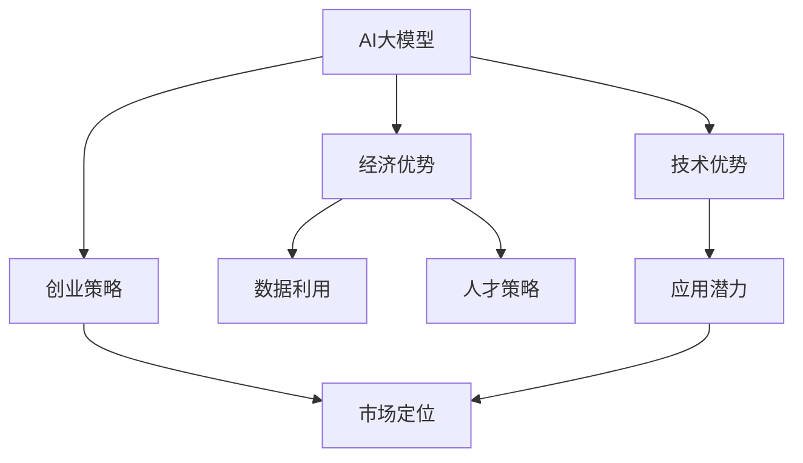

                 

# AI 大模型创业：如何利用经济优势？

> 关键词：AI大模型,创业策略,经济优势,数据利用,人才策略,市场定位

## 1. 背景介绍

随着人工智能(AI)技术的飞速发展，AI大模型成为互联网科技公司争相布局的关键资源。以BERT、GPT-3、DALL-E等为代表的AI大模型，以其卓越的性能和广泛的应用前景，吸引了大量投资者的关注。在这些公司中，Google、Microsoft、OpenAI、Baidu等都凭借AI大模型走上了价值百亿的估值巅峰。AI大模型的经济价值被充分认可，使得AI大模型创业成为热门话题。

AI大模型创业既有机遇也有挑战。如何利用AI大模型的经济优势，打造出具有强大竞争力的企业，是创业者和投资人共同的课题。本文将从AI大模型的经济优势、创业策略、市场定位等方面展开探讨，希望能为AI大模型创业提供有价值的参考。

## 2. 核心概念与联系

### 2.1 核心概念概述

- **AI大模型**：以BERT、GPT-3、DALL-E等模型为代表的超大规模预训练模型，通常参数量在十亿级以上，具备强大的语言理解、图像生成、知识推理等能力。

- **创业策略**：在AI大模型创业中，如何规划和执行企业的发展目标和战略决策，包括市场定位、产品开发、人才建设、资金筹集等方面。

- **经济优势**：AI大模型在提升业务效率、降低运营成本、创造新业务等方面所带来的经济利益，如减少人力、提升决策质量、提高市场竞争力等。

- **数据利用**：AI大模型训练和优化需要大量的标注数据，如何高效地获取和利用数据，是实现AI大模型经济价值的关键。

- **人才策略**：AI大模型技术复杂度高，需要高水平的技术团队和数据科学家、算法工程师等人才支撑，如何吸引和培养这些人才，对企业的竞争力和发展速度至关重要。

- **市场定位**：明确企业在AI大模型领域的定位，如技术创新、应用落地、市场规模等，有助于制定合理的商业策略。

这些核心概念紧密相连，共同构成AI大模型创业的基础。通过理解并运用这些概念，能够更好地把握AI大模型创业的本质和挑战。

### 2.2 概念间的关系

通过以下Mermaid流程图展示这些核心概念之间的关系：



该流程图展示AI大模型创业的关键组成要素：

1. AI大模型作为基础，提供强大的技术支撑。
2. 创业策略指导企业的整体发展方向。
3. 经济优势驱动业务增长和盈利。
4. 数据利用是AI大模型能力提升的关键。
5. 人才策略决定企业的发展速度和质量。
6. 市场定位影响企业的发展方向和竞争策略。
7. 技术优势和应用潜力构成AI大模型的核心竞争力。

## 3. 核心算法原理 & 具体操作步骤

### 3.1 算法原理概述

AI大模型创业的算法原理主要包括数据驱动和人才驱动两个方面：

1. **数据驱动**：利用大规模的标注数据，进行预训练和微调，提升模型的能力和泛化能力。

2. **人才驱动**：吸引和培养顶尖人才，通过人才的智慧和技术积累，推动AI大模型的研发和优化。

### 3.2 算法步骤详解

AI大模型创业的算法步骤如下：

1. **数据收集与处理**：
   - 从多渠道收集标注数据，如公共数据集、众包平台、企业自有数据等。
   - 对数据进行清洗、归一化、标注，确保数据质量。

2. **模型预训练**：
   - 在强大的计算资源支持下，利用预训练框架进行模型训练，如使用BERT、GPT等。
   - 预训练过程中，关注模型的收敛速度、泛化能力和计算效率。

3. **模型微调**：
   - 针对特定应用场景，对预训练模型进行微调，如对分类、生成、问答等任务进行训练。
   - 微调时，需注意学习率、正则化、数据增强等技术细节，防止过拟合。

4. **产品化与部署**：
   - 将微调后的模型封装成API接口或SDK，便于应用集成。
   - 部署到云平台或本地服务器，提供服务化支持。

5. **运营与优化**：
   - 监测模型性能，收集用户反馈，进行模型优化。
   - 不断提升模型精度、效率和可解释性。

### 3.3 算法优缺点

AI大模型创业算法的优点：

1. **高效性**：AI大模型训练周期短，通过预训练和微调可以迅速提升模型能力。
2. **普适性**：AI大模型可以应用于各种业务场景，提供统一的解决方案。
3. **可扩展性**：模型参数量大，可以处理更复杂的数据和任务。

AI大模型创业算法的缺点：

1. **数据依赖**：数据质量对模型效果有重要影响，但数据获取成本高，标注难度大。
2. **计算资源需求高**：预训练和微调需要强大的计算资源，中小企业难以承受。
3. **模型复杂度高**：AI大模型的内部结构复杂，调试和优化难度大。

### 3.4 算法应用领域

AI大模型在以下领域有广泛应用：

1. **自然语言处理(NLP)**：如文本分类、情感分析、机器翻译、问答系统等。
2. **计算机视觉(CV)**：如图像分类、目标检测、图像生成等。
3. **语音处理**：如语音识别、语音合成、语音情感分析等。
4. **推荐系统**：如电商推荐、新闻推荐等。
5. **金融科技**：如信用评估、风险管理、智能投顾等。
6. **医疗健康**：如疾病预测、基因组学、医疗影像分析等。

## 4. 数学模型和公式 & 详细讲解 & 举例说明

### 4.1 数学模型构建

AI大模型的数学模型构建主要包括预训练和微调两个阶段：

- **预训练阶段**：利用大规模未标注数据进行自监督学习，如BERT模型中采用的语言建模任务。
- **微调阶段**：在有标注数据的情况下，对预训练模型进行有监督学习，如利用分类任务对模型进行微调。

### 4.2 公式推导过程

以BERT模型的预训练过程为例，其数学模型构建如下：

$$
L(x,y) = -\frac{1}{N} \sum_{i=1}^N \log P(y_i|x)
$$

其中，$x$ 为输入的文本序列，$y$ 为文本的标签序列，$P(y_i|x)$ 为模型预测的概率分布，$L(x,y)$ 为损失函数，通常采用交叉熵损失。

### 4.3 案例分析与讲解

以Google的BERT模型为例，其训练过程如下：

1. **数据预处理**：将原始文本序列分词，构建词汇表，将文本序列转化为模型输入。

2. **模型结构**：使用Transformer结构，包含多个编码器层和注意力机制，提升模型的表征能力。

3. **损失函数**：采用下一句预测任务，即随机掩码掉部分词语，让模型预测被掩码的词语，优化模型语言理解能力。

4. **训练过程**：在多个GPU上进行分布式训练，优化参数以最小化损失函数。

## 5. 项目实践：代码实例和详细解释说明

### 5.1 开发环境搭建

以下是使用Python和PyTorch搭建AI大模型训练环境的示例：

1. 安装Python和PyTorch：
```bash
conda create -n ai_model python=3.7
conda activate ai_model
pip install torch torchvision torchaudio transformers
```

2. 安装数据处理工具：
```bash
pip install pandas numpy
```

3. 配置数据路径和模型参数：
```python
data_path = "/path/to/dataset"
model_path = "/path/to/pretrained_model"
batch_size = 32
learning_rate = 1e-5
```

### 5.2 源代码详细实现

以下是使用PyTorch和Transformers库实现BERT模型的预训练和微调的示例代码：

```python
import torch
from transformers import BertTokenizer, BertForMaskedLM, AdamW, get_linear_schedule_with_warmup
from torch.utils.data import DataLoader, Dataset

class MaskedLMExample(Dataset):
    def __init__(self, dataset, tokenizer):
        self.dataset = dataset
        self.tokenizer = tokenizer
        
    def __len__(self):
        return len(self.dataset)
        
    def __getitem__(self, idx):
        text = self.dataset[idx]
        input_ids = self.tokenizer.encode(text)
        masked_indices = torch.rand(len(input_ids)) < 0.15
        masked_indices = masked_indices & (input_ids != self.tokenizer.mask_token_id)
        input_ids[masked_indices] = self.tokenizer.mask_token_id
        return {
            'input_ids': input_ids,
            'targets': input_ids[masked_indices]
        }

# 数据预处理
tokenizer = BertTokenizer.from_pretrained('bert-base-uncased')
dataset = MaskedLMExample(dataset, tokenizer)
train_loader = DataLoader(dataset, batch_size=32, shuffle=True)

# 模型加载
model = BertForMaskedLM.from_pretrained('bert-base-uncased')

# 优化器设置
optimizer = AdamW(model.parameters(), lr=1e-5)
scheduler = get_linear_schedule_with_warmup(optimizer, num_warmup_steps=0, num_training_steps=len(train_loader) * epochs)

# 训练过程
model.train()
for epoch in range(epochs):
    for batch in train_loader:
        input_ids = batch['input_ids']
        targets = batch['targets']
        outputs = model(input_ids)
        loss = F.cross_entropy(outputs.view(-1, outputs.size(-1)), targets.view(-1))
        loss.backward()
        optimizer.step()
        scheduler.step()
```

### 5.3 代码解读与分析

代码中，我们首先定义了一个用于预训练的掩码语言模型（Masked Language Model, MLM），即BERT模型。接着，我们通过`BertTokenizer`对数据进行分词和编码，并通过`AdamW`优化器进行模型训练。在训练过程中，我们通过`get_linear_schedule_with_warmup`函数设置学习率衰减策略，确保模型能够平稳收敛。

### 5.4 运行结果展示

运行上述代码后，我们可以在训练完成后，将微调后的模型保存，并使用以下代码进行推理：

```python
model.eval()
for batch in train_loader:
    input_ids = batch['input_ids']
    with torch.no_grad():
        outputs = model(input_ids)
        predictions = torch.argmax(outputs[0], dim=2)
```

## 6. 实际应用场景

### 6.1 智能客服系统

智能客服系统利用AI大模型，实现智能问答和情感分析等功能，提供24小时不间断的服务。例如，在智能客服平台中，可以使用预训练模型进行初步的文本分类和情感分析，然后将结果传递给业务系统进行后续处理。

### 6.2 金融科技

金融科技企业可以利用AI大模型进行信用评分、风险评估、智能投顾等应用。例如，通过预训练模型分析客户的历史交易数据和行为特征，预测其信用评分，优化风控策略。

### 6.3 医疗健康

医疗健康领域可以利用AI大模型进行疾病预测、基因组学分析、医疗影像分析等。例如，通过预训练模型分析病人的基因数据，预测其患病的风险。

## 7. 工具和资源推荐

### 7.1 学习资源推荐

- **深度学习基础**：《Deep Learning》书籍，Ian Goodfellow著，深入讲解深度学习的基本理论和算法。
- **NLP技术实战**：《自然语言处理入门》课程，由斯坦福大学开设，涵盖NLP的基本概念和常用算法。
- **AI大模型实践**：《Transformers from Principles to Practice》系列博文，讲解BERT、GPT等大模型的原理和实践。

### 7.2 开发工具推荐

- **PyTorch**：强大的深度学习框架，支持GPU计算和分布式训练。
- **TensorFlow**：谷歌开源的深度学习框架，支持CPU/GPU和分布式计算。
- **Transformers**：Hugging Face开发的NLP工具库，提供多种预训练模型和微调工具。
- **Weights & Biases**：实时监控和可视化工具，支持模型训练和超参数调试。

### 7.3 相关论文推荐

- **BERT: Pre-training of Deep Bidirectional Transformers for Language Understanding**：谷歌提出的预训练模型BERT，在多个NLP任务上取得了最先进的性能。
- **Language Models are Unsupervised Multitask Learners**：OpenAI提出的GPT模型，展示了无监督学习在大模型中的应用。
- **Parameter-Efficient Transfer Learning for NLP**：CMU提出的 Adapter技术，实现了参数高效微调，提高了模型训练效率。

## 8. 总结：未来发展趋势与挑战

### 8.1 研究成果总结

AI大模型创业在技术上取得了显著进展，成为互联网科技公司争相布局的关键资源。通过AI大模型，企业能够提升业务效率、降低运营成本、创造新业务机会。

### 8.2 未来发展趋势

AI大模型创业的未来趋势包括：

1. **技术创新**：AI大模型技术不断进步，模型规模和能力持续提升，更多创新应用场景不断涌现。
2. **商业化加速**：AI大模型创业公司逐渐从研发阶段向商业化转型，形成可持续发展的商业模式。
3. **国际竞争**：AI大模型领域竞争激烈，技术领先企业有望在全球市场占据优势。

### 8.3 面临的挑战

AI大模型创业面临的挑战包括：

1. **数据获取**：高质量标注数据获取难度大，成本高，限制了AI大模型的应用。
2. **计算资源**：预训练和微调模型需要强大的计算资源，中小企业难以承担。
3. **人才缺乏**：顶尖AI人才供应不足，对企业发展速度和质量形成制约。
4. **市场竞争**：AI大模型领域竞争激烈，企业需要持续创新和差异化竞争。

### 8.4 研究展望

未来的AI大模型创业需要从以下几个方面进行突破：

1. **数据获取**：利用众包、数据集开源等方式，降低数据获取成本。
2. **计算资源**：优化模型架构和算法，提升训练和推理效率。
3. **人才建设**：通过企业品牌、激励机制、人才培养计划等，吸引和培养顶尖人才。
4. **市场定位**：明确企业定位，差异化竞争，找到独特的商业模式。

## 9. 附录：常见问题与解答

**Q1：AI大模型的数据依赖性如何解决？**

A：通过众包平台、数据集开源、数据合作等方式，获取高质量标注数据。同时，可以利用无监督学习、半监督学习等方式，提升模型泛化能力。

**Q2：AI大模型的计算资源需求如何优化？**

A：优化模型结构，采用分布式训练、混合精度训练等技术，提升计算效率。同时，可以使用云计算平台，按需使用计算资源。

**Q3：AI大模型的应用场景有哪些？**

A：AI大模型可以应用于智能客服、金融科技、医疗健康、推荐系统等多个领域，提供统一的解决方案。

**Q4：如何构建AI大模型的商业化平台？**

A：通过开放API接口、构建SDK、提供数据分析工具等方式，实现AI大模型的商业化应用。同时，建立完善的服务体系和客户支持，保障平台稳定性。

**Q5：AI大模型的开发和部署有哪些最佳实践？**

A：采用模块化设计、自动化部署、持续集成和持续交付等最佳实践，提升开发效率和系统可靠性。同时，建立完善的监控和运维机制，保障系统稳定运行。

---

作者：禅与计算机程序设计艺术 / Zen and the Art of Computer Programming

