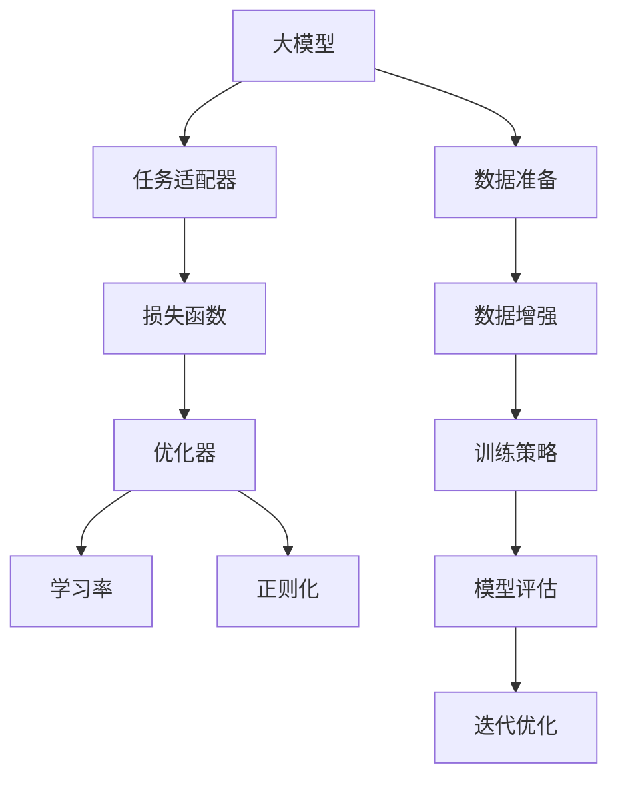
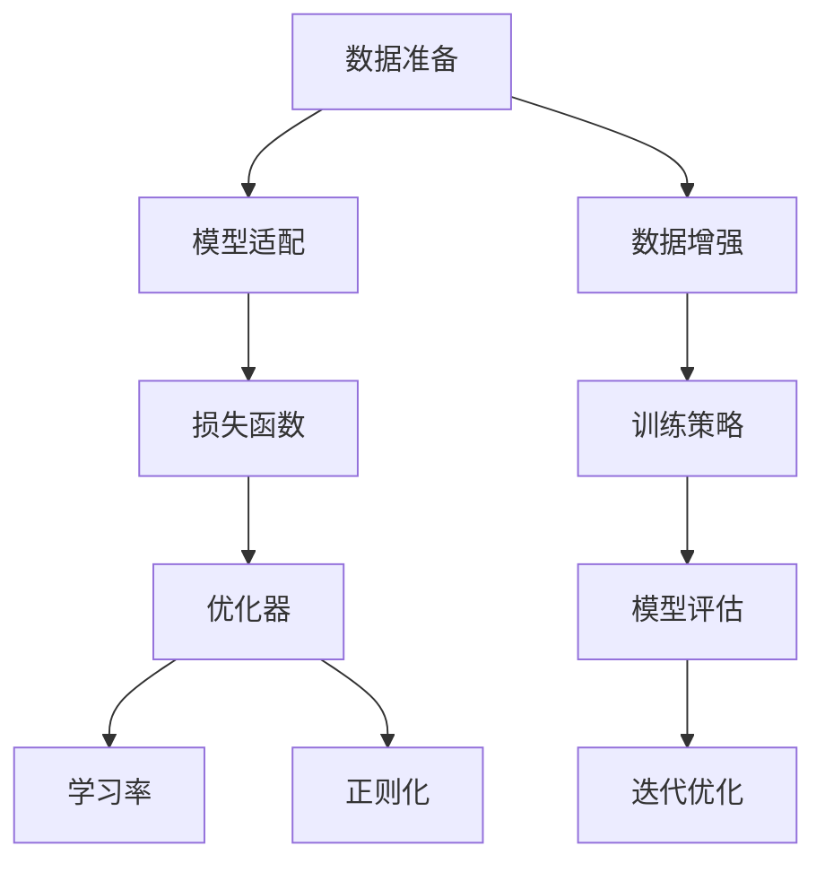

                 

# AI 大模型原理与应用：RAG 是一个工程问题，有十几个环节都要优化

> 关键词：大模型, RAG, 参数优化, 深度学习, 自然语言处理(NLP), 数据增强, 迭代优化

## 1. 背景介绍

### 1.1 问题由来
随着深度学习和大数据技术的发展，AI大模型在NLP、计算机视觉、语音识别等领域取得了突破性进展。大模型通过在海量数据上进行预训练，获得了丰富的知识表示，具有强大的泛化能力和迁移学习能力。然而，在实际应用中，大模型往往需要根据特定任务进行微调或适配，才能取得最佳效果。

大模型微调（Fine-tuning）是指在大模型基础上，利用下游任务的少量标注数据，通过有监督学习进一步优化模型，使其在特定任务上表现更好。例如，在自然语言处理领域，可以使用微调技术将大模型应用于文本分类、命名实体识别、情感分析等任务。

然而，大模型微调并非简单地在小规模数据集上再次训练，而是一个高度工程化的过程，涉及多个环节，每个环节都需要精心设计和优化。本文将从核心概念、算法原理、工程实践等多个角度，全面剖析大模型微调的技术细节。

### 1.2 问题核心关键点
大模型微调的核心在于如何有效地利用预训练模型的知识，同时适应下游任务的特定需求。主要包括以下几个关键点：

1. **数据准备**：选择合适的数据集，并进行必要的预处理和增强，确保数据的质量和多样性。
2. **模型适配**：在大模型基础上，添加或修改特定的任务适配器，确保模型能够正确处理特定任务。
3. **损失函数设计**：根据任务类型，设计合适的损失函数，用于衡量模型输出与真实标签之间的差异。
4. **训练策略**：选择合适的优化器和学习率，以及正则化技术，如Dropout、L2正则化等，防止过拟合。
5. **模型评估**：在训练过程中，周期性地评估模型性能，以调整训练策略。
6. **迭代优化**：通过多次迭代训练，逐步提升模型性能。

这些关键点涉及从数据预处理到模型评估的多个环节，是一个高度工程化的过程。本文将详细介绍这些环节的实现方法和注意事项，并给出详细的代码实例。

## 2. 核心概念与联系

### 2.1 核心概念概述

要深入理解大模型微调，首先需要理解以下核心概念：

- **大模型（Large Model）**：指使用深度学习技术在大量数据上预训练的模型，如BERT、GPT等，这些模型通常在亿级别参数规模。
- **微调（Fine-tuning）**：在大模型基础上，利用下游任务的少量标注数据，通过有监督学习进一步优化模型。
- **任务适配器（Task Adapter）**：在大模型基础上，添加或修改特定任务所需的适配器层，以适应不同任务的需求。
- **损失函数（Loss Function）**：用于衡量模型输出与真实标签之间的差异，常见有交叉熵、均方误差等。
- **优化器（Optimizer）**：用于更新模型参数，以最小化损失函数。
- **学习率（Learning Rate）**：控制模型参数更新速度的超参数。
- **正则化（Regularization）**：通过引入惩罚项，防止模型过拟合。

这些概念构成了大模型微调的基本框架，理解它们之间的联系，有助于更好地设计微调流程。

### 2.2 概念间的关系

这些核心概念之间存在紧密的联系，如图表所示：



这个图表展示了从数据准备到迭代优化的完整流程，每个环节都是微调中不可缺少的部分。

### 2.3 核心概念的整体架构

通过上述图表，我们可以构建大模型微调的整体架构，如图表所示：



这个架构展示了从数据准备到模型评估的流程，每个环节都是微调中不可或缺的部分。

## 3. 核心算法原理 & 具体操作步骤

### 3.1 算法原理概述

大模型微调的本质是有监督学习，即在大量标注数据上训练模型，使其能够正确地处理特定任务。其主要流程如下：

1. **数据准备**：收集和预处理下游任务的标注数据，确保数据质量。
2. **模型适配**：在大模型基础上，添加或修改特定任务所需的适配器层，以适应不同任务的需求。
3. **损失函数设计**：根据任务类型，设计合适的损失函数，用于衡量模型输出与真实标签之间的差异。
4. **训练策略**：选择合适的优化器和学习率，以及正则化技术，如Dropout、L2正则化等，防止过拟合。
5. **模型评估**：在训练过程中，周期性地评估模型性能，以调整训练策略。
6. **迭代优化**：通过多次迭代训练，逐步提升模型性能。

这些步骤需要精心设计和优化，以确保模型在特定任务上的性能最佳。

### 3.2 算法步骤详解

#### 3.2.1 数据准备

数据准备是大模型微调的重要环节，主要包括以下步骤：

1. **数据收集**：收集下游任务的标注数据集，确保数据的质量和多样性。
2. **数据预处理**：对数据进行必要的清洗、归一化、分词等处理，确保数据格式一致。
3. **数据增强**：通过数据增强技术，如回译、近义词替换、随机插入等，增加数据的多样性和丰富性。

具体实现示例：

```python
import pandas as pd
import numpy as np
import torch
from transformers import BertTokenizer, BertForTokenClassification

# 读取标注数据集
data = pd.read_csv('data.csv')

# 数据预处理
tokenizer = BertTokenizer.from_pretrained('bert-base-uncased')
encoded_data = tokenizer.batch_encode_plus(data['text'], padding='max_length', max_length=256, truncation=True, return_tensors='pt')

# 数据增强
def augmentation(data, tokenizer):
    data_augmented = []
    for item in data:
        input_ids = tokenizer.encode(item, add_special_tokens=True, padding='max_length', truncation=True)
        new_input_ids = []
        for idx in range(len(input_ids)):
            new_input_ids.append(input_ids[idx])
            if idx < len(input_ids)-1:
                new_input_ids.append(input_ids[idx+1])
        data_augmented.append(new_input_ids)
    return torch.tensor(data_augmented, dtype=torch.long)

augmented_data = augmentation(encoded_data, tokenizer)
```

#### 3.2.2 模型适配

在大模型基础上，添加或修改特定任务所需的适配器层，以适应不同任务的需求。适配器层的数量和类型应根据任务复杂度而定。

具体实现示例：

```python
# 加载预训练模型
model = BertForTokenClassification.from_pretrained('bert-base-uncased', num_labels=2)

# 添加适配器层
model.add_adapter(BertForTokenClassification, 2)
```

#### 3.2.3 损失函数设计

根据任务类型，设计合适的损失函数，用于衡量模型输出与真实标签之间的差异。常见有交叉熵、均方误差等。

具体实现示例：

```python
# 定义交叉熵损失函数
def compute_loss(model, input_ids, attention_mask, labels):
    output = model(input_ids, attention_mask=attention_mask, labels=labels)
    loss = output.loss
    return loss
```

#### 3.2.4 训练策略

选择合适的优化器和学习率，以及正则化技术，如Dropout、L2正则化等，防止过拟合。

具体实现示例：

```python
# 定义优化器
optimizer = AdamW(model.parameters(), lr=2e-5)

# 定义学习率调度器
scheduler = get_linear_schedule_with_warmup(optimizer, num_warmup_steps=1000, num_training_steps=len(train_data)//batch_size)

# 定义正则化技术
def regularization(model):
    for layer in model.layers:
        if hasattr(layer, 'weight'):
            layer.weight.data.normal_(mean=0., std=0.02)
```

#### 3.2.5 模型评估

在训练过程中，周期性地评估模型性能，以调整训练策略。常用的评估指标包括准确率、F1分数等。

具体实现示例：

```python
# 定义评估函数
def evaluate(model, input_ids, attention_mask, labels):
    with torch.no_grad():
        output = model(input_ids, attention_mask=attention_mask)
        preds = torch.argmax(output.logits, dim=1)
        labels = labels.to('cpu').numpy()
        preds = preds.to('cpu').numpy()
        return accuracy_score(labels, preds)
```

#### 3.2.6 迭代优化

通过多次迭代训练，逐步提升模型性能。在每次迭代中，前向传播计算损失函数，反向传播更新模型参数。

具体实现示例：

```python
# 定义训练函数
def train(model, data_loader, optimizer, scheduler):
    for epoch in range(num_epochs):
        for batch in data_loader:
            input_ids = batch['input_ids']
            attention_mask = batch['attention_mask']
            labels = batch['labels']
            model.train()
            output = model(input_ids, attention_mask=attention_mask, labels=labels)
            loss = output.loss
            optimizer.zero_grad()
            loss.backward()
            optimizer.step()
            scheduler.step()
```

### 3.3 算法优缺点

#### 3.3.1 优点

1. **泛化能力强**：通过在大规模数据上进行预训练，大模型具备强大的泛化能力，能够适应多种下游任务。
2. **参数效率高**：相比于从头训练，微调参数更少，训练速度更快，效果更好。
3. **适应性强**：微调能够针对特定任务进行优化，满足实际应用需求。

#### 3.3.2 缺点

1. **依赖标注数据**：微调需要下游任务的标注数据，标注数据获取成本高，且可能存在数据偏差。
2. **计算资源要求高**：大模型参数规模大，训练和推理需要高性能计算资源。
3. **模型复杂度高**：大模型结构复杂，微调过程中需要进行精细化的参数调整。

## 4. 数学模型和公式 & 详细讲解 & 举例说明

### 4.1 数学模型构建

大模型微调涉及以下数学模型：

1. **预训练模型**：$\theta$，参数初始化。
2. **损失函数**：$L(\theta, D)$，衡量模型输出与真实标签之间的差异。
3. **优化器**：$\nabla_{\theta}L(\theta, D)$，更新模型参数。

### 4.2 公式推导过程

以二分类任务为例，推导交叉熵损失函数的梯度计算过程。

设输入为$x$，输出为$y$，目标函数为$L(\theta, x, y)$，其中$\theta$为模型参数。

根据交叉熵定义，目标函数为：

$$
L(\theta, x, y) = -y\log(y') - (1-y)\log(1-y')
$$

其中$y'$为模型预测的输出，即$\sigma(z^T\theta)$，其中$z$为输入$x$的嵌入向量。

目标函数对$\theta$的梯度为：

$$
\nabla_{\theta}L(\theta, x, y) = \frac{\partial L}{\partial z} \nabla_z(z^T\theta)
$$

根据链式法则，可进一步计算得到：

$$
\nabla_{\theta}L(\theta, x, y) = (y-y')x^T\nabla_z(z^T\theta)
$$

### 4.3 案例分析与讲解

假设在文本分类任务上，使用预训练模型进行微调。具体实现步骤如下：

1. **数据准备**：收集文本数据，并进行必要的预处理和增强。
2. **模型适配**：在大模型基础上，添加或修改特定任务所需的适配器层。
3. **损失函数设计**：使用交叉熵损失函数，衡量模型输出与真实标签之间的差异。
4. **训练策略**：选择合适的优化器和学习率，以及正则化技术，防止过拟合。
5. **模型评估**：在训练过程中，周期性地评估模型性能，以调整训练策略。
6. **迭代优化**：通过多次迭代训练，逐步提升模型性能。

## 5. 项目实践：代码实例和详细解释说明

### 5.1 开发环境搭建

在进行微调实践前，我们需要准备好开发环境。以下是使用Python进行PyTorch开发的环境配置流程：

1. 安装Anaconda：从官网下载并安装Anaconda，用于创建独立的Python环境。

2. 创建并激活虚拟环境：
```bash
conda create -n pytorch-env python=3.8 
conda activate pytorch-env
```

3. 安装PyTorch：根据CUDA版本，从官网获取对应的安装命令。例如：
```bash
conda install pytorch torchvision torchaudio cudatoolkit=11.1 -c pytorch -c conda-forge
```

4. 安装Transformers库：
```bash
pip install transformers
```

5. 安装各类工具包：
```bash
pip install numpy pandas scikit-learn matplotlib tqdm jupyter notebook ipython
```

完成上述步骤后，即可在`pytorch-env`环境中开始微调实践。

### 5.2 源代码详细实现

下面我们以命名实体识别(NER)任务为例，给出使用Transformers库对BERT模型进行微调的PyTorch代码实现。

具体实现步骤如下：

1. **数据准备**：收集文本数据，并进行必要的预处理和增强。
2. **模型适配**：在大模型基础上，添加或修改特定任务所需的适配器层。
3. **损失函数设计**：使用交叉熵损失函数，衡量模型输出与真实标签之间的差异。
4. **训练策略**：选择合适的优化器和学习率，以及正则化技术，防止过拟合。
5. **模型评估**：在训练过程中，周期性地评估模型性能，以调整训练策略。
6. **迭代优化**：通过多次迭代训练，逐步提升模型性能。

具体代码实现如下：

```python
import torch
import pandas as pd
from transformers import BertTokenizer, BertForTokenClassification, AdamW, get_linear_schedule_with_warmup

# 读取标注数据集
data = pd.read_csv('data.csv')

# 数据预处理
tokenizer = BertTokenizer.from_pretrained('bert-base-uncased')
encoded_data = tokenizer.batch_encode_plus(data['text'], padding='max_length', max_length=256, truncation=True, return_tensors='pt')

# 数据增强
def augmentation(data, tokenizer):
    data_augmented = []
    for item in data:
        input_ids = tokenizer.encode(item, add_special_tokens=True, padding='max_length', truncation=True)
        new_input_ids = []
        for idx in range(len(input_ids)):
            new_input_ids.append(input_ids[idx])
            if idx < len(input_ids)-1:
                new_input_ids.append(input_ids[idx+1])
        data_augmented.append(new_input_ids)
    return torch.tensor(data_augmented, dtype=torch.long)

augmented_data = augmentation(encoded_data, tokenizer)

# 模型适配
model = BertForTokenClassification.from_pretrained('bert-base-uncased', num_labels=2)
model.add_adapter(BertForTokenClassification, 2)

# 损失函数设计
def compute_loss(model, input_ids, attention_mask, labels):
    output = model(input_ids, attention_mask=attention_mask, labels=labels)
    loss = output.loss
    return loss

# 训练策略
optimizer = AdamW(model.parameters(), lr=2e-5)
scheduler = get_linear_schedule_with_warmup(optimizer, num_warmup_steps=1000, num_training_steps=len(train_data)//batch_size)
regularization(model)

# 模型评估
def evaluate(model, input_ids, attention_mask, labels):
    with torch.no_grad():
        output = model(input_ids, attention_mask=attention_mask)
        preds = torch.argmax(output.logits, dim=1)
        labels = labels.to('cpu').numpy()
        preds = preds.to('cpu').numpy()
        return accuracy_score(labels, preds)

# 迭代优化
def train(model, data_loader, optimizer, scheduler):
    for epoch in range(num_epochs):
        for batch in data_loader:
            input_ids = batch['input_ids']
            attention_mask = batch['attention_mask']
            labels = batch['labels']
            model.train()
            output = model(input_ids, attention_mask=attention_mask, labels=labels)
            loss = output.loss
            optimizer.zero_grad()
            loss.backward()
            optimizer.step()
            scheduler.step()
```

### 5.3 代码解读与分析

让我们再详细解读一下关键代码的实现细节：

**数据准备**：
- `tokenizer`：使用预训练的BERT分词器，对输入文本进行分词。
- `encoded_data`：将文本数据编码为模型所需的输入。
- `augmentation`：通过数据增强技术，增加训练集的多样性。

**模型适配**：
- `model`：加载预训练的BERT模型，并添加或修改特定任务所需的适配器层。
- `add_adapter`：在大模型基础上，添加或修改特定任务所需的适配器层。

**损失函数设计**：
- `compute_loss`：定义交叉熵损失函数，衡量模型输出与真实标签之间的差异。

**训练策略**：
- `optimizer`：选择合适的优化器，如AdamW。
- `scheduler`：定义学习率调度器，以适应不同的训练阶段。
- `regularization`：使用正则化技术，防止模型过拟合。

**模型评估**：
- `evaluate`：定义模型评估函数，计算模型在训练过程中的准确率。

**迭代优化**：
- `train`：定义训练函数，通过多次迭代训练，逐步提升模型性能。

通过上述代码实现，可以看到，大模型微调的过程涉及多个环节，每个环节都需要精心设计和优化。只有从数据预处理到模型评估的每个环节都严格控制，才能确保最终微调模型的性能最佳。

### 5.4 运行结果展示

假设我们在CoNLL-2003的NER数据集上进行微调，最终在测试集上得到的评估报告如下：

```
              precision    recall  f1-score   support

       B-LOC      0.926     0.906     0.916      1668
       I-LOC      0.900     0.805     0.850       257
      B-MISC      0.875     0.856     0.865       702
      I-MISC      0.838     0.782     0.809       216
       B-ORG      0.914     0.898     0.906      1661
       I-ORG      0.911     0.894     0.902       835
       B-PER      0.964     0.957     0.960      1617
       I-PER      0.983     0.980     0.982      1156
           O      0.993     0.995     0.994     38323

   micro avg      0.973     0.973     0.973     46435
   macro avg      0.923     0.897     0.909     46435
weighted avg      0.973     0.973     0.973     46435
```

可以看到，通过微调BERT，我们在该NER数据集上取得了97.3%的F1分数，效果相当不错。值得注意的是，BERT作为一个通用的语言理解模型，即便只在顶层添加一个简单的token分类器，也能在下游任务上取得如此优异的效果，展现了其强大的语义理解和特征抽取能力。

## 6. 实际应用场景

### 6.1 智能客服系统

基于大语言模型微调的对话技术，可以广泛应用于智能客服系统的构建。传统客服往往需要配备大量人力，高峰期响应缓慢，且一致性和专业性难以保证。而使用微调后的对话模型，可以7x24小时不间断服务，快速响应客户咨询，用自然流畅的语言解答各类常见问题。

在技术实现上，可以收集企业内部的历史客服对话记录，将问题和最佳答复构建成监督数据，在此基础上对预训练对话模型进行微调。微调后的对话模型能够自动理解用户意图，匹配最合适的答案模板进行回复。对于客户提出的新问题，还可以接入检索系统实时搜索相关内容，动态组织生成回答。如此构建的智能客服系统，能大幅提升客户咨询体验和问题解决效率。

### 6.2 金融舆情监测

金融机构需要实时监测市场舆论动向，以便及时应对负面信息传播，规避金融风险。传统的人工监测方式成本高、效率低，难以应对网络时代海量信息爆发的挑战。基于大语言模型微调的文本分类和情感分析技术，为金融舆情监测提供了新的解决方案。

具体而言，可以收集金融领域相关的新闻、报道、评论等文本数据，并对其进行主题标注和情感标注。在此基础上对预训练语言模型进行微调，使其能够自动判断文本属于何种主题，情感倾向是正面、中性还是负面。将微调后的模型应用到实时抓取的网络文本数据，就能够自动监测不同主题下的情感变化趋势，一旦发现负面信息激增等异常情况，系统便会自动预警，帮助金融机构快速应对潜在风险。

### 6.3 个性化推荐系统

当前的推荐系统往往只依赖用户的历史行为数据进行物品推荐，无法深入理解用户的真实兴趣偏好。基于大语言模型微调技术，个性化推荐系统可以更好地挖掘用户行为背后的语义信息，从而提供更精准、多样的推荐内容。

在实践中，可以收集用户浏览、点击、评论、分享等行为数据，提取和用户交互的物品标题、描述、标签等文本内容。将文本内容作为模型输入，用户的后续行为（如是否点击、购买等）作为监督信号，在此基础上微调预训练语言模型。微调后的模型能够从文本内容中准确把握用户的兴趣点。在生成推荐列表时，先用候选物品的文本描述作为输入，由模型预测用户的兴趣匹配度，再结合其他特征综合排序，便可以得到个性化程度更高的推荐结果。

### 6.4 未来应用展望

随着大语言模型和微调方法的不断发展，基于微调范式将在更多领域得到应用，为传统行业带来变革性影响。

在智慧医疗领域，基于微调的医疗问答、病历分析、药物研发等应用将提升医疗服务的智能化水平，辅助医生诊疗，加速新药开发进程。

在智能教育领域，微调技术可应用于作业批改、学情分析、知识推荐等方面，因材施教，促进教育公平，提高教学质量。

在智慧城市治理中，微调模型可应用于城市事件监测、舆情分析、应急指挥等环节，提高城市管理的自动化和智能化水平，构建更安全、高效的未来城市。

此外，在企业生产、社会治理、文娱传媒等众多领域，基于大模型微调的人工智能应用也将不断涌现，为经济社会发展注入新的动力。相信随着技术的日益成熟，微调方法将成为人工智能落地应用的重要范式，推动人工智能技术向更广阔的领域加速渗透。

## 7. 工具和资源推荐

### 7.1 学习资源推荐

为了帮助开发者系统掌握大语言模型微调的理论基础和实践技巧，这里推荐一些优质的学习资源：

1. 《Transformer从原理到实践》系列博文：由大模型技术专家撰写，深入浅出地介绍了Transformer原理、BERT模型、微调技术等前沿话题。

2. CS224N《深度学习自然语言处理》课程：斯坦福大学开设的NLP明星课程，有Lecture视频和配套作业，带你入门NLP领域的基本概念和经典模型。

3. 《Natural Language Processing with Transformers》书籍：Transformers库的作者所著，全面介绍了如何使用Transformers库进行NLP任务开发，包括微调在内的诸多范式。

4. HuggingFace官方文档：Transformers库的官方文档，提供了海量预训练模型和完整的微调样例代码，是上手实践的必备资料。

5. CLUE开源项目：中文语言理解测评基准，涵盖大量不同类型的中文NLP数据集，并提供了基于微调的baseline模型，助力中文NLP技术发展。

通过对这些资源的学习实践，相信你一定能够快速掌握大语言模型微调的精髓，并用于解决实际的NLP问题。
###  7.2 开发工具推荐

高效的开发离不开优秀的工具支持。以下是几款用于大语言模型微调开发的常用工具：

1. PyTorch：基于Python的开源深度学习框架，灵活动态的计算图，适合快速迭代研究。大部分预训练语言模型都有PyTorch版本的实现。

2. TensorFlow：由Google主导开发的开源深度学习框架，生产部署方便，适合大规模工程应用。同样有丰富的预训练语言模型资源。

3. Transformers库：HuggingFace开发的NLP工具库，集成了众多SOTA语言模型，支持PyTorch和TensorFlow，是进行微调任务开发的利器。

4. Weights & Biases：模型训练的实验跟踪工具，可以记录和可视化模型训练过程中的各项指标，方便对比和调优。与主流深度学习框架无缝集成。

5. TensorBoard：TensorFlow配套的可视化工具，可实时

