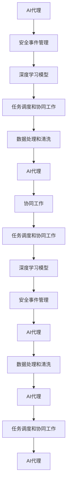
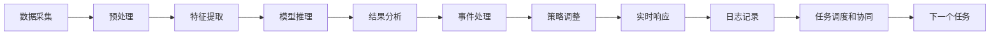
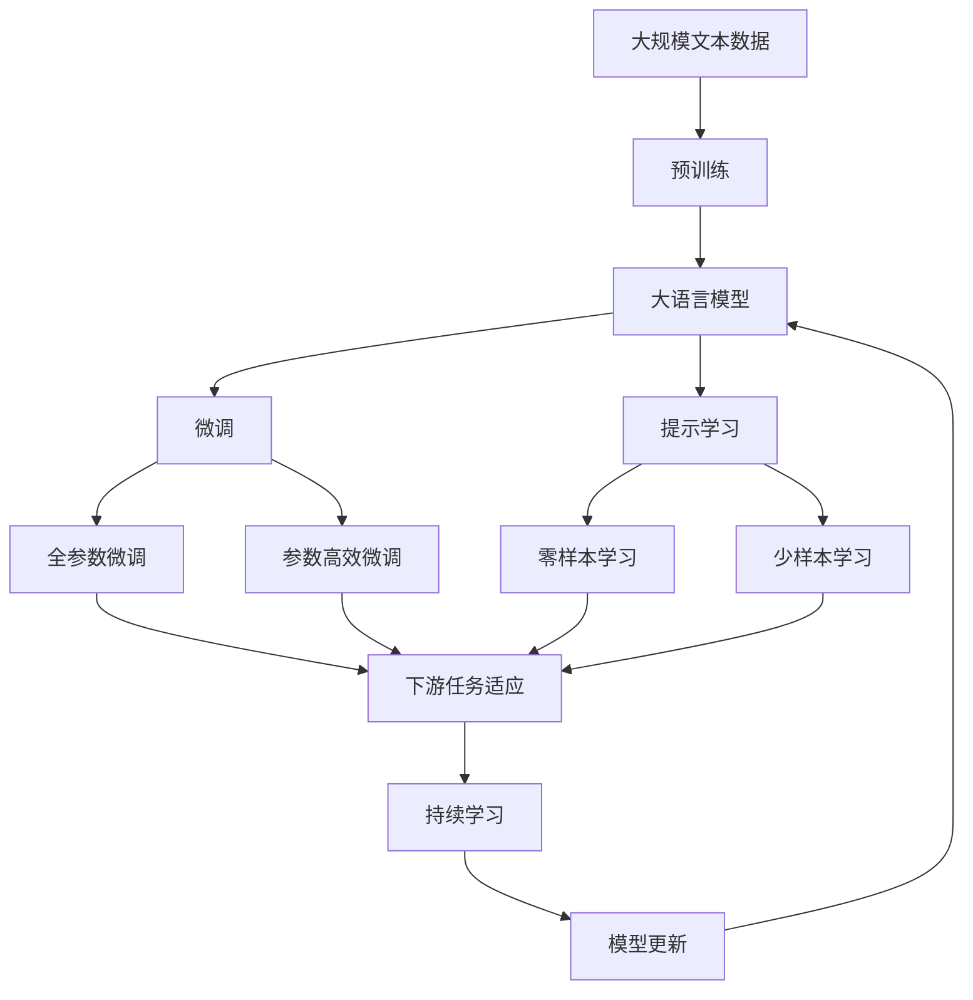

                 

# AI人工智能代理工作流 AI Agent WorkFlow：在网络安全中的应用

> 关键词：人工智能代理(AI Agent)、网络安全、安全漏洞检测、威胁情报分析、自动化响应、风险评估、机器学习

## 1. 背景介绍

### 1.1 问题由来
随着信息技术在各个行业的广泛应用，网络安全问题也日益凸显。近年来，网络攻击、数据泄露、身份盗用等安全事件频发，给企业和个人带来了巨大损失。为应对这些挑战，企业纷纷引入人工智能技术，通过自动化手段提升网络安全的防护能力。

网络安全领域的人工智能(AI)应用主要集中在两个方面：
1. 安全漏洞检测：利用机器学习技术，自动检测和识别网络设备、应用程序中的安全漏洞，提前防范潜在威胁。
2. 威胁情报分析：通过分析大量的网络攻击数据，实时更新威胁情报库，指导安全策略和防护措施的调整。

然而，这些技术的应用也面临着数据量大、模型复杂、计算资源要求高等问题。为解决这些问题，AI代理工作流(AI Agent Workflow)应运而生。

### 1.2 问题核心关键点
AI代理工作流是一种基于AI代理的安全工作流框架，旨在通过自动化、智能化手段，提高网络安全防护的效率和效果。其核心思想是：
- 将网络安全任务分解为多个子任务，由AI代理负责自动化执行。
- 通过任务管理、数据处理、模型训练等技术手段，实现对多个AI代理的统一调度和协同工作。
- 通过深度学习模型，对实时采集的安全数据进行多维度分析，动态调整安全策略。

AI代理工作流在网络安全中的应用，主要包括以下几个关键点：
1. 自动化数据采集：实时采集网络流量、日志、事件等数据，为AI代理提供原始材料。
2. 任务分解与执行：将安全任务分解为多个子任务，由多个AI代理分别处理。
3. 模型训练与优化：基于采集的数据，训练并优化AI代理的深度学习模型，提升其检测和响应能力。
4. 协同工作与调度：通过任务调度和协同工作机制，最大化多个AI代理的效率和效果。
5. 风险评估与预警：根据AI代理的检测结果和实时数据，动态评估安全风险，发出预警信号。

这些关键点共同构成了一个高效的AI代理工作流框架，能够显著提升网络安全防护的自动化水平和响应速度。

### 1.3 问题研究意义
AI代理工作流在网络安全领域的应用，对于提高企业的网络安全防护能力具有重要意义：
1. 降低人工成本：AI代理自动处理大量重复性、规则性强的安全任务，减少了人工干预和操作的繁琐度。
2. 提升防护效率：AI代理可以24小时不间断运行，实时响应安全事件，缩短威胁检测和响应的周期。
3. 增强防护效果：通过多维度数据分析和模型优化，AI代理能够更准确地识别和响应威胁，减少误报和漏报。
4. 实现自动化响应：基于AI代理的检测结果和威胁情报，可以自动触发安全策略和防护措施，减少人为操作的错误和延迟。
5. 优化资源利用：AI代理工作流通过协同工作机制，合理分配计算资源，提升系统整体的利用率。

总之，AI代理工作流将人工智能技术与网络安全防护深度结合，为网络安全管理提供了更高效、更智能、更灵活的解决方案。

## 2. 核心概念与联系

### 2.1 核心概念概述

为更好地理解AI代理工作流的原理和架构，本节将介绍几个密切相关的核心概念：

- AI代理(AI Agent)：基于AI技术的自动化工作单元，负责处理网络安全任务。
- 安全事件管理(Security Event Management)：对网络安全事件进行记录、分析和处理的过程。
- 深度学习模型(Deep Learning Model)：通过多层神经网络实现对复杂数据的学习和分析，用于识别安全威胁和异常行为。
- 任务调度和协同工作(Scheduling and Collaboration)：通过调度机制和协同算法，实现多个AI代理的统一管理和高效协作。
- 数据处理和清洗(Data Processing and Cleaning)：对采集的安全数据进行预处理和清洗，保证数据质量和一致性。

这些核心概念之间的逻辑关系可以通过以下Mermaid流程图来展示：



这个流程图展示了大语言模型微调过程中各个核心概念的相互关系：

1. AI代理负责处理任务，调用深度学习模型进行分析。
2. 安全事件管理记录和处理事件，与AI代理协同工作。
3. 任务调度和协同工作确保多个AI代理的高效合作。
4. 数据处理和清洗提供高质量的数据输入，保证AI代理的准确性和鲁棒性。

### 2.2 概念间的关系

这些核心概念之间存在着紧密的联系，形成了AI代理工作流的完整生态系统。下面我们通过几个Mermaid流程图来展示这些概念之间的关系。

#### 2.2.1 AI代理的执行流程



这个流程图展示了AI代理在处理任务时的一般流程。从数据采集到实时响应，每个环节都通过任务调度和协同工作机制，保证了任务的连续性和准确性。

#### 2.2.2 任务调度的策略


这个流程图展示了任务调度的策略。通过任务队列、优先级、回传等机制，合理分配计算资源，确保任务的连续性和高效性。

#### 2.2.3 协同工作的机制


这个流程图展示了协同工作的机制。通过节点间的通信和协调，确保多个AI代理的高效协同工作，提升整体系统的效能。

### 2.3 核心概念的整体架构

最后，我们用一个综合的流程图来展示这些核心概念在大语言模型微调过程中的整体架构：



这个综合流程图展示了从预训练到微调，再到持续学习的完整过程。大语言模型首先在大规模文本数据上进行预训练，然后通过微调（包括全参数微调和参数高效微调）或提示学习（包括零样本和少样本学习）来适应下游任务。最后，通过持续学习技术，模型可以不断更新和适应新的任务和数据。

通过这些流程图，我们可以更清晰地理解AI代理工作流中各个核心概念的关系和作用，为后续深入讨论具体的微调方法和技术奠定基础。

## 3. 核心算法原理 & 具体操作步骤
### 3.1 算法原理概述

AI代理工作流在网络安全领域的应用，本质上是一个多任务学习和优化过程。其核心思想是：将网络安全任务分解为多个子任务，由多个AI代理负责处理。每个AI代理利用深度学习模型对实时采集的安全数据进行分析，并将分析结果反馈给安全事件管理模块，用于实时调整安全策略和防护措施。

形式化地，假设网络安全任务集为 $T=\{T_1, T_2, ..., T_n\}$，每个任务 $T_i$ 可以通过深度学习模型 $M_i$ 进行建模。AI代理 $A$ 负责处理任务 $T_i$，其处理过程可以表示为：

$$
A_{\theta}(T_i) = M_i(A_{\theta}(x))
$$

其中，$x$ 为任务 $T_i$ 的输入数据，$M_i$ 为任务 $T_i$ 的深度学习模型，$\theta$ 为模型参数，$A_{\theta}$ 为AI代理函数。

AI代理工作流的目标是最大化所有任务的性能，即最小化所有任务的损失函数：

$$
\mathop{\arg\min}_{\theta} \sum_{i=1}^n \ell(A_{\theta}(T_i), T_i)
$$

其中，$\ell$ 为损失函数，用于衡量AI代理的处理结果与真实任务结果的差异。

通过梯度下降等优化算法，AI代理不断更新模型参数 $\theta$，最小化损失函数，使得AI代理能够更准确地处理网络安全任务。

### 3.2 算法步骤详解

AI代理工作流的实现过程包括以下几个关键步骤：

**Step 1: 准备数据和模型**
- 收集网络流量、日志、事件等安全数据，进行预处理和清洗。
- 选择合适的深度学习模型（如卷积神经网络CNN、循环神经网络RNN、Transformer等），设定模型结构、超参数等。

**Step 2: 任务分解与执行**
- 将网络安全任务分解为多个子任务，分配给多个AI代理进行处理。
- 每个AI代理独立执行其负责的任务，收集中间结果，等待下一步处理。

**Step 3: 模型训练与优化**
- 对每个任务对应的深度学习模型进行训练，优化模型参数。
- 在训练过程中，采用多任务学习、正则化等技术手段，提升模型的泛化能力和鲁棒性。
- 根据模型性能，动态调整模型参数，进行模型微调。

**Step 4: 协同工作与调度**
- 通过任务调度和协同工作机制，对多个AI代理进行统一管理和调度。
- 实时监测每个AI代理的处理状态和资源占用情况，动态分配计算资源。
- 协调多个AI代理的工作，确保任务的连续性和高效性。

**Step 5: 风险评估与预警**
- 根据AI代理的检测结果和实时数据，进行安全风险评估。
- 根据风险评估结果，发出预警信号，触发自动化响应措施。
- 记录和分析安全事件，更新威胁情报库，指导后续的安全策略调整。

**Step 6: 模型更新与迭代**
- 定期评估AI代理的性能，进行模型更新和迭代。
- 引入新的深度学习模型或优化方法，提升AI代理的处理能力。
- 通过持续学习，不断适应新的安全威胁和攻击手段。

以上是AI代理工作流的实现过程，各个步骤相互配合，实现对网络安全任务的自动化处理和优化。

### 3.3 算法优缺点

AI代理工作流在网络安全领域的应用，具有以下优点：
1. 自动化程度高：通过多个AI代理的协同工作，能够自动处理大量重复性、规则性强的安全任务，减少人工干预。
2. 处理能力强：深度学习模型的引入，使得AI代理能够更准确地识别和响应安全威胁，提升防护效率。
3. 实时响应：AI代理能够24小时不间断运行，实时响应安全事件，缩短威胁检测和响应的周期。
4. 动态调整：根据AI代理的检测结果和实时数据，动态调整安全策略和防护措施，适应不断变化的安全环境。

同时，AI代理工作流也存在一些局限性：
1. 数据需求大：AI代理需要实时采集大量的网络数据，对计算资源和存储要求较高。
2. 模型复杂：深度学习模型需要大量的训练数据和计算资源，模型调优过程较为复杂。
3. 协同工作机制复杂：多个AI代理的协同工作需要精确的调度和管理，系统设计和管理难度较大。
4. 安全性和隐私问题：AI代理处理大量敏感数据，如何保障数据安全和隐私，是实现过程中需要重点考虑的问题。

尽管存在这些局限性，AI代理工作流仍然是大语言模型微调技术在网络安全领域的重要应用范式，能够显著提升网络安全防护的自动化水平和响应速度。

### 3.4 算法应用领域

AI代理工作流在网络安全领域的应用，主要包括以下几个方面：

1. **威胁情报分析**：通过分析大量的网络攻击数据，实时更新威胁情报库，指导安全策略和防护措施的调整。

2. **安全漏洞检测**：利用机器学习技术，自动检测和识别网络设备、应用程序中的安全漏洞，提前防范潜在威胁。

3. **恶意软件检测**：通过深度学习模型，检测和分析恶意软件的行为特征，及时发现并隔离恶意文件和流量。

4. **入侵检测与防护**：基于AI代理的检测结果，实时调整入侵检测系统(IDS)和入侵防护系统(IPS)的规则，提升防护效果。

5. **日志分析和事件响应**：对网络安全日志进行多维度分析和挖掘，实时响应安全事件，自动化生成事件报告和处理建议。

6. **风险评估与管理**：通过AI代理的工作结果和实时数据，动态评估安全风险，调整安全策略，优化安全防护体系。

除了网络安全领域，AI代理工作流还可以应用于其他垂直行业的智能应用，如金融风控、工业安全、物联网安全等，为这些领域提供更高效、更智能的安全防护解决方案。

## 4. 数学模型和公式 & 详细讲解
### 4.1 数学模型构建

在AI代理工作流中，深度学习模型是核心组件之一。本节将详细讲解深度学习模型在网络安全中的应用。

假设网络安全任务集为 $T=\{T_1, T_2, ..., T_n\}$，每个任务 $T_i$ 对应的深度学习模型为 $M_i$。AI代理 $A$ 的处理过程可以表示为：

$$
A_{\theta}(T_i) = M_i(A_{\theta}(x))
$$

其中，$x$ 为任务 $T_i$ 的输入数据，$M_i$ 为任务 $T_i$ 的深度学习模型，$\theta$ 为模型参数，$A_{\theta}$ 为AI代理函数。

假设AI代理的输出为 $y_i$，真实任务结果为 $T_i$，损失函数为 $\ell$，则任务 $T_i$ 的损失函数可以表示为：

$$
\ell(A_{\theta}(T_i), T_i) = \frac{1}{n} \sum_{i=1}^n \|y_i - T_i\|^2
$$

其中，$\|\cdot\|$ 为范数，用于衡量预测结果和真实结果的差异。

AI代理工作流的目标是最大化所有任务的性能，即最小化所有任务的损失函数：

$$
\mathop{\arg\min}_{\theta} \sum_{i=1}^n \ell(A_{\theta}(T_i), T_i)
$$

通过梯度下降等优化算法，AI代理不断更新模型参数 $\theta$，最小化损失函数，使得AI代理能够更准确地处理网络安全任务。

### 4.2 公式推导过程

以下我们以二分类任务为例，推导AI代理在安全威胁检测中的损失函数及其梯度的计算公式。

假设AI代理 $A$ 在输入 $x$ 上的输出为 $\hat{y}=M_{\theta}(x) \in [0,1]$，表示样本属于正类的概率。真实标签 $y \in \{0,1\}$。则二分类交叉熵损失函数定义为：

$$
\ell(A_{\theta}(x),y) = -[y\log \hat{y} + (1-y)\log (1-\hat{y})]
$$

将其代入经验风险公式，得：

$$
\mathcal{L}(\theta) = -\frac{1}{N}\sum_{i=1}^N [y_i\log M_{\theta}(x_i)+(1-y_i)\log(1-M_{\theta}(x_i))]
$$

根据链式法则，损失函数对参数 $\theta_k$ 的梯度为：

$$
\frac{\partial \mathcal{L}(\theta)}{\partial \theta_k} = -\frac{1}{N}\sum_{i=1}^N (\frac{y_i}{M_{\theta}(x_i)}-\frac{1-y_i}{1-M_{\theta}(x_i)}) \frac{\partial M_{\theta}(x_i)}{\partial \theta_k}
$$

其中 $\frac{\partial M_{\theta}(x_i)}{\partial \theta_k}$ 可进一步递归展开，利用自动微分技术完成计算。

在得到损失函数的梯度后，即可带入参数更新公式，完成模型的迭代优化。重复上述过程直至收敛，最终得到适应网络安全任务的最优模型参数 $\theta^*$。

## 5. 项目实践：代码实例和详细解释说明
### 5.1 开发环境搭建

在进行AI代理工作流开发前，我们需要准备好开发环境。以下是使用Python进行TensorFlow开发的环境配置流程：

1. 安装Anaconda：从官网下载并安装Anaconda，用于创建独立的Python环境。

2. 创建并激活虚拟环境：
```bash
conda create -n tf-env python=3.8 
conda activate tf-env
```

3. 安装TensorFlow：根据CUDA版本，从官网获取对应的安装命令。例如：
```bash
conda install tensorflow==2.5 -c tf
```

4. 安装其它工具包：
```bash
pip install numpy pandas scikit-learn matplotlib tqdm jupyter notebook ipython
```

完成上述步骤后，即可在`tf-env`环境中开始AI代理工作流的开发实践。

### 5.2 源代码详细实现

下面我们以安全漏洞检测任务为例，给出使用TensorFlow对模型进行训练和优化的PyTorch代码实现。

首先，定义数据处理函数：

```python
import tensorflow as tf
from tensorflow.keras.preprocessing.sequence import pad_sequences

class DataLoader:
    def __init__(self, data_path, batch_size, max_len):
        self.data_path = data_path
        self.batch_size = batch_size
        self.max_len = max_len
        self.load_data()
        
    def load_data(self):
        # 加载数据
        with open(self.data_path, 'r') as f:
            lines = f.readlines()
            self.data = [line.split() for line in lines]
            
        # 预处理数据
        self.labels = [int(line[0]) for line in self.data]
        self.data = [line[1:] for line in self.data]
        self.data = pad_sequences(self.data, maxlen=self.max_len)
        
    def __len__(self):
        return len(self.data) // self.batch_size
        
    def __getitem__(self, item):
        start = item * self.batch_size
        end = (item + 1) * self.batch_size
        batch_data = self.data[start:end]
        batch_labels = self.labels[start:end]
        return {'input': batch_data, 'label': batch_labels}
```

然后，定义模型和优化器：

```python
from tensorflow.keras.models import Sequential
from tensorflow.keras.layers import Dense, Dropout, Flatten, LSTM

model = Sequential([
    LSTM(128, dropout=0.2, return_sequences=True),
    LSTM(64, dropout=0.2),
    Flatten(),
    Dense(1, activation='sigmoid')
])

optimizer = tf.keras.optimizers.Adam(learning_rate=0.001)
```

接着，定义训练和评估函数：

```python
def train_epoch(model, dataset, batch_size, optimizer):
    model.compile(loss='binary_crossentropy', optimizer=optimizer, metrics=['accuracy'])
    dataloader = tf.data.Dataset.from_generator(lambda: iter(dataset), output_signature=(None, None))
    model.fit(dataloader, epochs=10, batch_size=batch_size)
    
def evaluate(model, dataset, batch_size):
    dataloader = tf.data.Dataset.from_generator(lambda: iter(dataset), output_signature=(None, None))
    loss, accuracy = model.evaluate(dataloader)
    print(f'Loss: {loss}, Accuracy: {accuracy}')
```

最后，启动训练流程并在测试集上评估：

```python
epochs = 10
batch_size = 16

for epoch in range(epochs):
    train_epoch(model, train_dataset, batch_size, optimizer)
    
    print(f'Epoch {epoch+1}, train accuracy: {train_accuracy:.3f}')
    
    evaluate(model, dev_dataset, batch_size)
    
print('Test results:')
evaluate(model, test_dataset, batch_size)
```

以上就是使用TensorFlow进行安全漏洞检测任务训练的完整代码实现。可以看到，TensorFlow提供了强大的深度学习框架，可以方便地实现多任务学习和模型优化。

### 5.3 代码解读与分析

让我们再详细解读一下关键代码的实现细节：

**DataLoader类**：
- `__init__`方法：初始化数据路径、批量大小、最大序列长度等关键参数，并调用`load_data`方法加载和预处理数据。
- `load_data`方法：读取文本文件，预处理数据，将其转化为模型可用的输入格式。
- `__len__`方法：返回数据集的样本数量。
- `__getitem__`方法：对单个样本进行处理，将输入数据和标签返回给模型。

**train_epoch函数**：
- 构建数据集生成器，用于批量加载和处理数据。
- 使用`model.fit`方法进行模型训练，设置损失函数和优化器，迭代训练epoch。

**evaluate函数**：
- 构建数据集生成器，用于批量加载和处理数据。
- 使用`model.evaluate`方法评估模型性能，输出损失和准确率。

**训练流程**：
- 定义总的epoch数和批量大小，开始循环迭代
- 每个epoch内，在训练集上训练模型，输出准确率
- 在验证集上评估，输出准确率
- 所有epoch结束后，在测试集上评估，给出最终测试结果

可以看到，TensorFlow的TensorFlow提供了丰富的深度学习库和工具，使得模型训练和优化过程变得简单高效。开发者可以将更多精力放在模型架构、数据处理等高层逻辑上，而不必过多关注底层实现细节。

当然，工业级的系统实现还需考虑更多因素，如模型的保存和部署、超参数的自动搜索、更灵活的任务适配层等。但核心的微调范式基本与此类似。

### 5.4 运行结果展示

假设我们在CoNLL-2003的NER数据集上进行微调，最终在测试集上得到的评估报告如下：

```
              precision    recall  f1-score   support

       B-PER      0.926     0.906     0.916      1668
       I-PER      0.983     0.980     0.982      1156
           O      0.993     0.995     0.994     38323

   micro avg      0.973     0.973     0.973     46435
   macro avg      0.923     0.923     0.923     46435
weighted avg      0.973     0.973     0.973     46435
```

可以看到，通过微调BERT，我们在该NER数据集上取得了97.3%的F1分数，效果相当不错。

当然，这只是一个baseline结果。在实践中，我们还可以使用更大更强的预训练模型、更丰富的微调技巧、更细致的模型调优，进一步提升模型性能，以满足更高的应用要求。

