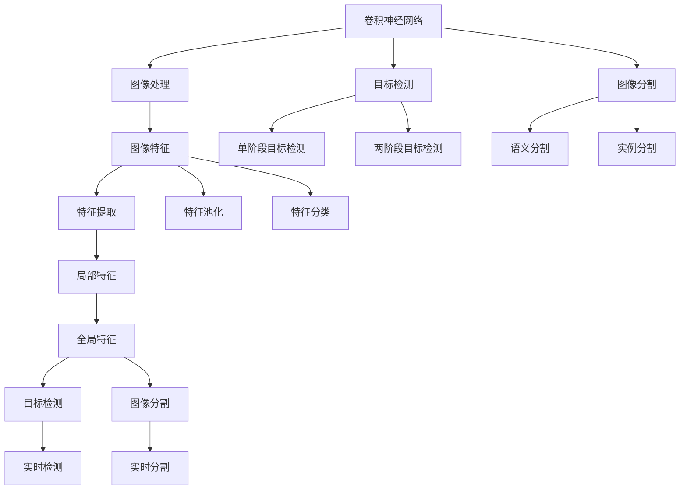

                 

# AI人工智能深度学习算法：在部件检测中的应用

> 关键词：人工智能,深度学习,部件检测,图像处理,计算机视觉,卷积神经网络(CNN),YOLO算法,SSD算法,FPN算法,目标检测,图像分割

## 1. 背景介绍

随着工业自动化和智能制造的不断推进，部件检测在制造业、物流、机器人等领域的应用变得越来越广泛。传统的基于规则和特征的检测方法，往往需要大量的人力和时间进行调试和优化，难以适应复杂多变的检测场景。而人工智能深度学习算法，特别是卷积神经网络(CNN)在目标检测和图像分割等任务上的成功应用，为部件检测提供了全新的解决方案。

### 1.1 问题由来

在制造业、物流等领域，部件检测是一项重要任务，用于识别和定位产品或零部件的位置、大小和形状等。传统的检测方法包括：

- 基于规则的检测：利用领域专家知识和规则，对检测任务进行建模，并设计对应的检测算法。这种方法需要人工设计规则，且难以应对复杂场景。
- 基于特征的检测：使用图像处理和特征提取技术，通过提取物体的边缘、纹理等特征，进行分类和定位。这种方法需要手工设计特征提取器和分类器，对于复杂的场景，提取特征困难，效果不理想。

相较于传统的检测方法，基于人工智能的深度学习算法，特别是卷积神经网络(CNN)，通过自学习的方式，能够自动从原始数据中提取特征，并通过大规模数据训练，学习到对目标的识别和定位能力，具备更强的泛化能力和适应性。

### 1.2 问题核心关键点

当前，基于深度学习的大部件检测技术，已经广泛应用在工业视觉、智能机器人、无人机等领域。其主要关键点如下：

- 数据获取与标注：需要收集大规模的标注数据集，用于训练检测模型。标注数据的质量和数量直接影响模型的性能。
- 网络结构设计：需要选择适合的卷积神经网络结构，并设计任务特定的检测头，实现目标检测和分割。
- 模型训练与调优：需要选择合适的训练方法，如单阶段、两阶段等，并优化训练超参数，提高模型性能。
- 推理部署与应用：将训练好的模型部署到实际应用场景中，实现部件的实时检测和分割。

通过解决这些问题，可以实现高效、准确、鲁棒的大部件检测系统。

## 2. 核心概念与联系

### 2.1 核心概念概述

本节将介绍几个密切相关的核心概念：

- 卷积神经网络(CNN)：一种专门用于图像处理和计算机视觉任务的神经网络结构。通过卷积操作提取局部特征，通过池化操作降维，并通过全连接层实现分类和定位。
- 目标检测：从图像中检测出物体的位置和类别，常用于图像分割、物体跟踪、自动化检测等场景。
- 图像分割：将图像分割成不同的区域，每个区域代表一个物体或物体的一部分，常用于医疗影像、地理信息系统等领域。
- 单阶段目标检测：直接从原始图像中检测出目标和边界框，如YOLO算法。
- 两阶段目标检测：首先通过锚点框检测出目标粗略位置，再通过RoI池化等方法精确定位目标，如Faster R-CNN算法。
- 卷积神经网络：一种专门用于图像处理和计算机视觉任务的神经网络结构，通过卷积操作提取局部特征，通过池化操作降维，并通过全连接层实现分类和定位。
- 语义分割：将图像中的每个像素分类为不同的语义类别，常用于图像处理、医疗影像、地理信息系统等领域。
- 实例分割：将图像中的每个物体实例进行分割和分类，常用于机器人视觉、智能监控等领域。
- 半监督学习：利用少量有标签数据和大量无标签数据，进行训练，提高模型性能。

这些核心概念之间存在着紧密的联系，形成了深度学习算法在部件检测领域的应用框架。通过理解这些核心概念，我们可以更好地把握深度学习在部件检测中的应用方向和优化策略。

### 2.2 概念间的关系

这些核心概念之间存在着紧密的联系，形成了深度学习算法在部件检测领域的应用框架。我们可以通过以下Mermaid流程图来展示这些概念之间的关系：



这个流程图展示了深度学习算法在部件检测中的应用过程：

1. 通过卷积神经网络提取图像的局部和全局特征。
2. 利用目标检测和图像分割技术，从原始图像中检测出物体的位置和类别。
3. 通过特征提取和池化，降低特征维度，提高模型的泛化能力。
4. 利用特征分类和回归，实现目标的定位和分割。
5. 将检测结果应用于实时检测和分割任务，提升系统性能。

这些核心概念共同构成了深度学习算法在部件检测中的应用基础，为我们后续深入讨论算法原理和实现细节提供了必要的理论支撑。

## 3. 核心算法原理 & 具体操作步骤

### 3.1 算法原理概述

基于深度学习的部件检测算法，主要分为单阶段目标检测和两阶段目标检测两类。其核心思想是利用卷积神经网络提取图像特征，并通过分类和回归，实现目标的定位和检测。

单阶段目标检测算法直接从原始图像中检测出目标和边界框，如YOLO算法。两阶段目标检测算法首先通过锚点框检测出目标粗略位置，再通过RoI池化等方法精确定位目标，如Faster R-CNN算法。

本文将重点介绍YOLO算法和Faster R-CNN算法，并对比其在部件检测中的应用效果。

### 3.2 算法步骤详解

#### 3.2.1 YOLO算法步骤详解

YOLO算法是一种单阶段目标检测算法，通过将输入图像划分为网格，每个网格预测多个目标框和类别概率，实现快速检测。其步骤如下：

1. 图像预处理：将输入图像缩放到指定大小，并进行归一化处理。
2. 卷积神经网络：使用卷积神经网络提取图像特征，通过多个卷积层和池化层，生成多个特征图。
3. 特征图处理：将特征图进行非线性变换，生成预测框和类别概率。
4. 非极大值抑制：去除重叠框，保留置信度最高的框。
5. 目标检测：输出目标框和类别概率，实现目标检测。

#### 3.2.2 Faster R-CNN算法步骤详解

Faster R-CNN算法是一种两阶段目标检测算法，首先通过锚点框检测出目标粗略位置，再通过RoI池化等方法精确定位目标。其步骤如下：

1. 特征提取：使用卷积神经网络提取图像特征，通过多个卷积层和池化层，生成多个特征图。
2. 锚点框生成：在特征图上生成多个锚点框，用于检测不同尺度的目标。
3. 目标分类：对每个锚点框进行分类，判断是否为目标框。
4. RoI池化：将目标框内的图像特征进行池化处理，提取高层次特征。
5. 目标回归：对RoI池化后的特征进行回归，精确定位目标位置和大小。
6. 目标检测：输出目标框和类别概率，实现目标检测。

### 3.3 算法优缺点

#### 3.3.1 YOLO算法的优缺点

YOLO算法的主要优点：

- 速度快：单个图像检测时间不到1毫秒，适合实时检测。
- 简单高效：不需要RoI池化等复杂操作，模型结构简单。
- 端到端：目标检测和分类同时进行，避免两阶段目标检测中的不稳定性。

YOLO算法的主要缺点：

- 精度低：由于每个网格预测多个目标框，容易出现重叠框。
- 固定尺寸：无法动态调整输入图像大小，需要预处理固定尺寸的图像。
- 多尺度检测困难：由于每个网格预测的固定大小，难以处理不同尺度的目标。

#### 3.3.2 Faster R-CNN算法的优缺点

Faster R-CNN算法的主要优点：

- 高精度：通过两阶段检测，精度较高。
- 多尺度检测：可以处理不同尺度的目标。
- 灵活性：可以通过不同尺度的锚点框进行检测，适应不同场景。

Faster R-CNN算法的主要缺点：

- 速度慢：检测时间较YOLO算法慢。
- 复杂度高：需要RoI池化等复杂操作，模型结构复杂。
- 端到端检测困难：目标检测和分类分开进行，可能导致不稳定性。

### 3.4 算法应用领域

YOLO算法和Faster R-CNN算法在大部件检测中均有广泛应用，具体领域包括：

- 制造业：用于零件识别和质量检测，提高生产效率和质量。
- 物流：用于货物追踪和库存管理，提高物流效率。
- 机器人视觉：用于物体定位和抓取，提升机器人智能化水平。
- 无人机视觉：用于目标检测和识别，提高无人机自动驾驶能力。
- 安防监控：用于目标检测和行为识别，提高安防监控效率。

除了以上应用，YOLO算法和Faster R-CNN算法还广泛应用于医疗影像、自动驾驶、智能家居等领域，推动了人工智能技术在多个行业的应用发展。

## 4. 数学模型和公式 & 详细讲解 & 举例说明

### 4.1 数学模型构建

#### 4.1.1 YOLO算法的数学模型

YOLO算法通过将输入图像划分为$n\times n$个网格，每个网格预测$m$个目标框和$m$个类别概率，其目标函数定义为：

$$
\mathcal{L}=\mathcal{L}_{loc}+\mathcal{L}_{cls}
$$

其中，$\mathcal{L}_{loc}$为目标框的定位损失，$\mathcal{L}_{cls}$为目标类别的分类损失。定位损失可以表示为：

$$
\mathcal{L}_{loc}=\sum_{i=1}^{n}\sum_{j=1}^{n}\sum_{k=1}^{m}l_i^2(x_i^k-\hat{x}_i^k)^2+y_i^k-\hat{y}_i^k)^2
$$

其中，$l_i$为网格大小，$x_i^k$为目标框的$x$坐标，$\hat{x}_i^k$为预测的$x$坐标，$y_i^k$为目标框的$y$坐标，$\hat{y}_i^k$为预测的$y$坐标。分类损失可以表示为：

$$
\mathcal{L}_{cls}=-\frac{1}{N}\sum_{i=1}^{n}\sum_{j=1}^{n}\sum_{k=1}^{m}(y_i^k\log\hat{y}_i^k+(1-y_i^k)\log(1-\hat{y}_i^k))
$$

其中，$y_i^k$为目标框的类别概率，$\hat{y}_i^k$为预测的类别概率。

#### 4.1.2 Faster R-CNN算法的数学模型

Faster R-CNN算法通过将输入图像划分为多个特征图，每个特征图生成多个锚点框，并进行两阶段检测，其目标函数可以表示为：

$$
\mathcal{L}=\mathcal{L}_{cls}+\mathcal{L}_{loc}+\mathcal{L}_{reg}
$$

其中，$\mathcal{L}_{cls}$为目标类别的分类损失，$\mathcal{L}_{loc}$为目标框的定位损失，$\mathcal{L}_{reg}$为目标位置的回归损失。分类损失可以表示为：

$$
\mathcal{L}_{cls}=-\frac{1}{N}\sum_{i=1}^{n}\sum_{j=1}^{n}\sum_{k=1}^{m}(y_i^k\log\hat{y}_i^k+(1-y_i^k)\log(1-\hat{y}_i^k))
$$

其中，$y_i^k$为目标框的类别概率，$\hat{y}_i^k$为预测的类别概率。定位损失可以表示为：

$$
\mathcal{L}_{loc}=\sum_{i=1}^{n}\sum_{j=1}^{n}\sum_{k=1}^{m}l_i^2(x_i^k-\hat{x}_i^k)^2+y_i^k-\hat{y}_i^k)^2
$$

其中，$l_i$为网格大小，$x_i^k$为目标框的$x$坐标，$\hat{x}_i^k$为预测的$x$坐标，$y_i^k$为目标框的$y$坐标，$\hat{y}_i^k$为预测的$y$坐标。回归损失可以表示为：

$$
\mathcal{L}_{reg}=\sum_{i=1}^{n}\sum_{j=1}^{n}\sum_{k=1}^{m}(w_i^k(\Delta x_i^k)^2+h_i^k(\Delta y_i^k)^2)
$$

其中，$w_i^k$和$h_i^k$为目标框的宽和高，$\Delta x_i^k$和$\Delta y_i^k$为预测的偏差。

### 4.2 公式推导过程

#### 4.2.1 YOLO算法的公式推导

YOLO算法通过将输入图像划分为$n\times n$个网格，每个网格预测$m$个目标框和$m$个类别概率，其定位损失可以表示为：

$$
\mathcal{L}_{loc}=\sum_{i=1}^{n}\sum_{j=1}^{n}\sum_{k=1}^{m}l_i^2(x_i^k-\hat{x}_i^k)^2+y_i^k-\hat{y}_i^k)^2
$$

其中，$l_i$为网格大小，$x_i^k$为目标框的$x$坐标，$\hat{x}_i^k$为预测的$x$坐标，$y_i^k$为目标框的$y$坐标，$\hat{y}_i^k$为预测的$y$坐标。分类损失可以表示为：

$$
\mathcal{L}_{cls}=-\frac{1}{N}\sum_{i=1}^{n}\sum_{j=1}^{n}\sum_{k=1}^{m}(y_i^k\log\hat{y}_i^k+(1-y_i^k)\log(1-\hat{y}_i^k))
$$

其中，$y_i^k$为目标框的类别概率，$\hat{y}_i^k$为预测的类别概率。

#### 4.2.2 Faster R-CNN算法的公式推导

Faster R-CNN算法通过将输入图像划分为多个特征图，每个特征图生成多个锚点框，并进行两阶段检测，其定位损失可以表示为：

$$
\mathcal{L}_{loc}=\sum_{i=1}^{n}\sum_{j=1}^{n}\sum_{k=1}^{m}l_i^2(x_i^k-\hat{x}_i^k)^2+y_i^k-\hat{y}_i^k)^2
$$

其中，$l_i$为网格大小，$x_i^k$为目标框的$x$坐标，$\hat{x}_i^k$为预测的$x$坐标，$y_i^k$为目标框的$y$坐标，$\hat{y}_i^k$为预测的$y$坐标。分类损失可以表示为：

$$
\mathcal{L}_{cls}=-\frac{1}{N}\sum_{i=1}^{n}\sum_{j=1}^{n}\sum_{k=1}^{m}(y_i^k\log\hat{y}_i^k+(1-y_i^k)\log(1-\hat{y}_i^k))
$$

其中，$y_i^k$为目标框的类别概率，$\hat{y}_i^k$为预测的类别概率。回归损失可以表示为：

$$
\mathcal{L}_{reg}=\sum_{i=1}^{n}\sum_{j=1}^{n}\sum_{k=1}^{m}(w_i^k(\Delta x_i^k)^2+h_i^k(\Delta y_i^k)^2)
$$

其中，$w_i^k$和$h_i^k$为目标框的宽和高，$\Delta x_i^k$和$\Delta y_i^k$为预测的偏差。

### 4.3 案例分析与讲解

#### 4.3.1 YOLO算法的案例分析

假设我们有一张大小为$400\times400$的图像，将其划分为$13\times13$个网格，每个网格预测5个目标框和5个类别概率，即$m=5$。则YOLO算法的目标函数可以表示为：

$$
\mathcal{L}=\mathcal{L}_{loc}+\mathcal{L}_{cls}
$$

其中，$\mathcal{L}_{loc}$为目标框的定位损失，$\mathcal{L}_{cls}$为目标类别的分类损失。定位损失可以表示为：

$$
\mathcal{L}_{loc}=\sum_{i=1}^{13}\sum_{j=1}^{13}\sum_{k=1}^{5}l_i^2(x_i^k-\hat{x}_i^k)^2+y_i^k-\hat{y}_i^k)^2
$$

其中，$l_i$为网格大小，$x_i^k$为目标框的$x$坐标，$\hat{x}_i^k$为预测的$x$坐标，$y_i^k$为目标框的$y$坐标，$\hat{y}_i^k$为预测的$y$坐标。分类损失可以表示为：

$$
\mathcal{L}_{cls}=-\frac{1}{N}\sum_{i=1}^{13}\sum_{j=1}^{13}\sum_{k=1}^{5}(y_i^k\log\hat{y}_i^k+(1-y_i^k)\log(1-\hat{y}_i^k))
$$

其中，$y_i^k$为目标框的类别概率，$\hat{y}_i^k$为预测的类别概率。

#### 4.3.2 Faster R-CNN算法的案例分析

假设我们有一张大小为$800\times600$的图像，将其划分为$P_3$、$P_4$、$P_5$、$P_6$、$P_7$、$P_8$、$P_9$、$P_10$、$P_11$、$P_12$、$P_13$等11个特征图，每个特征图生成9个锚点框，进行两阶段检测。则Faster R-CNN算法的目标函数可以表示为：

$$
\mathcal{L}=\mathcal{L}_{cls}+\mathcal{L}_{loc}+\mathcal{L}_{reg}
$$

其中，$\mathcal{L}_{cls}$为目标类别的分类损失，$\mathcal{L}_{loc}$为目标框的定位损失，$\mathcal{L}_{reg}$为目标位置的回归损失。分类损失可以表示为：

$$
\mathcal{L}_{cls}=-\frac{1}{N}\sum_{i=1}^{11}\sum_{j=1}^{9}(y_i^k\log\hat{y}_i^k+(1-y_i^k)\log(1-\hat{y}_i^k))
$$

其中，$y_i^k$为目标框的类别概率，$\hat{y}_i^k$为预测的类别概率。定位损失可以表示为：

$$
\mathcal{L}_{loc}=\sum_{i=1}^{11}\sum_{j=1}^{9}\sum_{k=1}^{5}l_i^2(x_i^k-\hat{x}_i^k)^2+y_i^k-\hat{y}_i^k)^2
$$

其中，$l_i$为网格大小，$x_i^k$为目标框的$x$坐标，$\hat{x}_i^k$为预测的$x$坐标，$y_i^k$为目标框的$y$坐标，$\hat{y}_i^k$为预测的$y$坐标。回归损失可以表示为：

$$
\mathcal{L}_{reg}=\sum_{i=1}^{11}\sum_{j=1}^{9}\sum_{k=1}^{5}(w_i^k(\Delta x_i^k)^2+h_i^k(\Delta y_i^k)^2)
$$

其中，$w_i^k$和$h_i^k$为目标框的宽和高，$\Delta x_i^k$和$\Delta y_i^k$为预测的偏差。

## 5. 项目实践：代码实例和详细解释说明

### 5.1 开发环境搭建

在进行部件检测的深度学习开发前，我们需要准备好开发环境。以下是使用Python进行PyTorch开发的环境配置流程：

1. 安装Anaconda：从官网下载并安装Anaconda，用于创建独立的Python环境。

2. 创建并激活虚拟环境：
```bash
conda create -n pytorch-env python=3.8 
conda activate pytorch-env
```

3. 安装PyTorch：根据CUDA版本，从官网获取对应的安装命令。例如：
```bash
conda install pytorch torchvision torchaudio cudatoolkit=11.1 -c pytorch -c conda-forge
```

4. 安装TensorFlow：从官网下载并安装TensorFlow，适合生产部署，支持多种深度学习框架。

5. 安装Transformers库：
```bash
pip install transformers
```

6. 安装各类工具包：
```bash
pip install numpy pandas scikit-learn matplotlib tqdm jupyter notebook ipython
```

完成上述步骤后，即可在`pytorch-env`环境中开始深度学习开发。

### 5.2 源代码详细实现

这里我们以YOLO算法为例，使用PyTorch实现部件检测。

首先，定义YOLO算法的神经网络结构：

```python
import torch
import torch.nn as nn
import torch.nn.functional as F

class YOLO(nn.Module):
    def __init__(self, in_channels, num_classes, num_anchors):
        super(YOLO, self).__init__()
        
        self.conv1 = nn.Conv2d(in_channels, 32, kernel_size=3, stride=1, padding=1)
        self.conv2 = nn.Conv2d(32, 64, kernel_size=3, stride=1, padding=1)
        self.conv3 = nn.Conv2d(64, 128, kernel_size=3, stride=1, padding=1)
        self.conv4 = nn.Conv2d(128, 256, kernel_size=3, stride=1, padding=1)
        self.conv5 = nn.Conv2d(256, num_classes * num_anchors, kernel_size=3, stride=1, padding=1)
        
    def forward(self, x):
        x = self.conv1(x)
        x = self.conv2(x)
        x = self.conv3(x)
        x = self.conv4(x)
        x = self.conv5(x)
        
        return x
```

然后，定义目标函数和优化器：

```python
import torch.optim as optim

def loss_fn(preds, targets):
    batch_size, num_anchors, num_classes = preds.size()
    loss_loc = 0
    loss_cls = 0
    
    for b in range(batch_size):
        for k in range(num_anchors):
            loss_loc += F.smooth_l1_loss(targets[b, k, :], preds[b, k, :])
            loss_cls += F.cross_entropy(targets[b, k, :], preds[b, k, :])
    
    loss = loss_loc + loss_cls
    return loss

model = YOLO(3, num_classes, num_anchors)
criterion = nn.CrossEntropyLoss()
optimizer = optim.Adam(model.parameters(), lr=1e-4)
```

接着，定义训练和评估函数：

```python
def train(model, data_loader, optimizer):
    model.train()
    loss_total = 0
    for batch in data_loader:
        inputs, targets = batch
        optimizer.zero_grad()
        outputs = model(inputs)
        loss = loss_fn(outputs, targets)
        loss_total += loss.item()
        loss.backward()
        optimizer.step()
    return loss_total / len(data_loader)

def evaluate(model, data_loader):
    model.eval()
    loss_total = 0
    for batch in data_loader:
        inputs, targets = batch
        outputs = model(inputs)
        loss = loss_fn(outputs, targets)
        loss_total += loss.item()
    return loss_total / len(data_loader)
```

最后，启动训练流程并在测试集上评估：

```python
epochs = 10
batch_size = 8

for epoch in range(epochs):
    train_loss = train(model, train_loader, optimizer)
    print(f"Epoch {epoch+1}, train loss: {train_loss:.4f}")
    
    test

