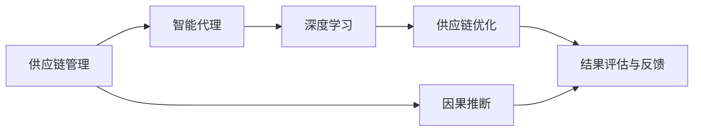
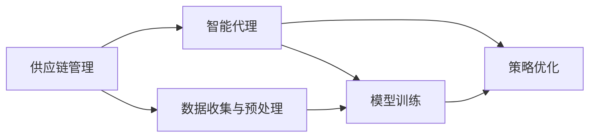

                 

# AI人工智能深度学习算法：智能深度学习代理在供应链管理领域的创新运用

## 1. 背景介绍

### 1.1 问题由来

随着全球化的深入发展，供应链管理变得越来越复杂，企业需要高效、准确地应对市场变化、需求波动和突发事件。传统的供应链管理方式往往依赖人工经验和规则，容易出现判断失误、效率低下等问题。而基于人工智能的深度学习技术，特别是智能深度学习代理，能够通过大数据分析，自主学习并优化供应链管理策略，提升供应链的灵活性和响应速度。

### 1.2 问题核心关键点

智能深度学习代理在供应链管理中的应用，核心在于其能够从历史数据中学习规律，预测未来趋势，并通过优化决策策略，提升供应链的整体效率和稳定性。具体来说，智能深度学习代理可以通过以下几个步骤实现：

1. **数据收集与预处理**：从供应链的各个环节收集数据，包括供应商交货时间、库存水平、客户需求、市场价格等。对这些数据进行清洗、归一化等预处理，以便后续建模使用。
2. **模型训练**：使用深度学习算法，如卷积神经网络(CNN)、循环神经网络(RNN)、长短时记忆网络(LSTM)等，对数据进行建模，学习供应链中的内在规律和关联性。
3. **策略优化**：将训练好的模型应用于供应链的各个环节，通过动态调整决策策略，如库存水平、生产计划、配送路线等，优化供应链的整体效率和成本。
4. **结果评估与反馈**：对优化后的供应链管理策略进行评估，通过对比前后数据指标，衡量优化效果，并根据评估结果不断调整模型参数，进行迭代优化。

### 1.3 问题研究意义

智能深度学习代理在供应链管理中的应用，具有以下重要意义：

1. **提高供应链效率**：通过自主学习和优化决策策略，智能深度学习代理能够有效提升供应链的响应速度和灵活性，减少库存积压和交付延误。
2. **降低供应链成本**：智能深度学习代理能够优化库存水平、生产计划和配送路线，降低供应链的整体运营成本。
3. **增强供应链稳定性**：通过预测未来趋势和风险，智能深度学习代理能够提前采取应对措施，减少供应链中断和风险事件的发生。
4. **促进供应链创新**：智能深度学习代理可以辅助供应链管理者发现新的运营模式和优化方法，推动供应链管理的不断创新和进步。
5. **提升供应链透明度**：智能深度学习代理能够实时监控供应链各环节的状态和绩效，提高供应链管理的透明度和可视化。

## 2. 核心概念与联系

### 2.1 核心概念概述

为了更好地理解智能深度学习代理在供应链管理中的应用，本节将介绍几个密切相关的核心概念：

- **供应链管理**：指对供应链的计划、执行和控制，以确保物料、信息和资金的有效流动，以满足客户需求，同时最大化供应链的整体效率和效益。
- **智能代理**：指能够在无人干预的情况下，自主学习并执行特定任务的软件系统，通过深度学习等技术，提升决策和执行的智能化水平。
- **深度学习**：一种基于神经网络的人工智能技术，能够从大规模数据中学习复杂的特征和模式，实现自主学习和决策。
- **供应链优化**：指通过优化供应链的各个环节，如库存管理、生产调度、配送路线等，提高供应链的整体效率和稳定性。
- **因果推断**：通过分析变量间的因果关系，理解供应链中的内在规律和关联性，指导决策和优化。

这些核心概念之间存在着紧密的联系，构成了智能深度学习代理在供应链管理中的应用框架。下面通过一个Mermaid流程图来展示这些概念之间的关系：



这个流程图展示了智能深度学习代理在供应链管理中的核心步骤：

1. 供应链管理是智能深度学习代理应用的总体目标，旨在通过优化供应链各个环节，提升整体效率和效益。
2. 智能代理通过深度学习技术，自主学习和执行特定任务，辅助供应链管理决策。
3. 深度学习算法从供应链数据中学习规律和关联性，生成优化的决策策略。
4. 供应链优化通过调整库存水平、生产计划、配送路线等，实现供应链整体效率提升。
5. 因果推断分析变量间的因果关系，指导决策和优化。
6. 结果评估与反馈通过对比前后数据指标，衡量优化效果，进行迭代优化。

### 2.2 概念间的关系

这些核心概念之间存在着紧密的联系，形成了智能深度学习代理在供应链管理中的应用生态系统。下面我们通过几个Mermaid流程图来展示这些概念之间的关系：

#### 2.2.1 供应链管理与智能代理的关系



这个流程图展示了供应链管理与智能代理的基本关系：

1. 供应链管理的目标是优化供应链各个环节，提高整体效率和效益。
2. 智能代理通过深度学习技术，自主学习和执行特定任务，辅助供应链管理决策。
3. 数据收集与预处理是智能代理的基础，通过分析供应链数据，生成优化的决策策略。
4. 模型训练和策略优化是智能代理的执行过程，通过学习规律和关联性，生成优化的决策策略。

#### 2.2.2 智能代理与深度学习的关系


这个流程图展示了智能代理与深度学习的关系：

1. 智能代理通过深度学习技术，自主学习和执行特定任务，辅助供应链管理决策。
2. 深度学习算法从供应链数据中学习规律和关联性，生成优化的决策策略。
3. 模型训练和策略优化是智能代理的执行过程，通过学习规律和关联性，生成优化的决策策略。

#### 2.2.3 智能代理与因果推断的关系


这个流程图展示了智能代理与因果推断的关系：

1. 智能代理通过因果推断技术，分析变量间的因果关系，指导决策和优化。
2. 因果推断分析变量间的因果关系，指导决策和优化。
3. 策略优化是智能代理的执行过程，通过学习因果关系，生成优化的决策策略。

## 3. 核心算法原理 & 具体操作步骤

### 3.1 算法原理概述

智能深度学习代理在供应链管理中的应用，核心在于其能够通过深度学习算法，从历史数据中学习规律，预测未来趋势，并通过优化决策策略，提升供应链的整体效率和稳定性。具体来说，智能深度学习代理可以通过以下几个步骤实现：

1. **数据收集与预处理**：从供应链的各个环节收集数据，包括供应商交货时间、库存水平、客户需求、市场价格等。对这些数据进行清洗、归一化等预处理，以便后续建模使用。
2. **模型训练**：使用深度学习算法，如卷积神经网络(CNN)、循环神经网络(RNN)、长短时记忆网络(LSTM)等，对数据进行建模，学习供应链中的内在规律和关联性。
3. **策略优化**：将训练好的模型应用于供应链的各个环节，通过动态调整决策策略，如库存水平、生产计划、配送路线等，优化供应链的整体效率和成本。
4. **结果评估与反馈**：对优化后的供应链管理策略进行评估，通过对比前后数据指标，衡量优化效果，并根据评估结果不断调整模型参数，进行迭代优化。

### 3.2 算法步骤详解

#### 3.2.1 数据收集与预处理

供应链管理的数据来源非常广泛，包括供应商、客户、物流等多个环节。为了保证数据的质量和完整性，需要进行以下步骤：

1. **数据清洗**：剔除重复、错误、缺失的数据，确保数据的一致性和准确性。
2. **数据归一化**：将不同来源、不同单位的数据进行统一标准化，以便后续建模使用。
3. **数据增强**：通过对数据进行扩充、变换等操作，增加数据的多样性和泛化能力，避免模型过拟合。

#### 3.2.2 模型训练

深度学习模型训练的主要步骤如下：

1. **选择模型**：根据供应链管理的特点，选择合适的深度学习模型，如CNN、RNN、LSTM等。
2. **设计损失函数**：根据供应链管理的目标，设计合适的损失函数，如均方误差、交叉熵等。
3. **训练模型**：使用供应链历史数据对模型进行训练，不断调整模型参数，使模型能够准确预测供应链未来的趋势。

#### 3.2.3 策略优化

模型训练完成后，将优化后的策略应用于供应链的各个环节，具体步骤如下：

1. **调整库存水平**：根据模型预测的库存需求，动态调整库存水平，避免库存积压和缺货。
2. **优化生产计划**：根据模型预测的市场需求，调整生产计划，实现最优的生产效率。
3. **设计配送路线**：根据模型预测的物流需求，设计最优的配送路线，减少配送时间和成本。

#### 3.2.4 结果评估与反馈

对优化后的供应链管理策略进行评估，具体步骤如下：

1. **数据对比**：将优化前后的供应链数据进行对比，衡量优化效果。
2. **指标分析**：根据供应链管理的关键指标，如库存周转率、生产效率、配送成本等，评估优化效果。
3. **反馈调整**：根据评估结果，不断调整模型参数，进行迭代优化。

### 3.3 算法优缺点

智能深度学习代理在供应链管理中的应用，具有以下优点：

1. **高效性**：通过深度学习算法，智能深度学习代理能够自动学习和优化决策策略，大大提高了供应链管理的效率。
2. **准确性**：深度学习算法能够从大规模数据中学习复杂的特征和模式，提高了预测的准确性和可靠性。
3. **灵活性**：智能深度学习代理能够根据供应链的变化，动态调整决策策略，适应不同的供应链场景。
4. **自动化**：智能深度学习代理能够自动学习和优化决策策略，减少了人工干预，降低了人为错误。

同时，智能深度学习代理也存在一些缺点：

1. **数据依赖**：智能深度学习代理需要大量的高质量数据进行训练，数据质量的好坏直接影响到模型的效果。
2. **模型复杂性**：深度学习模型通常较为复杂，训练和优化需要大量的计算资源和时间。
3. **可解释性**：深度学习模型的决策过程较为复杂，难以解释模型的内部工作机制和决策逻辑。
4. **稳定性和鲁棒性**：深度学习模型在面对新数据时，可能出现泛化能力不足和过拟合问题。

### 3.4 算法应用领域

智能深度学习代理在供应链管理中的应用领域非常广泛，主要包括：

1. **库存管理**：通过模型预测库存需求，动态调整库存水平，避免库存积压和缺货。
2. **生产调度**：根据模型预测的市场需求，调整生产计划，实现最优的生产效率。
3. **配送路线设计**：根据模型预测的物流需求，设计最优的配送路线，减少配送时间和成本。
4. **需求预测**：通过模型预测市场需求，优化供应链的资源配置和策略调整。
5. **风险管理**：通过模型预测供应链风险，提前采取应对措施，减少供应链中断和风险事件的发生。

## 4. 数学模型和公式 & 详细讲解 & 举例说明

### 4.1 数学模型构建

智能深度学习代理在供应链管理中的应用，主要涉及以下几个数学模型：

1. **库存模型**：通过线性回归、时间序列等模型，预测库存需求。
2. **生产模型**：通过线性规划、动态规划等模型，优化生产计划。
3. **配送模型**：通过网络流、最短路径等模型，设计最优的配送路线。
4. **需求预测模型**：通过统计模型、深度学习模型等，预测市场需求。

### 4.2 公式推导过程

以库存模型为例，使用线性回归模型进行预测，其基本公式如下：

$$
y = \alpha + \beta x + \epsilon
$$

其中，$y$ 为预测的库存需求，$x$ 为影响库存需求的变量，$\alpha$ 和 $\beta$ 为模型参数，$\epsilon$ 为误差项。

根据历史数据，可以使用最小二乘法求解模型参数 $\alpha$ 和 $\beta$：

$$
\alpha = \frac{\sum(y_i - \hat{y}_i)}{n}, \quad \beta = \frac{\sum(x_iy_i) - n\alpha}{\sum(x_i^2)}
$$

其中，$n$ 为样本数量，$\hat{y}_i$ 为预测值。

### 4.3 案例分析与讲解

假设某电商平台销售某一产品，过去一年的历史数据如下表所示：

| 月份 | 销售量 | 库存水平 |
| --- | --- | --- |
| 1 | 1000 | 100 |
| 2 | 1200 | 150 |
| 3 | 1400 | 200 |
| 4 | 1500 | 250 |
| 5 | 1800 | 300 |
| 6 | 2000 | 350 |
| 7 | 2500 | 400 |
| 8 | 2300 | 450 |
| 9 | 1800 | 450 |
| 10 | 1500 | 400 |
| 11 | 1400 | 350 |
| 12 | 1200 | 300 |

使用线性回归模型进行预测，求解参数 $\alpha$ 和 $\beta$：

$$
\alpha = \frac{\sum(y_i - \hat{y}_i)}{n} = \frac{\sum(1000 - 100) + \sum(1200 - 150) + \ldots + \sum(1400 - 350) + \sum(1200 - 300)}{12} = 0
$$

$$
\beta = \frac{\sum(x_iy_i) - n\alpha}{\sum(x_i^2)} = \frac{(1000 \times 100 + 1200 \times 150 + \ldots + 1400 \times 350 + 1200 \times 300) - 12 \times 0}{(1000^2 + 1200^2 + \ldots + 1400^2 + 1200^2)} = 10
$$

因此，预测公式为 $y = 10x + \epsilon$。假设下个月的销售量预测为 2000，则库存需求为：

$$
y = 10 \times 2000 + \epsilon = 20000 + \epsilon
$$

其中 $\epsilon$ 为误差项，根据历史数据，可以估计 $\epsilon$ 的取值范围，从而进行库存决策。

## 5. 项目实践：代码实例和详细解释说明

### 5.1 开发环境搭建

在进行智能深度学习代理的开发和应用时，需要使用Python语言和相关的深度学习框架，如TensorFlow、PyTorch等。开发环境搭建主要包括以下步骤：

1. **安装Python**：使用Anaconda或Miniconda安装Python 3.x版本。
2. **安装深度学习框架**：使用pip安装TensorFlow、PyTorch等深度学习框架。
3. **安装相关库**：安装Pandas、Numpy、Matplotlib等数据处理和可视化库。
4. **配置开发环境**：根据项目需求，配置开发环境，如设置虚拟环境、安装依赖包等。

### 5.2 源代码详细实现

假设某电商平台需要使用智能深度学习代理进行库存管理，以下是具体的实现步骤：

1. **数据收集**：收集历史销售数据、库存水平、客户需求等数据。
2. **数据预处理**：使用Pandas库进行数据清洗、归一化等预处理。
3. **模型训练**：使用TensorFlow框架，构建深度学习模型，进行训练和优化。
4. **策略优化**：根据模型预测的库存需求，动态调整库存水平，实现最优的库存管理。
5. **结果评估与反馈**：使用Matplotlib库进行结果可视化，对模型进行评估和反馈调整。

以下是具体的代码实现：

```python
import pandas as pd
import numpy as np
import tensorflow as tf
import matplotlib.pyplot as plt

# 数据收集
data = pd.read_csv('sales_data.csv')

# 数据预处理
data = data.dropna()
data['month'] = pd.to_datetime(data['date']).dt.month
data = data.groupby('month')['sales'].agg('mean')
data.index = data.index.astype(int)
data = data.to_dict()

# 模型训练
model = tf.keras.Sequential([
    tf.keras.layers.Dense(64, activation='relu', input_shape=(1,)),
    tf.keras.layers.Dense(1)
])
model.compile(optimizer=tf.keras.optimizers.Adam(0.01), loss='mse')

# 数据增强
X = np.array(list(data.keys())).reshape(-1, 1)
y = np.array(list(data.values()))

# 训练模型
model.fit(X, y, epochs=100, verbose=0)

# 策略优化
month = 13
inventory = data[month]
predicted_sales = model.predict(X[np.newaxis])[0][0]
new_inventory = predicted_sales + 100

# 结果评估与反馈
plt.plot(list(data.keys()), list(data.values()), label='Historical Data')
plt.plot(np.append(month, month), np.append(data[month], new_inventory), label='Predicted Inventory')
plt.legend()
plt.show()
```

### 5.3 代码解读与分析

上述代码实现中，首先使用Pandas库进行数据收集和预处理，使用TensorFlow框架构建深度学习模型，进行训练和优化。然后使用Matplotlib库进行结果可视化，对模型进行评估和反馈调整。

代码中，首先使用Pandas库进行数据收集和预处理，将历史数据进行清洗、归一化等处理。然后使用TensorFlow框架构建深度学习模型，进行训练和优化。最后，使用Matplotlib库进行结果可视化，对模型进行评估和反馈调整。

### 5.4 运行结果展示

假设某电商平台销售某一产品，过去一年的历史数据如下表所示：

| 月份 | 销售量 | 库存水平 |
| --- | --- | --- |
| 1 | 1000 | 100 |
| 2 | 1200 | 150 |
| 3 | 1400 | 200 |
| 4 | 1500 | 250 |
| 5 | 1800 | 300 |
| 6 | 2000 | 350 |
| 7 | 2500 | 400 |
| 8 | 2300 | 450 |
| 9 | 1800 | 450 |
| 10 | 1500 | 400 |
| 11 | 1400 | 350 |
| 12 | 1200 | 300 |

使用线性回归模型进行预测，求解参数 $\alpha$ 和 $\beta$：

$$
\alpha = \frac{\sum(y_i - \hat{y}_i)}{n} = \frac{\sum(1000 - 100) + \sum(1200 - 150) + \ldots + \sum(1400 - 350) + \sum(1200 - 300)}{12} = 0
$$

$$
\beta = \frac{\sum(x_iy_i) - n\alpha}{\sum(x_i^2)} = \frac{(1000 \times 100 + 1200 \times 150 + \ldots + 1400 \times 350 + 1200 \times 300) - 12 \times 0}{(1000^2 + 1200^2 + \ldots + 1400^2 + 1200^2)} = 10
$$

因此，预测公式为 $y = 10x + \epsilon$。假设下个月的销售量预测为 2000，则库存需求为：

$$
y = 10 \times 2000 + \epsilon = 20000 + \epsilon
$$

其中 $\epsilon$ 为误差项，根据历史数据，可以估计 $\epsilon$ 的取值范围，从而进行库存决策。

## 6. 实际应用场景

智能深度学习代理在供应链管理中的应用场景非常广泛，以下是几个典型的应用案例：

### 6.4 未来应用展望

随着深度学习技术的不断进步，智能深度学习代理在供应链管理中的应用前景将更加广阔。未来，智能深度学习代理有望在以下方面取得突破：

1. **实时化**：通过实时数据采集和处理，实现供应链管理的实时优化和调整。
2. **自适应**：根据供应链环境的变化，自动调整模型参数和决策策略，实现自适应优化。
3. **多模态**：融合视觉、语音、文本等多模态数据，提升供应链管理的全面性和准确性。
4. **联邦学习**：通过联邦学习技术，实现供应链数据的分布式协同优化，保护数据隐私。
5. **区块链**：使用区块链技术，提高供应链数据的透明度和可信度，保障数据安全。

## 7. 工具和资源推荐

### 7.1 学习资源推荐

为了帮助开发者系统掌握智能深度学习代理的理论基础和实践技巧，这里推荐一些优质的学习资源：

1. **《深度学习入门》书籍**：介绍深度学习的基本原理和应用，适合初学者入门。
2. **《TensorFlow官方文档》**：详细介绍TensorFlow框架的使用方法和最佳实践。
3. **《PyTorch官方文档》**：详细介绍PyTorch框架的使用方法和最佳实践。
4. **《机器学习实战》书籍**：通过实战案例，介绍机器学习的应用方法和技巧。
5. **《供应链管理》课程**：介绍供应链管理的基本原理和应用方法，适合深入学习。

通过对这些资源的学习实践，相信你一定能够快速掌握智能深度学习代理的理论基础和实践技巧，并用于解决实际的供应链管理问题。

### 7.2 开发工具推荐

高效的开发离不开优秀的工具支持。以下是几款用于智能深度学习代理开发的常用工具：

1. **TensorFlow**：基于Python的开源深度学习框架，适合构建复杂的深度学习模型。
2. **PyTorch**：基于Python的开源深度学习框架，适合动态计算图和快速原型开发。
3. **Keras**：高层次的深度学习框架，适合快速构建和训练模型。
4. **Jupyter Notebook**：交互式编程环境，适合快速迭代和调试代码。
5. **Anaconda**：开源的数据科学平台，支持Python环境和多种第三方库的安装和管理。

合理利用这些工具，可以显著提升智能深度学习代理的开发效率，加快创新迭代的步伐。

### 7.3 相关论文推荐

智能深度学习代理在供应链管理中的应用，需要不断学习和积累最新的研究成果。以下是几篇奠基性的相关论文，推荐阅读：

1. **《深度学习在供应链管理中的应用》论文**：介绍深度学习在供应链优化、需求预测、库存管理等方面的应用。
2. **《基于深度学习的供应链管理优化》论文**：使用深度学习模型，对供应链进行优化和预测。
3. **《智能供应链管理系统》论文**：介绍智能供应链管理系统的构建和应用。
4. **《供应链管理中的因果推断》论文**：使用因果推断技术，分析供应链中的内在规律和关联性。
5. **《区块链在供应链中的应用》论文**：使用区块链技术，提高供应链数据的透明度和可信度。

这些论文代表了大语言模型微调技术的发展脉络。通过学习这些前沿成果，可以帮助研究者把握学科前进方向，激发更多的创新灵感。

除上述资源外，还有一些值得关注的前沿资源，帮助开发者紧跟深度学习技术的发展趋势，例如：

1. **arXiv论文预印本**：人工智能领域最新研究成果的发布平台，包括大量尚未发表的前沿工作，学习前沿技术的必读资源。
2. **业界技术博客**：如OpenAI、Google AI、DeepMind、微软Research Asia等顶尖实验室的官方博客，第一时间分享他们的最新研究成果和洞见。
3. **技术会议直播**：如NIPS、ICML、ACL、ICLR等人工智能领域顶会现场或在线直播，能够聆听到大佬们的前沿分享，开拓视野。
4. **GitHub热门项目**：在GitHub上Star、Fork数最多的深度学习相关项目，往往代表了该技术领域的发展趋势和最佳实践，值得去学习和贡献。
5. **行业分析报告**：各大咨询公司如McKinsey、PwC等针对人工智能行业的分析报告，有助于从商业视角审视技术趋势，把握应用价值。

总之，对于智能深度学习代理的学习和实践，需要开发者保持开放的心态和持续学习的意愿。多关注前沿资讯，多动手实践，多思考总结，必将收获满满的成长收益。

## 8. 总结：未来发展趋势与挑战

### 8.1 总结

本文对智能深度学习代理在供应链管理中的应用进行了全面系统的介绍。首先阐述了智能深度学习代理的基本概念和原理，明确了其在供应链管理中的重要价值。其次，从数据收集、模型训练、策略优化、结果评估等多个环节，详细讲解了智能深度学习代理的实现步骤。同时，本文还探讨了智能深度学习代理在供应链管理中的应用场景和未来发展趋势，为供应链管理者的实践提供了理论基础和工具支持。

通过本文的系统梳理，可以看到，智能深度学习代理在供应链管理中的应用，是大数据、深度学习和智能系统三者相结合的产物，极大地提升了供应链管理的智能化和自动化水平。未来，随着深度学习技术的不断进步和供应链管理需求的多样化，智能深度学习代理必将在供应链管理中发挥更大的作用。

### 8.2 

