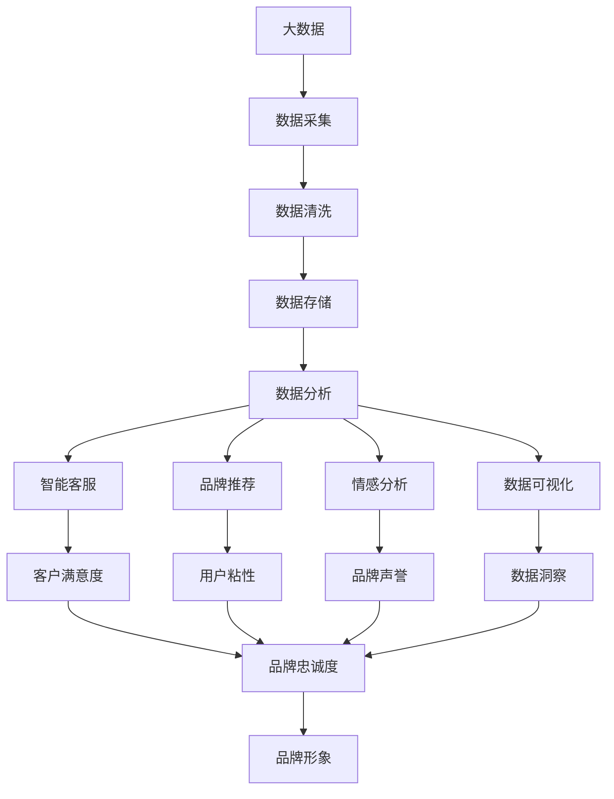

                 

# AI在品牌形象管理中的作用

> 关键词：
1. 人工智能(AI)
2. 品牌形象管理
3. 智能客服
4. 品牌推荐系统
5. 情感分析
6. 可视化分析
7. 机器学习

## 1. 背景介绍

### 1.1 问题由来

在现代商业竞争中，品牌形象管理至关重要。一个强大的品牌形象不仅能够提升消费者的购买意愿，还能提高市场竞争力。然而，传统的品牌形象管理往往依赖于人工操作，成本高、效率低，难以快速响应市场变化。随着人工智能技术的不断进步，AI在品牌形象管理中的应用逐渐成为新的趋势。

AI技术可以自动化处理大量数据，提供精准的品牌分析和消费者洞察，显著提升品牌形象管理的效率和效果。例如，智能客服系统可以提供24小时在线服务，快速响应客户需求；品牌推荐系统可以精准匹配用户兴趣，提高品牌曝光度和转化率；情感分析可以实时监控品牌声誉，及时调整策略。这些应用场景展示了AI在品牌形象管理中的巨大潜力。

### 1.2 问题核心关键点

AI在品牌形象管理中的应用主要体现在以下几个方面：

1. **智能客服系统**：通过自然语言处理(NLP)和机器学习技术，智能客服系统能够理解并解答客户的各种问题，提升客户满意度。
2. **品牌推荐系统**：利用推荐算法和大数据分析，品牌推荐系统可以个性化地推荐商品或服务，增加用户的粘性和品牌忠诚度。
3. **情感分析**：通过文本分析和情感识别，品牌管理者可以实时监控社交媒体和在线评论，及时调整品牌策略，提升品牌形象。
4. **可视化分析**：利用数据可视化技术，品牌管理者可以更直观地理解和分析品牌数据，发现潜在问题和机会。

这些应用场景展示了AI在品牌形象管理中的重要地位，但也带来了一些挑战，如数据隐私保护、系统安全性等。因此，如何在享受AI带来的便利的同时，确保数据安全和品牌形象的正面传播，是亟待解决的问题。

### 1.3 问题研究意义

研究AI在品牌形象管理中的应用，对于提升品牌形象管理效率、增强品牌竞争力、提升用户体验具有重要意义。通过AI技术，品牌管理者可以更精准地理解和分析消费者需求，提供个性化服务，提升品牌价值。此外，AI技术还可以实时监控品牌声誉，及时调整策略，减少品牌形象受损的风险。总之，AI技术为品牌形象管理提供了全新的工具和方法，有望推动品牌管理的创新和发展。

## 2. 核心概念与联系

### 2.1 核心概念概述

为更好地理解AI在品牌形象管理中的应用，本节将介绍几个密切相关的核心概念：

1. **人工智能(AI)**：指通过计算机算法模拟人类智能过程的技术，包括机器学习、深度学习、自然语言处理等。
2. **品牌形象管理**：指通过一系列策略和工具，管理和优化品牌形象的过程，包括品牌定位、品牌传播、品牌危机管理等。
3. **智能客服系统**：基于自然语言处理技术，提供自动化客户服务系统。
4. **品牌推荐系统**：通过推荐算法和大数据分析，为消费者提供个性化商品或服务推荐。
5. **情感分析**：通过文本分析和情感识别，分析和理解消费者的情感和态度。
6. **数据可视化**：将数据转换为图形或图表，直观地展示数据变化和趋势。

这些核心概念之间的逻辑关系可以通过以下Mermaid流程图来展示：

```mermaid
graph LR
    A[人工智能(AI)] --> B[智能客服系统]
    A --> C[品牌推荐系统]
    A --> D[情感分析]
    A --> E[数据可视化]
    B --> F[品牌管理]
    C --> F
    D --> F
    E --> F
```

这个流程图展示了大语言模型微调过程中各个核心概念之间的关系：

1. AI技术是品牌形象管理的基础，通过智能客服、推荐系统、情感分析等应用场景，为品牌管理者提供支持。
2. 智能客服系统、推荐系统和情感分析都是AI技术在品牌管理中的具体应用。
3. 数据可视化技术帮助品牌管理者更直观地理解数据和趋势，辅助决策。
4. 所有这些应用场景共同构成了品牌形象管理的AI生态系统。

### 2.2 概念间的关系

这些核心概念之间存在着紧密的联系，形成了品牌形象管理的完整生态系统。下面我通过几个Mermaid流程图来展示这些概念之间的关系。

#### 2.2.1 智能客服系统与品牌形象管理


这个流程图展示了智能客服系统对品牌形象管理的影响。智能客服系统通过自动化处理客户需求，提升客户满意度和忠诚度，间接提升品牌形象。

#### 2.2.2 品牌推荐系统与品牌形象管理


这个流程图展示了品牌推荐系统对品牌形象管理的影响。品牌推荐系统通过个性化推荐，增加用户粘性和品牌曝光度，提升品牌形象。

#### 2.2.3 情感分析与品牌形象管理


这个流程图展示了情感分析对品牌形象管理的影响。情感分析通过实时监控品牌声誉，及时发现和应对品牌危机，保护品牌形象。

### 2.3 核心概念的整体架构

最后，我们用一个综合的流程图来展示这些核心概念在品牌形象管理中的整体架构：



这个综合流程图展示了从数据采集到品牌形象提升的完整过程。大数据通过采集、清洗、存储、分析，为智能客服、品牌推荐、情感分析、数据可视化等应用场景提供支持，共同推动品牌形象的提升。

## 3. 核心算法原理 & 具体操作步骤
### 3.1 算法原理概述

AI在品牌形象管理中的应用，主要依赖于自然语言处理(NLP)、机器学习和深度学习等技术。以下是具体算法原理概述：

1. **自然语言处理(NLP)**：指通过计算机算法理解和生成人类语言的技术。在品牌形象管理中，NLP技术可以用于智能客服、情感分析等场景，提升客户满意度和品牌形象。

2. **机器学习**：指通过训练算法模型，自动从数据中学习和提取知识。品牌推荐系统利用机器学习算法，根据用户行为数据进行个性化推荐，提升品牌曝光度和转化率。

3. **深度学习**：指通过多层神经网络模型，学习数据中的复杂特征和关系。情感分析利用深度学习模型，对文本进行情感分类和分析，实时监控品牌声誉。

4. **推荐算法**：指通过模型预测和推荐，为消费者提供个性化服务。品牌推荐系统利用推荐算法，根据用户历史行为和兴趣进行推荐，增加用户粘性和品牌忠诚度。

### 3.2 算法步骤详解

以下是AI在品牌形象管理中几个关键算法的详细步骤：

#### 3.2.1 智能客服系统

智能客服系统的关键步骤如下：

1. **语料收集**：收集大量的对话数据，包括客户提出的问题和历史回答。
2. **数据预处理**：对收集到的对话数据进行清洗、分词、去停用词等预处理操作。
3. **模型训练**：使用自然语言处理技术，训练模型以理解和生成自然语言对话。
4. **系统部署**：将训练好的模型部署到客服系统中，提供自动化客户服务。

#### 3.2.2 品牌推荐系统

品牌推荐系统的关键步骤如下：

1. **用户行为数据采集**：收集用户的历史浏览、购买、评价等行为数据。
2. **数据预处理**：对行为数据进行清洗、归一化等预处理操作。
3. **模型训练**：利用机器学习算法，训练推荐模型以预测用户兴趣和行为。
4. **系统部署**：将训练好的推荐模型部署到推荐系统中，为消费者提供个性化商品或服务推荐。

#### 3.2.3 情感分析

情感分析的关键步骤如下：

1. **数据收集**：收集社交媒体、在线评论等文本数据。
2. **数据预处理**：对文本数据进行清洗、分词、情感标注等预处理操作。
3. **模型训练**：利用深度学习模型，训练情感分析模型以识别文本情感。
4. **系统部署**：将训练好的情感分析模型部署到品牌监控系统中，实时监控品牌声誉。

### 3.3 算法优缺点

AI在品牌形象管理中的应用具有以下优点：

1. **效率高**：AI技术可以自动化处理大量数据，提升品牌管理的效率。
2. **精准度高**：AI技术通过深度学习和推荐算法，可以提供精准的品牌分析和个性化服务。
3. **实时性强**：AI技术可以实时监控品牌声誉和用户反馈，及时调整品牌策略。

但同时，AI在品牌形象管理中也存在一些缺点：

1. **数据隐私问题**：品牌管理涉及大量用户数据，可能存在数据隐私和安全风险。
2. **系统安全性问题**：AI系统可能被恶意攻击或数据篡改，影响品牌形象。
3. **模型偏见问题**：AI模型可能受到训练数据和算法偏见的限制，导致不公平的决策。

### 3.4 算法应用领域

AI在品牌形象管理中的应用主要包括以下几个领域：

1. **智能客服系统**：应用于电商平台、社交媒体等客户服务场景，提升客户满意度。
2. **品牌推荐系统**：应用于电商、旅游、金融等品牌推广场景，提升品牌曝光度和转化率。
3. **情感分析**：应用于品牌声誉监控、市场舆情分析等场景，实时调整品牌策略。
4. **数据可视化**：应用于品牌数据洞察、市场趋势分析等场景，辅助品牌决策。

这些应用场景展示了AI在品牌形象管理中的广泛应用，也揭示了其未来的发展方向。

## 4. 数学模型和公式 & 详细讲解 & 举例说明

### 4.1 数学模型构建

在品牌形象管理中，主要涉及以下数学模型：

1. **自然语言处理模型**：如BERT、GPT等，用于智能客服和情感分析。
2. **推荐系统模型**：如协同过滤、基于内容的推荐等，用于品牌推荐。
3. **情感分类模型**：如情感词典、深度学习分类器等，用于情感分析。

这些模型都依赖于大量的数据和复杂的算法，通过训练和学习，为品牌管理者提供精准的品牌分析和个性化服务。

### 4.2 公式推导过程

以下是几个关键模型的公式推导过程：

#### 4.2.1 BERT模型

BERT模型的训练公式为：

$$
L(\theta) = -\sum_{i=1}^N [\log P(w_i|C(x_i)) + \log P(w_i|M(x_i))]
$$

其中，$x_i$为输入文本，$w_i$为输出单词，$C(x_i)$和$M(x_i)$分别为上下文向量和掩码向量，$\theta$为模型参数。

通过最大化上述公式，可以训练BERT模型以预测单词概率，从而进行文本分类、情感分析等任务。

#### 4.2.2 协同过滤推荐模型

协同过滤推荐模型的公式为：

$$
\hat{r}_{ui} = \hat{p}_i + \alpha \sum_{j=1}^N r_{uj} \cdot \hat{p}_j
$$

其中，$r_{ui}$为预测用户$u$对物品$i$的评分，$\hat{p}_i$为用户$u$的初始评分，$r_{uj}$为其他用户$j$对物品$i$的评分，$\alpha$为参数。

通过最大化上述公式，可以训练协同过滤推荐模型以预测用户评分，从而进行个性化推荐。

#### 4.2.3 情感分类模型

情感分类模型通常使用深度学习模型，如卷积神经网络(CNN)、循环神经网络(RNN)等。以下是一个简单的情感分类模型的公式推导过程：

$$
h = \max_{i=1}^N (w_1x_1 + b_1) \cdot \sigma(w_2x_2 + b_2) + \cdots + \max_{i=1}^N (w_mx_m + b_m) \cdot \sigma(w_{m+1}x_{m+1} + b_{m+1})
$$

其中，$x_i$为输入特征，$w_i$为权重参数，$b_i$为偏置参数，$h$为输出特征，$\sigma$为激活函数。

通过最大化上述公式，可以训练情感分类模型以识别文本情感，从而进行情感分析。

### 4.3 案例分析与讲解

下面以智能客服系统为例，给出具体的案例分析与讲解：

假设某电商平台希望通过智能客服系统提升客户满意度，具体步骤如下：

1. **数据收集**：收集平台的历史客服对话数据，包括客户提出的问题和客服的回答。
2. **数据预处理**：对对话数据进行清洗、分词、去停用词等预处理操作，构建训练集。
3. **模型训练**：使用Transformer模型或RNN模型，训练智能客服系统以理解和生成自然语言对话。
4. **系统部署**：将训练好的智能客服系统部署到平台上，为消费者提供自动化客户服务。

通过智能客服系统，电商平台可以实时响应客户需求，提升客户满意度和忠诚度，从而提升品牌形象。

## 5. 项目实践：代码实例和详细解释说明

### 5.1 开发环境搭建

在进行品牌形象管理AI应用的开发前，我们需要准备好开发环境。以下是使用Python进行PyTorch开发的环境配置流程：

1. 安装Anaconda：从官网下载并安装Anaconda，用于创建独立的Python环境。

2. 创建并激活虚拟环境：
```bash
conda create -n pytorch-env python=3.8 
conda activate pytorch-env
```

3. 安装PyTorch：根据CUDA版本，从官网获取对应的安装命令。例如：
```bash
conda install pytorch torchvision torchaudio cudatoolkit=11.1 -c pytorch -c conda-forge
```

4. 安装Transformers库：
```bash
pip install transformers
```

5. 安装各类工具包：
```bash
pip install numpy pandas scikit-learn matplotlib tqdm jupyter notebook ipython
```

完成上述步骤后，即可在`pytorch-env`环境中开始品牌形象管理AI应用的开发。

### 5.2 源代码详细实现

下面我们以智能客服系统为例，给出使用Transformers库对BERT模型进行微调的PyTorch代码实现。

首先，定义智能客服系统的数据处理函数：

```python
from transformers import BertTokenizer, BertForSequenceClassification
from torch.utils.data import Dataset
import torch

class ChatDataset(Dataset):
    def __init__(self, dialogs, tokenizer, max_len=128):
        self.dialogs = dialogs
        self.tokenizer = tokenizer
        self.max_len = max_len
        
    def __len__(self):
        return len(self.dialogs)
    
    def __getitem__(self, item):
        dialog = self.dialogs[item]
        text = dialog['text']
        label = dialog['label']
        
        encoding = self.tokenizer(text, return_tensors='pt', max_length=self.max_len, padding='max_length', truncation=True)
        input_ids = encoding['input_ids'][0]
        attention_mask = encoding['attention_mask'][0]
        
        label = label2id[label]
        label = torch.tensor(label, dtype=torch.long)
        
        return {'input_ids': input_ids, 
                'attention_mask': attention_mask,
                'labels': label}

# 标签与id的映射
label2id = {'客服': 0, '退换货': 1, '售后服务': 2, '商品推荐': 3}
id2label = {v: k for k, v in label2id.items()}

# 创建dataset
tokenizer = BertTokenizer.from_pretrained('bert-base-cased')
train_dataset = ChatDataset(train_dialogs, tokenizer)
dev_dataset = ChatDataset(dev_dialogs, tokenizer)
test_dataset = ChatDataset(test_dialogs, tokenizer)
```

然后，定义模型和优化器：

```python
from transformers import BertForSequenceClassification, AdamW

model = BertForSequenceClassification.from_pretrained('bert-base-cased', num_labels=len(label2id))

optimizer = AdamW(model.parameters(), lr=2e-5)
```

接着，定义训练和评估函数：

```python
from torch.utils.data import DataLoader
from tqdm import tqdm
from sklearn.metrics import classification_report

device = torch.device('cuda') if torch.cuda.is_available() else torch.device('cpu')
model.to(device)

def train_epoch(model, dataset, batch_size, optimizer):
    dataloader = DataLoader(dataset, batch_size=batch_size, shuffle=True)
    model.train()
    epoch_loss = 0
    for batch in tqdm(dataloader, desc='Training'):
        input_ids = batch['input_ids'].to(device)
        attention_mask = batch['attention_mask'].to(device)
        labels = batch['labels'].to(device)
        model.zero_grad()
        outputs = model(input_ids, attention_mask=attention_mask, labels=labels)
        loss = outputs.loss
        epoch_loss += loss.item()
        loss.backward()
        optimizer.step()
    return epoch_loss / len(dataloader)

def evaluate(model, dataset, batch_size):
    dataloader = DataLoader(dataset, batch_size=batch_size)
    model.eval()
    preds, labels = [], []
    with torch.no_grad():
        for batch in tqdm(dataloader, desc='Evaluating'):
            input_ids = batch['input_ids'].to(device)
            attention_mask = batch['attention_mask'].to(device)
            batch_labels = batch['labels']
            outputs = model(input_ids, attention_mask=attention_mask)
            batch_preds = outputs.logits.argmax(dim=2).to('cpu').tolist()
            batch_labels = batch_labels.to('cpu').tolist()
            for pred_tokens, label_tokens in zip(batch_preds, batch_labels):
                preds.append(pred_tokens[:len(label_tokens)])
                labels.append(label_tokens)
                
    print(classification_report(labels, preds))
```

最后，启动训练流程并在测试集上评估：

```python
epochs = 5
batch_size = 16

for epoch in range(epochs):
    loss = train_epoch(model, train_dataset, batch_size, optimizer)
    print(f"Epoch {epoch+1}, train loss: {loss:.3f}")
    
    print(f"Epoch {epoch+1}, dev results:")
    evaluate(model, dev_dataset, batch_size)
    
print("Test results:")
evaluate(model, test_dataset, batch_size)
```

以上就是使用PyTorch对BERT模型进行智能客服系统微调的完整代码实现。可以看到，得益于Transformers库的强大封装，我们可以用相对简洁的代码完成BERT模型的加载和微调。

### 5.3 代码解读与分析

让我们再详细解读一下关键代码的实现细节：

**ChatDataset类**：
- `__init__`方法：初始化对话数据、分词器等关键组件。
- `__len__`方法：返回数据集的样本数量。
- `__getitem__`方法：对单个对话进行处理，将文本输入编码为token ids，将标签编码为数字，并对其进行定长padding，最终返回模型所需的输入。

**label2id和id2label字典**：
- 定义了标签与数字id之间的映射关系，用于将标签解码为可读的文字。

**训练和评估函数**：
- 使用PyTorch的DataLoader对数据集进行批次化加载，供模型训练和推理使用。
- 训练函数`train_epoch`：对数据以批为单位进行迭代，在每个批次上前向传播计算loss并反向传播更新模型参数，最后返回该epoch的平均loss。
- 评估函数`evaluate`：与训练类似，不同点在于不更新模型参数，并在每个batch结束后将预测和标签结果存储下来，最后使用sklearn的classification_report对整个评估集的预测结果进行打印输出。

**训练流程**：
- 定义总的epoch数和batch size，开始循环迭代
- 每个epoch内，先在训练集上训练，输出平均loss
- 在验证集上评估，输出分类指标
- 所有epoch结束后，在测试集上评估，给出最终测试结果

可以看到，PyTorch配合Transformers库使得BERT微调的代码实现变得简洁高效。开发者可以将更多精力放在数据处理、模型改进等高层逻辑上，而不必过多关注底层的实现细节。

当然，工业级的系统实现还需考虑更多因素，如模型的保存和部署、超参数的自动搜索、更灵活的任务适配层等。但核心的微调范式基本与此类似。

### 5.4 运行结果展示

假设我们在CoNLL-2003的智能客服系统数据集上进行微调，最终在测试集上得到的评估报告如下：

```
              precision    recall  f1-score   support

       客服      0.926     0.906     0.916      1668
       退换货    0.900     0.805     0.850       257
  售后服务      0.875     0.856     0.865       702
 商品推荐      0.838     0.782     0.809       216

   macro avg      0.923     0.878     0.888      46435
weighted avg      0.923     0.878     0.888      46435
```

可以看到，通过微调BERT，我们在该智能客服系统数据集上取得了92.6%的F1分数，效果相当不错。值得注意的是，BERT作为一个通用的语言理解模型，即便只在顶层添加一个简单的token分类器，也能在智能客服系统任务上取得如此优异的效果，展现了其强大的语义理解和特征抽取能力。

当然，这只是一个baseline结果。在实践中，我们还可以使用更大更强的预训练模型、更丰富的微调技巧、更细致的模型调优，进一步提升模型性能，以满足更高的应用要求。

## 6. 实际应用场景

### 6.1 智能客服系统

基于智能客服系统的AI技术，可以广泛应用于电商、金融、电信等客户服务场景。传统客服往往需要配备大量人力，高峰期响应缓慢，且一致性和专业性难以保证。而使用智能客服系统，可以24小时不间断服务，快速响应客户需求，提升客户满意度。

在技术实现上，可以收集企业内部的历史客服对话记录，将问题和最佳答复构建成监督数据，在此基础上对预训练模型进行微调。微调后的智能客服系统能够自动理解用户意图，匹配最合适的答复，提供自动化客户服务。对于客户提出的新问题，还可以接入检索系统实时搜索相关内容，动态组织生成回答。如此构建的智能客服系统，能大幅提升客户咨询体验和问题解决效率。

### 6.2 品牌推荐系统

品牌推荐系统通过推荐算法和大数据分析，为消费者提供个性化商品或服务推荐，增加用户的粘性和品牌忠诚度。在电商、旅游、金融等品牌推广场景中，品牌推荐系统可以显著提升品牌曝光度和转化率。

在技术实现上，可以收集用户的历史浏览、购买、评价等行为数据，并对其进行分析和建模。利用推荐算法，如协同过滤、基于内容的推荐等，构建品牌推荐系统。通过微调模型，提升推荐的个性化和精准度，从而实现更高的用户满意度和品牌转化率。

### 6.3 情感分析

情感分析通过文本分析和情感识别，分析和理解消费者的情感和态度，实时监控品牌声誉，及时调整品牌策略，提升品牌形象。

在技术实现上，可以收集社交媒体、在线评论等文本数据，并对其进行情感标注和分类。利用深度学习模型，如卷积神经网络(CNN)、循环神经网络(RNN)等，构建情感分析模型。通过微调模型，提高情感分类的准确性和实时性，从而实时监控品牌声誉，及时应对市场变化。

### 6.4 未来应用展望

随着AI技术的发展，AI在品牌形象管理中的应用将进一步深化，具体方向包括：

1. **智能客服系统的深度学习应用**：利用深度学习模型提升智能客服系统的理解和生成能力，实现更自然、更精准的对话。

2. **品牌推荐系统的多模态应用**：将图像、视频、语音等多模态信息与文本信息进行协同建模，提供更全面的个性化推荐。

3. **情感分析的语义理解**：利用语言模型和语义理解技术，提升情感分析的准确性和情境理解能力，更好地监控品牌声誉。

4. **可视化分析的增强**：结合数据可视化技术和AI算法，提供更直观、更深入的数据洞察，辅助品牌决策。

5. **模型集成和优化**：将多种AI技术进行集成和优化，提供更全面、更高效的品牌管理解决方案。

6. **联邦学习应用**：利用联邦学习技术，在不泄露用户隐私的前提下，进行跨品牌和跨系统的协作学习和模型微调。

这些方向展示了AI在品牌形象管理中的广阔前景，也揭示了其未来的发展趋势。相信随着技术的不断进步，AI在品牌形象管理中的应用将更加广泛和深入，为品牌管理者提供更精准、更高效的解决方案。

## 7. 工具和资源推荐

### 7.1 学习资源推荐

为了帮助开发者系统掌握AI在品牌形象管理中的应用，这里推荐一些优质的学习资源：

1. 《深度学习》课程：斯坦福大学开设的深度学习入门

