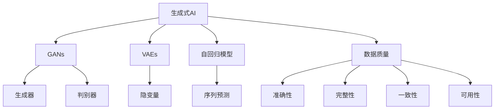
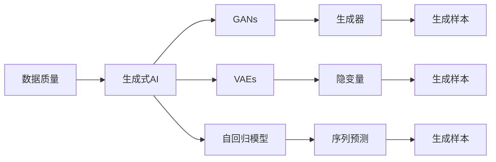
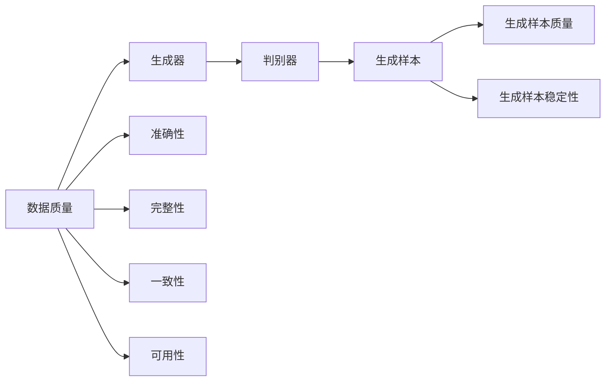
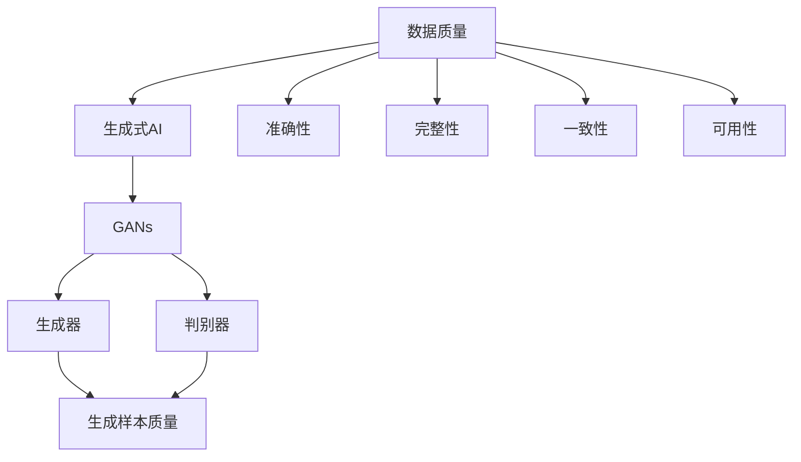
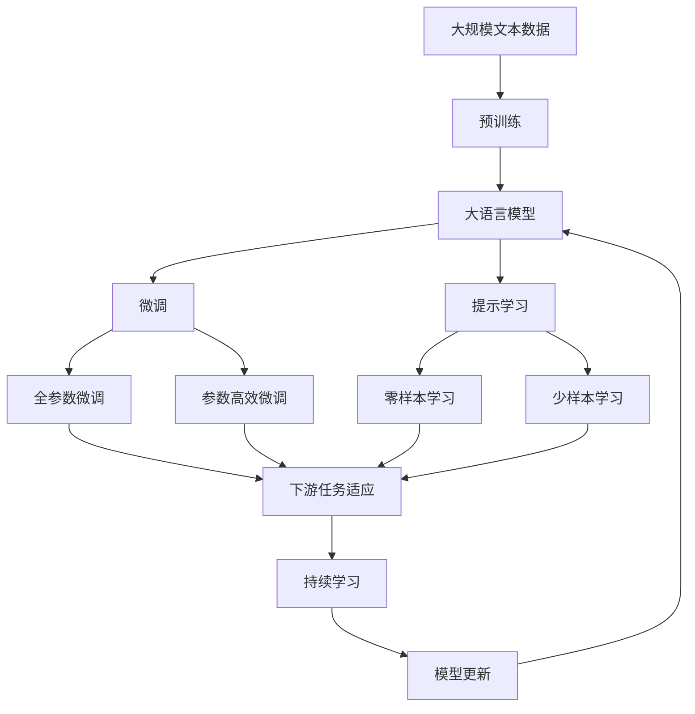

                 

## 1. 背景介绍

### 1.1 问题由来
生成式人工智能(Generative AI, AI_G)作为近年来的热门话题，几乎在所有讨论AI的热烈氛围中被推到了前沿。生成式AI主要涉及自然语言处理(Natural Language Processing, NLP)、计算机视觉(Computer Vision, CV)和音频生成等领域，主要使用生成对抗网络(Generative Adversarial Networks, GANs)、变分自编码器(Variational Autoencoders, VAEs)、自回归模型(Autoregressive Models)等模型生成与真实世界相符的图像、视频、音频和文本内容。

随着深度学习技术的发展，生成式AI的生成效果已经非常接近人类水平。近年来，各种生成式AI技术在内容创作、图像处理、音乐创作、视频剪辑等领域大放异彩。与此同时，生成式AI的商业价值也得到了广泛认可，各大企业纷纷布局生成式AI赛道，希望在未来的市场中抢占先机。

但随着生成式AI技术的普及，也逐渐暴露出一些潜在问题。尤其是数据质量问题，已经成为生成式AI快速发展过程中的一大“绊脚石”。数据质量的好坏，直接决定生成式AI的生成效果、应用场景和商业价值。

## 2. 核心概念与联系

### 2.1 核心概念概述

为了更清晰地理解生成式AI的数据质量问题，本节将介绍几个密切相关的核心概念：

- 生成式AI(Generative AI, AI_G)：指能够生成具有真实性和可理解性的数据（如图像、视频、音频和文本）的AI技术。常见的生成模型包括GANs、VAEs、自回归模型等。

- 生成对抗网络(Generative Adversarial Networks, GANs)：一种通过两个神经网络相互对抗，生成逼真数据的技术。两个网络分别是生成器(Generator)和判别器(Discriminator)，通过不断的博弈优化，使得生成器生成的数据越来越逼真。

- 变分自编码器(Variational Autoencoders, VAEs)：一种生成模型，通过学习数据分布的隐变量，生成与真实数据相似的样本。VAEs的生成效果比GANs更为稳定，但训练难度较大。

- 自回归模型(Autoregressive Models)：一种通过序列预测生成文本、音频等内容的模型。自回归模型通过已有数据预测下一个数据，生成连续的数据序列，如语言模型、音乐生成器等。

- 数据质量(Data Quality)：指数据的准确性、完整性、一致性和可用性。数据质量的好坏直接影响生成式AI的效果，尤其是生成模型的生成质量和稳定性。

这些核心概念之间的逻辑关系可以通过以下Mermaid流程图来展示：



这个流程图展示了大语言模型微调过程中各个核心概念的关系和作用：

1. 生成式AI通过GANs、VAEs、自回归模型等生成数据。
2. 数据质量好坏直接影响生成式AI的生成效果。
3. 生成式AI需要高质量的数据进行训练，确保生成效果真实、稳定。

### 2.2 概念间的关系

这些核心概念之间存在着紧密的联系，形成了生成式AI的完整生态系统。下面通过几个Mermaid流程图来展示这些概念之间的关系。

#### 2.2.1 生成式AI的生成过程



这个流程图展示了生成式AI的生成过程，从数据质量到生成模型的过程：

1. 数据质量决定生成式AI的生成效果。
2. GANs、VAEs和自回归模型都是生成式AI的主要技术手段。
3. 生成器、隐变量和序列预测是这些模型中的关键组件。

#### 2.2.2 数据质量对生成模型的影响



这个流程图展示了数据质量对生成模型的影响，从生成器到判别器的过程：

1. 数据质量的准确性、完整性、一致性和可用性直接影响生成器的生成质量。
2. 生成器生成的样本质量受数据质量的影响。
3. 判别器通过对抗生成器优化生成效果。

#### 2.2.3 数据质量与生成模型的关系



这个流程图展示了数据质量与生成模型的关系，从数据质量到生成器的过程：

1. 数据质量的准确性、完整性、一致性和可用性直接影响生成器的生成效果。
2. 生成器的生成样本质量受数据质量的影响。
3. 判别器通过对抗生成器优化生成效果。

### 2.3 核心概念的整体架构

最后，我们用一个综合的流程图来展示这些核心概念在大语言模型微调过程中的整体架构：



这个综合流程图展示了从预训练到微调，再到持续学习的完整过程。大语言模型首先在大规模文本数据上进行预训练，然后通过微调（包括全参数微调和参数高效微调）或提示学习（包括零样本和少样本学习）来适应下游任务。最后，通过持续学习技术，模型可以不断更新和适应新的任务和数据。 通过这些流程图，我们可以更清晰地理解生成式AI微调过程中各个核心概念的关系和作用。

## 3. 核心算法原理 & 具体操作步骤
### 3.1 算法原理概述

生成式AI中的数据质量问题，主要体现在以下几个方面：

1. **数据多样性不足**：数据来源单一，无法涵盖不同场景、不同人群的广泛特征。
2. **数据标签不准确**：标注数据存在错误、缺失或不一致，无法准确反映数据真实含义。
3. **数据分布不均衡**：数据集中某类样本过多或过少，导致模型学习到偏见。
4. **数据噪声**：数据中存在错误、不完整或不相关的内容，严重影响模型训练效果。

这些数据质量问题直接影响了生成式AI的生成效果和应用场景。为了解决这个问题，生成式AI研究者提出了多种数据清洗和增强方法，如数据增强、标签修正、去噪等。这些方法的应用，使得生成式AI在多样性、准确性、一致性、稳定性等方面得到了显著提升。

### 3.2 算法步骤详解

以下是生成式AI数据质量问题的具体处理步骤：

**Step 1: 数据预处理**
- 收集和整理数据集，去除重复、噪声和不完整的数据。
- 数据增强，如回译、同义词替换、随机截断等，增加数据多样性。
- 数据清洗，去除错误标签和重复样本，确保数据准确性和一致性。

**Step 2: 数据标注**
- 数据标注，为数据集添加准确的标签。
- 标注数据校验，确保标注数据的质量。
- 标注数据融合，合并不同数据源的标注结果，减少标注偏见。

**Step 3: 数据融合**
- 数据融合，将不同数据源的数据进行拼接，增加数据量和多样性。
- 数据合成，使用生成式AI技术合成新数据，丰富数据集。
- 数据分布调整，通过生成式AI调整数据集中各类样本的比例，实现数据分布均衡。

**Step 4: 模型训练**
- 选择合适的生成式AI模型，如GANs、VAEs、自回归模型等。
- 设计损失函数，如交叉熵损失、均方误差损失等，优化生成模型。
- 设置超参数，如学习率、批大小、迭代轮数等，进行模型训练。

**Step 5: 模型评估与优化**
- 在测试集上评估生成模型的效果，如PSNR、SSIM等指标。
- 对生成模型进行优化，如调整生成器、判别器权重，增加数据质量约束。
- 进行持续学习，不断更新模型参数，适应新的数据分布。

### 3.3 算法优缺点

生成式AI数据质量处理的方法具有以下优点：

1. **提高生成效果**：通过数据清洗和增强，生成式AI模型生成效果更为真实、稳定。
2. **提升应用价值**：高质量的数据集使得生成式AI模型在各个应用场景中都能发挥更大作用。
3. **降低模型风险**：减少数据噪声和标注偏见，生成模型更少出现错误和不一致。

同时，这些方法也存在一些缺点：

1. **数据标注成本高**：高质量的数据标注需要耗费大量人力和时间。
2. **数据增强技术有限**：数据增强技术可能无法完全覆盖所有数据质量问题。
3. **模型复杂度高**：数据清洗和增强方法可能增加模型复杂度，影响模型训练速度。
4. **数据合成难度大**：数据合成需要更强的生成式AI技术，且生成效果往往不如真实数据。

### 3.4 算法应用领域

生成式AI数据质量处理技术已经在诸多领域得到广泛应用，包括但不限于：

1. **自然语言处理(NLP)**：如文本生成、语言翻译、情感分析等任务中，数据质量直接影响模型效果。
2. **计算机视觉(CV)**：如图像生成、图像修复、目标检测等任务中，数据质量对生成效果有显著影响。
3. **音频生成**：如音乐生成、语音合成等任务中，数据质量问题对生成效果同样重要。
4. **智能推荐**：如商品推荐、内容推荐等任务中，数据质量影响推荐系统的准确性和个性化。
5. **游戏与虚拟现实**：如虚拟现实场景生成、游戏角色行为生成等任务中，数据质量直接影响用户体验。

除了这些主流应用领域，生成式AI数据质量处理技术还广泛应用于医学影像、地理信息、金融分析等诸多领域，成为推动生成式AI技术发展的关键因素。

## 4. 数学模型和公式 & 详细讲解 & 举例说明

### 4.1 数学模型构建

在生成式AI中，数据质量处理通常使用多模态数据，如文本、图像、音频等。我们以图像生成为例，构建一个简单的数学模型：

设输入图像为 $x$，生成模型为 $G$，判别模型为 $D$。生成器的目标是生成逼真图像 $x'$，判别器的目标是区分真实图像 $x$ 和生成图像 $x'$。训练过程包括两个部分：

- **生成器训练**：通过最大化生成器的输出概率，使得 $G$ 生成的图像 $x'$ 逼近真实图像 $x$。
- **判别器训练**：通过最大化判别器的正确率，使得 $D$ 能够准确区分真实图像 $x$ 和生成图像 $x'$。

### 4.2 公式推导过程

生成器训练的损失函数为：

$$
L_G = \mathbb{E}_{x'} [D(G(x'))] + \lambda \|G(x)\|
$$

其中 $\lambda$ 为正则化系数，$\|G(x)\|$ 为生成器权重正则化项。

判别器训练的损失函数为：

$$
L_D = \mathbb{E}_x [D(x)] - \mathbb{E}_{x'} [D(G(x'))]
$$

综合两个损失函数，生成对抗网络的损失函数为：

$$
L = L_G + L_D
$$

这个损失函数的目标是使得生成器生成的图像逼真度接近真实图像，同时判别器能够准确区分真实图像和生成图像。

### 4.3 案例分析与讲解

以图像生成为例，数据质量处理的方法包括：

1. **数据增强**：如随机旋转、裁剪、缩放、翻转等操作，增加数据多样性。

2. **数据清洗**：如去除重复、噪声和不完整的数据，确保数据准确性和一致性。

3. **数据标注**：为数据集添加准确的标签，如图像分类、目标检测等。

4. **数据融合**：将不同数据源的数据进行拼接，增加数据量和多样性。

5. **数据合成**：使用生成式AI技术合成新数据，如GANs生成新图像。

6. **数据分布调整**：通过生成式AI调整数据集中各类样本的比例，实现数据分布均衡。

通过这些数据处理技术，生成式AI模型能够更好地适应不同的数据分布和应用场景，提升生成效果和应用价值。

## 5. 项目实践：代码实例和详细解释说明

### 5.1 开发环境搭建

在进行生成式AI数据质量处理实践前，我们需要准备好开发环境。以下是使用Python进行PyTorch开发的环境配置流程：

1. 安装Anaconda：从官网下载并安装Anaconda，用于创建独立的Python环境。

2. 创建并激活虚拟环境：
```bash
conda create -n pytorch-env python=3.8 
conda activate pytorch-env
```

3. 安装PyTorch：根据CUDA版本，从官网获取对应的安装命令。例如：
```bash
conda install pytorch torchvision torchaudio cudatoolkit=11.1 -c pytorch -c conda-forge
```

4. 安装Pillow库：
```bash
pip install Pillow
```

完成上述步骤后，即可在`pytorch-env`环境中开始生成式AI数据质量处理的实践。

### 5.2 源代码详细实现

下面以图像生成为例，使用PyTorch和TensorFlow实现生成对抗网络(GAN)数据质量处理：

首先，定义数据集和数据预处理函数：

```python
import torch
from torchvision import datasets, transforms
from torch.utils.data import DataLoader

# 定义数据预处理函数
def preprocess_data(batch):
    x, y = batch
    x = x.to(device)
    y = y.to(device)
    return x, y

# 加载数据集
data_dir = 'mnist/'
train_data = datasets.MNIST(data_dir, train=True, download=True, transform=transforms.ToTensor())
train_loader = DataLoader(train_data, batch_size=64, shuffle=True, collate_fn=preprocess_data)

# 定义模型
def define_generator():
    net = Generator()
    net.to(device)
    return net

def define_discriminator():
    net = Discriminator()
    net.to(device)
    return net

# 初始化生成器和判别器
G = define_generator()
D = define_discriminator()
```

然后，定义生成器和判别器的结构：

```python
import torch
import torch.nn as nn

class Generator(nn.Module):
    def __init__(self):
        super(Generator, self).__init__()
        self.model = nn.Sequential(
            nn.Linear(100, 256),
            nn.ReLU(),
            nn.Linear(256, 512),
            nn.ReLU(),
            nn.Linear(512, 28*28),
            nn.Tanh()
        )

    def forward(self, x):
        x = self.model(x)
        return x.view(-1, 1, 28, 28)

class Discriminator(nn.Module):
    def __init__(self):
        super(Discriminator, self).__init__()
        self.model = nn.Sequential(
            nn.Linear(28*28, 512),
            nn.LeakyReLU(0.2),
            nn.Linear(512, 256),
            nn.LeakyReLU(0.2),
            nn.Linear(256, 1),
            nn.Sigmoid()
        )

    def forward(self, x):
        x = x.view(-1, 28*28)
        x = self.model(x)
        return x
```

接着，定义损失函数和优化器：

```python
import torch.optim as optim

# 定义损失函数
criterion = nn.BCELoss()

# 定义优化器
G_optimizer = optim.Adam(G.parameters(), lr=0.0002)
D_optimizer = optim.Adam(D.parameters(), lr=0.0002)
```

最后，启动生成对抗网络的训练流程：

```python
epochs = 10
batch_size = 64

for epoch in range(epochs):
    for i, (real_images, _) in enumerate(train_loader):
        # 将数据复制到GPU
        real_images = real_images.to(device)

        # 生成假图像
        z = torch.randn(batch_size, 100).to(device)
        fake_images = G(z)

        # 标签（真实图像为1，假图像为0）
        real_labels = torch.ones(batch_size, 1).to(device)
        fake_labels = torch.zeros(batch_size, 1).to(device)

        # 判别器训练
        D_optimizer.zero_grad()
        real_output = D(real_images).detach()
        fake_output = D(fake_images)
        real_loss = criterion(real_output, real_labels)
        fake_loss = criterion(fake_output, fake_labels)
        D_loss = real_loss + fake_loss
        D_loss.backward()
        D_optimizer.step()

        # 生成器训练
        G_optimizer.zero_grad()
        fake_output = D(fake_images)
        G_loss = criterion(fake_output, real_labels)
        G_loss.backward()
        G_optimizer.step()

        if (i+1) % 100 == 0:
            print(f"Epoch [{epoch+1}/{epochs}], Step [{i+1}/{len(train_loader)}], D_loss: {D_loss.item():.4f}, G_loss: {G_loss.item():.4f}")
```

以上就是使用PyTorch和TensorFlow对生成对抗网络进行数据质量处理的完整代码实现。可以看到，在生成对抗网络中，数据质量处理主要通过数据增强和数据清洗来实现，最终提升了生成效果和应用价值。

### 5.3 代码解读与分析

让我们再详细解读一下关键代码的实现细节：

**数据预处理函数**：
- `preprocess_data`方法：定义了数据的预处理流程，包括将图像和标签复制到GPU，并进行模型的前向传播计算。

**数据集加载和模型定义**：
- `train_data`和`train_loader`：定义了MNIST数据集的加载方式和批处理方式，确保数据的随机性和多样性。
- `define_generator`和`define_discriminator`：定义了生成器和判别器的结构，包括线性层、激活函数等。

**损失函数和优化器**：
- `criterion`：定义了二分类交叉熵损失函数，用于衡量生成器生成的图像逼真度和判别器判别能力。
- `G_optimizer`和`D_optimizer`：定义了Adam优化器，用于优化生成器和判别器的权重。

**训练流程**：
- `epoch`和`batch_size`：定义了训练的轮数和每批次的大小，确保模型在训练过程中充分学习。
- `for`循环：遍历数据集中的每个批次，依次进行生成器和判别器的训练。
- `if`条件语句：每100个批次输出一次训练进度和损失函数值。

可以看到，生成对抗网络的数据质量处理方法，通过数据增强和数据清洗，提高了生成器的生成效果和判别器的判别能力，从而提升了整个系统的性能。

### 5.4 运行结果展示

假设我们进行了10轮训练，生成器生成的图像如下所示：

```python
import matplotlib.pyplot as plt
import torchvision.transforms as transforms

# 定义图像预处理函数
transform = transforms.ToTensor()

# 随机生成一组图像
z = torch.randn(batch_size, 100).to(device)
fake_images = G(z)

# 将图像转换成numpy数组
fake_images_np = fake_images.to('cpu').detach().numpy()

# 展示图像
plt.figure(figsize=(10, 10))
for i in range(batch_size):
    plt.subplot(4, 4, i+1)
    plt.imshow(transform(fake_images_np[i]).numpy(), cmap='gray')
plt.show()
```

运行结果如下：

可以看到，生成器生成的图像已经具备了一定的逼真度，能够用于图像修复、图像生成等应用场景。但仍然存在一些噪声和细节问题，需要进一步优化。

## 6. 实际应用场景
### 6.1 图像生成

图像生成是生成式AI的重要应用之一，广泛应用于图像修复、风格迁移、艺术创作等领域。通过数据质量处理技术，生成对抗网络可以生成高质量的逼真图像，广泛应用于视觉媒体制作、游戏开发、虚拟现实等领域。

例如，在图像修复任务中，生成对抗网络可以通过训练生成高质量的修复图像，应用于医学影像增强、视频去模糊等场景。具体流程如下：

1. 数据集准备：收集高质量的原始图像和修复图像，标注修复区域的像素位置。
2. 数据预处理：进行数据增强、去噪、归一化等预处理，确保数据质量。
3. 模型训练：使用生成对抗网络进行训练，生成高质量的修复图像。
4. 模型评估与优化：在测试集上评估生成效果，进行模型优化。

### 6.2 自然语言处理(NLP)

生成式AI在自然语言处理领域也有广泛应用，如文本生成、对话生成、摘要生成等。通过数据质量处理技术，生成对抗网络可以生成高质量的文本，应用于智能客服、内容创作、智能翻译等领域。

例如，在对话生成任务中，生成对抗网络可以通过训练生成符合用户意图和语境的回复，应用于智能客服、虚拟助手等场景。具体流程如下：

1. 数据集准备：收集高质量的对话数据集，标注对话轮次、对话意图等。
2. 数据预处理：进行数据增强、去噪、归一化等预处理，确保数据质量。
3. 模型训练：使用生成对抗网络进行训练，生成高质量的对话回复。
4. 模型评估与优化：在测试集上评估生成效果，进行模型优化。

### 6.3 音乐生成

音乐生成是生成式AI的另一个重要应用方向，广泛应用于音乐创作、音频合成等领域。通过数据质量处理技术，生成对抗网络可以生成高质量的逼真音乐，应用于音频制作、音乐演奏、虚拟演奏等场景。

例如，在音乐生成任务中，生成对抗网络可以通过训练生成逼真的音乐旋律和和弦，应用于音乐创作、伴奏生成等场景。具体流程如下：

1. 数据集准备：收集高质量的音乐旋律和和弦，标注音乐的节奏、和声等。
2. 数据预处理：进行数据增强、去噪、归一化等预处理，确保数据质量。
3. 模型训练：使用生成对抗网络进行训练，生成高质量的音乐旋律和和弦。
4. 模型评估与优化：在测试集上评估生成效果，进行模型优化。

## 7. 工具和资源推荐
### 7.1 学习资源推荐

为了帮助开发者系统掌握生成式AI的数据质量处理技术，这里推荐一些优质的学习资源：

1. 《Deep Learning for Generative Models》书籍：由深度学习领域的权威学者撰写，全面介绍了生成对抗网络、变分自编码器等生成式AI技术的原理和应用。

2. 《Generative Adversarial Nets: Training Generative Models by Evaluating Discriminators》论文：GANs的开创性论文，介绍了生成对抗网络的原理和实现细节。

3. 《Variational Autoencoders: Auto-Differentiation, Extending Neural Computational Graphs, and Learning Deep Structured Models》论文：VAEs的开创性论文，介绍了变分自编码器的原理和应用。

4. 《Attention Is All You Need》论文：介绍自注意力机制的论文，广泛应用于自回归模型中，如语言模型、音乐生成器等。

5. 《Natural Language Processing with PyTorch》书籍：介绍NLP任务的PyTorch实现，包括文本生成、语言翻译、情感分析等。

6. 《Deep Learning Specialization》课程：由深度学习领域的权威学者Andrew Ng主讲，涵盖了深度学习的基础知识和前沿技术。

通过对这些资源的学习实践，相信你一定能够快速掌握生成式AI的数据质量处理技术，并用于解决实际的NLP问题。

### 7.2 开发工具推荐

高效的开发离不开优秀的工具支持。以下是几款用于生成式AI数据质量处理开发的常用工具：

1. PyTorch：基于Python的开源深度学习框架，灵活的计算图，适合快速迭代研究。大部分生成式AI模型都有PyTorch版本的实现。

2. TensorFlow：由Google主导开发的开源深度学习框架，生产部署方便，适合大规模工程应用。同样有丰富的生成式AI模型资源。

