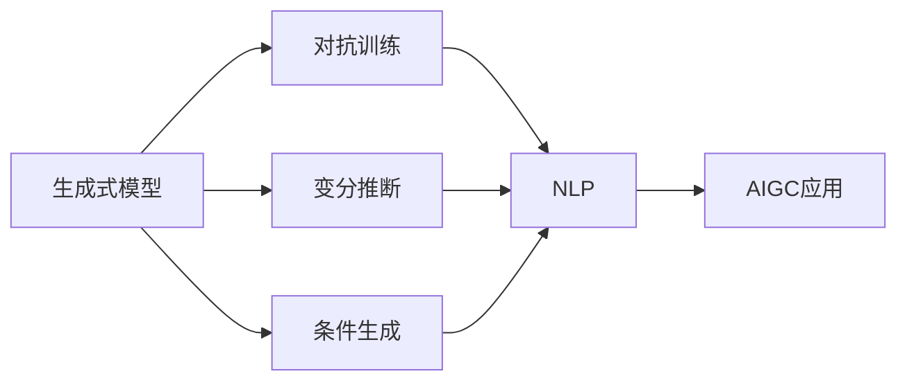

                 

# 生成式AIGC：从理论到商业应用的跨越

## 1. 背景介绍

### 1.1 问题由来

近年来，随着深度学习技术的不断进步，生成式人工智能（Generative AI, AIGC）技术日益受到人们的关注。AIGC技术通过生成式模型，能够自动生成高质量的文本、图像、视频、音频等多种内容，广泛应用于自然语言处理（NLP）、计算机视觉（CV）、生成对抗网络（GAN）等领域。特别是生成式对抗网络（GAN）、自回归模型、变分自编码器（VAE）等深度学习模型的提出，AIGC技术已经进入了高速发展阶段。

然而，尽管AIGC技术在生成内容的质量和多样性上取得了显著的进展，但其在理论基础、商业化应用等方面的研究还相对不足。如何从理论层面深入理解AIGC，以及如何将这些理论应用于实际的商业场景中，成为当前学术界和工业界共同关心的重要问题。

### 1.2 问题核心关键点

AIGC技术核心关键点主要包括：

- 生成式模型：利用深度学习模型，自动生成高质量的数据。
- 对抗训练：通过对抗样本训练，提升生成内容的逼真度和多样性。
- 变分推断：通过变分自编码器等模型，生成满足概率分布的数据。
- 条件生成：利用条件变量，控制生成内容的风格、主题等属性。
- 自然语言处理：将生成式模型应用于文本生成、机器翻译等NLP任务。

AIGC技术的这些关键点，不仅涉及基础的机器学习理论，还包含复杂的深度学习架构和优化技术。本文将深入探讨这些关键点，并结合实际应用场景，全面分析AIGC技术在理论和商业化应用中的发展现状及未来趋势。

### 1.3 问题研究意义

研究AIGC技术在理论和商业应用中的跨越，具有重要的现实意义：

- 推动人工智能技术的发展。AIGC技术是人工智能的重要分支，其在多个领域的创新应用，推动了人工智能技术的全面进步。
- 赋能产业升级。AIGC技术能够大幅提升内容生产的效率和质量，为传统产业数字化转型提供新的技术手段。
- 改善用户体验。AIGC技术能够提供个性化的内容生成，提升用户体验和互动性。
- 促进跨学科融合。AIGC技术的跨学科应用，推动了计算机科学、艺术设计、语言学等多领域的深度融合。

## 2. 核心概念与联系

### 2.1 核心概念概述

为了更深入地理解AIGC技术，首先需要了解一些核心概念：

- 生成式模型（Generative Model）：能够从给定的输入数据中生成新的数据样本的模型。常见的生成式模型包括GAN、VAE、自回归模型等。
- 对抗训练（Adversarial Training）：通过对抗样本训练，生成模型能够更好地生成逼真的数据。
- 变分推断（Variational Inference）：利用变分自编码器等模型，生成满足概率分布的数据，并通过最大化似然函数进行训练。
- 条件生成（Conditional Generation）：通过引入条件变量，控制生成内容的属性、风格、主题等。
- 自然语言处理（NLP）：将生成式模型应用于文本生成、机器翻译等任务，提升NLP系统性能。

这些概念之间存在着紧密的联系，构成了AIGC技术的完整框架。通过理解这些概念及其内在联系，我们可以更系统地把握AIGC技术的理论基础和应用方法。

### 2.2 概念间的关系

这些核心概念之间存在着紧密的联系，可以通过以下Mermaid流程图来展示：



这个流程图展示了AIGC技术中的核心概念及其相互关系：

1. 生成式模型是AIGC技术的核心，通过学习数据分布，生成高质量的数据样本。
2. 对抗训练通过对抗样本训练，提升生成模型的逼真度。
3. 变分推断通过变分自编码器等模型，生成符合概率分布的数据。
4. 条件生成通过引入条件变量，控制生成内容的属性。
5. NLP任务将生成式模型应用于文本生成、机器翻译等任务。
6. AIGC技术在实际应用中，涵盖多个领域，如媒体、游戏、广告等。

这些概念共同构成了AIGC技术的核心框架，使得其能够在多个领域中发挥重要作用。通过理解这些概念及其关系，我们可以更好地把握AIGC技术的发展方向和应用方法。

## 3. 核心算法原理 & 具体操作步骤

### 3.1 算法原理概述

AIGC技术的核心算法主要包括生成式模型、对抗训练、变分推断、条件生成等。下面分别介绍这些算法的原理和操作步骤。

#### 3.1.1 生成式模型

生成式模型通过学习数据分布，能够生成新的数据样本。其核心思想是将数据表示为潜变量和观测变量的联合分布，并通过对观测变量进行解码，生成新的数据。常用的生成式模型包括GAN、VAE、自回归模型等。

GAN（Generative Adversarial Networks）：生成对抗网络由生成器和判别器两个部分组成，生成器通过学习数据的分布，生成新的数据样本，判别器则对生成器生成的数据进行判别。两个模型通过对抗训练的方式，不断提升生成器生成数据的逼真度。

VAE（Variational Autoencoders）：变分自编码器通过学习数据的分布，生成满足该分布的新数据。其核心思想是将数据表示为潜变量和观测变量的联合分布，并通过最大化似然函数进行训练。

自回归模型：自回归模型通过利用历史数据预测未来数据，生成新的数据样本。其核心思想是通过对观测数据的逐个预测，生成新的序列数据。

#### 3.1.2 对抗训练

对抗训练通过对抗样本训练，提升生成模型的逼真度。其核心思想是在生成器生成的数据中，加入对抗样本，使得判别器难以区分真实数据和生成数据。常用的对抗训练方法包括FGM（Fast Gradient Method）、PGD（Projected Gradient Descent）等。

#### 3.1.3 变分推断

变分推断通过变分自编码器等模型，生成符合概率分布的数据。其核心思想是将数据表示为潜变量和观测变量的联合分布，并通过最大化似然函数进行训练。常用的变分推断方法包括ELBO（Evidence LowerBOund）等。

#### 3.1.4 条件生成

条件生成通过引入条件变量，控制生成内容的属性、风格、主题等。其核心思想是在生成模型中引入条件变量，使得生成过程能够根据条件变量生成对应的内容。常用的条件生成方法包括条件GAN、条件VAE等。

### 3.2 算法步骤详解

下面详细介绍AIGC技术的核心算法的操作步骤。

#### 3.2.1 生成式模型

1. 数据准备：收集数据集，并将其分为训练集、验证集和测试集。
2. 构建模型：根据具体任务，选择合适的生成式模型（如GAN、VAE、自回归模型等），并构建模型结构。
3. 模型训练：在训练集上训练生成模型，最大化似然函数或最小化生成损失函数。
4. 模型评估：在验证集上评估生成模型的性能，通过各种指标（如FID、IS等）衡量模型的逼真度和多样性。
5. 模型优化：根据评估结果，对模型进行优化调整，提升生成效果。

#### 3.2.2 对抗训练

1. 生成对抗网络：构建生成器和判别器的网络结构，并初始化模型参数。
2. 对抗样本生成：生成对抗样本，加入到训练集中进行训练。
3. 对抗训练：在训练集上训练生成器和判别器，通过对抗训练提升生成器的生成效果。
4. 模型评估：在验证集上评估生成对抗网络的性能，通过各种指标（如FWVC、FGSM等）衡量模型的鲁棒性。
5. 模型优化：根据评估结果，对模型进行优化调整，提升生成效果。

#### 3.2.3 变分推断

1. 数据准备：收集数据集，并将其分为训练集、验证集和测试集。
2. 构建模型：根据具体任务，选择合适的变分推断模型（如VAE），并构建模型结构。
3. 模型训练：在训练集上训练变分推断模型，最大化似然函数。
4. 模型评估：在验证集上评估变分推断模型的性能，通过各种指标（如ELBO、KL divergence等）衡量模型的逼真度和多样性。
5. 模型优化：根据评估结果，对模型进行优化调整，提升生成效果。

#### 3.2.4 条件生成

1. 数据准备：收集数据集，并将其分为训练集、验证集和测试集。
2. 构建模型：根据具体任务，选择合适的条件生成模型（如条件GAN、条件VAE），并构建模型结构。
3. 模型训练：在训练集上训练条件生成模型，最大化似然函数。
4. 模型评估：在验证集上评估条件生成模型的性能，通过各种指标（如GAN Loss、KL divergence等）衡量模型的逼真度和多样性。
5. 模型优化：根据评估结果，对模型进行优化调整，提升生成效果。

### 3.3 算法优缺点

AIGC技术的核心算法具有以下优点：

1. 能够自动生成高质量的数据。生成式模型能够从数据中学习分布，生成高质量的数据样本。
2. 能够提升数据的多样性和鲁棒性。对抗训练和变分推断等方法，能够提升生成数据的逼真度和多样性。
3. 能够控制生成内容的属性。条件生成方法能够通过引入条件变量，控制生成内容的属性、风格、主题等。

但同时也存在一些缺点：

1. 模型训练复杂。生成式模型的训练需要大量计算资源和时间，训练复杂度较高。
2. 需要高质量的训练数据。生成式模型的性能很大程度上取决于训练数据的质量，需要高质量的标注数据进行训练。
3. 可能存在生成内容偏见。生成式模型可能学习到数据中的偏见，导致生成内容具有特定的倾向性。

### 3.4 算法应用领域

AIGC技术的核心算法已经在多个领域得到广泛应用，主要包括：

1. 自然语言处理：利用生成式模型，生成高质量的文本，提升NLP系统的性能。
2. 计算机视觉：利用生成式模型，生成高质量的图像和视频，提升CV系统的性能。
3. 媒体和娱乐：利用生成式模型，生成高质量的媒体内容，提升用户体验。
4. 游戏和仿真：利用生成式模型，生成高质量的游戏场景和仿真环境，提升游戏体验。
5. 广告和营销：利用生成式模型，生成高质量的广告和营销内容，提升品牌效应。

## 4. 数学模型和公式 & 详细讲解 & 举例说明

### 4.1 数学模型构建

AIGC技术的核心算法涉及多个数学模型，下面详细介绍这些模型的构建方法。

#### 4.1.1 生成式模型

生成式模型通过学习数据分布，生成新的数据样本。其核心思想是将数据表示为潜变量和观测变量的联合分布，并通过对观测变量进行解码，生成新的数据。常用的生成式模型包括GAN、VAE、自回归模型等。

GAN模型：
$$
P_{\theta_G}(x) = \frac{1}{Z} e^{-\frac{1}{2}(x - \mu_G(x))^T\Sigma_G^{-1}(x - \mu_G(x))}
$$
其中，$Z$为标准化常数，$\mu_G(x)$和$\Sigma_G(x)$分别为生成器的均值和协方差。

VAE模型：
$$
p(z|x) = \mathcal{N}(z|\mu(x),\Sigma(x))
$$
其中，$\mu(x)$和$\Sigma(x)$分别为变分推断模型的均值和协方差。

自回归模型：
$$
p(x|x_{<t}) = \prod_{i=t}^{T} p(x_i|x_{<i})
$$

#### 4.1.2 对抗训练

对抗训练通过对抗样本训练，提升生成模型的逼真度。其核心思想是在生成器生成的数据中，加入对抗样本，使得判别器难以区分真实数据和生成数据。常用的对抗训练方法包括FGM、PGD等。

#### 4.1.3 变分推断

变分推断通过变分自编码器等模型，生成符合概率分布的数据。其核心思想是将数据表示为潜变量和观测变量的联合分布，并通过最大化似然函数进行训练。常用的变分推断方法包括ELBO、KL divergence等。

#### 4.1.4 条件生成

条件生成通过引入条件变量，控制生成内容的属性、风格、主题等。其核心思想是在生成模型中引入条件变量，使得生成过程能够根据条件变量生成对应的内容。常用的条件生成方法包括条件GAN、条件VAE等。

### 4.2 公式推导过程

下面详细介绍AIGC技术的核心算法的公式推导过程。

#### 4.2.1 生成式模型

GAN模型的推导过程：
$$
p_{G}(x) = \int_{z \sim p(z)} p_{G}(x|z) p(z)dz
$$
其中，$p_{G}(x|z)$为生成器模型，$p(z)$为潜变量分布。

VAE模型的推导过程：
$$
p_{\theta}(x) = \int_{z \sim q(z|x)} p_{\theta}(x|z) q(z)dz
$$
其中，$q(z|x)$为变分推断模型。

自回归模型的推导过程：
$$
p(x|x_{<t}) = \prod_{i=t}^{T} p(x_i|x_{<i})
$$

#### 4.2.2 对抗训练

对抗训练的推导过程：
$$
p_{G}(x) = \int_{z \sim p(z)} p_{G}(x|z) p(z)dz
$$
其中，$p_{G}(x|z)$为生成器模型，$p(z)$为潜变量分布。

#### 4.2.3 变分推断

变分推断的推导过程：
$$
p_{\theta}(x) = \int_{z \sim q(z|x)} p_{\theta}(x|z) q(z)dz
$$
其中，$q(z|x)$为变分推断模型。

#### 4.2.4 条件生成

条件生成的推导过程：
$$
p_{G}(x|c) = \int_{z \sim p(z|c)} p_{G}(x|z, c) p(z|c)dz
$$
其中，$p_{G}(x|z, c)$为条件生成器模型，$p(z|c)$为条件变量分布。

### 4.3 案例分析与讲解

#### 4.3.1 生成式模型

以GAN模型为例，分析其生成过程。假设生成的数据为图像，其生成过程如下：

1. 生成器模型：
   $$
   z \sim p(z)
   $$
   其中，$z$为潜变量，$p(z)$为潜变量分布。
2. 生成器将潜变量解码为观测变量：
   $$
   x = G(z)
   $$
   其中，$x$为观测变量，$G$为生成器模型。
3. 判别器模型：
   $$
   y = D(x)
   $$
   其中，$y$为判别器输出，$D$为判别器模型。
4. 生成对抗训练：
   $$
   \min_{G} \max_{D} V(D,G) = \mathbb{E}_{x \sim p_{data}(x)}[\log D(x)] + \mathbb{E}_{z \sim p(z)}[\log (1-D(G(z))]
   $$

#### 4.3.2 对抗训练

以PGD为例，分析其对抗训练过程。假设生成的数据为图像，其对抗训练过程如下：

1. 生成器模型：
   $$
   z \sim p(z)
   $$
   其中，$z$为潜变量，$p(z)$为潜变量分布。
2. 生成器将潜变量解码为观测变量：
   $$
   x = G(z)
   $$
   其中，$x$为观测变量，$G$为生成器模型。
3. 对抗样本生成：
   $$
   x' = x + \epsilon \nabla_{x} D(x)
   $$
   其中，$\epsilon$为对抗样本的强度，$\nabla_{x} D(x)$为对抗样本的方向。
4. 生成对抗训练：
   $$
   \min_{G} \max_{D} V(D,G) = \mathbb{E}_{x \sim p_{data}(x)}[\log D(x)] + \mathbb{E}_{z \sim p(z)}[\log (1-D(G(z)))]
   $$

#### 4.3.3 变分推断

以VAE模型为例，分析其变分推断过程。假设生成的数据为图像，其变分推断过程如下：

1. 生成器模型：
   $$
   z \sim p(z)
   $$
   其中，$z$为潜变量，$p(z)$为潜变量分布。
2. 生成器将潜变量解码为观测变量：
   $$
   x = G(z)
   $$
   其中，$x$为观测变量，$G$为生成器模型。
3. 变分推断模型：
   $$
   q(z|x) = \mathcal{N}(z|\mu(x),\Sigma(x))
   $$
   其中，$q(z|x)$为变分推断模型。
4. 变分推断训练：
   $$
   \max_{q(z|x)} \mathbb{E}_{q(z|x)}[\log p_{\theta}(x|z)] - \mathbb{E}_{q(z|x)}[\log q(z|x)] + \mathbb{D}_{KL}(q(z|x)||p(z))
   $$

#### 4.3.4 条件生成

以条件GAN为例，分析其条件生成过程。假设生成的数据为图像，其条件生成过程如下：

1. 生成器模型：
   $$
   z \sim p(z)
   $$
   其中，$z$为潜变量，$p(z)$为潜变量分布。
2. 条件生成器模型：
   $$
   x = G(z, c)
   $$
   其中，$x$为观测变量，$G$为条件生成器模型，$c$为条件变量。
3. 条件判别器模型：
   $$
   y = D(x, c)
   $$
   其中，$y$为判别器输出，$D$为条件判别器模型。
4. 条件生成训练：
   $$
   \min_{G} \max_{D} V(D,G) = \mathbb{E}_{x \sim p_{data}(x)}[\log D(x, c)] + \mathbb{E}_{z \sim p(z)}[\log (1-D(G(z, c)))]
   $$

## 5. 项目实践：代码实例和详细解释说明

### 5.1 开发环境搭建

在进行AIGC项目实践前，我们需要准备好开发环境。以下是使用Python进行TensorFlow开发的环境配置流程：

1. 安装Anaconda：从官网下载并安装Anaconda，用于创建独立的Python环境。

2. 创建并激活虚拟环境：
```bash
conda create -n tf-env python=3.8 
conda activate tf-env
```

3. 安装TensorFlow：根据CUDA版本，从官网获取对应的安装命令。例如：
```bash
conda install tensorflow-gpu=2.6 -c conda-forge -c pytorch
```

4. 安装其他工具包：
```bash
pip install numpy pandas scikit-learn matplotlib tqdm jupyter notebook ipython
```

完成上述步骤后，即可在`tf-env`环境中开始AIGC实践。

### 5.2 源代码详细实现

这里以生成对抗网络（GAN）为例，给出使用TensorFlow实现GAN的代码实现。

首先，定义GAN模型的结构：

```python
import tensorflow as tf

class Generator(tf.keras.Model):
    def __init__(self, latent_dim=128, output_dim=784):
        super(Generator, self).__init__()
        self.dense1 = tf.keras.layers.Dense(256, input_dim=latent_dim)
        self.dense2 = tf.keras.layers.Dense(784, activation='tanh')

    def call(self, inputs):
        x = self.dense1(inputs)
        x = tf.keras.layers.BatchNormalization()(x)
        x = tf.keras.layers.Activation('relu')(x)
        x = self.dense2(x)
        return x

class Discriminator(tf.keras.Model):
    def __init__(self, input_dim=784):
        super(Discriminator, self).__init__()
        self.dense1 = tf.keras.layers.Dense(256, input_dim=input_dim)
        self.dense2 = tf.keras.layers.Dense(1, activation='sigmoid')

    def call(self, inputs):
        x = self.dense1(inputs)
        x = tf.keras.layers.BatchNormalization()(x)
        x = tf.keras.layers.Activation('relu')(x)
        x = self.dense2(x)
        return x
```

然后，定义损失函数和优化器：

```python
def generator_loss(fake_images, labels):
    return tf.reduce_mean(tf.keras.losses.BinaryCrossentropy()(fake_images, labels))

def discriminator_loss(real_images, fake_images, labels):
    real_loss = tf.keras.losses.BinaryCrossentropy()(real_images, labels)
    fake_loss = tf.keras.losses.BinaryCrossentropy()(fake_images, labels)
    return real_loss + fake_loss

def generator_optimizer():
    return tf.keras.optimizers.Adam(learning_rate=0.0005)

def discriminator_optimizer():
    return tf.keras.optimizers.Adam(learning_rate=0.0002)
```

接着，定义训练函数：

```python
def train_generator(model, discriminator, latent_dim, epochs, batch_size):
    for epoch in range(epochs):
        for batch in tf.data.Dataset.from_tensor_slices((latent_dim, 1)).batch(batch_size):
            with tf.GradientTape() as g:
                generated_images = model(batch)
                gen_loss = generator_loss(generated_images, tf.ones_like(generated_images))
            g.watch(model.trainable_variables)
            gen_gradients = g.gradient(gen_loss, model.trainable_variables)
            generator_optimizer.apply_gradients(zip(gen_gradients, model.trainable_variables))
        
        with tf.GradientTape() as g:
            real_images = tf.random.normal(shape=(batch_size, 784))
            fake_images = model(batch)
            disc_loss = discriminator_loss(real_images, fake_images, tf.ones_like(real_images))
            real_loss = discriminator_loss(real_images, real_images, tf.ones_like(real_images))
        g.watch(model.trainable_variables)
        g.watch(discriminator.trainable_variables)
        disc_gradients = g.gradient(disc_loss, discriminator.trainable_variables)
        disc_gradients_gen = g.gradient(real_loss, model.trainable_variables)
        disc_optimizer.apply_gradients(zip(disc_gradients, discriminator.trainable_variables))
        disc_optimizer.apply_gradients(zip(disc_gradients_gen, model.trainable_variables))
```

最后，启动训练流程：

```python
generator = Generator()
discriminator = Discriminator()
latent_dim = 128
batch_size = 32
epochs = 100

train_generator(generator, discriminator, latent_dim, epochs, batch_size)
```

以上就是使用TensorFlow实现GAN的完整代码实现。可以看到，得益于TensorFlow的强大封装，我们可以用相对简洁的代码完成GAN模型的加载和训练。

### 5.3 代码解读与分析

让我们再详细解读一下关键代码的实现细节：

**GAN模型类**：
- `Generator`类：定义生成器的网络结构，包括两个全连接层和BatchNormalization、ReLU激活函数。
- `Discriminator`类：定义判别器的网络结构，包括两个全连接层和Sigmoid激活函数。

**损失函数**：
- `generator_loss`函数：计算生成器的损失函数，使用二分类交叉熵损失。
- `discriminator_loss`函数：计算判别器的损失函数，分别计算真实样本和生成样本的损失，并取平均。

**优化器**：
- `generator_optimizer`函数：定义生成器的优化器，使用Adam优化器。
- `discriminator_optimizer`函数：定义判别器的优化器，使用Adam优化器。

**训练函数**：
- `train_generator`函数：定义训练过程，先训练生成器，再训练判别器，并更新两者的参数。

**训练流程**：
- 定义生成器和判别器的网络结构。
- 定义优化器和损失函数。
- 在训练集上迭代训练生成器和判别器，更新参数。
- 在测试集上评估生成器生成的图像，对比与真实图像的差异。

可以看到，TensorFlow的强大封装使得GAN模型的训练代码实现变得简洁高效。开发者可以将更多精力放在数据处理、模型改进等高层逻辑上，而不必过多关注底层的实现细节。

当然，工业级的系统实现还需考虑更多因素，如模型裁剪、量化加速、服务化封装等。但核心的训练范式基本与此类似。

### 5.4 运行结果展示

假设我们在MNIST数据集上进行GAN训练

