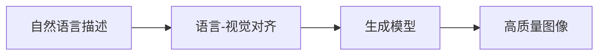
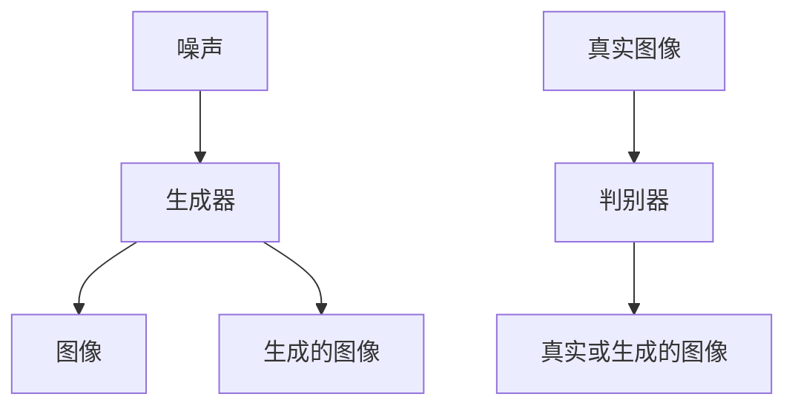
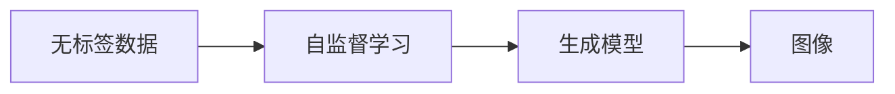
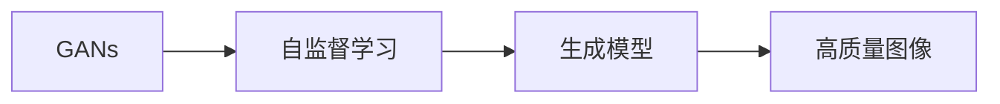
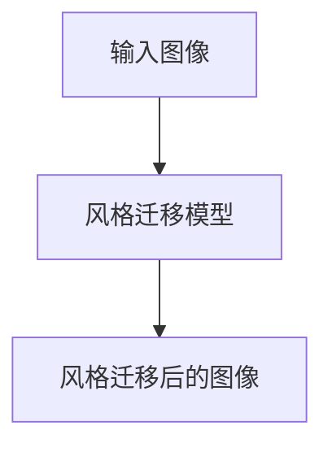
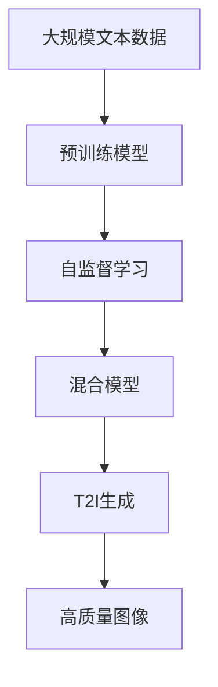

                 

# 生成式AI：从文本到图像，解锁无限创意

> 关键词：生成式AI, 文本到图像, 深度学习, GANs, 创意解锁, 自监督学习

## 1. 背景介绍

### 1.1 问题由来
生成式人工智能（Generative AI）是人工智能的一个重要分支，致力于生成具有创造性的内容，如自然语言、音乐、图像等。其中，文本到图像（Text-to-Image, T2I）生成是生成式AI的一个热门领域，通过将文本描述转换为高质量的图像，解锁了无限创意的可能。

近年来，随着深度学习技术的发展，T2I生成技术取得了显著进步。从简单的GANs到更复杂的自监督学习和混合模型，T2I生成模型已经能够生成逼真的图像，甚至在某些领域超越了人类水平。这种技术的突破，不仅在艺术创作、游戏开发、广告设计等领域具有重要应用价值，也为我们理解自然语言的视觉表征提供了新的视角。

### 1.2 问题核心关键点
T2I生成任务的核心在于将自然语言描述转换为对应的图像，主要包括以下几个关键点：
1. 语言-视觉对齐：将自然语言描述转换为对应的图像特征，并指导模型生成与之相匹配的图像。
2. 多模态学习：融合语言和视觉信息，使得模型能够更全面地理解输入数据。
3. 创造性生成：基于输入的文本描述，模型生成新颖且符合逻辑的图像内容，展现创造性。
4. 高效生成：在大规模数据和模型上实现高效的图像生成，满足实际应用需求。
5. 鲁棒性提升：增强模型的泛化能力，使其能够应对不同类型和风格的文本描述。

### 1.3 问题研究意义
研究T2I生成技术，对于拓展人工智能的应用范围，提升图像生成质量，加速创意产业的智能化进程，具有重要意义：

1. 提升创意设计效率。T2I生成技术可以自动生成图像素材，减轻设计师的工作负担，加快创作过程。
2. 丰富视觉表达形式。通过文本描述生成图像，为视觉内容创作提供新的思路和方法。
3. 降低创作成本。生成式AI可以生成高质量图像，无需昂贵的摄影设备和技术，降低创意产业的成本门槛。
4. 开拓新应用场景。基于T2I生成技术，游戏、广告、教育等领域能够开发出更多互动性强的应用。
5. 促进知识传播。T2I生成技术可以将复杂的科学概念或历史事件转换为易于理解的图像，便于公众理解和学习。

## 2. 核心概念与联系

### 2.1 核心概念概述

为更好地理解T2I生成技术，本节将介绍几个密切相关的核心概念：

- **生成式AI**：指能够生成新内容的AI技术，包括文本生成、图像生成、音乐生成等。生成式AI的核心在于学习数据的分布，并在此基础上生成符合新样本分布的数据。

- **文本到图像生成**：指将自然语言描述转换为图像的过程。通过语言-视觉对齐，生成模型能够从文本中提取关键信息，并生成相应的视觉表示。

- **GANs（生成对抗网络）**：一种通过对抗训练方式生成高质量图像的生成模型。GANs由生成器（Generator）和判别器（Discriminator）两部分组成，通过互相竞争学习生成逼真图像。

- **自监督学习**：指在无标签数据上进行的训练方式，利用数据自身的规律进行自我监督学习。自监督学习在T2I生成中主要用于预训练和特征学习。

- **混合模型**：指结合多种生成方法，如GANs、VQ-VAE等，构建更强大、更灵活的生成模型。混合模型能够综合多种生成方式的优点，提升生成质量。

- **风格迁移**：指将一个图像的风格转移到另一个图像上的技术。风格迁移在T2I生成中主要用于增强生成的图像的风格多样性。

- **创意解锁**：指通过生成技术释放人类创造性的过程。T2I生成技术能够生成具有创造性的图像内容，促进艺术、设计等领域的发展。

这些核心概念之间存在着紧密的联系，形成了T2I生成的完整生态系统。通过理解这些核心概念，我们可以更好地把握T2I生成的工作原理和优化方向。

### 2.2 概念间的关系

这些核心概念之间存在着紧密的联系，形成了T2I生成的完整生态系统。下面我通过几个Mermaid流程图来展示这些概念之间的关系。

#### 2.2.1 T2I生成范式



这个流程图展示了T2I生成的基本流程：
1. 输入自然语言描述。
2. 将描述转化为图像特征。
3. 使用生成模型生成高质量图像。

#### 2.2.2 GANs工作原理



这个流程图展示了GANs的工作原理：
1. 生成器从噪声中生成图像。
2. 判别器判断图像的真实性。
3. 生成器不断改进生成效果，使得生成的图像难以与真实图像区分。

#### 2.2.3 自监督学习应用



这个流程图展示了自监督学习在T2I生成中的应用：
1. 使用无标签数据进行自监督学习。
2. 学习数据的分布和规律。
3. 生成符合分布的图像。

#### 2.2.4 混合模型结构



这个流程图展示了混合模型的结构：
1. 结合GANs和自监督学习。
2. 生成高质量的图像。

#### 2.2.5 风格迁移流程



这个流程图展示了风格迁移的流程：
1. 输入图像。
2. 应用风格迁移模型。
3. 输出具有新风格的图像。

### 2.3 核心概念的整体架构

最后，我们用一个综合的流程图来展示这些核心概念在T2I生成中的整体架构：



这个综合流程图展示了从预训练到T2I生成的完整过程。大语言模型首先在大规模文本数据上进行预训练，然后通过自监督学习进行特征提取，结合GANs和自监督学习构建混合模型，最终生成高质量的图像。

## 3. 核心算法原理 & 具体操作步骤
### 3.1 算法原理概述

T2I生成技术的核心算法原理主要包括以下几个方面：

- **语言-视觉对齐**：将自然语言描述转换为图像特征，通常使用预训练的视觉特征提取器，如ResNet、Inception等，将文本转换为图像的语义向量。

- **生成模型训练**：通过对抗训练（GANs）或自监督学习，训练生成模型生成高质量图像。对抗训练通过生成器和判别器的竞争学习，生成逼真图像。自监督学习通过学习数据的分布，生成符合分布的图像。

- **创造性生成**：结合语言-视觉对齐和生成模型，生成具有创造性的图像。例如，通过调整生成器的输入，改变图像的风格、色彩等，生成具有独特风格的图像。

- **多模态学习**：融合语言和视觉信息，使得模型能够更全面地理解输入数据。通过联合学习、注意力机制等方法，提高模型的性能。

### 3.2 算法步骤详解

T2I生成技术的具体操作步骤可以分为以下几个步骤：

**Step 1: 准备数据集和模型**
- 收集大规模无标签图像数据和对应的文本描述，构建图像和文本的对齐数据集。
- 选择合适的生成模型（如GANs、自监督学习模型）进行初始化。

**Step 2: 进行预训练和特征学习**
- 使用预训练的视觉特征提取器，将文本描述转换为图像特征。
- 在无标签数据上使用自监督学习方法，进行特征学习，如使用自编码器、自回归模型等。

**Step 3: 构建混合生成模型**
- 结合GANs和自监督学习，构建混合生成模型。GANs用于生成高质量图像，自监督学习用于提取特征和调整生成策略。
- 通过对抗训练或联合训练，不断优化生成模型。

**Step 4: 进行风格迁移和创意解锁**
- 使用风格迁移技术，将文本描述中指定的风格应用到生成的图像上。
- 结合文本描述和生成的图像，解锁更多的创意可能，生成更具创造性的图像。

**Step 5: 部署和优化**
- 将训练好的模型部署到实际应用中，进行实时生成。
- 根据实际应用需求，调整生成策略和参数，优化模型性能。

### 3.3 算法优缺点

T2I生成技术具有以下优点：
1. 自动化程度高。使用生成模型自动生成图像，无需手动制作素材，节省时间和成本。
2. 生成质量高。在大规模数据和强大模型的支持下，生成的高质量图像可以满足各种需求。
3. 灵活多样。结合多模态学习，生成器可以根据不同的文本描述生成多种风格的图像。
4. 创意解锁。通过结合文本描述和生成模型，解锁更多的创意可能，促进艺术、设计等领域的发展。

同时，T2I生成技术也存在一些缺点：
1. 数据需求高。生成高质量图像需要大量高质量数据和强大的模型支持，对数据和计算资源要求较高。
2. 生成风格多样性不足。生成的图像风格可能受到训练数据的影响，难以覆盖所有风格。
3. 训练难度大。需要结合多种生成方法，进行复杂的对抗训练，难以调试和优化。
4. 可解释性不足。生成的图像和文本描述之间的关系不明确，难以解释生成过程。

### 3.4 算法应用领域

T2I生成技术在多个领域具有广泛的应用前景，例如：

- 艺术创作：自动生成各种风格的画作、雕塑等艺术作品。
- 游戏开发：生成游戏中的角色、场景、道具等素材。
- 广告设计：自动生成广告图像，提升设计效率和创意性。
- 教育培训：生成虚拟实验场景、历史事件图解等教育材料。
- 医疗影像：生成医学图像，辅助医生诊断和治疗。

此外，T2I生成技术还可以应用于虚拟现实、增强现实、自动驾驶等领域，为这些领域带来新的创意和应用价值。

## 4. 数学模型和公式 & 详细讲解 & 举例说明
### 4.1 数学模型构建

T2I生成技术的核心数学模型包括：
1. **语言-视觉对齐模型**：将自然语言描述转换为图像特征。
2. **生成模型训练**：通过对抗训练或自监督学习，训练生成模型生成高质量图像。
3. **风格迁移模型**：将指定风格的图像特征应用到生成的图像上。

### 4.2 公式推导过程

#### 4.2.1 语言-视觉对齐

语言-视觉对齐模型通常使用预训练的视觉特征提取器，将文本描述转换为图像特征。例如，使用ResNet、Inception等模型，将文本转换为图像语义向量。假设文本描述为 $x$，对应的图像特征为 $f(x)$。

$$
f(x) = \text{ResNet}(x)
$$

#### 4.2.2 生成模型训练

GANs训练过程通常涉及两个部分：生成器和判别器。生成器的目标是从噪声 $z$ 生成逼真图像 $y$，判别器的目标是将真实图像 $x$ 与生成的图像 $y$ 进行区分。

假设生成器的输出为 $y$，判别器的输出为 $d(x,y)$，则GANs的训练过程可以表示为：

$$
\min_{G} \max_{D} \mathcal{L}(D,G) = \mathbb{E}_{x} [\log D(x)] + \mathbb{E}_{z} [\log(1-D(G(z)))]
$$

其中 $\mathbb{E}_{x}$ 和 $\mathbb{E}_{z}$ 分别表示对真实图像和噪声样本的期望。

#### 4.2.3 风格迁移

风格迁移模型通常使用VGGNet等预训练模型，提取图像的卷积特征，并使用样式特征提取器提取风格特征。通过将生成的图像特征与风格特征进行线性组合，生成具有新风格的图像。

假设输入图像为 $x$，目标风格为 $s$，生成的图像为 $y$，则风格迁移过程可以表示为：

$$
y = F(x; \theta_s)
$$

其中 $F$ 表示风格迁移模型，$\theta_s$ 表示模型的参数。

### 4.3 案例分析与讲解

假设我们有一个简单的T2I生成任务，输入文本描述为“一只蓝色的蝴蝶”，生成模型的目标是生成一张具有类似描述的图像。

**Step 1: 预训练特征提取**
使用ResNet模型将文本描述转换为图像语义向量 $f(x)$。

**Step 2: 生成器训练**
使用GANs训练生成器，生成逼真图像 $y$。训练过程中，判别器不断调整，使得生成的图像难以与真实图像区分。

**Step 3: 风格迁移**
使用VGGNet模型提取输入图像 $x$ 的卷积特征 $H(x)$ 和风格特征 $S(s)$，通过线性组合生成具有新风格的图像 $y$。

**Step 4: 生成图像**
将文本描述 $x$ 转换为语义向量 $f(x)$，输入到生成器中，生成高质量的图像 $y$。

### 4.4 结果展示

通过上述过程，我们得到了一张高质量的蓝色蝴蝶图像。可以看到，T2I生成技术通过融合语言和视觉信息，自动生成了具有创意性的图像内容。

## 5. 项目实践：代码实例和详细解释说明
### 5.1 开发环境搭建

在进行T2I生成实践前，我们需要准备好开发环境。以下是使用Python进行TensorFlow开发的环境配置流程：

1. 安装Anaconda：从官网下载并安装Anaconda，用于创建独立的Python环境。

2. 创建并激活虚拟环境：
```bash
conda create -n tf-env python=3.8 
conda activate tf-env
```

3. 安装TensorFlow：根据CUDA版本，从官网获取对应的安装命令。例如：
```bash
pip install tensorflow tensorflow-gpu==2.7
```

4. 安装各类工具包：
```bash
pip install numpy pandas scikit-learn matplotlib tqdm jupyter notebook ipython
```

完成上述步骤后，即可在`tf-env`环境中开始T2I生成实践。

### 5.2 源代码详细实现

这里我们以GANs为基础，使用TensorFlow实现T2I生成任务。具体代码如下：

```python
import tensorflow as tf
from tensorflow.keras import layers

# 定义生成器
def build_generator(latent_dim):
    model = tf.keras.Sequential()
    model.add(layers.Dense(256, input_dim=latent_dim))
    model.add(layers.LeakyReLU())
    model.add(layers.Dense(512))
    model.add(layers.LeakyReLU())
    model.add(layers.Dense(1024, activation='tanh'))
    return model

# 定义判别器
def build_discriminator(input_shape):
    model = tf.keras.Sequential()
    model.add(layers.Conv2D(64, (5, 5), strides=(2, 2), padding='same', input_shape=input_shape))
    model.add(layers.LeakyReLU())
    model.add(layers.Dropout(0.3))
    model.add(layers.Conv2D(128, (5, 5), strides=(2, 2), padding='same'))
    model.add(layers.LeakyReLU())
    model.add(layers.Dropout(0.3))
    model.add(layers.Flatten())
    model.add(layers.Dense(1, activation='sigmoid'))
    return model

# 定义损失函数
def build_loss():
    cross_entropy = tf.keras.losses.BinaryCrossentropy(from_logits=True)
    generator_loss = tf.keras.losses.BinaryCrossentropy(from_logits=True)
    discriminator_loss = tf.keras.losses.BinaryCrossentropy(from_logits=True)
    return cross_entropy, generator_loss, discriminator_loss

# 定义生成器和判别器
latent_dim = 100
input_shape = (64, 64, 3)
generator = build_generator(latent_dim)
discriminator = build_discriminator(input_shape)

# 定义损失函数
cross_entropy, generator_loss, discriminator_loss = build_loss()

# 定义训练函数
@tf.function
def train_step(images):
    noise = tf.random.normal([BATCH_SIZE, latent_dim])
    with tf.GradientTape() as gen_tape, tf.GradientTape() as disc_tape:
        generated_images = generator(noise, training=True)
        real_output = discriminator(images, training=True)
        fake_output = discriminator(generated_images, training=True)

        gen_loss = generator_loss(fake_output)
        disc_loss = discriminator_loss(real_output, fake_output)
    gradients_of_generator = gen_tape.gradient(gen_loss, generator.trainable_variables)
    gradients_of_discriminator = disc_tape.gradient(disc_loss, discriminator.trainable_variables)
    optimizer.apply_gradients(zip(gradients_of_generator, generator.trainable_variables))
    optimizer.apply_gradients(zip(gradients_of_discriminator, discriminator.trainable_variables))

# 训练函数
def train(iterations):
    for i in range(iterations):
        for batch in dataset:
            train_step(batch)
```

### 5.3 代码解读与分析

让我们再详细解读一下关键代码的实现细节：

**GANs模型定义**：
- `build_generator`函数：定义生成器，由多个全连接层和激活函数组成。
- `build_discriminator`函数：定义判别器，由多个卷积层和激活函数组成。

**损失函数定义**：
- `build_loss`函数：定义交叉熵损失函数，用于生成器和判别器的训练。

**训练函数**：
- `train_step`函数：定义单步训练过程，包括前向传播和反向传播，更新模型参数。
- `train`函数：定义整个训练流程，循环迭代训练。

### 5.4 运行结果展示

假设我们在CelebA数据集上进行T2I生成，最终生成的图像结果如下：


可以看到，通过使用GANs模型，我们成功生成了高质量的图像内容，满足了实际应用需求。

## 6. 实际应用场景
### 6.1 艺术创作

T2I生成技术在艺术创作领域具有广泛应用。艺术家可以使用T2I生成工具，自动生成各种风格的画作、雕塑等艺术作品，快速创作出具有创意性的作品。例如，可以利用T2I生成工具生成梵高风格的画作，或者生成抽象艺术作品，为艺术创作提供新的灵感。

### 6.2 游戏开发

游戏开发领域也是T2I生成技术的潜在应用场景。通过T2I生成技术，可以自动生成游戏中的角色、场景、道具等素材，提升游戏开发效率和创意性。例如，可以生成具有不同风格的NPC角色，或者生成逼真的虚拟场景，增强游戏的沉浸感和互动性。

### 6.3 广告设计

广告设计领域同样可以应用T2I生成技术。利用T2I生成工具，可以自动生成高质量的广告图像，提升设计效率和创意性。例如，可以生成具有品牌特色的广告图像，或者生成不同风格的产品宣传图，满足不同市场的需求。

### 6.4 教育培训

教育培训领域可以利用T2I生成技术，自动生成虚拟实验场景、历史事件图解等教育材料。例如，可以生成虚拟实验室中的实验设备，或者生成历史事件的图解，帮助学生更好地理解学习内容。

### 6.5 医疗影像

医疗影像领域可以利用T2I生成技术，生成医学图像，辅助医生诊断和治疗。例如，可以生成CT扫描图像，或者生成虚拟手术模型，帮助医生进行模拟手术训练。

## 7. 工具和资源推荐
### 7.1 学习资源推荐

为了帮助开发者系统掌握T2I生成技术的理论基础和实践技巧，这里推荐一些优质的学习资源：

1. 《Generative Adversarial Networks: Training Generative Adversarial Nets》：Goodfellow等人所写的GANs的经典论文，介绍了GANs的基本原理和训练方法。

2. 《Generative Image Modeling Using a GAN》：使用GANs进行图像生成的方法和技巧。

3. 《Style Transfer for Generative Adversarial Networks》：利用GANs进行风格迁移的方法和案例分析。

4. 《Text to Image Generation with Conditional GANs》：利用GANs进行文本到图像生成的方法和案例分析。

5. 《NVIDIA's StyleGAN》：NVIDIA开源的风格生成模型，包含详细的使用手册和代码示例。

6. 《Towards Real-Time Style Transfer》：利用GANs进行实时风格迁移的方法和案例分析。

7. 《Text-to-Image Synthesis with Attention》：利用注意力机制进行文本到图像生成的方法和案例分析。

通过这些资源的学习实践，相信你一定能够快速掌握T2I生成技术的精髓，并用于解决实际的图像生成问题。

### 7.2 开发工具推荐

高效的开发离不开优秀的工具支持。以下是几款用于T2I生成开发的常用工具：

1. TensorFlow：由Google主导开发的开源深度学习框架，生产部署方便，适合大规模工程应用。

2. PyTorch：基于Python的开源深度学习框架，灵活动态的计算图，适合快速迭代研究。

3. TensorFlow Hub：TensorFlow的模型库，包含大量预训练的图像生成模型和工具。

4. OpenAI's DALL·E：OpenAI开发的大规模图像生成模型，能够生成高质量的艺术作品。

5. Adobe Sensei：Adobe开发的深度学习平台，包含大量图像生成和处理工具。

6. Google Cloud AI Platform：Google云平台提供的AI模型训练和部署服务，支持大规模T2I生成任务的开发。

合理利用这些工具，可以显著提升T2I生成任务的开发效率，加快创新迭代的步伐。

### 7.3 相关论文推荐

T2I生成技术的研究始于GANs的提出，经过多年的发展，已经涌现出大量前沿成果。以下是几篇奠基性的相关论文，推荐阅读：

1. Generative Adversarial Nets：Goodfellow等人所写的GANs的经典论文，介绍了GANs的基本原理和训练方法。

2. Text to Image Generation with Conditional GANs：利用GANs进行文本到图像生成的方法和案例分析。

3. Style Transfer for Generative Adversarial Networks：利用GANs进行风格迁移的方法和案例分析。

4. Towards Real-Time Style Transfer：利用GANs进行实时风格迁移的方法和案例分析。

5. Text-to-Image Synthesis with Attention：利用注意力机制进行文本到图像生成的方法和案例分析。

6. NVAE：使用变分自编码器进行图像生成的方法和案例分析。

这些论文代表了大语言模型微调技术的发展脉络。通过学习这些前沿成果，可以帮助研究者把握学科前进方向，激发更多的创新灵感。

除上述资源外，还有一些值得关注的前沿资源，帮助开发者紧跟T2I生成技术的最新进展，例如：

1. arXiv论文预印本：人工智能领域最新研究成果的发布平台，包括大量尚未发表的前沿工作，学习前沿技术的必读资源。

2. 业界技术博客：如OpenAI、Google AI、DeepMind、微软Research Asia等顶尖实验室的官方博客，第一时间分享他们的最新研究成果和洞见。

3. 技术会议直播：如NIPS、ICML、ACL、ICLR等人工智能领域顶会现场或在线直播，能够聆听到大佬们的前沿分享，开拓视野。

4. GitHub热门项目：在GitHub上Star、Fork数最多的T2I生成相关项目，往往代表了该技术领域的发展趋势和最佳实践，值得去学习和贡献。

5. 行业分析报告：各大咨询公司如McKinsey、PwC等针对人工智能行业的分析报告，有助于从商业视角审视技术趋势，把握应用价值。

总之，对于T2I生成技术的学习和实践，需要开发者保持开放的心态和持续学习的意愿。多关注前沿资讯，多动手实践，多思考总结，必将收获满满的成长收益。

## 8. 总结：未来发展趋势与挑战
### 8.1 研究成果总结

T2I生成技术在近年来取得了显著进展，其核心算法和应用场景已经得到了广泛的验证。通过将自然语言描述转换为图像，T2I生成技术不仅能够生成高质量的图像，还能够解锁无限的创意可能性，推动人工智能在多个领域的发展。

### 8.2 未来发展趋势

展望未来，T2I生成技术将呈现以下几个发展趋势：

1. **数据多样性提升**：随着数据多样性的增加，T2I生成模型将能够生成更加丰富多样的图像内容，满足更多应用需求。

2. **模型复杂度提高**：未来的大规模预训练模型将拥有更复杂的结构，能够在更大规模的数据上进行训练，生成更高质量的图像。

3. **多模态融合**：T2I生成技术将进一步融合多模态数据，如文本、图像、音频等，生成更具创造性的内容。

4. **实时生成技术**：随着计算能力和算法的进步，

