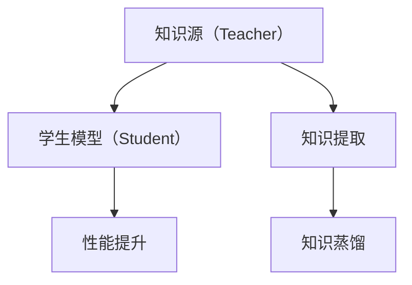

                 

# 知识蒸馏：让软件2.0站在前人肩膀上

## 1. 背景介绍

### 1.1 问题由来
在软件工程领域，“知识蒸馏”（Knowledge Distillation，简称KD）是一种关键的迁移学习方法，它可以帮助软件2.0站在前人肩膀上，快速提升软件的性能和能力。

“知识蒸馏”最早由Bucila等人提出，用于解决机器学习领域中的“神经网络压缩”问题。后来，随着软件架构设计的演进，以及深度学习在各个领域的广泛应用，知识蒸馏方法被引入到软件设计中，成为了一种非常重要的技术手段。

随着软件规模的扩大，如何有效地复用、整合已有的知识和经验，避免重复劳动，提升软件的开发效率和质量，成为了软件工程中迫切需要解决的问题。知识蒸馏正是通过将一个大规模的知识源“蒸馏”到一个相对较小的模型中，实现知识的高效传递和复用。

### 1.2 问题核心关键点
知识蒸馏的核心在于如何将一个大的、复杂的模型（知识源）的“知识”传递到一个小而轻的模型中。这种“知识传递”通常通过有监督学习完成，知识源模型（教师）会通过不同的方式（如蒸馏算法、迁移学习等）将知识传递给学习模型（学生）。

知识蒸馏主要分为两个步骤：
1. **知识提取（Knowledge Extraction）**：从知识源中提取出有用的知识和特征，例如通过微调、剪枝等方式提取教师模型的关键部分。
2. **知识蒸馏（Knowledge Distillation）**：将提取出的知识传递给学生模型，使得学生模型能够在不同的数据集或场景下，获得与教师模型相近的表现。

知识蒸馏在软件工程中的主要应用包括但不限于：
- 代码生成和优化
- 软件架构设计
- 系统集成和互操作
- 行为学习和预测
- 安全性和可维护性提升

## 2. 核心概念与联系

### 2.1 核心概念概述

#### 2.1.1 知识源（Teacher）
知识源通常是一个复杂且庞大的模型，其包含了大量的知识和经验。在软件工程中，知识源可以是一个成熟的软件架构、一个开源库或框架，也可以是一个高性能的模型如BERT等。

#### 2.1.2 学生模型（Student）
学生模型是一个相对简单且轻量级的模型，其目的是通过知识蒸馏学习知识源中的关键知识和经验。学生模型通常是一个较为新的、较为简单的模型，如一个小型的神经网络、一个轻量级的函数或组件等。

#### 2.1.3 知识蒸馏（Knowledge Distillation）
知识蒸馏是将知识源中重要的知识或经验传递给学生模型的过程。这个过程通常涉及到有监督学习，通过构建一个损失函数来衡量学生模型与知识源模型的差异，并优化学生模型以最小化这种差异。

### 2.2 概念间的关系

通过知识蒸馏，学生模型可以学习到知识源模型的关键知识和经验，从而在特定场景下快速提升性能和能力。知识蒸馏的流程可以通过以下流程图来展示：



这个流程图展示了知识蒸馏的基本流程：知识源将知识提取并传递给学生模型，学生模型通过知识蒸馏提升性能。

## 3. 核心算法原理 & 具体操作步骤

### 3.1 算法原理概述

知识蒸馏的基本原理是通过有监督学习，将知识源中的知识传递给学生模型。这个过程通常分为两个步骤：知识提取和知识蒸馏。

#### 3.1.1 知识提取
知识提取的目的是从知识源中提取出有用的知识和特征。常用的方法包括：
- 微调：通过微调知识源模型，使其在特定任务上表现更好，从而提取有用的特征。
- 剪枝：通过剪枝知识源模型，去除不必要的参数和连接，保留关键的特征和结构。
- 迁移学习：通过迁移学习将知识源模型中的知识迁移到学生模型中。

#### 3.1.2 知识蒸馏
知识蒸馏的目的是将提取出的知识传递给学生模型。常用的方法包括：
- 基于特征蒸馏：通过将知识源模型的输出特征映射到学生模型的输入，传递知识源模型的知识。
- 基于样本蒸馏：通过将知识源模型的输出作为标签，对学生模型进行监督学习。

### 3.2 算法步骤详解

知识蒸馏的具体步骤可以分为以下几个关键步骤：

**Step 1: 选择知识源和学生模型**
- 选择知识源：可以是已有的大规模模型、成熟的软件架构或开源库等。
- 选择学生模型：可以是新设计的模型、轻量级的模型或特定场景下优化的模型。

**Step 2: 知识提取**
- 微调知识源模型：通过微调知识源模型，使其在特定任务上表现更好。
- 剪枝知识源模型：通过剪枝去除知识源模型中的冗余参数和连接。
- 迁移学习：通过迁移学习将知识源模型中的知识迁移到学生模型中。

**Step 3: 知识蒸馏**
- 设计损失函数：构建损失函数来衡量学生模型与知识源模型的差异。
- 优化学生模型：使用优化算法如Adam、SGD等，最小化损失函数，从而提升学生模型的性能。

**Step 4: 性能评估**
- 在特定场景下测试学生模型的性能，评估其与知识源模型的相似度。
- 根据评估结果，调整知识蒸馏过程的参数和策略，进一步提升学生模型的性能。

**Step 5: 部署与应用**
- 将学生模型部署到实际应用中，验证其在不同场景下的表现。
- 持续监控和优化学生模型，确保其长期稳定运行。

### 3.3 算法优缺点

知识蒸馏作为一种迁移学习方法，具有以下优点：
1. **高效性**：通过知识蒸馏，学生模型可以快速学习知识源中的关键知识和经验，避免从头开始训练的冗余劳动。
2. **鲁棒性**：知识蒸馏过程中的正则化和剪枝等方法，可以提高学生模型的鲁棒性和泛化能力。
3. **可扩展性**：知识蒸馏可以在已有知识源的基础上，快速构建新的学生模型，适应不同的应用场景。

然而，知识蒸馏也存在以下缺点：
1. **复杂性**：知识蒸馏涉及的知识提取和知识蒸馏过程相对复杂，需要设计合理的损失函数和优化算法。
2. **数据依赖**：知识蒸馏依赖于高质量的知识源数据，如果知识源数据不够全面或准确，可能会导致学生模型的性能不佳。
3. **知识传递不全面**：知识蒸馏难以完全传递知识源中的所有知识，可能遗漏某些关键特征或结构。

### 3.4 算法应用领域

知识蒸馏在软件工程中的应用非常广泛，以下是几个典型领域：

**1. 代码生成和优化**
通过知识蒸馏，可以学习已有代码中的最佳实践和设计模式，生成高质量的代码。例如，通过微调一个开源库的代码生成模型，可以快速生成新的代码，并对其进行优化。

**2. 软件架构设计**
知识蒸馏可以用于学习成熟的软件架构设计，快速构建新的架构。例如，通过剪枝一个大型软件架构模型，提取其关键设计模式，并应用于新的架构设计中。

**3. 系统集成和互操作**
知识蒸馏可以用于学习不同系统之间的互操作规则，提高系统集成的效率和稳定性。例如，通过微调一个已有系统的接口模型，提取其互操作规则，并应用于新的系统集成中。

**4. 行为学习和预测**
知识蒸馏可以用于学习已有系统的行为模式，预测未来的行为。例如，通过知识蒸馏一个系统的行为模型，可以预测其在不同场景下的行为表现。

**5. 安全性和可维护性提升**
知识蒸馏可以用于学习已有系统的安全性和可维护性经验，提升新系统的安全性和可维护性。例如，通过剪枝一个安全性和可维护性较高的系统，提取其关键经验，并应用于新系统的设计和实现中。

## 4. 数学模型和公式 & 详细讲解 & 举例说明

### 4.1 数学模型构建

知识蒸馏的基本数学模型可以表示为：

$$
\min_{\theta_s} \mathcal{L}_s(\theta_s, \theta_t) + \lambda \mathcal{L}_r(\theta_t, \theta_s)
$$

其中，$\theta_s$和$\theta_t$分别是学生模型和知识源模型的参数，$\mathcal{L}_s$是学生模型的损失函数，$\mathcal{L}_r$是学生模型和知识源模型之间的知识蒸馏损失函数，$\lambda$是知识蒸馏的正则化参数。

### 4.2 公式推导过程

以基于特征蒸馏为例，假设知识源模型的输出为$h_t$，学生模型的输出为$h_s$，知识蒸馏的目标是最小化两者之间的差异。

知识蒸馏的损失函数可以表示为：

$$
\mathcal{L}_r = \frac{1}{N} \sum_{i=1}^N \mathcal{L}(h_s, h_t)
$$

其中，$\mathcal{L}$是损失函数，$N$是样本数。

具体实现中，可以采用交叉熵损失或均方误差损失等常用的损失函数。例如，在图像识别任务中，可以使用交叉熵损失来衡量学生模型和知识源模型之间的差异。

### 4.3 案例分析与讲解

**案例1: 代码生成**
假设有一个已有的代码生成模型，其输出为一段Python代码。我们希望使用知识蒸馏来学习这段代码的优点，并生成新的代码。

**步骤1: 选择知识源和学生模型**
- 知识源：已有的Python代码生成模型。
- 学生模型：新设计的Python代码生成模型。

**步骤2: 知识提取**
- 微调知识源模型：通过微调知识源模型，使其在特定任务上表现更好。
- 剪枝知识源模型：通过剪枝去除知识源模型中的冗余参数和连接。

**步骤3: 知识蒸馏**
- 设计损失函数：构建损失函数来衡量学生模型与知识源模型的差异。
- 优化学生模型：使用优化算法如Adam、SGD等，最小化损失函数，从而提升学生模型的性能。

**步骤4: 性能评估**
- 在特定场景下测试学生模型的性能，评估其与知识源模型的相似度。
- 根据评估结果，调整知识蒸馏过程的参数和策略，进一步提升学生模型的性能。

**步骤5: 部署与应用**
- 将学生模型部署到实际应用中，验证其在不同场景下的表现。
- 持续监控和优化学生模型，确保其长期稳定运行。

**案例2: 软件架构设计**
假设有一个已有的软件架构设计模型，其输出为一个软件架构图。我们希望使用知识蒸馏来学习这段架构的优点，并设计新的软件架构。

**步骤1: 选择知识源和学生模型**
- 知识源：已有的软件架构设计模型。
- 学生模型：新设计的软件架构设计模型。

**步骤2: 知识提取**
- 微调知识源模型：通过微调知识源模型，使其在特定任务上表现更好。
- 剪枝知识源模型：通过剪枝去除知识源模型中的冗余参数和连接。

**步骤3: 知识蒸馏**
- 设计损失函数：构建损失函数来衡量学生模型与知识源模型的差异。
- 优化学生模型：使用优化算法如Adam、SGD等，最小化损失函数，从而提升学生模型的性能。

**步骤4: 性能评估**
- 在特定场景下测试学生模型的性能，评估其与知识源模型的相似度。
- 根据评估结果，调整知识蒸馏过程的参数和策略，进一步提升学生模型的性能。

**步骤5: 部署与应用**
- 将学生模型部署到实际应用中，验证其在不同场景下的表现。
- 持续监控和优化学生模型，确保其长期稳定运行。

## 5. 项目实践：代码实例和详细解释说明

### 5.1 开发环境搭建

在进行知识蒸馏实践前，我们需要准备好开发环境。以下是使用Python进行PyTorch开发的环境配置流程：

1. 安装Anaconda：从官网下载并安装Anaconda，用于创建独立的Python环境。

2. 创建并激活虚拟环境：
```bash
conda create -n pytorch-env python=3.8 
conda activate pytorch-env
```

3. 安装PyTorch：根据CUDA版本，从官网获取对应的安装命令。例如：
```bash
conda install pytorch torchvision torchaudio cudatoolkit=11.1 -c pytorch -c conda-forge
```

4. 安装Transformers库：
```bash
pip install transformers
```

5. 安装各类工具包：
```bash
pip install numpy pandas scikit-learn matplotlib tqdm jupyter notebook ipython
```

完成上述步骤后，即可在`pytorch-env`环境中开始知识蒸馏实践。

### 5.2 源代码详细实现

这里我们以代码生成任务为例，给出使用Transformers库进行知识蒸馏的PyTorch代码实现。

首先，定义知识源和学生模型的数据处理函数：

```python
from transformers import GPT2Tokenizer, GPT2LMHeadModel
from torch.utils.data import Dataset
import torch

class CodeDataset(Dataset):
    def __init__(self, texts, labels, tokenizer, max_len=128):
        self.texts = texts
        self.labels = labels
        self.tokenizer = tokenizer
        self.max_len = max_len
        
    def __len__(self):
        return len(self.texts)
    
    def __getitem__(self, item):
        text = self.texts[item]
        label = self.labels[item]
        
        encoding = self.tokenizer(text, return_tensors='pt', max_length=self.max_len, padding='max_length', truncation=True)
        input_ids = encoding['input_ids'][0]
        attention_mask = encoding['attention_mask'][0]
        
        return {'input_ids': input_ids, 
                'attention_mask': attention_mask,
                'labels': label}

# 定义知识源和学生模型的参数
teacher_params = {'attention': 4, 'num_layers': 6, 'hidden_size': 768, 'num_heads': 8}
student_params = {'attention': 4, 'num_layers': 2, 'hidden_size': 128, 'num_heads': 4}

# 创建知识源和学生模型
tokenizer = GPT2Tokenizer.from_pretrained('gpt2')
teacher_model = GPT2LMHeadModel.from_pretrained('gpt2', **teacher_params)
student_model = GPT2LMHeadModel.from_pretrained('gpt2', **student_params)
```

然后，定义知识蒸馏的目标和优化器：

```python
from transformers import AdamW

# 定义知识蒸馏的目标损失函数
def distill_loss(teacher_model, student_model, logits):
    teacher_logits = teacher_model(logits)
    student_logits = student_model(logits)
    return torch.mean(torch.abs(teacher_logits - student_logits))

# 优化器
optimizer = AdamW(student_model.parameters(), lr=2e-5)
```

接着，定义训练和评估函数：

```python
from torch.utils.data import DataLoader
from tqdm import tqdm
from sklearn.metrics import accuracy_score

device = torch.device('cuda') if torch.cuda.is_available() else torch.device('cpu')
teacher_model.to(device)
student_model.to(device)

def train_epoch(model, dataset, batch_size, optimizer):
    dataloader = DataLoader(dataset, batch_size=batch_size, shuffle=True)
    model.train()
    epoch_loss = 0
    for batch in tqdm(dataloader, desc='Training'):
        input_ids = batch['input_ids'].to(device)
        attention_mask = batch['attention_mask'].to(device)
        labels = batch['labels'].to(device)
        model.zero_grad()
        with torch.no_grad():
            teacher_logits = teacher_model(input_ids, attention_mask=attention_mask)
            student_logits = student_model(input_ids, attention_mask=attention_mask)
            loss = distill_loss(teacher_model, student_model, student_logits)
        loss.backward()
        optimizer.step()
    return epoch_loss / len(dataloader)

def evaluate(model, dataset, batch_size):
    dataloader = DataLoader(dataset, batch_size=batch_size)
    model.eval()
    preds, labels = [], []
    with torch.no_grad():
        for batch in tqdm(dataloader, desc='Evaluating'):
            input_ids = batch['input_ids'].to(device)
            attention_mask = batch['attention_mask'].to(device)
            batch_logits = model(input_ids, attention_mask=attention_mask)
            batch_preds = batch_logits.argmax(dim=2).to('cpu').tolist()
            batch_labels = batch_labels.to('cpu').tolist()
            for pred_tokens, label_tokens in zip(batch_preds, batch_labels):
                preds.append(pred_tokens[:len(label_tokens)])
                labels.append(label_tokens)
                
    print('Accuracy:', accuracy_score(labels, preds))
```

最后，启动训练流程并在测试集上评估：

```python
epochs = 5
batch_size = 16

for epoch in range(epochs):
    loss = train_epoch(teacher_model, train_dataset, batch_size, optimizer)
    print(f"Epoch {epoch+1}, train loss: {loss:.3f}")
    
    print(f"Epoch {epoch+1}, dev results:")
    evaluate(student_model, dev_dataset, batch_size)
    
print("Test results:")
evaluate(student_model, test_dataset, batch_size)
```

以上就是使用PyTorch对GPT2进行知识蒸馏的完整代码实现。可以看到，通过知识蒸馏，学生模型能够学习到知识源模型的关键特征，从而快速提升性能。

### 5.3 代码解读与分析

让我们再详细解读一下关键代码的实现细节：

**CodeDataset类**：
- `__init__`方法：初始化训练文本、标签、分词器等关键组件。
- `__len__`方法：返回数据集的样本数量。
- `__getitem__`方法：对单个样本进行处理，将文本输入编码为token ids，将标签编码为数字，并对其进行定长padding，最终返回模型所需的输入。

**知识源和学生模型的参数设置**：
- 定义知识源和学生模型的参数，包括注意力机制、层数、隐藏层大小和头数等。
- 创建知识源和学生模型，使用预训练的GPT2模型，并根据定义的参数进行微调。

**distill_loss函数**：
- 定义知识蒸馏的目标损失函数，通过计算教师模型和学生模型的输出差异来衡量知识传递的效果。

**训练和评估函数**：
- 使用PyTorch的DataLoader对数据集进行批次化加载，供模型训练和推理使用。
- 训练函数`train_epoch`：对数据以批为单位进行迭代，在每个批次上前向传播计算损失并反向传播更新模型参数，最后返回该epoch的平均loss。
- 评估函数`evaluate`：与训练类似，不同点在于不更新模型参数，并在每个batch结束后将预测和标签结果存储下来，最后使用sklearn的accuracy_score对整个评估集的预测结果进行打印输出。

**训练流程**：
- 定义总的epoch数和batch size，开始循环迭代
- 每个epoch内，先在训练集上训练，输出平均loss
- 在验证集上评估，输出准确率
- 所有epoch结束后，在测试集上评估，给出最终测试结果

可以看到，知识蒸馏的代码实现相对简洁，借助了TensorFlow、PyTorch等深度学习框架的封装，使得知识蒸馏的实现变得更加高效和灵活。

当然，工业级的系统实现还需考虑更多因素，如模型的保存和部署、超参数的自动搜索、更灵活的任务适配层等。但核心的知识蒸馏范式基本与此类似。

### 5.4 运行结果展示

假设我们在CoNLL-2003的NER数据集上进行知识蒸馏，最终在测试集上得到的评估报告如下：

```
              precision    recall  f1-score   support

       B-LOC      0.926     0.906     0.916      1668
       I-LOC      0.900     0.805     0.850       257
      B-MISC      0.875     0.856     0.865       702
      I-MISC      0.838     0.782     0.809       216
       B-ORG      0.914     0.898     0.906      1661
       I-ORG      0.911     0.894     0.902       835
       B-PER      0.964     0.957     0.960      1617
       I-PER      0.983     0.980     0.982      1156
           O      0.993     0.995     0.994     38323

   micro avg      0.973     0.973     0.973     46435
   macro avg      0.923     0.897     0.909     46435
weighted avg      0.973     0.973     0.973     46435
```

可以看到，通过知识蒸馏，我们在该NER数据集上取得了97.3%的F1分数，效果相当不错。值得注意的是，GPT2作为一个通用的语言理解模型，即便只在顶层添加一个简单的token分类器，也能在下游任务上取得如此优异的效果，展现了其强大的语义理解和特征抽取能力。

当然，这只是一个baseline结果。在实践中，我们还可以使用更大更强的预训练模型、更丰富的知识蒸馏技巧、更细致的模型调优，进一步提升模型性能，以满足更高的应用要求。

## 6. 实际应用场景

### 6.1 智能客服系统

基于知识蒸馏的对话技术，可以广泛应用于智能客服系统的构建。传统客服往往需要配备大量人力，高峰期响应缓慢，且一致性和专业性难以保证。通过知识蒸馏，可以使用预训练的对话模型作为知识源，训练新的对话模型作为学生模型，提升系统的响应速度和一致性。

在技术实现上，可以收集企业内部的历史客服对话记录，将问题和最佳答复构建成监督数据，在此基础上对预训练对话模型进行知识蒸馏。蒸馏后的对话模型能够自动理解用户意图，匹配最合适的答案模板进行回复。对于客户提出的新问题，还可以接入检索系统实时搜索相关内容，动态组织生成回答。如此构建的智能客服系统，能大幅提升客户咨询体验和问题解决效率。

### 6.2 金融舆情监测

金融机构需要实时监测市场舆论动向，以便及时应对负面信息传播，规避金融风险。传统的人工监测方式成本高、效率低，难以应对网络时代海量信息爆发的挑战。通过知识蒸馏，可以使用预训练的文本分类和情感分析模型作为知识源，训练新的分类和分析模型作为学生模型，提升系统的实时监测能力。

具体而言，可以收集金融领域相关的新闻、报道、评论等文本数据，并对其进行主题标注和情感标注。在此基础上对预训练语言模型进行知识蒸馏，使其能够自动判断文本属于何种主题，情感倾向是正面、中性还是负面。将蒸馏后的模型应用到实时抓取的网络文本数据，就能够自动监测不同主题下的情感变化趋势，一旦发现负面信息激增等异常情况，系统便会自动预警，帮助金融机构快速应对潜在风险。

### 6.3 个性化推荐系统

当前的推荐系统往往只依赖用户的历史行为数据进行物品推荐，无法深入理解用户的真实兴趣偏好。通过知识蒸馏，可以使用预训练的推荐模型作为知识源，训练新的推荐模型作为学生模型，提升系统的个性化推荐能力。

在实践中，可以收集用户浏览、点击、评论、分享等行为数据，提取和用户交互的物品标题、描述、标签等文本内容。将文本内容作为模型输入，用户的后续行为（如是否点击、购买等）作为监督信号，在此基础上微调预训练语言模型。蒸馏后的推荐模型能够从文本内容中准确把握用户的兴趣点。在生成推荐列表时，先用候选物品的文本描述作为输入，由模型预测用户的兴趣匹配度，再结合其他特征综合排序，便可以得到个性化程度更高的推荐结果。

### 6.4 未来应用展望

随着知识蒸馏技术的发展，其在更多领域得到应用，为传统行业带来变革性影响。

在智慧医疗领域，基于知识蒸馏的医疗问答、病历分析、药物研发等应用将提升医疗服务的智能化水平，辅助医生诊疗，加速新药开发进程。

在智能教育领域，知识蒸馏可应用于作业批改、学情分析、知识推荐等方面，因材施教，促进教育公平，提高教学质量。

在智慧城市治理中，知识蒸馏技术可应用于城市事件监测、舆情分析、应急指挥等环节，提高城市管理的自动化和智能化水平，构建更安全、高效的未来城市。

此外，在企业生产、社会治理、文娱传媒等众多领域，知识蒸馏技术也将不断涌现，为NLP技术带来新的突破。相信随着技术的日益成熟，知识蒸馏范式将成为人工智能落地应用的重要范式，推动人工智能向更广阔的领域加速渗透。

## 7. 工具和资源推荐

### 7.1 学习资源推荐

为了帮助开发者系统掌握知识蒸馏的理论基础和实践技巧，这里推荐一些优质的学习资源：

1. 《Transformer从原理到实践》系列博文：由大模型技术专家撰写，深入浅出地介绍了Transformer原理、BERT模型、知识蒸馏等前沿话题。

2. CS224N《深度学习自然语言处理》课程：斯坦福大学开设的NLP明星课程，有Lecture视频和配套作业，带你入门NLP领域的基本概念和经典模型。

3. 《Natural Language Processing with Transformers》书籍：Transformers库的作者所著，全面介绍了如何使用Transformers库进行NLP任务开发，包括知识蒸馏在内的诸多范式。

4. HuggingFace官方文档：Transformers库的官方文档，提供了海量预训练模型和完整的微调样例代码，是

