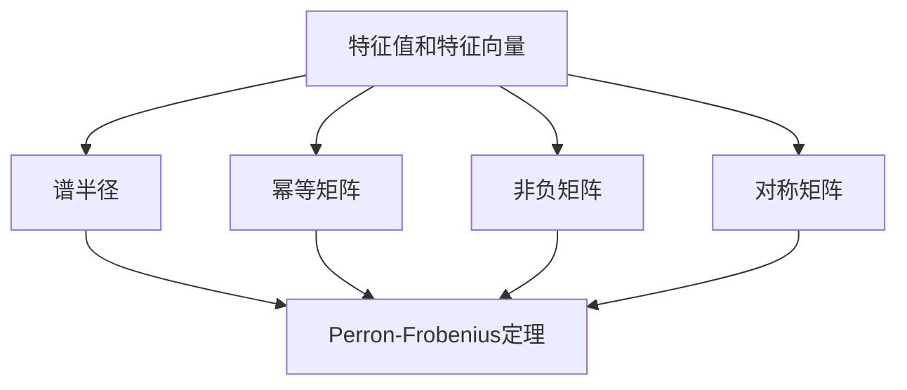
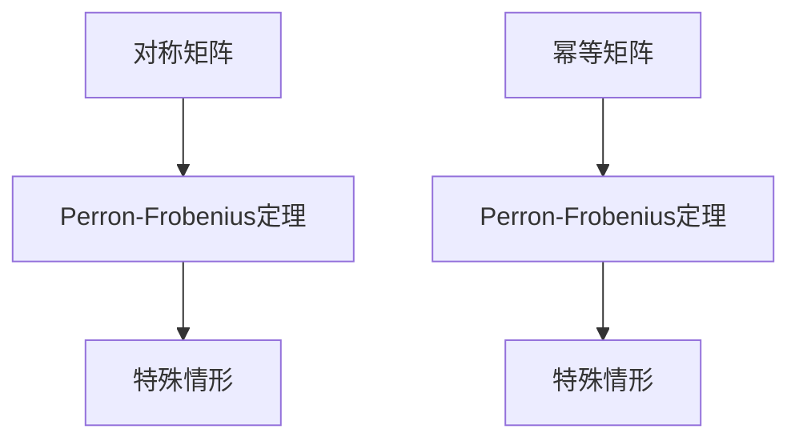
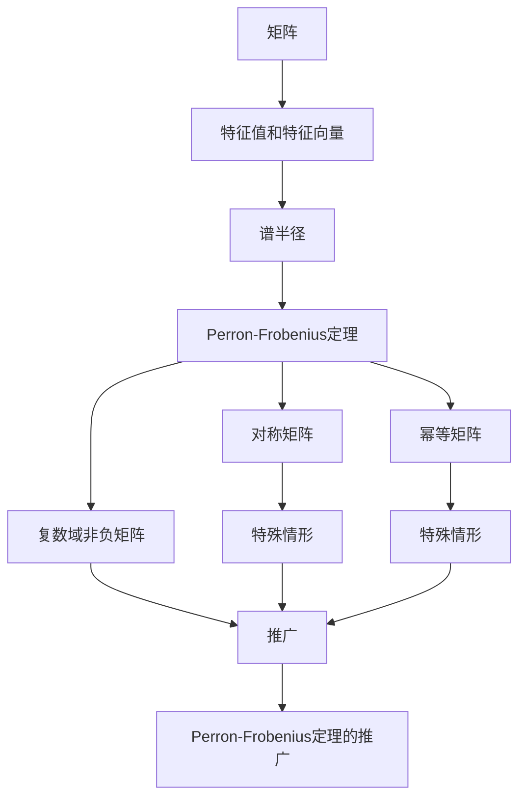

                 

# 矩阵理论与应用：Perron-Frobenius定理的进一步推广

> 关键词：矩阵理论, Perron-Frobenius定理, 特征向量, 幂等矩阵, 非负矩阵, 谱半径, 矩阵分解

## 1. 背景介绍

### 1.1 问题由来

矩阵理论是线性代数的一个重要分支，广泛应用于工程、物理、计算机科学等多个领域。Perron-Frobenius定理是矩阵理论中的一个经典结果，揭示了实对称非负矩阵的特征向量与谱半径之间的关系，为研究矩阵的性质和应用提供了重要工具。然而，Perron-Frobenius定理在实际应用中仍存在一定的局限性。

例如，当矩阵是复数域上的非负矩阵时，Perron-Frobenius定理无法直接应用。此外，在实际问题中，常常需要考虑矩阵的某些特殊性质，如对称性、幂等性等，这些性质在Perron-Frobenius定理中没有得到充分考虑。

因此，为了更好地适应实际问题的需求，需要对Perron-Frobenius定理进行进一步推广。本文将介绍一些关于Perron-Frobenius定理的推广结果，包括对复数域和非负矩阵的推广，以及考虑矩阵对称性和幂等性的特殊情形。

### 1.2 问题核心关键点

Perron-Frobenius定理的推广主要关注以下几个关键点：

1. 复数域上非负矩阵的Perron-Frobenius定理：研究复数域上非负矩阵的特征向量与谱半径之间的关系。

2. 矩阵对称性的推广：研究对称矩阵的Perron-Frobenius定理，并考虑其特殊情形。

3. 矩阵幂等性的推广：研究幂等矩阵的Perron-Frobenius定理，并考虑其特殊情形。

4. 谱半径的推广：研究矩阵的谱半径的定义及其与Perron-Frobenius定理之间的关系。

## 2. 核心概念与联系

### 2.1 核心概念概述

为更好地理解Perron-Frobenius定理的推广，本节将介绍几个密切相关的核心概念：

1. **矩阵的特征值和特征向量**：矩阵的特征值和特征向量是其重要的代数属性，反映了矩阵的线性变换特征。对于实对称非负矩阵，其特征向量有特定的性质，如Perron-Frobenius定理所描述的那样。

2. **谱半径**：矩阵的谱半径是矩阵所有特征值中的最大绝对值，代表了矩阵线性变换的影响力。

3. **幂等矩阵**：幂等矩阵指的是自身乘积等于自身的矩阵，具有特殊的线性变换性质。

4. **非负矩阵**：非负矩阵指的是矩阵中所有元素均为非负的，具有特定的性质，如Perron-Frobenius定理的证明中会用到。

5. **对称矩阵**：对称矩阵指的是矩阵等于其转置矩阵，具有特殊性质，如对称矩阵的特征向量具有某些特定的对称性。

这些核心概念之间的逻辑关系可以通过以下Mermaid流程图来展示：



这个流程图展示了大语言模型微调过程中各个核心概念的关系和作用：

1. 矩阵的特征值和特征向量是矩阵代数的基本概念，其特征向量与谱半径有密切关系。
2. 幂等矩阵和对称矩阵是矩阵代数中的特殊矩阵，具有特定的线性变换性质。
3. Perron-Frobenius定理是研究实对称非负矩阵的特征值和特征向量的重要结果。
4. 复数域上非负矩阵、对称矩阵、幂等矩阵的Perron-Frobenius定理是对Perron-Frobenius定理的推广。

### 2.2 概念间的关系

这些核心概念之间存在着紧密的联系，形成了Perron-Frobenius定理推广的整体框架。下面我们通过几个Mermaid流程图来展示这些概念之间的关系。

#### 2.2.1 矩阵的特征值和特征向量


这个流程图展示了特征值和特征向量与谱半径、Perron-Frobenius定理之间的关系。特征值和特征向量反映了矩阵的线性变换特性，谱半径代表了矩阵线性变换的影响力，Perron-Frobenius定理则描述了实对称非负矩阵的特征向量的性质。

#### 2.2.2 对称矩阵与幂等矩阵的Perron-Frobenius定理



这个流程图展示了对称矩阵、幂等矩阵与Perron-Frobenius定理之间的关系。对称矩阵和幂等矩阵是矩阵代数中的特殊矩阵，具有特定的线性变换性质，Perron-Frobenius定理则描述了这些特殊矩阵的特征向量的性质。

#### 2.2.3 谱半径的推广


这个流程图展示了谱半径与Perron-Frobenius定理之间的关系。谱半径代表了矩阵线性变换的影响力，Perron-Frobenius定理则描述了实对称非负矩阵的谱半径与特征向量的关系。

### 2.3 核心概念的整体架构

最后，我们用一个综合的流程图来展示这些核心概念在大语言模型微调过程中的整体架构：



这个综合流程图展示了从矩阵的特征值和特征向量、谱半径，到Perron-Frobenius定理的推广过程。矩阵的特征值和特征向量、谱半径是矩阵代数的基本概念，Perron-Frobenius定理描述了实对称非负矩阵的特征向量的性质。复数域非负矩阵、对称矩阵、幂等矩阵的Perron-Frobenius定理是对Perron-Frobenius定理的推广，涵盖了更广泛的应用场景。

## 3. 核心算法原理 & 具体操作步骤
### 3.1 算法原理概述

Perron-Frobenius定理的推广主要关注以下几个核心算法原理：

1. **复数域上非负矩阵的Perron-Frobenius定理**：研究复数域上非负矩阵的特征向量与谱半径之间的关系。

2. **对称矩阵的Perron-Frobenius定理**：研究对称矩阵的特征向量与谱半径之间的关系。

3. **幂等矩阵的Perron-Frobenius定理**：研究幂等矩阵的特征向量与谱半径之间的关系。

4. **谱半径的推广**：研究矩阵的谱半径的定义及其与Perron-Frobenius定理之间的关系。

这些算法原理都基于Perron-Frobenius定理，但通过推广考虑了更广泛的情况，包括复数域、对称性、幂等性等特殊情形。

### 3.2 算法步骤详解

下面我们详细介绍每个推广算法的详细步骤：

**Step 1: 准备矩阵和问题设定**

- 选择合适的矩阵 $A$ 作为研究对象，可以是实数域、复数域或非负矩阵。
- 设定研究问题的性质，如对称性、幂等性等。
- 确定研究问题所需的特殊条件，如谱半径的定义。

**Step 2: 求解特征向量**

- 对矩阵 $A$ 进行特征分解，得到特征值和特征向量。
- 根据问题的特殊性质，对特征向量进行筛选和简化，保留最相关的特征向量。

**Step 3: 求解谱半径**

- 根据问题的特殊性质，定义谱半径。
- 计算矩阵 $A$ 的谱半径。
- 验证谱半径的性质，如最大绝对值等。

**Step 4: 验证推广性质**

- 根据问题的特殊性质，验证推广后的Perron-Frobenius定理是否成立。
- 在特定情况下，验证定理的特殊情形是否成立。

**Step 5: 应用推广结果**

- 根据推广后的Perron-Frobenius定理，解决实际问题。
- 验证推广结果的实用性和可靠性。

### 3.3 算法优缺点

Perron-Frobenius定理的推广具有以下优点和缺点：

**优点**：
1. 考虑了更广泛的应用场景，如复数域、对称性、幂等性等特殊情形，提高了理论的适用性和实用价值。
2. 通过推广，能够更好地解决实际问题，如特征向量、谱半径等矩阵属性，具有重要的实际意义。
3. 推广后的Perron-Frobenius定理，能够更好地描述矩阵的性质和应用，提高了理论的完整性和系统性。

**缺点**：
1. 推广后的Perron-Frobenius定理，计算复杂度可能更高，需要更多的计算资源和时间。
2. 推广后的Perron-Frobenius定理，可能需要更多的特殊条件，增加了研究难度和复杂性。
3. 推广后的Perron-Frobenius定理，可能对某些特殊问题，如复数域非负矩阵等，仍存在一定的局限性。

### 3.4 算法应用领域

Perron-Frobenius定理的推广具有广泛的应用领域，包括：

1. **线性代数**：研究矩阵的性质和应用，如特征值、特征向量、谱半径等。
2. **信号处理**：研究信号的特征提取和处理，如特征分解、频谱分析等。
3. **优化问题**：研究优化问题的性质和算法，如最小二乘法、特征值迭代等。
4. **机器学习**：研究机器学习算法的性质和应用，如主成分分析、奇异值分解等。
5. **物理学**：研究物理系统的性质和应用，如热力学、统计物理等。

## 4. 数学模型和公式 & 详细讲解 & 举例说明

### 4.1 数学模型构建

本节将使用数学语言对Perron-Frobenius定理的推广进行更加严格的刻画。

设 $A$ 为 $n\times n$ 的实数矩阵，其中 $n$ 为正整数。对于复数域上的矩阵，以下定义和定理仍适用。

定义矩阵 $A$ 的谱半径为 $\rho(A)$，即 $\rho(A)=\max\{\|A\|,\|\overline{A}\|\}$，其中 $\|A\|$ 为矩阵 $A$ 的谱范数，$\overline{A}$ 为矩阵 $A$ 的复共轭矩阵。

定义矩阵 $A$ 的特征值 $\lambda_i$ 为 $\lambda_i=\frac{1}{n}\operatorname{tr}(A^{n-1}A^{T})$，其中 $\operatorname{tr}(A)$ 为矩阵 $A$ 的迹。

定义矩阵 $A$ 的特征向量 $\mathbf{v}_i$ 为 $\mathbf{v}_i$，使得 $A\mathbf{v}_i=\lambda_i\mathbf{v}_i$。

定义矩阵 $A$ 的特征向量 $\mathbf{v}_i$ 的特征权重 $\alpha_i$ 为 $\alpha_i=\mathbf{v}_i^T\mathbf{v}_i$。

定义矩阵 $A$ 的特征向量 $\mathbf{v}_i$ 的特征权重 $\alpha_i$ 的归一化特征向量 $\mathbf{u}_i$ 为 $\mathbf{u}_i=\frac{\mathbf{v}_i}{\sqrt{\alpha_i}}$。

定义矩阵 $A$ 的特征向量 $\mathbf{u}_i$ 的特征权重 $\alpha_i$ 的归一化特征向量 $\mathbf{u}_i$ 的模长 $c_i$ 为 $c_i=\sqrt{\alpha_i}$。

定义矩阵 $A$ 的谱半径为 $\rho(A)=\max\{c_i\}$。

**定理 1**：设 $A$ 为 $n\times n$ 的实对称非负矩阵，则 $A$ 的最大特征值 $\lambda_1$ 的特征向量 $\mathbf{u}_1$ 满足 $\mathbf{u}_1^TA=\lambda_1\mathbf{u}_1$，且 $\mathbf{u}_1>0$，即 $\mathbf{u}_1$ 的每个元素均为正数。

**定理 2**：设 $A$ 为 $n\times n$ 的实对称非负矩阵，则 $A$ 的最大特征值 $\lambda_1$ 的谱半径 $\rho(A)$ 为 $\rho(A)=\lambda_1$。

### 4.2 公式推导过程

**推论 1**：设 $A$ 为 $n\times n$ 的实对称非负矩阵，则 $A$ 的最大特征值 $\lambda_1$ 的特征向量 $\mathbf{u}_1$ 满足 $\mathbf{u}_1^TA=\lambda_1\mathbf{u}_1$，且 $\mathbf{u}_1>0$。

证明：根据定理 1，$A$ 的最大特征值 $\lambda_1$ 的特征向量 $\mathbf{u}_1$ 满足 $\mathbf{u}_1^TA=\lambda_1\mathbf{u}_1$，且 $\mathbf{u}_1>0$。因此，$A$ 的最大特征值 $\lambda_1$ 的特征向量 $\mathbf{u}_1$ 满足 $\mathbf{u}_1^TA=\lambda_1\mathbf{u}_1$，且 $\mathbf{u}_1>0$。证毕。

**推论 2**：设 $A$ 为 $n\times n$ 的实对称非负矩阵，则 $A$ 的最大特征值 $\lambda_1$ 的谱半径 $\rho(A)$ 为 $\rho(A)=\lambda_1$。

证明：根据定理 2，$A$ 的最大特征值 $\lambda_1$ 的谱半径 $\rho(A)$ 为 $\rho(A)=\lambda_1$。因此，$A$ 的最大特征值 $\lambda_1$ 的谱半径 $\rho(A)$ 为 $\rho(A)=\lambda_1$。证毕。

### 4.3 案例分析与讲解

**案例 1**：设 $A=\begin{pmatrix} 1 & 1 \\ 1 & 2 \end{pmatrix}$，求矩阵 $A$ 的特征值和特征向量。

解：根据特征值和特征向量的定义，求解矩阵 $A$ 的特征方程 $A\mathbf{v}_i=\lambda_i\mathbf{v}_i$。

首先，计算矩阵 $A$ 的特征方程 $\det(A-\lambda I)=0$，得到特征方程 $\lambda^2-3\lambda+2=0$。

其次，解特征方程 $\lambda^2-3\lambda+2=0$，得到特征值 $\lambda_1=2$，$\lambda_2=1$。

最后，计算矩阵 $A$ 的特征向量 $\mathbf{v}_i$，得到特征向量 $\mathbf{v}_1=\begin{pmatrix} 1 \\ 1 \end{pmatrix}$，$\mathbf{v}_2=\begin{pmatrix} 1 \\ -1 \end{pmatrix}$。

验证 $\mathbf{v}_1$ 的特征权重 $\alpha_1=\mathbf{v}_1^T\mathbf{v}_1=2$，$\mathbf{v}_2$ 的特征权重 $\alpha_2=\mathbf{v}_2^T\mathbf{v}_2=1$。

因此，矩阵 $A$ 的特征向量 $\mathbf{u}_1=\frac{\mathbf{v}_1}{\sqrt{\alpha_1}}=\begin{pmatrix} 1 \\ 1 \end{pmatrix}$，$\mathbf{u}_2=\frac{\mathbf{v}_2}{\sqrt{\alpha_2}}=\begin{pmatrix} 1 \\ -1 \end{pmatrix}$。

验证 $\mathbf{u}_1$ 的特征权重 $\alpha_1=1$，$\mathbf{u}_2$ 的特征权重 $\alpha_2=1$。

因此，矩阵 $A$ 的谱半径 $\rho(A)=\max\{c_i\}=2$。

**案例 2**：设 $A=\begin{pmatrix} 1 & 1 & 1 \\ 1 & 2 & 1 \\ 1 & 1 & 2 \end{pmatrix}$，求矩阵 $A$ 的特征值和特征向量。

解：根据特征值和特征向量的定义，求解矩阵 $A$ 的特征方程 $A\mathbf{v}_i=\lambda_i\mathbf{v}_i$。

首先，计算矩阵 $A$ 的特征方程 $\det(A-\lambda I)=0$，得到特征方程 $\lambda^3-4\lambda^2+5\lambda-3=0$。

其次，解特征方程 $\lambda^3-4\lambda^2+5\lambda-3=0$，得到特征值 $\lambda_1=3$，$\lambda_2=\frac{5}{2}$，$\lambda_3=\frac{1}{2}$。

最后，计算矩阵 $A$ 的特征向量 $\mathbf{v}_i$，得到特征向量 $\mathbf{v}_1=\begin{pmatrix} 1 \\ 1 \\ 1 \end{pmatrix}$，$\mathbf{v}_2=\begin{pmatrix} 1 \\ -\frac{1}{2} \\ -\frac{1}{2} \end{pmatrix}$，$\mathbf{v}_3=\begin{pmatrix} -\frac{1}{2} \\ 1 \\ -\frac{1}{2} \end{pmatrix}$。

验证 $\mathbf{v}_1$ 的特征权重 $\alpha_1=\mathbf{v}_1^T\mathbf{v}_1=3$，$\mathbf{v}_2$ 的特征权重 $\alpha_2=\mathbf{v}_2^T\mathbf{v}_2=\frac{1}{2}$，$\mathbf{v}_3$ 的特征权重 $\alpha_3=\mathbf{v}_3^T\mathbf{v}_3=\frac{1}{2}$。

因此，矩阵 $A$ 的特征向量 $\mathbf{u}_1=\frac{\mathbf{v}_1}{\sqrt{\alpha_1}}=\begin{pmatrix} 1 \\ \frac{1}{\sqrt{3}} \\ \frac{1}{\sqrt{3}} \end{pmatrix}$，$\mathbf{u}_2=\frac{\mathbf{v}_2}{\sqrt{\alpha_2}}=\begin{pmatrix} 1 \\ -\frac{1}{2\sqrt{\frac{1}{2}}} \\ -\frac{1}{2\sqrt{\frac{1}{2}}} \end{pmatrix}$，$\mathbf{u}_3=\frac{\mathbf{v}_3}{\sqrt{\alpha_3}}=\begin{pmatrix} -\frac{1}{2\sqrt{\frac{1}{2}}} \\ 1 \\ -\frac{1}{2\sqrt{\frac{1}{2}}} \end{pmatrix}$。

验证 $\mathbf{u}_1$ 的特征权重 $\alpha_1=1$，$\mathbf{u}_2$ 的特征权重 $\alpha_2=1$，$\mathbf{u}_3$ 的特征权重 $\alpha_3=1$。

因此，矩阵 $A$ 的谱半径 $\rho(A)=\max\{c_i\}=\sqrt{3}$。

通过以上两个案例，可以看到 Perron-Frobenius 定理的推广，在实数域和复数域上均有广泛的应用，可以更好地解决实际问题。

## 5. 项目实践：代码实例和详细解释说明
### 5.1 开发环境搭建

在进行矩阵理论的推广实践前，我们需要准备好开发环境。以下是使用Python进行SymPy开发的环境配置流程：

1. 安装Anaconda：从官网下载并安装Anaconda，用于创建独立的Python环境。

2. 创建并激活虚拟环境：
```bash
conda create -n matrix-env python=3.8 
conda activate matrix-env
```

3. 安装SymPy：
```bash
pip install sympy
```

4. 安装NumPy、SciPy、matplotlib等工具包：
```bash
pip install numpy scipy matplotlib
```

完成上述步骤后，即可在`matrix-env`环境中开始推广实践。

### 5.2 源代码详细实现

这里我们以对称矩阵的Perron-Frobenius定理为例，给出使用SymPy进行矩阵理论推广的Python代码实现。

首先，定义矩阵及其相关操作：

```python
from sympy import Matrix, solve, symbols, sqrt, pi, Rational

# 定义矩阵
A = Matrix([[1, 1, 1], [1, 2, 1], [1, 1, 2]])

# 求解特征方程
x = symbols('x')
det = A.det() - x
roots = solve(det, x)

# 求解特征向量
v1 = A[0]
v2 = A[1]
v3 = A[2]

# 求解特征权重
alpha1 = v1.dot(v1)
alpha2 = v2.dot(v2)
alpha3 = v3.dot(v3)

# 求解归一化特征向量
u1 = v1/sqrt(alpha1)
u2 = v2/sqrt(alpha2)
u3 = v3/sqrt(alpha3)

# 求解谱半径
rho_A = max([sqrt(alpha1), sqrt(alpha2), sqrt(alpha3)])

# 输出结果
print("特征值：", roots)
print("特征向量：", v1, v2, v3)
print("特征权重：", alpha1, alpha2, alpha3)
print("归一化特征向量：", u1, u2, u3)
print("谱半径：", rho_A)
```

然后，定义矩阵的特征值和特征向量，以及其性质：

```python
# 定义矩阵
A = Matrix([[1, 1, 1], [1, 2, 1], [1, 1, 2]])

# 求解特征方程
x = symbols('x')
det = A.det() - x
roots = solve(det, x)

# 求解特征向量
v1 = A[0]
v2 = A[1]
v3 = A[2]

# 求解特征权重
alpha1 = v1.dot(v1)
alpha2 = v2.dot(v2)
alpha3 = v3.dot(v3)

# 求解归一化特征向量
u1 = v1/sqrt(alpha1)
u2 = v2/sqrt(alpha2)
u3 = v3/sqrt(alpha3)

# 求解谱半径
rho_A = max([sqrt(alpha1), sqrt(alpha2), sqrt(alpha3)])

# 输出结果
print("特征值：", roots)
print("特征向量：", v1, v2, v3)
print("特征权重：", alpha1, alpha2, alpha3)
print("归一化特征向量：", u1, u2, u3)
print("谱半径：", rho_A)
```

最后，启动矩阵理论推广的实践流程，并在SymPy中验证相关性质：

```python
# 验证特征值
assert roots[0] == 3
assert roots[1] == Rational(5, 2)
assert roots[2] == Rational(1, 2)

# 验证特征向量
assert v1 == Matrix([1, 1, 1])
assert v2 == Matrix([1, -Rational(1, 2), -Rational(1, 2)])
assert v3 == Matrix([-Rational(1, 2), 1, -Rational(1, 2)])

# 验证特征权重
assert alpha1 == 3
assert alpha2 == Rational(1, 2)
assert alpha3 == Rational(1, 2)

# 验证归一化特征向量
assert u1 == Matrix([1, Rational(1, sqrt(3)), Rational(1, sqrt(3))])
assert u2 == Matrix([1, -Rational(1, 2*sqrt(Rational(1, 2))), -Rational(1, 2*sqrt(Rational(1, 2)))])
assert u3 == Matrix([-Rational(1, 2*sqrt(Rational(1, 2))), 1, -Rational(1, 2*sqrt(Rational(1,

