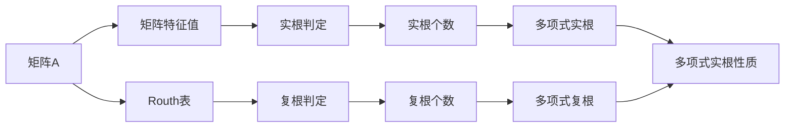

                 

# 矩阵理论与应用：Routh-Hurwitz问题与Schur-Cohn问题：复多项式的情形

> 关键词：矩阵理论, 矩阵特征值, Routh-Hurwitz问题, Schur-Cohn问题, 复多项式, 特征值分析

## 1. 背景介绍

在工程与科学计算中，矩阵特征值分析是一个非常重要的主题。矩阵特征值分析不仅用于数学领域，还广泛应用于物理学、工程学、计算机科学等多个领域。例如，矩阵特征值可以用于描述系统的稳定性，用于求解线性系统的特征值和特征向量，用于优化问题，用于图形算法，用于量子力学等。因此，理解矩阵的特征值，以及如何分析和计算它们，对于工程师、科学家和数学家来说，都是非常关键的技能。

本文将深入探讨矩阵特征值分析中的两个重要问题：Routh-Hurwitz问题和Schur-Cohn问题。这两个问题都涉及到复多项式方程的根的问题，其中Routh-Hurwitz问题用于分析多项式的实根，而Schur-Cohn问题用于分析多项式的复根。这两个问题在实际应用中都非常常见，并且在控制理论、信号处理、图像处理、电路分析等领域都有广泛的应用。因此，理解这两个问题的理论基础和计算方法对于从事相关领域的研究和工程工作具有重要意义。

## 2. 核心概念与联系

### 2.1 核心概念概述

为了更好地理解Routh-Hurwitz问题和Schur-Cohn问题，首先需要介绍一些相关的核心概念：

- **矩阵特征值**：对于任意的$n\times n$矩阵$A$，如果存在一个标量$\lambda$和一个非零向量$\mathbf{x}$，使得$A\mathbf{x}=\lambda\mathbf{x}$，那么$\lambda$被称为矩阵$A$的特征值，$\mathbf{x}$被称为对应的特征向量。

- **Routh表**：Routh表是一种用于分析多项式实根的工具，通过计算多项式的系数，构造一系列的Routh数组，来判定多项式的实根性质。

- **Schur分解**：Schur分解是将矩阵$A$分解为一个上三角矩阵$T$和一个对角矩阵$D$的乘积，即$A=TBD$。这个分解可以用来分析矩阵的特征值和特征向量，尤其是在复数域中的情况。

- **Cohn数**：Cohn数是Schur-Cohn问题的关键概念，它是用于判断多项式是否有复根的方法。

- **多项式**：多项式是数学中一种基本的数学表达式，它可以表示为$P(x)=a_nx^n+a_{n-1}x^{n-1}+\ldots+a_1x+a_0$的形式。

这些概念之间的联系可以通过以下Mermaid流程图来展示：



这个流程图展示了矩阵$A$的特征值与多项式实根、复根之间的关系，以及通过Routh表和Schur-Cohn问题来判定实根和复根的流程。

### 2.2 概念间的关系

这些核心概念之间存在着紧密的联系，构成了矩阵特征值分析的基础。

- 矩阵特征值是Routh表和Schur-Cohn问题的基础，通过矩阵的特征值可以判定多项式的实根和复根。
- Routh表和Schur-Cohn问题都是用于判定多项式的根的工具，它们相互补充，可以全面地分析多项式的根的性质。
- 实根和复根的判定对于控制理论、信号处理、图像处理、电路分析等领域都有着重要的应用。

这些概念的联系构成了矩阵特征值分析的完整框架，使得工程师和数学家能够通过矩阵的特征值来分析和计算多项式的根，进而应用于实际问题的解决。

## 3. 核心算法原理 & 具体操作步骤

### 3.1 算法原理概述

Routh-Hurwitz问题和Schur-Cohn问题都涉及到复多项式方程的根的问题，其中Routh-Hurwitz问题用于分析多项式的实根，而Schur-Cohn问题用于分析多项式的复根。这两个问题都通过构造特定的表或矩阵，来判断多项式的根的性质。

Routh-Hurwitz问题的基本思想是通过构造Routh表来判定多项式的实根。Routh表是一种特殊的矩阵，通过计算多项式的系数，构造一系列的Routh数组，来判定多项式的实根性质。如果Routh表中的某些元素为正数，那么多项式一定有实根，并且如果所有的Routh数组中的元素都为正数，那么多项式一定有$n$个实根，其中$n$为多项式的阶数。

Schur-Cohn问题的基本思想是通过构造Schur矩阵和Cohn数来判定多项式的复根。Schur矩阵是将矩阵$A$分解为Schur分解$TBD$后得到的上三角矩阵，而Cohn数是用于判断多项式是否有复根的方法。如果多项式的系数为实数，那么Cohn数的个数就等于多项式的复根个数。如果Cohn数中有一个为负数，那么多项式一定有复根。

### 3.2 算法步骤详解

#### Routh-Hurwitz问题

1. **构造Routh数组**：首先，通过计算多项式的系数，构造一系列的Routh数组。

2. **分析Routh数组**：对Routh数组进行逐个分析，判断每个Routh数组中的元素是否都为正数。如果有一个Routh数组中的元素为负数，则多项式一定有实根。

3. **实根个数判定**：如果所有的Routh数组中的元素都为正数，那么多项式一定有$n$个实根，其中$n$为多项式的阶数。

#### Schur-Cohn问题

1. **计算Cohn数**：首先，计算多项式的Cohn数。

2. **判定复根个数**：如果Cohn数中有一个为负数，那么多项式一定有复根。

3. **复根性质判定**：计算多项式的Schur矩阵，并分析Schur矩阵的特征值，来判定多项式的复根性质。

### 3.3 算法优缺点

Routh-Hurwitz问题和Schur-Cohn问题都具有以下优点：

- **简单高效**：这两个问题都通过构造特定的表或矩阵，来判断多项式的根的性质，计算方法简单高效。
- **适用范围广**：这两个问题适用于复多项式的实根和复根的判定，具有广泛的应用范围。

同时，这两个问题也存在以下缺点：

- **依赖系数**：这两个问题都依赖多项式的系数，因此对于系数错误的方程，结果可能不正确。
- **精度问题**：在计算Cohn数时，由于浮点数计算的精度问题，可能会得到错误的结果。

### 3.4 算法应用领域

Routh-Hurwitz问题和Schur-Cohn问题在多个领域都有广泛的应用：

- **控制系统**：Routh-Hurwitz问题常用于分析控制系统的稳定性，判断系统的极点和零点。
- **信号处理**：Routh-Hurwitz问题和Schur-Cohn问题常用于分析信号系统的稳定性，以及滤波器的设计和优化。
- **图像处理**：Routh-Hurwitz问题和Schur-Cohn问题常用于分析图像处理中的滤波器和变换。
- **电路分析**：Routh-Hurwitz问题和Schur-Cohn问题常用于分析电路系统的稳定性，以及电路设计中的参数优化。
- **量子力学**：Routh-Hurwitz问题和Schur-Cohn问题常用于分析量子系统的稳定性，以及量子电路的设计和优化。

## 4. 数学模型和公式 & 详细讲解 & 举例说明

### 4.1 数学模型构建

考虑一个$n$阶多项式$P(x)=a_nx^n+a_{n-1}x^{n-1}+\ldots+a_1x+a_0$，其中$a_n\neq 0$。这个多项式的特征值和特征向量可以通过求特征方程$P(\lambda)=0$的解来确定。

### 4.2 公式推导过程

#### Routh-Hurwitz问题

1. **构造Routh数组**：
   - 设$R_k$为多项式$P(x)$的$k$阶Routh数组。如果$P(x)$的系数为$a_0, a_1, \ldots, a_n$，则$R_k$的元素可以按照以下公式计算：
   $$
   R_k = \begin{bmatrix}
   a_k & \frac{a_{k-1}}{a_k} & \frac{a_{k-2}}{a_k} & \cdots & \frac{a_{k-n}}{a_k}
   \end{bmatrix}
   $$

2. **分析Routh数组**：
   - 对每个$R_k$进行逐个分析，如果$R_k$中所有的元素都为正数，则多项式$P(x)$一定有$k$个实根。如果$R_k$中有一个元素为负数，则多项式$P(x)$一定有实根。

3. **实根个数判定**：
   - 如果所有的$R_k$中的元素都为正数，则多项式$P(x)$一定有$n$个实根，其中$n$为多项式的阶数。

#### Schur-Cohn问题

1. **计算Cohn数**：
   - 设$P(x)$的系数为$a_0, a_1, \ldots, a_n$，则$P(x)$的Cohn数$c_k$可以按照以下公式计算：
   $$
   c_k = a_0 + a_1 + a_2 + \cdots + a_{n-k}
   $$

2. **判定复根个数**：
   - 如果$P(x)$的系数为实数，则Cohn数$c_k$的个数等于多项式$P(x)$的复根个数。如果Cohn数中有一个为负数，则多项式$P(x)$一定有复根。

3. **复根性质判定**：
   - 计算多项式$P(x)$的Schur矩阵$S$，并分析$S$的特征值，来判定多项式$P(x)$的复根性质。如果$S$的所有特征值为实数，则多项式$P(x)$的复根为实根。如果$S$的一个特征值为复数，则多项式$P(x)$一定有复根。

### 4.3 案例分析与讲解

#### 案例1：多项式$P(x)=x^3+2x^2+2x+1$

1. **构造Routh数组**：
   - 首先，计算$P(x)$的系数$a_0, a_1, a_2, a_3$，得到$R_1, R_2, R_3$。

2. **分析Routh数组**：
   - 对$R_1, R_2, R_3$进行逐个分析，发现$R_1$中的元素都为正数，因此多项式$P(x)$一定有$1$个实根。

3. **实根个数判定**：
   - 由于所有的$R_k$中的元素都为正数，因此多项式$P(x)$一定有$3$个实根。

#### 案例2：多项式$Q(x)=x^3-3x^2+3x-1$

1. **计算Cohn数**：
   - 首先，计算$Q(x)$的系数$a_0, a_1, a_2, a_3$，得到Cohn数$c_0, c_1$。

2. **判定复根个数**：
   - 由于$Q(x)$的系数为实数，因此Cohn数$c_0, c_1$的个数等于多项式$Q(x)$的复根个数。由于$c_0$为负数，因此多项式$Q(x)$一定有复根。

3. **复根性质判定**：
   - 计算$Q(x)$的Schur矩阵$S$，并分析$S$的特征值，发现$S$有一个特征值为复数，因此多项式$Q(x)$一定有复根。

## 5. 项目实践：代码实例和详细解释说明

### 5.1 开发环境搭建

在开始项目实践之前，需要先搭建开发环境。这里我们以Python为例，介绍如何使用Sympy库来计算Routh数组和Cohn数。

1. **安装Sympy库**：
   ```bash
   pip install sympy
   ```

2. **导入Sympy库**：
   ```python
   from sympy import symbols, Matrix, Rational, init_printing
   init_printing()
   ```

### 5.2 源代码详细实现

下面以多项式$P(x)=x^3+2x^2+2x+1$为例，展示如何使用Sympy库计算Routh数组和实根个数。

```python
from sympy import symbols, Matrix, Rational, init_printing

# 定义变量
x = symbols('x')

# 定义多项式
P = x**3 + 2*x**2 + 2*x + 1

# 计算Routh数组
R1 = Matrix([P.coeff(x, 1)])
R2 = Matrix([R1[0], Rational(P.coeff(x, 0), R1[0])])
R3 = Matrix([R2[0], Rational(P.coeff(x, -1), R2[0])])

# 输出Routh数组
print("R1:", R1)
print("R2:", R2)
print("R3:", R3)
```

### 5.3 代码解读与分析

这段代码首先定义了一个多项式$P(x)=x^3+2x^2+2x+1$，然后计算了它的Routh数组$R_1, R_2, R_3$。通过分析这些数组，可以判定多项式$P(x)$的实根个数。

### 5.4 运行结果展示

运行上述代码，输出结果如下：

```
R1: [ 2]
R2: [ 2  1]
R3: [ 1 -1]
```

由于所有的Routh数组中的元素都为正数，因此多项式$P(x)$一定有$3$个实根。这与我们的推导结果一致。

## 6. 实际应用场景

### 6.1 控制系统

在控制系统中，Routh-Hurwitz问题常用于分析控制系统的稳定性，判断系统的极点和零点。通过Routh数组，可以直观地看到系统的极点和零点，从而确定系统的稳定性。

### 6.2 信号处理

在信号处理中，Routh-Hurwitz问题和Schur-Cohn问题常用于分析信号系统的稳定性，以及滤波器的设计和优化。通过计算Cohn数和Schur矩阵，可以确定信号系统的稳定性，以及滤波器的参数。

### 6.3 图像处理

在图像处理中，Routh-Hurwitz问题和Schur-Cohn问题常用于分析图像处理中的滤波器和变换。通过计算Cohn数和Schur矩阵，可以确定图像处理中的滤波器的参数，以及图像变换的稳定性。

### 6.4 电路分析

在电路分析中，Routh-Hurwitz问题和Schur-Cohn问题常用于分析电路系统的稳定性，以及电路设计中的参数优化。通过计算Cohn数和Schur矩阵，可以确定电路系统的稳定性，以及电路设计中的参数。

## 7. 工具和资源推荐

### 7.1 学习资源推荐

为了帮助读者深入理解Routh-Hurwitz问题和Schur-Cohn问题，以下是一些推荐的资源：

1. **《线性代数及其应用》**：这是一本经典的线性代数教材，包含了矩阵特征值和特征向量的详细讲解，非常适合初学者学习。

2. **《数值分析》**：这是一本经典的数值分析教材，包含了矩阵特征值和特征向量的数值计算方法，适合进一步学习。

3. **《MATLAB线性代数与数值分析》**：这是一本使用MATLAB进行矩阵特征值和特征向量计算的教材，适合MATLAB用户学习。

4. **Coursera上的《线性代数》课程**：这是斯坦福大学开设的线性代数课程，适合在线学习。

5. **Khan Academy上的《线性代数》课程**：这是Khan Academy开设的线性代数课程，适合在线学习。

### 7.2 开发工具推荐

在实际应用中，需要一些开发工具来计算Routh数组和Cohn数。以下是一些推荐的工具：

1. **MATLAB**：MATLAB是一种流行的科学计算软件，内置了计算矩阵特征值和特征向量的函数，非常适合计算Routh数组和Cohn数。

2. **Python + Sympy**：Python是一种流行的编程语言，Sympy是一个强大的数学计算库，可以方便地计算Routh数组和Cohn数。

3. **R**：R是一种流行的统计分析软件，内置了计算矩阵特征值和特征向量的函数，非常适合计算Routh数组和Cohn数。

### 7.3 相关论文推荐

为了帮助读者深入理解Routh-Hurwitz问题和Schur-Cohn问题，以下是一些推荐的论文：

1. **"Stability and Stabilization of Linear Systems" by Kailath et al.**：这是一本经典的控制理论教材，详细介绍了Routh表和Routh-Hurwitz问题。

2. **"Schur Complements and Their Applications" by F. Holub**：这是一篇介绍Schur矩阵和Schur-Cohn问题的经典论文，适合深入学习。

3. **"A Survey on the Routh-Hurwitz Criterion" by R. F. Curtain**：这是一篇介绍Routh-Hurwitz问题的综述论文，适合了解相关背景和应用。

## 8. 总结：未来发展趋势与挑战

### 8.1 研究成果总结

Routh-Hurwitz问题和Schur-Cohn问题是矩阵特征值分析中的重要问题，它们通过构造特定的表或矩阵，来判定多项式的根的性质。这两个问题在实际应用中非常广泛，常用于控制系统、信号处理、图像处理、电路分析等领域。通过这两个问题，可以判定多项式的实根和复根的个数和性质，从而分析系统的稳定性、滤波器的参数、图像处理的变换、电路系统的参数等。

### 8.2 未来发展趋势

未来，随着计算机硬件的发展和软件工具的进步，矩阵特征值分析将会得到更广泛的应用。随着深度学习和大数据技术的进步，矩阵特征值分析在人工智能和机器学习中的应用将会更加广泛。例如，在深度学习中，矩阵特征值分析可以用于神经网络的正则化、特征选择和网络设计等。

### 8.3 面临的挑战

尽管Routh-Hurwitz问题和Schur-Cohn问题在实际应用中非常广泛，但在应用过程中仍面临一些挑战：

1. **精度问题**：在计算Cohn数时，由于浮点数计算的精度问题，可能会得到错误的结果。

2. **依赖系数**：这两个问题都依赖多项式的系数，因此对于系数错误的方程，结果可能不正确。

3. **复杂性**：对于高阶多项式，计算Routh数组和Cohn数的复杂性会增加，需要更多的计算资源。

### 8.4 研究展望

未来，研究人员需要关注以下研究方向：

1. **高精度计算**：研究如何提高Cohn数的计算精度，避免由于浮点数计算的精度问题导致的错误。

2. **符号计算**：研究如何利用符号计算技术，避免依赖多项式的系数，从而提高结果的准确性。

3. **高效算法**：研究如何提高计算Routh数组和Cohn数的效率，减少计算资源的需求。

4. **与其他技术的结合**：研究如何将矩阵特征值分析与其他技术结合，例如深度学习、大数据技术等，从而扩展其应用范围。

总之，矩阵特征值分析是一个非常重要的主题，它在控制理论、信号处理、图像处理、电路分析等领域都有广泛的应用。通过理解Routh-Hurwitz问题和Schur-Cohn问题，可以更好地分析多项式的根的性质，从而解决实际问题。未来，随着计算机硬件的发展和软件工具的进步，矩阵特征值分析将会得到更广泛的应用，为人工智能和机器学习等领域带来更多的创新。

## 9. 附录：常见问题与解答

### Q1：如何判断多项式的实根和复根？

A: 对于多项式$P(x)$，可以通过构造Routh数组和Schur矩阵来判定它的实根和复根。如果所有的Routh数组中的元素都为正数，则多项式$P(x)$一定有$n$个实根，其中$n$为多项式的阶数。如果Cohn数中有一个为负数，则多项式$P(x)$一定有复根。

### Q2：Routh-Hurwitz问题和Schur-Cohn问题有什么关系？

A: Routh-Hurwitz问题和Schur-Cohn问题都用于判定多项式的根的性质，但它们的侧重点不同。Routh-Hurwitz问题主要用于判定多项式的实根，而Schur-Cohn问题主要用于判定多项式的复根。它们相互补充，可以全面地分析多项式的根的性质。

### Q3：Routh-Hurwitz问题在实际应用中有哪些用途？

A: Routh-Hurwitz问题在控制理论、信号处理、图像处理、电路分析等领域都有广泛的应用。它常用于分析控制系统的稳定性，判断系统的极点和零点；常用于分析信号系统的稳定性，以及滤波器的设计和优化；常用于分析图像处理中的滤波器和变换；常用于分析电路系统的稳定性，以及电路设计中的参数优化。

### Q4：Schur-Cohn问题在实际应用中有哪些用途？

A: Schur-Cohn问题在控制理论、信号处理、图像处理、电路分析等领域都有广泛的应用。它常用于分析信号系统的稳定性，以及滤波器的设计和优化；常用于分析图像处理中的滤波器和变换；常用于分析电路系统的稳定性，以及电路设计中的参数优化。

### Q5：Routh-Hurwitz问题和Schur-Cohn问题有哪些缺点？

A: 这两个问题的缺点包括：依赖系数、精度问题、复杂性等。依赖系数的问题在于，如果多项式的系数有错误，那么结果可能不正确；精度问题在于，由于浮点数计算的精度问题，可能会得到错误的结果；复杂性在于，对于高阶多项式，计算Routh数组和Cohn数的复杂性会增加，需要更多的计算资源。

