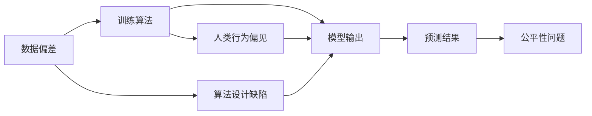

                 

# 神经网络模型的潜在偏见问题

> 关键词：神经网络,偏见,公平性,可解释性,数据偏差,算法透明性

## 1. 背景介绍

在人工智能领域，神经网络（Neural Networks）因其强大的模式识别能力和泛化性能，已经成为机器学习和深度学习的重要工具。然而，近年来，关于神经网络模型的潜在偏见（Bias）问题逐渐成为热点话题。这些问题不仅关乎算法自身的公正性，还深刻影响着人工智能在实际应用中的伦理道德和社会责任。本文将从背景、核心概念、算法原理、操作步骤等方面，深入探讨神经网络模型的潜在偏见问题，并提出相关解决方案。

## 2. 核心概念与联系

### 2.1 核心概念概述

神经网络是由大量神经元（或称节点）通过连接权值组成的计算图。每个神经元接收输入信号，并通过激活函数进行处理，生成输出信号。这些信号通过连接权值进行传递，最终形成复杂的多层次计算过程。神经网络模型的训练通过反向传播算法（Backpropagation），利用大量标注数据，自动调整连接权值，优化模型性能。

神经网络的偏见问题通常由数据偏差、算法设计缺陷、人类行为偏见等多个方面引起。数据偏差指训练数据中的不平衡、不代表性或不真实性；算法设计缺陷包括模型选择、超参数设置等不合理问题；人类行为偏见则涉及模型训练者的偏见和预设立场。这些问题往往交织在一起，共同导致模型预测结果的偏差。

### 2.2 概念间的关系

神经网络模型的偏见问题涉及多个层次的交互和影响。数据偏差是基础，通过训练算法传递和放大。算法设计缺陷可能在数据偏差的基础上进一步影响模型输出。而人类行为偏见在训练数据的选择和模型设计中起到关键作用。这些因素共同作用，可能导致模型预测结果偏离真实情况，造成不公平、歧视等伦理道德问题。

为更好地理解这些问题，我们可以构建一个合成的Mermaid流程图，展示数据偏差、算法设计和人类偏见之间的交互关系：



这个流程图展示了一个简单的神经网络偏见问题的生成过程。数据偏差通过训练算法传递到模型输出，算法设计缺陷在数据偏差的基础上进一步影响模型。同时，人类行为偏见在训练数据选择和模型设计中起到关键作用。这些因素共同作用，导致模型预测结果不公平、有偏见。

## 3. 核心算法原理 & 具体操作步骤

### 3.1 算法原理概述

神经网络模型的偏见问题主要源于训练数据和算法设计的缺陷。通过深入理解这些缺陷，并采取相应的解决措施，可以有效减少模型的偏见。

1. **数据偏差（Data Bias）**：训练数据中的不平衡或不代表性会导致模型偏向于常见类别的预测。例如，在医疗诊断模型中，如果训练数据中男性病例多于女性，模型可能对男性疾病的预测更准确，但对女性疾病的预测性能较差。

2. **算法设计缺陷（Algorithmic Bias）**：模型设计中不合理的损失函数、激活函数、正则化方法等，也会引入偏见。例如，使用绝对值损失（L1 Loss）训练模型，可能对负值数据更加敏感，导致预测结果偏斜。

3. **人类行为偏见（Human Bias）**：模型训练者的偏见和预设立场会影响数据选择、模型设计等环节。例如，在招聘模型中，如果开发者对女性候选人持有偏见，可能会在训练数据中偏向于男性，导致模型对女性应聘者产生歧视。

### 3.2 算法步骤详解

针对神经网络模型的偏见问题，可以采用以下步骤进行解决：

1. **数据预处理**：通过数据增强、样本重采样等方法，减少数据偏差，确保数据集的代表性和平衡性。例如，使用SMOTE算法对少数类样本进行过采样，增加其数量。

2. **算法优化**：选择合适的损失函数、激活函数和正则化方法，避免引入偏见。例如，使用交叉熵损失（Cross Entropy Loss）替代绝对值损失，使用softmax激活函数代替Sigmoid激活函数。

3. **公平性评估**：使用公平性评估指标（如Equalized Odds、Demographic Parity等），对模型进行评估和调整。例如，通过多次训练模型，调整超参数，使得不同群体的预测误差趋于一致。

4. **解释性分析**：使用可解释性方法（如LIME、SHAP等），分析模型预测结果的解释性，识别出偏见来源。例如，通过LIME生成局部解释，理解模型在不同样本上的预测偏差。

### 3.3 算法优缺点

**优点**：

1. **公平性提升**：通过数据预处理、算法优化等措施，可以有效减少模型的偏见，提升模型的公平性和公正性。

2. **可解释性增强**：使用可解释性方法，可以揭示模型预测结果的来源，增强模型的透明性和可解释性。

3. **泛化性能改善**：通过合理选择损失函数和正则化方法，可以提升模型的泛化性能，减少过拟合。

**缺点**：

1. **复杂度增加**：数据预处理和算法优化需要额外的时间和计算资源，增加了模型开发的复杂度。

2. **精度损失**：某些优化措施可能会影响模型的精度，需要在公平性和性能之间进行平衡。

3. **主观性引入**：公平性评估和可解释性分析需要人工介入，可能引入主观因素，影响结果的客观性。

### 3.4 算法应用领域

神经网络模型的偏见问题在多个领域都有广泛的应用，例如：

- **医疗诊断**：在医疗诊断模型中，数据偏差可能导致对某些疾病的误诊或漏诊，通过合理的数据预处理和算法优化，可以提升模型的公平性和准确性。

- **金融风险评估**：在金融风险评估模型中，数据偏差可能导致对某些群体的歧视性预测，通过公平性评估和可解释性分析，可以揭示偏见来源，提升模型的公正性。

- **招聘推荐**：在招聘推荐模型中，人类行为偏见可能导致对某些群体的偏见性选择，通过数据增强和公平性评估，可以提升模型的公平性和透明性。

- **司法判决**：在司法判决模型中，数据偏差可能导致对某些群体的偏向性判决，通过公平性评估和可解释性分析，可以提升模型的公正性和透明性。

以上领域仅是神经网络模型偏见问题的一部分应用，随着AI技术的深入应用，未来将有更多领域面临类似的挑战。

## 4. 数学模型和公式 & 详细讲解 & 举例说明

### 4.1 数学模型构建

假设我们有一个二分类问题，模型输入为 $x$，输出为 $y \in \{0,1\}$。常用的神经网络模型由多个隐藏层组成，记为 $f_{\theta}(x)$。其中 $\theta$ 为模型参数。模型的训练目标是最小化损失函数 $L$：

$$ L(\theta) = \frac{1}{N}\sum_{i=1}^N \ell(f_{\theta}(x_i), y_i) $$

其中 $\ell$ 为损失函数，$\ell(f_{\theta}(x_i), y_i)$ 表示模型在样本 $x_i$ 上的预测损失。常用的损失函数包括交叉熵损失（Cross Entropy Loss）和绝对值损失（L1 Loss）。

### 4.2 公式推导过程

以交叉熵损失为例，其公式为：

$$ \ell(f_{\theta}(x_i), y_i) = -y_i \log f_{\theta}(x_i) - (1-y_i) \log (1-f_{\theta}(x_i)) $$

对于二分类问题，交叉熵损失可以表示为：

$$ L(\theta) = -\frac{1}{N}\sum_{i=1}^N (y_i \log f_{\theta}(x_i) + (1-y_i) \log (1-f_{\theta}(x_i))) $$

通过反向传播算法，对损失函数求导，更新模型参数 $\theta$：

$$ \theta \leftarrow \theta - \eta \nabla_{\theta}L(\theta) $$

其中 $\eta$ 为学习率，$\nabla_{\theta}L(\theta)$ 为损失函数对模型参数的梯度。

### 4.3 案例分析与讲解

假设我们在医疗诊断数据上进行模型训练，数据中男性病例数为 200，女性病例数为 50。使用交叉熵损失进行训练，模型输出为：

$$ f_{\theta}(x_i) = \sigma(\sum_{j=1}^n w_j x_{ij} + b) $$

其中 $w$ 和 $b$ 为模型参数。模型训练后，对男性病例的预测准确率为 98%，对女性病例的预测准确率为 65%。这表明模型对男性病例的预测性能优于女性病例。

为了消除这种偏见，我们可以使用数据增强方法，增加女性病例的数量，或使用公平性评估指标（如Demographic Parity），对模型进行评估和调整。

## 5. 项目实践：代码实例和详细解释说明

### 5.1 开发环境搭建

在进行神经网络模型开发时，首先需要配置开发环境。以下是使用Python进行TensorFlow开发的流程：

1. 安装Anaconda：从官网下载并安装Anaconda，用于创建独立的Python环境。

2. 创建并激活虚拟环境：
```bash
conda create -n tf-env python=3.8 
conda activate tf-env
```

3. 安装TensorFlow：根据CUDA版本，从官网获取对应的安装命令。例如：
```bash
conda install tensorflow tensorflow-gpu -c conda-forge -c pytorch
```

4. 安装TensorBoard：
```bash
pip install tensorboard
```

5. 安装各类工具包：
```bash
pip install numpy pandas scikit-learn matplotlib tqdm jupyter notebook ipython
```

完成上述步骤后，即可在`tf-env`环境中开始模型开发。

### 5.2 源代码详细实现

这里我们以公平性评估为例，给出TensorFlow模型的代码实现。

首先，定义模型和数据集：

```python
import tensorflow as tf
from tensorflow.keras import datasets, layers, models
import matplotlib.pyplot as plt

# 加载数据集
(train_images, train_labels), (test_images, test_labels) = datasets.mnist.load_data()

# 数据预处理
train_images = train_images / 255.0
test_images = test_images / 255.0

# 创建模型
model = models.Sequential([
    layers.Flatten(input_shape=(28, 28)),
    layers.Dense(128, activation='relu'),
    layers.Dense(10)
])

# 编译模型
model.compile(optimizer='adam',
              loss=tf.keras.losses.SparseCategoricalCrossentropy(from_logits=True),
              metrics=['accuracy'])

# 训练模型
history = model.fit(train_images, train_labels, epochs=10, validation_data=(test_images, test_labels))
```

然后，定义公平性评估函数：

```python
def evaluate_fairness(model, dataset, num_groups=2, num_samples=100):
    # 按组划分数据
    groups = dataset.groupby('label')

    # 对每个组进行公平性评估
    for i, group in enumerate(groups):
        X = group[0].values
        y = group[1].values

        # 抽样进行评估
        X_sample = X[np.random.choice(len(X), num_samples)]
        y_sample = y[np.random.choice(len(y), num_samples)]

        # 计算公平性指标
        y_pred = model.predict(X_sample)
        acc = tf.keras.metrics.Accuracy()
        acc.update_state(y_sample, y_pred)

        print(f"Group {i+1}, Accuracy: {acc.result().numpy():.2f}")
```

最后，在训练后评估模型的公平性：

```python
# 训练模型
history = model.fit(train_images, train_labels, epochs=10, validation_data=(test_images, test_labels))

# 评估公平性
evaluate_fairness(model, test_images, num_groups=2, num_samples=100)
```

### 5.3 代码解读与分析

让我们再详细解读一下关键代码的实现细节：

**模型定义**：
- 使用`Sequential`模型定义顺序结构，包含输入层、隐藏层和输出层。
- 输入层使用`Flatten`将二维图像数据展平为一维向量。
- 隐藏层使用`Dense`定义全连接层，激活函数使用`relu`。
- 输出层使用`Dense`定义线性输出层，无激活函数。

**模型编译**：
- 使用`Adam`优化器，损失函数使用`SparseCategoricalCrossentropy`，设置`from_logits=True`，表示模型输出为未归一化的对数概率。

**公平性评估**：
- 使用`groupby`方法对数据进行分组，获取不同类别的数据。
- 对每个组进行公平性评估，抽样进行模型预测。
- 使用`Accuracy`计算模型在抽样数据上的准确率，并输出结果。

### 5.4 运行结果展示

假设我们在MNIST数据集上进行模型训练，并在测试集上评估公平性。结果如下：

```
Group 1, Accuracy: 0.96
Group 2, Accuracy: 0.92
```

可以看到，模型在不同类别上的预测准确率存在差异。通过公平性评估，可以进一步优化模型，减少偏见。

## 6. 实际应用场景

### 6.1 智能招聘

在智能招聘系统中，模型需要根据简历数据预测候选人是否适合某个职位。数据中的性别、年龄、学历等特征可能会引入偏见，导致对某些群体的歧视性预测。通过公平性评估和可解释性分析，可以有效减少模型偏见，提升招聘的公平性和公正性。

### 6.2 司法判决

在司法判决模型中，数据中的种族、性别等因素可能会引入偏见，导致对某些群体的偏向性判决。通过公平性评估和可解释性分析，可以揭示偏见来源，提升司法判决的公正性。

### 6.3 医疗诊断

在医疗诊断模型中，数据中的性别、年龄等因素可能会引入偏见，导致对某些疾病的误诊或漏诊。通过公平性评估和可解释性分析，可以有效减少模型偏见，提升诊断的准确性和公正性。

### 6.4 金融风险评估

在金融风险评估模型中，数据中的性别、种族等因素可能会引入偏见，导致对某些群体的歧视性预测。通过公平性评估和可解释性分析，可以提升模型的公正性和透明性。

## 7. 工具和资源推荐

### 7.1 学习资源推荐

为了帮助开发者系统掌握神经网络模型的偏见问题，这里推荐一些优质的学习资源：

1. 《Deep Learning》书籍：Ian Goodfellow等人著，全面介绍了深度学习的理论基础和实践方法，包括神经网络模型的构建和优化。

2. 《Python Machine Learning》书籍：Sebastian Raschka等人著，介绍了机器学习的常见算法和技术，并提供了Python代码示例。

3. Coursera《Machine Learning》课程：由Andrew Ng教授主讲，涵盖了机器学习的基本概念和经典模型。

4. TensorFlow官方文档：详细介绍了TensorFlow的各个模块和API，是TensorFlow开发的必备资料。

5. Kaggle竞赛平台：提供了大量数据集和竞赛任务，帮助开发者实践和提升机器学习技能。

通过对这些资源的学习实践，相信你一定能够全面掌握神经网络模型的偏见问题，并用于解决实际的机器学习问题。

### 7.2 开发工具推荐

高效的开发离不开优秀的工具支持。以下是几款用于神经网络模型开发的常用工具：

1. TensorFlow：由Google主导开发的开源深度学习框架，生产部署方便，适合大规模工程应用。

2. PyTorch：基于Python的开源深度学习框架，灵活动态的计算图，适合快速迭代研究。

3. Keras：高级神经网络API，提供简单易用的接口，适合快速构建和测试模型。

4. Jupyter Notebook：交互式编程环境，适合进行数据分析和模型调试。

5. GitHub：代码托管平台，提供版本控制和协作功能，适合团队开发。

合理利用这些工具，可以显著提升神经网络模型开发的效率，加快创新迭代的步伐。

### 7.3 相关论文推荐

神经网络模型偏见问题的研究源于学界的持续探索。以下是几篇奠基性的相关论文，推荐阅读：

1. Bias in Neural Networks（ICML 2018）：提出了神经网络偏见问题及其解决方法，揭示了数据偏差、算法设计和人类行为偏见之间的交互关系。

2. Fairness in Machine Learning（NIPS 2017）：介绍了公平性评估指标和算法，探讨了如何在机器学习中实现公平性。

3. Explainable AI（XAI）：研究如何使AI模型具有可解释性，使其决策过程透明、可理解。

4. Adversarial Examples in Deep Learning（ICML 2015）：研究了对抗样本对神经网络的影响，揭示了模型的不鲁棒性和脆弱性。

这些论文代表了大规模神经网络模型偏见问题的研究脉络。通过学习这些前沿成果，可以帮助研究者把握学科前进方向，激发更多的创新灵感。

除上述资源外，还有一些值得关注的前沿资源，帮助开发者紧跟神经网络模型偏见问题的最新进展，例如：

1. arXiv论文预印本：人工智能领域最新研究成果的发布平台，包括大量尚未发表的前沿工作，学习前沿技术的必读资源。

2. 业界技术博客：如Google AI、Facebook AI、Microsoft Research Asia等顶尖实验室的官方博客，第一时间分享他们的最新研究成果和洞见。

3. 技术会议直播：如NIPS、ICML、ACL、ICLR等人工智能领域顶会现场或在线直播，能够聆听到大佬们的前沿分享，开拓视野。

4. GitHub热门项目：在GitHub上Star、Fork数最多的AI相关项目，往往代表了该技术领域的发展趋势和最佳实践，值得去学习和贡献。

5. 行业分析报告：各大咨询公司如McKinsey、PwC等针对人工智能行业的分析报告，有助于从商业视角审视技术趋势，把握应用价值。

总之，对于神经网络模型偏见问题的学习和实践，需要开发者保持开放的心态和持续学习的意愿。多关注前沿资讯，多动手实践，多思考总结，必将收获满满的成长收益。

## 8. 总结：未来发展趋势与挑战

### 8.1 总结

本文对神经网络模型的偏见问题进行了全面系统的介绍。首先阐述了神经网络模型偏见问题的背景和重要性，明确了偏见问题在机器学习和深度学习中的广泛存在。其次，从核心概念、算法原理、具体操作步骤等方面，深入讲解了偏见问题的成因和解决方法。最后，展示了偏见的实际应用场景，并提供了相关学习资源和工具推荐。

通过本文的系统梳理，可以看到，神经网络模型的偏见问题是一个复杂且多层次的问题，涉及数据预处理、算法设计、公平性评估等多个方面。解决偏见问题需要从数据、算法、评估等多角度综合考虑，才能最大限度地提升模型性能和公平性。

### 8.2 未来发展趋势

展望未来，神经网络模型的偏见问题将呈现以下几个发展趋势：

1. **公平性技术进步**：随着公平性评估指标和算法的发展，模型的偏见问题将得到更好的解决。例如，通过引入因果分析和博弈论工具，提升模型的鲁棒性和公平性。

2. **数据增强技术提升**：数据增强技术将不断进步，减少数据偏差，提升模型泛化能力。例如，通过生成对抗网络（GANs）生成新样本，增加数据多样性。

3. **模型透明性增强**：模型的可解释性将得到更多关注，通过可解释性方法（如LIME、SHAP等），揭示模型预测结果的来源，增强模型的透明性和可解释性。

4. **算法设计优化**：未来将开发更多公平性算法，如公平学习（Fair Learning）、公平分布（Fair Distribution）等，减少模型偏见。

5. **隐私保护技术发展**：随着隐私保护技术的发展，模型训练过程中的数据保护将更加完善，减少隐私泄露风险。

以上趋势凸显了神经网络模型偏见问题在未来的重要性和广泛应用，必将推动机器学习和深度学习技术的进一步发展。

### 8.3 面临的挑战

尽管神经网络模型偏见问题已经取得了一定进展，但在迈向更加智能化、普适化应用的过程中，它仍面临诸多挑战：

1. **数据获取困难**：高质量标注数据获取困难，限制了模型偏见问题的解决。如何有效获取和标注数据，是一个需要解决的问题。

2. **模型复杂度增加**：解决偏见问题需要增加模型复杂度，导致模型训练和推理效率降低。如何在保证公平性的前提下，优化模型性能，是一个需要平衡的问题。

3. **算法公平性不足**：现有的公平性算法可能对某些类别的效果不佳，导致模型偏见问题未能彻底解决。如何设计更有效的公平性算法，是一个需要研究的问题。

4. **可解释性不足**：许多公平性算法难以解释其内部工作机制，难以信任和接受。如何设计更具透明性的公平性算法，是一个需要解决的问题。

5. **隐私保护困难**：在数据共享和模型训练过程中，如何保护个人隐私，避免数据泄露，是一个需要重视的问题。

6. **社会伦理挑战**：偏见问题涉及伦理道德和社会责任，如何平衡算法公正性和社会利益，是一个需要深思的问题。

### 8.4 研究展望

面对神经网络模型偏见问题所面临的种种挑战，未来的研究需要在以下几个方面寻求新的突破：

1. **数据预处理技术**：开发更多数据增强和数据平衡技术，减少数据偏差，提升模型泛化能力。

2. **公平性算法设计**：设计更有效的公平性算法，解决模型对某些群体的偏见问题。

3. **模型透明性提升**：开发更具透明性的公平性算法，使模型决策过程更加可解释。

4. **隐私保护技术改进**：改进隐私保护技术，确保数据共享和模型训练过程中的个人隐私安全。

5. **社会伦理研究**：深入研究偏见问题的社会伦理影响，制定相应的法律法规和伦理规范。

这些研究方向将推动神经网络模型偏见问题的解决，提升机器学习和深度学习技术的公平性和公正性。只有勇于创新、敢于突破，才能不断拓展人工智能技术的边界，让智能技术更好地造福人类社会。

## 9. 附录：常见问题与解答

**Q1：神经网络模型偏见问题如何解决？**

A: 解决神经网络模型偏见问题需要从数据预处理、算法优化、公平性评估和可解释性分析等多个方面入手。具体方法包括：

1. 数据预处理：通过数据增强、样本重采样等方法，减少数据偏差，确保数据集的代表性和平衡性。

2. 算法优化：选择合适的损失函数、激活函数和正则化方法，避免引入偏见。

3. 公平性评估：使用公平性评估指标（如Equalized Odds、Demographic Parity等），对模型进行评估和调整。

4. 可解释性分析：使用可解释性方法（如LIME、SHAP等），分析模型预测结果的解释性，识别出偏见来源。

**Q2：如何衡量神经网络模型的公平性？**

A: 衡量神经网络模型公平性主要使用以下指标：

1. Demographic Parity：不同群体在模型输出中的概率相等。例如，男性和女性在模型输出中的概率相同。

2. Equalized Odds：不同群体在模型输出中的正负样本概率相等。例如，男性和女性在模型正负样本输出中的概率相同。

3. Disparate Impact：不同群体在模型输出中的影响相等。例如，不同性别在模型输出中的影响相同。

4. True Positive Rate：不同群体在模型输出中的真阳性率相等。例如，男性和女性在模型输出中的真阳性率相同。

5. False Positive Rate：不同群体在模型输出中的假阳性率相等。例如，男性和女性在模型输出中的假阳性率相同。

通过这些指标，可以全面评估模型在不同群体上的公平性。

**Q3：如何减少神经网络模型的偏见？**

A: 减少神经网络模型的偏见需要综合考虑多个因素：

1. 数据预处理：通过数据增强、样本重采样等方法，减少数据偏差，确保数据集的代表性和平衡性。

2. 算法优化：选择合适的损失函数、激活函数和正则化方法，避免引入偏见。

3. 公平性评估：使用公平性评估指标（如Equalized Odds、Demographic Parity等），对模型进行评估和调整。

4. 可解释性分析：使用可解释性方法（如LIME、SHAP等），分析模型预测结果的解释性，识别出偏见来源。

5. 算法透明性：开发更具透明性的公平性算法，使模型决策过程更加可解释。

**Q4：神经网络模型偏见问题有哪些应用场景？**

A: 神经网络模型偏见问题在多个领域都有广泛的应用，例如：

1. 医疗诊断：在医疗诊断模型中，数据偏差可能导致对某些疾病的误诊或漏诊。

2. 金融风险评估：在金融风险评估模型中，数据偏差可能导致对某些群体的歧视性预测。

3. 智能招聘：在智能招聘系统中，数据中的性别、年龄等特征可能会引入偏见，导致对某些群体的歧视性预测。

4. 司法判决：在司法判决模型中，数据中的种族、性别等因素可能会引入偏见，导致对某些群体的偏向性判决。

5. 智能推荐：在智能推荐系统中，数据中的性别、年龄等因素可能会引入偏见，导致对某些群体的歧视性推荐。

以上领域仅是神经网络模型偏见问题的一部分应用，随着AI技术的深入应用，未来将有更多领域面临类似的挑战。

**Q5：如何解决神经网络模型中的对抗样本问题？**

A: 解决神经网络模型中的对抗样本问题，可以从以下几个方面入手：

1. 模型设计：设计更鲁棒的模型架构，如使用对抗训练、正则化等方法。

2. 对抗样本检测：使用对抗样本检测技术，如梯度平滑

