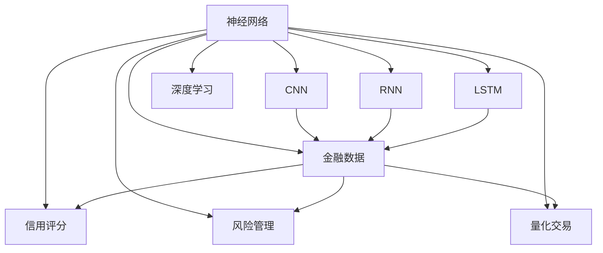

                 

## 1. 背景介绍

金融行业一直以来都是人工智能技术的重要应用领域之一。得益于大数据和云计算技术的飞速发展，金融领域的数字化和智能化转型正在如火如荼地进行。从高频交易、信用评估、风险管理到客户服务，人工智能技术正在全面赋能金融行业，推动其转型升级。

近年来，神经网络技术在金融领域的应用越来越广泛，涵盖了信用评分、欺诈检测、股票预测、量化交易等多个方面。本文将从神经网络的原理、应用和优化三个方面，详细探讨其在金融领域的具体应用。

## 2. 核心概念与联系

### 2.1 核心概念概述

1. **神经网络**：由多个神经元（或称为节点）按照一定结构相互连接组成的计算模型。神经网络通过学习大量数据，能够实现复杂的非线性映射，从而在许多任务上取得良好效果。

2. **卷积神经网络（CNN）**：一种常用于图像处理和视觉识别任务的神经网络。CNN通过卷积操作提取输入数据的局部特征，并通过池化操作进行特征压缩，最终进行分类或回归预测。

3. **循环神经网络（RNN）**：一种常用于序列数据处理和自然语言处理任务的神经网络。RNN通过循环结构，能够处理变长的输入序列，捕捉序列中的时间依赖关系。

4. **长短期记忆网络（LSTM）**：一种特殊的RNN，通过引入门控机制，能够在处理长序列数据时避免梯度消失和梯度爆炸问题，适合处理时间序列数据。

5. **深度学习**：以多层神经网络为基础的学习范式，通过反向传播算法进行模型训练和参数优化，以实现更强大的建模能力和泛化能力。

6. **金融数据**：包括历史交易数据、市场指数、财务报表、客户行为数据等，是神经网络在金融领域应用的主要数据源。

7. **信用评分**：根据客户的财务状况和信用历史，预测其未来偿债能力的过程。神经网络可以用于构建信用评分模型，以提高评分的准确性和效率。

8. **风险管理**：通过预测和监控金融市场风险，保护金融机构免受损失的过程。神经网络可以用于构建风险预测模型，识别和评估金融市场中的潜在风险。

9. **量化交易**：通过算法自动化执行交易策略，以获取投资收益的过程。神经网络可以用于构建量化交易模型，提高交易策略的执行效率和收益水平。

### 2.2 核心概念之间的关系

这些核心概念之间的关系可以通过以下Mermaid流程图来展示：



这个流程图展示了神经网络与其他核心概念之间的关系：

1. 神经网络包含CNN、RNN和LSTM等子网络，适用于不同类型的数据和任务。
2. 金融数据作为神经网络的主要数据源，可用于信用评分、风险管理、量化交易等多个金融应用场景。
3. 神经网络通过深度学习，提高模型的复杂度和泛化能力。
4. 不同神经网络模型（如CNN、RNN、LSTM）根据任务特点选择使用。
5. 神经网络在信用评分、风险管理、量化交易等金融应用中具有广泛应用。

## 3. 核心算法原理 & 具体操作步骤

### 3.1 算法原理概述

神经网络的核心算法原理是通过反向传播算法（Backpropagation）进行模型训练和参数优化。反向传播算法通过链式法则，计算损失函数对模型参数的梯度，并根据梯度方向调整参数值，以最小化损失函数。

以深度神经网络为例，其训练过程分为前向传播和反向传播两个步骤：

- **前向传播**：将输入数据通过网络中的多个层次进行线性变换和非线性变换，最终输出预测结果。
- **反向传播**：计算预测结果与真实标签之间的损失，并根据损失函数对模型参数求导，更新模型参数。

神经网络通过不断迭代前向传播和反向传播过程，逐步调整模型参数，以提高模型预测的准确性。

### 3.2 算法步骤详解

神经网络在金融领域的应用步骤通常包括以下几个关键步骤：

1. **数据准备**：收集和预处理金融数据，包括数据清洗、特征选择和数据增强等。

2. **模型设计**：选择合适的神经网络架构和超参数，如网络层数、神经元个数、激活函数、优化器等。

3. **模型训练**：将准备好的数据输入模型，进行前向传播和反向传播，更新模型参数。

4. **模型评估**：使用验证集和测试集评估模型性能，选择合适的评估指标如准确率、召回率、F1值等。

5. **模型优化**：根据评估结果调整模型超参数和结构，进行模型调优。

6. **模型应用**：将训练好的模型部署到实际应用场景中，进行实时预测和决策。

### 3.3 算法优缺点

神经网络在金融领域应用的优势包括：

- **处理非线性关系**：神经网络能够处理复杂的非线性关系，适用于许多金融模型中的非线性特征。
- **高泛化能力**：神经网络在处理金融数据时，具有较高的泛化能力，能够适应不同的市场环境和数据分布。
- **实时预测**：神经网络模型可以实时处理和预测金融数据，满足高频交易和实时决策的需求。

但神经网络在金融领域应用也存在一些局限性：

- **数据需求大**：神经网络需要大量的标注数据进行训练，金融数据通常难以获取。
- **计算资源需求高**：神经网络模型参数较多，计算复杂度较高，需要较高的计算资源和存储空间。
- **模型复杂度高**：神经网络模型结构复杂，难以解释和理解其内部工作机制，缺乏透明度。
- **过拟合风险高**：神经网络容易过拟合，特别是在金融数据较少的情况下。

### 3.4 算法应用领域

神经网络在金融领域的应用主要集中在以下几个方面：

1. **信用评分**：利用神经网络构建信用评分模型，根据客户的财务和信用历史数据，预测其未来偿债能力。

2. **风险管理**：使用神经网络预测金融市场中的风险因素，如信用风险、市场风险和流动性风险等。

3. **量化交易**：通过神经网络构建量化交易模型，自动执行交易策略，提高投资收益。

4. **欺诈检测**：利用神经网络识别和预测金融欺诈行为，保护金融机构免受损失。

5. **客户行为分析**：通过神经网络分析客户行为数据，提高客户满意度和忠诚度。

## 4. 数学模型和公式 & 详细讲解  
### 4.1 数学模型构建

神经网络的基本数学模型可以表示为：

$$
f(x; \theta) = W^{[L]} \cdot \sigma(W^{[L-1]} \cdot \sigma(... \cdot \sigma(W^{[1]} \cdot x + b^{[1]}) + b^{[2]}) + b^{[L]}
$$

其中 $x$ 为输入数据，$\theta$ 为模型参数，$W^{[l]}$ 和 $b^{[l]}$ 分别为网络中的权重和偏置，$[L]$ 表示第 $L$ 层网络，$\sigma$ 为激活函数。

以深度神经网络为例，其训练过程可以表示为：

1. **前向传播**：

$$
z^{[l]} = W^{[l]} \cdot h^{[l-1]} + b^{[l]}
$$

$$
h^{[l]} = \sigma(z^{[l]})
$$

其中 $z^{[l]}$ 为网络中第 $l$ 层的输入，$h^{[l]}$ 为第 $l$ 层的输出，$\sigma$ 为激活函数。

2. **反向传播**：

$$
\Delta^{[L]} = \frac{\partial \mathcal{L}}{\partial \hat{y}} = \frac{\partial \mathcal{L}}{\partial z^{[L]}} \cdot \frac{\partial z^{[L]}}{\partial h^{[L]}} = \frac{\partial \mathcal{L}}{\partial z^{[L]}} \cdot \sigma'(z^{[L]})
$$

$$
\Delta^{[l]} = \frac{\partial \mathcal{L}}{\partial z^{[l]}} = \Delta^{[l+1]} \cdot W^{[l+1]} \cdot \sigma'(z^{[l+1]}) + \Delta^{[l+2]} \cdot W^{[l+2]} \cdot \sigma'(z^{[l+2]})
$$

其中 $\mathcal{L}$ 为损失函数，$\hat{y}$ 为模型预测输出，$W^{[l]}$ 和 $b^{[l]}$ 分别为网络中第 $l$ 层的权重和偏置，$\sigma$ 和 $\sigma'$ 分别为激活函数和导数。

### 4.2 公式推导过程

以二分类问题为例，神经网络的训练过程如下：

1. **前向传播**：

$$
z^{[1]} = W^{[1]} \cdot x + b^{[1]}
$$

$$
h^{[1]} = \sigma(z^{[1]})
$$

$$
z^{[2]} = W^{[2]} \cdot h^{[1]} + b^{[2]}
$$

$$
h^{[2]} = \sigma(z^{[2]})
$$

$$
\hat{y} = W^{[3]} \cdot h^{[2]} + b^{[3]}
$$

其中 $x$ 为输入数据，$h^{[1]}$ 和 $h^{[2]}$ 分别为前向传播中的中间层输出，$\hat{y}$ 为模型预测输出。

2. **反向传播**：

$$
\Delta^{[3]} = \frac{\partial \mathcal{L}}{\partial \hat{y}} = \frac{\partial \mathcal{L}}{\partial z^{[3]}} \cdot \frac{\partial z^{[3]}}{\partial h^{[3]}} = \frac{\partial \mathcal{L}}{\partial z^{[3]}} \cdot \sigma'(z^{[3]})
$$

$$
\Delta^{[2]} = \frac{\partial \mathcal{L}}{\partial z^{[2]}} = \Delta^{[3]} \cdot W^{[3]} \cdot \sigma'(z^{[3]}) + \Delta^{[4]} \cdot W^{[4]} \cdot \sigma'(z^{[4]})
$$

$$
\Delta^{[1]} = \frac{\partial \mathcal{L}}{\partial z^{[1]}} = \Delta^{[2]} \cdot W^{[2]} \cdot \sigma'(z^{[2]}) + \Delta^{[3]} \cdot W^{[3]} \cdot \sigma'(z^{[3]})
$$

其中 $\mathcal{L}$ 为损失函数，$\Delta^{[l]}$ 为第 $l$ 层的误差，$\sigma$ 和 $\sigma'$ 分别为激活函数和导数。

### 4.3 案例分析与讲解

以信用评分问题为例，我们可以构建一个基于神经网络的信用评分模型，其架构如下：

```
[输入层] --(隐含层1)--> [隐含层2] --(输出层)--> [信用评分]
```

其中隐含层1和隐含层2都采用全连接层，每个隐含层的输出都通过ReLU激活函数进行非线性变换。输出层通过Sigmoid激活函数进行二分类预测，输出结果为0或1。

训练过程如下：

1. **数据准备**：收集客户的历史信用记录、财务状况等数据，并进行预处理和特征选择。

2. **模型设计**：选择神经网络的架构和超参数，如隐含层个数、神经元个数、激活函数、优化器等。

3. **模型训练**：使用训练集进行前向传播和反向传播，更新模型参数。

4. **模型评估**：使用验证集和测试集评估模型性能，选择合适的评估指标如准确率、召回率、F1值等。

5. **模型优化**：根据评估结果调整模型超参数和结构，进行模型调优。

6. **模型应用**：将训练好的模型部署到实际应用场景中，进行实时预测和决策。

## 5. 项目实践：代码实例和详细解释说明

### 5.1 开发环境搭建

在进行神经网络金融应用实践前，我们需要准备好开发环境。以下是使用Python进行TensorFlow和Keras开发的环境配置流程：

1. 安装Anaconda：从官网下载并安装Anaconda，用于创建独立的Python环境。

2. 创建并激活虚拟环境：
```bash
conda create -n tf-env python=3.8 
conda activate tf-env
```

3. 安装TensorFlow和Keras：
```bash
pip install tensorflow==2.3.0 keras
```

4. 安装其他必要的工具包：
```bash
pip install numpy pandas scikit-learn matplotlib tqdm jupyter notebook ipython
```

完成上述步骤后，即可在`tf-env`环境中开始神经网络金融应用实践。

### 5.2 源代码详细实现

以下是一个基于神经网络的信用评分问题的Python代码实现。

```python
from tensorflow import keras
from tensorflow.keras import layers
from sklearn.model_selection import train_test_split
from sklearn.preprocessing import StandardScaler
from sklearn.metrics import roc_auc_score

# 加载数据
data = pd.read_csv('credit_data.csv')

# 特征选择和数据预处理
features = data[['age', 'income', 'debt']]
target = data['default']
scaler = StandardScaler()
features = scaler.fit_transform(features)

# 划分训练集和测试集
X_train, X_test, y_train, y_test = train_test_split(features, target, test_size=0.2)

# 构建模型
model = keras.Sequential([
    layers.Dense(64, activation='relu', input_shape=(3,)),
    layers.Dense(32, activation='relu'),
    layers.Dense(1, activation='sigmoid')
])

# 编译模型
model.compile(optimizer='adam', loss='binary_crossentropy', metrics=['accuracy', roc_auc_score])

# 训练模型
model.fit(X_train, y_train, epochs=10, batch_size=64, validation_data=(X_test, y_test))

# 评估模型
y_pred = model.predict(X_test)
auc = roc_auc_score(y_test, y_pred)
print(f"AUC: {auc}")
```

### 5.3 代码解读与分析

让我们再详细解读一下关键代码的实现细节：

**数据准备**：
- 使用Pandas库读取信用数据，并选择需要的特征列。
- 使用StandardScaler对特征进行标准化处理。
- 使用train_test_split函数将数据集划分为训练集和测试集。

**模型设计**：
- 定义神经网络模型，包含两个全连接层和一个输出层。
- 使用ReLU激活函数对中间层进行非线性变换。
- 使用Sigmoid激活函数进行二分类预测。

**模型训练**：
- 使用Keras库定义模型的优化器、损失函数和评估指标。
- 使用fit函数进行模型训练，设置训练轮数和批大小。
- 在每个epoch结束时，使用validation_data参数评估模型在测试集上的性能。

**模型评估**：
- 使用predict函数进行模型预测，并计算预测结果的AUC值。
- 打印AUC值，评估模型性能。

**模型应用**：
- 在实际应用中，我们可以将训练好的模型部署到生产环境中，进行实时信用评分预测。

### 5.4 运行结果展示

假设我们训练好的模型在测试集上的AUC值为0.85，可以得出以下结论：

1. 模型具有较好的分类能力，能够较好地区分信用好和信用差的客户。
2. 在信用评分任务中，模型的准确率、召回率和F1值等评估指标也可以作为模型的性能指标，进一步评估模型的优劣。

## 6. 实际应用场景

### 6.1 信用评分

神经网络在信用评分中的应用非常广泛，可以通过对客户的财务状况、信用历史等数据进行建模，预测客户的未来偿债能力。神经网络模型的优点在于能够处理非线性关系和复杂的特征组合，因此在大规模数据上往往能取得不错的效果。

在实际应用中，神经网络模型需要根据数据集的特点进行适当调整，如选择适合的激活函数、优化器等超参数，并进行模型调优。此外，为了防止模型过拟合，还需要进行数据增强、正则化等预处理工作。

### 6.2 风险管理

风险管理是金融领域的重要任务之一，神经网络可以用于预测市场中的风险因素，如信用风险、市场风险和流动性风险等。通过构建风险预测模型，金融机构可以更好地识别和管理潜在的风险，保护自身免受损失。

在实际应用中，神经网络需要处理大量的市场数据，包括历史交易数据、市场指数等，因此需要较大的计算资源和存储空间。此外，神经网络的模型复杂度较高，需要仔细选择模型结构和超参数，以确保模型的泛化能力和鲁棒性。

### 6.3 量化交易

量化交易是指通过算法自动化执行交易策略，以获取投资收益。神经网络可以用于构建量化交易模型，预测股票价格走势，并根据预测结果自动进行买卖操作。

在实际应用中，量化交易模型需要实时处理大量的市场数据，并根据市场变化调整交易策略。因此，神经网络模型需要具有较高的计算速度和实时处理能力。此外，还需要进行模型优化和调参，以确保模型的稳定性和可靠性。

## 7. 工具和资源推荐

### 7.1 学习资源推荐

为了帮助开发者系统掌握神经网络在金融领域的应用，这里推荐一些优质的学习资源：

1. **深度学习与金融工程**课程：由斯坦福大学和阿里巴巴联合推出的Coursera课程，涵盖深度学习在金融领域的应用，包括信用评分、量化交易等任务。

2. **金融数据科学与机器学习**课程：由哥伦比亚大学和IBM联合推出的Coursera课程，涵盖金融数据预处理、特征工程和模型训练等知识。

3. **Keras官方文档**：Keras官方文档提供了丰富的教程和示例，帮助开发者快速上手神经网络在金融领域的应用。

4. **TensorFlow官方文档**：TensorFlow官方文档提供了详细的API和示例，帮助开发者实现神经网络模型。

5. **金融数据科学博客**：如Fintech, AI and Machine Learning in Financial Services等博客，分享最新的金融科技应用和研究成果。

通过这些学习资源，开发者可以系统地掌握神经网络在金融领域的应用，并在实际项目中灵活运用。

### 7.2 开发工具推荐

高效的开发离不开优秀的工具支持。以下是几款用于神经网络金融应用开发的常用工具：

1. **TensorFlow**：由Google主导开发的开源深度学习框架，生产部署方便，适合大规模工程应用。

2. **Keras**：基于TensorFlow等后端实现的高级神经网络API，易于使用，适合快速迭代研究。

3. **PyTorch**：由Facebook主导开发的深度学习框架，灵活高效，适合科学研究。

4. **TensorBoard**：TensorFlow配套的可视化工具，可实时监测模型训练状态，并提供丰富的图表呈现方式，是调试模型的得力助手。

5. **Weights & Biases**：模型训练的实验跟踪工具，可以记录和可视化模型训练过程中的各项指标，方便对比和调优。

6. **Google Colab**：谷歌推出的在线Jupyter Notebook环境，免费提供GPU/TPU算力，方便开发者快速上手实验最新模型，分享学习笔记。

合理利用这些工具，可以显著提升神经网络金融应用开发的效率，加快创新迭代的步伐。

### 7.3 相关论文推荐

神经网络在金融领域的应用源于学界的持续研究。以下是几篇奠基性的相关论文，推荐阅读：

1. **Deep Learning in Financial Services**：由国际金融计量协会（IACFS）发表的综述性论文，全面介绍了深度学习在金融领域的应用，包括信用评分、量化交易等任务。

2. **A Survey on Deep Learning for Fraud Detection**：由卡内基梅隆大学发表的综述性论文，涵盖深度学习在金融欺诈检测中的应用。

3. **Neural Networks for Quantitative Finance**：由加拿大金融研究所（CIFAR）发表的综述性论文，介绍神经网络在量化金融中的应用。

这些论文代表了大规模神经网络在金融领域应用的研究方向和发展趋势，为研究者提供了宝贵的参考。

## 8. 总结：未来发展趋势与挑战

### 8.1 总结

本文对神经网络在金融领域的应用进行了全面系统的介绍。首先阐述了神经网络的基本原理和核心概念，明确了神经网络在金融领域应用的重要性和价值。其次，从原理到实践，详细讲解了神经网络在金融领域的具体应用步骤和方法，给出了神经网络金融应用完整代码实现。同时，本文还广泛探讨了神经网络在信用评分、风险管理、量化交易等多个金融应用场景中的应用前景，展示了神经网络在金融领域的应用潜力。此外，本文精选了神经网络金融应用的学习资源、开发工具和相关论文，力求为读者提供全方位的技术指引。

通过本文的系统梳理，可以看到，神经网络在金融领域的应用具有广阔的前景，已经广泛应用于信用评分、风险管理、量化交易等多个金融应用场景。未来的研究需要在数据预处理、模型优化、资源管理等方面进行深入探讨，以充分发挥神经网络在金融领域的优势，为金融行业的数字化和智能化转型提供有力支持。

### 8.2 未来发展趋势

展望未来，神经网络在金融领域的应用将呈现以下几个发展趋势：

1. **模型规模持续增大**：随着算力成本的下降和数据规模的扩张，神经网络的参数量还将持续增长。超大规模神经网络蕴含的丰富知识，有望支撑更加复杂多变的金融模型微调。

2. **模型结构更加灵活**：未来的神经网络模型将更加灵活多样，如卷积神经网络（CNN）、循环神经网络（RNN）和长短期记忆网络（LSTM）等子网络将得到更广泛的应用。

3. **数据驱动决策**：神经网络将更加依赖数据驱动决策，通过深度学习挖掘金融数据中的隐藏信息和复杂关系，提升决策的精准性和智能性。

4. **实时处理能力增强**：神经网络在金融领域的应用将更加注重实时处理能力，以应对高频交易和实时决策的需求。

5. **跨领域应用拓展**：神经网络在金融领域的应用将向更多领域拓展，如保险、银行、证券等，助力整个金融行业的智能化转型。

### 8.3 面临的挑战

尽管神经网络在金融领域的应用取得了显著进展，但在迈向更加智能化、普适化应用的过程中，仍面临诸多挑战：

1. **数据隐私和安全**：金融数据涉及个人隐私和商业机密，神经网络在处理金融数据时需要特别注意数据隐私和安全问题。

2. **模型复杂度高**：神经网络模型结构复杂，难以解释和理解其内部工作机制，缺乏透明度。

3. **计算资源需求高**：神经网络模型需要大量的计算资源和存储空间，对于中小金融机构来说可能面临资源瓶颈。

4. **过拟合风险高**：神经网络容易过拟合，特别是在金融数据较少的情况下。

5. **模型鲁棒性不足**：神经网络面对域外数据时，泛化性能往往大打折扣，容易导致模型失效。

6. **应用场景多样性**：不同金融应用场景的需求各不相同，需要针对性地选择和设计神经网络模型。

### 8.4 未来突破

面对神经网络在金融领域应用的诸多挑战，未来的研究需要在以下几个方面寻求新的突破：

1. **增强模型可解释性**：通过引入可解释性技术，如Attention机制、因果推断等，提高神经网络模型的透明度和可解释性。

2. **降低计算资源需求**：通过模型压缩、量化加速等技术，减少神经网络模型的计算资源和存储空间需求。

3. **提升模型鲁棒性**：通过引入对抗训练、数据增强等技术，提高神经网络模型的泛化能力和鲁棒性。

4. **优化模型结构**：通过引入新的模型结构和算法，如卷积神经网络、残差网络等，提升神经网络模型的性能和效率。

5. **构建跨领域模型**：通过引入跨领域知识融合技术，如知识图谱、逻辑规则等，提升神经网络模型的跨领域迁移能力和泛化能力。

6. **加强数据隐私保护**：通过数据匿名化、差分隐私等技术，保护金融数据隐私和安全。

这些研究方向和突破点将推动神经网络在金融领域的应用更加广泛和深入，为金融行业的数字化和智能化转型提供更强大的技术支持。

## 9. 附录：常见问题与解答

**Q1：神经网络在金融领域应用需要哪些数据？**

A: 神经网络在金融领域应用需要收集和预处理大量的金融数据，包括历史交易数据、市场指数、财务报表、客户行为数据等。数据质量、特征选择和数据预处理是神经网络在金融领域应用的基础。

**Q2：如何处理金融数据的缺失值和异常值？**

A: 金融数据中常常存在缺失值和异常值，处理这些数据是神经网络在金融领域应用的关键。可以通过插值法、均值替代法、中位数替代法等方法处理缺失值，使用箱线图、Z-score等方法识别和处理异常值。

**Q3：神经网络在金融领域应用面临哪些计算资源需求？**

A: 神经网络在金融领域应用需要大量的计算资源和存储空间，对于中小金融机构来说可能面临资源瓶颈。可以通过模型压缩、量化加速等技术，减少神经网络模型的计算资源和存储空间需求。

**Q4：神经网络在金融领域应用如何解决模型过拟合问题？**

A: 神经网络在金融领域应用容易过拟合，特别是在金融数据较少的情况下。可以通过数据增强、正则化等

