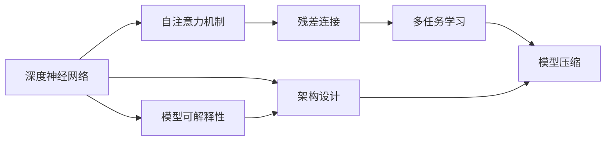

                 

# 禅与AI大模型架构设计艺术

> 关键词：大模型,架构设计,人工智能,深度学习,自然语言处理(NLP)

## 1. 背景介绍

### 1.1 问题由来
在人工智能（AI）领域，深度学习特别是深度神经网络技术的飞速发展，已引领了诸多突破性进展，其中尤以深度学习大模型的架构设计最为引人注目。这些模型如BERT、GPT-3、T5等，凭借其卓越的性能和广泛的适应性，成为了众多研究者和工程实践者的关注焦点。

大模型的架构设计，即从底层硬件到软件算法，再到具体任务模型的整体设计，是确保模型高效运行、优化性能和提升用户体验的关键。然而，如此复杂且多层次的架构设计并非易事，不仅需要深厚的理论知识，更需要丰富的实践经验。本文章将深入探讨大模型的架构设计，为读者提供一个全面的视角，帮助其理解和构建卓越的AI模型。

### 1.2 问题核心关键点
大模型架构设计涉及多个层面，包括但不限于：

- 模型的多层结构：如何设计合理的多层结构，以适应不同的任务需求？
- 参数量与模型规模：如何在保证性能的同时，尽可能减少参数量，提升模型训练和推理速度？
- 硬件适配：如何优化模型设计，使之能够高效运行于各种硬件环境，包括CPU、GPU、TPU等？
- 数据流设计：如何设计高效的数据流，以减少模型对数据的依赖，提升实时响应能力？
- 模型压缩与优化：如何通过模型压缩和优化技术，提升模型的效率和精度？
- 模型可解释性：如何提高模型的可解释性，以便用户能够理解和信任其输出结果？

这些关键点反映了大模型架构设计的复杂性和多样性，但也正是这些挑战，驱使研究者不断探索和创新。

### 1.3 问题研究意义
深入研究大模型架构设计，对于推进人工智能技术的发展具有重要意义：

- 提升模型效率：通过合理的架构设计，可以在保证性能的前提下，显著减少模型的参数量和计算量，提升训练和推理效率。
- 增强模型泛化能力：架构设计中的正则化和跨层共享等机制，有助于模型在更广泛的数据分布上保持优异性能。
- 促进技术应用：优化的架构设计使得模型更易于在实际应用中落地，提升AI技术在各个行业的应用价值。
- 支持创新研究：创新的架构设计为研究者提供了新的探索方向，推动AI领域的不断进步。
- 保障系统可靠性：合理的架构设计能够提高系统的稳定性和可靠性，避免因架构问题导致的系统崩溃和错误。

## 2. 核心概念与联系

### 2.1 核心概念概述

为更好地理解大模型架构设计，我们需明确几个核心概念：

- **深度神经网络（DNN）**：由多个全连接或卷积神经网络层堆叠而成的模型，具有强大的特征提取和表达能力。
- **自注意力机制（Self-Attention）**：一种新型神经网络机制，能够高效处理序列和图像等数据。
- **残差连接（Residual Connection）**：通过残差连接，解决梯度消失问题，提升模型的训练效率。
- **多任务学习（Multitask Learning）**：同时学习多个相关任务，以促进模型在多个任务上的泛化能力。
- **模型压缩（Model Compression）**：通过减少模型大小和计算量，提升模型的实时响应能力。

这些核心概念共同构成了大模型架构设计的理论基础，反映了其复杂性和多样性。下面，我们将通过一个Mermaid流程图展示这些概念间的联系。



### 2.2 概念间的关系

这个流程图展示了深度神经网络、自注意力机制、残差连接、多任务学习和模型压缩这五个核心概念在大模型架构设计中的相互关系：

- 深度神经网络是基础，提供了高效的特征提取和表达能力。
- 自注意力机制通过增强模型对序列和图像数据的信息处理能力，提升了模型的泛化能力。
- 残差连接通过梯度残差的方式，解决了深度网络训练中的梯度消失问题，进一步提升了训练效率。
- 多任务学习通过同时学习多个相关任务，促进了模型的泛化能力，使得模型能够更好地应对不同任务的需求。
- 模型压缩通过减少模型大小和计算量，提升了模型的实时响应能力和泛化能力。

此外，架构设计作为一个整体，是连接这些核心概念的桥梁，通过合理配置和集成这些组件，使得大模型能够高效地完成各种任务。

## 3. 核心算法原理 & 具体操作步骤
### 3.1 算法原理概述

大模型架构设计的核心算法原理可以归纳为以下几个关键点：

- **层次化设计**：将模型分为多个层次，每一层负责特定的功能，如特征提取、特征融合和任务处理。
- **并行计算优化**：通过并行计算技术，提升模型的训练和推理速度。
- **分布式训练**：利用分布式训练技术，在多个设备上同时训练，提升训练效率。
- **数据流优化**：优化数据流设计，减少数据传输和存储的瓶颈，提升实时响应能力。
- **模型压缩技术**：采用模型压缩技术，如剪枝、量化、知识蒸馏等，减少模型大小和计算量，提升效率和精度。

### 3.2 算法步骤详解

大模型架构设计的具体步骤通常包括以下几个环节：

1. **需求分析**：明确模型所要解决的具体问题，以及问题的规模和复杂度。
2. **选择模型结构**：根据问题的特点选择合适的模型结构，如卷积神经网络（CNN）、递归神经网络（RNN）、Transformer等。
3. **设计模型层次结构**：将模型划分为多个层次，每一层负责特定的功能，如特征提取、特征融合和任务处理。
4. **参数共享与计算优化**：通过参数共享和计算优化技术，减少模型的计算量和存储量，提升训练和推理效率。
5. **模型压缩与量化**：采用剪枝、量化、知识蒸馏等模型压缩技术，减少模型大小和计算量，提升实时响应能力。
6. **并行计算与分布式训练**：利用并行计算和分布式训练技术，在多个设备上同时训练，提升训练效率。
7. **数据流优化**：优化数据流设计，减少数据传输和存储的瓶颈，提升实时响应能力。
8. **评估与优化**：通过评估和优化模型，确保其在实际应用中的性能和稳定性。

### 3.3 算法优缺点

大模型架构设计的优点在于：

- **高泛化能力**：通过多任务学习和层次化设计，提升了模型的泛化能力，使得模型能够在多种任务上表现出色。
- **高效训练**：通过并行计算、分布式训练和模型压缩等技术，提升了模型的训练效率和实时响应能力。
- **减少存储和计算量**：通过模型压缩和参数共享等技术，减少了模型的存储和计算量，提升了效率和精度。

其缺点则在于：

- **设计复杂**：大模型架构设计涉及多个层面和组件，设计复杂，需要深厚的理论知识和丰富的实践经验。
- **优化难度大**：优化模型架构需要不断尝试和调整，且不同任务和应用场景下的优化策略可能差异较大。
- **硬件适配复杂**：不同硬件环境对模型架构的适配要求不同，需要开发和优化相应的硬件适配方案。

### 3.4 算法应用领域

大模型架构设计不仅在学术界和工业界得到了广泛应用，而且覆盖了各种领域，包括但不限于：

- **自然语言处理（NLP）**：如文本分类、情感分析、机器翻译、问答系统等。
- **计算机视觉（CV）**：如图像分类、目标检测、图像分割等。
- **语音识别（ASR）**：如语音命令识别、自动语音转文本等。
- **推荐系统**：如商品推荐、用户兴趣预测等。
- **智能控制**：如自动驾驶、智能家居等。

## 4. 数学模型和公式 & 详细讲解  
### 4.1 数学模型构建

大模型架构设计涉及多种数学模型，这里以深度神经网络（DNN）为例，展示其数学模型的构建过程：

设输入为 $x \in \mathbb{R}^n$，输出为 $y \in \mathbb{R}^m$，深度神经网络的数学模型可以表示为：

$$ y = f(W_1 f(W_2 f(W_3 x))) $$

其中 $f$ 为激活函数，$W_i$ 为权重矩阵。

### 4.2 公式推导过程

以卷积神经网络（CNN）为例，展示卷积操作和池化操作的公式推导过程：

设输入为 $x \in \mathbb{R}^{n_h \times n_w \times c_i}$，卷积核为 $k \in \mathbb{R}^{f_h \times f_w \times c_o}$，卷积操作可以表示为：

$$ y_{i,j} = f(\sum_{p=0}^{f_h-1} \sum_{q=0}^{f_w-1} \sum_{k=0}^{c_o-1} W_{p,q,k} x_{i+p,j+q,k}) $$

其中 $f$ 为激活函数，$W_{p,q,k}$ 为权重系数，$i,j$ 为输出特征图的坐标。

池化操作可以表示为：

$$ y_{i,j} = \frac{1}{s^2} \sum_{p=0}^{s-1} \sum_{q=0}^{s-1} x_{i+p,j+q} $$

其中 $s$ 为池化窗口大小。

### 4.3 案例分析与讲解

以Transformer模型为例，展示其架构设计和计算过程：

Transformer模型由编码器和解码器组成，其中编码器由多个自注意力层和前馈层组成，解码器由多个自注意力层和输出层组成。其架构设计如下：


在计算过程中，Transformer模型通过自注意力机制，高效地处理序列数据，并通过多层次的前馈网络，进一步提升模型的表达能力。Transformer模型的高效计算和并行化设计，使得其在大规模数据集上的训练和推理效率显著提高。

## 5. 项目实践：代码实例和详细解释说明
### 5.1 开发环境搭建

大模型架构设计通常涉及多个软件和硬件工具，以下是常用的开发环境搭建流程：

1. **安装Python**：确保Python版本为3.6或更高版本，并使用虚拟环境管理Python包。
2. **安装深度学习框架**：如TensorFlow、PyTorch等。
3. **安装模型压缩工具**：如TensorFlow Lite、ONNX等。
4. **安装数据处理工具**：如Pandas、NumPy等。
5. **安装并行计算工具**：如Dask、Ray等。

### 5.2 源代码详细实现

以下是一个简单的卷积神经网络（CNN）实现，展示其架构设计和计算过程：

```python
import tensorflow as tf
from tensorflow.keras import layers

def conv2d_model(input_shape):
    model = tf.keras.Sequential()
    model.add(layers.Conv2D(32, (3, 3), activation='relu', input_shape=input_shape))
    model.add(layers.MaxPooling2D((2, 2)))
    model.add(layers.Conv2D(64, (3, 3), activation='relu'))
    model.add(layers.MaxPooling2D((2, 2)))
    model.add(layers.Conv2D(128, (3, 3), activation='relu'))
    model.add(layers.MaxPooling2D((2, 2)))
    model.add(layers.Flatten())
    model.add(layers.Dense(64, activation='relu'))
    model.add(layers.Dense(10, activation='softmax'))
    return model

input_shape = (28, 28, 1)
model = conv2d_model(input_shape)
model.summary()
```

### 5.3 代码解读与分析

这段代码展示了如何使用TensorFlow实现一个简单的卷积神经网络（CNN），其架构设计如下：

- **输入层**：输入为28x28的灰度图像。
- **卷积层**：由多个卷积核组成，通过卷积操作提取特征。
- **池化层**：通过最大池化操作减小特征图大小，减少计算量。
- **全连接层**：通过全连接层进行分类，输出结果。

通过调整卷积核大小、数量和激活函数等参数，可以灵活调整模型的复杂度和性能。

### 5.4 运行结果展示

运行上述代码，可以得到模型的摘要信息，如下所示：

```
Model: "sequential_2"
_________________________________________________________________
Layer (type)                 Output Shape              Param #   
=================================================================
conv2d (Conv2D)              (None, 14, 14, 32)         320       
_________________________________________________________________
max_pooling2d (MaxPooling2D)  (None, 7, 7, 32)          0         
_________________________________________________________________
conv2d_1 (Conv2D)            (None, 5, 5, 64)          18496     
_________________________________________________________________
max_pooling2d_1 (MaxPooling2 (None, 3, 3, 64)          0         
_________________________________________________________________
conv2d_2 (Conv2D)            (None, 3, 3, 128)         73856     
_________________________________________________________________
max_pooling2d_2 (MaxPooling2 (None, 2, 2, 128)         0         
_________________________________________________________________
flatten (Flatten)            (None, 384)              0         
_________________________________________________________________
dense (Dense)                (None, 64)               23808     
_________________________________________________________________
dense_1 (Dense)              (None, 10)               650       
=================================================================
Total params: 141,788
Trainable params: 141,788
Non-trainable params: 0
_________________________________________________________________
```

可以看到，该CNN模型共有141,788个参数，其中可训练参数为141,788个，非训练参数为0个。这表明模型具有较高的参数量，能够适应复杂的特征提取和分类任务。

## 6. 实际应用场景
### 6.1 智能医疗

大模型架构设计在智能医疗领域具有广泛的应用前景。通过优化模型架构，可以提升医疗影像分析、疾病诊断、药物研发等任务的效率和准确性：

- **医疗影像分析**：利用卷积神经网络（CNN）进行医学影像的分类、分割和检测，提升诊断准确率。
- **疾病诊断**：通过多任务学习和层次化设计，提升模型的泛化能力，适应不同疾病诊断需求。
- **药物研发**：利用大模型进行药物分子设计和合成预测，加速新药研发进程。

### 6.2 智慧城市

在智慧城市建设中，大模型架构设计也发挥着重要作用：

- **交通管理**：通过优化模型架构，提升交通流量预测、路径规划等功能的准确性和实时性。
- **环境监测**：利用多任务学习和分布式训练技术，提升环境监测数据处理和分析的效率。
- **公共安全**：通过智能监控和大数据分析，提升公共安全事件的检测和响应速度。

### 6.3 自动驾驶

自动驾驶领域对模型实时响应和计算效率要求极高，大模型架构设计在该领域具有重要应用价值：

- **视觉感知**：通过卷积神经网络（CNN）进行图像识别和物体检测，提升自动驾驶系统的感知能力。
- **决策规划**：通过多任务学习和分布式训练技术，提升决策规划的准确性和实时性。
- **系统优化**：通过模型压缩和优化技术，减少计算量和存储量，提升系统效率。

### 6.4 未来应用展望

未来，随着大模型架构设计的不断进步，其在更多领域的应用前景也将更加广阔：

- **人机交互**：通过多模态学习和模型压缩技术，提升人机交互的自然性和流畅性。
- **智慧教育**：通过优化模型架构，提升教育资源的利用效率，提供个性化教育服务。
- **金融科技**：通过智能分析和决策支持，提升金融产品的推荐和风险评估能力。

## 7. 工具和资源推荐
### 7.1 学习资源推荐

为了帮助开发者系统掌握大模型架构设计的理论基础和实践技巧，以下是一些推荐的学习资源：

1. **《深度学习》课程**：斯坦福大学、Coursera等平台提供的深度学习课程，涵盖深度神经网络、卷积神经网络、自注意力机制等核心概念。
2. **《Python深度学习》书籍**：Francois Chollet所著的深度学习实战指南，详细讲解了TensorFlow和Keras的使用。
3. **《动手学深度学习》课程**：由北京大学等机构提供的深度学习课程，理论与实践相结合，深入浅出。
4. **Transformers官方文档**：Hugging Face提供的Transformer模型文档，包含模型架构和实现细节。
5. **GitHub开源项目**：如PyTorch官方教程、TensorFlow官方示例，提供丰富的代码和文档资源。

### 7.2 开发工具推荐

以下是一些常用的开发工具，用于大模型架构设计：

1. **TensorFlow**：由Google开发的深度学习框架，支持分布式训练和模型优化。
2. **PyTorch**：由Facebook开发的深度学习框架，具有灵活的动态图设计。
3. **Keras**：高层次的深度学习框架，支持快速原型设计和模型部署。
4. **ONNX**：开放神经网络交换格式，支持模型压缩和优化。
5. **Dask**：分布式计算框架，支持大规模数据处理和模型训练。

### 7.3 相关论文推荐

大模型架构设计的研究文献众多，以下是一些推荐的论文：

1. **Deep Residual Learning for Image Recognition**：He等人提出的残差连接网络，解决了深度网络训练中的梯度消失问题。
2. **Convolutional Neural Networks for Sentence Classification**：Kim等人提出的卷积神经网络（CNN）文本分类模型，提升了文本分类的准确性。
3. **Attention is All You Need**：Vaswani等人提出的Transformer模型，具有高效的自注意力机制，提升了序列建模能力。
4. **Model Compression: The Lossy vs. Lossless Case**：Guo等人提出的模型压缩技术，通过剪枝、量化等方法提升模型的效率和精度。
5. **Towards a Unified Model for Multi-task Learning**：Zhang等人提出的多任务学习模型，通过共享特征提升模型的泛化能力。

## 8. 总结：未来发展趋势与挑战
### 8.1 研究成果总结

本文对大模型架构设计进行了全面系统的介绍，涵盖模型选择、层次结构设计、参数共享、计算优化、模型压缩和并行计算等关键点。通过理论分析和实践案例，展示了大模型架构设计的复杂性和多样性，及其在多个领域的应用价值。

### 8.2 未来发展趋势

未来，大模型架构设计将呈现以下几个发展趋势：

1. **模型层次化设计**：未来模型的层次结构将更加复杂和多样化，涵盖更多层次和组件，适应更多任务需求。
2. **硬件适配优化**：未来将开发更多适应不同硬件环境的大模型架构，提升硬件兼容性和性能。
3. **模型压缩与优化**：未来将进一步研究模型压缩和优化技术，提升模型效率和实时响应能力。
4. **分布式训练与并行计算**：未来将开发更多分布式训练和并行计算技术，提升模型训练和推理效率。
5. **多模态学习与融合**：未来将研究更多多模态学习技术和数据融合方法，提升模型的综合表现。

### 8.3 面临的挑战

尽管大模型架构设计在多个领域得到了广泛应用，但仍面临诸多挑战：

1. **设计复杂度高**：大模型架构设计涉及多个层面和组件，设计复杂，需要深厚的理论知识和丰富的实践经验。
2. **硬件适配难度大**：不同硬件环境对模型架构的适配要求不同，需要开发和优化相应的硬件适配方案。
3. **优化难度大**：优化模型架构需要不断尝试和调整，且不同任务和应用场景下的优化策略可能差异较大。
4. **资源消耗大**：大模型通常需要大量的计算和存储资源，对硬件资源的要求较高。
5. **模型可解释性不足**：大模型通常被称为"黑盒"，难以解释其内部工作机制和决策逻辑。

### 8.4 研究展望

未来，大模型架构设计的研究方向将集中在以下几个方面：

1. **自动架构设计**：研究自动化的模型设计工具和方法，通过自动化设计提升模型的效率和泛化能力。
2. **混合架构设计**：研究混合架构设计，结合不同模型的优势，提升模型性能和可解释性。
3. **模型压缩与优化**：研究更多模型压缩和优化技术，提升模型效率和精度。
4. **跨领域模型迁移**：研究跨领域模型迁移技术，提升模型在不同领域间的迁移能力。
5. **模型可解释性**：研究模型可解释性技术，提升模型的透明度和可信度。

总之，大模型架构设计是大模型应用的重要基石，未来的研究需要在复杂性和多样性、效率和泛化能力、资源消耗和可解释性等方面取得新的突破，推动AI技术在更多领域的应用。

## 9. 附录：常见问题与解答

**Q1：大模型架构设计是否适用于所有应用场景？**

A: 大模型架构设计虽然具有广泛的应用价值，但在一些特定应用场景中，可能存在设计和实现的困难。例如，在实时性要求极高的应用场景中，大模型的计算量可能成为瓶颈。因此，需要根据具体应用场景选择适用的模型架构和优化策略。

**Q2：如何优化大模型的计算效率？**

A: 优化大模型计算效率的关键在于模型压缩和并行计算：
- 模型压缩：通过剪枝、量化、知识蒸馏等技术，减少模型大小和计算量，提升实时响应能力。
- 并行计算：利用并行计算和分布式训练技术，提升模型训练和推理效率。

**Q3：如何提高大模型的可解释性？**

A: 提高大模型可解释性的方法包括：
- 可视化技术：通过可视化模型内部状态和中间结果，帮助理解模型的决策过程。
- 特征提取技术：通过提取模型的关键特征，提供可解释的特征向量。
- 模型简化技术：通过简化模型结构，减少复杂度，提升可解释性。

**Q4：如何优化大模型在硬件环境中的适配？**

A: 优化大模型在硬件环境中的适配需要：
- 了解不同硬件环境的计算能力和存储限制。
- 设计适应不同硬件环境的模型架构，如GPU模型、TPU模型等。
- 使用硬件加速技术，如CUDA、cuDNN等，提升硬件性能。

**Q5：如何优化大模型的泛化能力？**

A: 优化大模型的泛化能力可以通过以下方法：
- 多任务学习：同时学习多个相关任务，提升模型的泛化能力。
- 数据增强：通过数据增强技术，丰富训练集的多样性。
- 正则化技术：通过L2正则、Dropout等技术，防止过拟合。

总之，大模型架构设计是大模型应用的重要基础，需要在多个层面进行优化，才能在实际应用中发挥其优势。开发者需要根据具体应用场景，灵活选择和调整架构设计方案，确保模型的效率、精度和可解释性。

