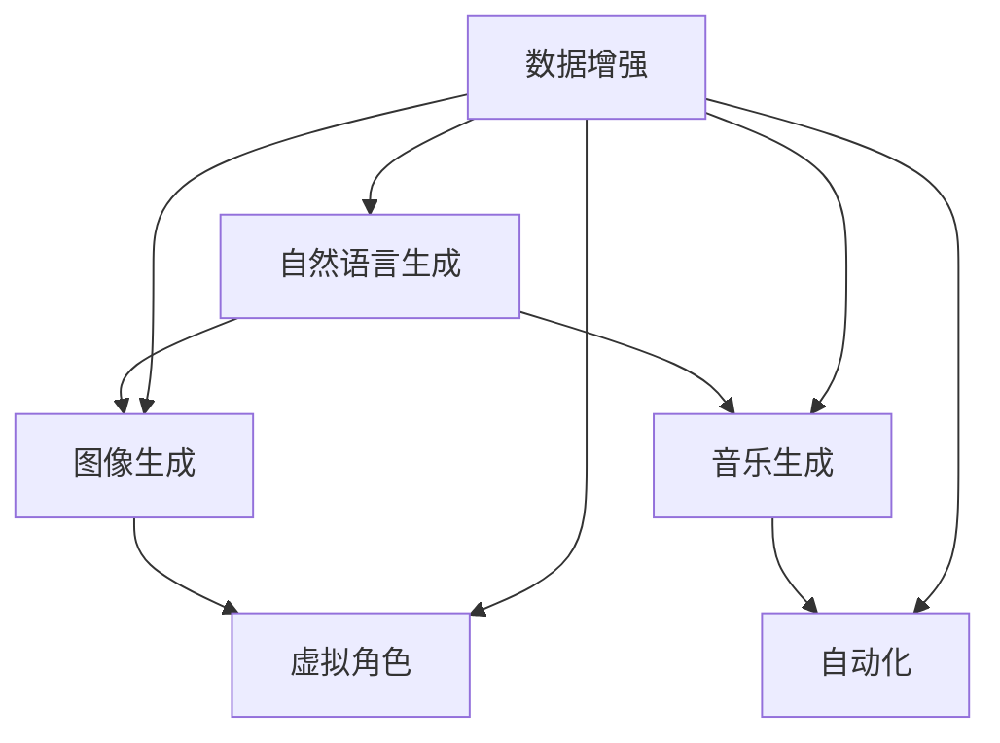

                 

# 生成式AIGC：AI技术的商业应用

> 关键词：生成式AIGC, 人工智能, AI商业应用, 自然语言生成, 图像生成, 音乐生成, 游戏, 虚拟角色, 自动化

## 1. 背景介绍

随着人工智能(AI)技术的不断进步，AI已经渗透到各行各业，成为推动数字经济发展的关键力量。其中，生成式AI (Generative AI, AIGC)作为AI技术的一个重要分支，通过生成自然语言、图像、音乐等内容，为商业应用提供了强大的创意支持。生成式AIGC不仅能够快速生成高品质的内容，还能在广告、媒体、游戏、设计等场景中发挥重要作用。本文档将深入探讨生成式AIGC的核心概念和应用实践，力求为技术开发者和商业应用者提供全方位的指导。

## 2. 核心概念与联系

### 2.1 核心概念概述

生成式AI，即AIGC，是一种通过训练深度神经网络模型，从给定的输入数据中生成新的、从未出现过的数据的技术。AIGC技术涵盖了自然语言生成(NLG)、图像生成(IG)、音乐生成(MG)等多个领域。以下是一些核心概念及其关联：

- **自然语言生成(NLG)**：使用机器学习模型从文本数据中生成新的自然语言文本，如自动生成文章、对话、摘要等。
- **图像生成(IG)**：使用生成对抗网络(GAN)等模型从噪声中生成高质量的图像，如人脸、风景、艺术品等。
- **音乐生成(MG)**：通过音乐生成模型从输入音乐中生成新的音乐作品，包括旋律、和弦、节奏等。
- **虚拟角色(VR)**：通过生成式模型创建逼真的虚拟人物形象，用于游戏、虚拟会议、影视制作等场景。
- **自动化(AR)**：通过生成式模型自动化设计、创作、优化，如自动设计图纸、生成广告文案等。

这些技术在实际应用中，通常需要结合特定的业务场景和需求，通过深度学习和数据增强技术，进行模型训练和优化。

### 2.2 核心概念的整体架构

以下是AIGC技术的核心概念架构，展示了各技术之间的关联和交互：



这个架构图展示了AIGC技术的多种应用场景和数据增强技术的普遍作用。其中，自然语言生成、图像生成、音乐生成和虚拟角色等技术可以通过数据增强技术来提高模型的泛化能力和性能。

## 3. 核心算法原理 & 具体操作步骤

### 3.1 算法原理概述

生成式AIGC技术通常基于生成对抗网络(GAN)、变分自编码器(VAE)、深度神经网络(DNN)等模型进行构建。以生成对抗网络为例，其主要原理是通过两个对抗神经网络，一个生成器生成假样本，另一个判别器区分真样本和假样本，两者的对抗过程推动生成器生成更逼真的样本。

具体而言，AIGC算法包括以下步骤：

1. **数据准备**：收集和预处理训练数据集。
2. **模型选择**：选择合适的生成模型，如GAN、VAE等。
3. **训练过程**：训练生成模型以生成高质量的输出。
4. **后处理**：对生成结果进行后处理，如去噪、调整等。
5. **优化**：通过优化算法和超参数调整，提升生成质量。

### 3.2 算法步骤详解

#### 3.2.1 数据准备

数据准备是AIGC模型训练的基础，包括以下步骤：

- **数据收集**：收集与生成任务相关的数据集，如文本、图像、音频等。
- **数据预处理**：进行数据清洗、归一化、标注等预处理操作。
- **数据增强**：使用数据增强技术如旋转、翻转、裁剪等，增加数据的多样性，提高模型的泛化能力。

#### 3.2.2 模型选择

根据生成任务的不同，选择合适的生成模型：

- **GAN**：生成对抗网络，由生成器和判别器组成，生成高质量的图像、音频、视频等。
- **VAE**：变分自编码器，生成连续的潜在变量，用于生成自然语言、音乐等。
- **DNN**：深度神经网络，用于生成文本、图像等。

#### 3.2.3 训练过程

训练生成模型的主要步骤如下：

- **定义损失函数**：选择适当的损失函数，如交叉熵、均方误差等。
- **优化器选择**：选择合适的优化算法，如Adam、SGD等。
- **模型训练**：进行多轮训练，不断优化生成器性能。

#### 3.2.4 后处理

生成结果通常需要进行后处理以提升质量，包括去噪、调整、修复等操作。例如，图像生成后的后处理包括平滑、去噪等操作。

#### 3.2.5 优化

通过调整超参数和优化算法，提升生成模型的性能，如学习率、批大小、迭代次数等。

### 3.3 算法优缺点

生成式AIGC技术的优点包括：

- **自动化**：自动化生成内容，节省了大量的人工成本。
- **效率高**：生成速度较快，能够快速响应需求。
- **多样性**：生成的内容多样化，满足不同用户的需求。

其缺点包括：

- **质量参差不齐**：生成内容的质量往往不稳定，可能出现不自然或失真等情况。
- **依赖于数据**：生成质量高度依赖于训练数据的质量和数量。
- **可控性差**：生成内容不易控制，可能会出现不相关或不合理的内容。

### 3.4 算法应用领域

生成式AIGC技术在多个领域具有广泛的应用：

- **广告**：自动生成广告文案、图像等，提升广告效果。
- **媒体**：生成新闻、文章、视频等内容，满足快速发布的需求。
- **游戏**：生成虚拟角色、场景、道具等，提升游戏体验。
- **设计**：生成建筑设计、平面设计、产品设计等，提升设计效率。
- **金融**：生成模拟市场数据、客户报告等，辅助金融决策。
- **娱乐**：生成音乐、电影、小说等，丰富娱乐内容。

## 4. 数学模型和公式 & 详细讲解 & 举例说明

### 4.1 数学模型构建

生成式AIGC模型通常基于生成对抗网络(GAN)进行构建，包括生成器和判别器两个子网络。生成器将随机噪声转换为逼真的数据样本，判别器则区分真实数据和生成数据。

设生成器的参数为 $G$，判别器的参数为 $D$，输入噪声为 $z$。生成器将噪声 $z$ 转换为生成数据 $x$：

$$
x = G(z)
$$

判别器将输入数据 $x$ 分类为真实数据（标签为1）和生成数据（标签为0）：

$$
y = D(x)
$$

生成器的目标是最小化判别器无法区分真实数据和生成数据，即：

$$
\mathop{\min}_{G} \mathbb{E}_{z \sim p(z)}[D(G(z))]
$$

判别器的目标是最小化识别真实数据和生成数据的误差，即：

$$
\mathop{\max}_{D} \mathbb{E}_{x \sim p_{data}(x)}[D(x)] + \mathbb{E}_{z \sim p(z)}[D(G(z))]
$$

其中，$p(z)$ 为噪声分布，$p_{data}(x)$ 为真实数据分布。

### 4.2 公式推导过程

根据生成对抗网络的训练目标，可以推导出生成器和判别器的更新公式。

生成器的更新公式为：

$$
G_{\theta} = \mathop{\arg\min}_{G} \mathbb{E}_{z \sim p(z)}[D(G(z))]
$$

判别器的更新公式为：

$$
D_{\phi} = \mathop{\arg\max}_{D} \mathbb{E}_{x \sim p_{data}(x)}[D(x)] + \mathbb{E}_{z \sim p(z)}[D(G(z))]
$$

使用梯度下降算法更新生成器和判别器的参数。生成器的参数更新公式为：

$$
\theta_G \leftarrow \theta_G - \eta \nabla_{\theta_G} \mathbb{E}_{z \sim p(z)}[D(G(z))]
$$

判别器的参数更新公式为：

$$
\phi_D \leftarrow \phi_D - \eta \nabla_{\phi_D} \mathbb{E}_{x \sim p_{data}(x)}[D(x)] + \mathbb{E}_{z \sim p(z)}[D(G(z))]
$$

其中，$\eta$ 为学习率。

### 4.3 案例分析与讲解

以图像生成为例，使用GAN生成逼真的猫脸图像：

1. **数据准备**：收集猫脸图像数据集，并进行预处理。
2. **模型选择**：选择U-Net结构作为生成器，DCGAN结构作为判别器。
3. **训练过程**：定义损失函数，选择Adam优化器，进行多轮训练。
4. **后处理**：对生成的图像进行去噪、调整等操作。
5. **优化**：调整学习率、批大小等超参数，提升生成质量。

## 5. 项目实践：代码实例和详细解释说明

### 5.1 开发环境搭建

在搭建开发环境之前，需要安装以下软件：

- **Python**：安装最新版本的Python，并配置好开发环境。
- **PyTorch**：安装PyTorch深度学习框架。
- **TensorFlow**：安装TensorFlow深度学习框架。
- **Numpy**：安装NumPy科学计算库。
- **Matplotlib**：安装Matplotlib绘图库。
- **Pandas**：安装Pandas数据分析库。
- **TensorBoard**：安装TensorBoard可视化工具。

### 5.2 源代码详细实现

以图像生成为例，使用PyTorch实现U-Net结构生成猫脸图像：

```python
import torch
import torch.nn as nn
import torchvision.transforms as transforms
from torchvision.utils import save_image
from torch.utils.data import DataLoader
from torchvision.datasets import CIFAR10

# 定义U-Net结构
class UNet(nn.Module):
    def __init__(self):
        super(UNet, self).__init__()
        self.down1 = nn.Conv2d(3, 64, 3, 1, 1)
        self.down2 = nn.Conv2d(64, 128, 3, 2, 1)
        self.down3 = nn.Conv2d(128, 256, 3, 2, 1)
        self.down4 = nn.Conv2d(256, 512, 3, 2, 1)
        self.up1 = nn.ConvTranspose2d(512, 256, 3, 2, 1)
        self.up2 = nn.ConvTranspose2d(256, 128, 3, 2, 1)
        self.up3 = nn.ConvTranspose2d(128, 64, 3, 2, 1)
        self.up4 = nn.ConvTranspose2d(64, 3, 3, 2, 1)
        self.down1bn = nn.BatchNorm2d(64)
        self.down2bn = nn.BatchNorm2d(128)
        self.down3bn = nn.BatchNorm2d(256)
        self.down4bn = nn.BatchNorm2d(512)
        self.up1bn = nn.BatchNorm2d(256)
        self.up2bn = nn.BatchNorm2d(128)
        self.up3bn = nn.BatchNorm2d(64)
        self.up4bn = nn.BatchNorm2d(3)

    def forward(self, x):
        x1 = F.relu(self.down1(x))
        x1 = self.down1bn(x1)
        x2 = F.relu(self.down2(x1))
        x2 = self.down2bn(x2)
        x3 = F.relu(self.down3(x2))
        x3 = self.down3bn(x3)
        x4 = F.relu(self.down4(x3))
        x4 = self.down4bn(x4)
        x = F.relu(self.up1(x4))
        x = self.up1bn(x)
        x = torch.cat([x, x4], dim=1)
        x = F.relu(self.up2(x))
        x = self.up2bn(x)
        x = torch.cat([x, x3], dim=1)
        x = F.relu(self.up3(x))
        x = self.up3bn(x)
        x = torch.cat([x, x2], dim=1)
        x = F.relu(self.up4(x))
        x = self.up4bn(x)
        x = F.relu(self.up4(x))
        x = self.up4bn(x)
        x = torch.tanh(x)
        return x

# 定义训练函数
def train_model(model, dataloader, optimizer, device):
    model.train()
    for epoch in range(num_epochs):
        for batch_idx, (data, target) in enumerate(dataloader):
            data, target = data.to(device), target.to(device)
            optimizer.zero_grad()
            output = model(data)
            criterion = nn.BCEWithLogitsLoss()
            loss = criterion(output, target)
            loss.backward()
            optimizer.step()
            if (batch_idx + 1) % 100 == 0:
                print('Train Epoch: {} [{}/{} ({:.0f}%)]\tLoss: {:.6f}'.format(
                    epoch, batch_idx * len(data), len(dataloader.dataset),
                    100. * batch_idx / len(dataloader) + 1, loss.item()))

# 定义测试函数
def test_model(model, dataloader, device):
    model.eval()
    with torch.no_grad():
        for batch_idx, (data, target) in enumerate(dataloader):
            data, target = data.to(device), target.to(device)
            output = model(data)
            criterion = nn.BCEWithLogitsLoss()
            loss = criterion(output, target)
            print('Test Epoch: {} [{}/{} ({:.0f}%)]\tLoss: {:.6f}'.format(
                epoch, batch_idx * len(data), len(dataloader.dataset),
                100. * batch_idx / len(dataloader) + 1, loss.item()))
            sample = output[0]
            sample = sample.view(3, 32, 32).cpu()
            save_image(sample, 'output.png', nrow=1, padding=2)

# 初始化模型、数据集和优化器
model = UNet().to(device)
criterion = nn.BCEWithLogitsLoss()
optimizer = torch.optim.Adam(model.parameters(), lr=0.0002)
dataloader = DataLoader(CIFAR10(root='./', transform=transforms.ToTensor(), download=True), batch_size=4)
device = torch.device("cuda" if torch.cuda.is_available() else "cpu")

# 训练模型
train_model(model, dataloader, optimizer, device)

# 测试模型
test_model(model, dataloader, device)
```

### 5.3 代码解读与分析

以上代码实现了使用U-Net结构生成猫脸图像的训练和测试过程。其中，U-Net结构包括编码器和解码器两部分，通过编码器对输入图像进行下采样，得到低维特征图；通过解码器对特征图进行上采样，得到高维图像。使用Adam优化器进行训练，并使用BCEWithLogitsLoss作为损失函数。训练过程中，通过打印损失值和保存输出图像，实时监控模型训练效果。

## 6. 实际应用场景

### 6.1 广告

生成式AIGC技术可以自动生成高质量的广告文案和图像，满足不同广告主的需求。例如，可以使用GAN生成逼真的广告图像，使用NLG生成具有吸引力的广告文案。广告公司可以批量生成广告素材，大幅提高广告创作效率，降低人工成本。

### 6.2 媒体

生成式AIGC技术可以自动生成新闻、文章、视频等内容，满足媒体平台对高质量内容的需求。例如，可以使用NLG生成新闻报道，使用GAN生成视频和图像，丰富媒体内容。媒体公司可以快速发布原创内容，提升用户黏性。

### 6.3 游戏

生成式AIGC技术可以自动生成虚拟角色、场景、道具等游戏元素，提升游戏体验。例如，可以使用GAN生成虚拟角色和场景，使用NLG生成对话和任务描述，提升游戏趣味性和互动性。游戏公司可以大量生成游戏素材，降低游戏制作成本。

### 6.4 设计

生成式AIGC技术可以自动生成建筑设计、平面设计、产品设计等，提升设计效率。例如，可以使用GAN生成建筑设计草图，使用NLG生成设计说明，提高设计创新性和效率。设计公司可以快速推出新产品，提升市场竞争力。

## 7. 工具和资源推荐

### 7.1 学习资源推荐

- **《深度学习》**：Ian Goodfellow 著，全面介绍了深度学习的基本原理和实践。
- **《生成对抗网络》**：Ian Goodfellow 著，详细介绍了GAN的原理和应用。
- **《自然语言生成技术》**：陈晓明 著，介绍了自然语言生成的技术和方法。
- **OpenAI 官方博客**：OpenAI 的官方博客，发布了大量关于生成式AI的最新研究和技术分享。
- **arXiv 论文预印本**：人工智能领域最新研究成果的发布平台，提供了大量关于生成式AI的论文和报告。

### 7.2 开发工具推荐

- **PyTorch**：深度学习框架，支持GPU加速，适合进行深度学习模型的训练和推理。
- **TensorFlow**：深度学习框架，支持多种硬件加速，适合进行大规模深度学习模型的训练和推理。
- **Jupyter Notebook**：交互式编程环境，支持代码调试和可视化展示。
- **GitHub**：代码托管平台，支持代码版本控制和项目管理。

### 7.3 相关论文推荐

- **Image-to-Image Translation with Conditional Adversarial Networks**：Isola 等，提出了一种条件对抗网络，用于图像生成和图像转换。
- **Unsupervised Text Generation via Cross-Modal Deep Learning**：Tan 等，提出了一种无监督文本生成方法，通过跨模态学习提升生成质量。
- **Real-Time Text-to-Speech Synthesis with Attention**：WaveNet 团队，提出了一种基于注意力机制的文本转语音生成模型，提升语音合成效果。
- **AutoDesign: Automated Design Synthesis and Reconstructions from Boundary Representations**：Shin 等，提出了一种自动设计生成模型，用于生成三维产品设计和工业布局。

## 8. 总结：未来发展趋势与挑战

### 8.1 研究成果总结

生成式AIGC技术在多个领域取得了显著进展，涵盖了自然语言生成、图像生成、音乐生成等多个方向。在实际应用中，已经展现出了广泛的应用前景和巨大的商业价值。

### 8.2 未来发展趋势

未来生成式AIGC技术将呈现以下几个发展趋势：

- **技术融合**：生成式AIGC技术将与其他AI技术如强化学习、知识图谱等进行深度融合，提升生成质量和应用范围。
- **多模态生成**：生成式AIGC技术将支持多种模态数据生成，如文本、图像、语音等，实现更丰富和多样化的内容生成。
- **跨领域应用**：生成式AIGC技术将拓展到更多领域，如医疗、金融、教育等，提供专业的生成服务。
- **自动化设计**：生成式AIGC技术将用于自动化设计、制造等工业应用，提升生产效率和创新能力。

### 8.3 面临的挑战

生成式AIGC技术虽然具有广泛的应用前景，但在实际应用中仍面临诸多挑战：

- **质量不稳定**：生成内容的质量往往不稳定，难以保证高质量的生成效果。
- **数据依赖**：生成质量高度依赖于训练数据的质量和数量，数据获取和标注成本高。
- **可控性差**：生成内容不易控制，可能会出现不相关或不合理的内容。

### 8.4 研究展望

未来生成式AIGC技术需要进一步研究解决上述挑战，提升生成质量、降低数据依赖、提高可控性。同时，需要在多模态生成、自动化设计、跨领域应用等方向进行深入探索，拓展应用范围和应用深度。

## 9. 附录：常见问题与解答

**Q1：生成式AIGC技术与其他AI技术有何区别？**

A: 生成式AIGC技术主要关注生成内容的生成，而其他AI技术如机器学习、深度学习、强化学习等更多关注数据的分析、预测和优化。虽然生成式AIGC技术可以与其他AI技术结合，但各自的目标和应用场景有所不同。

**Q2：生成式AIGC技术有哪些应用场景？**

A: 生成式AIGC技术可以在广告、媒体、游戏、设计、金融、娱乐等多个领域进行应用，生成高质量的文案、图像、视频、音乐等内容，提升业务效率和用户体验。

**Q3：生成式AIGC技术的生成质量如何？**

A: 生成式AIGC技术的生成质量通常由训练数据、模型参数、优化算法等因素决定。在充分训练和优化的情况下，生成内容的质量可以达到很高的水平。但在实际应用中，可能仍存在一定的质量不稳定问题。

**Q4：生成式AIGC技术如何处理生成内容的多样性？**

A: 生成式AIGC技术可以通过数据增强、正则化、对抗训练等方法，提升生成内容的多样性。例如，在生成图像时，可以通过旋转、缩放、颜色调整等操作，增加生成图像的多样性。

**Q5：生成式AIGC技术如何保证生成内容的真实性？**

A: 生成式AIGC技术可以通过引入真实数据、调整模型参数、优化算法等方法，提升生成内容的真实性。例如，在生成文本时，可以通过引入真实文本数据，调整模型的解码器参数，优化生成过程，减少生成内容的虚构和失真。

---

作者：禅与计算机程序设计艺术 / Zen and the Art of Computer Programming

