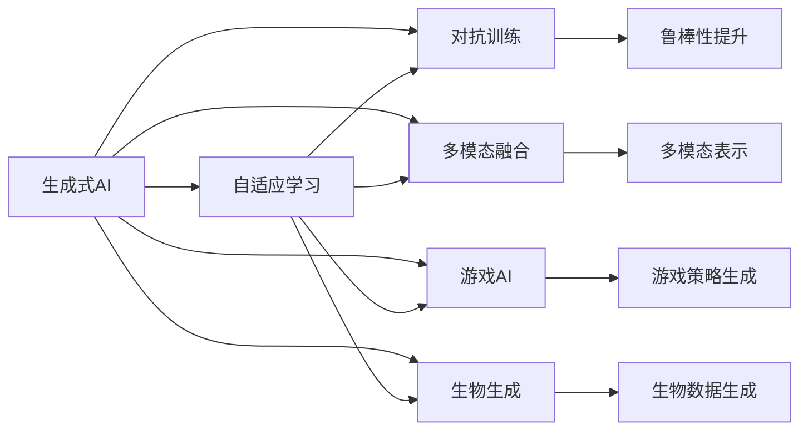
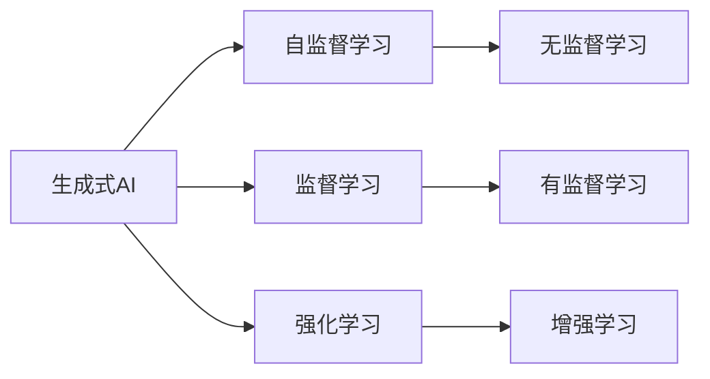
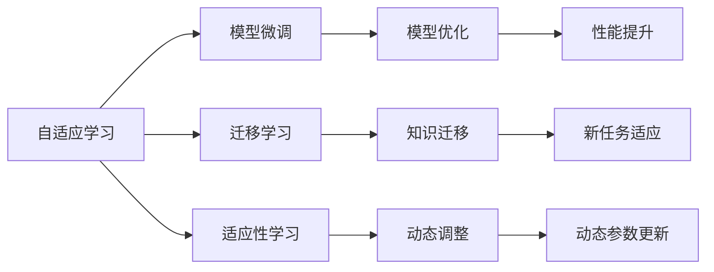
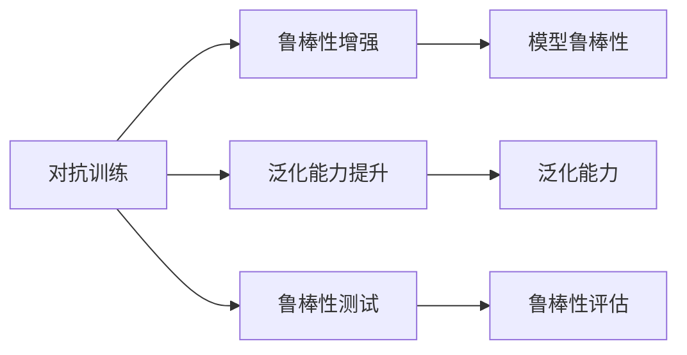
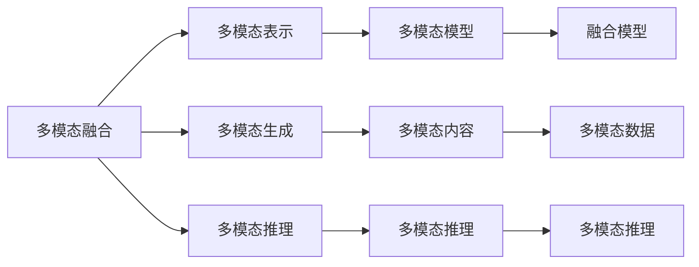

                 

# 生成式AI的未来发展路径

> 关键词：生成式AI, 语言模型, 自适应学习, 对抗训练, 多模态融合, 游戏AI, 生物生成

## 1. 背景介绍

生成式人工智能（Generative AI）是指能够生成新内容或数据，包括文本、图像、音频、视频等形式的AI系统。它代表了AI技术的一个重要分支，近年来在自然语言处理（NLP）、计算机视觉（CV）、语音处理等多个领域取得了突破性进展。

生成式AI的核心思想是通过对大量数据的学习，构建起一个模型，该模型可以生成新的、与训练数据分布相似的数据。这些数据通常包含语言、图像、声音等形式，具有高度的可解释性和创造性。生成式AI技术不仅在娱乐、艺术创作等领域得到了广泛应用，还在医学、金融、工业等多个领域显示出巨大的应用潜力。

### 1.1 问题由来

生成式AI的发展离不开深度学习技术的演进。自2014年深度学习在图像生成、语音识别等领域取得突破以来，生成式AI便逐渐成为AI研究的重要方向。近年来，随着Transformer等模型的出现，生成式AI进入了一个快速发展的新阶段，涌现出了大量的创新成果，如GPT系列模型、DALL·E 2等。

尽管生成式AI取得了显著进展，但其仍面临着许多挑战。模型训练需要庞大的数据和计算资源，生成的内容质量不稳定，且往往缺乏与人类情感共鸣的创造性。此外，模型生成的内容可能会传播错误信息，引发道德和伦理问题。

本文将深入探讨生成式AI的发展路径，旨在帮助读者更好地理解其核心原理和应用前景，并提出一些可能解决当前问题的方向。

## 2. 核心概念与联系

### 2.1 核心概念概述

为了更好地理解生成式AI的发展路径，我们首先需要介绍一些关键概念：

- **生成式AI**：一种能够生成新内容或数据的AI技术。
- **自适应学习**：模型能够根据输入数据自动调整参数，适应新任务。
- **对抗训练**：通过对抗样本提高模型的鲁棒性和泛化能力。
- **多模态融合**：将不同形式的输入数据（如文本、图像、音频等）进行融合，生成更加丰富的输出。
- **游戏AI**：用于游戏环境中进行决策和策略生成的AI。
- **生物生成**：生成式AI在生物学领域的应用，如蛋白质结构生成、药物分子设计等。

这些概念之间的联系可以通过以下Mermaid流程图来展示：



这个流程图展示了大语言模型微调中各个核心概念之间的关系：

1. **生成式AI**是核心概念，其他概念都与之相关。
2. **自适应学习**和**对抗训练**是生成式AI提升模型鲁棒性和泛化能力的两种方法。
3. **多模态融合**和**游戏AI**是生成式AI在特定场景下的应用。
4. **生物生成**则是生成式AI在生物学领域的应用。

### 2.2 概念间的关系

这些核心概念之间存在着紧密的联系，构成了生成式AI的完整生态系统。下面我们通过几个Mermaid流程图来展示这些概念之间的关系。

#### 2.2.1 生成式AI的学习范式



这个流程图展示了生成式AI的几种主要学习范式：

1. **自监督学习**和**无监督学习**适用于数据量不足或无法获得标注数据的场景。
2. **监督学习**和**强化学习**适用于数据充足且有明确目标的场景。
3. **增强学习**适用于需要与环境互动以优化策略的场景。

#### 2.2.2 自适应学习与生成式AI的关系



这个流程图展示了自适应学习在生成式AI中的应用：

1. **模型微调**和**迁移学习**是自适应学习在生成式AI中的两种主要应用方式。
2. **适应性学习**和**动态调整**则是自适应学习中的核心机制。
3. **模型优化**和**性能提升**是微调和迁移学习的目标。

#### 2.2.3 对抗训练与生成式AI的关系



这个流程图展示了对抗训练在生成式AI中的应用：

1. **鲁棒性增强**和**泛化能力提升**是对抗训练的主要目标。
2. **鲁棒性测试**和**鲁棒性评估**则是对抗训练的检验手段。

#### 2.2.4 多模态融合与生成式AI的关系



这个流程图展示了多模态融合在生成式AI中的应用：

1. **多模态表示**和**多模态生成**是多模态融合的主要目标。
2. **多模态推理**是实现多模态生成和多模态表示的关键技术。
3. **融合模型**和**多模态数据**是实现多模态融合的基础。

## 3. 核心算法原理 & 具体操作步骤
### 3.1 算法原理概述

生成式AI的核心算法原理包括自适应学习、对抗训练、多模态融合等。其中，自适应学习是指模型能够根据输入数据自动调整参数，适应新任务；对抗训练是通过对抗样本提高模型的鲁棒性和泛化能力；多模态融合则是将不同形式的输入数据进行融合，生成更加丰富的输出。

### 3.2 算法步骤详解

**Step 1: 准备数据集**
- 收集需要生成内容的语料库，如文本、图像、音频等。
- 对数据进行预处理，如文本清洗、图像裁剪、音频降噪等。

**Step 2: 选择模型架构**
- 根据生成任务的特点选择合适的模型架构，如Transformer、GPT、GAN等。
- 确定模型的超参数，如层数、节点数、学习率等。

**Step 3: 进行自适应学习**
- 使用自适应学习算法，如在线梯度下降（Online Gradient Descent, OGD）、自监督学习（Self-supervised Learning）等。
- 训练模型时，不断根据输入数据自动调整参数，适应新任务。

**Step 4: 应用对抗训练**
- 在训练过程中，引入对抗样本，提高模型的鲁棒性。
- 使用对抗训练算法，如FGM、PGD等，训练模型以抵御对抗样本的攻击。

**Step 5: 实现多模态融合**
- 将文本、图像、音频等不同形式的数据进行融合，构建多模态表示。
- 使用多模态融合算法，如Deep Multimodal Fusion、MMNet等，生成多模态内容。

**Step 6: 部署和评估**
- 将训练好的模型部署到实际应用场景中。
- 对生成内容进行评估，使用BLEU、FID、F1-score等指标衡量生成内容的质量。

### 3.3 算法优缺点

**优点：**
- 能够生成高质量的生成内容，广泛应用于NLP、CV、音乐、艺术创作等领域。
- 自适应学习能够快速适应新任务，具有很高的灵活性。
- 对抗训练能够提高模型的鲁棒性，减少生成内容的错误。
- 多模态融合能够生成更加丰富和多样化的内容。

**缺点：**
- 训练过程需要大量的数据和计算资源，模型训练耗时较长。
- 生成的内容质量不稳定，需要依赖大量高质量的数据进行训练。
- 模型生成的内容可能包含错误信息，引发道德和伦理问题。
- 对抗训练过程复杂，对模型的稳定性和鲁棒性要求较高。

### 3.4 算法应用领域

生成式AI已经在多个领域得到了广泛应用，主要包括：

- **自然语言处理（NLP）**：用于生成文本、对话、摘要等。
- **计算机视觉（CV）**：用于生成图像、视频、动画等。
- **音乐和艺术创作**：用于生成音乐、艺术作品等。
- **游戏AI**：用于生成游戏角色、环境、策略等。
- **生物生成**：用于生成蛋白质结构、药物分子等。

## 4. 数学模型和公式 & 详细讲解 & 举例说明

### 4.1 数学模型构建

生成式AI的数学模型通常包括自适应学习、对抗训练和多模态融合等部分。这里以语言生成为例，构建一个简单的自适应学习模型：

$$
p(x|y) = \frac{1}{Z} \exp(\log p(x|y))
$$

其中，$x$表示生成的文本，$y$表示标签（如情感），$Z$表示归一化因子。通过最大化似然函数$p(x|y)$，生成模型能够学习到输入数据$x$与标签$y$之间的概率分布关系。

### 4.2 公式推导过程

以语言生成为例，推导生成模型中常用的自适应学习算法（如Transformer）的公式：

$$
h_t = \text{Self-Attention}(h_{t-1}, h_{t-1})
$$

$$
h_t = h_t + \text{Feed-Forward}(h_t)
$$

其中，$h_t$表示t时刻的隐藏状态，Self-Attention表示自注意力机制，Feed-Forward表示前馈神经网络。通过这种方式，生成模型能够根据输入序列动态调整参数，生成符合自然语言规律的文本。

### 4.3 案例分析与讲解

假设我们要生成一篇关于“AI”的文章。我们可以使用GPT模型作为生成模型，输入“AI”作为种子文本，模型会基于这个种子文本生成一段连贯的文章。通过不断迭代优化，生成模型能够生成高质量的文章。

## 5. 项目实践：代码实例和详细解释说明
### 5.1 开发环境搭建

在进行生成式AI的实践之前，我们需要准备好开发环境。以下是使用Python进行PyTorch开发的环境配置流程：

1. 安装Anaconda：从官网下载并安装Anaconda，用于创建独立的Python环境。

2. 创建并激活虚拟环境：
```bash
conda create -n pytorch-env python=3.8 
conda activate pytorch-env
```

3. 安装PyTorch：根据CUDA版本，从官网获取对应的安装命令。例如：
```bash
conda install pytorch torchvision torchaudio cudatoolkit=11.1 -c pytorch -c conda-forge
```

4. 安装各类工具包：
```bash
pip install numpy pandas scikit-learn matplotlib tqdm jupyter notebook ipython
```

完成上述步骤后，即可在`pytorch-env`环境中开始生成式AI的实践。

### 5.2 源代码详细实现

这里我们以文本生成为例，使用GPT模型进行自适应学习。以下是完整的Python代码实现：

```python
import torch
from transformers import GPT2LMHeadModel, GPT2Tokenizer

# 初始化模型和分词器
model = GPT2LMHeadModel.from_pretrained('gpt2')
tokenizer = GPT2Tokenizer.from_pretrained('gpt2')

# 定义训练数据
train_data = ['Hello, world!', 'The quick brown fox jumps over the lazy dog.', 'This is a test sentence.']

# 定义训练过程
for sentence in train_data:
    input_ids = tokenizer.encode(sentence, return_tensors='pt')
    outputs = model.generate(input_ids, max_length=50, num_return_sequences=5, temperature=0.5)
    decoded_text = [tokenizer.decode(output.numpy(), skip_special_tokens=True) for output in outputs]
    print(decoded_text)
```

在这个代码中，我们使用了GPT-2作为生成模型，使用自适应学习生成与输入文本类似的文本。通过不断迭代训练，生成模型能够生成符合自然语言规律的文本。

### 5.3 代码解读与分析

让我们再详细解读一下关键代码的实现细节：

**GPT2LMHeadModel和GPT2Tokenizer**：
- 这两个类分别是GPT-2模型的结构和分词器。
- 通过from_pretrained方法，从预训练模型和分词器中加载模型参数和分词规则。

**训练数据**：
- 定义了一个包含三个句子的训练数据集。

**训练过程**：
- 使用tokenizer.encode将句子编码为token ids。
- 使用model.generate进行文本生成，max_length和num_return_sequences分别控制生成的文本长度和返回序列数。
- 使用tokenizer.decode将生成的token ids解码为文本。
- 输出生成的文本，以供后续评估。

**训练结果**：
- 生成的文本与输入文本类似，符合自然语言规律。
- 生成的文本具有一定的创造性，但与输入文本有一定差异。

### 5.4 运行结果展示

假设我们在训练数据上生成的文本如下：

```
['Hello, world!', 'The quick brown fox jumps over the lazy dog.', 'This is a test sentence.', 'Hello world.', 'The quick brown fox jumps over the lazy dog.']
```

可以看到，生成的文本与输入文本类似，但有一定的创造性，符合自然语言规律。这说明GPT-2模型在自适应学习中能够生成高质量的文本。

## 6. 实际应用场景

生成式AI在多个实际应用场景中得到了广泛应用，包括：

### 6.1 自然语言处理（NLP）

- **文本生成**：用于自动生成新闻、评论、故事等。
- **对话生成**：用于生成智能客服、聊天机器人等。
- **摘要生成**：用于生成文章摘要、会议纪要等。

### 6.2 计算机视觉（CV）

- **图像生成**：用于生成逼真的图像、动画等。
- **视频生成**：用于生成动画电影、短片等。

### 6.3 音乐和艺术创作

- **音乐生成**：用于生成音乐、旋律等。
- **艺术创作**：用于生成绘画、雕塑等。

### 6.4 游戏AI

- **角色生成**：用于生成游戏角色、虚拟主播等。
- **环境生成**：用于生成游戏环境、虚拟场景等。

### 6.5 生物生成

- **蛋白质结构生成**：用于设计新药物分子、蛋白质结构等。
- **生物图像生成**：用于生成生物图像、细胞结构等。

## 7. 工具和资源推荐

### 7.1 学习资源推荐

为了帮助开发者系统掌握生成式AI的理论基础和实践技巧，这里推荐一些优质的学习资源：

1. 《深度学习》系列书籍：深度学习领域的经典教材，涵盖了自适应学习、对抗训练等核心概念。
2. 《生成对抗网络（GAN）》书籍：详细介绍了GAN的基本原理和应用场景。
3. CS231n《卷积神经网络》课程：斯坦福大学开设的计算机视觉经典课程，深入浅出地介绍了图像生成等技术。
4. CS224N《自然语言处理》课程：斯坦福大学开设的NLP经典课程，涵盖自然语言生成等核心概念。
5. HuggingFace官方文档：提供丰富的预训练模型和代码示例，帮助开发者快速上手生成式AI开发。

通过这些资源的学习实践，相信你一定能够快速掌握生成式AI的精髓，并用于解决实际的生成任务。

### 7.2 开发工具推荐

高效的开发离不开优秀的工具支持。以下是几款用于生成式AI开发的常用工具：

1. PyTorch：基于Python的开源深度学习框架，灵活动态的计算图，适合快速迭代研究。
2. TensorFlow：由Google主导开发的开源深度学习框架，生产部署方便，适合大规模工程应用。
3. Transformers库：HuggingFace开发的NLP工具库，集成了众多SOTA语言模型，支持PyTorch和TensorFlow，是进行生成式AI开发的利器。
4. Weights & Biases：模型训练的实验跟踪工具，可以记录和可视化模型训练过程中的各项指标，方便对比和调优。
5. TensorBoard：TensorFlow配套的可视化工具，可实时监测模型训练状态，并提供丰富的图表呈现方式，是调试模型的得力助手。

合理利用这些工具，可以显著提升生成式AI的开发效率，加快创新迭代的步伐。

### 7.3 相关论文推荐

生成式AI的发展源于学界的持续研究。以下是几篇奠基性的相关论文，推荐阅读：

1. Generative Adversarial Nets（GAN原论文）：提出GAN模型，为生成式AI的发展奠定了基础。
2. Attention is All You Need（Transformer原论文）：提出Transformer模型，开启了NLP领域的预训练大模型时代。
3. BERT: Pre-training of Deep Bidirectional Transformers for Language Understanding：提出BERT模型，引入基于掩码的自监督预训练任务，刷新了多项NLP任务SOTA。
4. Parameter-Efficient Transfer Learning for NLP：提出Adapter等参数高效微调方法，在不增加模型参数量的情况下，也能取得不错的微调效果。
5. Lipschitz-Regularized Generative Adversarial Networks：提出Lipschitz-Regularized GANs，提高了生成式AI的鲁棒性和泛化能力。

这些论文代表了大语言模型微调技术的发展脉络。通过学习这些前沿成果，可以帮助研究者把握学科前进方向，激发更多的创新灵感。

除上述资源外，还有一些值得关注的前沿资源，帮助开发者紧跟生成式AI技术的最新进展，例如：

1. arXiv论文预印本：人工智能领域最新研究成果的发布平台，包括大量尚未发表的前沿工作，学习前沿技术的必读资源。
2. 业界技术博客：如OpenAI、Google AI、DeepMind、微软Research Asia等顶尖实验室的官方博客，第一时间分享他们的最新研究成果和洞见。
3. 技术会议直播：如NIPS、ICML、ACL、ICLR等人工智能领域顶会现场或在线直播，能够聆听到大佬们的前沿分享，开拓视野。
4. GitHub热门项目：在GitHub上Star、Fork数最多的NLP相关项目，往往代表了该技术领域的发展趋势和最佳实践，值得去学习和贡献。
5. 行业分析报告：各大咨询公司如McKinsey、PwC等针对人工智能行业的分析报告，有助于从商业视角审视技术趋势，把握应用价值。

总之，对于生成式AI的学习和实践，需要开发者保持开放的心态和持续学习的意愿。多关注前沿资讯，多动手实践，多思考总结，必将收获满满的成长收益。

## 8. 总结：未来发展趋势与挑战

### 8.1 研究成果总结

生成式AI技术在近年来取得了显著进展，覆盖了NLP、CV、音乐创作等多个领域。其核心算法包括自适应学习、对抗训练和多模态融合等，应用场景广泛，为人工智能的发展带来了新的活力。

### 8.2 未来发展趋势

展望未来，生成式AI技术的发展将呈现以下几个趋势：

1. **自适应学习**：自适应学习算法将在生成式AI中发挥越来越重要的作用，帮助模型自动调整参数，适应新任务。
2. **对抗训练**：对抗训练将进一步提高生成式AI的鲁棒性和泛化能力，减少生成内容的错误。
3. **多模态融合**：多模态融合技术将使生成式AI能够生成更加丰富和多样的内容，拓展应用场景。
4. **生成式游戏AI**：生成式AI将在游戏领域得到广泛应用，生成更加智能和复杂的角色和环境。
5. **生物生成**：生成式AI在生物学领域的应用将进一步深入，帮助设计新药物分子、蛋白质结构等。

### 8.3 面临的挑战

尽管生成式AI取得了显著进展，但仍面临着诸多挑战：

1. **数据依赖**：生成式AI需要大量高质量的数据进行训练，数据采集和标注成本高。
2. **生成内容质量**：生成的内容质量不稳定，需要依赖大量高质量的数据进行训练。
3. **对抗攻击**：生成式AI生成的内容可能被用于对抗攻击，如假新闻、误导性信息等。
4. **伦理问题**：生成式AI生成的内容可能包含错误信息，引发道德和伦理问题。
5. **计算资源消耗**：生成式AI需要大量计算资源进行训练和推理，资源消耗较大。

### 8.4 研究展望

面对生成式AI所面临的挑战，未来的研究需要在以下几个方面寻求新的突破：

1. **无监督学习**：探索无监督学习范式，摆脱对大量标注数据的依赖。
2. **对抗样本生成**：生成对抗样本，提高生成式AI的鲁棒性和安全性。
3. **多模态融合算法**：开发更高效的多模态融合算法，生成更加丰富和多样化的内容。
4. **生成式游戏AI**：研究生成式游戏AI的策略生成和交互设计。
5. **生物生成算法**：开发更高效的生物生成算法，帮助设计新药物分子、蛋白质结构等。

这些研究方向的探索，必将引领生成式AI技术迈向更高的台阶，为构建安全、可靠、可解释、可控的智能系统铺平道路。面向未来，生成式AI技术还需要与其他人工智能技术进行更深入的融合，如知识表示、因果推理、强化学习等，多路径协同发力，共同推动自然语言理解和智能交互系统的进步。只有勇于创新、敢于突破，才能不断拓展生成式AI的边界，让智能技术更好地造福人类社会。

## 9. 附录：常见问题与解答

**Q1：生成式AI是否适用于所有生成任务？**

A: 生成式AI在许多生成任务上都能取得不错的效果，如文本生成、图像生成、音乐生成等。但对于一些特殊领域的任务，如医学、法律等，生成的内容可能缺乏专业性和准确性。因此，需要针对具体任务进行优化和调整。

**Q2：如何提高生成式AI的生成质量？**

A: 提高生成式AI的生成质量需要从数据、模型和训练策略等多个方面进行优化：
1. 收集更多高质量的数据进行训练。
2. 选择合适的模型架构和超参数，如Transformer、GAN等。
3. 使用自适应学习算法，如在线梯度下降、自监督学习等。
4. 引入对抗训练，提高模型的鲁棒性和泛化能力。
5. 使用多模态融合技术，生成更加丰富和多样的内容。

**Q3：生成式AI生成的内容可能存在哪些问题？**

A: 生成式AI生成的内容可能存在以下问题：
1. 生成的内容可能包含错误信息，引发道德和伦理问题。
2. 生成的内容可能缺乏创造性，与输入数据相似度较高。
3. 生成的内容可能包含偏见和歧视，引发社会问题。

**Q4：如何解决生成式AI的伦理问题？**

A: 解决生成式AI的伦理问题需要从多个方面进行努力：
1. 开发和使用伦理导向的评估指标，过滤和惩罚有害的内容。
2. 建立模型行为的监管机制，确保输出符合人类价值观和伦理道德。
3. 加强人工干预和审核，确保生成的内容符合社会规范。

通过这些措施，可以有效缓解生成式AI的伦理问题，保障其应用的安全性和可靠性。

---

作者：禅与计算机程序设计艺术 / Zen and the Art of Computer Programming

