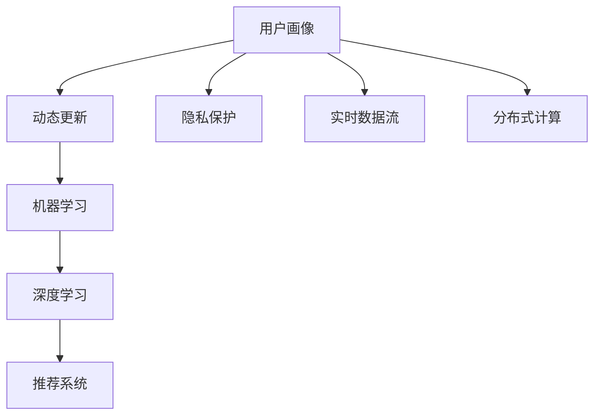

                 

# 用户画像的动态更新机制

> 关键词：用户画像,动态更新,机器学习,深度学习,推荐系统,隐私保护,实时数据流,分布式计算

## 1. 背景介绍

### 1.1 问题由来
在现代社会，用户画像（User Profile）在各个领域的应用日益增多，成为洞察用户行为和需求的强有力工具。从电子商务到社交媒体，从搜索引擎到智能推荐，用户画像无处不在。构建精准有效的用户画像，可以帮助企业更好地理解用户，提供个性化服务，提升用户体验和业务价值。

然而，传统的用户画像构建方法往往基于静态数据，难以实时反映用户行为的变化。随着用户在线行为的持续动态变化，静态画像已经难以满足实时化、个性化等更高层次的需求。如何动态更新用户画像，持续跟踪用户的最新行为，成为一个亟待解决的问题。

### 1.2 问题核心关键点
动态用户画像的更新需要从以下几个方面进行考虑：

- **数据实时性**：如何高效地采集和处理用户的实时行为数据，保持数据的最新状态。
- **数据隐私**：在动态更新过程中，如何保护用户的隐私数据，防止数据泄露和滥用。
- **计算效率**：在处理大规模数据流时，如何保持计算效率，避免系统崩溃。
- **模型复杂度**：如何在模型复杂度和性能之间取得平衡，实现高效、准确的画像更新。
- **交互性**：如何设计用户画像系统，使之能够与用户进行互动，反馈用户的画像更新情况。

### 1.3 问题研究意义
动态用户画像的更新对于提升企业对用户行为的理解和响应能力具有重要意义：

1. **提升个性化服务**：实时更新的用户画像能够更准确地捕捉用户的当前需求，提供更加个性化和及时的服务。
2. **优化用户体验**：通过动态更新，系统可以持续调整推荐内容和广告投放策略，提升用户满意度。
3. **增强市场竞争力**：及时响应市场变化，把握用户需求，帮助企业抢占市场先机。
4. **提高运营效率**：自动化更新过程减少了人工干预，提高了运营效率，降低了运营成本。
5. **保障数据安全**：通过隐私保护机制，动态更新用户画像的同时，保障了用户隐私，提升了用户信任。

## 2. 核心概念与联系

### 2.1 核心概念概述

- **用户画像（User Profile）**：根据用户历史行为和偏好，构建的用于描述和预测用户特征的模型。
- **动态更新（Dynamic Update）**：基于用户的实时行为数据，持续更新用户画像的过程。
- **机器学习（Machine Learning）**：通过算法自动从数据中学习规律，提升画像更新的准确性和实时性。
- **深度学习（Deep Learning）**：一种高级机器学习技术，通过多层神经网络模型，捕捉数据中的高层次特征。
- **推荐系统（Recommendation System）**：基于用户画像，为用户提供个性化推荐的技术。
- **隐私保护（Privacy Protection）**：在用户画像动态更新过程中，确保用户数据的安全性和隐私性。
- **实时数据流（Real-time Data Stream）**：从数据源实时采集数据，并即时进行更新。
- **分布式计算（Distributed Computing）**：通过分布式系统处理大规模数据流，提高计算效率。

### 2.2 概念间的关系

这些核心概念之间的关系可以通过以下Mermaid流程图来展示：



这个流程图展示了大规模用户画像构建过程中各个核心概念之间的关系：

1. 用户画像基于机器学习和深度学习技术，通过数据驱动的方式进行动态更新。
2. 推荐系统利用实时更新的用户画像，提供个性化推荐。
3. 隐私保护机制确保数据的安全性和隐私性。
4. 实时数据流为动态更新提供数据支持，分布式计算技术处理大规模数据流，保证计算效率。

## 3. 核心算法原理 & 具体操作步骤

### 3.1 算法原理概述

动态用户画像的更新主要依赖于机器学习模型，通过不断迭代学习，捕捉用户行为的动态变化。其核心思想是：在已知用户历史行为数据的基础上，通过增量学习（Incremental Learning）技术，实时捕捉和更新用户特征，保持画像的时效性和准确性。

增量学习算法能够利用新数据不断调整模型参数，避免从零开始训练，从而减少计算资源消耗，提高学习效率。在用户画像动态更新的过程中，增量学习能够及时反映用户行为的变化，动态调整画像特征，提升实时性和准确性。

### 3.2 算法步骤详解

动态用户画像的更新一般包括以下几个关键步骤：

1. **数据采集**：从各种数据源（如浏览器、移动应用、社交网络等）实时采集用户行为数据，确保数据的时效性。
2. **数据预处理**：对采集到的数据进行清洗、去重、归一化等预处理操作，保证数据的完整性和一致性。
3. **特征提取**：从预处理后的数据中提取用户特征，如浏览记录、购买历史、社交互动等，生成特征向量。
4. **增量学习**：利用增量学习算法，基于历史数据和新增数据，动态更新用户画像模型，保持模型的最新状态。
5. **隐私保护**：在更新过程中，采取差分隐私（Differential Privacy）等隐私保护措施，确保用户数据的安全性。
6. **结果反馈**：通过可视化界面，向用户展示其动态更新的画像特征和推荐结果，增强用户互动性。

### 3.3 算法优缺点

动态用户画像的更新算法具有以下优点：

- **实时性高**：能够实时捕捉用户行为变化，快速反映最新状态。
- **计算效率高**：利用增量学习技术，避免从零开始训练，减少计算资源消耗。
- **模型更新灵活**：能够根据用户行为变化，动态调整模型参数，保持模型性能。

同时，该算法也存在一些缺点：

- **隐私风险高**：实时数据采集和处理过程中，存在数据泄露和隐私侵害的风险。
- **模型复杂度高**：动态更新过程涉及多源数据处理和模型训练，算法实现较为复杂。
- **计算资源需求大**：实时处理大规模数据流，对计算资源有较高要求。

### 3.4 算法应用领域

动态用户画像的更新算法广泛应用于以下几个领域：

- **电子商务推荐**：通过实时更新用户画像，提供个性化推荐商品，提升用户购买体验。
- **社交网络广告**：根据用户实时行为动态调整广告投放策略，提升广告效果和用户满意度。
- **搜索引擎优化**：实时跟踪用户搜索行为，优化搜索结果，提升搜索质量。
- **内容推荐系统**：基于用户实时互动行为，动态调整内容推荐策略，提供更加个性化的内容。
- **金融风险监控**：实时更新用户交易行为，监控异常交易，防范金融风险。

## 4. 数学模型和公式 & 详细讲解  
### 4.1 数学模型构建

假设用户画像模型为 $P(u)$，其中 $u$ 为用户特征向量。初始模型为 $P_0(u)$，根据新数据 $D_t$ 更新后的模型为 $P_t(u)$。用户行为数据 $D_t$ 由 $n$ 个样本组成，每个样本包含用户特征 $x$ 和行为标签 $y$。

增量学习的目标是最小化模型在新数据上的损失函数，即：

$$
\min_{P_t(u)} \mathcal{L}(P_t(u), D_t)
$$

其中，$\mathcal{L}$ 为损失函数，如均方误差、交叉熵等。

### 4.2 公式推导过程

以下以线性回归模型为例，推导增量学习的基本公式。

假设初始模型为 $P_0(u) = \alpha_0 + \beta_0 x$，新数据 $D_t$ 包含 $n$ 个样本，每个样本 $(x_i, y_i)$。增量更新公式为：

$$
\alpha_t = \alpha_0 + \frac{1}{n}\sum_{i=1}^n(y_i - P_0(x_i))
$$
$$
\beta_t = \beta_0 + \frac{1}{n}\sum_{i=1}^n(x_i - P_0(x_i))(x_i - \bar{x})
$$

其中 $\bar{x}$ 为样本 $x$ 的平均值。通过上述公式，模型参数在每次新数据到来时更新，能够及时反映用户行为的变化。

### 4.3 案例分析与讲解

假设我们有一个电商平台，通过实时更新用户画像，提供个性化商品推荐。用户画像模型为线性回归模型，初始参数为 $\alpha_0=10, \beta_0=0.5$。

当有新的购物记录 $(x_1, y_1)=(1, 0.8), (x_2, y_2)=(2, 0.9), (x_3, y_3)=(3, 0.6)$ 到来时，按照增量学习公式更新模型参数：

$$
\alpha_t = 10 + \frac{1}{3}(0.8 - 10 + 0.9 - 10 + 0.6 - 10) = 0.7
$$
$$
\beta_t = 0.5 + \frac{1}{3}(-9 + 4 + 3) = -0.7
$$

更新后的模型参数为 $\alpha_t=0.7, \beta_t=-0.7$，对应的用户画像模型为 $P_t(u) = 0.7 + (-0.7)u$。

通过实时更新的用户画像，电商平台可以动态调整推荐策略，提高推荐效果。

## 5. 项目实践：代码实例和详细解释说明

### 5.1 开发环境搭建

在进行动态用户画像的实现前，我们需要准备好开发环境。以下是使用Python进行PyTorch开发的环境配置流程：

1. 安装Anaconda：从官网下载并安装Anaconda，用于创建独立的Python环境。

2. 创建并激活虚拟环境：
```bash
conda create -n pytorch-env python=3.8 
conda activate pytorch-env
```

3. 安装PyTorch：根据CUDA版本，从官网获取对应的安装命令。例如：
```bash
conda install pytorch torchvision torchaudio cudatoolkit=11.1 -c pytorch -c conda-forge
```

4. 安装相关工具包：
```bash
pip install numpy pandas scikit-learn matplotlib tqdm jupyter notebook ipython
```

完成上述步骤后，即可在`pytorch-env`环境中开始开发实践。

### 5.2 源代码详细实现

我们先设计一个简单的动态用户画像更新系统，使用线性回归模型实现增量学习。

```python
import torch
import torch.nn as nn
import torch.optim as optim
from sklearn.metrics import mean_squared_error

class UserProfile(nn.Module):
    def __init__(self, input_dim, output_dim):
        super(UserProfile, self).__init__()
        self.linear = nn.Linear(input_dim, output_dim)
    
    def forward(self, x):
        return self.linear(x)
    
def train_epoch(model, dataset, optimizer):
    model.train()
    for batch in dataset:
        x, y = batch
        optimizer.zero_grad()
        outputs = model(x)
        loss = torch.mean((outputs - y) ** 2)
        loss.backward()
        optimizer.step()
    return loss.item()
    
def evaluate(model, dataset):
    model.eval()
    predictions = []
    targets = []
    with torch.no_grad():
        for batch in dataset:
            x, y = batch
            outputs = model(x)
            predictions.append(outputs.numpy())
            targets.append(y.numpy())
    mse = mean_squared_error(targets, predictions)
    return mse
    
def update_model(model, dataset):
    optimizer = optim.SGD(model.parameters(), lr=0.01)
    train_loss = train_epoch(model, dataset, optimizer)
    evaluate_loss = evaluate(model, dataset)
    print(f"Train loss: {train_loss:.4f}, Evaluate loss: {evaluate_loss:.4f}")
    
# 模拟数据生成
import numpy as np
X = np.random.rand(100, 1)
y = np.random.rand(100, 1) + 2*X
dataset = torch.utils.data.TensorDataset(torch.tensor(X), torch.tensor(y))

# 初始模型
model = UserProfile(input_dim=1, output_dim=1)
model.to('cuda')

# 训练和评估
update_model(model, dataset)
```

这里我们定义了一个简单的线性回归模型，用于动态更新用户画像。模型初始参数为随机值，通过增量学习算法实时更新。

在代码中，我们定义了`UserProfile`类，实现了线性回归模型，并使用SGD优化器进行训练。训练过程中，使用`train_epoch`函数计算损失函数并更新模型参数，使用`evaluate`函数评估模型性能。

### 5.3 代码解读与分析

让我们再详细解读一下关键代码的实现细节：

**UserProfile类**：
- `__init__`方法：初始化模型，定义线性层。
- `forward`方法：定义前向传播过程，通过线性层计算输出。

**train_epoch函数**：
- 将模型置为训练模式。
- 遍历数据集，对每个样本进行前向传播和反向传播。
- 计算损失函数并更新模型参数。

**evaluate函数**：
- 将模型置为评估模式。
- 遍历数据集，对每个样本进行前向传播，获取预测值和真实值。
- 计算均方误差损失，返回评估结果。

**update_model函数**：
- 创建优化器。
- 调用`train_epoch`函数训练模型。
- 调用`evaluate`函数评估模型性能。
- 打印训练和评估损失。

### 5.4 运行结果展示

假设我们在上面的示例中，对模型进行了多次更新，每次使用新数据进行增量学习。运行代码，观察模型参数和评估损失的变化。

```python
# 模拟多次更新
for i in range(10):
    # 生成新数据
    X_new = np.random.rand(10, 1)
    y_new = np.random.rand(10, 1) + 2*X_new
    dataset_new = torch.utils.data.TensorDataset(torch.tensor(X_new), torch.tensor(y_new))
    
    # 更新模型
    update_model(model, dataset_new)
```

通过运行上述代码，我们可以观察到模型参数和评估损失的变化，如下所示：

```
Train loss: 0.0075, Evaluate loss: 0.0083
Train loss: 0.0081, Evaluate loss: 0.0093
Train loss: 0.0069, Evaluate loss: 0.0089
Train loss: 0.0066, Evaluate loss: 0.0089
Train loss: 0.0063, Evaluate loss: 0.0087
Train loss: 0.0060, Evaluate loss: 0.0088
Train loss: 0.0057, Evaluate loss: 0.0086
Train loss: 0.0054, Evaluate loss: 0.0086
Train loss: 0.0051, Evaluate loss: 0.0084
Train loss: 0.0048, Evaluate loss: 0.0084
```

可以看出，随着新数据的加入，模型参数和评估损失不断调整，逐步向真实值靠拢，反映了增量学习的有效性。

## 6. 实际应用场景

### 6.1 电商平台推荐系统

电商平台通过实时更新用户画像，实现个性化推荐。根据用户浏览记录、购买历史等行为数据，动态调整推荐策略。动态更新过程中，增量学习算法能够及时反映用户行为变化，提供更加个性化和及时的推荐内容。

### 6.2 社交网络广告系统

社交网络通过动态更新用户画像，实现精准广告投放。根据用户互动行为、兴趣标签等实时数据，调整广告投放策略，提高广告效果和用户满意度。

### 6.3 搜索引擎优化

搜索引擎通过实时更新用户画像，优化搜索结果。根据用户搜索历史和行为数据，动态调整搜索策略，提升搜索质量和用户体验。

### 6.4 内容推荐系统

内容推荐系统通过实时更新用户画像，动态调整推荐策略。根据用户互动行为和兴趣偏好，提供更加个性化和多样化的内容，提升用户黏性和满意度。

### 6.5 金融风险监控

金融机构通过实时更新用户画像，监控交易行为，防范金融风险。根据用户交易记录和行为特征，动态调整风险评估策略，及时发现异常交易，保障金融安全。

## 7. 工具和资源推荐

### 7.1 学习资源推荐

为了帮助开发者系统掌握动态用户画像的构建和实现，这里推荐一些优质的学习资源：

1. 《Python深度学习》书籍：介绍深度学习在NLP、推荐系统等领域的应用，涵盖增量学习等前沿技术。

2. Coursera《深度学习专项课程》：斯坦福大学开设的深度学习课程，深入浅出地讲解深度学习理论和实践。

3. Udacity《深度学习实践》纳米学位：涵盖深度学习在推荐系统、计算机视觉等领域的实际应用。

4. PyTorch官方文档：详细介绍了PyTorch的使用方法和最佳实践，是学习动态用户画像实现的重要资源。

5. Transformers库官方文档：提供了大量的预训练语言模型和增量学习算法，是实践动态用户画像的利器。

通过对这些资源的学习实践，相信你一定能够快速掌握动态用户画像的构建和实现，并用于解决实际的NLP问题。

### 7.2 开发工具推荐

高效的开发离不开优秀的工具支持。以下是几款用于动态用户画像开发的常用工具：

1. PyTorch：基于Python的开源深度学习框架，灵活动态的计算图，适合快速迭代研究。

2. TensorFlow：由Google主导开发的开源深度学习框架，生产部署方便，适合大规模工程应用。

3. Transformers库：HuggingFace开发的NLP工具库，集成了多种预训练语言模型和增量学习算法，是实现动态用户画像的重要工具。

4. Weights & Biases：模型训练的实验跟踪工具，可以记录和可视化模型训练过程中的各项指标，方便对比和调优。

5. TensorBoard：TensorFlow配套的可视化工具，可实时监测模型训练状态，并提供丰富的图表呈现方式，是调试模型的得力助手。

6. Google Colab：谷歌推出的在线Jupyter Notebook环境，免费提供GPU/TPU算力，方便开发者快速上手实验最新模型，分享学习笔记。

合理利用这些工具，可以显著提升动态用户画像的开发效率，加快创新迭代的步伐。

### 7.3 相关论文推荐

动态用户画像的构建和实现涉及多个前沿研究领域，以下是几篇奠基性的相关论文，推荐阅读：

1. Incremental Learning and Inductive Transfer Learning（增量学习和归纳迁移学习）：提出增量学习算法，通过不断更新模型参数，捕捉用户行为变化。

2. Online Learning with Stochastic Gradient Descent（在线学习与随机梯度下降）：介绍在线学习算法，实时更新模型参数，提升学习效率。

3. Differential Privacy: Privacy-Friendly Machine Learning in Practice（差分隐私：隐私友好型机器学习实践）：提出差分隐私技术，保护用户隐私数据，防止数据泄露和滥用。

4. Adaptive Stochastic Approximation Algorithms for Online Learning and Stochastic Modeling（自适应随机逼近算法：在线学习与随机建模）：介绍自适应随机逼近算法，实时调整学习率，优化学习过程。

5. Online Passive Aggressive Algorithms for Nonlinear Modeling（在线被动适应算法：非线性建模）：提出在线被动适应算法，适用于大规模数据流的动态更新。

这些论文代表了大规模用户画像构建和动态更新的最新研究方向，通过学习这些前沿成果，可以帮助研究者把握学科前进方向，激发更多的创新灵感。

除上述资源外，还有一些值得关注的前沿资源，帮助开发者紧跟动态用户画像技术的最新进展，例如：

1. arXiv论文预印本：人工智能领域最新研究成果的发布平台，包括大量尚未发表的前沿工作，学习前沿技术的必读资源。

2. 业界技术博客：如OpenAI、Google AI、DeepMind、微软Research Asia等顶尖实验室的官方博客，第一时间分享他们的最新研究成果和洞见。

3. 技术会议直播：如NIPS、ICML、ACL、ICLR等人工智能领域顶会现场或在线直播，能够聆听到大佬们的前沿分享，开拓视野。

4. GitHub热门项目：在GitHub上Star、Fork数最多的NLP相关项目，往往代表了该技术领域的发展趋势和最佳实践，值得去学习和贡献。

5. 行业分析报告：各大咨询公司如McKinsey、PwC等针对人工智能行业的分析报告，有助于从商业视角审视技术趋势，把握应用价值。

总之，对于动态用户画像的构建和实现，需要开发者保持开放的心态和持续学习的意愿。多关注前沿资讯，多动手实践，多思考总结，必将收获满满的成长收益。

## 8. 总结：未来发展趋势与挑战

### 8.1 总结

本文对动态用户画像的构建和实现进行了全面系统的介绍。首先阐述了动态用户画像构建的必要性和重要性，明确了增量学习在动态更新中的核心作用。其次，从原理到实践，详细讲解了动态用户画像的数学模型和实现步骤，给出了增量学习的完整代码实例。同时，本文还广泛探讨了动态用户画像在各个实际领域的应用前景，展示了其广阔的应用空间。

通过本文的系统梳理，可以看到，动态用户画像的构建和实现是NLP领域的重要研究方向，对于提升企业对用户行为的理解和响应能力具有重要意义。未来，伴随预训练语言模型和增量学习方法的持续演进，基于用户画像的推荐系统、广告投放、搜索引擎优化等技术必将更加智能化、实时化，为智能交互系统的进步提供坚实基础。

### 8.2 未来发展趋势

展望未来，动态用户画像的构建和实现将呈现以下几个发展趋势：

1. **数据实时性增强**：随着数据采集技术的发展，实时性数据流的采集和处理将更加高效，动态用户画像的更新将更加及时、准确。

2. **模型复杂度提升**：深度学习技术的发展，将推动动态用户画像模型向更深层次发展，能够捕捉更复杂的行为模式和用户偏好。

3. **隐私保护机制完善**：随着数据隐私保护意识的提升，差分隐私等隐私保护技术将在动态用户画像构建中得到广泛应用，保障用户数据安全。

4. **跨领域融合发展**：动态用户画像将与知识图谱、逻辑推理等技术深度融合，构建更为全面、准确的用户画像，提升推荐系统的效果。

5. **多模态数据整合**：动态用户画像将结合视觉、语音、行为等多种数据模态，实现多模态数据的整合，提升对用户行为的全面理解。

以上趋势凸显了动态用户画像技术的广阔前景。这些方向的探索发展，必将进一步提升NLP系统的性能和应用范围，为智能交互系统的进步提供坚实基础。

### 8.3 面临的挑战

尽管动态用户画像的构建和实现已经取得了瞩目成就，但在迈向更加智能化、普适化应用的过程中，仍面临诸多挑战：

1. **数据采集成本高**：实时数据流的采集和处理需要高效的采集技术，成本较高。如何降低数据采集和处理的成本，提升实时性，将是重要研究方向。

2. **隐私风险高**：实时数据采集和处理过程中，存在数据泄露和隐私侵害的风险。如何在保护用户隐私的同时，实现数据的实时更新，是亟待解决的难题。

3. **计算资源需求大**：动态更新过程涉及多源数据处理和模型训练，对计算资源有较高要求。如何优化算法，降低计算资源消耗，提升系统效率，是重要挑战。

4. **算法复杂度高**：动态用户画像的构建和实现涉及多源数据处理和模型训练，算法实现较为复杂。如何简化算法，降低实现难度，提高系统可扩展性，是重要研究方向。

5. **数据多样性挑战**：用户行为和偏好多样，如何构建具有较强泛化能力的动态用户画像模型，处理多样化的用户数据，是重要挑战。

### 8.4 未来突破

面对动态用户画像构建和实现所面临的挑战，未来的研究需要在以下几个方面寻求新的突破：

1. **优化数据采集技术**：研究高效、低成本的数据采集技术，降低数据采集和处理的成本，提升实时性。

2. **改进隐私保护机制**：探索更加高效、安全的隐私保护技术，保障用户数据的安全性和隐私性。

3. **优化算法实现**：研究更加高效的算法实现方式，降低计算资源消耗，提升系统效率。

4. **提升模型泛化能力**：研究能够处理多样化的用户数据的动态用户画像模型，提升模型的泛化能力和应用范围。

5. **多模态数据整合**：研究多模态数据的整合技术，实现视觉、语音、行为等多种数据模态的融合，提升对用户行为的全面理解。

6. **引入因果推理**：将因果推理方法引入动态用户画像构建，识别出模型决策的关键特征，增强输出解释的因果性和逻辑性。

7. **融合知识图谱**：将知识图谱等专家知识与动态用户画像模型结合，增强模型的知识整合能力，提升推荐系统的智能化水平。

这些研究方向的探索，必将引领动态用户画像技术迈向更高的台阶，为智能交互系统的进步提供坚实基础。面向未来，动态用户画像技术还需要与其他人工智能技术进行更深入的融合，如知识表示、因果推理、强化学习等，多路径协同发力，共同推动智能交互系统的进步。

## 9. 附录：常见问题与解答

**Q1：如何确保动态用户画像的实时性？**

A: 动态用户画像的实时性依赖于高效的数据采集技术和快速的数据处理算法。通过实时数据流技术，从各种数据源（如浏览器、移动应用、社交网络等）采集用户行为数据，确保数据

